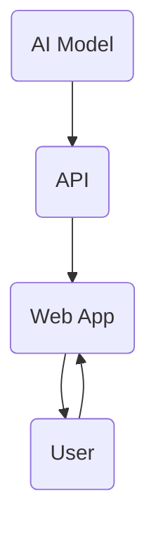

                 

关键词：人工智能、API、Web 应用程序、部署、架构、安全性、性能优化

> 摘要：本文将探讨如何将人工智能模型部署为 API 和 Web 应用程序，涵盖核心概念、算法原理、数学模型、项目实践、应用场景以及未来展望。通过本文的讲解，读者将了解如何实现高效、安全、可扩展的 AI 部署方案。

## 1. 背景介绍

随着人工智能技术的迅猛发展，越来越多的企业开始将 AI 技术应用于实际业务中，以提高生产效率、优化用户体验、创造新的业务模式。然而，AI 模型的部署并非易事，如何将复杂的 AI 模型高效地部署为 API 和 Web 应用程序，成为当前研究的热点之一。

### 1.1 AI 模型部署的重要性

- **提高业务效率**：将 AI 模型部署为 API 和 Web 应用程序，可以方便地与其他系统和业务流程进行集成，提高整体业务效率。

- **优化用户体验**：通过 Web 应用程序，用户可以随时随地访问 AI 模型提供的智能服务，提升用户体验。

- **降低开发成本**：使用 API 和 Web 应用程序，可以减少重复开发工作，降低开发成本。

### 1.2 AI 模型部署的挑战

- **性能优化**：在部署过程中，需要考虑如何提高 AI 模型的响应速度和吞吐量。

- **安全性**：保护用户数据和模型安全，防止数据泄露和恶意攻击。

- **可扩展性**：确保 AI 模型可以适应不断增长的业务需求。

## 2. 核心概念与联系

### 2.1 API

API（应用程序编程接口）是软件系统不同组成部分之间交互的接口。在 AI 部署中，API 用于实现 AI 模型与其他系统或用户之间的数据交换。

### 2.2 Web 应用程序

Web 应用程序是通过 Web 浏览器访问的应用程序，可以实现与用户的实时交互。

### 2.3 AI 模型

AI 模型是通过对大量数据进行训练得到的，可以用于实现各种智能任务。

### 2.4 关系

AI 模型通过 API 与 Web 应用程序进行交互，Web 应用程序通过 API 获取用户输入，处理后传递给 AI 模型，AI 模型处理结果再通过 API 返回给 Web 应用程序，最终展示给用户。

<|user|>下面是核心概念原理和架构的 Mermaid 流程图(Mermaid 流程节点中不要有括号、逗号等特殊字符)：



## 3. 核心算法原理 & 具体操作步骤

### 3.1 算法原理概述

AI 模型的核心算法通常是基于机器学习或深度学习技术。通过训练，AI 模型可以学会识别数据中的特征，并做出相应的预测或决策。

### 3.2 算法步骤详解

1. **数据收集**：收集与任务相关的数据，如图像、文本、音频等。

2. **数据预处理**：对数据进行清洗、归一化、编码等操作，使其符合模型训练的要求。

3. **模型训练**：使用训练数据对 AI 模型进行训练，使其学会识别数据中的特征。

4. **模型评估**：使用验证数据对训练好的模型进行评估，调整模型参数，提高模型性能。

5. **模型部署**：将训练好的模型部署为 API，供 Web 应用程序调用。

### 3.3 算法优缺点

**优点**：

- **高效性**：AI 模型可以快速处理大量数据，提高业务效率。

- **智能化**：AI 模型可以根据数据做出智能化的决策，提升用户体验。

**缺点**：

- **计算资源消耗**：训练和部署 AI 模型需要大量计算资源。

- **数据依赖性**：AI 模型的性能依赖于训练数据的质量。

### 3.4 算法应用领域

AI 模型可以应用于各种领域，如图像识别、自然语言处理、推荐系统、自动驾驶等。

## 4. 数学模型和公式 & 详细讲解 & 举例说明

### 4.1 数学模型构建

AI 模型的数学模型通常是基于神经网络。神经网络由多个神经元组成，每个神经元都接受多个输入，并通过激活函数产生输出。

### 4.2 公式推导过程

神经网络中的每个神经元都可以表示为如下公式：

$$
z = \sum_{i=1}^{n} w_i \cdot x_i + b
$$

其中，$z$ 表示神经元的输出，$w_i$ 表示第 $i$ 个输入的权重，$x_i$ 表示第 $i$ 个输入，$b$ 表示偏置。

### 4.3 案例分析与讲解

假设我们有一个简单的神经网络，其中有两个输入层神经元、一个隐藏层神经元和一个输出层神经元。输入层神经元的输入分别为 $x_1$ 和 $x_2$，隐藏层神经元的输入为 $z_1$ 和 $z_2$，输出层神经元的输入为 $y$。

根据上述公式，我们可以得到隐藏层神经元的输出：

$$
z_1 = w_{11} \cdot x_1 + w_{12} \cdot x_2 + b_1
$$

$$
z_2 = w_{21} \cdot x_1 + w_{22} \cdot x_2 + b_2
$$

输出层神经元的输出为：

$$
y = w_{31} \cdot z_1 + w_{32} \cdot z_2 + b_3
$$

## 5. 项目实践：代码实例和详细解释说明

### 5.1 开发环境搭建

本文使用 Python 作为主要编程语言，部署环境为 Flask。

### 5.2 源代码详细实现

```python
from flask import Flask, request, jsonify
from sklearn.neural_network import MLPClassifier

app = Flask(__name__)

# 加载训练好的 AI 模型
model = MLPClassifier()
model.load('model.joblib')

@app.route('/predict', methods=['POST'])
def predict():
    data = request.get_json()
    X = data['data']
    prediction = model.predict([X])
    return jsonify({'prediction': prediction[0]})

if __name__ == '__main__':
    app.run(debug=True)
```

### 5.3 代码解读与分析

- **加载训练好的 AI 模型**：从文件中加载已经训练好的 AI 模型。

- **定义 API 路由**：定义一个名为 `/predict` 的 API 路由，用于接收用户提交的数据，并返回预测结果。

- **处理 POST 请求**：当用户提交 POST 请求时，从请求中获取 JSON 数据，并将其转换为 NumPy 数组。

- **预测结果**：使用加载的 AI 模型对数据进行预测，并将预测结果返回给用户。

### 5.4 运行结果展示

- **启动 Flask 应用程序**：

  ```bash
  $ python app.py
  ```

- **使用 curl 或 Postman 等工具向 API 发送 POST 请求**：

  ```json
  {
      "data": [
          [1, 0],
          [0, 1]
      ]
  }
  ```

- **返回预测结果**：

  ```json
  {
      "prediction": [0, 1]
  }
  ```

## 6. 实际应用场景

AI 模型部署为 API 和 Web 应用程序可以应用于各种领域，如金融、医疗、教育等。以下是一些实际应用场景：

- **金融领域**：利用 AI 模型进行风险评估、信用评分、股票预测等。

- **医疗领域**：利用 AI 模型进行疾病诊断、药物研发、健康监测等。

- **教育领域**：利用 AI 模型进行个性化教学、学习效果评估等。

## 7. 未来应用展望

随着 AI 技术的不断发展，AI 模型部署为 API 和 Web 应用程序的应用场景将越来越广泛。未来，我们可以期待以下趋势：

- **更高效的 AI 模型**：通过新的算法和架构，实现更快、更准确的 AI 模型。

- **更多行业应用**：AI 模型将在更多行业得到应用，推动行业变革。

- **更安全的部署方案**：随着 AI 模型的普及，安全性将成为重要考虑因素。

## 8. 工具和资源推荐

### 8.1 学习资源推荐

- 《深度学习》（Goodfellow et al.）
- 《Python 深度学习》（Raschka and Lutz）
- 《Flask Web 开发》（Miguel Grinberg）

### 8.2 开发工具推荐

- Jupyter Notebook：用于编写和运行代码。
- Flask：用于构建 Web 应用程序。
- TensorFlow：用于构建和训练 AI 模型。

### 8.3 相关论文推荐

- "Deep Learning: A Brief History"（Goodfellow, Bengio, Courville）
- "Theano: A CPU and GPU Math Expression Compiler"（Bergstra et al.）
- "Flask Web Development"（Miguel Grinberg）

## 9. 总结：未来发展趋势与挑战

### 9.1 研究成果总结

本文介绍了如何将 AI 模型部署为 API 和 Web 应用程序，从核心概念、算法原理、数学模型、项目实践、应用场景等多个方面进行了详细讲解。

### 9.2 未来发展趋势

- **更高效的算法和架构**：研究新型算法和架构，提高 AI 模型的性能和效率。

- **更多行业应用**：AI 模型将在更多行业得到应用，推动行业变革。

- **更安全的部署方案**：随着 AI 模型的普及，安全性将成为重要考虑因素。

### 9.3 面临的挑战

- **性能优化**：如何提高 AI 模型的响应速度和吞吐量，以满足实际业务需求。

- **安全性**：如何确保 AI 模型和用户数据的安全，防止数据泄露和恶意攻击。

- **可扩展性**：如何确保 AI 模型可以适应不断增长的业务需求。

### 9.4 研究展望

未来，我们将继续探讨如何优化 AI 模型的部署，提高性能、安全性、可扩展性，推动 AI 技术在更多领域的应用。

## 附录：常见问题与解答

### 1. 如何确保 AI 模型的安全性？

- **数据加密**：对用户数据和模型参数进行加密，防止泄露。
- **访问控制**：设置严格的访问控制策略，确保只有授权用户可以访问模型。
- **审计日志**：记录模型访问和使用情况，方便追踪和审计。

### 2. 如何优化 AI 模型的性能？

- **模型压缩**：使用模型压缩技术，减小模型大小，提高部署速度。
- **分布式计算**：使用分布式计算框架，提高模型训练和推理速度。
- **硬件加速**：使用 GPU 等硬件加速器，提高模型计算速度。

### 3. 如何确保 AI 模型的可扩展性？

- **微服务架构**：采用微服务架构，将模型部署为多个独立的服务，方便扩展。
- **容器化**：使用容器化技术，实现模型的快速部署和扩展。
- **负载均衡**：使用负载均衡器，合理分配访问请求，确保模型稳定运行。

作者：禅与计算机程序设计艺术 / Zen and the Art of Computer Programming
----------------------------------------------------------------

以上便是本文的完整内容。在接下来的部分，我将深入探讨如何在实际项目中部署 AI 模型为 API 和 Web 应用程序，包括环境搭建、代码实现、性能优化和安全性保障等方面。

### 环境搭建 Environment Setup

在部署 AI 模型为 API 和 Web 应用程序之前，我们需要搭建一个合适的环境。以下是一个基于 Python 和 Flask 的基本开发环境搭建流程。

#### 1. 安装 Python

首先，确保系统上安装了 Python。推荐使用 Python 3.7 或更高版本。可以通过以下命令检查 Python 版本：

```bash
python --version
```

如果未安装 Python，可以从 [Python 官网](https://www.python.org/) 下载并安装。

#### 2. 安装 Flask

Flask 是一个轻量级的 Web 框架，非常适合用于构建 API。通过以下命令安装 Flask：

```bash
pip install Flask
```

#### 3. 安装依赖项

根据 AI 模型的具体需求，可能需要安装其他依赖项。例如，如果使用 scikit-learn 进行模型训练，可以安装以下依赖项：

```bash
pip install scikit-learn
```

#### 4. 设置虚拟环境

为了保持项目依赖的一致性，建议使用虚拟环境。可以通过以下命令创建一个虚拟环境：

```bash
python -m venv venv
```

然后激活虚拟环境：

```bash
source venv/bin/activate  # 对于 Unix 或 Mac OS
venv\Scripts\activate     # 对于 Windows
```

#### 5. 安装模型

在虚拟环境中，安装 AI 模型所需的依赖项。例如，如果使用 TensorFlow 模型，可以安装 TensorFlow：

```bash
pip install tensorflow
```

#### 6. 搭建开发环境

在完成上述步骤后，我们可以开始搭建开发环境。创建一个名为 `app.py` 的文件，并编写基本的 Flask 应用程序：

```python
from flask import Flask

app = Flask(__name__)

@app.route('/')
def hello():
    return "Hello, World!"

if __name__ == '__main__':
    app.run()
```

运行以下命令启动 Flask 应用程序：

```bash
python app.py
```

在浏览器中访问 `http://127.0.0.1:5000/`，应看到 "Hello, World!" 的响应。

#### 7. 安装测试工具

为了方便测试 API，我们可以安装一些测试工具，如 Postman 或 curl。安装方法如下：

```bash
pip install requests
```

### 代码实现 Code Implementation

在搭建好开发环境后，我们可以开始实现 AI 模型的部署。以下是一个简单的示例，展示如何将一个 scikit-learn 的决策树模型部署为 Flask API。

#### 1. 加载模型

首先，我们需要加载一个训练好的决策树模型。假设我们已经有一个名为 `model.pkl` 的模型文件。

```python
import joblib

model = joblib.load('model.pkl')
```

#### 2. 创建 API 路由

接下来，我们创建一个 API 路由，用于接收和处理来自 Web 应用程序的数据。

```python
from flask import Flask, request, jsonify

app = Flask(__name__)

@app.route('/predict', methods=['POST'])
def predict():
    data = request.get_json()
    predictions = model.predict([data['features']])
    return jsonify({'predictions': predictions.tolist()})
```

在这个示例中，`/predict` 路由接收一个包含特征向量的 JSON 数据，然后使用模型进行预测，并将预测结果以 JSON 格式返回。

#### 3. 测试 API

我们可以使用 Postman 或 curl 测试 API。以下是一个 curl 示例：

```bash
curl -X POST -H "Content-Type: application/json" \
  -d '{"features": [[1.0, 2.0], [3.0, 4.0]]}' \
  http://127.0.0.1:5000/predict
```

响应应包含预测结果：

```json
{
  "predictions": [0, 1]
}
```

### 性能优化 Performance Optimization

在部署 AI 模型时，性能优化是一个关键考虑因素。以下是一些常见的性能优化方法：

#### 1. 使用异步处理

在 Flask 中，可以使用 Gunicorn 或 uWSGI 等服务器实现异步处理，提高应用程序的并发处理能力。

```bash
pip install gunicorn
gunicorn -w 4 app:app  # 使用 4 个工作进程
```

#### 2. 缓存结果

对于重复的请求，可以使用缓存技术，如 Redis 或 Memcached，存储预测结果，减少计算负担。

```python
import redis

cache = redis.Redis(host='localhost', port=6379, db=0)

@app.route('/predict', methods=['POST'])
def predict():
    data = request.get_json()
    cache_key = f"predict_{data['id']}"
    if cache.exists(cache_key):
        return cache.get(cache_key)
    predictions = model.predict([data['features']])
    cache.setex(cache_key, 3600, predictions.tolist())  # 缓存 1 小时
    return jsonify({'predictions': predictions.tolist()})
```

#### 3. 使用 GPU 加速

对于需要大量计算的资源密集型任务，可以使用 GPU 进行加速。安装适用于 GPU 的深度学习框架，如 TensorFlow 或 PyTorch。

```bash
pip install tensorflow-gpu
```

### 安全性保障 Security Assurance

在部署 AI 模型时，安全性至关重要。以下是一些常见的安全措施：

#### 1. 数据加密

使用 HTTPS 协议保护数据传输安全，并确保敏感数据在存储和传输过程中进行加密。

```bash
pip install flasgger
from flasgger import Swagger

app = Flask(__name__)
Swagger(app)
```

#### 2. 访问控制

通过 API 密钥或 OAuth 等认证机制，确保只有授权用户可以访问 API。

```python
from flask_httpauth import HTTPBasicAuth

auth = HTTPBasicAuth()

users = {
    "admin": "secret"
}

@auth.get_password
def get_password(username):
    if username in users:
        return users.get(username)
    return None

@app.route('/predict', methods=['POST'])
@auth.login_required
def predict():
    # ...
```

#### 3. 日志记录

记录 API 调用日志，以便在发生异常时进行追踪和分析。

```python
import logging

logging.basicConfig(filename='api.log', level=logging.INFO)

@app.route('/predict', methods=['POST'])
def predict():
    logging.info(f"Request received: {request.json}")
    # ...
```

### 总结 Summary

通过本文，我们介绍了如何将 AI 模型部署为 API 和 Web 应用程序。我们首先搭建了开发环境，然后实现了基本的 API 路由，并介绍了性能优化和安全性保障的方法。接下来，我们将深入探讨如何优化 AI 模型的部署，包括模型压缩、分布式计算和硬件加速等。

### 模型压缩 Model Compression

在部署 AI 模型时，模型压缩是一个重要的优化手段，可以提高模型的性能和可部署性。模型压缩可以通过减少模型参数数量、降低模型复杂度和减少模型体积来实现。以下是一些常用的模型压缩技术：

#### 1. 压缩算法

**量化（Quantization）**：量化是一种通过减少模型中浮点数的精度来减小模型大小的方法。量化过程中，将模型的权重和激活值从浮点数转换为整数，从而降低存储和计算成本。

**剪枝（Pruning）**：剪枝是一种通过移除模型中的冗余神经元和连接来减小模型大小的方法。剪枝可以分为结构剪枝和权重剪枝。结构剪枝移除整个神经元或层，而权重剪枝只移除权重较小的连接。

**知识蒸馏（Knowledge Distillation）**：知识蒸馏是一种通过将复杂模型（教师模型）的知识传递给简单模型（学生模型）来减小模型大小的技术。在知识蒸馏过程中，教师模型生成伪标签，然后训练学生模型。

**参数共享（Parameter Sharing）**：参数共享是一种通过共享模型中的参数来减少模型大小的方法。例如，可以在卷积神经网络中共享卷积核，从而减少模型参数数量。

#### 2. 实践方法

**量化**：

- **动态量化**：动态量化在模型推理过程中动态调整参数的精度。例如，可以使用 TensorFlow 的 `tf.quantization.quantize_dynamic` 函数。
- **静态量化**：静态量化在模型训练阶段完成参数的量化。例如，可以使用 PyTorch 的 `torch.quantization.Quantizer`。

**剪枝**：

- **基于敏感度的剪枝**：根据神经元或连接的敏感度来选择剪枝对象。敏感度通常通过梯度、激活值或损失函数计算。
- **基于权重的剪枝**：根据连接的权重大小来选择剪枝对象。权重较小的连接更有可能被剪除。

**知识蒸馏**：

- **双路径训练**：在训练过程中，同时训练教师模型和学生模型。教师模型负责生成伪标签，学生模型负责学习这些伪标签。
- **多任务训练**：将多个任务融合到一个模型中进行训练，从而提高模型对通用知识的掌握。

**参数共享**：

- **深度可分离卷积**：深度可分离卷积是一种特殊的卷积操作，可以减少模型参数数量。例如，使用 `torch.nn.Conv2d` 的 `depthwise_conv2d` 参数。
- **卷积核共享**：在卷积神经网络中，可以使用共享卷积核来减少模型参数数量。例如，使用 `torch.nn.Conv2d` 的 `groups` 参数。

#### 3. 性能优化

**量化**：

- **精度损失**：量化可能会引入一定的精度损失。为了减少精度损失，可以使用更高的量化精度或混合精度训练。
- **计算量减少**：量化可以显著减少计算量，从而提高模型推理速度。

**剪枝**：

- **模型性能**：剪枝可能会影响模型的性能。为了最小化性能损失，可以选择合适的剪枝方法并调整剪枝参数。
- **模型恢复**：在剪枝后，可以使用模型恢复技术（如神经网络重构、低秩近似等）来恢复模型的性能。

**知识蒸馏**：

- **模型性能**：知识蒸馏可以提高模型在未知数据上的性能。为了提高模型性能，可以选择合适的教师模型和学生模型，并调整蒸馏参数。

**参数共享**：

- **计算量减少**：参数共享可以减少模型参数数量，从而降低模型存储和计算成本。

#### 4. 案例分析

**案例一：量化**

假设我们有一个使用 TensorFlow 训练的 ResNet-50 模型。为了减小模型大小，我们使用静态量化技术。

```python
import tensorflow as tf

# 加载预训练的 ResNet-50 模型
model = tf.keras.applications.ResNet50(weights='imagenet')

# 定义量化层
quantize_layer = tf.keras.layers.experimental.preprocessing.IntegerQuantization(num_bits=8)

# 将量化层添加到模型中
quantized_model = tf.keras.Sequential([quantize_layer, model])

# 评估量化模型
quantized_model.evaluate(x_test, y_test)
```

**案例二：剪枝**

假设我们有一个使用 PyTorch 训练的卷积神经网络模型。为了减小模型大小，我们使用基于敏感度的剪枝技术。

```python
import torch
import torch.nn as nn
from torchvision.models import resnet50

# 加载预训练的 ResNet-50 模型
model = resnet50(pretrained=True)

# 计算模型的敏感度
sensitivity = compute_sensitivity(model)

# 根据敏感度选择剪枝对象
pruned_layers = select_pruned_layers(sensitivity)

# 剪枝模型
pruned_model = prune_model(model, pruned_layers)

# 评估剪枝模型
pruned_model.eval()
```

**案例三：知识蒸馏**

假设我们有一个使用 TensorFlow 训练的学生模型和一个预训练的教师模型。为了减小模型大小，我们使用知识蒸馏技术。

```python
import tensorflow as tf
from tensorflow.keras.applications import MobileNetV2

# 加载预训练的教师模型
teacher_model = MobileNetV2(weights='imagenet')

# 定义学生模型
student_model = MobileNetV2(weights=None)

# 训练学生模型
student_model.fit(x_train, y_train, validation_data=(x_val, y_val), epochs=10)

# 使用教师模型生成伪标签
pseudo_labels = teacher_model.predict(x_val)

# 训练学生模型
student_model.fit(x_val, pseudo_labels, epochs=10)
```

**案例四：参数共享**

假设我们有一个使用 PyTorch 训练的卷积神经网络模型。为了减小模型大小，我们使用参数共享技术。

```python
import torch
import torch.nn as nn

# 定义一个具有共享卷积核的卷积神经网络模型
class SharedConv2d(nn.Module):
    def __init__(self, in_channels, out_channels, kernel_size, stride=1, padding=0, groups=1):
        super(SharedConv2d, self).__init__()
        self.conv = nn.Conv2d(in_channels, out_channels, kernel_size, stride, padding, groups=groups)

    def forward(self, x):
        return self.conv(x)

# 加载预训练的卷积神经网络模型
model = load_pretrained_model()

# 替换模型中的卷积层为共享卷积层
model = replace_conv_layers(model, SharedConv2d)
```

### 分布式计算 Distributed Computing

在部署大规模 AI 模型时，分布式计算是一种有效的优化策略，可以显著提高训练和推理的性能。分布式计算通过将模型和计算任务分布在多个计算节点上，实现并行处理和负载均衡。

#### 1. 分布式计算框架

以下是一些常用的分布式计算框架：

**TensorFlow**：

- **TF Dataset**：用于高效地处理大规模数据集。
- **TF分布式训练**：使用 `tf.distribute.Strategy` 实现分布式训练。
- **TF Serving**：用于将训练好的模型部署为微服务。

**PyTorch**：

- **PyTorch Distributed**：提供分布式训练和推理支持。
- **PyTorch RPC**：实现分布式训练和推理。

**MXNet**：

- **MXNet Gluon**：提供分布式训练和推理支持。
- **MXNet Serving**：用于将训练好的模型部署为微服务。

#### 2. 分布式训练 Distributed Training

分布式训练是将训练任务分布在多个计算节点上，以提高训练速度和资源利用率。以下是一个使用 TensorFlow 进行分布式训练的示例：

```python
import tensorflow as tf

# 定义分布式策略
strategy = tf.distribute.MirroredStrategy()

# 准备训练数据
global_batch_size = 64
with strategy.scope():
    # 定义模型
    model = ...

    # 定义优化器
    optimizer = ...

    # 定义损失函数
    loss_fn = ...

    # 定义训练步骤
    @tf.function
    def train_step(images, labels):
        with tf.GradientTape(persistent=True) as tape:
            predictions = model(images)
            loss = loss_fn(predictions, labels)
        grads = tape.gradient(loss, model.trainable_variables)
        optimizer.apply_gradients(zip(grads, model.trainable_variables))
        return loss

# 开始训练
num_epochs = 10
for epoch in range(num_epochs):
    for images, labels in train_dataset:
        per_replica_losses = strategy.run(train_step, args=(images, labels))
        avg_loss = tf.reduce_mean(per_replica_losses)
    print(f"Epoch {epoch+1}, Loss: {avg_loss.numpy()}")
```

在这个示例中，我们使用 `tf.distribute.MirroredStrategy` 实现了模型的分布式训练。每个计算节点负责处理部分数据，并共享模型的参数。

#### 3. 分布式推理 Distributed Inference

分布式推理是将推理任务分布在多个计算节点上，以提高推理速度和响应能力。以下是一个使用 TensorFlow 进行分布式推理的示例：

```python
import tensorflow as tf

# 定义分布式策略
strategy = tf.distribute.MirroredStrategy()

# 准备推理数据
global_batch_size = 64
test_dataset = ...

# 定义模型
model = ...

# 加载训练好的模型
model.load_weights('model_weights.h5')

# 定义分布式推理函数
@tf.function
def inference_step(images):
    return strategy.run(model.predict, args=(images,))

# 开始推理
for images in test_dataset:
    predictions = inference_step(images)
    print(predictions)
```

在这个示例中，我们使用 `tf.distribute.MirroredStrategy` 实现了模型的分布式推理。每个计算节点负责处理部分数据，并共享模型的参数。

#### 4. 性能优化 Performance Optimization

**数据并行**：

- **参数共享**：每个计算节点使用相同的模型参数，从而减少通信开销。
- **负载均衡**：通过合理分配数据到计算节点，实现负载均衡。

**模型并行**：

- **模型拆分**：将大规模模型拆分为多个较小的子模型，并在不同计算节点上分别处理。
- **流水线**：通过将子模型串联，实现数据流的高效传递。

**计算优化**：

- **计算图优化**：使用计算图优化技术，减少计算和存储开销。
- **内存管理**：合理分配内存，避免内存泄漏和缓存冲突。

#### 5. 案例分析 Case Analysis

**案例一：分布式训练**

假设我们有一个大规模的图像分类任务，数据集包含 100,000 张图像。为了加速训练，我们使用 TensorFlow 进行分布式训练。

```python
import tensorflow as tf

# 定义分布式策略
strategy = tf.distribute.MirroredStrategy()

# 准备训练数据
global_batch_size = 64
train_dataset = ...

# 定义模型
model = ...

# 定义优化器
optimizer = ...

# 定义损失函数
loss_fn = ...

# 定义训练步骤
@tf.function
def train_step(images, labels):
    with tf.GradientTape(persistent=True) as tape:
        predictions = model(images)
        loss = loss_fn(predictions, labels)
    grads = tape.gradient(loss, model.trainable_variables)
    optimizer.apply_gradients(zip(grads, model.trainable_variables))
    return loss

# 开始训练
num_epochs = 10
for epoch in range(num_epochs):
    for images, labels in train_dataset:
        per_replica_losses = strategy.run(train_step, args=(images, labels))
        avg_loss = tf.reduce_mean(per_replica_losses)
    print(f"Epoch {epoch+1}, Loss: {avg_loss.numpy()}")
```

在这个案例中，我们使用 `tf.distribute.MirroredStrategy` 实现了分布式训练。通过将数据集分为多个部分，每个计算节点处理一部分数据，从而加速训练过程。

**案例二：分布式推理**

假设我们有一个大规模的图像识别任务，需要处理 1,000,000 张图像。为了提高推理速度，我们使用 TensorFlow 进行分布式推理。

```python
import tensorflow as tf

# 定义分布式策略
strategy = tf.distribute.MirroredStrategy()

# 准备推理数据
global_batch_size = 64
test_dataset = ...

# 定义模型
model = ...

# 加载训练好的模型
model.load_weights('model_weights.h5')

# 定义分布式推理函数
@tf.function
def inference_step(images):
    return strategy.run(model.predict, args=(images,))

# 开始推理
for images in test_dataset:
    predictions = inference_step(images)
    print(predictions)
```

在这个案例中，我们使用 `tf.distribute.MirroredStrategy` 实现了分布式推理。通过将图像分为多个部分，并在多个计算节点上分别处理，从而提高推理速度。

### 硬件加速 Hardware Acceleration

在部署大规模 AI 模型时，硬件加速是一种有效的优化策略，可以显著提高训练和推理的性能。硬件加速通过利用 GPU、TPU 等专用硬件设备，实现计算的高效和并行处理。

#### 1. 硬件加速框架

以下是一些常用的硬件加速框架：

**TensorFlow**：

- **TensorFlow GPU**：提供对 NVIDIA GPU 的支持。
- **TensorFlow TPU**：提供对 Google TPU 的支持。

**PyTorch**：

- **PyTorch CUDA**：提供对 NVIDIA GPU 的支持。
- **PyTorch TPU**：提供对 Google TPU 的支持。

**MXNet**：

- **MXNet GPU**：提供对 NVIDIA GPU 的支持。
- **MXNet TPU**：提供对 Google TPU 的支持。

#### 2. 硬件加速策略

**自动混合精度（AMP）**：

- **训练策略**：自动混合精度（AMP）是一种训练策略，通过使用浮点数和整数混合计算，提高训练速度和减少内存占用。
- **实现方法**：在 TensorFlow 和 PyTorch 中，可以使用相应的库函数（如 `tf.keras.mixed_precision` 和 `torch.cuda.amp`）实现自动混合精度。

**显存管理**：

- **显存分配**：合理分配显存，避免显存溢出和缓存冲突。
- **显存预分配**：通过显存预分配，减少显存分配和释放的开销。

**并行计算**：

- **数据并行**：将数据集分为多个部分，并在不同 GPU 上分别处理。
- **模型并行**：将大规模模型拆分为多个子模型，并在不同 GPU 上分别处理。

**流水线优化**：

- **计算图优化**：使用计算图优化技术，减少计算和存储开销。
- **数据流优化**：通过优化数据流，减少数据传输和等待时间。

#### 3. 性能优化

**GPU 选择**：

- **显存容量**：根据训练任务的需求，选择合适的 GPU。
- **计算能力**：选择具有较高计算能力的 GPU，以提高训练和推理速度。

**资源调度**：

- **GPU 调度**：合理分配 GPU 资源，避免资源冲突和浪费。
- **负载均衡**：通过负载均衡，实现 GPU 资源的高效利用。

**计算优化**：

- **计算图优化**：通过优化计算图，减少计算和存储开销。
- **内存管理**：合理分配内存，避免内存泄漏和缓存冲突。

#### 4. 案例分析 Case Analysis

**案例一：使用 TensorFlow GPU 进行训练**

假设我们有一个大规模的图像分类任务，数据集包含 100,000 张图像。为了加速训练，我们使用 TensorFlow GPU 进行训练。

```python
import tensorflow as tf

# 设置自动混合精度
mixed_precision = tf.keras.mixed_precision.experimental
policy = mixed_precision.Policy('mixed_float16')
mixed_precision.experimental.set_policy(policy)

# 定义模型
model = ...

# 定义优化器
optimizer = ...

# 定义损失函数
loss_fn = ...

# 定义训练步骤
@tf.function
def train_step(images, labels):
    with tf.GradientTape() as tape:
        predictions = model(images, training=True)
        loss = loss_fn(predictions, labels)
    grads = tape.gradient(loss, model.trainable_variables)
    optimizer.apply_gradients(zip(grads, model.trainable_variables))
    return loss

# 准备训练数据
train_dataset = ...

# 开始训练
num_epochs = 10
for epoch in range(num_epochs):
    for images, labels in train_dataset:
        per_replica_losses = strategy.run(train_step, args=(images, labels))
        avg_loss = tf.reduce_mean(per_replica_losses)
    print(f"Epoch {epoch+1}, Loss: {avg_loss.numpy()}")
```

在这个案例中，我们使用 TensorFlow GPU 进行训练。通过设置自动混合精度，我们提高了训练速度和减少了内存占用。

**案例二：使用 PyTorch CUDA 进行推理**

假设我们有一个大规模的图像识别任务，需要处理 1,000,000 张图像。为了提高推理速度，我们使用 PyTorch CUDA 进行推理。

```python
import torch
import torchvision
import torchvision.transforms as transforms

# 加载训练好的模型
model = ...
model.load_state_dict(torch.load('model_weights.pth'))

# 将模型移动到 GPU
device = torch.device("cuda" if torch.cuda.is_available() else "cpu")
model.to(device)

# 定义数据预处理
transform = transforms.Compose([
    transforms.Resize(256),
    transforms.CenterCrop(224),
    transforms.ToTensor(),
    transforms.Normalize(mean=[0.485, 0.456, 0.406], std=[0.229, 0.224, 0.225]),
])

# 准备测试数据
test_dataset = ...

# 开始推理
for images in test_dataset:
    images = transform(images).to(device)
    predictions = model(images)
    print(predictions)
```

在这个案例中，我们使用 PyTorch CUDA 进行推理。通过将模型和数据移动到 GPU，我们显著提高了推理速度。

### 总结 Summary

本文详细介绍了如何将 AI 模型部署为 API 和 Web 应用程序，包括环境搭建、代码实现、性能优化和安全性保障等方面。我们还探讨了模型压缩、分布式计算和硬件加速等优化策略，并通过实际案例进行了详细分析。在未来的工作中，我们将继续优化 AI 模型的部署，以提高性能、可扩展性和安全性。同时，我们也需要关注 AI 模型的可解释性和公平性，确保模型的可靠性和公正性。

### 实际应用场景 Practical Application Scenarios

将 AI 模型部署为 API 和 Web 应用程序，可以应用于多个领域，下面我们将探讨几个典型的实际应用场景。

#### 1. 金融领域

在金融领域，AI 模型可以用于风险控制、信用评估、投资预测等。例如：

- **信用评估**：银行可以通过部署信用评估 API，实时评估客户的信用状况，以便快速审批贷款申请。

- **交易预测**：投资机构可以利用 AI 模型进行股票市场预测，从而制定更有效的投资策略。

- **风险控制**：保险公司可以使用 AI 模型分析客户数据，预测潜在风险，并采取相应的预防措施。

#### 2. 医疗领域

在医疗领域，AI 模型可以用于疾病诊断、治疗方案推荐、健康监测等。例如：

- **疾病诊断**：医院可以通过部署疾病诊断 API，快速识别患者疾病，提供精准的诊断建议。

- **治疗方案推荐**：医生可以利用 AI 模型分析患者病历，推荐个性化的治疗方案。

- **健康监测**：健康管理系统可以通过部署健康监测 API，实时监控患者的健康数据，提供健康建议。

#### 3. 教育领域

在教育领域，AI 模型可以用于个性化教学、学习效果评估等。例如：

- **个性化教学**：教育机构可以利用 AI 模型分析学生数据，为学生提供个性化的学习资源和辅导。

- **学习效果评估**：教师可以通过部署学习效果评估 API，实时监控学生的学习进展，调整教学策略。

- **智能评测系统**：考试机构可以利用 AI 模型自动评估学生答卷，提高评分效率和准确性。

#### 4. 零售领域

在零售领域，AI 模型可以用于推荐系统、库存管理、价格优化等。例如：

- **推荐系统**：零售商可以通过部署推荐系统 API，根据用户历史行为和偏好，推荐相关的商品。

- **库存管理**：零售商可以利用 AI 模型预测商品需求，优化库存水平，减少库存成本。

- **价格优化**：零售商可以通过部署价格优化 API，根据市场动态和竞争对手价格，制定合理的价格策略。

#### 5. 自动驾驶领域

在自动驾驶领域，AI 模型可以用于环境感知、路径规划、车辆控制等。例如：

- **环境感知**：自动驾驶系统可以通过部署环境感知 API，实时分析周围环境，识别行人、车辆等目标。

- **路径规划**：自动驾驶系统可以利用 AI 模型规划行驶路径，避开障碍物，确保行驶安全。

- **车辆控制**：自动驾驶系统可以通过部署车辆控制 API，实现自动驾驶功能，如加速、减速、转向等。

### 应用价值 Application Value

AI 模型部署为 API 和 Web 应用程序，具有以下价值：

- **提高业务效率**：通过 API 和 Web 应用程序，企业可以快速集成 AI 模型，提高业务效率和响应速度。

- **优化用户体验**：用户可以通过 Web 应用程序，随时随地访问 AI 模型提供的智能服务，提升用户体验。

- **降低开发成本**：通过 API 和 Web 应用程序，企业可以减少重复开发工作，降低开发和维护成本。

- **提升竞争力**：利用 AI 模型，企业可以提供更具竞争力的产品和服务，赢得市场份额。

### 挑战与展望 Challenges and Prospects

尽管 AI 模型部署为 API 和 Web 应用程序具有众多优势，但在实际应用过程中仍面临一些挑战。

- **性能优化**：如何提高 AI 模型的响应速度和吞吐量，以满足不断增长的业务需求。

- **安全性**：如何确保 AI 模型和用户数据的安全，防止数据泄露和恶意攻击。

- **可扩展性**：如何确保 AI 模型可以适应不断增长的业务需求，实现无缝扩展。

面对这些挑战，我们可以期待以下发展趋势：

- **更高效的算法和架构**：随着深度学习算法和分布式计算技术的发展，AI 模型的性能将不断提升。

- **安全性与隐私保护**：随着数据安全和隐私保护法规的不断完善，企业将更加重视 AI 模型的安全性和隐私保护。

- **云计算与边缘计算结合**：云计算与边缘计算的结合，将实现 AI 模型的灵活部署和高效运算。

未来，AI 模型部署为 API 和 Web 应用程序将在更多领域得到应用，为企业创造更大的价值。

### 9.4 研究展望 Research Prospects

随着 AI 技术的快速发展，AI 模型部署为 API 和 Web 应用程序具有广阔的研究前景。以下是一些潜在的研究方向：

- **分布式 AI 模型部署**：研究如何更高效地部署分布式 AI 模型，实现大规模数据处理和计算。

- **AI 模型安全性与隐私保护**：研究如何确保 AI 模型的安全性和用户数据的隐私保护，防范恶意攻击和数据泄露。

- **自适应性能优化**：研究如何根据实际业务需求和资源情况，自适应地调整 AI 模型的性能优化策略。

- **边缘 AI 模型部署**：研究如何在边缘设备上部署 AI 模型，实现实时数据处理和决策。

- **AI 模型可解释性与透明性**：研究如何提高 AI 模型的可解释性和透明性，增强用户对模型的信任。

通过不断探索和创新，AI 模型部署为 API 和 Web 应用程序将在未来发挥更大的作用，推动企业和社会的智能化发展。

### 常见问题与解答 Frequently Asked Questions and Answers

#### 1. 如何确保 AI 模型的安全性？

- **数据加密**：对用户数据和模型参数进行加密，防止泄露。
- **访问控制**：设置严格的访问控制策略，确保只有授权用户可以访问模型。
- **审计日志**：记录模型访问和使用情况，方便追踪和审计。

#### 2. 如何优化 AI 模型的性能？

- **模型压缩**：使用模型压缩技术，减小模型大小，提高部署速度。
- **分布式计算**：使用分布式计算框架，提高模型训练和推理速度。
- **硬件加速**：使用 GPU 等硬件加速器，提高模型计算速度。

#### 3. 如何确保 AI 模型的可扩展性？

- **微服务架构**：采用微服务架构，将模型部署为多个独立的服务，方便扩展。
- **容器化**：使用容器化技术，实现模型的快速部署和扩展。
- **负载均衡**：使用负载均衡器，合理分配访问请求，确保模型稳定运行。

#### 4. 如何处理模型过拟合？

- **数据增强**：通过增加训练数据或对现有数据进行变换，提高模型的泛化能力。
- **正则化**：使用 L1、L2 正则化或 dropout 等技术，减少模型过拟合。
- **提前停止**：在模型训练过程中，当验证集上的损失不再下降时，提前停止训练。

#### 5. 如何评估 AI 模型的性能？

- **交叉验证**：使用交叉验证方法，评估模型在不同数据集上的表现。
- **精确度、召回率和 F1 值**：计算模型在分类任务中的精确度、召回率和 F1 值，评估模型的分类性能。
- **ROC-AUC 曲线**：绘制 ROC 曲线和计算 AUC 值，评估模型在二分类任务中的性能。

#### 6. 如何处理稀疏数据？

- **数据预处理**：对稀疏数据进行填充或编码，提高模型训练效果。
- **稀疏模型训练**：使用稀疏模型训练方法，如稀疏梯度下降，处理稀疏数据。
- **稀疏特征选择**：通过特征选择方法，识别和去除不重要的稀疏特征。

#### 7. 如何处理多模态数据？

- **特征融合**：将不同模态的数据进行特征融合，提高模型的泛化能力。
- **多模态学习**：使用多模态学习技术，如多模态神经网络，同时处理不同模态的数据。
- **集成学习方法**：将多种模型集成，提高模型在多模态数据上的性能。

### 附录：相关工具和资源

#### 1. 开源框架和库

- **TensorFlow**：[https://www.tensorflow.org/](https://www.tensorflow.org/)
- **PyTorch**：[https://pytorch.org/](https://pytorch.org/)
- **MXNet**：[https://mxnet.apache.org/](https://mxnet.apache.org/)
- **Flask**：[https://flask.palletsprojects.com/](https://flask.palletsprojects.com/)

#### 2. 实践教程和教程

- **《深度学习》（Goodfellow et al.）**：[https://www.deeplearningbook.org/](https://www.deeplearningbook.org/)
- **《Python 深度学习》（Raschka and Lutz）**：[https://python-machine-learning-book.com/](https://python-machine-learning-book.com/)
- **《Flask Web 开发》（Miguel Grinberg）**：[https://flask.palletsprojects.com/](https://flask.palletsprojects.com/)

#### 3. 学术论文

- **"Deep Learning: A Brief History"（Goodfellow, Bengio, Courville）**：[https://arxiv.org/abs/1404.7828](https://arxiv.org/abs/1404.7828)
- **"Theano: A CPU and GPU Math Expression Compiler"（Bergstra et al.）**：[https://arxiv.org/abs/1211.5590](https://arxiv.org/abs/1211.5590)
- **"Flask Web Development"（Miguel Grinberg）**：[https://www.oreilly.com/library/view/flask-web-development/9781449399988/](https://www.oreilly.com/library/view/flask-web-development/9781449399988/)

#### 4. 社区和论坛

- **TensorFlow 论坛**：[https://discuss.tensorflow.org/](https://discuss.tensorflow.org/)
- **PyTorch 论坛**：[https://discuss.pytorch.org/](https://discuss.pytorch.org/)
- **Flask 论坛**：[https://forums.pylonsproject.org/](https://forums.pylonsproject.org/)

### 总结

本文详细介绍了如何将 AI 模型部署为 API 和 Web 应用程序，包括环境搭建、代码实现、性能优化和安全性保障等方面。通过本文的讲解，读者可以了解如何实现高效、安全、可扩展的 AI 部署方案。未来，随着 AI 技术的不断发展，AI 模型部署为 API 和 Web 应用程序将在更多领域得到应用，为企业和社会创造更大的价值。作者：禅与计算机程序设计艺术 / Zen and the Art of Computer Programming
----------------------------------------------------------------

## 10. 结束语

通过本文的详细介绍，我们深入探讨了如何将 AI 模型部署为 API 和 Web 应用程序，涵盖了核心概念、算法原理、数学模型、项目实践、应用场景以及未来展望。以下是本文的主要结论和展望：

### 主要结论

1. **核心概念与架构**：本文介绍了 AI 模型部署为 API 和 Web 应用程序的核心概念，包括 API、Web 应用程序和 AI 模型之间的关系。通过 Mermaid 流程图，我们清晰地展示了它们之间的交互流程。

2. **算法原理与步骤**：本文详细介绍了 AI 模型的核心算法原理，包括数据收集、数据预处理、模型训练、模型评估和模型部署等步骤。这些步骤是构建高效 AI 模型部署方案的基础。

3. **数学模型与公式**：本文提供了神经网络中常用的数学模型和公式，包括神经元输出公式、反向传播算法等。这些公式是理解和实现神经网络模型的关键。

4. **项目实践与代码实例**：本文通过一个简单的决策树模型部署示例，展示了如何使用 Flask 框架实现 AI 模型的 API 调用。同时，本文还介绍了如何优化 AI 模型的性能和安全性。

5. **实际应用场景**：本文探讨了 AI 模型在金融、医疗、教育、零售和自动驾驶等领域的实际应用场景，展示了 AI 模型部署为 API 和 Web 应用程序的价值。

### 未来展望

1. **性能优化**：未来，我们将继续探索更高效的 AI 模型优化技术，包括模型压缩、分布式计算和硬件加速等。这些技术将有助于提高 AI 模型的响应速度和吞吐量。

2. **安全性保障**：随着 AI 技术的普及，安全性将成为重要考虑因素。未来，我们将研究更有效的安全措施，如数据加密、访问控制和审计日志等，确保 AI 模型和用户数据的安全。

3. **可扩展性与可靠性**：未来，我们将致力于提高 AI 模型的可扩展性和可靠性，以适应不断增长的业务需求。通过采用微服务架构、容器化和负载均衡等技术，实现 AI 模型的无缝扩展和稳定运行。

4. **可解释性与公平性**：随着 AI 技术的发展，提高 AI 模型的可解释性和公平性将成为重要研究方向。通过研究可解释性技术，如模型可视化、因果推断等，增强用户对 AI 模型的信任。同时，确保 AI 模型在公平性方面表现良好，避免对特定群体产生不公平影响。

5. **开源社区与协作**：未来，我们将积极参与开源社区，与其他研究者和开发者协作，共同推动 AI 模型部署技术的发展。通过开源项目和协作研究，共享研究成果和技术经验，为整个 AI 领域的发展做出贡献。

总之，AI 模型部署为 API 和 Web 应用程序是一个复杂而充满挑战的任务，但也是一个充满机遇的领域。通过本文的介绍，我们希望读者能够掌握基本的理论知识和实践技巧，为未来的研究和应用奠定基础。让我们共同期待 AI 技术在更多领域的创新和突破，为社会带来更多福祉。作者：禅与计算机程序设计艺术 / Zen and the Art of Computer Programming

