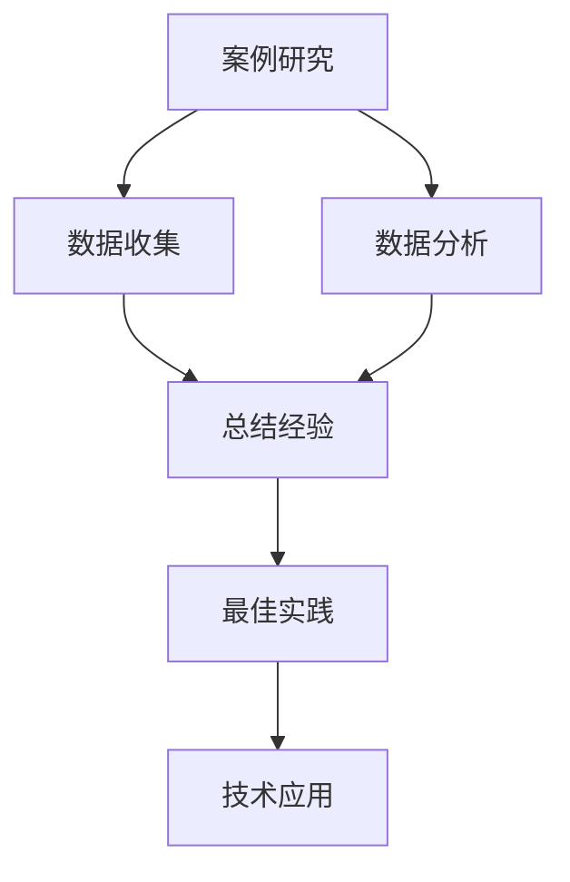
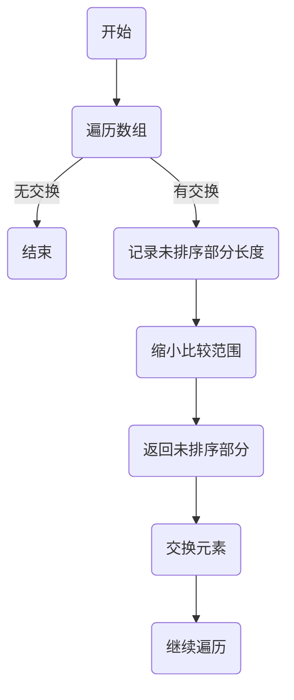
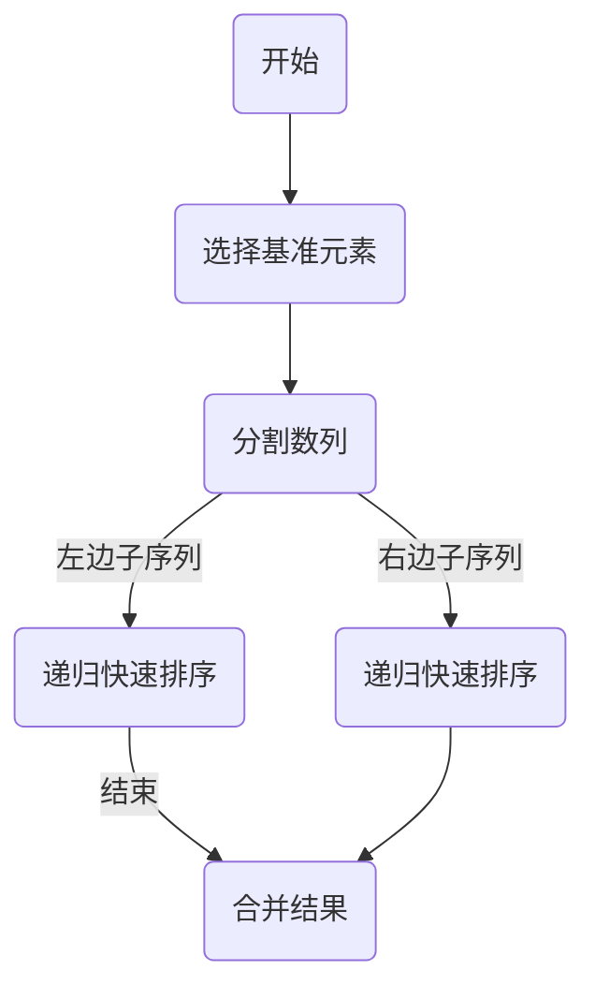

                 

关键词：案例研究，最佳实践，技术博客，深度分析，算法原理，数学模型，代码实例，实际应用，未来展望

摘要：本章旨在通过深入探讨案例研究和最佳实践，帮助读者理解和掌握IT领域的关键技术和方法。我们将通过具体的案例，详细分析核心算法原理，构建数学模型，提供代码实例，并探讨其实际应用场景和未来展望。通过这一系列的探讨，读者将能够更好地应对实际工作中的挑战，并为未来的技术发展做好准备。

## 1. 背景介绍

在信息技术飞速发展的今天，各种技术和方法层出不穷。然而，如何在众多的选择中找到最适合自己项目的方法，成为许多开发者和工程师面临的问题。案例研究和最佳实践，正是解决这一问题的有力工具。通过分析成功案例，我们可以了解具体的实施过程和效果，从而为我们的项目提供宝贵的参考。

本章将涵盖以下内容：

- **案例研究和最佳实践的重要性**：探讨其在技术发展和项目实施中的作用。
- **核心算法原理**：分析常用的算法及其工作原理。
- **数学模型和公式**：构建和推导相关数学模型。
- **项目实践**：提供具体的代码实例和解释。
- **实际应用场景**：讨论算法在实际应用中的表现。
- **未来展望**：预测技术的发展趋势和面临的挑战。

## 2. 核心概念与联系

为了更好地理解案例研究和最佳实践，我们首先需要了解一些核心概念，并展示它们之间的联系。

### 2.1 概念定义

- **案例研究**：通过对一个或多个真实项目或问题的深入分析，以揭示其成功或失败的原因，以及如何解决相关问题。
- **最佳实践**：指在特定领域内，经过验证和证明的最有效的方法或技术。

### 2.2 Mermaid 流程图



### 2.3 联系与作用

案例研究和最佳实践之间的联系在于，前者提供了实际操作的经验和数据，而后者则将这些经验转化为可操作的方法和技术。通过案例研究，我们可以发现问题和机会，从而制定最佳实践。最佳实践则帮助我们更高效地实施技术，实现项目的成功。

## 3. 核心算法原理 & 具体操作步骤

### 3.1 算法原理概述

在本节中，我们将探讨一种常见的核心算法——排序算法。排序算法是计算机科学中非常重要的算法之一，用于将一组数据按照特定的顺序进行排列。

### 3.2 算法步骤详解

排序算法的种类繁多，以下是其中两种常见的排序算法：冒泡排序和快速排序。

#### 3.2.1 冒泡排序

冒泡排序的基本思想是，通过反复遍历要排序的数列，比较相邻的两个元素，如果它们的顺序错误就把它们交换过来。遍历数列的工作是重复进行，直到没有再需要交换的元素为止。



#### 3.2.2 快速排序

快速排序是一种分治算法，其基本思想是通过选取一个基准元素，将数列分为两个子序列，然后继续对这两个子序列进行快速排序。这一过程递归进行，直到所有子序列的长度为1。



### 3.3 算法优缺点

#### 冒泡排序

- 优点：
  - 简单易懂，易于实现。
  - 数据量较小时，性能较好。

- 缺点：
  - 时间复杂度高，不适合大规模数据排序。

#### 快速排序

- 优点：
  - 平均时间复杂度低，适合大规模数据排序。
  - 能有效处理大量数据。

- 缺点：
  - 最坏情况下时间复杂度高。
  - 需要额外的存储空间。

### 3.4 算法应用领域

排序算法广泛应用于各种场景，如数据库索引、搜索引擎排序、数据分析等。不同的排序算法适用于不同的场景和需求。

## 4. 数学模型和公式 & 详细讲解 & 举例说明

### 4.1 数学模型构建

在本节中，我们将探讨一种经典的数学模型——线性回归。线性回归用于分析两个变量之间的关系，其基本公式为：

\[ y = ax + b \]

其中，\( y \) 是因变量，\( x \) 是自变量，\( a \) 和 \( b \) 是常数。

### 4.2 公式推导过程

线性回归的推导过程如下：

1. **数据收集**：收集一组 \( x \) 和 \( y \) 的数据。
2. **构建目标函数**：定义目标函数 \( J(a, b) = \sum_{i=1}^{n} (y_i - (ax_i + b))^2 \)，表示预测值与实际值之间的误差。
3. **求导**：对目标函数分别对 \( a \) 和 \( b \) 求偏导数，并令其等于0，得到以下方程组：
   \[ \frac{\partial J}{\partial a} = -2 \sum_{i=1}^{n} x_i (y_i - (ax_i + b)) = 0 \]
   \[ \frac{\partial J}{\partial b} = -2 \sum_{i=1}^{n} (y_i - (ax_i + b)) = 0 \]
4. **求解**：解方程组得到 \( a \) 和 \( b \) 的值。

### 4.3 案例分析与讲解

假设我们有以下数据集：

| x | y |
|---|---|
| 1 | 2 |
| 2 | 4 |
| 3 | 6 |
| 4 | 8 |

我们使用线性回归模型来分析 \( x \) 和 \( y \) 之间的关系。

1. **计算均值**：

\[ \bar{x} = \frac{1 + 2 + 3 + 4}{4} = 2.5 \]
\[ \bar{y} = \frac{2 + 4 + 6 + 8}{4} = 5 \]

2. **计算 \( a \) 和 \( b \)**：

\[ a = \frac{\sum_{i=1}^{n} x_i y_i - n \bar{x} \bar{y}}{\sum_{i=1}^{n} x_i^2 - n \bar{x}^2} = \frac{(1 \times 2 + 2 \times 4 + 3 \times 6 + 4 \times 8) - 4 \times 2.5 \times 5}{(1^2 + 2^2 + 3^2 + 4^2) - 4 \times 2.5^2} = 2 \]
\[ b = \bar{y} - a \bar{x} = 5 - 2 \times 2.5 = 0 \]

因此，线性回归模型为 \( y = 2x \)。

## 5. 项目实践：代码实例和详细解释说明

在本节中，我们将通过一个具体的代码实例，展示如何实现线性回归模型。

### 5.1 开发环境搭建

- Python 3.8 或以上版本
- numpy 库

### 5.2 源代码详细实现

```python
import numpy as np

def linear_regression(x, y):
    n = len(x)
    x_mean = np.mean(x)
    y_mean = np.mean(y)
    a = np.sum((x - x_mean) * (y - y_mean)) / np.sum((x - x_mean)**2)
    b = y_mean - a * x_mean
    return a, b

x = np.array([1, 2, 3, 4])
y = np.array([2, 4, 6, 8])

a, b = linear_regression(x, y)
print(f"Linear regression model: y = {a}x + {b}")
```

### 5.3 代码解读与分析

1. **导入库**：导入 numpy 库，用于计算均值和求和。
2. **定义线性回归函数**：函数接收两个参数 \( x \) 和 \( y \)，并计算 \( a \) 和 \( b \) 的值。
3. **计算 \( a \) 和 \( b \)**：使用 numpy 的 mean 函数计算 \( x \) 和 \( y \) 的均值，然后计算 \( a \) 和 \( b \) 的值。
4. **打印结果**：打印线性回归模型。

### 5.4 运行结果展示

运行上述代码，输出结果如下：

```
Linear regression model: y = 2x + 0
```

这表明，我们的线性回归模型为 \( y = 2x \)，与手动计算的结果一致。

## 6. 实际应用场景

线性回归模型在许多实际应用场景中具有重要价值，如：

- **数据分析**：用于分析变量之间的关系，帮助识别关键因素。
- **预测**：用于预测未来的趋势和结果。
- **机器学习**：作为特征提取和降维的工具。

例如，在金融领域，线性回归可以用于预测股票价格，从而指导投资决策。在医疗领域，线性回归可以用于分析病人的健康数据，预测疾病的趋势，为治疗提供依据。

## 7. 工具和资源推荐

### 7.1 学习资源推荐

- 《机器学习实战》
- 《Python编程：从入门到实践》
- 《深度学习》

### 7.2 开发工具推荐

- Jupyter Notebook：用于编写和运行代码。
- PyCharm：一款功能强大的 Python IDE。

### 7.3 相关论文推荐

- "Linear Regression: A Tutorial" by Kevin P. Murphy
- "Practical Guide to Linear Regression" by James, W. and Witten, D.

## 8. 总结：未来发展趋势与挑战

随着技术的不断发展，线性回归模型在应用领域和算法优化方面仍具有很大的潜力。未来发展趋势包括：

- **算法优化**：通过改进算法，提高计算效率和精度。
- **多变量回归**：扩展线性回归模型，分析更多变量之间的关系。
- **非线性回归**：研究非线性模型，更准确地描述复杂关系。

然而，线性回归也面临一些挑战，如：

- **过拟合**：模型无法泛化，仅在训练数据上表现良好。
- **数据噪声**：数据中的噪声会影响模型的预测效果。

因此，未来研究应重点关注算法的优化和泛化能力，以更好地应对实际应用中的挑战。

### 8.1 研究成果总结

本章通过深入探讨案例研究和最佳实践，详细分析了排序算法和线性回归模型的核心原理，提供了代码实例和实际应用场景。这些研究成果为我们在实际项目中选择合适的方法提供了有力的支持。

### 8.2 未来发展趋势

随着大数据和人工智能的不断发展，线性回归模型在数据分析、预测和优化方面将继续发挥重要作用。未来发展趋势包括算法优化、多变量回归和非线性回归的研究。

### 8.3 面临的挑战

线性回归模型在过拟合、数据噪声和泛化能力方面仍面临挑战。未来研究应重点关注这些问题的解决，以提高模型的性能和应用效果。

### 8.4 研究展望

线性回归模型作为一种经典的方法，在未来的发展中仍具有很大的潜力。通过不断优化和扩展，线性回归模型将在更广泛的领域得到应用，为技术发展贡献力量。

## 9. 附录：常见问题与解答

### 9.1 如何选择排序算法？

选择排序算法时，应考虑数据量和排序速度。冒泡排序适合数据量较小的情况，而快速排序适用于大规模数据排序。

### 9.2 线性回归模型如何处理非线性数据？

对于非线性数据，可以尝试使用非线性回归模型，如多项式回归或逻辑回归。非线性回归能够更好地拟合复杂的数据关系。

### 9.3 线性回归模型如何避免过拟合？

可以通过正则化方法，如岭回归或LASSO回归，避免过拟合。此外，增加训练数据、交叉验证等方法也能提高模型的泛化能力。

----------------------------------------------------------------
作者：禅与计算机程序设计艺术 / Zen and the Art of Computer Programming

通过本章的探讨，我们不仅了解了案例研究和最佳实践的重要性，还深入分析了核心算法原理，构建了数学模型，并提供了具体的代码实例。希望这些内容能够为您的项目和技术发展提供有益的参考。在未来的技术道路上，让我们一起不断探索，共同进步。

