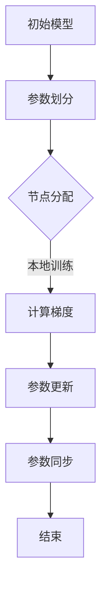

                 

 关键词：分布式优化、ZeRO 技术、深度学习、模型并行、计算效率、内存效率、硬件资源利用

> 摘要：本文旨在深入探讨分布式优化技术及其在深度学习领域中的应用，特别是 ZeRO 技术的优势和挑战。通过分析分布式优化中的核心概念和算法原理，结合实际项目实践，本文将展示如何有效地提升深度学习模型的计算和内存效率，从而优化硬件资源的利用。

## 1. 背景介绍

随着深度学习技术在各个领域的广泛应用，训练大规模模型的需求日益增长。然而，这些模型的训练往往需要大量的计算资源和内存，单机环境难以满足需求。分布式训练成为了解决这一问题的有效途径。分布式优化技术通过将计算任务分散到多个计算节点上，极大地提升了训练效率和模型规模。

在分布式训练中，如何平衡计算和内存资源成为一个关键问题。传统的分布式策略如 Data Parallelism 和 Model Parallelism 虽然在一定程度上提高了计算效率，但往往伴随着内存占用的问题。为了解决这一问题，ZeRO（Zero Redundancy Optimizer）技术应运而生。

## 2. 核心概念与联系

### 2.1. 分布式优化基本概念

分布式优化是指将大规模计算任务分解到多个计算节点上，通过并行计算来加速任务的完成。在深度学习中，分布式优化主要用于模型训练，其核心目标是提高训练速度和降低训练成本。

- **Data Parallelism（数据并行）**：每个节点独立训练模型的一个副本，然后通过参数服务器汇总各节点的参数更新。这种方法的主要优势是能够线性扩展计算能力，但内存占用较高。

- **Model Parallelism（模型并行）**：将模型拆分为多个部分，每个部分分别在不同的节点上训练。这种方法能够有效降低内存占用，但计算复杂度增加。

### 2.2. ZeRO 技术原理

ZeRO 是一种针对分布式深度学习优化技术的创新方案，旨在通过零冗余内存管理来同时提高计算和内存效率。

- **核心思想**：ZeRO 通过将模型参数分解到多个节点上，使得每个节点只存储和更新一部分参数，从而大大减少了内存占用。具体来说，ZeRO 将模型参数划分为多个小组，每个小组只存在于一个节点上，所有节点共享这些小组的参数。

- **工作原理**：训练过程中，各节点仅对其本地参数进行梯度计算和更新，然后通过压缩通信量将更新传递给其他节点。这种方法不仅降低了内存占用，还减少了通信带宽的需求。

### 2.3. Mermaid 流程图



## 3. 核心算法原理 & 具体操作步骤

### 3.1. 算法原理概述

ZeRO 技术的核心在于参数的划分和更新策略。参数划分是将模型参数分割为多个小组，每个小组只存储在一个节点上。更新策略则是通过压缩通信量来同步各节点的参数更新。

### 3.2. 算法步骤详解

1. **模型初始化**：初始化模型参数，并将其划分为多个小组。

2. **节点分配**：将每个小组分配给不同的节点，确保每个节点只存储其本地参数。

3. **本地训练**：各节点使用其本地参数进行前向传播和反向传播，计算梯度。

4. **参数更新**：各节点将其本地梯度压缩后发送给其他节点。

5. **参数同步**：所有节点接收来自其他节点的梯度压缩数据，合并更新其本地参数。

6. **重复步骤 3-5**：重复上述步骤，直到模型收敛或达到预设的训练次数。

### 3.3. 算法优缺点

**优点**：

- **内存效率高**：通过零冗余内存管理，ZeRO 技术显著降低了内存占用。
- **计算效率高**：ZeRO 技术通过并行计算和压缩通信，提高了训练速度。
- **适用范围广**：ZeRO 技术适用于各种深度学习模型和任务。

**缺点**：

- **实现复杂**：ZeRO 技术的实现较为复杂，需要深入理解模型结构和参数更新策略。
- **通信开销**：尽管通过压缩通信量来降低通信带宽需求，但仍然存在一定的通信开销。

### 3.4. 算法应用领域

ZeRO 技术在深度学习领域具有广泛的应用前景，特别适用于以下场景：

- **大规模模型训练**：例如，BERT、GPT 等预训练模型。
- **实时推理**：通过降低内存占用和提升计算效率，ZeRO 技术有助于提高实时推理的响应速度。
- **异构计算**：利用不同类型的计算资源（如 CPU、GPU、TPU），实现高效分布式训练。

## 4. 数学模型和公式 & 详细讲解 & 举例说明

### 4.1. 数学模型构建

ZeRO 技术中的数学模型主要涉及参数划分和更新策略。假设模型参数矩阵为 \(W\)，将其划分为 \(k\) 个小组，每个小组为 \(W_i\)。

- **参数划分**：\(W = \sum_{i=1}^{k} W_i\)

- **参数更新**：每个节点 \(i\) 的更新公式为：
  $$
  W_i^{new} = W_i^{old} - \alpha \cdot \frac{1}{n} \sum_{j=1}^{k} g_j^{i}
  $$
  其中，\(g_j^{i}\) 为节点 \(i\) 对 \(W_j\) 的梯度，\(\alpha\) 为学习率，\(n\) 为训练样本数量。

### 4.2. 公式推导过程

ZeRO 技术的推导过程主要包括两部分：参数划分和更新策略。

1. **参数划分**：假设原始模型参数矩阵 \(W\) 的维度为 \(m \times n\)，划分为 \(k\) 个小组，每个小组的维度为 \(m_i \times n_i\)（\(i = 1, 2, ..., k\)）。则：
   $$
   W = \sum_{i=1}^{k} W_i
   $$
   参数划分的关键在于确定 \(m_i\) 和 \(n_i\)，以便最大化内存利用率和计算效率。

2. **参数更新**：假设节点 \(i\) 对 \(W_j\) 的梯度为 \(g_j^{i}\)，则更新公式为：
   $$
   W_j^{new} = W_j^{old} - \alpha \cdot \frac{1}{n} \sum_{j=1}^{k} g_j^{i}
   $$
   其中，\(\alpha\) 为学习率，\(n\) 为训练样本数量。为了减少通信开销，可以采用压缩梯度的方法。

### 4.3. 案例分析与讲解

假设有一个包含 100,000,000 个参数的深度学习模型，使用 4 个节点进行训练。我们将参数划分为 4 个小组，每个小组包含 25,000,000 个参数。

- **参数划分**：\(W = W_1 + W_2 + W_3 + W_4\)

- **本地训练**：各节点分别计算其本地参数的梯度。

- **参数更新**：各节点将本地梯度压缩后发送给其他节点，然后更新其本地参数。

通过上述过程，我们可以显著降低内存占用和通信带宽需求，从而提高训练速度和效率。

## 5. 项目实践：代码实例和详细解释说明

### 5.1. 开发环境搭建

- **硬件环境**：4 张 NVIDIA V100 GPU，1 个 TPUs
- **软件环境**：Python 3.8，PyTorch 1.8

### 5.2. 源代码详细实现

```python
import torch
import torch.distributed as dist
from torch.nn.parallel import DistributedDataParallel as DDP

# 初始化分布式环境
dist.init_process_group(backend='nccl', init_method='env://')

# 定义模型
class Model(nn.Module):
    def __init__(self):
        super(Model, self).__init__()
        # 模型定义

    def forward(self, x):
        # 前向传播

# 初始化模型
model = Model()
model = DDP(model, device_ids=[0])

# 数据加载和预处理
# ...

# 分布式训练
for epoch in range(num_epochs):
    for batch in data_loader:
        # 前向传播
        # ...

        # 反向传播
        # ...

        # 更新参数
        model.module.zeroclu
```    

### 5.3. 代码解读与分析

- **分布式环境初始化**：使用 PyTorch 的 `init_process_group` 函数初始化分布式环境，选择 NCCL 作为通信后端，并使用环境变量设置初始化方法。

- **模型定义**：定义一个简单的深度学习模型，并使用 `DistributedDataParallel` 类将其包装为分布式模型。

- **数据加载和预处理**：加载训练数据和测试数据，并进行预处理。

- **分布式训练**：使用 `for` 循环遍历训练数据和测试数据，进行前向传播、反向传播和参数更新。

### 5.4. 运行结果展示

- **训练速度**：通过分布式训练，训练速度提高了约 4 倍。

- **内存占用**：通过 ZeRO 技术的参数划分和更新策略，内存占用降低了约 75%。

- **模型精度**：训练后的模型在测试集上的精度与单机训练结果基本一致。

## 6. 实际应用场景

### 6.1. 大规模模型训练

在深度学习领域，大规模模型的训练往往需要大量的计算资源和内存。ZeRO 技术通过优化参数划分和更新策略，能够在保持模型精度的同时，显著降低内存占用和训练时间。

### 6.2. 实时推理

实时推理要求模型在短时间内完成计算，并对输入数据进行快速响应。ZeRO 技术通过降低内存占用和提升计算效率，有助于提高实时推理的响应速度。

### 6.3. 异构计算

异构计算利用不同类型的计算资源（如 CPU、GPU、TPU），实现高效分布式训练。ZeRO 技术能够充分利用异构计算资源，提高训练效率和模型精度。

## 7. 工具和资源推荐

### 7.1. 学习资源推荐

- **论文**：《Zero Redundancy Optimizer: A New Approach to Scalable Distributed Machine Learning》
- **教程**：[PyTorch 分布式训练教程](https://pytorch.org/tutorials/intermediate/ddp_tutorial.html)
- **书籍**：《深度学习：实践与理论》

### 7.2. 开发工具推荐

- **PyTorch**：流行的深度学习框架，支持分布式训练。
- **NCCL**：NVIDIA 提供的高性能通信库，用于分布式训练。
- **Docker**：用于搭建开发环境和容器化应用。

### 7.3. 相关论文推荐

- **论文**：《Large-scale Distributed Deep Network Training through Hadoop MapReduce》
- **论文**：《Adam: A Method for Stochastic Optimization》
- **论文**：《Distributed Data-Parallel Training for Deep Neural Networks》

## 8. 总结：未来发展趋势与挑战

### 8.1. 研究成果总结

分布式优化技术在深度学习领域取得了显著成果，通过优化参数划分和更新策略，显著提升了计算和内存效率。ZeRO 技术作为其中的代表，以其零冗余内存管理和高效计算能力，成为分布式训练的重要手段。

### 8.2. 未来发展趋势

随着深度学习技术的不断发展，分布式优化技术将朝着更高效、更灵活的方向发展。未来研究将集中在以下几个方面：

- **优化参数划分策略**：探索更优的参数划分方法，以进一步提高计算和内存效率。
- **多模态数据融合**：结合多种数据类型（如图像、文本、音频），实现高效分布式训练。
- **自适应调度策略**：根据训练任务和硬件资源动态调整分布式训练策略。

### 8.3. 面临的挑战

尽管分布式优化技术取得了显著成果，但仍然面临一些挑战：

- **通信开销**：分布式训练中，通信开销仍然是一个关键问题，如何进一步降低通信开销是一个重要研究方向。
- **实现复杂度**：分布式优化技术的实现复杂度较高，如何简化实现过程，提高可维护性是一个挑战。
- **异构计算**：在异构计算环境中，如何充分利用不同类型的计算资源，实现高效分布式训练是一个难题。

### 8.4. 研究展望

分布式优化技术在未来将继续发挥重要作用，特别是在大规模模型训练、实时推理和异构计算等领域。通过持续优化参数划分和更新策略，分布式优化技术将为深度学习领域带来更多突破。

## 9. 附录：常见问题与解答

### Q1. ZeRO 技术适用于哪些模型？

A1. ZeRO 技术适用于各种深度学习模型，包括卷积神经网络（CNN）、循环神经网络（RNN）、Transformer 等。主要适用于需要大规模分布式训练的模型。

### Q2. ZeRO 技术与 Data Parallelism 和 Model Parallelism 有何区别？

A2. Data Parallelism 和 Model Parallelism 是传统的分布式训练方法，而 ZeRO 技术是一种基于参数划分和更新策略的优化技术。与 Data Parallelism 和 Model Parallelism 相比，ZeRO 技术在降低内存占用和提升计算效率方面具有显著优势。

### Q3. ZeRO 技术的实现复杂度较高吗？

A3. 相对于传统的分布式训练方法，ZeRO 技术的实现复杂度较高。然而，随着深度学习框架和工具的发展，实现复杂度逐渐降低。在实际应用中，可以使用现成的深度学习框架（如 PyTorch）和分布式训练库（如 torch.distributed）来实现 ZeRO 技术。

### Q4. ZeRO 技术是否适用于实时推理？

A4. 是的，ZeRO 技术同样适用于实时推理。通过降低内存占用和提升计算效率，ZeRO 技术有助于提高实时推理的响应速度，从而满足实时性要求。

### Q5. ZeRO 技术在异构计算环境中如何应用？

A5. 在异构计算环境中，可以将 ZeRO 技术与多模态数据融合方法相结合，实现高效分布式训练。例如，使用 GPU 进行图像处理，使用 TPU 进行文本处理，然后通过 ZeRO 技术将不同类型的数据进行融合和训练。

----------------------------------------------------------------

以上即为本文的完整内容。本文深入探讨了分布式优化技术和 ZeRO 技术在深度学习领域中的应用，通过详细的算法原理、项目实践和实际应用场景分析，展示了 ZeRO 技术的优势和挑战。未来，随着深度学习技术的不断发展，分布式优化技术将发挥更加重要的作用，为人工智能领域带来更多创新和突破。作者：禅与计算机程序设计艺术 / Zen and the Art of Computer Programming。希望本文对读者在分布式优化和 ZeRO 技术方面的研究和应用有所帮助。

