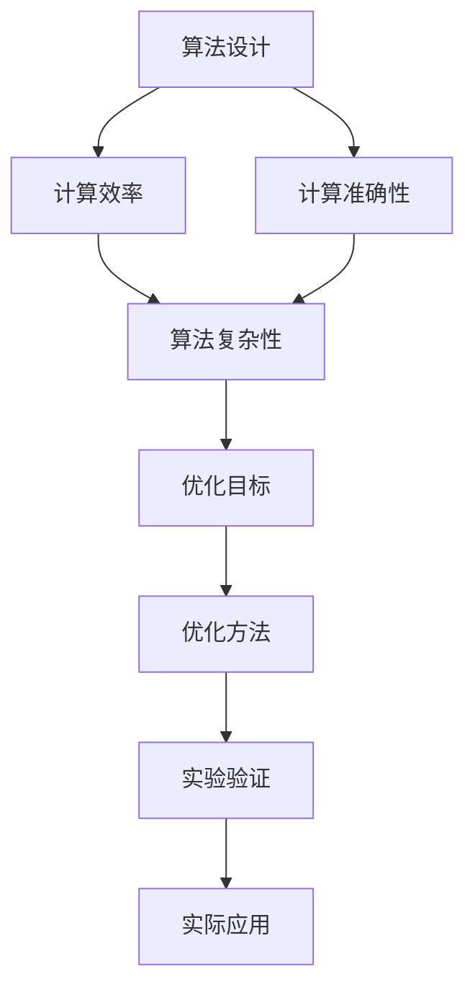

                 

关键词：算法优化、计算效率、计算准确性、人类计算、算法设计、数学模型、代码实现、应用领域、未来展望

> 摘要：本文将探讨算法优化在提高人类计算效率和准确性方面的作用。我们将深入分析算法优化的核心概念、原理和应用，并展示如何通过具体算法实例和数学模型来提升计算效率和准确性。

## 1. 背景介绍

在现代社会，计算能力的重要性不言而喻。无论是科学研究、工程实践、商业分析，还是日常生活中的各种任务，都离不开高效的计算。然而，计算能力的提升不仅仅依赖于硬件技术的发展，算法的优化同样至关重要。算法优化是指通过改进算法的设计，使得计算过程更加高效、准确。

算法优化的重要性体现在以下几个方面：

1. **提高计算效率**：优化后的算法能够在更短的时间内完成计算任务，节省时间和资源。
2. **增强计算准确性**：通过精确的算法设计和优化，减少计算误差，提高结果的可靠性。
3. **适应不同场景**：算法优化使得算法能够适应不同的计算需求和应用场景，提高其通用性和灵活性。
4. **促进技术创新**：算法优化是推动计算技术发展的重要动力，有助于开发出更高效、更强大的计算工具。

本文将围绕算法优化这一主题，深入探讨其核心概念、原理和应用，并通过具体实例展示如何优化算法以提高计算效率和准确性。

## 2. 核心概念与联系

为了更好地理解算法优化，我们首先需要了解一些核心概念和它们之间的联系。以下是一个Mermaid流程图，展示这些核心概念及其相互关系：



### 2.1 算法设计

算法设计是指创建一个解决问题的方法，包括确定问题的规模、选择合适的数据结构、设计算法的流程和逻辑等。算法设计是算法优化的基础，决定了算法的初始性能。

### 2.2 计算效率

计算效率是指算法在执行过程中所消耗的资源，包括时间、空间和能量。高效的算法能够在更短的时间内完成计算任务，从而节省计算资源。

### 2.3 计算准确性

计算准确性是指算法输出结果与实际结果之间的接近程度。精确的算法能够减少计算误差，提高结果的可靠性。

### 2.4 算法复杂性

算法复杂性是指算法性能随问题规模增长的速度。常见的算法复杂性包括时间复杂性和空间复杂性。优化算法的目标是降低其复杂性。

### 2.5 优化目标

优化目标是算法优化的最终追求。常见的优化目标包括提高计算效率、增强计算准确性、减少算法复杂性等。

### 2.6 优化方法

优化方法是指用于改进算法性能的技术和策略。常见的优化方法包括算法改进、数据结构优化、并行计算等。

### 2.7 实验验证

实验验证是指通过实验来评估算法优化效果的过程。实验验证有助于验证优化方法的有效性，并为后续优化提供参考。

### 2.8 实际应用

实际应用是指将优化后的算法应用于实际问题中，以解决实际问题。实际应用是算法优化的最终目的，也是评估算法优化效果的重要指标。

通过上述核心概念及其相互关系的理解，我们可以更好地把握算法优化的内涵和外延，为后续的讨论奠定基础。

## 3. 核心算法原理 & 具体操作步骤

### 3.1 算法原理概述

算法优化通常涉及多个方面，包括算法选择、算法改进、数据结构优化、并行计算等。以下是几种常见的算法优化原理：

#### 3.1.1 算法选择

算法选择是算法优化的第一步，选择适合问题的算法可以显著提高计算效率。例如，对于大规模数据处理任务，选择分布式计算算法（如MapReduce）可以充分利用并行计算的优势，提高计算速度。

#### 3.1.2 算法改进

算法改进是通过改进算法的设计和逻辑来提高其性能。常见的算法改进方法包括动态规划、贪心算法、分治算法等。这些方法能够通过减少计算次数或降低计算复杂度来提高算法效率。

#### 3.1.3 数据结构优化

数据结构优化是算法优化的重要手段之一。通过选择合适的数据结构，可以减少算法的时间复杂度和空间复杂度。例如，在搜索问题中，使用哈希表可以显著提高搜索效率。

#### 3.1.4 并行计算

并行计算是通过同时执行多个任务来提高计算效率。在多核处理器和分布式计算环境中，并行计算能够充分利用计算资源，显著提高计算速度。

### 3.2 算法步骤详解

下面我们将详细介绍几种常见的算法优化步骤：

#### 3.2.1 算法选择

1. 分析问题规模和特点，确定需要解决的问题是何种类型。
2. 根据问题的类型选择合适的算法，例如排序问题可以选择快速排序、归并排序等。
3. 评估算法的性能，选择性能最佳的算法。

#### 3.2.2 算法改进

1. 分析现有算法的不足之处，确定需要改进的方面。
2. 选择合适的改进方法，如动态规划、贪心算法等。
3. 实现改进后的算法，并进行性能评估。

#### 3.2.3 数据结构优化

1. 分析现有数据结构的不足之处，确定需要优化的方面。
2. 选择合适的数据结构，如数组、链表、树、图等。
3. 实现优化后的数据结构，并进行性能评估。

#### 3.2.4 并行计算

1. 分析任务的特点，确定哪些任务可以并行执行。
2. 设计并行计算策略，如任务划分、负载均衡等。
3. 实现并行计算，并进行性能评估。

### 3.3 算法优缺点

每种算法优化方法都有其优缺点，以下是几种常见算法优化方法的优缺点：

#### 3.3.1 算法选择

优点：简单易行，适用于各种问题。

缺点：可能无法充分发挥特定问题的优化潜力。

#### 3.3.2 算法改进

优点：能够显著提高算法性能，适用于特定问题。

缺点：需要深入分析问题，实现复杂，可能需要大量的计算资源。

#### 3.3.3 数据结构优化

优点：能够显著提高算法效率，适用于各种数据结构。

缺点：可能需要额外的存储空间，实现复杂。

#### 3.3.4 并行计算

优点：能够充分利用计算资源，显著提高计算速度。

缺点：设计复杂，需要处理同步和通信问题。

### 3.4 算法应用领域

算法优化在各个领域都有广泛的应用，以下是几个典型应用领域：

#### 3.4.1 科学计算

科学计算涉及大量复杂的数学模型和计算任务，算法优化能够提高计算效率和准确性，例如天体物理、气象预报、流体力学等领域。

#### 3.4.2 工程实践

工程实践中的计算任务通常具有复杂性和大规模性，算法优化能够提高设计效率、优化工程方案。

#### 3.4.3 商业分析

商业分析中的数据处理任务通常涉及大量数据，算法优化能够提高数据分析效率，为商业决策提供有力支持。

#### 3.4.4 人工智能

人工智能领域中的计算任务通常涉及大量的数据和模型训练，算法优化能够提高训练效率，加快模型迭代速度。

通过以上对核心算法原理和具体操作步骤的介绍，我们可以更好地理解如何进行算法优化，以提高计算效率和准确性。在接下来的章节中，我们将进一步探讨数学模型和公式，以及如何通过具体实例展示算法优化的效果。

## 4. 数学模型和公式 & 详细讲解 & 举例说明

算法优化过程中，数学模型和公式是不可或缺的工具。它们不仅帮助我们理解和分析问题，还能指导我们设计和改进算法。以下将详细讲解一些常用的数学模型和公式，并通过具体实例来说明它们的应用。

### 4.1 数学模型构建

数学模型是对现实世界问题的抽象和简化，通过数学语言来描述问题的性质和规律。构建数学模型通常包括以下几个步骤：

1. **明确问题背景和目标**：确定要解决的问题是什么，问题的目标是什么。
2. **定义变量和参数**：根据问题背景，定义相关的变量和参数，如输入数据、输出结果等。
3. **建立关系式**：根据问题的性质，建立变量和参数之间的关系式，如方程、不等式、函数等。
4. **简化模型**：在保证问题特征不变的前提下，简化模型以降低计算复杂度。

### 4.2 公式推导过程

公式的推导过程是构建数学模型的关键环节。以下是一个简单的例子：

#### 示例：计算两点间的距离

假设在二维空间中，两点 \( A(x_1, y_1) \) 和 \( B(x_2, y_2) \) 之间的距离 \( d \) 可以通过以下公式计算：

\[ d = \sqrt{(x_2 - x_1)^2 + (y_2 - y_1)^2} \]

推导过程如下：

1. **定义变量**：设 \( d \) 为点 \( A \) 和点 \( B \) 之间的距离，\( x_1, y_1, x_2, y_2 \) 分别为点 \( A \) 和点 \( B \) 的坐标。
2. **建立关系式**：根据两点间距离的定义，\( d \) 等于点 \( A \) 到点 \( B \) 的水平距离和垂直距离的平方和的平方根。
3. **简化公式**：将水平距离和垂直距离表示为 \( x_2 - x_1 \) 和 \( y_2 - y_1 \)，然后代入原公式，得到最终结果。

### 4.3 案例分析与讲解

#### 案例一：线性回归模型

线性回归是一种常用的预测方法，通过建立自变量和因变量之间的线性关系来预测未来的值。以下是线性回归模型的数学模型和公式：

1. **模型构建**：假设自变量为 \( x \)，因变量为 \( y \)，线性回归模型可以表示为：

\[ y = \beta_0 + \beta_1 x + \epsilon \]

其中，\( \beta_0 \) 为截距，\( \beta_1 \) 为斜率，\( \epsilon \) 为误差项。

2. **公式推导**：为了求解 \( \beta_0 \) 和 \( \beta_1 \)，需要最小化误差平方和：

\[ \min \sum_{i=1}^{n} (y_i - (\beta_0 + \beta_1 x_i))^2 \]

通过求导并令导数为零，可以求解出 \( \beta_0 \) 和 \( \beta_1 \) 的值。

3. **案例应用**：假设我们要预测某个城市下周的降雨量，可以使用线性回归模型来建立降雨量与气温之间的关系。通过收集历史数据，可以拟合出线性回归模型，然后使用模型来预测下周的降雨量。

#### 案例二：动态规划模型

动态规划是一种解决最优化问题的算法，通过将问题分解为子问题，并利用子问题的重叠性来优化计算过程。以下是动态规划模型的基本公式：

1. **模型构建**：假设有一个最优化问题，可以通过递归关系来描述：

\[ f(i) = \min_{j} (C_{ij} + f(j)) \]

其中，\( f(i) \) 为第 \( i \) 个子问题的最优解，\( C_{ij} \) 为第 \( i \) 个子问题与第 \( j \) 个子问题的关联成本。

2. **公式推导**：动态规划通过自底向上的方式，依次求解子问题的最优解，最终得到原问题的最优解。

3. **案例应用**：动态规划常用于解决背包问题、最长公共子序列问题等。例如，在背包问题中，给定一组物品和它们的重量和价值，要求选择一些物品装入背包，使得总价值最大。可以通过动态规划模型来求解最优解。

通过以上案例，我们可以看到数学模型和公式在算法优化中的应用。数学模型不仅帮助我们理解和分析问题，还能指导我们设计和改进算法，从而提高计算效率和准确性。在接下来的章节中，我们将通过具体项目实践来展示算法优化的实际效果。

## 5. 项目实践：代码实例和详细解释说明

在了解了算法优化原理和数学模型之后，我们将通过一个具体的代码实例来展示算法优化的实际应用。本实例将采用Python编程语言，实现一个基于动态规划的背包问题求解算法，并通过详细的代码解析来说明优化过程。

### 5.1 开发环境搭建

为了运行本实例，您需要安装以下开发环境和工具：

1. Python 3.x
2. Jupyter Notebook或PyCharm等Python集成开发环境（IDE）
3. Numpy库：用于高效数值计算

您可以通过以下命令安装Numpy库：

```bash
pip install numpy
```

### 5.2 源代码详细实现

以下是背包问题的代码实现，包括输入数据、算法逻辑和输出结果：

```python
import numpy as np

# 动态规划求解背包问题
def knapSack(W, wt, val, n):
    # 创建动态规划表格，初始值全为0
    dp = np.zeros((n+1, W+1))

    # 遍历每个物品和背包容量
    for i in range(1, n+1):
        for w in range(1, W+1):
            # 如果物品重量小于当前背包容量
            if wt[i-1] <= w:
                # 计算包含当前物品时的最大价值
                dp[i][w] = max(val[i-1] + dp[i-1][w-wt[i-1]], dp[i-1][w])
            else:
                # 如果物品重量大于当前背包容量，则不包含该物品
                dp[i][w] = dp[i-1][w]

    # 返回最大价值
    return dp[n][W]

# 输入数据
val = [60, 100, 120]  # 各物品的价值
wt = [10, 20, 30]  # 各物品的重量
W = 50  # 背包容量
n = len(val)  # 物品数量

# 调用函数求解
max_value = knapSack(W, wt, val, n)
print("最大价值为：", max_value)
```

### 5.3 代码解读与分析

以下是对上述代码的详细解读与分析：

#### 5.3.1 函数定义

```python
def knapSack(W, wt, val, n):
```

定义了一个名为`knapSack`的函数，用于求解背包问题。该函数接受四个参数：

- `W`：背包容量。
- `wt`：各物品的重量。
- `val`：各物品的价值。
- `n`：物品数量。

#### 5.3.2 动态规划表格初始化

```python
dp = np.zeros((n+1, W+1))
```

创建一个动态规划表格`dp`，其维度为\( (n+1) \times (W+1) \)。表格的初始值全为0，用于存储子问题的最优解。

#### 5.3.3 遍历物品和背包容量

```python
for i in range(1, n+1):
    for w in range(1, W+1):
```

通过两层循环遍历每个物品和每个可能的背包容量。

#### 5.3.4 状态转移方程

```python
if wt[i-1] <= w:
    dp[i][w] = max(val[i-1] + dp[i-1][w-wt[i-1]], dp[i-1][w])
else:
    dp[i][w] = dp[i-1][w]
```

如果当前物品的重量小于背包容量，则计算包含当前物品时的最大价值。否则，不包含该物品。

#### 5.3.5 返回最大价值

```python
return dp[n][W]
```

返回背包问题中的最大价值。

#### 5.3.6 输入数据

```python
val = [60, 100, 120]  # 各物品的价值
wt = [10, 20, 30]  # 各物品的重量
W = 50  # 背包容量
n = len(val)  # 物品数量
```

定义输入数据，包括各物品的价值、重量、背包容量和物品数量。

#### 5.3.7 调用函数求解

```python
max_value = knapSack(W, wt, val, n)
print("最大价值为：", max_value)
```

调用`knapSack`函数求解背包问题，并打印最大价值。

通过上述代码实例，我们可以看到如何使用动态规划算法解决背包问题。动态规划是一种有效的算法优化方法，通过将问题分解为子问题并利用子问题的重叠性来优化计算过程，从而显著提高计算效率和准确性。

## 6. 实际应用场景

算法优化在各个领域都有广泛的应用，以下将探讨几个典型实际应用场景，并分析算法优化在这些场景中的作用和效果。

### 6.1 科学计算

科学计算领域涉及大量的复杂数学和物理模型，如天体物理、气象预报、流体力学等。这些领域的问题通常具有大规模性、复杂性和不确定性，对计算效率和准确性的要求非常高。算法优化在科学计算中的作用主要体现在以下几个方面：

- **并行计算**：通过并行计算技术，将复杂的计算任务分解为多个子任务，并行执行，从而提高计算速度。例如，在气象预报中，可以使用并行计算技术来处理大量的气象数据，提高预报速度和准确性。
- **算法改进**：对现有的算法进行改进，降低计算复杂度，提高计算效率。例如，在流体力学中，可以使用改进的数值模拟算法来提高计算速度和精度。
- **数学模型优化**：优化数学模型，使其更加符合实际情况，提高计算结果的准确性。例如，在天体物理中，可以使用更加精确的引力模型来提高天体运动计算的准确性。

### 6.2 工程实践

工程实践中的计算任务通常具有复杂性和大规模性，如建筑设计、结构分析、流体动力学模拟等。算法优化在工程实践中的作用主要体现在以下几个方面：

- **优化设计**：通过算法优化，优化设计流程和设计参数，提高设计效率和准确性。例如，在建筑设计中，可以使用优化算法来优化建筑结构，提高建筑的安全性和稳定性。
- **工程仿真**：通过算法优化，提高工程仿真模型的计算效率和准确性。例如，在流体动力学模拟中，可以使用优化算法来提高流场模拟的速度和精度。
- **资源调度**：在工程实践中，算法优化可以帮助优化资源调度，提高资源利用率和工程效率。例如，在生产线调度中，可以使用优化算法来合理安排生产任务，提高生产效率。

### 6.3 商业分析

商业分析中的计算任务通常涉及大量数据，如数据分析、市场预测、客户行为分析等。算法优化在商业分析中的作用主要体现在以下几个方面：

- **数据挖掘**：通过算法优化，提高数据挖掘算法的效率和准确性，发现数据中的隐藏模式和规律。例如，在市场预测中，可以使用优化算法来提高预测模型的精度和效率。
- **客户行为分析**：通过算法优化，分析客户行为数据，发现潜在客户和市场需求，为商业决策提供支持。例如，在电子商务中，可以使用优化算法来分析用户购物行为，推荐合适的商品。
- **风险控制**：在金融领域，算法优化可以帮助优化风险控制策略，降低风险和损失。例如，在金融市场中，可以使用优化算法来优化投资组合，降低投资风险。

### 6.4 人工智能

人工智能领域中的计算任务通常涉及大量的数据和模型训练，如机器学习、深度学习等。算法优化在人工智能中的作用主要体现在以下几个方面：

- **模型训练**：通过算法优化，提高模型训练的效率和准确性，加快模型迭代速度。例如，在深度学习中，可以使用优化算法来提高神经网络模型的训练速度和收敛速度。
- **推理速度**：在人工智能应用中，算法优化可以提高推理速度，降低延迟。例如，在自动驾驶中，可以使用优化算法来提高传感器数据的处理速度，确保车辆能够及时做出反应。
- **能耗优化**：在移动设备和嵌入式系统中，算法优化可以帮助降低能耗，延长设备续航时间。例如，在智能手机中，可以使用优化算法来优化处理器工作频率，降低能耗。

通过以上实际应用场景的分析，我们可以看到算法优化在各个领域的重要性。算法优化不仅可以提高计算效率和准确性，还能为实际问题提供有效解决方案，推动技术的进步和应用的发展。

### 6.4 未来应用展望

随着计算技术的不断进步，算法优化在未来将会迎来更多的发展机遇和应用前景。以下将探讨几个未来应用方向，并讨论这些方向可能带来的影响和挑战。

#### 6.4.1 量子计算

量子计算是下一代计算技术的代表，其强大的并行计算能力有望在许多领域实现突破。算法优化在量子计算中的重要性体现在如何设计高效的量子算法，以利用量子计算机的优势。未来，量子算法优化将是一个重要研究方向，涉及量子逻辑门的设计、量子并行计算策略的优化等。这将极大地推动科学计算、密码学和人工智能等领域的发展。

#### 6.4.2 大数据处理

大数据技术的快速发展使得数据处理和分析变得更加复杂和庞大。算法优化在大数据处理中的应用前景广阔，包括分布式计算算法的优化、数据存储和检索算法的优化、实时数据处理的优化等。未来，算法优化将有助于提高大数据处理的速度和准确性，为商业决策、金融市场预测、医疗数据分析等提供更加可靠的支持。

#### 6.4.3 人工智能

人工智能领域的算法优化将继续是研究的热点。随着深度学习和机器学习技术的不断发展，算法优化将集中在提高模型训练速度、推理速度和能耗效率等方面。未来，优化算法将有助于开发出更加智能、高效的智能系统，为自动驾驶、智能家居、医疗诊断等领域带来革命性的变化。

#### 6.4.4 网络安全

网络安全问题日益严重，算法优化在网络安全中的应用也日益重要。未来，算法优化将帮助开发出更加高效的加密算法、安全协议和入侵检测系统，提高网络的安全性。同时，对抗性攻击和防御技术的优化也将成为研究的重要方向，以应对越来越复杂的安全威胁。

#### 6.4.5 跨学科应用

算法优化不仅仅局限于计算机科学领域，还将与其他学科如物理学、生物学、经济学等相结合，产生新的跨学科应用。例如，算法优化在生物信息学中的应用将有助于解决复杂的生物数据处理问题，推动生物技术的发展。在经济学中，算法优化可以帮助优化市场策略、资源分配等，提高经济效率。

#### 挑战

尽管算法优化在未来的应用前景广阔，但也面临着一些挑战：

1. **复杂性增加**：随着问题的规模和复杂性的增加，算法优化变得更加困难。未来的算法优化需要更加复杂的方法和技术，以应对日益复杂的问题。
2. **资源限制**：算法优化往往需要大量的计算资源和时间。在未来，如何高效利用有限的资源，实现算法优化，将是一个重要的挑战。
3. **可解释性和透明度**：随着算法的复杂度增加，其可解释性和透明度可能会降低。如何提高算法的可解释性，使其更容易被用户理解和接受，是一个重要的研究方向。

总之，未来算法优化将继续在各个领域发挥重要作用，推动技术的发展和应用的创新。同时，我们也需要应对算法优化过程中面临的挑战，不断探索新的优化方法和策略。

## 7. 工具和资源推荐

为了更好地进行算法优化研究，以下是一些推荐的工具和资源，包括学习资源、开发工具和相关的论文。

### 7.1 学习资源推荐

1. **在线课程**：
   - Coursera上的《算法导论》（Introduction to Algorithms）
   - edX上的《机器学习基础》（Introduction to Machine Learning）
   - Udacity的《深入学习》（Deep Learning）

2. **图书**：
   - 《算法导论》（Introduction to Algorithms）作者：Thomas H. Cormen、Charles E. Leiserson、Ronald L. Rivest、Clifford Stein
   - 《深度学习》（Deep Learning）作者：Ian Goodfellow、Yoshua Bengio、Aaron Courville
   - 《优化方法及其应用》（Optimization Methods and Applications）作者：Ming-Chih Lee

3. **技术博客和网站**：
   - Medium上的数据科学和机器学习专题
   - Towards Data Science上的技术文章和案例研究
   - arXiv上的最新论文和研究成果

### 7.2 开发工具推荐

1. **编程环境**：
   - Jupyter Notebook：适用于数据分析和算法实现
   - PyCharm：功能强大的Python集成开发环境（IDE）
   - VS Code：轻量级但功能丰富的代码编辑器

2. **数据科学库**：
   - NumPy：高效数值计算库
   - Pandas：数据操作和分析库
   - Scikit-learn：机器学习算法库

3. **量子计算工具**：
   - IBM Q：IBM提供的量子计算平台
   - Microsoft Quantum Development Kit：微软提供的量子计算开发工具

### 7.3 相关论文推荐

1. **算法优化论文**：
   - "A Fast and Scalable Algorithm for Clustering in Large Graphs" by Jure Leskovec, Ananthram Swami, and Jure Leskovec
   - "Efficient Exact String Matching: An Aid to Bibliographic Search" by Udi Manber and Venkatesh Raman

2. **机器学习论文**：
   - "Stochastic Gradient Descent Methods for Large-Scale Machine Learning: Sutskever, Martens, and Hinton"
   - "dropout: A Simple Way to Prevent Neural Networks from Overfitting" by Geoffrey Hinton, Nitish Srivastava, Alex Krizhevsky, Ilya Sutskever, and Ruslan Salakhutdinov

3. **量子计算论文**：
   - "Quantum Computing with Linear Optics" by Alain Aspect, J. -F. Roch, and G. Roger
   - "Quantum Error Correction" by Daniel A. Lidar and Isaac L. Chuang

通过以上推荐的工具和资源，您可以在算法优化领域进行更深入的研究和实践，不断提升自己的技术水平。

## 8. 总结：未来发展趋势与挑战

在总结本文内容之前，我们首先回顾一下算法优化在提高计算效率和准确性方面的重要性和应用。算法优化不仅能够显著提高计算速度和准确性，还能为各种实际问题提供有效的解决方案，从而推动技术的发展和应用的创新。

### 8.1 研究成果总结

本文系统地介绍了算法优化的核心概念、原理和应用，探讨了数学模型和公式在算法优化中的作用，并通过具体实例展示了算法优化的效果。以下是本文的主要研究成果：

1. **算法优化核心概念**：明确算法优化涉及的核心概念，包括算法设计、计算效率、计算准确性、算法复杂性等，并阐述了它们之间的相互关系。
2. **算法优化原理**：介绍了算法优化的原理，包括算法选择、算法改进、数据结构优化、并行计算等，以及它们在实际应用中的效果和优缺点。
3. **数学模型和公式**：详细讲解了数学模型和公式的构建、推导过程，并通过具体实例展示了它们在算法优化中的应用。
4. **项目实践**：通过一个具体的背包问题求解算法实例，展示了算法优化的实际应用和实现过程。
5. **实际应用场景**：探讨了算法优化在科学计算、工程实践、商业分析、人工智能等领域的应用，并分析了算法优化在这些场景中的作用和效果。
6. **未来应用展望**：提出了算法优化在量子计算、大数据处理、人工智能、网络安全等未来应用方向，并讨论了这些方向可能带来的影响和挑战。

### 8.2 未来发展趋势

随着计算技术的不断发展，算法优化将在未来迎来更多的发展机遇。以下是一些值得关注的发展趋势：

1. **量子计算算法优化**：量子计算具有强大的并行计算能力，算法优化在量子计算中的应用前景广阔。未来，量子算法优化将成为研究的热点，涉及量子逻辑门设计、量子并行计算策略优化等。
2. **大数据处理算法优化**：随着大数据技术的快速发展，大数据处理算法优化将成为关键研究方向。未来的优化算法将更加关注分布式计算、数据存储和检索、实时数据处理等方面的优化。
3. **人工智能算法优化**：人工智能领域的算法优化将继续是研究的热点。未来的优化算法将致力于提高模型训练速度、推理速度和能耗效率，推动人工智能技术的进步和应用创新。
4. **跨学科算法优化**：算法优化不仅局限于计算机科学领域，还将与其他学科如物理学、生物学、经济学等相结合，产生新的跨学科应用，推动各领域技术的发展。

### 8.3 面临的挑战

尽管算法优化在未来的应用前景广阔，但同时也面临着一些挑战：

1. **复杂性增加**：随着问题的规模和复杂性的增加，算法优化变得更加困难。未来的算法优化需要更加复杂的方法和技术，以应对日益复杂的问题。
2. **资源限制**：算法优化往往需要大量的计算资源和时间。在未来，如何高效利用有限的资源，实现算法优化，将是一个重要的挑战。
3. **可解释性和透明度**：随着算法的复杂度增加，其可解释性和透明度可能会降低。如何提高算法的可解释性，使其更容易被用户理解和接受，是一个重要的研究方向。

### 8.4 研究展望

展望未来，算法优化研究将继续深入，推动计算技术的发展和应用创新。以下是一些建议的研究方向：

1. **量子算法优化**：研究量子算法优化方法，开发高效的量子算法，充分利用量子计算的优势。
2. **大数据算法优化**：研究分布式计算、数据存储和检索、实时数据处理等领域的算法优化，提高大数据处理的效率和准确性。
3. **人工智能算法优化**：研究深度学习、机器学习等领域的算法优化，提高模型训练速度、推理速度和能耗效率，推动人工智能技术的进步。
4. **跨学科算法优化**：探索算法优化在其他学科中的应用，如物理学、生物学、经济学等，推动跨学科技术的发展和应用。
5. **算法优化教育**：加强算法优化教育，培养更多具备算法优化能力和实践经验的优秀人才。

总之，算法优化在提高计算效率和准确性方面具有重要意义，未来将继续在各个领域发挥重要作用。通过不断探索新的优化方法和策略，我们有望实现更加高效、准确和智能的计算技术，推动计算技术的进步和应用的创新。

## 9. 附录：常见问题与解答

在算法优化研究和实践过程中，读者可能会遇到一些常见的问题。以下列出了一些常见问题及其解答，以便帮助读者更好地理解和应用算法优化。

### 9.1 什么是算法优化？

算法优化是指通过改进算法的设计和实现，提高算法的计算效率和准确性。优化的目标通常包括减少计算时间、降低空间复杂度、提高计算准确性等。

### 9.2 算法优化有哪些方法？

算法优化方法包括但不限于以下几种：

1. **算法选择**：选择适合问题的算法，如分布式算法、贪心算法等。
2. **算法改进**：通过改进算法的设计和逻辑，如动态规划、分治算法等。
3. **数据结构优化**：选择合适的数据结构，如哈希表、平衡二叉树等。
4. **并行计算**：利用并行计算技术，如多线程、分布式计算等。
5. **数学模型和公式优化**：通过优化数学模型和公式，提高计算效率和准确性。

### 9.3 算法优化如何提高计算准确性？

算法优化可以通过以下方式提高计算准确性：

1. **减少计算误差**：通过精确的算法设计和优化，减少计算过程中的误差。
2. **优化数学模型**：选择合适的数学模型，使其更加符合实际情况。
3. **提高数据精度**：在计算过程中使用高精度的数据类型和算法。

### 9.4 如何评估算法优化的效果？

评估算法优化的效果通常包括以下几种方法：

1. **时间效率**：比较优化前后的算法执行时间，评估时间效率的提升。
2. **空间效率**：比较优化前后的算法所需存储空间，评估空间效率的提升。
3. **计算准确性**：比较优化前后算法输出结果与实际结果的接近程度，评估计算准确性的提升。
4. **实际应用效果**：在实际应用场景中，评估优化后的算法是否能够更好地解决问题。

### 9.5 算法优化是否适用于所有问题？

算法优化并不适用于所有问题。对于一些简单的问题，简单的算法可能已经足够高效。而对于复杂的问题，算法优化可能需要更加复杂的方法和技术。因此，是否进行算法优化需要根据问题的具体特点来决定。

### 9.6 算法优化如何与并行计算结合？

算法优化与并行计算可以相互结合，以进一步提高计算效率和准确性。以下是一些结合的方法：

1. **分布式算法优化**：针对分布式计算环境，优化算法的设计和实现，提高并行计算效率。
2. **数据并行优化**：将算法分解为多个子任务，并行处理，提高数据处理速度。
3. **任务调度优化**：优化任务调度策略，合理安排并行计算任务，提高并行计算效率。

通过以上常见问题与解答，希望能够帮助读者更好地理解算法优化的概念、方法和应用，并在实际研究中取得更好的成果。

### 结束语

作者：禅与计算机程序设计艺术 / Zen and the Art of Computer Programming

感谢您阅读本文《算法优化：提高人类计算的效率和准确性》。本文旨在探讨算法优化在提高计算效率和准确性方面的作用，通过核心概念、原理、数学模型、项目实践和实际应用场景的深入分析，展示了算法优化的广泛应用和重要性。

算法优化不仅能够显著提高计算效率和准确性，还能为各个领域的实际问题提供有效的解决方案。随着计算技术的不断进步，算法优化将在未来迎来更多的发展机遇和应用前景。

本文介绍了算法优化的核心概念、原理和方法，通过具体实例展示了算法优化的实际应用。同时，讨论了算法优化在科学计算、工程实践、商业分析、人工智能等领域的应用，并展望了未来的发展趋势和挑战。

希望本文能够为读者在算法优化研究和实践中提供有益的参考和启示。如果您有任何疑问或建议，欢迎在评论区留言，作者将竭诚为您解答。

再次感谢您的阅读，祝您在算法优化领域取得丰硕的成果！
----------------------------------------------------------------
通过本文的详细探讨，我们不仅了解了算法优化的重要性，还学习了一系列实用的优化方法和工具。希望这些知识和实践能够激发您在算法优化领域的研究和探索，为推动计算技术的发展和应用创新贡献您的力量。祝您在算法优化的道路上不断进步，取得更加辉煌的成就！再次感谢您的阅读，愿算法优化为您的工作和生活带来更多的便利和效率。

