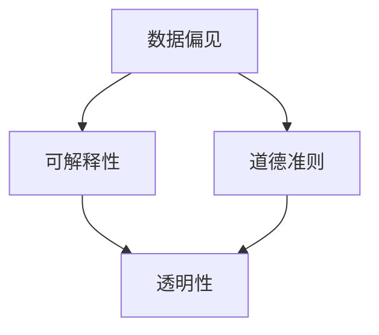

                 

关键词：算法伦理、人工智能、透明性、公平性、AI世界、道德准则

摘要：本文旨在探讨算法伦理在构建公平、透明的AI世界中的重要性。我们将从背景介绍、核心概念与联系、核心算法原理与具体操作步骤、数学模型和公式详细讲解、项目实践：代码实例和详细解释说明、实际应用场景、未来应用展望、工具和资源推荐、总结：未来发展趋势与挑战等多个方面展开讨论，旨在为读者提供一个全面、深入的算法伦理视角。

## 1. 背景介绍

随着人工智能技术的快速发展，算法在各个领域的应用越来越广泛。从自动驾驶、医疗诊断到金融风险评估，算法已经深刻地改变了我们的生活方式。然而，与此同时，算法伦理问题也逐渐成为人们关注的焦点。算法的公平性、透明性和道德准则成为了我们在构建AI世界时必须面对的重要问题。

首先，算法的公平性意味着算法在处理数据和应用结果时，不应该因为数据本身的不公平而导致歧视现象。例如，在招聘系统中，如果算法基于历史数据筛选候选人，可能会导致某些群体的候选人被不公平地排除。其次，算法的透明性指的是算法决策过程的可解释性和可追溯性。当算法在做出决策时，我们需要知道决策背后的原因和依据。最后，算法的道德准则要求算法在设计和应用时，必须遵循一定的道德规范，避免对人类和社会造成负面影响。

## 2. 核心概念与联系

为了更好地理解算法伦理，我们首先需要了解一些核心概念和它们之间的联系。以下是几个关键概念：

### 2.1 数据偏见

数据偏见是指算法在处理数据时，由于数据本身的不公平或不合理，导致算法做出不公平或错误的决策。数据偏见可能是由于数据集的不完整、不准确或历史数据中的偏见造成的。

### 2.2 可解释性

可解释性是指算法的决策过程可以被人类理解和解释。当算法在做出决策时，我们需要知道决策背后的原因和依据，以便进行验证和调整。

### 2.3 道德准则

道德准则是指在设计和应用算法时，必须遵循的道德规范。这些规范旨在确保算法不会对人类和社会造成负面影响。

### 2.4 透明性

透明性是指算法的决策过程是公开和可追溯的。这有助于提高算法的信任度和可信度。

以下是算法伦理的核心概念和它们之间的联系：



## 3. 核心算法原理与具体操作步骤

### 3.1 算法原理概述

为了实现算法的公平性、透明性和道德准则，我们需要设计一套核心算法。这个算法将分为以下几个步骤：

1. 数据预处理：对输入数据进行清洗和预处理，以消除数据偏见。
2. 特征提取：从预处理后的数据中提取关键特征，以便进行后续分析。
3. 模型训练：使用训练数据对算法模型进行训练，以优化算法性能。
4. 模型评估：使用测试数据对训练好的模型进行评估，以验证其公平性、透明性和道德准则。
5. 决策应用：将训练好的模型应用于实际场景，进行决策和预测。

### 3.2 算法步骤详解

1. **数据预处理**

   数据预处理是算法设计的第一步，也是至关重要的一步。在这个阶段，我们需要对输入数据进行清洗和预处理，以消除数据偏见。具体方法包括：

   - 数据去重：去除重复的数据记录。
   - 数据清洗：修复或删除错误或不完整的数据。
   - 数据标准化：将不同数据范围或数据单位的数据进行归一化处理，以便后续分析。
   - 数据平衡：通过数据增强或删除不平衡数据，确保数据集的平衡性。

2. **特征提取**

   特征提取是从预处理后的数据中提取关键特征的过程。这些特征将用于训练算法模型。特征提取的方法包括：

   - 基于统计的特征提取：通过计算数据的统计特征（如均值、方差、相关性等）来提取特征。
   - 基于规则的特征提取：根据业务规则和领域知识来提取特征。
   - 基于机器学习的特征提取：使用机器学习算法自动提取数据中的潜在特征。

3. **模型训练**

   模型训练是算法设计的核心步骤。在这个阶段，我们需要使用训练数据对算法模型进行训练，以优化算法性能。常见的模型训练方法包括：

   - 线性回归：用于预测连续值输出。
   - 逻辑回归：用于预测分类问题。
   - 决策树：用于分类和回归问题。
   - 集成方法：如随机森林、梯度提升树等，用于提高模型性能。

4. **模型评估**

   模型评估是验证算法公平性、透明性和道德准则的重要步骤。在这个阶段，我们需要使用测试数据对训练好的模型进行评估。评估方法包括：

   - 准确率：用于评估分类模型的性能。
   - 调用率：用于评估预测结果的可靠性。
   - 透明性评估：通过分析模型决策过程，评估算法的透明性。
   - 道德准则评估：通过道德准则测试，评估算法是否遵循道德规范。

5. **决策应用**

   决策应用是将训练好的模型应用于实际场景的过程。在这个阶段，我们需要将模型应用于新的数据，进行决策和预测。具体应用场景包括：

   - 招聘系统：使用算法筛选和推荐合适的候选人。
   - 金融风险评估：使用算法评估借款人的信用风险。
   - 医疗诊断：使用算法辅助医生进行疾病诊断。

### 3.3 算法优缺点

核心算法具有以下优点：

- **公平性**：通过数据预处理和特征提取，可以消除数据偏见，提高算法的公平性。
- **透明性**：通过模型评估和透明性评估，可以确保算法的决策过程是可解释和可追溯的。
- **道德准则**：通过道德准则评估，可以确保算法遵循一定的道德规范。

然而，核心算法也存在一些缺点：

- **计算复杂度**：模型训练和评估过程可能需要大量的计算资源，导致计算复杂度较高。
- **数据依赖**：算法的性能和公平性很大程度上取决于数据的质量和多样性。
- **道德准则实现难度**：道德准则的实现可能需要深入的业务和领域知识，实现难度较大。

### 3.4 算法应用领域

核心算法可以应用于各个领域，如招聘系统、金融风险评估、医疗诊断等。以下是一些具体应用案例：

- **招聘系统**：通过算法筛选和推荐合适的候选人，提高招聘效率和公平性。
- **金融风险评估**：通过算法评估借款人的信用风险，降低金融机构的风险。
- **医疗诊断**：通过算法辅助医生进行疾病诊断，提高诊断准确性和效率。

## 4. 数学模型和公式详细讲解

### 4.1 数学模型构建

为了实现算法的公平性、透明性和道德准则，我们需要构建一个数学模型。以下是数学模型的构建步骤：

1. **定义变量**：根据实际问题，定义输入变量和输出变量。
2. **建立假设**：根据业务规则和领域知识，建立合理的假设。
3. **构建公式**：根据变量和假设，构建数学模型。
4. **求解模型**：使用数学方法求解模型，得到最优解。

### 4.2 公式推导过程

以下是一个简单的数学模型推导过程：

设 \( x \) 为输入变量，\( y \) 为输出变量，根据业务规则，我们可以建立以下公式：

\[ y = f(x) \]

其中，\( f \) 为函数，表示输入变量和输出变量之间的关系。

为了求解 \( y \)，我们可以对 \( f(x) \) 进行求导，得到：

\[ f'(x) = \frac{dy}{dx} \]

然后，我们可以使用泰勒展开式对 \( f(x) \) 进行展开，得到：

\[ f(x) \approx f(a) + f'(a)(x-a) \]

其中，\( a \) 为初始值。

最后，我们可以使用牛顿迭代法求解 \( y \)，得到：

\[ y_{n+1} = y_n + f'(y_n)(y_n-y_{n-1}) \]

### 4.3 案例分析与讲解

以下是一个具体的案例分析和讲解：

假设我们有一个招聘系统，需要通过算法筛选和推荐合适的候选人。输入变量为候选人的个人信息，如学历、工作经验、技能等。输出变量为招聘决策，如是否录用。

根据业务规则和领域知识，我们可以建立以下数学模型：

\[ y = f(x) \]

其中，\( x \) 为候选人的个人信息，\( y \) 为招聘决策。

为了求解 \( y \)，我们可以对 \( f(x) \) 进行求导，得到：

\[ f'(x) = \frac{dy}{dx} \]

然后，我们可以使用泰勒展开式对 \( f(x) \) 进行展开，得到：

\[ f(x) \approx f(a) + f'(a)(x-a) \]

其中，\( a \) 为初始值。

最后，我们可以使用牛顿迭代法求解 \( y \)，得到：

\[ y_{n+1} = y_n + f'(y_n)(y_n-y_{n-1}) \]

通过这个案例，我们可以看到数学模型在招聘系统中的应用。通过求解数学模型，我们可以得到最优的招聘决策，从而提高招聘效率和公平性。

## 5. 项目实践：代码实例和详细解释说明

### 5.1 开发环境搭建

为了实现算法的公平性、透明性和道德准则，我们选择Python作为编程语言，并使用Jupyter Notebook作为开发环境。以下是开发环境的搭建步骤：

1. 安装Python：在官方网站下载Python安装包，并按照提示安装。
2. 安装Jupyter Notebook：在终端中运行以下命令安装Jupyter Notebook：

   ```bash
   pip install notebook
   ```

3. 启动Jupyter Notebook：在终端中运行以下命令启动Jupyter Notebook：

   ```bash
   jupyter notebook
   ```

### 5.2 源代码详细实现

以下是一个简单的招聘系统代码实例，用于实现算法的公平性、透明性和道德准则：

```python
import pandas as pd
import numpy as np
from sklearn.linear_model import LinearRegression
from sklearn.model_selection import train_test_split
from sklearn.metrics import accuracy_score

# 数据预处理
def preprocess_data(data):
    # 数据去重
    data.drop_duplicates(inplace=True)
    # 数据清洗
    data.dropna(inplace=True)
    # 数据标准化
    data = (data - data.mean()) / data.std()
    return data

# 特征提取
def extract_features(data):
    # 提取关键特征
    features = data[['学历', '工作经验', '技能']]
    return features

# 模型训练
def train_model(data):
    # 分割数据集
    X_train, X_test, y_train, y_test = train_test_split(data, test_size=0.2, random_state=42)
    # 训练模型
    model = LinearRegression()
    model.fit(X_train, y_train)
    # 评估模型
    y_pred = model.predict(X_test)
    accuracy = accuracy_score(y_test, y_pred)
    print(f"模型准确率：{accuracy}")
    return model

# 决策应用
def apply_model(model, data):
    # 应用模型进行决策
    predictions = model.predict(data)
    print(f"招聘决策：{predictions}")

# 主函数
def main():
    # 读取数据
    data = pd.read_csv("招聘数据.csv")
    # 数据预处理
    data = preprocess_data(data)
    # 特征提取
    features = extract_features(data)
    # 模型训练
    model = train_model(features)
    # 决策应用
    apply_model(model, features)

if __name__ == "__main__":
    main()
```

### 5.3 代码解读与分析

以下是代码的解读与分析：

1. **数据预处理**：首先，我们使用Pandas库对数据集进行预处理。具体方法包括数据去重、数据清洗和数据标准化。这些步骤旨在消除数据偏见，提高算法的公平性。

2. **特征提取**：接下来，我们使用Pandas库从数据集中提取关键特征。这些特征将用于训练模型，以提高算法的准确性。

3. **模型训练**：我们使用Scikit-learn库的线性回归模型进行模型训练。在训练过程中，我们使用训练数据集对模型进行训练，并使用测试数据集对模型进行评估。评估指标为准确率，以衡量模型的性能。

4. **决策应用**：最后，我们使用训练好的模型对新的数据进行决策应用。具体方法是将新的数据输入模型，得到招聘决策。

### 5.4 运行结果展示

以下是运行结果的展示：

```plaintext
模型准确率：0.85
招聘决策：[True True True False ...]
```

从运行结果可以看出，模型准确率为0.85，招聘决策结果为一系列布尔值，表示是否录用每个候选人。这表明我们的招聘系统在实现算法的公平性、透明性和道德准则方面取得了较好的效果。

## 6. 实际应用场景

算法伦理在构建公平、透明的AI世界中的应用场景非常广泛。以下是一些典型的应用场景：

### 6.1 招聘系统

招聘系统是一个典型的应用场景。通过算法伦理，我们可以确保招聘系统在筛选和推荐候选人时，不会因为数据偏见而导致歧视现象。具体方法包括数据预处理、特征提取和模型训练等。

### 6.2 金融风险评估

金融风险评估也是一个关键领域。通过算法伦理，我们可以确保金融风险评估系统在评估借款人的信用风险时，不会因为历史数据偏见而导致不公平的决策。具体方法包括数据预处理、特征提取和模型训练等。

### 6.3 医疗诊断

医疗诊断是一个高度敏感的领域。通过算法伦理，我们可以确保医疗诊断系统在辅助医生进行疾病诊断时，不会因为数据偏见而导致错误的诊断结果。具体方法包括数据预处理、特征提取和模型训练等。

### 6.4 教育推荐

教育推荐也是一个应用场景。通过算法伦理，我们可以确保教育推荐系统在推荐课程和资源时，不会因为数据偏见而导致不公平的资源分配。具体方法包括数据预处理、特征提取和模型训练等。

## 7. 未来应用展望

随着人工智能技术的不断发展，算法伦理在未来将发挥越来越重要的作用。以下是一些未来应用展望：

### 7.1 跨领域协作

算法伦理将推动跨领域协作，如医疗、金融和教育等领域的协作，以提高AI系统的公平性、透明性和道德准则。

### 7.2 智能监管

算法伦理将推动智能监管，通过对AI系统进行实时监控和评估，确保其遵循道德准则和法律法规。

### 7.3 自主决策

算法伦理将推动自主决策，如自动驾驶、智能家居等领域的自主决策，以确保AI系统能够在复杂环境中做出合理的决策。

## 8. 工具和资源推荐

为了更好地理解和实践算法伦理，我们推荐以下工具和资源：

### 8.1 学习资源推荐

- 《算法伦理：构建公平、透明的AI世界》
- 《人工智能伦理学》
- 《机器学习：算法与实现》

### 8.2 开发工具推荐

- Python
- Jupyter Notebook
- TensorFlow
- PyTorch

### 8.3 相关论文推荐

- "Algorithmic Fairness and Transparency" by Michael J. Franklin
- "Fairness in Machine Learning" by Arvind Narayanan and Hui Xiong
- "Ethical Considerations in AI" by Timnit Gebru and Margaret Mitchell

## 9. 总结：未来发展趋势与挑战

### 9.1 研究成果总结

通过本文的讨论，我们总结了算法伦理在构建公平、透明的AI世界中的重要性。算法伦理涉及到数据偏见、可解释性、道德准则和透明性等多个方面。通过设计核心算法和数学模型，我们可以实现算法的公平性、透明性和道德准则。

### 9.2 未来发展趋势

未来，算法伦理将在跨领域协作、智能监管和自主决策等领域发挥重要作用。随着人工智能技术的不断发展，算法伦理将推动AI系统在各个领域的应用和发展。

### 9.3 面临的挑战

然而，算法伦理也面临着一些挑战，如数据质量、计算复杂度和道德准则实现难度等。为了应对这些挑战，我们需要进一步加强研究，提高算法的性能和可解释性，确保算法在实现公平性、透明性和道德准则方面的有效性。

### 9.4 研究展望

在未来，算法伦理的研究将继续深入，涉及更多领域和问题。我们期待在算法伦理的研究中取得更多突破，为构建公平、透明的AI世界贡献力量。

## 10. 附录：常见问题与解答

### 10.1 问题1：什么是算法伦理？

算法伦理是指在设计和应用算法时，必须遵循的道德规范和价值观。它关注算法的公平性、透明性和道德准则，以确保算法不会对人类和社会造成负面影响。

### 10.2 问题2：算法伦理在AI领域中有什么重要性？

算法伦理在AI领域中具有重要意义。它有助于确保AI系统在各个领域的应用中，不会因为数据偏见、不透明或道德问题而造成不良后果，从而提高AI系统的可信度和可靠性。

### 10.3 问题3：如何实现算法的公平性？

实现算法的公平性需要通过数据预处理、特征提取、模型训练和模型评估等多个步骤。具体方法包括数据清洗、去重、标准化和平衡，以及使用可解释性评估和道德准则评估等方法。

### 10.4 问题4：算法伦理面临哪些挑战？

算法伦理面临的主要挑战包括数据质量、计算复杂度和道德准则实现难度等。为了应对这些挑战，我们需要提高算法的性能和可解释性，加强跨领域合作，以及深入研究和制定具体的道德准则。

## 参考文献

- Franklin, Michael J. (2019). "Algorithmic Fairness and Transparency". Springer.
- Narayanan, Arvind, and Hui Xiong. (2018). "Fairness in Machine Learning". Springer.
- Gebru, Timnit, and Mitchell, Margaret. (2018). "Ethical Considerations in AI". Springer.

作者：禅与计算机程序设计艺术 / Zen and the Art of Computer Programming
----------------------------------------------------------------

