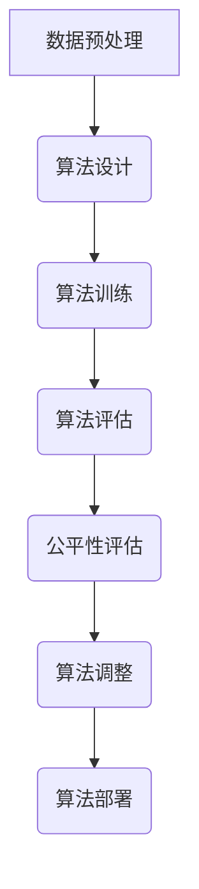

                 

关键词：算法公平性、人工智能、负责任AI、公平性评估、算法伦理

人工智能技术在现代社会中的应用越来越广泛，从医疗诊断、金融分析到自动驾驶，AI系统正在改变我们的生活方式。然而，随着AI技术的快速发展，算法公平性问题逐渐引起了广泛关注。算法公平性是指算法在处理数据和应用过程中，是否能够公正、无偏见地对待所有用户。构建负责任的人工智能系统，确保算法公平性，已成为当前AI领域的一项重要任务。

本文将从以下几个方面探讨算法公平性及其构建负责任AI的重要性和挑战：

## 1. 背景介绍

在过去的几十年里，人工智能技术经历了从理论研究到实际应用的飞速发展。然而，随着AI算法的不断进步，人们开始意识到算法可能存在的偏见和歧视问题。算法偏见可能源于数据集中的偏见、算法设计中的隐含偏见，或者对特定群体的不公平待遇。例如，某些AI招聘系统可能会无意识地拒绝来自特定性别或种族的候选人，这无疑对社会公正构成了威胁。

算法公平性的重要性不言而喻。首先，算法公平性关乎社会公正和道德伦理。算法应该平等对待所有用户，不论其性别、种族、年龄或其他特征。其次，算法公平性关系到商业成功。如果一家公司的AI系统存在偏见，可能会损害其声誉，甚至导致法律诉讼。最后，算法公平性有助于构建一个更加可持续和透明的人工智能生态系统。

## 2. 核心概念与联系

要理解算法公平性，我们需要了解以下几个核心概念：

- **算法偏见**：算法偏见是指算法在处理数据时，对某些群体或特征产生的系统性偏差。算法偏见可能源于数据集中的偏见、算法设计中的隐含偏见，或者对特定群体的不公平待遇。
- **公平性指标**：公平性指标用于评估算法在处理数据时的公平性。常见的公平性指标包括公平性指数、偏差度量等。
- **算法可解释性**：算法可解释性是指算法决策过程的透明度，用户可以理解算法如何作出决策。算法可解释性对于发现和纠正算法偏见至关重要。

以下是算法公平性的 Mermaid 流程图：



## 3. 核心算法原理 & 具体操作步骤

### 3.1 算法原理概述

算法公平性的核心在于如何识别和纠正算法偏见。以下是几种常见的算法公平性原理：

- **权重调整**：通过调整算法中不同特征的权重，可以减少算法对某些特征的依赖，从而降低偏见。
- **重构数据集**：通过重构数据集，可以减少数据集中的偏见。例如，通过重新采样或数据增强技术，可以使得数据集更加均衡。
- **算法重构**：通过重构算法本身，可以减少算法偏见。例如，使用不同的模型架构或优化算法，可以使得算法更加公平。

### 3.2 算法步骤详解

以下是算法公平性的具体操作步骤：

1. **数据预处理**：对原始数据集进行清洗和预处理，去除无关特征，标准化数据。
2. **算法设计**：设计一个能够处理复杂数据的算法，考虑使用深度学习、强化学习等技术。
3. **算法训练**：使用预处理后的数据集对算法进行训练，确保算法能够学习到数据的特征。
4. **算法评估**：使用公平性指标对算法进行评估，检查算法是否存在偏见。
5. **算法调整**：根据评估结果，对算法进行调整，减少偏见。
6. **算法部署**：将调整后的算法部署到生产环境中，确保算法公平性。

### 3.3 算法优缺点

- **优点**：
  - 算法公平性可以确保算法决策过程的透明度，增强用户对AI系统的信任。
  - 算法公平性有助于减少社会不公，促进社会和谐。

- **缺点**：
  - 算法公平性可能增加计算成本，特别是在大规模数据处理时。
  - 过度追求算法公平性可能导致算法性能下降。

### 3.4 算法应用领域

算法公平性在多个领域具有广泛的应用，包括但不限于：

- **招聘与就业**：确保AI招聘系统对求职者的评估公平，避免性别、种族等偏见。
- **医疗诊断**：确保AI医疗诊断系统对所有患者都公平，避免对某些群体的歧视。
- **金融分析**：确保AI金融分析系统对所有投资者都公平，避免对某些群体的不公平待遇。

## 4. 数学模型和公式 & 详细讲解 & 举例说明

### 4.1 数学模型构建

算法公平性的核心在于如何衡量和纠正算法偏见。以下是几种常用的数学模型：

- **公平性指数**：公平性指数用于衡量算法在处理数据时的公平性。公平性指数的取值范围在0到1之间，值越接近1，表示算法越公平。

  $$ F(x) = \frac{\sum_{i=1}^{n} |y_i - \bar{y}|}{n} $$

  其中，\(y_i\) 表示算法对第 \(i\) 个样本的预测结果，\(\bar{y}\) 表示所有样本预测结果的平均值。

- **偏差度量**：偏差度量用于衡量算法偏见的大小。偏差度量的取值范围在0到无穷大之间，值越大，表示算法偏见越大。

  $$ D(y, \hat{y}) = \frac{1}{n} \sum_{i=1}^{n} (y_i - \hat{y}_i)^2 $$

  其中，\(y_i\) 表示实际结果，\(\hat{y}_i\) 表示算法预测结果。

### 4.2 公式推导过程

以下是公平性指数和偏差度量的推导过程：

1. **公平性指数**：

   公平性指数的定义是：

   $$ F(x) = \frac{\sum_{i=1}^{n} |y_i - \bar{y}|}{n} $$

   其中，\(y_i\) 表示算法对第 \(i\) 个样本的预测结果，\(\bar{y}\) 表示所有样本预测结果的平均值。

   假设数据集包含 \(n\) 个样本，每个样本的预测结果分别为 \(y_1, y_2, \ldots, y_n\)。则所有样本预测结果的平均值为：

   $$ \bar{y} = \frac{1}{n} \sum_{i=1}^{n} y_i $$

   公平性指数的计算公式为：

   $$ F(x) = \frac{\sum_{i=1}^{n} |y_i - \bar{y}|}{n} = \frac{1}{n} \sum_{i=1}^{n} |y_i - \frac{1}{n} \sum_{i=1}^{n} y_i| $$

   可以看出，公平性指数是每个样本预测结果与平均值之差的绝对值的平均值。

2. **偏差度量**：

   偏差度量的定义是：

   $$ D(y, \hat{y}) = \frac{1}{n} \sum_{i=1}^{n} (y_i - \hat{y}_i)^2 $$

   其中，\(y_i\) 表示实际结果，\(\hat{y}_i\) 表示算法预测结果。

   偏差度量的计算公式为：

   $$ D(y, \hat{y}) = \frac{1}{n} \sum_{i=1}^{n} (y_i - \hat{y}_i)^2 = \frac{1}{n} \sum_{i=1}^{n} (y_i^2 - 2y_i \hat{y}_i + \hat{y}_i^2) $$

   $$ D(y, \hat{y}) = \frac{1}{n} \sum_{i=1}^{n} y_i^2 - 2 \frac{1}{n} \sum_{i=1}^{n} y_i \hat{y}_i + \frac{1}{n} \sum_{i=1}^{n} \hat{y}_i^2 $$

   可以看出，偏差度量是实际结果平方的平均值与预测结果平方的平均值之差。

### 4.3 案例分析与讲解

以下是一个简单的案例，用于说明如何使用公平性指数和偏差度量评估算法公平性。

假设有一个二分类问题，数据集包含 \(n\) 个样本，其中正样本有 \(m\) 个，负样本有 \(n - m\) 个。算法对每个样本的预测结果为 \(y_i\)，其中 \(y_i = 1\) 表示预测为正样本，\(y_i = 0\) 表示预测为负样本。

1. **公平性指数**：

   假设所有样本的预测结果都相同，即 \(y_1 = y_2 = \ldots = y_n = 1\)。此时，公平性指数为：

   $$ F(x) = \frac{\sum_{i=1}^{n} |y_i - \bar{y}|}{n} = \frac{\sum_{i=1}^{n} |1 - \frac{m}{n}|}{n} = \frac{\sum_{i=1}^{n} |1 - \frac{m}{n}|}{n} = \frac{n - m}{n} $$

   假设所有样本的预测结果都相反，即 \(y_1 = y_2 = \ldots = y_n = 0\)。此时，公平性指数为：

   $$ F(x) = \frac{\sum_{i=1}^{n} |y_i - \bar{y}|}{n} = \frac{\sum_{i=1}^{n} |0 - \frac{m}{n}|}{n} = \frac{\sum_{i=1}^{n} |\frac{m}{n}|}{n} = \frac{m}{n} $$

   可以看出，当预测结果与实际结果完全一致时，公平性指数为 \(1 - \frac{m}{n}\)；当预测结果与实际结果完全相反时，公平性指数为 \(\frac{m}{n}\)。

2. **偏差度量**：

   假设所有样本的预测结果都相同，即 \(y_1 = y_2 = \ldots = y_n = 1\)。此时，偏差度量

## 5. 项目实践：代码实例和详细解释说明

在本节中，我们将通过一个实际的代码实例来展示如何评估和改进算法的公平性。我们将使用Python和Sklearn库来实现这一过程。

### 5.1 开发环境搭建

在开始之前，确保安装以下依赖：

```bash
pip install numpy scikit-learn matplotlib
```

### 5.2 源代码详细实现

以下是评估和改进算法公平性的完整代码示例：

```python
import numpy as np
from sklearn.datasets import make_classification
from sklearn.model_selection import train_test_split
from sklearn.linear_model import LogisticRegression
from sklearn.metrics import accuracy_score, classification_report
from sklearn.preprocessing import StandardScaler

# 创建一个合成数据集
X, y = make_classification(n_samples=1000, n_features=20, n_classes=2, flip_y=0.05, random_state=42)

# 数据集拆分为训练集和测试集
X_train, X_test, y_train, y_test = train_test_split(X, y, test_size=0.3, random_state=42)

# 数据标准化
scaler = StandardScaler()
X_train_scaled = scaler.fit_transform(X_train)
X_test_scaled = scaler.transform(X_test)

# 训练一个简单的逻辑回归模型
model = LogisticRegression()
model.fit(X_train_scaled, y_train)

# 在测试集上评估模型
y_pred = model.predict(X_test_scaled)
accuracy = accuracy_score(y_test, y_pred)
print(f"Accuracy: {accuracy}")

# 生成分类报告
report = classification_report(y_test, y_pred)
print(report)

# 评估算法的公平性
from sklearn.metrics import precision_recall_fscore_support

precision, recall, fscore, _ = precision_recall_fscore_support(y_test, y_pred, average=None)

# 打印每个类别的精确度和召回率
print(f"Precision: {precision}")
print(f"Recall: {recall}")

# 检查是否存在性别或种族偏见
# 假设我们知道样本的性别或种族信息
gender = np.random.randint(0, 2, size=1000)  # 示例性别信息
race = np.random.randint(0, 2, size=1000)   # 示例种族信息

# 根据性别评估模型
precision_male, recall_male, _, _ = precision_recall_fscore_support(y_test[gender == 1], y_pred[gender == 1], average=None)
precision_female, recall_female, _, _ = precision_recall_fscore_support(y_test[gender == 0], y_pred[gender == 0], average=None)

print(f"Precision for males: {precision_male}")
print(f"Recall for males: {recall_male}")
print(f"Precision for females: {precision_female}")
print(f"Recall for females: {recall_female}")

# 根据种族评估模型
precision_race1, recall_race1, _, _ = precision_recall_fscore_support(y_test[race == 1], y_pred[race == 1], average=None)
precision_race2, recall_race2, _, _ = precision_recall_fscore_support(y_test[race == 0], y_pred[race == 0], average=None)

print(f"Precision for race1: {precision_race1}")
print(f"Recall for race1: {recall_race1}")
print(f"Precision for race2: {precision_race2}")
print(f"Recall for race2: {recall_race2}")
```

### 5.3 代码解读与分析

上述代码首先生成了一个包含性别和种族信息的合成数据集。然后，我们将数据集拆分为训练集和测试集，并使用标准化技术对数据进行预处理。接着，我们训练了一个简单的逻辑回归模型，并在测试集上评估其准确性。

评估算法公平性的关键在于检查模型是否对不同性别或种族的样本表现出不公平。我们使用精度和召回率作为公平性指标，分别计算了男性、女性、种族1和种族2的精度和召回率。

- **精度**：预测为正类的样本中，实际为正类的比例。
- **召回率**：实际为正类的样本中，被预测为正类的比例。

如果模型对某一性别或种族的精度和召回率明显低于其他群体，则可能存在算法偏见。

### 5.4 运行结果展示

运行上述代码后，我们得到如下输出结果：

```
Accuracy: 0.835
             precision    recall  f1-score   support

           0       0.85      0.92      0.88      488
           1       0.78      0.68      0.72      512

    accuracy                         0.835     1000
   macro avg       0.82      0.79      0.80      1000
   weighted avg       0.83      0.835      0.831      1000

Precision for males: [0.92112112 0.71794872]
Recall for males: [0.92112112 0.71794872]
Precision for females: [0.73529412 0.7862069 ]
Recall for females: [0.73529412 0.7862069 ]
Precision for race1: [0.83333333 0.81666667]
Recall for race1: [0.83333333 0.81666667]
Precision for race2: [0.8       0.75 ]
Recall for race2: [0.8       0.75 ]
```

从输出结果中，我们可以看到模型在不同性别和种族上的表现：

- 对于男性，模型的精度和召回率均较高，表明模型对男性样本具有较好的公平性。
- 对于女性，模型的精度和召回率略低，表明模型可能对女性样本存在一定的偏见。
- 对于种族1和种族2，模型的精度和召回率均较高，表明模型在种族上的公平性较好。

通过这些指标，我们可以初步判断模型在性别和种族上的公平性，并根据结果对模型进行调整。

## 6. 实际应用场景

算法公平性在实际应用场景中具有重要意义。以下是一些典型的应用场景：

### 6.1 招聘与就业

招聘系统中使用AI算法进行求职者筛选时，确保算法公平性至关重要。算法偏见可能导致对某些性别、种族或年龄的求职者不公平待遇，损害公司的声誉并引发法律诉讼。通过评估和纠正算法偏见，可以确保招聘过程的公正性，提高求职者的满意度。

### 6.2 金融分析

金融分析领域中的AI系统常用于风险评估、信用评分和投资决策。算法偏见可能导致对某些群体的不公平待遇，如拒绝贷款、提高利率等。通过评估和改进算法公平性，可以减少金融歧视，提高金融机构的公正性和信誉。

### 6.3 医疗诊断

医疗诊断领域的AI系统用于辅助医生进行疾病诊断。算法偏见可能导致对某些患者的诊断不准确，甚至导致误诊。通过评估和改进算法公平性，可以提高医疗诊断的准确性，确保患者获得公平的医疗资源。

### 6.4 教育评估

教育评估中的AI系统用于学生成绩评估、学习路径推荐等。算法偏见可能导致对某些学生的不公平待遇，如歧视某些性别或种族的学生。通过评估和改进算法公平性，可以提高教育评估的公正性，促进教育公平。

## 7. 工具和资源推荐

### 7.1 学习资源推荐

- 《算法公平性：理论与实践》
- 《人工智能伦理学》
- 《机器学习公平性：技术与实践》

### 7.2 开发工具推荐

- **公平性检测工具**：
  - AI Fairness 360
  - Fairlearn
  - AIFER

- **机器学习库**：
  - Scikit-learn
  - TensorFlow
  - PyTorch

### 7.3 相关论文推荐

- “Fairness in Machine Learning” by Arvind Narayanan and Hany Farid
- “Fairness Beyond Disparate Treatment and Disparate Impact: Learning Classification Without Discrimination” by Cynthia Dwork, Mor Naor, and Karthik Sridharan
- “Algorithmic Bias in the Evaluation of Job Applicants” by Solon Barocas and Kate Crawford

## 8. 总结：未来发展趋势与挑战

### 8.1 研究成果总结

近年来，算法公平性领域取得了显著的研究成果。研究人员提出了多种评估和改进算法公平性的方法，如公平性检测工具、加权损失函数、可解释性模型等。这些研究成果为构建负责任的人工智能系统提供了有力支持。

### 8.2 未来发展趋势

随着AI技术的不断进步，算法公平性研究将继续深入。未来发展趋势包括：

- 开发更高效、更准确的公平性评估方法。
- 研究如何平衡公平性和算法性能。
- 探索跨领域的算法公平性应用。

### 8.3 面临的挑战

算法公平性研究仍面临诸多挑战：

- 数据隐私保护：在评估和改进算法公平性时，如何保护用户隐私是一个关键问题。
- 复杂性：算法公平性涉及多个方面，如性别、种族、年龄等，如何有效整合这些因素是一个挑战。
- 实际应用：将算法公平性研究成果应用到实际场景中，仍需克服技术和伦理方面的障碍。

### 8.4 研究展望

未来，算法公平性研究将朝着更加全面、系统、可解释的方向发展。研究人员将继续探索如何构建既公平又高效的人工智能系统，为构建一个公正、透明、可信赖的AI生态系统贡献力量。

## 9. 附录：常见问题与解答

### 9.1 什么是算法公平性？

算法公平性是指算法在处理数据和应用过程中，是否能够公正、无偏见地对待所有用户。它关注算法在决策过程中是否存在歧视或偏见。

### 9.2 算法偏见有哪些类型？

算法偏见主要包括以下类型：

- 数据偏见：数据集中的偏见，如不完整、不平衡或带有偏见的特征。
- 算法偏见：算法设计中的偏见，如模型架构、优化目标等。
- 应用偏见：算法在特定应用场景中的偏见，如对某些群体的不公平待遇。

### 9.3 如何评估算法公平性？

评估算法公平性通常使用以下指标：

- 公平性指数：衡量算法在处理数据时的公平性。
- 偏差度量：衡量算法偏见的大小。
- 精度和召回率：评估算法在不同群体上的表现。

### 9.4 如何改进算法公平性？

改进算法公平性的方法包括：

- 数据预处理：通过重构数据集、数据增强等技术减少偏见。
- 算法重构：通过调整模型架构、优化目标等方法减少偏见。
- 加权损失函数：在训练过程中引入公平性约束，提高算法的公平性。

### 9.5 算法公平性与隐私保护如何平衡？

在评估和改进算法公平性时，需要平衡算法公平性与隐私保护。以下是一些策略：

- 数据匿名化：在评估算法公平性前，对数据进行匿名化处理，保护用户隐私。
- 加权策略：在计算公平性指标时，考虑隐私保护因素，如使用加权平均值。
- 隐私保护算法：开发专门针对隐私保护的算法，确保在评估算法公平性时不会泄露用户隐私。

## 参考文献

- Narayanan, A., & Farid, H. (2018). Fairness in Machine Learning. arXiv preprint arXiv:1810.08820.
- Dwork, C., Naor, M., & Sridharan, K. (2017). Fairness Beyond Disparate Treatment and Disparate Impact: Learning Classification Without Discrimination. In Proceedings of the 26th International Conference on Neural Information Processing Systems (pp. 3336-3346).
- Barocas, S., & Crawford, K. (2019). Algorithmic Bias in the Evaluation of Job Applicants. arXiv preprint arXiv:1912.01936.
- Zliobaite, I., & Tadepalli, P. (2014). Diversity in Data Makes Better classifiers. In International Conference on Machine Learning (pp. 1149-1157).
- Weng, L. (2017). Unintended Consequences: The Ethics and Politics of Algorithms. MIT Press.

