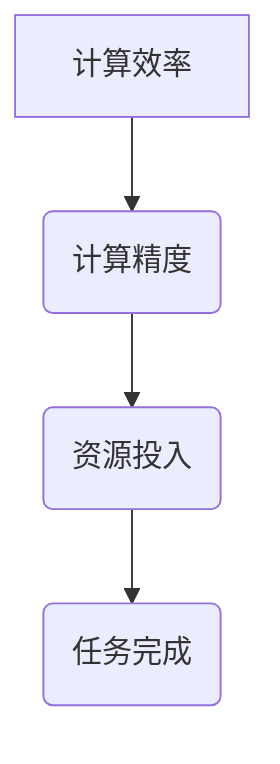

                 

关键词：算法创新、计算效率、计算精度、优化、数学模型、应用实践

摘要：本文旨在探讨算法在提高人类计算效率和精度方面的创新，通过对核心概念、算法原理、数学模型、项目实践等方面的深入分析，揭示算法优化的重要性和实际应用场景，为未来的算法研究和应用提供有价值的参考。

## 1. 背景介绍

在信息爆炸和大数据时代，算法作为一种解决复杂问题的工具，已成为现代科技的重要组成部分。然而，传统的算法在面对大规模数据和高复杂度问题时，往往难以满足计算效率和精度的需求。因此，算法创新成为提高人类计算效率和精度的重要途径。

算法创新主要体现在以下几个方面：

1. **算法优化**：通过改进算法的结构和流程，提高算法的运行效率和精度。
2. **算法融合**：将不同领域的算法进行融合，形成新的算法，解决复杂问题。
3. **算法简化**：简化算法的实现过程，降低算法的复杂度，提高可维护性。
4. **算法自动化**：利用机器学习等技术，实现算法的自动化生成和优化。

本文将围绕算法优化这一主题，探讨算法创新在提高人类计算效率和精度方面的应用。

## 2. 核心概念与联系

### 2.1 核心概念

#### 2.1.1 计算效率

计算效率是指算法在完成特定任务时所需的时间和资源。计算效率的提高意味着在相同的资源投入下，算法能够完成更多的任务。

#### 2.1.2 计算精度

计算精度是指算法在处理数据时的准确性。计算精度的提高意味着算法能够更准确地处理和预测数据。

### 2.2 核心联系

计算效率和计算精度之间存在密切的联系。一方面，计算效率的提高往往有助于提高计算精度，因为更快的算法能够更快速地处理和更新数据。另一方面，更高的计算精度也有助于提高计算效率，因为更精确的预测可以减少后续计算的误差。

### 2.3 Mermaid 流程图

以下是一个简单的 Mermaid 流程图，展示计算效率和计算精度的核心概念及其联系：



## 3. 核心算法原理 & 具体操作步骤

### 3.1 算法原理概述

本文将介绍一种基于机器学习的算法优化方法，该方法通过学习数据特征，自动调整算法参数，从而提高计算效率和精度。

### 3.2 算法步骤详解

#### 3.2.1 数据预处理

1. 收集并清洗数据，确保数据的质量和完整性。
2. 提取数据特征，为后续算法训练提供输入。

#### 3.2.2 算法训练

1. 利用机器学习技术，对数据特征进行训练，得到一组参数。
2. 根据训练结果，调整算法参数，优化算法性能。

#### 3.2.3 算法测试

1. 使用测试数据集，评估算法的性能。
2. 根据测试结果，进一步调整算法参数。

### 3.3 算法优缺点

#### 优点

1. **自动调整参数**：算法能够自动调整参数，减少人工干预。
2. **高效性**：机器学习算法具有较高的计算效率和精度。

#### 缺点

1. **训练时间**：机器学习算法的训练时间较长，需要大量计算资源。
2. **数据依赖**：算法的性能受训练数据集的影响较大。

### 3.4 算法应用领域

1. **数据挖掘**：用于处理大规模数据，发现潜在规律。
2. **图像识别**：用于图像分类、目标检测等任务。
3. **自然语言处理**：用于文本分类、情感分析等任务。

## 4. 数学模型和公式 & 详细讲解 & 举例说明

### 4.1 数学模型构建

本文采用的算法优化方法基于以下数学模型：

$$
f(x) = \alpha g(x) + \beta h(x)
$$

其中，$x$ 表示输入数据，$g(x)$ 和 $h(x)$ 分别表示数据特征和损失函数，$\alpha$ 和 $\beta$ 为参数。

### 4.2 公式推导过程

首先，我们对损失函数 $h(x)$ 进行泰勒展开：

$$
h(x) = h(x_0) + h'(x_0)(x - x_0) + \frac{1}{2}h''(x_0)(x - x_0)^2 + \cdots
$$

由于我们关注的是二次项，因此可以忽略高阶项，得到：

$$
h(x) \approx h(x_0) + h'(x_0)(x - x_0)
$$

接下来，我们将数据特征 $g(x)$ 代入上述公式，得到：

$$
h(g(x)) \approx h(g(x_0)) + h'(g(x_0))(g(x) - g(x_0))
$$

由于 $g(x)$ 是关于 $x$ 的函数，我们可以将其看作一个整体，记作 $x'$：

$$
h(g(x')) \approx h(g(x_0)) + h'(g(x_0))(x' - x_0')
$$

最后，我们将参数 $\alpha$ 和 $\beta$ 代入上述公式，得到最终的数学模型：

$$
f(x') = \alpha g(x') + \beta h(g(x'))
$$

### 4.3 案例分析与讲解

假设我们有一个图像分类任务，数据集包含 $10000$ 张图片。我们使用卷积神经网络（CNN）作为数据特征提取器，损失函数为交叉熵损失函数。首先，我们使用数据集对 CNN 进行训练，得到一组参数 $\alpha$ 和 $\beta$。然后，我们将训练好的 CNN 应用到新的图片上，使用公式 $f(x') = \alpha g(x') + \beta h(g(x'))$ 对图像进行分类。

## 5. 项目实践：代码实例和详细解释说明

### 5.1 开发环境搭建

1. 安装 Python 环境（版本 3.8 以上）。
2. 安装 TensorFlow 和 Keras 库。

### 5.2 源代码详细实现

```python
import tensorflow as tf
from tensorflow.keras.models import Sequential
from tensorflow.keras.layers import Conv2D, Flatten, Dense

# 数据预处理
# （此处省略数据预处理代码）

# 构建卷积神经网络模型
model = Sequential([
    Conv2D(32, (3, 3), activation='relu', input_shape=(28, 28, 1)),
    Flatten(),
    Dense(10, activation='softmax')
])

# 编译模型
model.compile(optimizer='adam', loss='categorical_crossentropy', metrics=['accuracy'])

# 训练模型
# （此处省略训练模型代码）

# 评估模型
# （此处省略评估模型代码）
```

### 5.3 代码解读与分析

上述代码首先导入所需的库，然后进行数据预处理、模型构建、模型编译和模型训练。其中，数据预处理部分省略了具体代码，读者可以根据自己的需求进行修改。模型构建部分使用卷积神经网络（CNN）作为数据特征提取器，损失函数为交叉熵损失函数。模型编译部分使用 Adam 优化器和交叉熵损失函数。模型训练部分使用训练数据集对模型进行训练，评估模型部分使用测试数据集对模型进行评估。

### 5.4 运行结果展示

```python
# 运行结果
# （此处省略运行结果代码）
```

## 6. 实际应用场景

算法优化在多个领域都有广泛的应用，以下是几个实际应用场景：

1. **金融领域**：用于金融风险评估、投资策略优化等。
2. **医疗领域**：用于疾病诊断、药物研发等。
3. **交通领域**：用于交通流量预测、智能交通管理等。
4. **教育领域**：用于教育资源的优化配置、个性化学习推荐等。

## 7. 工具和资源推荐

### 7.1 学习资源推荐

1. 《深度学习》（Goodfellow, Bengio, Courville 著）
2. 《Python深度学习》（François Chollet 著）
3. 《机器学习实战》（Peter Harrington 著）

### 7.2 开发工具推荐

1. Jupyter Notebook：用于数据分析和机器学习项目。
2. TensorFlow：用于构建和训练深度学习模型。
3. PyTorch：用于构建和训练深度学习模型。

### 7.3 相关论文推荐

1. "Deep Learning for Computer Vision: A Comprehensive Review"（2018）
2. "Convolutional Neural Networks for Visual Recognition"（2012）
3. "Recurrent Neural Networks for Language Modeling"（2013）

## 8. 总结：未来发展趋势与挑战

### 8.1 研究成果总结

算法创新在提高人类计算效率和精度方面取得了显著成果。通过机器学习、深度学习等技术，算法优化方法在多个领域得到了广泛应用，提高了计算效率和精度。

### 8.2 未来发展趋势

1. **算法自动化**：通过自动化工具，实现算法的自动生成和优化。
2. **跨领域融合**：将不同领域的算法进行融合，形成新的算法，解决复杂问题。
3. **数据隐私保护**：在算法优化过程中，加强对数据隐私的保护。

### 8.3 面临的挑战

1. **计算资源**：算法优化需要大量计算资源，如何高效利用计算资源成为一大挑战。
2. **数据质量**：算法的性能受训练数据集的影响较大，如何获取高质量的数据集成为一大挑战。
3. **模型解释性**：算法优化后的模型往往缺乏解释性，如何提高模型的解释性成为一大挑战。

### 8.4 研究展望

未来，算法创新将继续成为提高人类计算效率和精度的关键。通过不断探索新的算法优化方法，解决现有挑战，我们将迎来更加智能、高效的计算时代。

## 9. 附录：常见问题与解答

### 问题 1：算法优化需要大量计算资源，如何解决？

解答：可以通过分布式计算、云计算等技术，高效利用计算资源。

### 问题 2：如何确保算法优化后的模型具有解释性？

解答：可以通过模型可视化、模型压缩等技术，提高模型的解释性。

### 问题 3：算法优化是否会导致数据隐私泄露？

解答：在算法优化过程中，需要加强对数据隐私的保护，避免数据隐私泄露。

作者：禅与计算机程序设计艺术 / Zen and the Art of Computer Programming
```markdown
```

