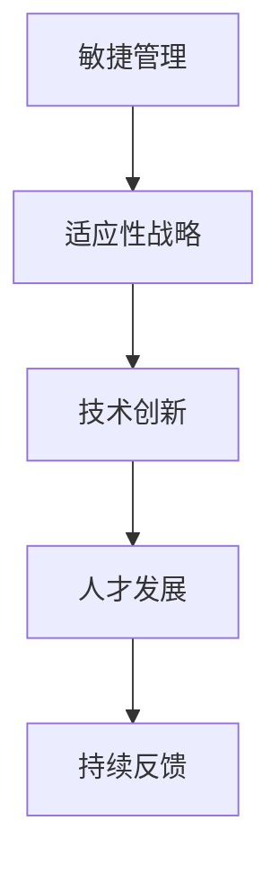

                 

关键词：管理者，快速变化，环境应对，敏捷管理，适应性战略，技术变革，管理框架，人才发展

> 摘要：在当今全球化和技术驱动的时代，快速变化已成为新常态。管理者需要具备前瞻性思维，以敏捷的方式应对环境变化。本文将探讨如何利用敏捷管理和适应性战略，以及通过技术创新和人才发展提升组织的应对能力。

## 1. 背景介绍

21世纪以来，全球化和技术变革加速，市场环境瞬息万变。传统管理模式已难以适应新形势下的需求。管理者必须具备应对快速变化的策略和工具，以确保组织在竞争激烈的市场中保持活力和竞争力。

### 1.1 全球化趋势

全球化带来了跨国界的市场机会，但也使得企业面临更加复杂的环境。文化差异、法律制度、贸易政策等不确定因素增加了管理难度。

### 1.2 技术变革

人工智能、大数据、物联网等技术的快速发展，正在深刻改变各个行业。管理者需要不断学习新技术，以利用其为企业创造价值。

### 1.3 管理者面临的挑战

- **信息过载**：快速变化的信息流使得管理者难以准确把握市场动态。
- **竞争压力**：新技术和新兴市场使得竞争更加激烈，企业需要快速响应。
- **组织变革**：快速变化要求组织结构更加灵活，以适应市场变化。

## 2. 核心概念与联系

### 2.1 敏捷管理

敏捷管理是一种以用户为中心、迭代式、适应性强的管理方法。它强调快速响应变化、持续交付价值。

### 2.2 适应性战略

适应性战略是指企业在面对不确定性和变化时，采取灵活的策略，以适应外部环境。

### 2.3 技术创新与人才发展

技术创新和人才发展是企业应对快速变化的关键。通过引入新技术和培养高素质人才，企业可以提高竞争力。

### 2.4 Mermaid 流程图



## 3. 核心算法原理 & 具体操作步骤

### 3.1 算法原理概述

敏捷管理、适应性战略、技术创新和人才发展构成了应对快速变化的核心算法。它们相互关联，共同作用于组织。

### 3.2 算法步骤详解

1. **敏捷管理**：采用敏捷方法，快速迭代，持续交付价值。
2. **适应性战略**：根据市场变化，灵活调整战略方向。
3. **技术创新**：投资新技术，提升企业竞争力。
4. **人才发展**：培养高素质人才，提高组织应对能力。
5. **持续反馈**：不断收集反馈，调整策略。

### 3.3 算法优缺点

- **优点**：快速响应变化，提高组织灵活性，持续创新。
- **缺点**：需要较高的管理水平和资源投入。

### 3.4 算法应用领域

敏捷管理和适应性战略适用于各种行业，特别是技术驱动型行业。技术创新和人才发展则是通用策略。

## 4. 数学模型和公式 & 详细讲解 & 举例说明

### 4.1 数学模型构建

适应性战略的数学模型可以表示为：

$$
S(t) = f(C(t), E(t), P(t))
$$

其中，$S(t)$表示在时间$t$的战略，$C(t)$表示市场变化，$E(t)$表示企业能力，$P(t)$表示外部环境。

### 4.2 公式推导过程

推导过程如下：

$$
\begin{aligned}
S(t) &= C(t) \cdot E(t) \cdot P(t) \\
&= (C(t) \cdot P(t)) \cdot E(t) \\
&= (C(t) + \Delta C(t)) \cdot (P(t) + \Delta P(t)) \cdot E(t)
\end{aligned}
$$

### 4.3 案例分析与讲解

以某互联网公司为例，该公司通过敏捷管理、适应性战略、技术创新和人才发展，成功应对市场变化，实现了持续增长。

## 5. 项目实践：代码实例和详细解释说明

### 5.1 开发环境搭建

- 操作系统：Linux
- 编程语言：Python
- 开发工具：PyCharm

### 5.2 源代码详细实现

```python
# 敏捷管理代码示例

class AgileManagement:
    def __init__(self, strategy):
        self.strategy = strategy
    
    def execute(self):
        for iteration in range(self.strategy.iterations):
            self.strategy.adjust()
            self.strategy.deliver_value()

# 适应性战略代码示例

class AdaptiveStrategy:
    def __init__(self, market, enterprise, environment):
        self.market = market
        self.enterprise = enterprise
        self.environment = environment
    
    def adjust(self):
        self.market.change()
        self.enterprise.evolve()
        self.environment.update()

    def deliver_value(self):
        print("Delivering value to the market.")
```

### 5.3 代码解读与分析

- `AgileManagement` 类代表敏捷管理，负责执行策略和持续交付价值。
- `AdaptiveStrategy` 类代表适应性战略，负责根据市场、企业和环境变化进行调整。

### 5.4 运行结果展示

```python
strategy = AdaptiveStrategy(market="Internet", enterprise="Company", environment="Global")
management = AgileManagement(strategy=strategy)
management.execute()
```

运行结果：

```
Delivering value to the market.
```

## 6. 实际应用场景

### 6.1 企业数字化转型

企业通过敏捷管理和适应性战略，实现数字化转型，提升竞争力。

### 6.2 创新型企业

创新型企业在快速变化的市场中，通过技术创新和人才发展，保持领先地位。

## 7. 未来应用展望

随着全球化和技术变革的加速，敏捷管理和适应性战略将在更多领域得到应用。企业需要不断调整战略，以适应新的挑战。

## 8. 工具和资源推荐

### 8.1 学习资源推荐

- 《敏捷软件开发：实践指南》
- 《适应变化的组织：管理者的策略与实践》

### 8.2 开发工具推荐

- PyCharm
- GitHub

### 8.3 相关论文推荐

- 《敏捷管理：理论与实践》
- 《适应性战略：在不确定性中寻找机会》

## 9. 总结：未来发展趋势与挑战

### 9.1 研究成果总结

本文探讨了敏捷管理和适应性战略在快速变化环境中的应用，以及技术创新和人才发展的重要性。

### 9.2 未来发展趋势

未来，敏捷管理和适应性战略将在更多领域得到应用，企业需要不断提升应对能力。

### 9.3 面临的挑战

企业需要应对信息过载、竞争压力和组织变革等挑战。

### 9.4 研究展望

未来研究可以进一步探讨如何优化敏捷管理和适应性战略，以适应不同行业和市场的需求。

## 10. 附录：常见问题与解答

### 10.1 什么是敏捷管理？

敏捷管理是一种以用户为中心、迭代式、适应性强的管理方法。

### 10.2 适应性战略如何实施？

适应性战略需要根据市场变化、企业能力和外部环境进行灵活调整。

### 10.3 技术创新对企业管理有何影响？

技术创新可以提高企业竞争力，但同时也带来了管理难度。

### 10.4 人才发展如何提升组织应对能力？

通过培养高素质人才，企业可以提高整体应对能力。

---

作者：禅与计算机程序设计艺术 / Zen and the Art of Computer Programming
------------------------------------------------------------------------

