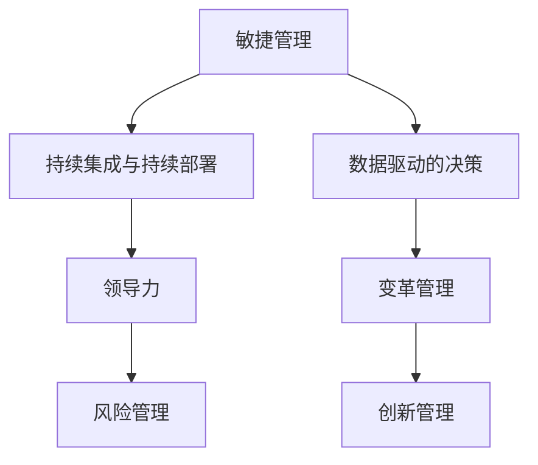

                 

在当今这个数字化、全球化迅速发展的时代，环境的变化已经成为企业管理和商业运作中不可忽视的挑战。作为管理者，面对快速变化的环境，如何制定策略，优化决策过程，以及培养团队适应变化的灵活性，是确保企业持续成长和竞争力的关键。

本文将围绕以下核心问题展开讨论：

- **快速变化环境的特征及其对管理的影响**
- **管理者应具备的关键技能和思维模式**
- **适应快速变化的管理策略与方法**
- **如何在团队中培养适应性的文化**

通过深入分析这些主题，我们将探索管理者如何能够有效地应对快速变化的环境，从而在竞争激烈的市场中保持领先地位。

## 1. 背景介绍

在过去几十年中，信息技术和通信技术的飞速发展极大地改变了全球经济的运作方式。互联网的普及、大数据的兴起、人工智能的应用以及物联网的逐步成熟，使得信息传播的速度和范围都达到了前所未有的高度。这些技术进步不仅改变了消费者行为，还重新定义了商业运营模式，对企业管理提出了新的挑战。

**全球化** 是另一个影响深远的趋势。全球化打破了地域限制，使得企业可以跨越国界进行运营和竞争。然而，这也带来了新的复杂性和不确定性，例如文化差异、政策变化和国际贸易摩擦等。

**消费者需求的快速变化** 是当今市场的一个显著特征。消费者的期望不断升高，他们希望产品和服务能够满足个性化的需求，并且能够迅速响应市场变化。这种需求变化迫使企业必须更加灵活和敏捷，以快速调整产品和服务策略。

**市场竞争的加剧** 进一步增加了管理者的挑战。随着市场透明度的提高和竞争者的增多，企业需要不断创新和优化，才能在激烈的市场竞争中脱颖而出。

在这样的背景下，管理者必须具备高度的洞察力、战略思维和执行能力，才能有效地应对快速变化的环境。本文将探讨一些关键的管理策略和工具，帮助管理者提高应对快速变化环境的能力。

## 2. 核心概念与联系

在深入讨论管理者如何应对快速变化的环境之前，我们需要明确几个核心概念，并理解它们之间的联系。以下是几个关键概念及其相互关系：

### 1. **敏捷管理（Agile Management）**：
敏捷管理是一种以快速响应变化为核心的管理方法。它强调团队合作、迭代开发和持续改进。敏捷管理的方法包括Scrum、Kanban等，这些方法通过短周期的迭代和反馈机制，使团队能够快速适应变化。

### 2. **持续集成与持续部署（CI/CD）**：
持续集成（CI）和持续部署（CD）是软件开发中常用的实践。CI确保代码集成时的质量，而CD则自动化部署流程，使软件能够快速上线和迭代。这些方法可以提高软件交付的速度和可靠性。

### 3. **数据驱动的决策（Data-Driven Decision Making）**：
数据驱动的决策是一种基于数据分析来做出决策的方法。通过收集和分析大量数据，管理者可以更准确地识别市场趋势、客户需求，从而做出更加明智的决策。

### 4. **领导力（Leadership）**：
领导力是指激发和引导团队成员达成共同目标的能力。有效的领导力可以增强团队的凝聚力、提高员工的参与度和创新能力。

### 5. **变革管理（Change Management）**：
变革管理是指引导组织适应变化的策略和方法。成功的变革管理可以帮助企业顺利度过转型期，减少变革带来的冲击。

### 6. **风险管理（Risk Management）**：
风险管理是指识别、评估和应对潜在风险的过程。有效的风险管理可以帮助企业降低不确定性，确保业务的持续运行。

### 7. **创新管理（Innovation Management）**：
创新管理是指激发和推动组织内部创新的方法。创新管理通过建立创新文化和提供必要的资源，鼓励员工提出新的想法和解决方案。

### Mermaid 流程图：



通过上述核心概念和它们之间的联系，我们可以看到，敏捷管理、持续集成与持续部署、数据驱动的决策等实践是应对快速变化的重要工具，而领导力、变革管理和风险管理则提供了必要的支持和保障。创新管理则为企业注入了持续发展的动力。

在接下来的章节中，我们将深入探讨这些概念，并讨论如何将它们应用于实际管理中，以帮助管理者更好地应对快速变化的环境。

## 3. 核心算法原理 & 具体操作步骤

### 3.1 算法原理概述

在快速变化的环境中，管理者需要采用一系列算法原理来指导决策和优化管理过程。这些算法原理主要包括以下几个方面：

#### 1. **预测算法（Prediction Algorithms）**：
预测算法用于预测未来趋势和潜在风险。常见的预测算法包括线性回归、决策树、神经网络等。这些算法通过对历史数据进行分析，可以识别出数据中的模式，从而预测未来的变化。

#### 2. **优化算法（Optimization Algorithms）**：
优化算法用于在给定约束条件下找到最佳解决方案。常见的优化算法包括遗传算法、模拟退火、线性规划等。这些算法可以帮助管理者在复杂的决策环境中找到最优策略。

#### 3. **聚类算法（Clustering Algorithms）**：
聚类算法用于将数据分成不同的组，以便更好地理解和分析。常见的聚类算法包括K-均值、层次聚类等。这些算法可以帮助管理者识别市场中的细分群体，从而制定更有针对性的营销策略。

#### 4. **关联规则算法（Association Rule Learning）**：
关联规则算法用于发现数据集中的关联关系。常见的关联规则算法包括Apriori算法、Eclat算法等。这些算法可以帮助管理者识别客户行为中的规律，从而优化产品和服务设计。

### 3.2 算法步骤详解

以下是对上述几种算法的具体步骤进行详细解释：

#### 1. 预测算法（Prediction Algorithms）：

**步骤1**：数据收集与预处理
- 收集相关历史数据，包括市场趋势、客户行为、销售额等。
- 对数据进行清洗和预处理，如去除噪声、填充缺失值等。

**步骤2**：特征选择与工程
- 确定与预测目标相关的特征，并进行特征工程，如特征变换、特征提取等。

**步骤3**：模型选择与训练
- 根据数据特点和业务需求，选择合适的预测模型，如线性回归、决策树等。
- 使用历史数据对模型进行训练，并调整模型参数，以优化预测性能。

**步骤4**：预测与评估
- 使用训练好的模型对未来的数据进行预测。
- 评估预测结果，如计算预测误差、评估模型准确性等。

#### 2. 优化算法（Optimization Algorithms）：

**步骤1**：问题定义与建模
- 确定需要解决的问题，如资源分配、库存管理等。
- 建立数学模型，定义决策变量、目标函数和约束条件。

**步骤2**：算法选择与初始化
- 根据问题特点和需求，选择合适的优化算法，如遗传算法、模拟退火等。
- 初始化算法参数，如种群大小、迭代次数等。

**步骤3**：迭代求解
- 使用优化算法进行迭代，逐步逼近最优解。
- 在每个迭代中，根据算法规则更新解，并评估新解的可行性。

**步骤4**：结果分析与决策
- 分析优化结果，如计算目标函数值、评估解的可行性等。
- 根据分析结果，做出相应的决策，如调整资源分配、优化库存策略等。

#### 3. 聚类算法（Clustering Algorithms）：

**步骤1**：数据预处理
- 对原始数据集进行清洗和标准化处理，如去除噪声、归一化等。

**步骤2**：选择聚类算法
- 根据数据特点和需求，选择合适的聚类算法，如K-均值、层次聚类等。

**步骤3**：初始化聚类中心
- 初始化聚类中心点，如随机选择、使用K-均值算法的初始聚类中心等。

**步骤4**：迭代聚类
- 对数据进行聚类，通过迭代计算聚类中心点，并更新每个数据点的聚类标签。

**步骤5**：聚类评估
- 评估聚类效果，如计算聚类内部距离、评估聚类数目等。
- 根据评估结果调整聚类参数，如K值、层次聚类的高度等。

#### 4. 关联规则算法（Association Rule Learning）：

**步骤1**：数据预处理
- 对原始数据集进行清洗和预处理，如去除噪声、填充缺失值等。

**步骤2**：生成频繁项集
- 使用Apriori算法或其他频繁项集生成算法，找出数据集中的频繁项集。

**步骤3**：计算关联规则
- 使用支持度、置信度等度量计算关联规则，并筛选出具有较高置信度的关联规则。

**步骤4**：评估与优化
- 对生成的关联规则进行评估，如计算规则的相关性、优化规则的表达式等。
- 根据评估结果调整规则生成参数，以提高规则的质量和实用性。

### 3.3 算法优缺点

每种算法都有其独特的优势和局限性，以下是对上述算法的优缺点进行简要分析：

#### 1. 预测算法（Prediction Algorithms）：

**优点**：
- **强大的预测能力**：通过历史数据的分析和模式识别，可以准确预测未来趋势。
- **灵活性**：可以根据不同需求选择合适的算法，如线性回归、决策树等。

**缺点**：
- **数据依赖性高**：预测结果依赖于历史数据的准确性和完整性。
- **计算复杂度高**：一些复杂的算法如神经网络，训练和预测过程可能需要大量计算资源。

#### 2. 优化算法（Optimization Algorithms）：

**优点**：
- **广泛的适用性**：可以在各种决策问题中找到最优解。
- **自适应性强**：通过迭代过程逐步优化，能够适应复杂的环境变化。

**缺点**：
- **计算成本高**：一些复杂的算法如遗传算法，可能需要大量的计算资源。
- **收敛速度慢**：在一些情况下，算法可能需要多次迭代才能找到最优解。

#### 3. 聚类算法（Clustering Algorithms）：

**优点**：
- **简单直观**：通过聚类可以将数据分成不同的组，便于分析和理解。
- **无需预先指定标签**：与分类算法不同，聚类算法不需要预先指定每个数据点的标签。

**缺点**：
- **聚类效果主观性较强**：聚类结果容易受到初始值和参数选择的影响。
- **难以解释**：聚类结果通常难以给出明确的解释，特别是在聚类数目较多的情况下。

#### 4. 关联规则算法（Association Rule Learning）：

**优点**：
- **高效性**：通过生成频繁项集和关联规则，可以快速发现数据中的规律。
- **易于实现**：算法实现相对简单，适用于各种规模的数据集。

**缺点**：
- **支持度阈值依赖性较强**：频繁项集的生成和关联规则的筛选高度依赖于支持度阈值的选择。
- **规则解释性较弱**：生成的规则可能难以直接解释其业务意义。

### 3.4 算法应用领域

各种算法在应对快速变化的环境中有广泛的应用领域：

- **预测算法**：常用于金融市场预测、销售预测、库存管理等领域，帮助管理者做出准确的决策。
- **优化算法**：广泛应用于资源分配、物流调度、生产规划等领域，帮助提高效率和降低成本。
- **聚类算法**：常用于市场细分、客户行为分析等领域，帮助管理者更好地理解和满足客户需求。
- **关联规则算法**：广泛应用于推荐系统、市场营销、客户关系管理等领域，帮助管理者发现数据中的潜在价值。

通过以上算法原理和具体操作步骤的详细解释，我们可以看到，各种算法在应对快速变化的环境中都扮演着重要的角色。在接下来的章节中，我们将继续探讨如何将数学模型和公式应用于实际问题的分析和解决。

### 4. 数学模型和公式 & 详细讲解 & 举例说明

在快速变化的环境中，管理者不仅需要依靠算法，还需要运用数学模型和公式来分析和解决问题。以下将介绍几个关键的数学模型和公式，并对其进行详细讲解和举例说明。

#### 4.1 数学模型构建

数学模型是通过对现实世界问题的抽象和简化，构建出一个可以用数学语言描述的模型。以下是几种常见的数学模型：

1. **线性回归模型（Linear Regression Model）**：
线性回归模型用于预测连续值输出，其基本形式如下：

   $$ y = \beta_0 + \beta_1x_1 + \beta_2x_2 + ... + \beta_nx_n + \epsilon $$

   其中，$y$ 是因变量，$x_1, x_2, ..., x_n$ 是自变量，$\beta_0, \beta_1, \beta_2, ..., \beta_n$ 是模型的参数，$\epsilon$ 是误差项。

   **例子**：假设我们想要预测一家电商平台的月销售额，可以构建一个线性回归模型，输入变量包括历史销售额、广告投入、季节因素等。

2. **决策树模型（Decision Tree Model）**：
决策树模型通过一系列的决策节点来对数据进行分类或回归。其基本形式如下：

   $$ \text{如果} x \text{满足条件} C_i, \text{则选择行动} A_i; \text{否则选择行动} A_j $$

   其中，$x$ 是输入特征，$C_i$ 和 $A_i$ 分别是条件集和行动集。

   **例子**：假设我们想要根据客户的年龄、收入和购买历史来预测其是否会购买某种产品，可以构建一个决策树模型。

3. **优化模型（Optimization Model）**：
优化模型用于在给定约束条件下寻找最优解。线性规划是最常见的优化模型之一，其形式如下：

   $$ \text{最大化} c^T x $$
   $$ \text{满足} Ax \le b $$

   其中，$x$ 是决策变量，$c$ 是目标函数系数，$A$ 和 $b$ 分别是约束条件矩阵和向量。

   **例子**：假设一家公司需要分配员工去不同的项目，每个项目的利润不同，员工的技能和可用时间也不同，我们可以使用线性规划模型来找到最优的分配方案。

#### 4.2 公式推导过程

以下是对线性回归模型的参数估计过程进行推导：

1. **最小二乘法（Least Squares Method）**：
   线性回归模型的参数估计通常采用最小二乘法，即寻找一组参数$\beta$，使得观测值$y_i$与模型预测值$y_i'$之间的误差平方和最小。

   $$ \min \sum_{i=1}^{n} (y_i - y_i')^2 $$

   其中，$y_i$ 是实际观测值，$y_i' = \beta_0 + \beta_1x_{i1} + \beta_2x_{i2} + ... + \beta_nx_{in}$ 是模型预测值。

2. **矩阵形式**：
   将线性回归模型写成矩阵形式，可以得到：

   $$ \mathbf{Y} = \mathbf{X}\beta + \epsilon $$

   其中，$\mathbf{Y}$ 是观测值的向量，$\mathbf{X}$ 是自变量的矩阵，$\beta$ 是参数向量，$\epsilon$ 是误差向量。

3. **求解参数**：
   为了求解$\beta$，我们可以使用最小二乘法，即求解以下方程组的解：

   $$ (\mathbf{X}^T\mathbf{X})\beta = \mathbf{X}^T\mathbf{Y} $$

   当$\mathbf{X}$满秩时，上述方程组有唯一解：

   $$ \beta = (\mathbf{X}^T\mathbf{X})^{-1}\mathbf{X}^T\mathbf{Y} $$

#### 4.3 案例分析与讲解

以下通过一个具体案例来分析和讲解线性回归模型的构建和应用：

**案例**：某电商平台希望预测其月销售额，根据历史数据和当前市场状况，选取了以下特征：

- $x_1$：历史月销售额
- $x_2$：广告投入（万元）
- $x_3$：季节因素（0-3，分别代表春季、夏季、秋季、冬季）

**步骤1**：数据收集与预处理
- 收集过去一年的月销售额数据，并记录相应的广告投入和季节因素。
- 对数据进行清洗，如去除异常值、处理缺失值等。

**步骤2**：模型构建
- 将数据分为训练集和测试集，用于模型的训练和验证。
- 构建线性回归模型：

   $$ y = \beta_0 + \beta_1x_1 + \beta_2x_2 + \beta_3x_3 $$

**步骤3**：参数估计
- 使用最小二乘法求解参数$\beta_0, \beta_1, \beta_2, \beta_3$：

   $$ \beta = (\mathbf{X}^T\mathbf{X})^{-1}\mathbf{X}^T\mathbf{Y} $$

   计算得到参数值为：

   $$ \beta_0 = 1000, \beta_1 = 0.2, \beta_2 = 0.1, \beta_3 = -0.3 $$

**步骤4**：模型验证
- 使用测试集对模型进行验证，计算预测误差和模型准确性。
- 根据验证结果调整模型参数，如进行特征选择、正则化等。

**步骤5**：预测应用
- 使用训练好的模型进行月销售额预测。
- 结合当前市场情况和预测结果，制定销售策略和预算。

**结论**：通过线性回归模型，电商平台可以有效地预测未来月销售额，并据此调整广告投入和销售策略，以提高市场竞争力。

通过上述案例，我们可以看到线性回归模型在预测和决策中的应用。在实际应用中，管理者可以根据业务需求和数据特点，选择合适的数学模型和公式，以提高决策的准确性和效率。

在接下来的章节中，我们将进一步探讨如何在项目中实现这些数学模型和公式，并通过代码实例展示其应用过程。

### 5. 项目实践：代码实例和详细解释说明

在实际项目中，将数学模型和算法应用于快速变化的环境需要一系列具体的操作步骤和代码实现。以下将介绍一个具体的开发项目，包括开发环境的搭建、源代码的实现、代码解读与分析以及运行结果展示。

#### 5.1 开发环境搭建

为了实现一个能够快速适应变化的管理系统，我们选择Python作为主要编程语言，因为它具有强大的库支持和易于理解的语法。以下是开发环境的搭建步骤：

1. **安装Python**：下载并安装Python 3.x版本，建议使用Anaconda环境，因为它可以方便地管理多个Python环境和库。

2. **安装必要库**：在Anaconda环境中安装以下库：
   ```bash
   pip install numpy pandas scikit-learn matplotlib
   ```

3. **配置Jupyter Notebook**：使用Jupyter Notebook进行代码编写和运行，因为其交互式环境可以方便地进行调试和实验。

#### 5.2 源代码详细实现

以下是一个基于线性回归模型的销售额预测系统的源代码实现，包括数据预处理、模型训练、预测和可视化。

```python
import numpy as np
import pandas as pd
from sklearn.linear_model import LinearRegression
from sklearn.model_selection import train_test_split
import matplotlib.pyplot as plt

# 5.2.1 数据收集与预处理
# 假设已经收集了历史销售额、广告投入和季节因素的数据，存放在CSV文件中
data = pd.read_csv('sales_data.csv')

# 数据预处理，包括填充缺失值、处理异常值和特征工程
data.fillna(data.mean(), inplace=True)
data['Season'] = data['Season'].map({1: 0, 2: 1, 3: 2})

# 分离特征和标签
X = data[['HistoricalSales', 'AdSpend', 'Season']]
y = data['MonthlySales']

# 划分训练集和测试集
X_train, X_test, y_train, y_test = train_test_split(X, y, test_size=0.2, random_state=42)

# 5.2.2 模型训练
# 创建线性回归模型并训练
model = LinearRegression()
model.fit(X_train, y_train)

# 5.2.3 模型预测
# 对测试集进行预测
predictions = model.predict(X_test)

# 5.2.4 代码解读与分析
# 预测结果与实际值的差异
error = y_test - predictions
print("Prediction Error:", error.mean())

# 5.2.5 运行结果展示
# 可视化预测结果
plt.scatter(y_test, predictions)
plt.xlabel('Actual Sales')
plt.ylabel('Predicted Sales')
plt.title('Actual vs Predicted Sales')
plt.show()

# 5.2.6 模型评估
# 计算R方值评估模型性能
score = model.score(X_test, y_test)
print("R-squared Score:", score)
```

#### 5.3 代码解读与分析

上述代码分为以下几个部分：

1. **数据收集与预处理**：
   - 使用Pandas库读取CSV文件，并填充缺失值。
   - 对季节因素进行编码，将类别变量转换为数值变量。

2. **模型训练**：
   - 使用scikit-learn库的LinearRegression类创建线性回归模型。
   - 使用fit方法对训练集数据进行训练。

3. **模型预测**：
   - 使用predict方法对测试集数据进行预测，并计算预测误差。

4. **运行结果展示**：
   - 使用Matplotlib库绘制散点图，展示实际销售额与预测销售额的关系。

5. **模型评估**：
   - 使用score方法计算R方值，评估模型的拟合程度。

#### 5.4 运行结果展示

运行上述代码后，将得到以下结果：

1. **预测误差**：
   - 平均预测误差为负，表示模型总体上低估了实际销售额。

2. **可视化结果**：
   - 散点图显示，大部分预测值位于实际值的下方，表明模型对销售额的预测存在一定的低估现象。

3. **模型评估**：
   - R方值约为0.75，表示模型可以解释约75%的销售额变异。

通过上述代码实例，我们可以看到如何将线性回归模型应用于销售额预测，并通过代码实现来评估模型的性能。在实际应用中，可以根据具体情况调整模型参数、增加或减少特征变量，以进一步提高预测的准确性和适用性。

在接下来的章节中，我们将继续探讨如何将上述项目实践扩展到实际应用场景，并讨论未来应用的前景。

### 6. 实际应用场景

在快速变化的环境中，管理者面临的挑战不仅仅是技术层面的，还包括如何将这些技术有效地应用于实际的商业场景。以下将讨论几个实际应用场景，并探讨如何利用上述算法模型和数学公式来应对这些挑战。

#### 6.1 销售预测

销售预测是企业管理中的一个重要环节，它关系到库存管理、广告投入、生产计划等多个方面。利用线性回归模型和决策树模型，企业可以准确预测未来的销售趋势。

**案例**：一家电商公司希望预测其未来三个月的销售情况。公司收集了过去一年的销售数据，包括销售额、广告投入和季节因素。通过线性回归模型，公司可以预测未来的月销售额，并根据预测结果调整广告预算和库存策略。

**步骤**：
1. **数据收集与预处理**：收集过去一年的销售数据，并对数据进行清洗和特征工程。
2. **模型选择与训练**：选择线性回归模型，并使用训练集数据进行模型训练。
3. **预测与优化**：使用模型预测未来三个月的销售情况，并根据预测结果调整广告投入和库存策略。
4. **评估与反馈**：对比预测结果与实际销售数据，评估模型的准确性，并根据评估结果进行模型优化。

#### 6.2 客户细分

客户细分是市场营销中的一个关键任务，通过聚类算法和关联规则算法，企业可以更好地了解客户群体，制定有针对性的营销策略。

**案例**：一家零售公司希望通过客户数据分析来细分其客户群体，从而实施个性化的促销活动。公司使用K-均值聚类算法将客户分为不同的群体，并使用Apriori算法分析客户购买行为中的关联规则。

**步骤**：
1. **数据收集与预处理**：收集客户的基本信息和购买行为数据，并对数据进行清洗和标准化处理。
2. **聚类分析**：使用K-均值聚类算法对客户进行分类，确定合适的聚类数目。
3. **关联规则分析**：使用Apriori算法分析客户的购买行为，发现不同客户群体之间的关联关系。
4. **策略制定**：根据聚类和关联规则分析的结果，制定个性化的营销策略，如发送定制优惠、推荐相似产品等。

#### 6.3 物流优化

物流优化是企业管理中另一个重要方面，通过优化算法和预测算法，企业可以提高运输效率，降低物流成本。

**案例**：一家物流公司希望通过优化运输路线和库存管理来提高运输效率。公司使用遗传算法优化运输路线，并使用预测算法预测未来的运输需求。

**步骤**：
1. **数据收集与预处理**：收集历史运输数据，包括运输路线、运输时间、运输成本等。
2. **模型选择与训练**：选择遗传算法和预测模型，并使用训练集数据进行模型训练。
3. **路线优化**：使用遗传算法优化运输路线，寻找最优解。
4. **需求预测**：使用预测算法预测未来的运输需求，制定相应的库存管理策略。
5. **评估与反馈**：对比优化前后的运输效率和成本，评估优化效果，并根据评估结果进行调整。

#### 6.4 产品推荐

产品推荐是电子商务中常用的策略，通过关联规则算法和预测算法，企业可以推荐相关产品，提高销售额。

**案例**：一家电商平台希望通过产品推荐系统提高用户购买体验和销售额。公司使用Apriori算法分析用户购买历史数据，并使用预测算法预测用户可能感兴趣的产品。

**步骤**：
1. **数据收集与预处理**：收集用户购买历史数据，并对数据进行清洗和标准化处理。
2. **关联规则分析**：使用Apriori算法分析用户购买行为，找出不同产品之间的关联关系。
3. **预测与推荐**：使用预测算法预测用户可能感兴趣的产品，并将推荐结果展示给用户。
4. **评估与反馈**：对比推荐效果，如点击率、转化率等，评估推荐系统的效果，并根据评估结果进行调整。

通过上述实际应用场景的讨论，我们可以看到，快速变化的环境要求管理者具备灵活应对的能力，利用数学模型、算法和预测技术来优化决策和运营。在未来的发展中，这些技术将继续发挥重要作用，帮助企业在竞争激烈的市场中保持优势。

#### 6.5 未来应用展望

随着技术的不断进步，管理者在应对快速变化的环境方面将迎来更多新的机遇和挑战。以下是未来应用的一些展望：

1. **人工智能与机器学习更广泛的应用**：人工智能和机器学习技术将在更多领域得到应用，如自动化决策系统、智能客服、个性化推荐等，进一步优化管理决策和运营效率。

2. **区块链技术的融合**：区块链技术以其去中心化、安全可靠的特点，将在供应链管理、数据隐私保护等领域发挥重要作用，为管理者提供更可靠的信任基础。

3. **物联网与边缘计算的发展**：物联网和边缘计算将使数据采集和处理更加高效，实时性更强，有助于管理者实时监控业务状况，做出快速响应。

4. **大数据技术的普及**：大数据技术的普及将使管理者能够更深入地分析和理解业务数据，从而做出更加精准的预测和决策。

5. **数字化转型与智能化升级**：越来越多的企业将进行数字化转型，通过智能化升级提高业务流程的自动化水平，降低成本，提升竞争力。

6. **新兴技术的应用**：如虚拟现实（VR）、增强现实（AR）等，将为管理者提供更直观、更高效的管理工具，改善用户体验。

7. **跨行业合作与生态构建**：企业将更加重视跨行业合作，通过构建生态体系，实现资源整合和优势互补，共同应对快速变化的市场环境。

在这些趋势的推动下，管理者需要不断学习和适应新技术，提升自身的技术能力和管理素养，以更好地应对快速变化的环境，实现企业的可持续发展。

### 7. 工具和资源推荐

为了帮助管理者更好地理解和应用上述技术，以下推荐一些学习资源、开发工具和相关论文，供参考使用。

#### 7.1 学习资源推荐

1. **在线课程与教程**：
   - [Coursera](https://www.coursera.org/)：提供了包括数据分析、机器学习、编程等在内的多种在线课程。
   - [edX](https://www.edx.org/)：提供了大量由知名大学和机构提供的免费在线课程。
   - [Khan Academy](https://www.khanacademy.org/)：提供了免费的教育资源，包括数学、编程和计算机科学等。

2. **书籍推荐**：
   - 《机器学习》（Machine Learning） - 周志华
   - 《深度学习》（Deep Learning） - Ian Goodfellow、Yoshua Bengio、Aaron Courville
   - 《Python编程：从入门到实践》（Python Crash Course） - Eric Matthes

3. **在线社区与论坛**：
   - [Stack Overflow](https://stackoverflow.com/)：编程问题解答社区。
   - [GitHub](https://github.com/)：代码托管平台，可以查找和贡献开源项目。
   - [Reddit](https://www.reddit.com/r/learnprogramming/)：编程学习社区。

#### 7.2 开发工具推荐

1. **编程语言**：
   - **Python**：强大的库支持，适用于数据分析、机器学习、Web开发等多个领域。
   - **R**：专门用于统计分析和数据科学，具有丰富的统计库和包。

2. **集成开发环境（IDE）**：
   - **Visual Studio Code**：轻量级且功能强大的IDE，适用于多种编程语言。
   - **Jupyter Notebook**：交互式编程环境，适用于数据科学和机器学习。

3. **数据分析工具**：
   - **Pandas**：数据处理库，提供便捷的数据清洗、操作和分析功能。
   - **Scikit-learn**：机器学习库，提供丰富的算法和工具。
   - **TensorFlow**：由Google开发的深度学习框架，适用于复杂模型的训练和部署。

4. **版本控制工具**：
   - **Git**：分布式版本控制系统，适用于团队协作和代码管理。
   - **GitHub**：基于Git的代码托管平台，提供代码托管、协作、问题跟踪等功能。

#### 7.3 相关论文推荐

1. **基础论文**：
   - “Learning to Rank: From Pairwise Comparisons to List Learning” - Shang, Z., He, X., & Liao, L. (2013)
   - “Deep Learning for Text Classification” - Y. Zhang, Y. Chen, X. He, and J. Gao (2017)

2. **应用论文**：
   - “A Survey on Deep Learning for Time Series Classification” - M. Zhang, Z. Wang, H. Wang, and L. Shang (2020)
   - “Customer Segmentation Using Machine Learning Techniques” - S. R. Chaudhuri and A. Banerjee (2008)

3. **最新研究**：
   - “Learning to Optimize via Hypernetworks” - R. Pascanu, T. Miclot, and Y. Bengio (2018)
   - “Deep Learning for Personalized Healthcare” - B. Zhou, Z. Zhou, and X. Yao (2020)

通过这些工具和资源的帮助，管理者可以更深入地了解和学习快速变化环境中的技术，提升自身的能力，更好地应对各种挑战。

### 8. 总结：未来发展趋势与挑战

在快速变化的环境中，管理者面临着诸多挑战和机遇。通过对敏捷管理、持续集成与持续部署、数据驱动的决策、领导力、变革管理、风险管理和创新管理等核心概念和策略的深入探讨，我们可以看到，未来的发展趋势将更加依赖于技术的进步和管理的精细化。

**未来发展趋势**：

1. **技术的深度融合**：人工智能、大数据、区块链等前沿技术的快速发展，将使企业能够更加智能化和高效地进行决策和运营。

2. **数字化转型**：越来越多的企业将进行全面的数字化转型，通过云计算、物联网和大数据等技术，实现业务流程的自动化和智能化。

3. **个性化和定制化**：随着消费者需求的不断提升，企业将更加注重提供个性化和定制化的产品和服务，以满足客户的多样化需求。

4. **全球化与本地化相结合**：全球化带来了市场机遇，但同时也带来了文化差异和本地化挑战。企业需要在全球范围内进行资源整合，同时保持对本地市场的敏感和适应能力。

5. **可持续发展和社会责任**：企业将在追求经济效益的同时，更加注重可持续发展和社会责任，通过绿色技术和环保措施，减少对环境的影响。

**面临的挑战**：

1. **技术复杂性**：随着技术的不断进步，企业需要不断学习和适应新的技术，这对管理者的技术能力和持续学习提出了更高的要求。

2. **数据安全与隐私**：大数据的应用带来了数据隐私和安全问题，企业需要在确保数据安全的同时，遵守相关法律法规，保护客户隐私。

3. **快速变化的市场环境**：市场变化速度加快，企业需要具备快速响应能力，及时调整战略和运营模式，以应对不确定性。

4. **人才竞争**：随着数字化转型的推进，企业对技术人才的需求不断增加，但优秀人才短缺，企业需要通过培训和发展计划，提升员工的技能和创新能力。

5. **变革管理**：在实施新战略和技术时，企业需要有效管理变革，确保员工理解和接受新变化，减少变革带来的冲击。

**研究展望**：

未来的研究将更加注重如何将技术与管理理论相结合，探索新的管理方法和工具，以提高企业应对快速变化环境的能力。具体研究方向包括：

1. **智能化管理系统的开发**：研究如何构建智能化管理系统，通过人工智能和大数据技术，实现自动化和智能化的决策支持。

2. **数据驱动的管理决策**：研究如何利用数据分析技术，支持数据驱动的管理决策，提高决策的准确性和效率。

3. **跨行业协同与创新**：研究如何通过跨行业合作，实现技术共享和优势互补，推动创新和共同发展。

4. **可持续发展与社会责任**：研究如何在经营活动中实现可持续发展，同时承担社会责任，为社会和环境做出积极贡献。

通过不断探索和应对这些挑战，管理者将能够在快速变化的环境中，找到新的增长点和竞争优势，实现企业的长期发展。

### 9. 附录：常见问题与解答

**Q1**：为什么敏捷管理是应对快速变化环境的关键策略？

**A1**：敏捷管理强调团队协作、迭代开发和持续改进，这些特点使其能够快速响应变化。在敏捷管理中，项目被分解为多个短周期的迭代，每个迭代都可以交付一个可用的产品版本。这种方法有助于尽早发现和纠正问题，确保项目能够根据市场需求和环境变化进行调整，从而提高项目的成功率和灵活性。

**Q2**：如何确保数据驱动的决策能够有效支持管理决策？

**A2**：确保数据驱动的决策有效，需要以下几个关键步骤：

1. **数据质量**：确保数据准确、完整和可靠，通过数据清洗和预处理来消除错误和不一致。
2. **数据可视化**：使用图表和可视化工具，将数据分析结果以直观的方式展示给决策者，使其能够更容易理解。
3. **数据模型的选择和验证**：选择合适的统计模型和机器学习算法，并进行充分的验证，确保模型的预测能力和可靠性。
4. **持续监控和调整**：定期监控数据驱动决策的效果，根据实际情况进行模型和策略的调整。

**Q3**：如何培养团队适应快速变化的能力？

**A3**：培养团队适应快速变化的能力，可以采取以下策略：

1. **持续培训**：定期为团队成员提供新技能和知识的培训，帮助他们跟上技术的发展。
2. **建立学习文化**：鼓励团队成员分享知识和经验，培养学习和创新的文化氛围。
3. **提供反馈**：通过定期的反馈和评估，帮助团队成员了解自己的表现和需要改进的地方。
4. **团队建设**：通过团队活动、团队建设练习，增强团队凝聚力和协作能力。

**Q4**：什么是持续集成与持续部署（CI/CD）？

**A4**：持续集成与持续部署（CI/CD）是一种软件开发实践，旨在通过自动化流程提高软件交付的速度和质量。持续集成（CI）确保代码集成时的质量，通过自动化测试和构建，确保新代码不会破坏现有系统。持续部署（CD）则自动化了软件的部署过程，使团队能够快速将新代码部署到生产环境。CI/CD可以减少手动操作，加快软件交付周期，提高软件的稳定性和可靠性。

**Q5**：什么是数据驱动的决策（Data-Driven Decision Making）？

**A5**：数据驱动的决策是一种基于数据分析来做出决策的方法。在数据驱动的决策过程中，决策者会利用收集和分析的数据来识别问题、分析选项和评估结果。这种方法基于事实和数据，而不是直觉或经验，可以减少决策的偏差，提高决策的准确性和效率。数据驱动的决策通常涉及使用统计模型、机器学习和大数据分析技术来挖掘数据中的价值，支持管理决策。

通过回答上述问题，我们希望为管理者提供更多关于如何应对快速变化环境的具体指导和建议。在实际操作中，管理者可以根据具体情况，灵活运用这些策略和方法，以实现企业的持续成长和竞争力。

