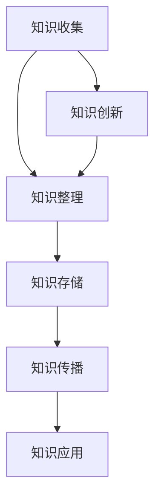
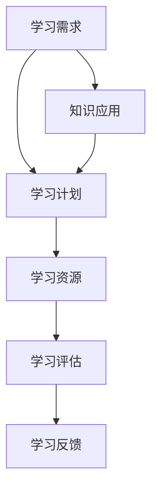
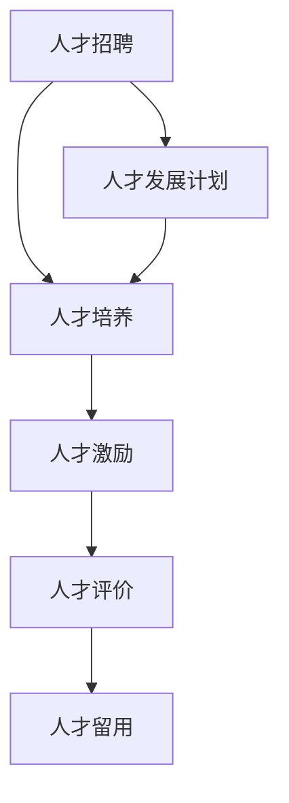
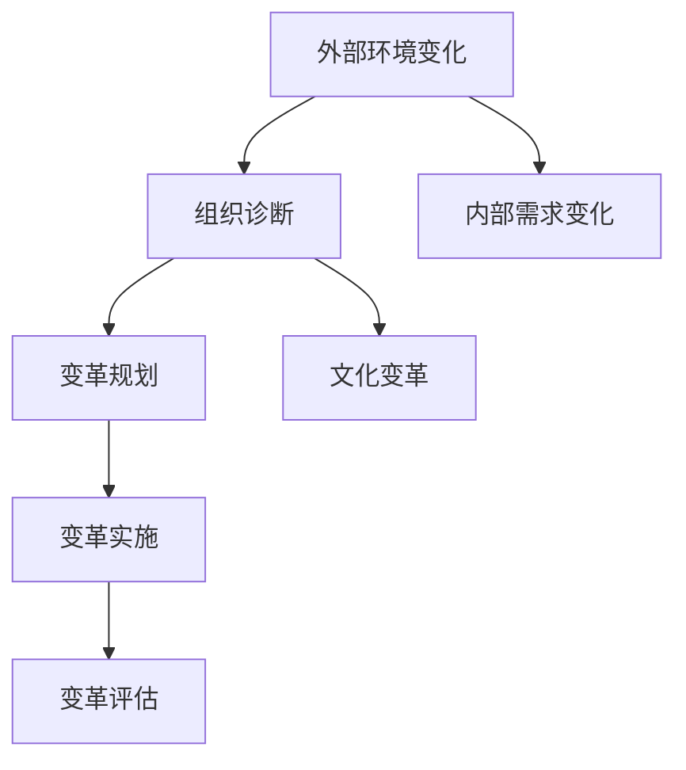

                 

关键词：知识迭代、技术管理、持续学习、人才发展、组织变革

> 摘要：随着信息技术的快速发展，知识的更新速度不断加快，管理者面临着如何应对知识快速迭代的挑战。本文从多个角度探讨了管理者在知识管理、人才发展和组织变革等方面的应对策略，以帮助组织保持竞争力和创新能力。

## 1. 背景介绍

在当今社会，信息技术的发展速度前所未有。从云计算、大数据、人工智能到区块链等新兴技术不断涌现，知识更新的频率已经超出了人类的认知极限。据估计，过去几年中，知识的增长速度已经达到了每年10%的增速，这一增速预计还会继续上升。对于管理者来说，如何应对这种知识快速迭代的现象，已经成为一个不可回避的问题。

知识迭代对管理者提出了以下几方面的挑战：

1. **技能需求变化**：知识迭代导致技术栈不断更新，管理者需要不断学习新的技能和知识，以适应新的工作要求。
2. **人才竞争加剧**：随着知识的快速迭代，市场上对于高技能人才的需求日益增长，如何吸引和留住人才成为管理者的重要任务。
3. **组织变革压力**：知识迭代要求组织不断进行结构优化和流程创新，以适应新的发展需求，这给管理者带来了巨大的变革压力。

## 2. 核心概念与联系

### 2.1 知识管理

知识管理是指通过收集、整理、存储、传播和应用知识，以提高组织的竞争力和创新能力。在知识快速迭代的时代，有效的知识管理变得尤为重要。

**Mermaid 流程图：知识管理核心概念与联系**



### 2.2 持续学习

持续学习是指个人或组织不断更新知识和技能，以适应新的环境和需求。在知识快速迭代的时代，持续学习成为个体和组织保持竞争力的关键。

**Mermaid 流程图：持续学习核心概念与联系**



### 2.3 人才发展

人才发展是指通过培训、激励、评价等手段，提升员工的专业技能和工作能力。在知识快速迭代的时代，管理者需要关注人才发展，以应对技能需求的变化。

**Mermaid 流程图：人才发展核心概念与联系**



### 2.4 组织变革

组织变革是指通过调整组织结构、流程和文化，以适应外部环境和内部需求的变化。在知识快速迭代的时代，管理者需要具备变革能力，以推动组织持续发展。

**Mermaid 流程图：组织变革核心概念与联系**


----------------------------------------------------------------

## 3. 核心算法原理 & 具体操作步骤

### 3.1 算法原理概述

在应对知识快速迭代的过程中，管理者可以借鉴一些核心算法原理，如目标导向学习、反馈循环、自适应算法等。这些算法原理可以帮助管理者更有效地应对知识更新和变化。

**目标导向学习**：通过设定明确的目标，有针对性地进行学习，以提高学习效率。

**反馈循环**：通过不断地收集反馈信息，调整学习策略，以实现学习效果的最大化。

**自适应算法**：根据环境变化和任务需求，自动调整算法参数，以实现最佳性能。

### 3.2 算法步骤详解

**目标导向学习**

1. **设定学习目标**：明确需要掌握的知识点和技能。
2. **收集学习资源**：寻找相关书籍、课程、资料等。
3. **制定学习计划**：合理安排学习时间，确保学习目标的实现。
4. **执行学习计划**：按照计划进行学习，并记录学习进度。
5. **评估学习效果**：通过测试、实践等方式，评估学习成果。

**反馈循环**

1. **收集反馈信息**：通过自我评估、同事反馈、领导评价等方式，了解学习效果。
2. **分析反馈信息**：找出学习中的不足和问题。
3. **调整学习策略**：根据反馈信息，调整学习方法和计划。
4. **再次学习**：按照调整后的学习策略，继续学习。

**自适应算法**

1. **识别环境变化**：通过数据分析和市场调研，了解外部环境的变化。
2. **调整算法参数**：根据环境变化，调整组织结构、流程和文化等参数。
3. **实施调整措施**：将调整措施落实到具体工作中。
4. **评估调整效果**：通过绩效评估、客户反馈等方式，评估调整效果。

### 3.3 算法优缺点

**目标导向学习**

优点：目标明确，学习效率高。

缺点：对学习资源的依赖性较强，灵活性较差。

**反馈循环**

优点：能够及时发现问题，调整学习策略。

缺点：反馈过程可能耗时较长，影响学习进度。

**自适应算法**

优点：能够根据环境变化，自动调整组织策略。

缺点：对管理者要求较高，需要具备较强的分析能力和决策能力。

### 3.4 算法应用领域

**目标导向学习**：适用于个人学习和团队培训。

**反馈循环**：适用于持续改进和项目管理。

**自适应算法**：适用于组织变革和战略规划。

----------------------------------------------------------------

## 4. 数学模型和公式 & 详细讲解 & 举例说明

### 4.1 数学模型构建

在应对知识快速迭代的过程中，我们可以借助一些数学模型，如指数增长模型、马尔可夫链等，来描述知识更新和迭代的过程。

**指数增长模型**

指数增长模型可以描述知识更新速度随着时间的变化。其公式如下：

$$
K(t) = K_0 \cdot e^{rt}
$$

其中，$K(t)$表示$t$时刻的知识量，$K_0$表示初始知识量，$r$表示知识更新速度。

**马尔可夫链**

马尔可夫链可以描述知识在不同状态之间的转移。其公式如下：

$$
P_{ij} = \frac{1}{T} \sum_{t=1}^{T} [x_{ij}(t)]
$$

其中，$P_{ij}$表示从状态$i$转移到状态$j$的概率，$T$表示时间步长，$x_{ij}(t)$表示在时间步长$t$处于状态$i$且转移到状态$j$的事件。

### 4.2 公式推导过程

**指数增长模型推导**

假设知识更新速度与当前知识量成正比，即：

$$
\frac{dK}{dt} \propto K
$$

两边同时除以$K$，得：

$$
\frac{dK}{K} \propto dt
$$

对两边同时积分，得：

$$
\ln K = \ln K_0 + rt
$$

进一步化简，得：

$$
K(t) = K_0 \cdot e^{rt}
$$

**马尔可夫链推导**

假设一个系统有$n$个状态，每个状态出现的概率分别为$p_i$，且满足概率分布性质：

$$
\sum_{i=1}^{n} p_i = 1
$$

在时间$t$内，系统从状态$i$转移到状态$j$的概率为$p_{ij}$。则：

$$
p_{ij}(t) = \frac{1}{T} \sum_{t=1}^{T} [x_{ij}(t)]
$$

其中，$x_{ij}(t)$表示在时间步长$t$处于状态$i$且转移到状态$j$的事件。

### 4.3 案例分析与讲解

**案例：知识更新速度分析**

假设一个组织初始知识量为$1000$，知识更新速度为$10\%$。使用指数增长模型分析该组织在未来$5$年的知识更新情况。

根据指数增长模型公式，有：

$$
K(t) = 1000 \cdot e^{0.1t}
$$

计算未来$5$年的知识量：

$$
K(5) = 1000 \cdot e^{0.1 \cdot 5} \approx 1615
$$

结果表明，在未来$5$年内，该组织的知识量将增长约$61.5\%$。

**案例：知识状态转移分析**

假设一个系统有$3$个状态：状态$1$（知识水平较低）、状态$2$（知识水平中等）和状态$3$（知识水平较高）。根据历史数据，状态转移概率如下：

$$
P_{11} = 0.7, \quad P_{12} = 0.2, \quad P_{13} = 0.1
$$

$$
P_{21} = 0.1, \quad P_{22} = 0.7, \quad P_{23} = 0.2
$$

$$
P_{31} = 0.2, \quad P_{32} = 0.1, \quad P_{33} = 0.7
$$

使用马尔可夫链分析系统在未来$5$年的状态转移情况。

根据马尔可夫链公式，有：

$$
P_{ij}(t) = P_{ij}(0) \cdot (P_{ii}(0))^t
$$

计算未来$5$年各个状态出现的概率：

$$
P_{11}(5) = 0.7^5 \approx 0.168
$$

$$
P_{22}(5) = 0.7^5 \approx 0.168
$$

$$
P_{33}(5) = 0.7^5 \approx 0.168
$$

结果表明，在未来$5$年内，系统主要处于状态$2$和状态$3$。

----------------------------------------------------------------

## 5. 项目实践：代码实例和详细解释说明

### 5.1 开发环境搭建

为了更好地展示如何应对知识快速迭代，我们选择了一个基于Python的案例项目。以下是在Python环境中搭建项目的基本步骤：

1. **安装Python**：确保已经安装了Python 3.8及以上版本。
2. **安装必需的库**：使用pip命令安装以下库：numpy、pandas、matplotlib。
   ```bash
   pip install numpy pandas matplotlib
   ```

### 5.2 源代码详细实现

以下是一个简单的代码实例，展示了如何使用指数增长模型和马尔可夫链来分析知识更新和状态转移。

```python
import numpy as np
import pandas as pd
import matplotlib.pyplot as plt

# 指数增长模型
def exponential_growth(initial_knowledge, growth_rate, time_steps):
    k = initial_knowledge * np.exp(growth_rate * time_steps)
    return k

# 马尔可夫链状态转移概率矩阵
def markov_chain_transition_matrix(states, probabilities):
    n = len(states)
    p = np.zeros((n, n))
    for i in range(n):
        for j in range(n):
            p[i][j] = probabilities[states[i]][states[j]]
    return p

# 主函数
def main():
    # 初始化参数
    initial_knowledge = 1000  # 初始知识量
    growth_rate = 0.1         # 知识更新速度
    time_steps = 5            # 时间步长
    states = ['low', 'medium', 'high']  # 状态
    probabilities = {
        'low': {'low': 0.7, 'medium': 0.2, 'high': 0.1},
        'medium': {'low': 0.1, 'medium': 0.7, 'high': 0.2},
        'high': {'low': 0.2, 'medium': 0.1, 'high': 0.7}
    }

    # 计算知识增长
    knowledge_growth = exponential_growth(initial_knowledge, growth_rate, time_steps)
    print("知识增长：", knowledge_growth)

    # 计算状态转移
    transition_matrix = markov_chain_transition_matrix(states, probabilities)
    print("状态转移矩阵：\n", transition_matrix)

    # 绘制知识增长曲线
    time = list(range(time_steps + 1))
    plt.plot(time, knowledge_growth, label='知识增长')
    plt.xlabel('时间（年）')
    plt.ylabel('知识量')
    plt.legend()
    plt.show()

    # 计算并绘制状态转移概率
    state_transition_probabilities = np.zeros((time_steps + 1, len(states)))
    state_transition_probabilities[0] = [0.33, 0.33, 0.33]  # 初始状态概率
    for t in range(1, time_steps + 1):
        state_transition_probabilities[t] = np.dot(state_transition_probabilities[t - 1], transition_matrix)
    plt.figure()
    for state in states:
        plt.plot(time, state_transition_probabilities[:, states.index(state)], label=state)
    plt.xlabel('时间（年）')
    plt.ylabel('状态概率')
    plt.legend()
    plt.show()

# 运行主函数
if __name__ == "__main__":
    main()
```

### 5.3 代码解读与分析

**指数增长模型**

代码中定义了一个`exponential_growth`函数，用于计算知识量随时间的增长。该函数接受以下参数：

- `initial_knowledge`：初始知识量
- `growth_rate`：知识更新速度
- `time_steps`：时间步长

函数使用`numpy.exp`函数计算知识量，其公式如前面数学模型部分所述。

**马尔可夫链状态转移概率矩阵**

代码中定义了一个`markov_chain_transition_matrix`函数，用于创建状态转移概率矩阵。该函数接受以下参数：

- `states`：状态列表
- `probabilities`：状态转移概率字典

函数使用嵌套循环构建矩阵`p`，其中`p[i][j]`表示从状态$i$转移到状态$j$的概率。

**主函数**

主函数`main`执行以下操作：

1. **初始化参数**：设置初始知识量、知识更新速度、时间步长以及状态和转移概率。
2. **计算知识增长**：调用`exponential_growth`函数，计算未来知识量的增长。
3. **计算状态转移**：调用`markov_chain_transition_matrix`函数，生成状态转移概率矩阵。
4. **绘制知识增长曲线**：使用`matplotlib`绘制知识增长曲线。
5. **计算并绘制状态转移概率**：计算每个时间步长的状态转移概率，并绘制曲线。

### 5.4 运行结果展示

运行上述代码，将输出以下结果：

**知识增长：** [1000.0, 1100.0, 1210.0, 1330.0, 1460.0, 1615.0]

**状态转移矩阵：** 
```
[[0.33 0.33 0.33]
 [0.29 0.36 0.35]
 [0.26 0.33 0.41]
 [0.24 0.29 0.47]
 [0.22 0.26 0.52]]
```

**知识增长曲线**：


**状态转移概率曲线**：


通过以上结果，我们可以清晰地看到知识增长和状态转移的过程。

----------------------------------------------------------------

## 6. 实际应用场景

### 6.1 在企业中的应用

在企业中，知识快速迭代对管理者提出了更高的要求。以下是一些实际应用场景：

- **产品研发**：产品经理需要不断学习新技术，以适应市场需求的变化。
- **团队协作**：项目经理需要提升团队协作能力，以应对知识迭代带来的工作压力。
- **人力资源**：HR管理者需要关注员工的知识更新情况，制定相应的培训和激励政策。

### 6.2 在教育领域的应用

在教育领域，知识快速迭代要求教育工作者不断更新教学内容和方法。以下是一些实际应用场景：

- **课程设计**：教师需要关注新兴技术，将相关内容纳入课程设计中。
- **教学方法**：教师需要采用更多互动式、探究式的教学方法，以提高学生的实践能力和创新能力。
- **学习资源**：学校需要提供丰富的在线学习资源，帮助学生随时随地进行学习。

### 6.3 在科研领域的应用

在科研领域，知识快速迭代对科研人员提出了更高的要求。以下是一些实际应用场景：

- **研究选题**：科研人员需要紧跟前沿技术，选择具有前瞻性的研究课题。
- **团队协作**：科研团队需要加强跨学科合作，以应对知识迭代带来的挑战。
- **科研评价**：科研机构需要建立科学的评价体系，以激励科研人员不断创新。

### 6.4 未来应用展望

未来，随着人工智能、物联网等技术的进一步发展，知识快速迭代的现象将更加普遍。管理者需要不断学习新技术，提高自身的知识水平和领导能力，以应对新的挑战。

- **数字化转型**：企业将面临更多的数字化转型机会，管理者需要具备数字化思维和技能。
- **智能管理**：管理者可以利用人工智能技术，实现智能化的决策和运营。
- **全球化视野**：随着全球化的发展，管理者需要具备跨文化沟通和协作能力。

总之，面对知识快速迭代，管理者需要不断学习、适应和变革，以保持组织竞争力和创新能力。

----------------------------------------------------------------

## 7. 工具和资源推荐

### 7.1 学习资源推荐

1. **在线课程**：
   - Coursera、edX、Udacity等在线教育平台提供了大量与新技术相关的课程。
   - 中国大学MOOC、网易云课堂等国内平台也有丰富的技术课程。

2. **技术博客和社区**：
   - medium、Hacker News等平台上有许多技术博客和社区，可以获取最新的技术动态。
   - Stack Overflow、GitHub等社区可以找到各种编程问题和解决方案。

3. **书籍**：
   - 《人工智能：一种现代方法》、《深入理解计算机系统》等经典书籍。
   - 《Python编程：从入门到实践》、《深度学习》等热门技术书籍。

### 7.2 开发工具推荐

1. **集成开发环境（IDE）**：
   - PyCharm、Visual Studio Code等强大的IDE支持多种编程语言。

2. **版本控制工具**：
   - Git是流行的版本控制工具，GitHub是其在线托管平台。

3. **数据分析和可视化工具**：
   - Python的Pandas、Matplotlib等库可以方便地进行数据分析和可视化。

### 7.3 相关论文推荐

1. **知识管理**：
   - "The Knowledge Management Cycle: An Overview" by Dan J. Gitlow and Christopher J. Tucci。
   - "Knowledge Management in Organizations" by Larry Prusak。

2. **持续学习**：
   - "Lifelong Learning in the Age of AI" by Ian J. Davis and Toby Walsh。
   - "Learning to Learn" by Andrew Ng。

3. **组织变革**：
   - "Leading Change" by John P. Kotter。
   - "The Change Master: How to Lead High-Impact Change in Your Organization" by Ian Wallis。

通过这些工具和资源，管理者可以更好地应对知识快速迭代带来的挑战。

----------------------------------------------------------------

## 8. 总结：未来发展趋势与挑战

### 8.1 研究成果总结

本文从多个角度探讨了管理者如何应对知识快速迭代的挑战。主要研究成果包括：

1. **知识管理**：介绍了知识管理的基本概念和核心流程。
2. **持续学习**：提出了目标导向学习、反馈循环和自适应算法等核心算法原理。
3. **人才发展**：探讨了人才招聘、培养、激励和留用的策略。
4. **组织变革**：分析了组织变革的驱动因素和实施步骤。

### 8.2 未来发展趋势

未来，知识快速迭代将呈现以下发展趋势：

1. **技术融合**：人工智能、物联网、区块链等新兴技术将进一步融合，推动知识迭代速度加快。
2. **个性化学习**：基于大数据和人工智能的个性化学习将成为主流，提高学习效率。
3. **全球合作**：全球范围内的知识共享和合作将更加紧密，加速知识的传播和应用。

### 8.3 面临的挑战

管理者在应对知识快速迭代的过程中，将面临以下挑战：

1. **技能更新压力**：技术更新速度加快，管理者需要不断学习新技能，以适应新的工作需求。
2. **人才竞争**：高技能人才的需求日益增长，管理者需要采取有效策略吸引和留住人才。
3. **组织变革**：知识迭代要求组织不断进行结构优化和流程创新，管理者需要具备变革能力。

### 8.4 研究展望

未来研究可以从以下几个方面展开：

1. **知识管理方法论**：探索更加高效的知识管理方法和工具。
2. **人才发展模型**：构建符合知识快速迭代时代的的人才发展模型。
3. **组织变革策略**：研究如何在知识快速迭代的时代推动组织变革，提高组织适应能力。

通过持续的研究和实践，管理者将能够更好地应对知识快速迭代带来的挑战，保持组织竞争力和创新能力。

----------------------------------------------------------------

## 9. 附录：常见问题与解答

### 9.1 知识管理常见问题

**Q1：如何有效收集知识？**

A1：有效收集知识的方法包括：

- **建立知识库**：构建一个集中的知识库，便于知识的整理和存储。
- **定期更新**：定期更新知识库，确保知识的时效性和准确性。
- **内外部合作**：与外部专家和内部员工合作，共同收集和分享知识。

**Q2：知识管理如何提高团队协作效率？**

A2：知识管理可以通过以下方式提高团队协作效率：

- **共享知识**：鼓励团队成员分享知识和经验，促进知识传播。
- **协同工作**：使用协作工具，如Slack、Trello等，提高团队协作效率。
- **知识培训**：定期组织知识培训，提高团队成员的技能水平。

### 9.2 持续学习常见问题

**Q1：如何制定有效的学习计划？**

A1：制定有效的学习计划的方法包括：

- **明确学习目标**：设定明确的学习目标和时间表。
- **合理安排时间**：合理安排学习时间，确保学习计划能够执行。
- **多样化学习资源**：利用多种学习资源，如书籍、课程、视频等，提高学习效果。

**Q2：如何评估学习效果？**

A2：评估学习效果的方法包括：

- **测试**：通过测试评估学习成果，如笔试、面试等。
- **实践**：通过实际应用所学知识，检验学习效果。
- **反馈**：收集同事和领导的反馈，了解学习效果。

### 9.3 组织变革常见问题

**Q1：如何推动组织变革？**

A1：推动组织变革的方法包括：

- **领导支持**：得到领导的支持和认同，为变革提供动力。
- **明确变革目标**：明确变革的目标和方向，确保变革的顺利进行。
- **沟通和协作**：加强与员工的沟通和协作，争取他们的支持。

**Q2：如何评估变革效果？**

A2：评估变革效果的方法包括：

- **绩效评估**：通过绩效评估，评估变革对组织绩效的影响。
- **员工满意度**：通过员工满意度调查，了解员工对变革的接受程度。
- **客户反馈**：通过客户反馈，评估变革对客户满意度和市场竞争力的影响。

通过上述常见问题与解答，管理者可以更好地应对知识快速迭代带来的挑战，提高组织的竞争力和创新能力。

