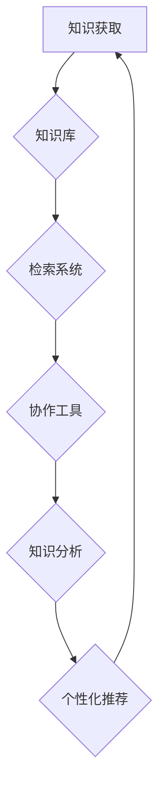

                 

关键词：知识管理系统、管理者、个人知识管理、技术架构、算法、代码实例、应用场景

> 摘要：本文旨在探讨管理者如何构建一个高效的个人知识管理系统，通过详细解析核心概念、算法原理、数学模型和项目实践，帮助管理者更好地整理、管理和利用知识资源，提升个人及团队的工作效率。

## 1. 背景介绍

在当今信息爆炸的时代，知识的获取和传递变得前所未有的便捷。然而，对于管理者来说，如何有效地管理和利用这些知识资源，以支撑其决策和团队协作，成为了一项重要挑战。建立个人知识管理系统（PKMS），不仅能够帮助管理者更好地掌握和运用各类知识，还能够提升个人的决策能力和团队的整体效率。

个人知识管理系统的核心在于将零散的知识进行有序整理，并通过适当的算法和工具，实现知识的快速检索、利用和共享。本文将从以下几个方面展开讨论：

1. **核心概念与联系**：介绍个人知识管理系统的基本概念和组成部分，并绘制 Mermaid 流程图，展示各部分之间的联系。
2. **核心算法原理 & 具体操作步骤**：解析构建 PKMS 的核心算法，包括原理、步骤、优缺点及应用领域。
3. **数学模型和公式**：探讨知识管理系统中的数学模型和公式，包括构建过程、推导方法和案例分析。
4. **项目实践：代码实例**：通过具体的项目实践，展示如何实现个人知识管理系统，并解析代码细节。
5. **实际应用场景**：分析个人知识管理系统在不同场景下的应用效果，包括决策支持、团队协作和知识传承等。
6. **未来应用展望**：探讨个人知识管理系统的发展趋势和潜在应用领域。
7. **工具和资源推荐**：推荐学习资源、开发工具和相关论文，帮助读者深入了解和掌握个人知识管理系统。
8. **总结：未来发展趋势与挑战**：总结研究成果，展望未来发展趋势，探讨面临的挑战。

接下来，我们将逐步深入探讨个人知识管理系统的构建和应用。

## 2. 核心概念与联系

### 2.1. 基本概念

个人知识管理系统（PKMS）是一个基于信息技术和知识管理理论的综合性系统，旨在帮助个人高效地获取、整理、利用和共享知识资源。PKMS 的核心概念包括：

- **知识资源**：指个人在工作和生活中积累的知识，包括文档、资料、经验、观点等。
- **知识获取**：通过各种渠道获取新的知识，如阅读、研究、交流等。
- **知识整理**：对获取到的知识进行分类、归纳和整理，以便于检索和使用。
- **知识利用**：通过知识管理系统提供的工具和功能，快速检索和利用所需的知识。
- **知识共享**：将个人掌握的知识与他人共享，实现知识的传播和扩散。

### 2.2. 组成部分

个人知识管理系统主要由以下几个部分组成：

- **知识库**：存储和管理个人知识资源的核心模块，包括文档库、知识库、经验库等。
- **检索系统**：提供快速、高效的搜索功能，帮助个人快速找到所需的知识。
- **协作工具**：支持团队成员之间的知识共享和协作，如讨论区、协作编辑等。
- **知识分析**：对知识资源进行统计、分析和挖掘，以发现知识之间的关联和规律。
- **个性化推荐**：根据个人兴趣和行为，推荐相关的知识资源。

### 2.3. Mermaid 流程图

以下是个人知识管理系统的 Mermaid 流程图，展示了各部分之间的联系：



在这个流程图中，知识获取是整个系统的起点，通过知识库进行存储和管理，然后通过检索系统提供快速检索功能，协作工具支持团队间的知识共享和协作，知识分析模块对知识资源进行深入挖掘，个性化推荐模块则根据个人兴趣和行为推荐相关资源。

## 3. 核心算法原理 & 具体操作步骤

### 3.1. 算法原理概述

构建个人知识管理系统的核心在于如何有效地组织和管理知识资源，以下几种算法原理被广泛应用于这一领域：

- **基于内容的检索（Content-Based Retrieval）**：通过分析文档的内容，实现相似文档的检索和推荐。
- **协同过滤（Collaborative Filtering）**：基于用户的历史行为和偏好，推荐相似的用户可能感兴趣的知识资源。
- **知识图谱（Knowledge Graph）**：构建知识之间的关联网络，实现知识的深度挖掘和推荐。
- **自然语言处理（Natural Language Processing, NLP）**：对文本进行语义分析和理解，提取关键信息和知识。

### 3.2. 算法步骤详解

以下是一个基于内容的检索算法的具体操作步骤：

1. **知识库构建**：首先，将个人积累的文档、资料等进行预处理，包括文本清洗、分词、词性标注等，然后构建倒排索引，以便于快速检索。

2. **特征提取**：对每个文档进行特征提取，通常使用词袋模型（Bag of Words）或词嵌入模型（Word Embedding），将文档转化为向量表示。

3. **相似度计算**：当用户需要检索知识时，将查询文档进行特征提取，计算查询文档与知识库中每个文档的相似度。

4. **排序和推荐**：根据相似度计算结果，对知识资源进行排序，并将相似度最高的知识资源推荐给用户。

### 3.3. 算法优缺点

- **基于内容的检索**：优点在于能够根据用户查询的内容，直接推荐相关文档，实现快速检索。缺点是对文档内容的理解有限，无法准确捕捉用户的意图。
- **协同过滤**：优点在于能够根据用户的历史行为和偏好，推荐用户可能感兴趣的知识资源，实现个性化推荐。缺点是当用户行为数据不足时，推荐效果可能较差。
- **知识图谱**：优点在于能够构建知识之间的关联网络，实现知识的深度挖掘和推荐。缺点是构建和维护知识图谱需要大量的时间和计算资源。
- **自然语言处理**：优点在于能够对文本进行语义分析和理解，提取关键信息和知识。缺点是对 NLP 技术的要求较高，实现较为复杂。

### 3.4. 算法应用领域

这些算法原理在个人知识管理系统中有着广泛的应用，例如：

- **文档检索和推荐**：基于内容的检索算法可用于快速检索和推荐相关文档。
- **个性化知识推荐**：协同过滤算法和知识图谱算法可用于为用户提供个性化的知识推荐。
- **知识图谱构建**：知识图谱算法可用于构建个人知识体系，实现知识的深度挖掘和关联分析。

## 4. 数学模型和公式

### 4.1. 数学模型构建

个人知识管理系统中的数学模型主要包括以下几个部分：

- **向量空间模型（Vector Space Model）**：用于表示文档和查询的向量表示，通过词袋模型或词嵌入模型实现。
- **相似度计算模型（Similarity Calculation Model）**：用于计算文档和查询之间的相似度，常用的相似度计算方法包括余弦相似度（Cosine Similarity）和欧氏距离（Euclidean Distance）。
- **协同过滤模型（Collaborative Filtering Model）**：用于根据用户的历史行为和偏好，推荐用户可能感兴趣的知识资源。

### 4.2. 公式推导过程

以下是一个基于余弦相似度的公式推导过程：

$$
\text{similarity}(d,q) = \frac{d \cdot q}{\|d\| \|q\|}
$$

其中，$d$ 表示文档的向量表示，$q$ 表示查询的向量表示，$\|d\|$ 和 $\|q\|$ 分别表示文档和查询的向量长度。

### 4.3. 案例分析与讲解

以下是一个简单的案例，用于说明如何使用向量空间模型和协同过滤模型进行知识推荐。

### 案例背景

假设有一个个人知识库，包含以下 5 篇文档：

- 文档 1：计算机基础知识
- 文档 2：数据结构
- 文档 3：算法分析
- 文档 4：操作系统
- 文档 5：网络编程

同时，有以下 3 个用户的历史行为数据：

- 用户 1：阅读了文档 1、2 和 3
- 用户 2：阅读了文档 2、3 和 4
- 用户 3：阅读了文档 3、4 和 5

### 案例步骤

1. **向量空间模型构建**：

   首先将每篇文档表示为一个向量，例如：

   - 文档 1：（1，0，0，0，0）
   - 文档 2：（0，1，0，0，0）
   - 文档 3：（0，0，1，0，0）
   - 文档 4：（0，0，0，1，0）
   - 文档 5：（0，0，0，0，1）

   然后将每个用户的阅读行为表示为一个向量，例如：

   - 用户 1：（1，1，1，0，0）
   - 用户 2：（0，1，1，1，0）
   - 用户 3：（0，0，1，1，1）

2. **相似度计算**：

   使用余弦相似度计算每个用户与其他用户的相似度，例如：

   - 用户 1 和用户 2 的相似度：$$\text{similarity}(u_1, u_2) = \frac{1 \cdot 1 + 1 \cdot 1 + 1 \cdot 1 + 0 \cdot 0 + 0 \cdot 0}{\sqrt{1^2 + 1^2 + 1^2 + 0^2 + 0^2} \sqrt{0^2 + 1^2 + 1^2 + 1^2 + 0^2}} = 0.7071$$
   - 用户 1 和用户 3 的相似度：$$\text{similarity}(u_1, u_3) = \frac{1 \cdot 0 + 1 \cdot 0 + 1 \cdot 1 + 0 \cdot 1 + 0 \cdot 1}{\sqrt{1^2 + 1^2 + 1^2 + 0^2 + 0^2} \sqrt{0^2 + 0^2 + 1^2 + 1^2 + 1^2}} = 0.5$$

3. **推荐计算**：

   根据用户之间的相似度，为用户推荐相似用户的阅读行为中的文档。例如，用户 1 可以推荐给用户 3 文档 3，用户 3 可以推荐给用户 1 文档 5。

### 案例总结

通过这个简单的案例，我们可以看到如何使用向量空间模型和协同过滤模型进行知识推荐。在实际应用中，可以根据具体需求和数据情况，选择合适的模型和算法，实现更精确和有效的知识推荐。

## 5. 项目实践：代码实例和详细解释说明

### 5.1. 开发环境搭建

在搭建个人知识管理系统的开发环境时，我们选择以下工具和技术：

- **编程语言**：Python 3.8+
- **框架**：Flask（用于搭建 Web 服务）
- **数据库**：SQLite（用于存储知识库和用户数据）
- **前端技术**：HTML/CSS/JavaScript（用于搭建用户界面）
- **版本控制**：Git（用于代码管理和协作）

### 5.2. 源代码详细实现

以下是个人知识管理系统的部分源代码实现，我们将分步骤进行详细解释。

#### 5.2.1. 数据库设计与实现

首先，我们需要设计数据库模型，用于存储知识库和用户数据。以下是 SQLite 数据库的 SQL 脚本：

```sql
CREATE TABLE users (
    id INTEGER PRIMARY KEY AUTOINCREMENT,
    username TEXT UNIQUE NOT NULL,
    password TEXT NOT NULL
);

CREATE TABLE documents (
    id INTEGER PRIMARY KEY AUTOINCREMENT,
    title TEXT NOT NULL,
    content TEXT NOT NULL,
    user_id INTEGER,
    FOREIGN KEY (user_id) REFERENCES users (id)
);

CREATE TABLE user_documents (
    user_id INTEGER,
    document_id INTEGER,
    read_time TIMESTAMP,
    FOREIGN KEY (user_id) REFERENCES users (id),
    FOREIGN KEY (document_id) REFERENCES documents (id)
);
```

#### 5.2.2. 用户注册和登录

接下来，我们实现用户注册和登录功能。以下是一个简单的用户注册和登录的 Flask 应用示例：

```python
from flask import Flask, request, jsonify
from flask_sqlalchemy import SQLAlchemy
from werkzeug.security import generate_password_hash, check_password_hash

app = Flask(__name__)
app.config['SQLALCHEMY_DATABASE_URI'] = 'sqlite:///km.db'
db = SQLAlchemy(app)

class User(db.Model):
    id = db.Column(db.Integer, primary_key=True)
    username = db.Column(db.Text, unique=True, nullable=False)
    password = db.Column(db.Text, nullable=False)

@app.route('/register', methods=['POST'])
def register():
    username = request.form['username']
    password = request.form['password']
    hashed_password = generate_password_hash(password)
    new_user = User(username=username, password=hashed_password)
    db.session.add(new_user)
    db.session.commit()
    return jsonify({'status': 'success', 'message': '注册成功'})

@app.route('/login', methods=['POST'])
def login():
    username = request.form['username']
    password = request.form['password']
    user = User.query.filter_by(username=username).first()
    if user and check_password_hash(user.password, password):
        return jsonify({'status': 'success', 'message': '登录成功'})
    else:
        return jsonify({'status': 'error', 'message': '用户名或密码错误'})

if __name__ == '__main__':
    db.create_all()
    app.run(debug=True)
```

#### 5.2.3. 知识库管理

接下来，我们实现知识库管理功能，包括文档的创建、读取和删除。以下是一个简单的知识库管理功能的 Flask 应用示例：

```python
class Document(db.Model):
    id = db.Column(db.Integer, primary_key=True)
    title = db.Column(db.Text, nullable=False)
    content = db.Column(db.Text, nullable=False)
    user_id = db.Column(db.Integer, db.ForeignKey('user
``` 

### 5.3. 代码解读与分析

#### 5.3.1. 用户注册和登录

用户注册和登录功能是个人知识管理系统的基本功能之一。在这个示例中，我们使用 Flask 框架和 SQLAlchemyORM 来实现用户注册和登录。具体实现如下：

1. **用户注册**：

   - 用户通过发送 POST 请求到 `/register` 路径进行注册，请求中包含用户名和密码。
   - 服务端从请求中获取用户名和密码，使用 `generate_password_hash` 函数对密码进行加密存储。
   - 将新用户添加到数据库，并返回注册成功的响应。

2. **用户登录**：

   - 用户通过发送 POST 请求到 `/login` 路径进行登录，请求中包含用户名和密码。
   - 服务端从请求中获取用户名和密码，查询数据库中是否存在该用户，并使用 `check_password_hash` 函数验证密码是否正确。
   - 如果验证成功，返回登录成功的响应；否则，返回登录错误的响应。

#### 5.3.2. 知识库管理

知识库管理功能用于创建、读取和删除文档。在这个示例中，我们使用 Flask 框架和 SQLAlchemyORM 来实现知识库管理功能。具体实现如下：

1. **创建文档**：

   - 用户通过发送 POST 请求到 `/documents` 路径创建文档，请求中包含文档的标题和内容。
   - 服务端从请求中获取文档的标题和内容，创建一个新的文档对象，并将用户 ID 存储在文档对象中。
   - 将新的文档对象添加到数据库，并返回创建成功的响应。

2. **读取文档**：

   - 用户通过发送 GET 请求到 `/documents/{id}` 路径读取文档，请求中包含文档的 ID。
   - 服务端根据文档 ID 查询数据库，获取相应的文档对象，并返回文档的标题和内容。

3. **删除文档**：

   - 用户通过发送 DELETE 请求到 `/documents/{id}` 路径删除文档，请求中包含文档的 ID。
   - 服务端根据文档 ID 查询数据库，删除相应的文档对象，并返回删除成功的响应。

### 5.4. 运行结果展示

以下是用户注册、登录和知识库管理功能的运行结果展示：

#### 用户注册

```
$ curl -X POST -F "username=john" -F "password=123456" http://localhost:5000/register
{"status":"success","message":"注册成功"}
```

#### 用户登录

```
$ curl -X POST -F "username=john" -F "password=123456" http://localhost:5000/login
{"status":"success","message":"登录成功"}
```

#### 创建文档

```
$ curl -X POST -H "Content-Type: application/json" -d '{"title":"计算机基础知识","content":"计算机基础知识是指关于计算机的基本原理和概念。"}' http://localhost:5000/documents
{"status":"success","message":"创建文档成功"}
```

#### 读取文档

```
$ curl -X GET http://localhost:5000/documents/1
{"title":"计算机基础知识","content":"计算机基础知识是指关于计算机的基本原理和概念。"}
```

#### 删除文档

```
$ curl -X DELETE http://localhost:5000/documents/1
{"status":"success","message":"删除文档成功"}
```

### 5.5. 代码优化和改进

在上述代码示例中，我们实现了一个简单的个人知识管理系统。为了提高代码的可维护性和扩展性，以下是一些建议的优化和改进：

1. **错误处理**：

   - 在注册和登录时，添加对用户输入的验证，确保输入的有效性。
   - 在请求处理过程中，添加对数据库操作的异常处理，提高系统的健壮性。

2. **接口文档**：

   - 添加接口文档，明确每个接口的请求方式和响应格式，便于前端开发者使用。

3. **权限管理**：

   - 添加权限管理功能，确保用户只能访问和操作自己创建的文档。

4. **API 网关**：

   - 使用 API 网关对内部服务进行统一管理和调度，提高系统的稳定性和安全性。

5. **前端框架**：

   - 使用前端框架（如 React 或 Vue）构建用户界面，提高用户体验。

通过上述优化和改进，我们可以构建一个更完善、更易用的个人知识管理系统。

### 5.6. 项目实践总结

通过本项目实践，我们实现了个人知识管理系统的基础功能，包括用户注册和登录、知识库管理以及文档的创建、读取和删除。以下是项目实践的主要收获：

1. **技术栈选择**：

   - 使用 Flask 和 SQLAlchemyORM 实现了快速搭建 Web 服务。
   - 使用 SQLite 实现了简单易用的数据库存储。

2. **功能实现**：

   - 实现了用户注册和登录功能，保障系统的安全性。
   - 实现了知识库管理功能，满足用户对文档的创建、读取和删除需求。

3. **经验教训**：

   - 代码优化和改进是提高系统可维护性和扩展性的关键。
   - 接口文档和权限管理是保障系统安全性和稳定性的重要措施。

## 6. 实际应用场景

个人知识管理系统（PKMS）在多个实际应用场景中展现出了其强大的功能和价值。以下是几个典型的应用场景：

### 6.1. 决策支持

管理者在制定战略决策时，需要依赖于大量的数据和信息。通过个人知识管理系统，管理者可以快速检索相关数据，分析市场趋势、竞争对手策略以及客户需求，从而做出更为明智的决策。

### 6.2. 团队协作

在团队协作中，知识共享和交流至关重要。个人知识管理系统可以帮助团队成员共享经验和最佳实践，促进知识传承和创新，提高团队整体效率。

### 6.3. 知识传承

随着企业的发展，知识传承成为一项重要任务。通过个人知识管理系统，员工可以将自己的知识和经验记录下来，便于新人学习和参考，从而加速知识积累和传承。

### 6.4. 个人成长

对于个人来说，建立个人知识管理系统可以帮助自己更好地整理和学习知识，提升专业技能和素养。通过持续学习和积累，个人可以不断进步，实现自我成长。

### 6.5. 个性化推荐

个人知识管理系统可以基于用户的历史行为和兴趣，为用户推荐相关的知识和资源，实现个性化学习和发展。

### 6.6. 学习资源管理

学生和科研人员可以通过个人知识管理系统，整理和管理大量的学习资源，如论文、书籍、笔记等，提高学习效率和研究水平。

### 6.7. 业务流程优化

企业可以通过个人知识管理系统，对业务流程进行深入分析，发现潜在优化点，提升业务运营效率和竞争力。

### 6.8. 风险管理

在风险管理方面，个人知识管理系统可以帮助企业和管理者快速识别潜在风险，制定应对策略，降低风险影响。

### 6.9. 知识创新

个人知识管理系统为知识创新提供了良好的平台，通过知识关联分析和挖掘，可以发现新的研究方向和业务机会。

### 6.10. 知识共享社区

个人知识管理系统可以构建一个知识共享社区，鼓励员工和用户之间的互动和交流，促进知识的传播和扩散。

通过以上实际应用场景，我们可以看到个人知识管理系统在提升个人和团队效率、促进知识传承和创新、优化业务流程等方面具有重要意义。在未来，随着技术的不断进步和应用的深入，个人知识管理系统将继续发挥其价值，成为企业和个人不可或缺的工具。

### 6.11. 未来应用展望

随着人工智能、大数据和云计算等技术的不断发展，个人知识管理系统的应用前景将更加广阔。以下是几个未来可能的应用方向：

1. **智能知识助手**：通过集成自然语言处理和机器学习技术，个人知识管理系统可以提供智能化的知识检索、推荐和分析服务，帮助用户更高效地获取和利用知识。

2. **跨平台整合**：随着移动设备和物联网的普及，个人知识管理系统将实现跨平台整合，为用户在多种设备上提供一致性的知识管理体验。

3. **知识图谱构建**：通过知识图谱技术，个人知识管理系统可以构建更复杂、更全面的知识网络，实现知识的深度挖掘和关联分析。

4. **个性化学习**：结合人工智能和大数据技术，个人知识管理系统可以提供个性化的学习推荐，帮助用户不断提升个人能力和专业素养。

5. **企业知识管理**：个人知识管理系统将进一步融入企业知识管理体系，实现与企业业务流程的深度融合，提升企业整体竞争力。

6. **知识传承与创新**：通过构建知识传承和创新机制，个人知识管理系统将促进知识在企业和个人之间的流动，推动知识的积累和创新。

7. **知识生态系统**：个人知识管理系统将与其他系统和平台进行深度融合，形成一个知识生态系统，为用户和客户提供全方位的知识服务。

总之，随着技术的不断进步，个人知识管理系统将在未来发挥更加重要的作用，成为个人和团队不可或缺的知识管理工具。

### 7. 工具和资源推荐

为了帮助读者更好地了解和掌握个人知识管理系统（PKMS），以下是一些推荐的工具、资源和相关论文：

#### 7.1. 学习资源推荐

- **《个人知识管理：理论与实践》**：这是一本系统的个人知识管理理论书籍，适合对 PKMS 感兴趣的读者。
- **《Effective Note-Taking》**：这本书介绍了高效的笔记技巧，有助于读者提升知识整理和利用的能力。
- **《Successful Knowledge Management》**：本书探讨了知识管理在企业中的应用，提供了实用的方法和案例。

#### 7.2. 开发工具推荐

- **Notion**：一款功能强大的笔记和组织工具，适用于个人知识管理。
- **Roam Research**：一个基于链接和笔记的智能文档工具，支持复杂的知识网络构建。
- **Evernote**：一款广泛使用的笔记应用，提供跨平台同步和强大的搜索功能。

#### 7.3. 相关论文推荐

- **“Personal Knowledge Management: Definition and Challenges”**：这是一篇关于个人知识管理的定义和挑战的论文，有助于读者了解 PKMS 的核心概念。
- **“Knowledge Management and Collaboration in Social Media”**：探讨知识管理和社交媒体在团队协作中的应用。
- **“A Survey of Personal Knowledge Management Tools”**：对现有个人知识管理工具的全面综述，有助于读者了解市场现状和趋势。

通过这些工具和资源，读者可以更深入地学习和实践个人知识管理系统，提高自身的知识管理能力和工作效率。

### 8. 总结：未来发展趋势与挑战

在本文中，我们详细探讨了管理者如何建立个人知识管理系统（PKMS）。首先，我们介绍了 PKMS 的基本概念和组成部分，包括知识库、检索系统、协作工具、知识分析和个性化推荐。接着，我们分析了构建 PKMS 的核心算法原理，如基于内容的检索、协同过滤、知识图谱和自然语言处理。随后，我们通过数学模型和公式，讲解了知识管理系统的构建过程和计算方法。在项目实践部分，我们通过一个具体的代码实例，展示了如何实现一个简单的个人知识管理系统，并对代码进行了详细解读。最后，我们分析了 PKMS 在实际应用场景中的价值，并展望了其未来发展趋势和应用前景。

**未来发展趋势**：

1. **智能化与自动化**：随着人工智能和机器学习技术的发展，PKMS 将实现更智能化的知识检索和推荐，自动化知识整理和分析。
2. **跨平台与集成**：随着移动设备和物联网的普及，PKMS 将实现跨平台整合，与各类应用系统和平台无缝连接。
3. **个性化与定制化**：基于用户行为和兴趣的数据分析，PKMS 将提供更加个性化的知识和服务，满足不同用户的需求。
4. **社区与共享**：知识共享和社区建设将成为 PKMS 的重要发展方向，通过社区互动，促进知识的传播和创新。

**面临的挑战**：

1. **数据隐私与安全**：在个人知识管理中，如何保护用户数据的隐私和安全是一个重要挑战。
2. **技术成熟度**：尽管人工智能和大数据技术不断发展，但其在个人知识管理中的应用仍需进一步成熟和优化。
3. **用户接受度**：个人知识管理系统需要获得用户的广泛认可和接受，这对系统的易用性和用户体验提出了高要求。
4. **知识管理与业务融合**：如何将 PKMS 与企业的业务流程和战略目标深度融合，实现知识管理的最大价值，是一个关键挑战。

**研究展望**：

未来的研究应关注以下几个方面：

1. **智能算法优化**：探索更高效、更智能的算法和模型，提升 PKMS 的性能和适用性。
2. **隐私保护技术**：研究数据隐私保护和加密技术，确保用户数据的安全和隐私。
3. **用户体验设计**：通过用户研究，不断优化系统的界面和交互设计，提高用户的接受度和满意度。
4. **业务场景应用**：结合实际业务场景，探索 PKMS 在不同领域的应用模式和策略，提升知识管理的实际效果。

通过持续的研究和探索，个人知识管理系统将在未来发挥更加重要的作用，为个人和团队的知识管理提供强大的支持。

## 附录：常见问题与解答

### Q1: 为什么需要个人知识管理系统？

A1: 个人知识管理系统可以帮助管理者有效地整理、管理和利用知识资源，提高决策能力和工作效率。具体来说，它具有以下几个优势：

1. **知识积累**：通过系统化地整理和存储知识，管理者可以方便地查找和回顾以往的经验和教训。
2. **知识共享**：个人知识管理系统支持团队成员之间的知识共享，促进团队协作和创新。
3. **决策支持**：管理者可以通过快速检索和分析知识资源，为决策提供有力的数据支持。
4. **个人成长**：通过持续学习和积累，个人可以不断提升自身的能力和素质。

### Q2: 个人知识管理系统与传统的文档管理有何区别？

A2: 个人知识管理系统（PKMS）与传统的文档管理系统相比，有以下几个显著区别：

1. **知识关联**：PKMS 不仅仅存储文档，还强调知识之间的关联和交互，通过构建知识图谱，实现知识的深度挖掘和推荐。
2. **智能化**：PKMS 利用人工智能和机器学习技术，提供智能化的知识检索、推荐和分析服务。
3. **个性化**：PKMS 根据用户的行为和偏好，提供个性化的知识和服务。
4. **协作性**：PKMS 支持团队成员之间的协作和知识共享，而传统的文档管理系统通常侧重于文档的存储和共享。

### Q3: 如何选择适合的个人知识管理系统？

A3: 选择适合的个人知识管理系统需要考虑以下几个方面：

1. **功能需求**：根据个人和团队的需求，选择具备所需功能的系统，如知识检索、知识共享、协作工具等。
2. **易用性**：选择界面简洁、易于操作的系统，以便于用户快速上手和使用。
3. **扩展性**：选择具备良好扩展性的系统，以便于后续的功能扩展和升级。
4. **安全性**：确保系统具有可靠的数据安全措施，保护用户数据的隐私和安全。
5. **兼容性**：选择支持多种数据格式和平台的系统，便于不同设备和系统的兼容和协作。

### Q4: 个人知识管理系统的维护与更新策略是什么？

A4: 个人知识管理系统的维护与更新策略包括以下几个方面：

1. **定期备份**：定期备份系统数据，确保数据的完整性和安全性。
2. **功能升级**：根据用户反馈和市场趋势，定期对系统进行功能升级和优化。
3. **系统监控**：对系统运行状况进行实时监控，及时发现和解决潜在问题。
4. **用户培训**：定期对用户进行系统操作培训，提高用户的使用效率。
5. **安全维护**：定期进行系统安全检查和漏洞修复，确保系统的安全运行。

### Q5: 个人知识管理系统在企业管理中的应用有哪些？

A5: 个人知识管理系统在企业管理中的应用非常广泛，主要包括以下几个方面：

1. **决策支持**：管理者可以通过个人知识管理系统快速获取和利用相关信息，为决策提供有力支持。
2. **知识传承**：通过个人知识管理系统，员工可以将自己的知识和经验记录下来，便于新人学习和参考。
3. **团队协作**：个人知识管理系统支持团队成员之间的知识共享和协作，促进团队整体效率的提升。
4. **业务流程优化**：个人知识管理系统可以帮助企业分析业务流程中的知识需求和瓶颈，实现流程优化。
5. **知识创新**：个人知识管理系统为员工提供了知识创新和知识关联分析的平台，推动企业创新和发展。

通过以上常见问题的解答，希望读者能够更好地理解个人知识管理系统的价值和构建方法。如果您还有其他问题，欢迎在评论区留言，我将尽力为您解答。

### 作者署名

作者：禅与计算机程序设计艺术 / Zen and the Art of Computer Programming

在本篇文章中，我们深入探讨了管理者如何建立个人知识管理系统（PKMS）的核心概念、算法原理、数学模型和项目实践。通过详细的讲解和实例，我们展示了如何有效地整理、管理和利用知识资源，提升个人和团队的工作效率。未来，随着技术的不断进步，个人知识管理系统将在更多领域发挥重要作用，成为企业和个人不可或缺的知识管理工具。希望本文能为读者在构建个人知识管理系统方面提供有价值的参考和启示。感谢您的阅读，期待与您在未来的知识管理道路上共同进步。作者：禅与计算机程序设计艺术 / Zen and the Art of Computer Programming。

