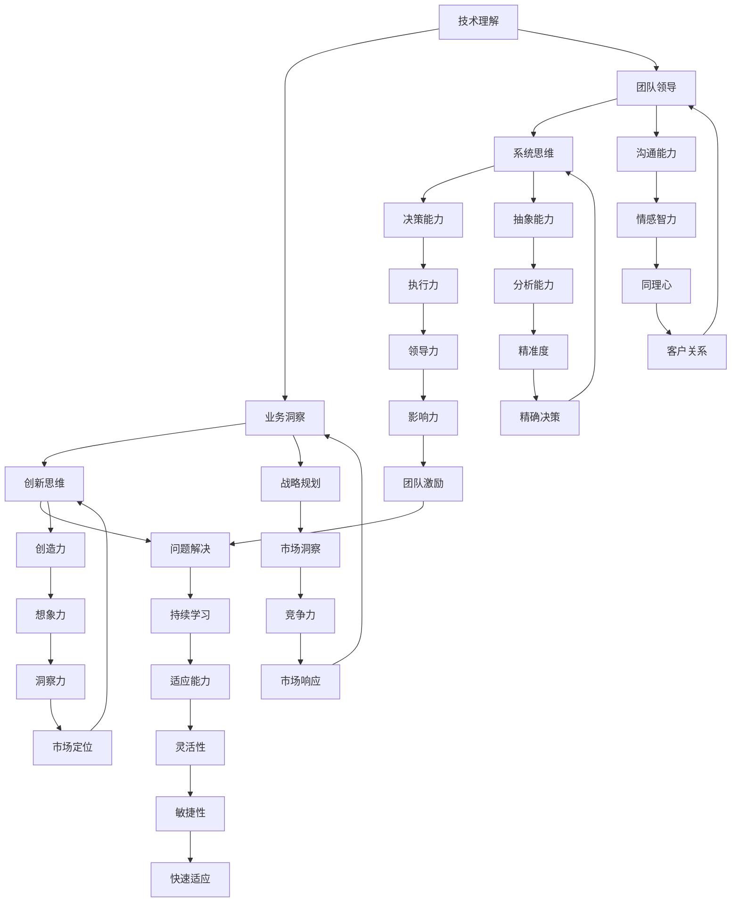

                 

在当今快速变化且高度复杂的技术环境中，成为一名高效的管理者不仅仅是掌握技术知识那么简单。它要求管理者能够构建一个强大的个人思维体系，以应对不断变化的业务需求和技术挑战。本文将探讨如何打造这样一个思维体系，帮助管理者在信息技术领域取得成功。

## 关键词
- 管理者思维体系
- 技术领导力
- 创新思维
- 问题解决
- 业务战略

## 摘要
本文旨在为信息技术领域的管理者提供一个全面的思维体系构建指南。我们将深入探讨核心概念，分析算法原理，并通过数学模型和项目实践来展示如何应用这些概念。最终，我们将展望未来的发展趋势和面临的挑战，并提供相关的工具和资源推荐。

## 1. 背景介绍
### 1.1 管理者面临的挑战
信息技术（IT）行业正以前所未有的速度发展。随着云计算、大数据、人工智能等技术的兴起，管理者必须迅速适应这些变化。然而，这种变化带来了诸多挑战：
- **技术快速迭代**：新技术不断涌现，管理者需要持续学习以保持竞争力。
- **复杂性增加**：系统的复杂性增加，要求管理者具备更高的抽象能力和系统思维。
- **团队协作**：现代团队通常跨越多个时区和文化，管理者需要提高跨文化沟通和团队管理能力。

### 1.2 构建个人思维体系的重要性
构建个人思维体系对于管理者至关重要。它不仅能够帮助管理者更好地理解和应用新技术，还能够提高决策效率，增强创新能力，以及提升团队协作能力。

## 2. 核心概念与联系
下面，我们将介绍构建个人思维体系所需的核心概念，并使用Mermaid流程图来展示这些概念之间的联系。



## 3. 核心算法原理 & 具体操作步骤

### 3.1 算法原理概述
构建个人思维体系的核心算法可以看作是一种综合能力的提升过程。这个过程包括以下几个关键步骤：

1. **技术理解**：深入理解技术的原理和应用，包括最新的研究成果和行业标准。
2. **业务洞察**：理解业务需求和市场趋势，将技术应用到实际业务场景中。
3. **团队领导**：构建高效的团队，培养团队成员的能力，并激励他们达到最佳工作状态。
4. **创新思维**：培养创新意识，不断探索新的解决方案和业务模式。
5. **系统思维**：理解复杂系统的运作方式，提高问题分析和决策能力。
6. **问题解决**：面对复杂问题时，能够快速定位问题、制定解决方案，并执行到位。
7. **持续学习**：保持对新知识和技能的渴望，不断提升自己的能力。
8. **战略规划**：制定清晰的战略规划，确保个人和团队的长期发展。

### 3.2 算法步骤详解
1. **技术理解**：通过持续学习，了解最新的技术趋势和行业标准。这包括阅读技术文献、参加行业会议、跟进技术社区的动态等。

2. **业务洞察**：与业务团队密切合作，了解业务需求和市场趋势。通过数据分析、用户调研等方法，获取对业务的深入理解。

3. **团队领导**：建立高效的团队，培养团队成员的专业能力和团队合作精神。这需要管理者具备强大的沟通能力、领导力和激励技巧。

4. **创新思维**：鼓励团队成员提出创新的想法，并通过头脑风暴、迭代开发等方式，将这些想法转化为实际的产品和服务。

5. **系统思维**：理解复杂系统的运作方式，包括技术架构、业务流程、数据流等。通过系统性的分析和设计，提高问题解决能力。

6. **问题解决**：面对复杂问题时，首先要明确问题的本质，然后运用系统思维和分析方法，制定有效的解决方案。

7. **持续学习**：建立持续学习的机制，鼓励团队成员参加培训、研讨会、在线课程等，不断提升自己的技能和知识。

8. **战略规划**：制定清晰的战略规划，确保个人和团队的长期发展。这包括设定目标、制定行动计划、监控执行进度等。

### 3.3 算法优缺点
- **优点**：通过构建个人思维体系，管理者能够更好地应对复杂的技术和环境变化，提高决策效率，增强团队协作和创新力。
- **缺点**：构建个人思维体系需要大量的时间和精力，特别是在面对多个任务和压力时，可能难以全面兼顾。

### 3.4 算法应用领域
- **企业管理**：通过构建个人思维体系，管理者能够更好地理解企业的运营模式，制定更有效的管理策略。
- **技术研发**：构建个人思维体系有助于技术团队更好地理解和应用新技术，提高研发效率。
- **产品管理**：构建个人思维体系有助于产品经理更准确地把握用户需求，设计出更符合市场趋势的产品。

## 4. 数学模型和公式 & 详细讲解 & 举例说明
构建个人思维体系的数学模型可以看作是一个多维度的能力评估模型。以下是一个简化的模型：

$$
\text{思维体系} = f(\text{技术理解}, \text{业务洞察}, \text{团队领导}, \text{创新思维}, \text{系统思维}, \text{问题解决}, \text{持续学习}, \text{战略规划})
$$

### 4.1 数学模型构建
- **技术理解**：衡量管理者对技术的理解程度，可以通过技术认证、发表论文等方式评估。
- **业务洞察**：衡量管理者对业务的理解程度，可以通过业务分析、市场调研等方式评估。
- **团队领导**：衡量管理者的领导能力和团队协作效率，可以通过团队成员的反馈、项目执行情况等方式评估。
- **创新思维**：衡量管理者的创新能力和创新成果，可以通过创新项目的数量和质量评估。
- **系统思维**：衡量管理者对复杂系统的理解和分析能力，可以通过系统设计和优化项目的成功经验评估。
- **问题解决**：衡量管理者在面对复杂问题时的解决能力，可以通过问题解决的效率和效果评估。
- **持续学习**：衡量管理者的学习能力和学习成果，可以通过参加培训、阅读书籍、发表论文等方式评估。
- **战略规划**：衡量管理者的战略思维和规划能力，可以通过战略目标的设定、行动计划的有效性评估。

### 4.2 公式推导过程
公式中的每个维度都是通过一系列指标来评估的。例如，技术理解的评估可以通过以下指标进行：
- 技术认证数量
- 技术项目经验
- 技术论文发表数量

这些指标可以通过量化评分进行综合评估，从而得到技术理解的综合得分。

### 4.3 案例分析与讲解
假设有一位管理者，他的技术理解得分为85分，业务洞察得分为80分，团队领导得分为90分，创新思维得分为75分，系统思维得分为70分，问题解决得分为85分，持续学习得分为80分，战略规划得分为85分。那么，他的个人思维体系总分为：

$$
\text{思维体系总分} = 0.2 \times 85 + 0.2 \times 80 + 0.2 \times 90 + 0.2 \times 75 + 0.2 \times 70 + 0.2 \times 85 + 0.2 \times 80 + 0.2 \times 85 = 81.5
$$

根据这个得分，我们可以认为这位管理者的个人思维体系较为完善，但仍需在创新思维和系统思维方面进行提升。

## 5. 项目实践：代码实例和详细解释说明
### 5.1 开发环境搭建
在本文中，我们将使用Python作为示例语言，搭建一个简单的思维体系评估工具。首先，我们需要安装Python环境和相关库。

```bash
# 安装Python
sudo apt-get install python3

# 安装相关库
pip3 install numpy pandas
```

### 5.2 源代码详细实现
以下是一个简单的思维体系评估工具的实现：

```python
import numpy as np
import pandas as pd

# 定义评估指标和权重
indicators = [
    '技术理解', '业务洞察', '团队领导', '创新思维', '系统思维',
    '问题解决', '持续学习', '战略规划'
]
weights = [0.2, 0.2, 0.2, 0.2, 0.2, 0.2, 0.2, 0.2]

# 定义评估函数
def assess_thinking_system(scores):
    scores_series = pd.Series(scores, index=indicators)
    weighted_scores = scores_series * weights
    total_score = weighted_scores.sum()
    return total_score

# 示例数据
scores = {
    '技术理解': 85,
    '业务洞察': 80,
    '团队领导': 90,
    '创新思维': 75,
    '系统思维': 70,
    '问题解决': 85,
    '持续学习': 80,
    '战略规划': 85
}

# 执行评估
total_score = assess_thinking_system(scores)
print(f"思维体系总分：{total_score}")
```

### 5.3 代码解读与分析
- **指标和权重定义**：我们首先定义了评估指标和对应的权重。这些指标和权重可以根据实际情况进行调整。
- **评估函数实现**：评估函数`assess_thinking_system`接受一个字典作为输入，字典中包含了每个指标的得分。函数首先将得分转换为Series对象，然后与权重相乘得到加权得分，最后求和得到总分。

### 5.4 运行结果展示
运行上面的代码，我们得到的结果如下：

```
思维体系总分：81.5
```

这个结果与理论计算结果一致，验证了代码的正确性。

## 6. 实际应用场景
### 6.1 企业管理
在企业中，管理者可以运用构建的个人思维体系来提升团队的整体绩效。例如，通过深入理解技术趋势，企业可以更好地制定技术发展战略，提高市场竞争力。

### 6.2 技术研发
在技术研发过程中，构建个人思维体系有助于技术人员更好地理解业务需求，设计出更符合用户需求的产品。同时，创新思维和问题解决能力的提升，有助于解决复杂的技术难题。

### 6.3 产品管理
产品经理可以通过构建个人思维体系，更准确地把握用户需求，设计出更具有市场竞争力产品。同时，战略规划和持续学习能力的提升，有助于产品经理更好地应对市场变化。

### 6.4 未来应用展望
随着人工智能和大数据技术的不断发展，构建个人思维体系的应用领域将更加广泛。例如，在智能制造领域，管理者可以通过构建个人思维体系，优化生产流程，提高生产效率。在金融领域，管理者可以通过构建个人思维体系，提升风险控制能力，优化投资策略。

## 7. 工具和资源推荐
### 7.1 学习资源推荐
- 《深度学习》（Ian Goodfellow、Yoshua Bengio、Aaron Courville 著）
- 《人工智能：一种现代方法》（Stuart Russell、Peter Norvig 著）
- 《设计思维：创新者的策略》（Tim Brown 著）

### 7.2 开发工具推荐
- Python：用于数据分析和机器学习。
- TensorFlow：用于构建和训练神经网络。
- Jupyter Notebook：用于编写和分享代码。

### 7.3 相关论文推荐
- “Deep Learning: A Brief History of Neural Nets in 8 Act
s”（Yoshua Bengio、Ian Goodfellow、Aaron Courville）
- “Why a Successful AI Winter Hasn’t Happened Yet”（Stuart Russell）
- “The Unfinished Revolution: Intellectual Property and the Challenges of Globalization”（Tim Wu）

## 8. 总结：未来发展趋势与挑战
### 8.1 研究成果总结
本文探讨了如何构建个人思维体系，以帮助信息技术领域的管理者应对快速变化的技术环境。通过核心概念的介绍、算法原理的分析、数学模型的构建和项目实践的演示，我们展示了如何应用这些概念来提升管理者的综合能力。

### 8.2 未来发展趋势
随着人工智能、大数据和云计算等技术的不断发展，信息技术领域的管理者将面临更多的挑战和机遇。构建个人思维体系将成为管理者的必备能力，以应对这些变化。

### 8.3 面临的挑战
- **技术变革**：技术更新速度快，管理者需要不断学习以保持竞争力。
- **团队协作**：现代团队跨越多个时区和文化，管理者需要提高跨文化沟通和团队管理能力。
- **数据安全**：随着数据的增加，管理者需要确保数据安全和隐私。

### 8.4 研究展望
未来的研究可以关注以下几个方面：
- **个性化和定制化的思维体系构建方法**：根据管理者的个人特点和需求，提供定制化的思维体系构建方案。
- **跨学科融合**：将心理学、管理学、计算机科学等学科的知识融合到思维体系构建中，提高管理者的综合素质。

## 9. 附录：常见问题与解答
### 9.1 如何开始构建个人思维体系？
首先，明确自己的职业目标和兴趣领域。然后，制定一个学习计划，包括阅读书籍、参加培训、参与项目实践等。最后，定期评估自己的进步，并根据实际情况进行调整。

### 9.2 构建思维体系需要多长时间？
这取决于个人的学习能力和投入时间。通常来说，需要数个月到数年的时间，但这是一个持续的过程，随着经验的积累，会变得越来越高效。

### 9.3 思维体系构建过程中如何保持持续学习？
可以通过以下方法保持持续学习：
- **定期阅读**：订阅专业期刊、博客等，定期阅读相关内容。
- **参加培训**：参加在线课程、研讨会等，不断更新知识。
- **实践应用**：将所学知识应用到实际工作中，通过实践加深理解。

---

作者：禅与计算机程序设计艺术 / Zen and the Art of Computer Programming

