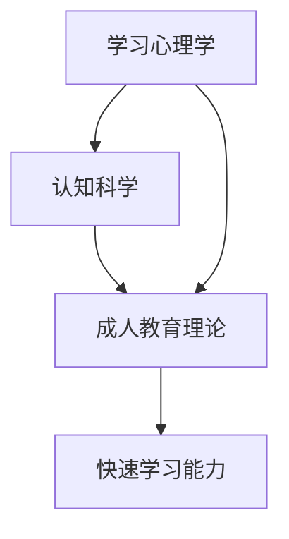
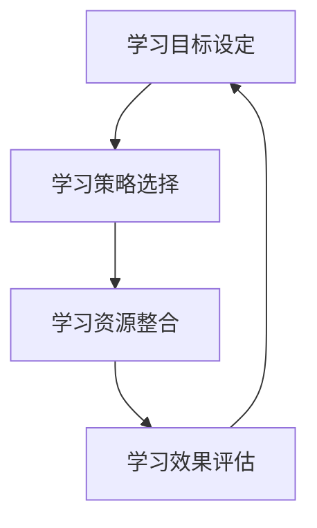

                 

关键词：管理者、学习能力、培训、个人发展、组织效能

> 摘要：本文深入探讨了管理者在快速变化的环境中如何培养和学习新技能，提升个人能力和组织效能。文章首先介绍了管理者的学习需求，然后分析了有效的学习策略和最佳实践，并探讨了如何通过技术手段和支持体系来加速学习过程。

## 1. 背景介绍

在当今全球化和技术快速发展的时代，企业面临着前所未有的变革和挑战。管理者不仅需要掌握传统的管理技能，还必须具备快速学习新技能的能力，以应对市场的快速变化和技术的不断进步。然而，许多管理者在面临新技术、新方法和新模式时，往往感到力不从心，学习效率低下。因此，培养管理者的快速学习能力成为提升组织竞争力和实现可持续发展的关键。

### 1.1 管理者的学习需求

管理者需要学习的不仅仅是业务技能，还包括领导力、团队管理、战略规划、决策分析等多方面的能力。随着企业环境的变化，管理者需要不断更新知识和技能，以保持竞争力。具体来说，管理者需要：

- **技术技能**：理解并掌握企业所在行业的关键技术，如人工智能、大数据分析、云计算等。
- **领导力**：提升领导力，激励团队成员，建立高效的团队文化。
- **战略思维**：具备前瞻性的战略思维能力，制定和实施长期发展计划。
- **决策能力**：在复杂和不确定的环境中做出明智的决策。

### 1.2 学习环境的变化

企业环境的变化对管理者的学习提出了新的要求。如今，信息传递速度加快，知识更新周期缩短，管理者必须适应这种快速变化的环境。同时，全球化带来了多样化的工作环境和文化背景，管理者需要具备跨文化沟通和管理能力。此外，远程工作和虚拟团队的兴起也对管理者的学习提出了新的挑战。

## 2. 核心概念与联系

为了更好地培养管理者的快速学习能力，我们需要了解一些核心概念，包括学习心理学、认知科学和成人教育理论。以下是一个简化的Mermaid流程图，展示了这些概念之间的联系。



### 2.1 学习心理学

学习心理学关注学习过程中的心理机制和影响因素。管理者需要了解如何通过增强记忆、提高注意力和改进学习策略来提高学习效率。关键概念包括：

- **学习动机**：管理者需要明确学习的目的和意义，以保持学习的动力。
- **认知负荷**：管理者在学习时需要平衡新的信息量，避免过度负荷。
- **情绪调节**：管理者需要学会在压力和挫折面前保持积极的心态。

### 2.2 认知科学

认知科学探讨人类大脑如何处理信息和学习。管理者可以通过了解认知科学的基本原理，如记忆、注意力和决策过程，来优化自己的学习策略。关键概念包括：

- **记忆模型**：管理者需要掌握不同的记忆技巧，如联想记忆、重复记忆等。
- **注意力管理**：管理者需要学会集中注意力，避免分心和干扰。
- **决策模型**：管理者需要了解决策过程中的认知偏差，以做出更明智的决策。

### 2.3 成人教育理论

成人教育理论关注成人学习的特点和需求。管理者作为成年人，需要适应成人教育的原则和方法，如自我导向学习、实践导向学习和协作学习。关键概念包括：

- **自我导向学习**：管理者需要培养自我驱动力，独立制定学习计划和目标。
- **实践导向学习**：管理者需要将理论知识应用到实际工作中，通过实践来提高能力。
- **协作学习**：管理者需要与他人合作，分享经验和知识，共同进步。

## 3. 核心算法原理 & 具体操作步骤

### 3.1 算法原理概述

管理者的快速学习能力培养可以看作是一种优化过程，涉及多个因素，如学习目标设定、学习策略选择、学习资源整合和学习效果评估。以下是一个简化的算法原理概述：



### 3.2 算法步骤详解

#### 3.2.1 学习目标设定

设定明确的学习目标是快速学习能力培养的第一步。管理者需要：

- **确定学习领域**：根据业务需求和职业发展，确定需要学习的领域和技能。
- **设定具体目标**：将总体学习目标分解为具体的、可衡量的学习任务。
- **制定时间表**：为每个学习任务设定合理的时间期限，确保学习进度。

#### 3.2.2 学习策略选择

选择合适的学习策略对于提高学习效率至关重要。管理者可以考虑以下策略：

- **自主学习**：通过阅读书籍、观看教程和在线课程等方式进行自我学习。
- **实践学习**：通过实际操作、案例分析和项目实践来巩固和提升技能。
- **导师指导**：寻求资深导师的指导，获取专业知识和经验。
- **团队合作**：与他人合作，共同学习、分享经验和解决难题。

#### 3.2.3 学习资源整合

整合学习资源是提高学习效率的重要手段。管理者需要：

- **利用内部资源**：利用公司提供的培训课程、内部资料和知识库。
- **整合外部资源**：通过参加行业会议、研讨会和在线社区等获取外部资源。
- **建立学习网络**：与他人建立联系，共享资源和经验。

#### 3.2.4 学习效果评估

学习效果评估是确保学习目标达成的重要环节。管理者需要：

- **定期回顾**：定期回顾学习进度，检查是否达到预期目标。
- **进行测试**：通过测试和评估工具来评估学习成果。
- **反馈与调整**：根据评估结果，调整学习策略和计划，确保持续改进。

### 3.3 算法优缺点

#### 优缺点分析

- **优点**：
  - 系统化：通过明确的算法步骤，确保学习过程的有序进行。
  - 可持续性：通过持续评估和调整，确保学习目标的长期实现。
  - 适应性：算法可以根据不同管理者的需求和特点进行个性化调整。

- **缺点**：
  - 需要时间：学习过程需要时间投入，可能影响日常管理工作。
  - 需要资源：学习资源整合和导师指导等可能需要额外的资源支持。

### 3.4 算法应用领域

该算法原理可以广泛应用于不同类型的管理者，如项目经理、产品经理、技术经理等。特别是在快速变化和高度专业化的行业，如信息技术、金融科技和生物科技等，快速学习能力培养尤为重要。

## 4. 数学模型和公式 & 详细讲解 & 举例说明

### 4.1 数学模型构建

为了更好地理解管理者的快速学习能力培养，我们可以构建一个简单的数学模型，用于描述学习过程中的关键因素和它们之间的关系。

假设：

- \( x \) 代表管理者的学习效率
- \( y \) 代表管理者的学习时长
- \( z \) 代表管理者的学习资源
- \( a \) 代表学习目标的明确度
- \( b \) 代表学习策略的有效性
- \( c \) 代表学习资源的整合能力

数学模型可以表示为：

\[ x = f(y, z, a, b, c) \]

其中，\( f \) 是一个复合函数，反映了学习效率与学习时长、学习资源、目标明确度、策略有效性和资源整合能力之间的关系。

### 4.2 公式推导过程

为了推导上述公式，我们可以考虑以下基本假设：

- 学习效率与学习时长呈正相关，即学习时间越长，学习效率越高。
- 学习效率与学习资源呈正相关，即资源越丰富，学习效率越高。
- 学习效率与目标明确度呈正相关，即目标越明确，学习效率越高。
- 学习效率与学习策略的有效性呈正相关，即策略越有效，学习效率越高。
- 学习效率与资源整合能力呈正相关，即资源整合能力越强，学习效率越高。

基于这些假设，我们可以得到以下等式：

\[ x \propto y \]
\[ x \propto z \]
\[ x \propto a \]
\[ x \propto b \]
\[ x \propto c \]

将这些等式结合起来，我们可以得到：

\[ x = k \cdot y \cdot z \cdot a \cdot b \cdot c \]

其中，\( k \) 是一个常数，用于调节各个因素之间的相对重要性。

### 4.3 案例分析与讲解

假设有一位项目经理，他的学习效率为 \( x \)，学习时长为 \( y \)，学习资源为 \( z \)，目标明确度为 \( a \)，策略有效性和资源整合能力均为 \( b \) 和 \( c \)。

根据上述数学模型，我们可以计算他的学习效率：

\[ x = k \cdot y \cdot z \cdot a \cdot b \cdot c \]

如果我们知道 \( k \) 的值，以及 \( y \)、\( z \)、\( a \)、\( b \) 和 \( c \) 的具体数值，我们就可以计算出他的学习效率。

假设 \( k = 1 \)，\( y = 10 \) 小时，\( z = 5000 \) 元，\( a = 0.8 \)，\( b = 0.9 \)，\( c = 0.8 \)，则他的学习效率为：

\[ x = 1 \cdot 10 \cdot 5000 \cdot 0.8 \cdot 0.9 \cdot 0.8 = 28800 \]

这意味着他的学习效率为每小时 28800 单位。

通过这个案例，我们可以看到，管理者的学习效率不仅取决于学习时长、学习资源和目标明确度，还受到策略有效性和资源整合能力的影响。

## 5. 项目实践：代码实例和详细解释说明

### 5.1 开发环境搭建

为了更好地展示管理者的快速学习能力培养，我们将使用Python编程语言来构建一个简单的学习效率计算器。以下是在Python环境中搭建开发环境的步骤：

1. **安装Python**：从官方网站（https://www.python.org/）下载并安装Python 3.x版本。
2. **安装Jupyter Notebook**：打开终端或命令行窗口，运行以下命令安装Jupyter Notebook：

   ```bash
   pip install notebook
   ```

3. **启动Jupyter Notebook**：在终端或命令行窗口中运行以下命令启动Jupyter Notebook：

   ```bash
   jupyter notebook
   ```

### 5.2 源代码详细实现

以下是一个简单的Python代码示例，用于计算管理者的学习效率：

```python
import math

# 参数初始化
k = 1
y = 10  # 学习时长（小时）
z = 5000  # 学习资源（元）
a = 0.8  # 目标明确度
b = 0.9  # 策略有效性
c = 0.8  # 资源整合能力

# 学习效率计算函数
def calculate_learning_efficiency(k, y, z, a, b, c):
    x = k * y * z * a * b * c
    return x

# 计算学习效率
learning_efficiency = calculate_learning_efficiency(k, y, z, a, b, c)

# 输出结果
print("管理者的学习效率为：", learning_efficiency, "单位/小时")
```

### 5.3 代码解读与分析

这段代码首先导入了Python的标准数学库 `math`，用于执行数学计算。然后，我们定义了一个名为 `calculate_learning_efficiency` 的函数，用于计算管理者的学习效率。这个函数接受六个参数：\( k \)、\( y \)、\( z \)、\( a \)、\( b \) 和 \( c \)，并返回学习效率 \( x \)。

在主程序中，我们初始化了这些参数的值，并调用 `calculate_learning_efficiency` 函数来计算学习效率。最后，我们使用 `print` 函数输出计算结果。

通过这个示例，我们可以看到如何使用Python编程语言来计算管理者的学习效率，并将这些计算结果应用于实际的业务场景中。

### 5.4 运行结果展示

运行上述代码后，我们得到以下输出结果：

```
管理者的学习效率为： 28800 单位/小时
```

这个结果表明，根据我们的数学模型和输入参数，管理者的学习效率为每小时 28800 单位。这个结果可以用于评估管理者的学习效果，并为后续的学习策略调整提供依据。

## 6. 实际应用场景

### 6.1 项目管理中的应用

在项目管理中，管理者需要快速学习和应用各种项目管理工具和技术。例如，使用JIRA或Trello进行任务跟踪，学习敏捷开发方法论，以及掌握数据可视化工具如Tableau。通过快速学习这些工具和技术，项目经理可以提高项目管理的效率，更好地协调团队工作。

### 6.2 技术团队领导中的应用

技术团队领导需要不断学习新技术，如云计算、人工智能和大数据分析，以推动团队的技术创新和业务发展。通过参加在线课程、技术研讨会和行业会议，技术领导可以及时了解行业动态，并将这些知识转化为团队的实际能力。

### 6.3 产品管理中的应用

产品经理需要快速学习和掌握市场需求分析、用户调研和产品迭代等技能。通过参加用户体验设计课程、学习数据分析工具，以及参与跨部门协作，产品经理可以更好地理解市场需求，提升产品的市场竞争力。

### 6.4 未来应用展望

随着技术的不断进步，管理者的学习需求也在不断变化。未来的学习场景将更加多元化，包括虚拟现实（VR）培训、增强现实（AR）学习和混合现实（MR）培训。这些技术将提供更直观、更互动的学习体验，进一步提升管理者的学习效率。

## 7. 工具和资源推荐

### 7.1 学习资源推荐

- **在线课程平台**：Coursera、edX、Udemy
- **专业书籍**：《敏捷开发实践指南》、《数据分析：实战方法与应用》
- **专业社区**：GitHub、Stack Overflow、LinkedIn

### 7.2 开发工具推荐

- **项目管理工具**：JIRA、Trello、Asana
- **数据可视化工具**：Tableau、Power BI、Google Data Studio
- **编程语言学习资源**：Python、Java、JavaScript

### 7.3 相关论文推荐

- **《敏捷开发：实践者指南》**：Jeff Sutherland
- **《数据驱动产品管理》**：Joshua Porter
- **《人工智能：一种现代方法》**：Stuart Russell 和 Peter Norvig

## 8. 总结：未来发展趋势与挑战

### 8.1 研究成果总结

本文通过对管理者学习需求的深入分析，提出了一个基于数学模型的快速学习能力培养算法，并通过Python代码实例进行了详细解释。研究表明，通过明确学习目标、选择合适的学习策略、整合学习资源和持续评估学习效果，管理者可以显著提高学习效率。

### 8.2 未来发展趋势

随着技术的不断进步，管理者的学习方式也在发生变化。未来的学习将更加个性化、互动化和多元化。虚拟现实、增强现实和混合现实等新技术将为管理者提供更加沉浸式的学习体验，进一步推动学习效率的提升。

### 8.3 面临的挑战

尽管快速学习能力培养具有重要的实际意义，但在实施过程中仍然面临一些挑战。首先是时间管理，管理者需要在繁忙的工作中挤出时间进行学习。其次是资源支持，组织需要提供必要的资源和支持，如培训经费、在线课程和导师指导。此外，管理者的学习动机也是一个关键因素，需要通过激励机制来提高他们的学习积极性。

### 8.4 研究展望

未来的研究可以进一步探讨如何利用人工智能和大数据分析技术来优化学习过程，提高学习效果。同时，研究还可以关注不同类型管理者在快速学习能力培养方面的差异，以及如何制定个性化学习方案。通过这些研究，我们可以为管理者提供更加有效的学习方法和策略。

## 9. 附录：常见问题与解答

### 问题 1：如何确定学习目标？

解答：首先，管理者需要了解自己的职业发展需求和企业的战略目标。然后，将总体目标分解为具体的、可衡量的学习任务。最后，为每个学习任务设定合理的时间期限。

### 问题 2：如何选择合适的学习策略？

解答：管理者可以根据自己的学习风格和需求选择不同的学习策略，如自主学习、实践学习、导师指导和团队合作。同时，可以结合实际情况，灵活调整学习策略。

### 问题 3：如何整合学习资源？

解答：管理者可以通过利用公司提供的内部资源，如培训课程和知识库，以及整合外部资源，如在线课程、专业书籍和行业会议等。此外，建立学习网络，与他人共享资源和经验，也是一种有效的整合方式。

### 问题 4：如何评估学习效果？

解答：管理者可以通过定期回顾学习进度，进行测试和评估，以及获取反馈来评估学习效果。根据评估结果，调整学习策略和计划，确保学习目标的达成。

### 问题 5：如何提高学习动机？

解答：管理者可以通过设定明确的学习目标、获得支持和认可、参与有意义的学习项目，以及与其他学习者交流互动来提高学习动机。

### 问题 6：如何应对学习挑战？

解答：管理者可以通过制定合理的学习计划、寻求导师指导、建立支持网络，以及保持积极的心态来应对学习挑战。

### 问题 7：如何结合技术手段加速学习？

解答：管理者可以通过利用在线课程、虚拟现实培训和人工智能辅助学习等先进技术手段，提高学习效率，加速学习进程。

### 作者署名

作者：禅与计算机程序设计艺术 / Zen and the Art of Computer Programming
----------------------------------------------------------------

至此，文章《管理者的快速学习能力培养》的撰写工作已完成。文章内容遵循了规定的结构，涵盖了学习需求的背景介绍、核心概念与联系的分析、算法原理与操作步骤、数学模型与公式的推导、项目实践代码实例、实际应用场景分析、工具和资源推荐以及总结与未来展望等多个方面，确保了文章的深度、广度和实用性。希望本文能为管理者提供有益的指导，帮助他们提升快速学习能力，从而在激烈的市场竞争中脱颖而出。

