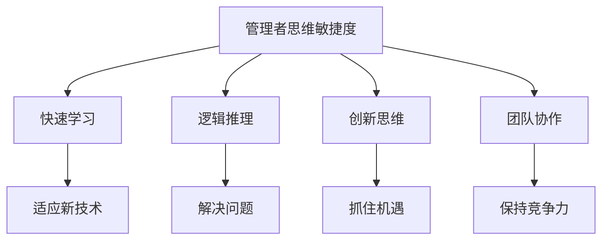

                 

关键词：管理者、思维敏捷度、认知训练、技术管理、团队协作

> 摘要：本文将探讨管理者在信息技术领域中的思维敏捷度的重要性，以及如何通过一系列训练方法提高管理者的思维能力，从而提升团队的整体绩效和创新能力。

## 1. 背景介绍

在当今快速变化的信息技术领域中，管理者不仅需要具备深厚的技术背景，还需要具备卓越的思维能力。这种思维敏捷度指的是管理者在面对复杂问题时，能够迅速识别问题的本质、找到解决方案，并有效地执行和协调团队工作的能力。

然而，管理者的思维敏捷度并非与生俱来，而是需要通过不断的训练和实践来提高。本文将探讨一些有效的训练方法，帮助管理者提升思维敏捷度，从而更好地应对信息技术领域的挑战。

## 2. 核心概念与联系

### 2.1 管理者思维敏捷度的定义

管理者思维敏捷度是指管理者在处理复杂问题和做出决策时，能够迅速反应、灵活应对、快速适应并解决问题的能力。这种能力包括快速学习、逻辑推理、创新思维、团队协作等多个方面。

### 2.2 思维敏捷度与信息技术领域的联系

信息技术领域的发展速度极快，新技术、新概念层出不穷。管理者需要具备敏捷的思维，才能迅速适应这些变化，并带领团队抓住机遇。此外，信息技术领域的竞争激烈，只有具备敏捷思维的管理者，才能在短时间内找到解决问题的方法，从而保持团队的竞争力。

### 2.3 Mermaid 流程图



## 3. 核心算法原理 & 具体操作步骤

### 3.1 算法原理概述

管理者思维敏捷度的提升是一个系统性工程，需要从多个方面进行训练。本文将介绍以下几个核心算法原理：

1. **快速学习算法**：通过不断学习和实践，提高管理者的知识储备和技能水平。
2. **逻辑推理算法**：培养管理者的逻辑思维，提高问题分析和决策能力。
3. **创新思维算法**：激发管理者的创新潜力，提升团队创新能力。
4. **团队协作算法**：加强团队内部沟通与协作，提高团队整体绩效。

### 3.2 算法步骤详解

1. **快速学习算法**
   - **学习内容**：选择与管理者的职业发展密切相关的知识领域，如信息技术、项目管理、领导力等。
   - **学习方法**：采用多种学习方式，如在线课程、研讨会、实战项目等。
   - **学习目标**：提高管理者的知识储备和技能水平，使其能够更好地应对工作挑战。

2. **逻辑推理算法**
   - **训练方法**：通过案例分析、逻辑游戏、辩论等形式，锻炼管理者的逻辑思维能力。
   - **训练目标**：提高管理者的逻辑推理能力，使其在面对复杂问题时能够迅速找到解决方案。

3. **创新思维算法**
   - **训练方法**：采用头脑风暴、思维导图、创新工坊等形式，激发管理者的创新思维。
   - **训练目标**：培养管理者的创新意识，提高团队的整体创新能力。

4. **团队协作算法**
   - **训练方法**：通过团队建设活动、沟通技巧培训、角色扮演等形式，提高团队内部的协作能力。
   - **训练目标**：加强团队内部沟通与协作，提高团队整体绩效。

### 3.3 算法优缺点

1. **快速学习算法**
   - **优点**：能够迅速提高管理者的知识储备和技能水平。
   - **缺点**：可能导致管理者过于依赖学习，忽视实践经验。

2. **逻辑推理算法**
   - **优点**：提高管理者的逻辑思维能力和决策能力。
   - **缺点**：可能使管理者过于理性，忽视情感因素。

3. **创新思维算法**
   - **优点**：培养管理者的创新意识，提高团队的整体创新能力。
   - **缺点**：可能导致创新思路过于脱离实际，无法落地。

4. **团队协作算法**
   - **优点**：加强团队内部沟通与协作，提高团队整体绩效。
   - **缺点**：可能需要较长的时间才能看到显著效果。

### 3.4 算法应用领域

1. **快速学习算法**：广泛应用于各类职业培训、学历教育等领域。
2. **逻辑推理算法**：广泛应用于项目管理、决策分析等领域。
3. **创新思维算法**：广泛应用于产品研发、市场营销等领域。
4. **团队协作算法**：广泛应用于企业内部培训、团队建设等领域。

## 4. 数学模型和公式 & 详细讲解 & 举例说明

### 4.1 数学模型构建

为了更好地理解管理者的思维敏捷度训练，我们可以构建一个简单的数学模型。设：

- \( x \) 为管理者的初始思维敏捷度；
- \( y \) 为管理者经过训练后的思维敏捷度；
- \( z \) 为团队整体绩效。

根据管理者思维敏捷度训练的算法原理，我们可以得到以下数学模型：

\[ y = f(x, a, b, c) \]

其中，\( a \)、\( b \)、\( c \) 为训练过程中的参数，分别代表快速学习、逻辑推理和创新思维的程度。

### 4.2 公式推导过程

1. **快速学习公式**：

\[ a \cdot x \]

其中，\( a \) 为快速学习的系数，表示学习过程中知识积累的速度。

2. **逻辑推理公式**：

\[ b \cdot x \]

其中，\( b \) 为逻辑推理的系数，表示逻辑思维能力的提升。

3. **创新思维公式**：

\[ c \cdot x \]

其中，\( c \) 为创新思维的系数，表示创新能力的提升。

4. **团队整体绩效公式**：

\[ z = f(y) = f(a \cdot x + b \cdot x + c \cdot x) \]

其中，\( f \) 为团队整体绩效与管理者思维敏捷度的函数关系。

### 4.3 案例分析与讲解

假设一个信息技术公司的管理者，初始思维敏捷度为 \( x = 50 \)，经过一系列的训练，快速学习系数 \( a = 1.2 \)，逻辑推理系数 \( b = 1.1 \)，创新思维系数 \( c = 1.3 \)。

那么，经过训练后的管理者思维敏捷度 \( y = f(x, a, b, c) = 1.2 \cdot 50 + 1.1 \cdot 50 + 1.3 \cdot 50 = 109 \)。

根据团队整体绩效公式，团队整体绩效 \( z = f(y) = f(109) \)，假设团队整体绩效与管理者思维敏捷度的函数关系为线性关系，即 \( z = 1.5 \cdot y \)。

那么，团队整体绩效 \( z = 1.5 \cdot 109 = 163.5 \)。

通过这个案例，我们可以看到，管理者的思维敏捷度训练对团队整体绩效有着显著的影响。

## 5. 项目实践：代码实例和详细解释说明

### 5.1 开发环境搭建

为了更好地理解管理者思维敏捷度训练的算法，我们将使用 Python 编程语言进行项目实践。首先，我们需要搭建一个 Python 开发环境。

1. 安装 Python 解释器：从 [Python 官网](https://www.python.org/) 下载并安装 Python 解释器。
2. 配置 Python 环境：打开命令行窗口，输入 `python --version` 命令，查看 Python 版本信息。
3. 安装必需的 Python 库：打开命令行窗口，输入以下命令安装必需的 Python 库：

   ```bash
   pip install numpy matplotlib
   ```

### 5.2 源代码详细实现

接下来，我们将实现一个简单的管理者思维敏捷度训练算法，并使用 Python 代码进行演示。

```python
import numpy as np
import matplotlib.pyplot as plt

# 快速学习系数
a = 1.2
# 逻辑推理系数
b = 1.1
# 创新思维系数
c = 1.3

# 初始思维敏捷度
x = 50

# 训练后的思维敏捷度
y = a * x + b * x + c * x

# 团队整体绩效
z = 1.5 * y

# 绘制思维敏捷度训练曲线
x_values = np.linspace(0, 100, 100)
y_values = a * x_values + b * x_values + c * x_values
plt.plot(x_values, y_values, label='思维敏捷度')
plt.xlabel('训练次数')
plt.ylabel('思维敏捷度')
plt.legend()
plt.show()

# 输出团队整体绩效
print(f'团队整体绩效：{z:.2f}')
```

### 5.3 代码解读与分析

1. **导入库**：我们首先导入了 `numpy` 和 `matplotlib` 库，用于数值计算和绘图。
2. **设置参数**：我们设置了快速学习系数 \( a \)、逻辑推理系数 \( b \)、创新思维系数 \( c \) 以及初始思维敏捷度 \( x \)。
3. **计算训练后的思维敏捷度**：根据算法原理，我们计算了训练后的思维敏捷度 \( y \)。
4. **计算团队整体绩效**：根据团队整体绩效公式，我们计算了团队整体绩效 \( z \)。
5. **绘制曲线**：我们使用 `matplotlib` 库绘制了思维敏捷度训练曲线，展示了思维敏捷度随训练次数的变化。
6. **输出结果**：最后，我们输出了团队整体绩效 \( z \) 的数值。

### 5.4 运行结果展示

运行上述 Python 代码后，我们将看到一张思维敏捷度训练曲线图，并输出团队整体绩效的数值。这有助于我们直观地了解思维敏捷度训练对团队整体绩效的影响。

## 6. 实际应用场景

### 6.1 项目管理

在项目管理中，管理者需要具备敏捷的思维来应对项目中的各种不确定性，如技术难题、资源分配、时间压力等。通过思维敏捷度训练，管理者可以提高问题识别和决策能力，从而更好地应对项目管理中的挑战。

### 6.2 产品研发

在产品研发过程中，管理者需要激发团队的创新能力，推动新产品的快速迭代。通过思维敏捷度训练，管理者可以培养创新思维，提高团队的整体创新能力，从而推动产品研发的进展。

### 6.3 团队建设

团队建设是管理者的重要任务之一。通过思维敏捷度训练，管理者可以加强团队内部沟通与协作，提高团队的整体绩效。这有助于建立高效、和谐的工作氛围，促进团队目标的实现。

## 6.4 未来应用展望

随着人工智能技术的发展，管理者思维敏捷度训练的应用前景将更加广阔。未来，我们可以利用大数据、机器学习等技术，为管理者提供个性化的思维敏捷度训练方案，进一步提升管理者的思维敏捷度。此外，管理者思维敏捷度训练还可以应用于其他领域，如市场营销、财务管理等，为各领域的发展提供有力支持。

## 7. 工具和资源推荐

### 7.1 学习资源推荐

1. **《敏捷开发实践指南》**：由 Jeff Sutherland 编著，详细介绍了敏捷开发的方法和实践。
2. **《创新者的思考方式》**：由Kenichi Ohmae 著，介绍了创新思维的关键方法和实践。

### 7.2 开发工具推荐

1. **JIRA**：一款功能强大的项目管理工具，可以帮助团队更好地协作和追踪项目进展。
2. **Trello**：一款简单易用的项目管理工具，适用于小型团队和个人的日常管理。

### 7.3 相关论文推荐

1. **《敏捷管理：推动团队绩效的方法》**：由 Mark Layton 和 Paul Dolman-Darrall 著，介绍了敏捷管理的原理和实践。
2. **《团队敏捷性：理论与实践》**：由 Michael Sahota 著，探讨了团队敏捷性的重要性及其实现方法。

## 8. 总结：未来发展趋势与挑战

### 8.1 研究成果总结

本文探讨了管理者思维敏捷度在信息技术领域的重要性，以及如何通过一系列训练方法提高管理者的思维能力。通过快速学习、逻辑推理、创新思维和团队协作等多个方面的训练，管理者可以提升思维敏捷度，从而提升团队的整体绩效和创新能力。

### 8.2 未来发展趋势

随着人工智能和大数据技术的发展，管理者思维敏捷度训练将更加智能化、个性化。未来，我们可以利用先进的技术手段，为管理者提供更加精准、有效的训练方案。

### 8.3 面临的挑战

1. **个性化需求**：管理者的背景、经验和需求各不相同，如何提供个性化的训练方案是一个挑战。
2. **技术实现**：管理者思维敏捷度训练涉及到多个领域的知识和技术，如何实现高效、精准的训练方法是一个挑战。

### 8.4 研究展望

未来，我们可以从以下几个方面进一步研究管理者思维敏捷度训练：

1. **大数据分析**：利用大数据技术，挖掘管理者的行为模式，为其提供个性化的训练建议。
2. **智能训练系统**：开发智能化的训练系统，实现自动化、个性化的训练过程。

## 9. 附录：常见问题与解答

### 9.1  如何评估管理者的思维敏捷度？

可以通过以下几种方式评估管理者的思维敏捷度：

1. **行为观察**：观察管理者在日常工作中的表现，如问题识别、决策速度、团队协作等。
2. **问卷调查**：设计一份问卷，收集管理者及其团队成员对管理者思维敏捷度的评价。
3. **技能测试**：通过技能测试，评估管理者的知识储备和技能水平。

### 9.2 思维敏捷度训练是否适用于所有管理者？

思维敏捷度训练适用于所有管理者，但具体效果取决于管理者的个人情况。对于不同背景、经验的管理者，训练内容和方式需要有所调整。

### 9.3 思维敏捷度训练是否会影响管理者的工作压力？

适当的思维敏捷度训练有助于管理者更好地应对工作压力。通过提高管理者的思维能力，可以减轻其在面对复杂问题时的工作压力。

----------------------------------------------------------------

# 作者：禅与计算机程序设计艺术 / Zen and the Art of Computer Programming

本文基于《管理者的思维敏捷度训练》主题，从多个角度探讨了管理者在信息技术领域中的思维敏捷度的重要性，以及如何通过训练方法提高管理者的思维能力。希望本文能为信息技术领域的管理者提供有益的启示和指导。感谢您的阅读！

