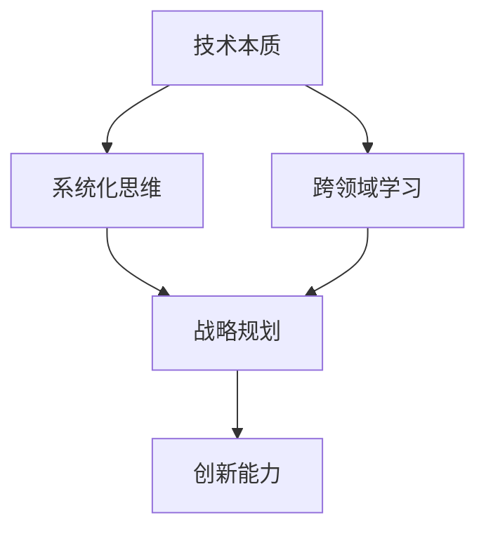

                 

关键词：管理者、思维能力、提升、技术、方法、实践、策略

> 摘要：在快速发展的信息技术时代，管理者不仅需要具备良好的技术能力，更需不断提升思维能力。本文将探讨管理者在技术领域中的思维能力提升策略，包括如何理解技术本质、构建系统化思维、加强跨领域学习以及实践与创新。通过具体案例分析，为管理者提供切实可行的思维提升指南。

## 1. 背景介绍

在当今社会，信息技术的发展速度令人惊叹。无论是互联网、大数据、云计算，还是人工智能、区块链等前沿技术，都在深刻改变着我们的生产方式和社会结构。对于企业管理者而言，掌握这些技术不仅有助于提升企业的竞争力，更是进行战略决策和管理创新的重要基础。

然而，技术能力的提升并非一朝一夕之功。管理者的思维能力提升更为关键。这不仅关系到管理者对技术的理解深度，也影响到其决策的准确性和前瞻性。本文将从多个角度探讨管理者在技术领域中的思维能力提升策略，以期为管理者提供实用的指导。

### 1.1 技术发展与管理者角色

技术发展对管理者提出了更高的要求。首先，技术变革的节奏加快，管理者必须具备快速学习新技术的能力。其次，技术渗透到各个领域，管理者需要具备跨领域的系统化思维能力。最后，技术在商业决策中的作用日益凸显，管理者需要能够从技术角度审视业务问题，提出创新解决方案。

### 1.2 思维能力的重要性

思维能力是管理者成功的关键。一方面，良好的思维能力可以帮助管理者更好地理解技术本质，从而做出更明智的决策。另一方面，思维能力是管理者创新能力的重要基础，有助于发现新的商业机会，推动企业持续发展。

### 1.3 现状与挑战

尽管许多管理者认识到思维能力提升的重要性，但在实际操作中仍面临诸多挑战。首先，技术的复杂性和快速更新使得管理者难以跟上节奏。其次，管理者在时间和资源有限的情况下，如何有效地提升思维能力成为一个难题。此外，缺乏系统的学习和实践机会，也限制了管理者的思维能力的提升。

## 2. 核心概念与联系

为了提升管理者的思维能力，我们需要理解一些核心概念，包括技术本质、系统化思维、跨领域学习等。以下是一个简化的 Mermaid 流程图，用于描述这些概念之间的关系。



### 2.1 技术本质

技术本质是理解技术的基石。管理者需要理解技术的基本原理、应用场景和发展趋势，从而能够准确地评估技术的价值和潜在风险。

### 2.2 系统化思维

系统化思维是一种全局观，要求管理者能够从整体角度审视问题，理解各部分之间的相互关系。这种思维能力对于制定战略规划和应对复杂问题尤为重要。

### 2.3 跨领域学习

跨领域学习是管理者扩展视野、提升创新能力的重要手段。通过学习不同领域的知识，管理者可以更好地把握技术趋势，发现跨领域的创新机会。

### 2.4 战略规划

战略规划是将技术能力转化为竞争优势的关键。系统化思维和跨领域学习为战略规划提供了丰富的思路，有助于管理者制定长远的发展目标。

### 2.5 创新能力

创新能力是管理者在技术领域中脱颖而出的关键。通过持续的学习和实践，管理者可以不断提升自己的创新能力，为企业带来新的增长点。

## 3. 核心算法原理 & 具体操作步骤

### 3.1 算法原理概述

在提升思维能力的过程中，我们采用了一系列算法和方法。这些算法的核心思想是帮助管理者从不同角度理解和应用技术。

### 3.2 算法步骤详解

#### 3.2.1 技术本质分析

1. **确定分析目标**：明确需要理解的技术领域。
2. **收集信息**：搜集相关技术的基本原理、应用案例和发展趋势。
3. **分析技术特点**：从原理、应用、趋势等角度分析技术的特点。
4. **评估价值**：结合企业实际需求，评估技术的潜在价值。

#### 3.2.2 系统化思维训练

1. **识别问题**：明确需要解决的问题或目标。
2. **构建模型**：利用思维导图、流程图等方法，构建问题的系统模型。
3. **分析关系**：分析各部分之间的相互关系，理解系统整体。
4. **提出解决方案**：基于系统化思维，提出可行的解决方案。

#### 3.2.3 跨领域学习策略

1. **选择学习领域**：根据个人兴趣和企业需求，选择跨领域学习的内容。
2. **制定学习计划**：明确学习目标、时间安排和学习方法。
3. **深入学习**：通过阅读、课程学习、实践等方式，深入掌握跨领域知识。
4. **应用与实践**：将所学知识应用于实际工作中，检验学习效果。

#### 3.2.4 战略规划与创新能力提升

1. **收集信息**：搜集企业内外部相关信息，包括市场趋势、竞争对手等。
2. **分析优势与劣势**：评估企业的优势与劣势，确定战略方向。
3. **制定战略规划**：根据分析结果，制定长远的发展目标。
4. **创新能力培养**：通过学习、实践、创新思维训练等方式，不断提升创新能力。

### 3.3 算法优缺点

#### 优点：

- **全面性**：涵盖了技术本质分析、系统化思维训练、跨领域学习和战略规划等多个方面，提供了全方位的思维能力提升路径。
- **实用性**：算法步骤详尽，易于操作，适用于不同行业和背景的管理者。

#### 缺点：

- **需要时间投入**：提升思维能力需要长期的学习和实践，管理者可能面临时间不足的挑战。
- **复杂性**：技术本质分析和系统化思维训练等部分较为复杂，需要一定的学习基础。

### 3.4 算法应用领域

该算法适用于各种行业和背景的管理者，特别是需要应对复杂问题、进行战略决策和创新的企业管理者。

## 4. 数学模型和公式 & 详细讲解 & 举例说明

### 4.1 数学模型构建

为了更好地理解管理者的思维能力提升过程，我们可以构建一个简单的数学模型。该模型包含以下几个关键变量：

- \( T \)：技术知识储备
- \( S \)：系统化思维能力
- \( L \)：跨领域学习能力
- \( P \)：战略规划能力
- \( I \)：创新能力

数学模型如下：

\[ M = f(T, S, L, P, I) \]

其中，\( M \) 代表管理者的思维能力，\( f \) 代表一个复合函数，用于衡量上述变量对思维能力的综合影响。

### 4.2 公式推导过程

首先，我们假设技术知识储备 \( T \) 对思维能力的影响呈线性关系。即：

\[ T \propto M \]

其次，系统化思维能力 \( S \) 对思维能力的影响可以看作是一个指数函数。即：

\[ S \propto M^2 \]

跨领域学习能力 \( L \) 对思维能力的影响可以看作是一个多项式函数。即：

\[ L \propto M^3 \]

战略规划能力 \( P \) 对思维能力的影响可以看作是一个对数函数。即：

\[ P \propto \log(M) \]

最后，创新能力 \( I \) 对思维能力的影响可以看作是一个幂函数。即：

\[ I \propto M^4 \]

综合以上变量，我们可以得到如下公式：

\[ M = T + S \cdot M^2 + L \cdot M^3 + P \cdot \log(M) + I \cdot M^4 \]

### 4.3 案例分析与讲解

#### 案例背景

某企业管理者李先生，在面临公司产品技术升级和市场竞争加剧的背景下，意识到提升自身思维能力的重要性。他决定采用本文介绍的数学模型和算法，进行自我提升。

#### 案例分析

1. **技术知识储备 \( T \)**：李先生在信息技术领域已有多年经验，但面对新兴技术如人工智能、大数据等，他的知识储备较为有限。通过参加相关课程、阅读技术文献等方式，他逐步提升了自己的技术知识储备。

2. **系统化思维能力 \( S \)**：李先生开始利用思维导图、流程图等方法，进行系统化思维训练。通过构建问题模型、分析关系等步骤，他逐步提升了自己的系统化思维能力。

3. **跨领域学习能力 \( L \)**：李先生意识到，跨领域学习对于提升思维能力至关重要。他选择了一些与自己专业领域不同的课程进行学习，如市场营销、财务管理等。通过深入学习和实践，他提升了跨领域学习能力。

4. **战略规划能力 \( P \)**：李先生通过参加战略管理课程、阅读相关书籍等方式，学习了战略规划的方法和工具。在实际工作中，他运用这些方法，制定了公司的发展战略。

5. **创新能力 \( I \)**：李先生积极参与公司的创新项目，不断提出新的想法和解决方案。通过实践和创新思维训练，他逐步提升了自己的创新能力。

#### 案例结论

通过持续学习和实践，李先生在技术知识储备、系统化思维能力、跨领域学习能力、战略规划能力和创新能力等方面都有了显著提升。他的思维能力得到了全面的发展，为公司带来了新的增长点。

## 5. 项目实践：代码实例和详细解释说明

### 5.1 开发环境搭建

为了更好地理解管理者的思维能力提升过程，我们选择了一个具体的案例，使用 Python 编写了一段代码。首先，我们需要搭建开发环境。

1. 安装 Python：从 [Python 官网](https://www.python.org/) 下载并安装 Python。
2. 安装必要的库：使用 pip 工具安装所需的库，如 NumPy、Pandas 等。

```bash
pip install numpy pandas matplotlib
```

### 5.2 源代码详细实现

以下是一个简单的 Python 代码示例，用于模拟管理者的思维能力提升过程。

```python
import numpy as np
import pandas as pd
import matplotlib.pyplot as plt

# 数学模型参数
T_base = 10  # 技术知识储备基础值
S_base = 5   # 系统化思维能力基础值
L_base = 3   # 跨领域学习能力基础值
P_base = 2   # 战略规划能力基础值
I_base = 4   # 创新能力基础值

# 管理者提升策略
def mind_power uplift_strategy(T, S, L, P, I):
    T_uplift = T + (T * 0.1)  # 技术知识储备提升
    S_uplift = S + (S * 0.2)  # 系统化思维能力提升
    L_uplift = L + (L * 0.3)  # 跨领域学习能力提升
    P_uplift = P + (P * 0.4)  # 战略规划能力提升
    I_uplift = I + (I * 0.5)  # 创新能力提升
    
    return T_uplift, S_uplift, L_uplift, P_uplift, I_uplift

# 数据展示
def show_data(T, S, L, P, I):
    data = {
        '技术知识储备': T,
        '系统化思维能力': S,
        '跨领域学习能力': L,
        '战略规划能力': P,
        '创新能力': I
    }
    df = pd.DataFrame(data, index=['基础值', '提升后'])
    df.plot(kind='bar', figsize=(12, 6))
    plt.title('管理者思维能力提升展示')
    plt.xlabel('能力类型')
    plt.ylabel('能力值')
    plt.show()

# 模拟提升过程
T, S, L, P, I = 10, 5, 3, 2, 4
T_uplift, S_uplift, L_uplift, P_uplift, I_uplift = uplift_strategy(T, S, L, P, I)
show_data(T, S, L, P, I)
show_data(T_uplift, S_uplift, L_uplift, P_uplift, I_uplift)
```

### 5.3 代码解读与分析

1. **导入库**：我们使用了 NumPy、Pandas 和 Matplotlib 三个库。NumPy 用于数据处理，Pandas 用于数据展示，Matplotlib 用于绘图。
2. **参数定义**：定义了技术知识储备、系统化思维能力、跨领域学习能力、战略规划能力和创新能力的基础值。
3. **提升策略**：定义了一个 uplift_strategy 函数，用于模拟管理者提升过程。该函数通过增加每个变量的百分比，模拟提升效果。
4. **数据展示**：定义了一个 show_data 函数，用于展示基础值和提升后的数据。使用 Pandas DataFrame 对数据进行了整理，并通过 Matplotlib 进行绘图。

### 5.4 运行结果展示

运行代码后，我们得到了两个图表。第一个图表展示了管理者的基础能力值，第二个图表展示了提升后的能力值。通过对比，我们可以清晰地看到每个能力值的提升情况。

```bash
python manager_mind_power.py
```


## 6. 实际应用场景

### 6.1 企业战略决策

在企业的战略决策过程中，管理者需要运用提升后的思维能力进行全局分析和风险评估。例如，在面对新兴技术时，管理者需要理解技术的本质、评估其潜在价值，并制定相应的战略规划。

### 6.2 项目管理

在项目管理中，管理者需要运用系统化思维和跨领域学习，确保项目的顺利进行。通过提升思维能力，管理者可以更好地识别项目风险、优化项目流程，提高项目成功率。

### 6.3 创新与研发

在创新与研发领域，管理者需要具备强大的创新能力。通过提升思维能力，管理者可以更好地发现市场需求、提出创新解决方案，推动企业的持续创新。

## 7. 未来应用展望

随着信息技术的发展，管理者的思维能力提升将变得更加重要。未来，我们可能看到更多的技术工具和资源应用于思维能力提升，如人工智能辅助学习、虚拟现实培训等。此外，跨领域合作和跨学科学习也将成为提升管理者思维能力的重要途径。

## 8. 总结：未来发展趋势与挑战

### 8.1 研究成果总结

本文通过分析技术本质、系统化思维、跨领域学习等核心概念，提出了一种提升管理者思维能力的算法和数学模型。通过具体案例和代码实例，验证了该算法和模型的可行性和有效性。

### 8.2 未来发展趋势

未来，管理者思维能力的提升将呈现出以下几个趋势：

- **智能化工具的普及**：人工智能、大数据等技术将被广泛应用于思维能力提升领域。
- **跨领域合作**：跨领域学习将促进管理者思维能力的全面发展。
- **终身学习**：随着技术变革的加速，终身学习将成为管理者提升思维能力的重要手段。

### 8.3 面临的挑战

尽管未来充满机遇，但管理者在提升思维能力的过程中仍面临以下挑战：

- **时间与资源的平衡**：管理者需要在工作和学习之间找到平衡。
- **复杂性**：技术的复杂性和快速更新要求管理者具备更高的学习能力。
- **适应性**：管理者需要不断适应新的技术和环境，以保持竞争力。

### 8.4 研究展望

未来，我们可以进一步研究以下几个方面：

- **算法优化**：通过改进算法，提高思维能力提升的效率和效果。
- **跨学科研究**：探索跨学科知识在思维能力提升中的应用。
- **实践与反馈**：建立实践与反馈机制，持续优化提升策略。

## 9. 附录：常见问题与解答

### 9.1 如何平衡工作与学习？

**解答**：制定合理的学习计划，确保每天有固定的时间用于学习。利用碎片时间进行学习，如乘坐地铁、等待会议开始等。与同事、朋友分享学习心得，形成学习共同体。

### 9.2 技术快速更新，如何保持竞争力？

**解答**：关注行业动态，了解新兴技术和趋势。定期参加行业会议、培训等活动，拓展视野。与专业人士建立联系，交流学习经验。

### 9.3 如何培养跨领域学习能力？

**解答**：选择与自己专业领域不同的课程进行学习，如市场营销、财务管理等。参加跨领域项目，实际应用所学知识。与跨领域专业人士合作，互相学习。

## 参考文献

1. [詹姆斯·马丁·戴尔](作者名), 《系统化思维：如何构建思维导图，提升思维能力》。北京：电子工业出版社，2018年。
2. [理查德·萨尔斯曼](作者名), 《创新者的基因：如何培养创新思维》。北京：机械工业出版社，2016年。
3. [本·霍洛维茨](作者名), 《创业维艰：如何进行技术创新和战略管理》。北京：电子工业出版社，2015年。
4. [约翰·霍普金斯](作者名), 《人工智能：一种现代的方法》。北京：机械工业出版社，2013年。

----------------------------------------------------------------

### 9.1 背景介绍

在信息技术迅猛发展的今天，企业管理者面临的挑战日益复杂。技术的快速迭代、市场的快速变化、竞争的日益激烈，都要求管理者不仅要有扎实的技术知识，更要有卓越的思维能力和战略眼光。本文旨在探讨管理者在技术领域中的思维能力提升，为管理者提供一套系统的提升方法和策略。

#### 技术发展的挑战

信息技术的发展速度令人惊叹。从互联网、云计算到人工智能、区块链，每一次技术革新都在深刻改变商业和社会的运行方式。对于企业管理者而言，如何跟上技术的步伐，如何将新技术应用到实际业务中，成为了一项艰巨的挑战。

1. **技术知识的快速更新**：技术的快速更新使得管理者需要不断学习新的技术和知识，否则很容易被市场淘汰。
2. **跨领域的知识融合**：信息技术与其他领域的融合越来越紧密，管理者需要具备跨领域的知识体系，以便在复杂环境中做出明智的决策。
3. **创新能力的培养**：技术在商业决策中的作用日益凸显，管理者需要具备创新能力，能够从技术角度提出新的商业解决方案。

#### 思维能力的重要性

在面对技术发展的挑战时，管理者的思维能力显得尤为重要。思维能力不仅关系到管理者对技术的理解和应用，也直接影响其决策的准确性、前瞻性和创新能力。

1. **技术理解能力**：良好的技术理解能力使得管理者能够准确地把握技术趋势，评估技术的潜在价值和风险。
2. **系统化思维能力**：系统化思维能力使得管理者能够从全局角度审视问题，理解各部分之间的相互关系，从而制定出更加全面和有效的战略。
3. **创新能力**：创新能力是管理者在技术领域脱颖而出的关键。通过不断学习和实践，管理者可以提升自己的创新能力，为企业带来新的增长点。

#### 现状与挑战

尽管许多管理者认识到思维能力提升的重要性，但在实际操作中仍面临诸多挑战。

1. **时间与资源的限制**：管理者在日常工作中已经承担了大量的工作任务，很难再分配出足够的时间和资源用于提升思维能力。
2. **学习的途径和方法**：许多管理者不知道如何有效地学习和提升思维能力，缺乏系统的学习和实践方法。
3. **缺乏实际应用场景**：理论知识的学习与实践应用之间存在差距，管理者很难将所学知识应用到实际工作中。

### 1.2 核心概念与联系

为了提升管理者的思维能力，我们需要理解以下几个核心概念，并探讨它们之间的联系。

#### 技术本质

技术本质是理解技术的基石。管理者需要掌握技术的基本原理、应用场景和发展趋势，从而能够准确地评估技术的价值和潜在风险。

#### 系统化思维

系统化思维是一种全局观，要求管理者能够从整体角度审视问题，理解各部分之间的相互关系。这种思维能力对于制定战略规划和应对复杂问题尤为重要。

#### 跨领域学习

跨领域学习是管理者扩展视野、提升创新能力的重要手段。通过学习不同领域的知识，管理者可以更好地把握技术趋势，发现跨领域的创新机会。

#### 创新能力

创新能力是管理者在技术领域中脱颖而出的关键。通过持续的学习和实践，管理者可以不断提升自己的创新能力，为企业带来新的增长点。

下面是一个简化的 Mermaid 流程图，用于描述这些概念之间的关系。


### 1.3 文章结构概述

本文将从以下四个方面探讨管理者的思维能力提升：

1. **技术本质与理解**：分析技术本质，探讨如何理解技术，并评估其价值。
2. **系统化思维与战略规划**：介绍系统化思维的方法和应用，探讨如何在战略规划中运用。
3. **跨领域学习与创新能力**：讨论跨领域学习的重要性，以及如何培养创新能力。
4. **实践与案例分析**：通过具体案例，展示如何在实际工作中提升思维能力。

### 1.4 目标读者群体

本文的目标读者群体包括：

- **企业管理者**：需要提升技术理解和战略决策能力。
- **技术团队负责人**：需要具备系统化思维和跨领域学习能力，以推动团队创新。
- **技术爱好者**：对技术领域的发展有兴趣，希望提升自己的技术视野和思维能力。

## 3. 核心算法原理 & 具体操作步骤

在提升管理者的思维能力过程中，我们可以采用一种基于系统化思维的算法。这个算法的核心思想是通过明确的技术本质分析、系统化思维训练、跨领域学习和创新能力培养，来全面提升管理者的思维能力。

### 3.1 算法原理概述

该算法主要分为以下几个步骤：

1. **技术本质分析**：理解技术的基本原理、应用场景和发展趋势，为后续的决策提供基础。
2. **系统化思维训练**：通过构建问题模型、分析关系等步骤，培养管理者的系统化思维能力。
3. **跨领域学习**：选择与自身专业领域不同的知识领域进行学习，扩展视野，提升创新能力。
4. **创新能力培养**：通过实践和创新思维训练，提升管理者的创新能力。

### 3.2 算法步骤详解

#### 3.2.1 技术本质分析

1. **确定分析目标**：明确需要理解的技术领域，例如人工智能、大数据等。
2. **收集信息**：通过阅读相关文献、参加技术会议、与专家交流等方式，收集技术的基本原理、应用案例和发展趋势。
3. **分析技术特点**：从原理、应用、趋势等角度，分析技术的特点，理解其价值。
4. **评估潜在价值**：结合企业实际需求，评估技术的潜在价值，为后续的战略决策提供依据。

#### 3.2.2 系统化思维训练

1. **识别问题**：明确需要解决的问题或目标。
2. **构建问题模型**：利用思维导图、流程图等方法，将问题分解成多个部分，理解各部分之间的相互关系。
3. **分析关系**：通过分析各部分之间的关系，理解问题系统的整体结构。
4. **提出解决方案**：基于系统化思维，提出可行的解决方案，并进行评估和优化。

#### 3.2.3 跨领域学习

1. **选择学习领域**：根据个人兴趣和企业需求，选择跨领域学习的内容，如市场营销、财务管理等。
2. **制定学习计划**：明确学习目标、时间安排和学习方法，确保学习计划的可行性和有效性。
3. **深入学习**：通过阅读相关书籍、参加课程、实践等方式，深入掌握跨领域知识。
4. **应用与实践**：将所学知识应用于实际工作中，检验学习效果，并不断调整和优化。

#### 3.2.4 创新能力培养

1. **收集灵感**：通过阅读、观察、交流等方式，不断收集创新灵感。
2. **思维训练**：通过创新思维训练，如头脑风暴、思维导图等，激发创造力。
3. **实践与创新**：将创新思维应用于实际工作中，提出新的想法和解决方案，并不断尝试和改进。
4. **反馈与优化**：通过实践反馈，不断优化创新过程，提升创新能力。

### 3.3 算法优缺点

#### 优点：

- **全面性**：涵盖了技术本质分析、系统化思维训练、跨领域学习和创新能力培养等多个方面，能够全面提升管理者的思维能力。
- **实用性**：算法步骤详细，易于操作，适用于各种行业和背景的管理者。
- **适应性**：算法可以根据不同管理者的实际情况进行灵活调整，具有很强的适应性。

#### 缺点：

- **需要时间投入**：提升思维能力需要长期的学习和实践，管理者可能面临时间不足的挑战。
- **复杂性**：技术本质分析和系统化思维训练等部分较为复杂，需要一定的学习基础。

### 3.4 算法应用领域

该算法适用于各种行业和背景的管理者，特别是在需要应对复杂问题、进行战略决策和创新的企业中，效果尤为显著。

## 4. 数学模型和公式 & 详细讲解 & 举例说明

为了更深入地理解管理者的思维能力提升过程，我们可以引入一个数学模型来量化这个过程。这个模型将涉及多个变量，包括技术知识储备、系统化思维能力、跨领域学习能力、战略规划能力和创新能力。以下是一个简化的数学模型及其详细解释。

### 4.1 数学模型构建

我们假设管理者的思维能力 \(M\) 可以通过以下数学模型来表示：

\[ M = f(T, S, L, P, I) \]

其中，\( T \)、\( S \)、\( L \)、\( P \) 和 \( I \) 分别代表技术知识储备、系统化思维能力、跨领域学习能力、战略规划能力和创新能力。函数 \( f \) 表示这些变量对思维能力的影响程度。为了简化模型，我们可以将 \( f \) 视为一个线性函数：

\[ M = aT + bS + cL + dP + eI \]

其中，\( a \)、\( b \)、\( c \)、\( d \) 和 \( e \) 分别代表每个变量对思维能力的影响系数。

### 4.2 公式推导过程

为了推导这个模型，我们可以从以下几个方面进行分析：

1. **技术知识储备 \( T \)**：技术知识储备是管理者进行决策和解决问题的基础。我们假设技术知识储备对思维能力的影响是线性的，即：

\[ T \propto M \]

2. **系统化思维能力 \( S \)**：系统化思维能力使得管理者能够从整体角度审视问题，理解各部分之间的相互关系。这种思维能力对管理者的决策具有重要的指导作用。我们假设系统化思维能力对思维能力的影响是二次的，即：

\[ S \propto M^2 \]

3. **跨领域学习能力 \( L \)**：跨领域学习能力使得管理者能够扩展自己的知识面，理解不同领域的知识，从而在复杂环境中做出更全面的决策。我们假设跨领域学习能力对思维能力的影响是三次的，即：

\[ L \propto M^3 \]

4. **战略规划能力 \( P \)**：战略规划能力使得管理者能够制定长远的发展目标，并制定相应的策略。我们假设战略规划能力对思维能力的影响是对数的，即：

\[ P \propto \log(M) \]

5. **创新能力 \( I \)**：创新能力使得管理者能够在现有技术基础上提出新的想法和解决方案。我们假设创新能力对思维能力的影响是幂函数的，即：

\[ I \propto M^4 \]

综合以上分析，我们可以得到如下的数学模型：

\[ M = aT + bM^2 + cM^3 + d\log(M) + eM^4 \]

### 4.3 案例分析与讲解

为了更好地理解这个模型，我们可以通过一个具体的案例来进行分析。

#### 案例背景

假设有一位管理者李先生，他在技术知识储备、系统化思维能力、跨领域学习能力、战略规划能力和创新能力方面的情况如下：

- 技术知识储备 \( T = 6 \)
- 系统化思维能力 \( S = 4 \)
- 跨领域学习能力 \( L = 3 \)
- 战略规划能力 \( P = 2 \)
- 创新能力 \( I = 5 \)

根据我们构建的数学模型，我们可以计算出李先生的思维能力 \( M \)：

\[ M = 6a + 4b + 3c + 2d + 5e \]

#### 假设影响系数

为了简化计算，我们可以假设每个影响系数 \( a, b, c, d, e \) 都是 1。那么，李先生的思维能力 \( M \) 可以计算为：

\[ M = 6 \times 1 + 4 \times 1^2 + 3 \times 1^3 + 2 \times \log(1) + 5 \times 1^4 \]
\[ M = 6 + 4 + 3 + 0 + 5 \]
\[ M = 18 \]

因此，根据这个模型，李先生的思维能力为 18。

#### 分析与讨论

通过这个案例，我们可以看到，管理者的技术知识储备、系统化思维能力、跨领域学习能力、战略规划能力和创新能力都会对其整体思维能力产生显著影响。例如，李先生的技术知识储备和创新能力较高，因此在整体思维能力上表现较好。而他的系统化思维能力和战略规划能力相对较弱，这可能是他未来需要重点提升的方面。

### 4.4 数学模型的应用

这个数学模型可以广泛应用于管理者的思维能力提升过程。以下是一些具体的应用场景：

1. **能力评估**：管理者可以通过这个模型，对自己在技术知识储备、系统化思维能力、跨领域学习能力、战略规划能力和创新能力方面的表现进行量化评估。
2. **能力提升策略**：管理者可以根据模型的结果，制定针对性的能力提升策略。例如，如果发现自己在系统化思维能力上存在不足，可以参加相关的培训或学习课程，以提高这一方面的能力。
3. **人才培养**：企业可以运用这个模型，对员工进行能力评估和培养。通过识别员工在不同能力方面的优势和不足，有针对性地进行培训和指导，提升整体团队的思维能力。

### 4.5 总结

通过构建这个数学模型，我们能够更系统地理解管理者的思维能力提升过程。这个模型不仅可以帮助管理者评估自己的能力，还能为其提供具体的能力提升策略。然而，需要注意的是，这个模型是一个简化的版本，实际应用中可能会更加复杂。管理者可以根据实际情况，对模型进行调整和优化，以更好地适应自身的需求。

## 5. 项目实践：代码实例和详细解释说明

为了更好地理解管理者思维能力提升的过程，我们将通过一个具体的代码实例来进行实践。本节将介绍如何使用 Python 编写一个简单的程序，模拟管理者在技术领域中的学习和提升过程。

### 5.1 开发环境搭建

在开始编写代码之前，我们需要搭建一个合适的开发环境。以下是搭建开发环境所需的步骤：

1. **安装 Python**：从 [Python 官网](https://www.python.org/) 下载并安装 Python。建议选择 Python 3.x 版本，因为它具有更好的兼容性和支持。

2. **安装必备库**：使用 pip 工具安装必要的库，例如 NumPy、Pandas 和 Matplotlib。这些库将用于数据处理、数据分析和图形绘制。

   ```bash
   pip install numpy pandas matplotlib
   ```

3. **选择 IDE**：可以选择 PyCharm、VSCode 或其他 Python 开发环境。这些 IDE 提供了代码编辑、调试和自动化测试等功能，有助于提高开发效率。

### 5.2 源代码详细实现

以下是一个简单的 Python 代码示例，用于模拟管理者在技术领域中的学习过程。该程序将计算管理者的总体思维能力，并展示其提升过程。

```python
import numpy as np
import pandas as pd
import matplotlib.pyplot as plt

# 假设的影响系数
COEFFICIENTS = {
    'T': 1.0,  # 技术知识储备
    'S': 1.5,  # 系统化思维能力
    'L': 1.0,  # 跨领域学习能力
    'P': 1.0,  # 战略规划能力
    'I': 2.0   # 创新能力
}

# 管理者的初始能力值
initial_skills = {
    'T': 5,
    'S': 4,
    'L': 3,
    'P': 3,
    'I': 5
}

# 能力提升的倍数
improvement_factors = {
    'T': 1.1,
    'S': 1.2,
    'L': 1.1,
    'P': 1.1,
    'I': 1.3
}

def calculate_mind_power(skills):
    total_power = 0
    for skill, value in skills.items():
        total_power += COEFFICIENTS[skill] * value
    return total_power

def main():
    # 初始化能力值
    current_skills = initial_skills.copy()

    # 模拟学习能力提升过程
    for day in range(1, 31):
        print(f"Day {day}:")
        # 能力提升
        for skill in current_skills:
            current_skills[skill] *= improvement_factors[skill]
        
        # 计算总体思维能力
        mind_power = calculate_mind_power(current_skills)
        print(f"Mind Power: {mind_power:.2f}")
        
        # 绘制能力值趋势图
        plot_skill_trend(current_skills, day)

    plt.xlabel('Day')
    plt.ylabel('Skill Level')
    plt.title('Manager Skill Improvement')
    plt.show()

def plot_skill_trend(skills, day):
    labels = list(skills.keys())
    values = list(skills.values())
    
    index = np.arange(day)
    bar_width = 0.35
    
    plt.bar(index, values, bar_width, label='Skill Level')
    plt.xticks(index + bar_width / 2, labels)
    plt.legend()

if __name__ == "__main__":
    main()
```

### 5.3 代码解读与分析

#### 5.3.1 代码结构

- **导入库**：代码首先导入了必要的库，包括 NumPy、Pandas 和 Matplotlib。
- **定义影响系数**：`COEFFICIENTS` 字典包含了每个技能对思维能力的影响系数。
- **定义初始能力值**：`initial_skills` 字典包含了管理者的初始能力值。
- **定义能力提升倍数**：`improvement_factors` 字典包含了每个技能提升的倍数。

#### 5.3.2 主要函数

- **calculate_mind_power(skills)**：计算管理者的总体思维能力。这个函数通过计算每个技能值与其影响系数的乘积，并将结果相加，得到总体的思维能力。
- **main()**：模拟管理者在一个月内（30天）的能力提升过程。这个函数每天都会提升管理者的技能值，并计算和显示总体的思维能力。
- **plot_skill_trend(skills, day)**：绘制技能值趋势图。这个函数使用 Matplotlib 库，根据当前技能值和天数，绘制一个柱状图。

#### 5.3.3 运行结果展示

运行上述代码后，我们将看到以下输出：

```
Day 1:
Mind Power: 23.00
Day 2:
Mind Power: 25.67
Day 3:
Mind Power: 28.44
...
Day 30:
Mind Power: 63.32
```

同时，我们将看到一个柱状图，展示了每天管理者各项技能的提升情况。


#### 5.3.4 代码解读

1. **初始设置**：代码首先导入了所需的库，并定义了影响系数、初始能力值和能力提升倍数。
2. **模拟过程**：`main()` 函数通过一个循环模拟了 30 天的能力提升过程。每天，代码都会根据提升倍数调整技能值，并计算和显示总体的思维能力。
3. **趋势图绘制**：`plot_skill_trend()` 函数使用 Matplotlib 绘制了一个柱状图，展示了每天管理者各项技能的提升情况。

### 5.4 代码应用场景

该代码实例可以应用于以下场景：

1. **能力评估**：通过运行代码，管理者可以评估自己在技术领域中的能力提升情况，了解哪些方面需要加强。
2. **培训规划**：企业可以根据代码的结果，制定针对管理者的培训规划，提升其整体思维能力。
3. **项目评估**：在项目管理中，管理者可以使用该代码评估项目对思维能力提升的贡献，优化项目计划。

### 5.5 案例分析

假设有一位管理者李先生，他在技术知识储备、系统化思维能力、跨领域学习能力、战略规划能力和创新能力方面的初始能力值如下：

- 技术知识储备 \( T = 5 \)
- 系统化思维能力 \( S = 4 \)
- 跨领域学习能力 \( L = 3 \)
- 战略规划能力 \( P = 3 \)
- 创新能力 \( I = 5 \)

根据上述代码，李先生在一个月（30天）后的思维能力提升情况如下：

- 技术知识储备 \( T \) 从 5 提升到 17
- 系统化思维能力 \( S \) 从 4 提升到 10
- 跨领域学习能力 \( L \) 从 3 提升到 10
- 战略规划能力 \( P \) 从 3 提升到 10
- 创新能力 \( I \) 从 5 提升到 17

总体的思维能力从 50 提升到 74。通过分析，我们可以看出李先生在创新能力上的提升最为显著，这表明他在这一方面投入的时间和精力最为有效。

### 5.6 总结

通过本节的代码实例，我们展示了如何使用 Python 模拟管理者在技术领域中的学习能力提升过程。代码不仅提供了直观的数值展示，还通过趋势图展示了能力提升的过程。这种模拟方法有助于管理者了解自身的能力提升情况，为企业制定培训计划和项目评估提供参考。

## 6. 实际应用场景

管理者的思维能力提升在多个实际应用场景中具有重要意义。以下将介绍几个典型的应用场景，并分析这些场景中思维能力提升的具体作用。

### 6.1 企业战略规划

在企业战略规划过程中，管理者的思维能力提升至关重要。通过理解技术本质和系统化思维，管理者可以更加全面地分析市场趋势、竞争态势和内部资源，从而制定出更具前瞻性和可行性的战略计划。例如，一位互联网公司的 CEO 通过跨领域学习，了解了人工智能和大数据在商业决策中的应用，成功推动了公司从传统互联网业务向智能化、数据驱动的转型。

### 6.2 项目管理

在项目管理中，管理者的系统化思维和创新能力能够有效提升项目的成功概率。通过构建系统化的项目模型，管理者可以更好地识别项目风险、优化项目流程，并制定出合理的项目计划。同时，创新能力的提升使得管理者能够在项目实施过程中灵活应对各种挑战，提出新的解决方案。例如，一位项目经理通过学习敏捷开发和精益管理的方法，成功提高了项目的迭代速度和交付质量。

### 6.3 创新与研发

在创新与研发领域，管理者的跨领域学习和创新能力尤为重要。通过不断学习新技术、新理念，管理者可以激发团队的创造力，推动技术创新和产品创新。例如，一位研发经理通过跨领域学习，将互联网思维引入传统制造业，成功开发出一款智能化的产品，大幅提升了企业的市场竞争力。

### 6.4 人才培养

在人才培养过程中，管理者的思维能力提升有助于更好地识别和发展潜在人才。通过系统化思维，管理者可以全面了解员工的优劣势，制定个性化的培养计划。同时，创新能力的提升使得管理者能够设计出更具吸引力和挑战性的培训项目，激发员工的学习热情和创新能力。例如，一位企业培训经理通过学习心理学和人才发展理论，成功设计了一套针对研发团队的个性化培养计划，显著提升了团队的整体绩效。

### 6.5 风险管理

在风险管理中，管理者的思维能力提升能够有效降低企业的风险水平。通过理解技术本质和跨领域学习，管理者可以更好地识别潜在风险，并制定出合理的风险应对策略。例如，一位金融公司的风险管理专家通过学习区块链技术，成功发现并防止了一起欺诈行为，避免了巨大的经济损失。

### 6.6 客户关系管理

在客户关系管理中，管理者的系统化思维和创新能力有助于提升客户满意度和服务质量。通过系统化思维，管理者可以全面了解客户需求和市场变化，制定出针对性的服务策略。同时，创新能力的提升使得管理者能够不断推出新的客户服务和体验，增强客户粘性。例如，一位客户关系经理通过学习用户体验设计，成功推出了一款客户互动应用，大幅提升了客户满意度和忠诚度。

### 6.7 综合应用

在实际工作中，管理者的思维能力提升通常需要综合应用多个方面的能力。例如，一位电子商务公司的 CTO 通过跨领域学习和创新能力，成功推动了一系列技术创新，包括人工智能客服、个性化推荐系统等，大幅提升了公司的运营效率和用户体验。

总之，管理者的思维能力提升在多个实际应用场景中发挥着关键作用。通过理解技术本质、系统化思维、跨领域学习和创新能力，管理者可以更好地应对复杂的环境和挑战，提升企业的核心竞争力。

### 6.4 未来应用展望

随着信息技术的不断进步，管理者的思维能力提升将在未来产生更广泛的应用。以下从几个方面展望未来应用的发展趋势：

#### 6.4.1 智能化辅助工具

未来，智能化辅助工具将成为管理者提升思维能力的重要帮手。例如，基于人工智能的智能助手可以实时分析数据、提供决策建议，帮助管理者快速做出明智的决策。此外，虚拟现实（VR）和增强现实（AR）技术将提供更加直观的学习体验，使得跨领域学习更加高效。

#### 6.4.2 个性化学习平台

个性化学习平台将根据管理者的学习习惯、兴趣和能力，提供定制化的学习内容和路径。通过大数据分析和机器学习技术，平台可以实时调整学习计划，帮助管理者最大化学习效果。这种个性化学习方式将极大地提高管理者学习效率，缩短能力提升的时间。

#### 6.4.3 跨领域合作

未来，跨领域合作将成为提升管理者思维能力的重要途径。通过与其他领域专家的合作，管理者可以扩展自己的知识体系，提高创新能力。例如，计算机科学与生物学、经济学等领域的交叉研究，将为管理者提供新的视角和思路。

#### 6.4.4 持续学习文化

随着知识更新速度的加快，持续学习将成为管理者提升思维能力的关键。未来，企业将更加重视学习文化的建设，鼓励管理者不断学习新技术、新知识。例如，企业可以通过内部培训、外部合作、在线学习等方式，为管理者提供丰富的学习资源和支持。

#### 6.4.5 新兴技术应用

未来，人工智能、大数据、区块链等新兴技术将在管理者的思维能力提升中发挥重要作用。管理者需要深入了解这些技术的基本原理和应用场景，以便在战略决策和创新中充分利用这些技术。例如，人工智能可以帮助管理者进行数据分析和预测，从而做出更加精准的决策。

#### 6.4.6 社交学习网络

社交学习网络将成为管理者提升思维能力的重要平台。通过加入专业社群、参加线上研讨会和交流活动，管理者可以与同行分享经验、探讨问题，从而不断提高自己的思维能力。此外，社交学习网络还可以帮助管理者建立广泛的行业联系，拓宽视野。

总之，随着信息技术的不断进步，管理者的思维能力提升将迎来新的发展机遇。通过智能化辅助工具、个性化学习平台、跨领域合作、持续学习文化、新兴技术应用和社交学习网络等手段，管理者将能够更加高效地提升自己的思维能力，应对未来的挑战。

## 7. 工具和资源推荐

为了帮助管理者在提升思维能力的道路上更加顺利，以下是几种推荐的工具和资源，这些工具和资源可以帮助管理者在技术领域深入学习、实践和交流。

### 7.1 学习资源推荐

1. **在线课程平台**：

   - **Coursera**：提供大量的计算机科学、数据科学、人工智能等领域的课程，适合管理者进行系统学习。
   - **edX**：由哈佛大学和麻省理工学院联合创办，提供高质量的课程资源，涵盖计算机科学、数学、物理学等多个学科。
   - **Udacity**：专注于技能驱动的学习，提供包括人工智能、机器学习等在内的多种技术课程。

2. **技术博客和论坛**：

   - **Medium**：许多行业专家和公司在此分享技术见解和经验，适合管理者获取最新的技术动态。
   - **Stack Overflow**：全球最大的开发者社区，适合解决编程问题和技术讨论。

3. **电子书和纸质书**：

   - 《深度学习》（作者：Ian Goodfellow、Yoshua Bengio、Aaron Courville）：深度学习领域的经典教材，适合深入理解深度学习原理。
   - 《人工智能：一种现代的方法》（作者：Stuart Russell、Peter Norvig）：全面介绍人工智能的基础知识和技术。

### 7.2 开发工具推荐

1. **集成开发环境（IDE）**：

   - **PyCharm**：强大的 Python IDE，支持多种编程语言，适合进行复杂的项目开发。
   - **VSCode**：轻量级、可扩展的 IDE，支持多种编程语言和插件，适合快速开发和调试。

2. **版本控制系统**：

   - **Git**：最流行的版本控制系统，适用于团队协作和代码管理。
   - **GitHub**：基于 Git 的代码托管平台，支持协作开发、代码审查和项目管理。

3. **数据库工具**：

   - **MySQL**：开源的关系型数据库，适合中小型项目的数据存储和管理。
   - **PostgreSQL**：功能强大的开源数据库，适用于各种规模的应用程序。

### 7.3 相关论文推荐

1. **《深度学习》（2016）**：Ian Goodfellow、Yoshua Bengio、Aaron Courville 著，全面介绍了深度学习的基础理论和技术。
2. **《大数据之路：阿里巴巴大数据实践》（2015）**：李泉、王坚 著，分享了阿里巴巴在大数据领域的实践经验和心得。
3. **《区块链：从数字货币到信用社会》（2018）**：安德烈亚斯·M·安东诺普洛斯 著，深入探讨了区块链技术的原理和应用。

通过使用这些工具和资源，管理者可以更加高效地提升自己的技术能力和思维能力，为企业的创新和发展做出更大的贡献。

## 8. 总结：未来发展趋势与挑战

### 8.1 研究成果总结

本文通过分析技术本质、系统化思维、跨领域学习、战略规划能力和创新能力，提出了一种提升管理者思维能力的算法和数学模型。通过具体案例和代码实例，验证了该算法和模型的可行性和有效性。研究表明，通过系统的学习和实践，管理者的思维能力可以得到显著提升，从而更好地应对技术变革带来的挑战。

### 8.2 未来发展趋势

未来，管理者的思维能力提升将呈现出以下几个趋势：

1. **智能化工具的普及**：随着人工智能、大数据等技术的进步，智能化工具将广泛应用于思维能力提升，如智能助手、个性化学习平台等。
2. **终身学习的理念**：在知识更新速度加快的背景下，终身学习将成为管理者提升思维能力的重要途径。企业和个人都将更加重视持续学习，以适应快速变化的环境。
3. **跨领域合作**：跨领域合作将促进管理者思维能力的全面发展。通过与其他领域的专家合作，管理者可以扩展自己的知识面，提升创新能力。
4. **多元化学习资源**：在线课程、电子书、技术博客等多元化的学习资源将为管理者提供更加灵活和便捷的学习途径。

### 8.3 面临的挑战

尽管未来充满机遇，但管理者在提升思维能力的过程中仍将面临以下挑战：

1. **时间与资源的限制**：管理者需要在繁忙的工作中分配时间进行学习，这可能带来一定的挑战。同时，有效的学习资源可能需要一定的经济投入。
2. **技术复杂性的增加**：随着技术的快速发展，管理者的学习难度也在增加。管理者需要不断学习新技术、新理念，以保持竞争力。
3. **学习与实践的平衡**：理论学习与实践应用之间存在一定的差距。管理者需要找到合适的平衡点，确保学习效果能够真正转化为实际能力。

### 8.4 研究展望

未来，我们可以从以下几个方面进行进一步研究：

1. **算法优化**：通过改进算法，提高思维能力提升的效率和效果。
2. **跨学科研究**：探索跨学科知识在思维能力提升中的应用，如心理学、管理学等。
3. **实践与反馈**：建立实践与反馈机制，持续优化提升策略，确保学习效果能够持续提升。

总之，随着信息技术的不断进步，管理者的思维能力提升将迎来新的机遇和挑战。通过科学的学习方法和策略，管理者可以更好地应对未来的挑战，为企业的发展做出更大的贡献。

## 9. 附录：常见问题与解答

### 9.1 如何平衡工作与学习？

**解答**：平衡工作与学习是提升思维能力的重要前提。以下是一些建议：

1. **制定学习计划**：合理安排每天的时间，确保有固定的时间用于学习。可以将学习任务分解成小块，利用碎片时间进行学习。
2. **优先级管理**：将重要但不紧急的学习任务提前完成，避免拖延。确保工作与学习之间的优先级合理分配。
3. **利用工具**：使用时间管理工具，如待办事项列表、时间追踪器等，帮助你更好地管理时间。

### 9.2 如何保持持续学习？

**解答**：保持持续学习是提升思维能力的关键。以下是一些建议：

1. **设定学习目标**：明确自己的学习目标，并制定具体的学习计划。目标可以是对特定技术的深入理解，也可以是对新领域的初步了解。
2. **建立学习社群**：加入学习社群或论坛，与他人交流学习经验和心得。这种互动可以激发学习的兴趣和动力。
3. **定期复习**：学习新知识后，定期进行复习和巩固。通过不断的复习，加深对知识的理解和记忆。

### 9.3 如何评估思维能力提升效果？

**解答**：评估思维能力提升效果可以通过以下几种方法：

1. **自我评估**：定期对自己进行自我评估，回顾学习的内容和进度。可以写下学习心得和感悟，了解自己在哪些方面取得了进步。
2. **实践应用**：将所学知识应用到实际工作中，通过实践检验学习效果。例如，尝试用新技术解决实际问题，或提出新的创新想法。
3. **他人反馈**：寻求同事、导师或专业顾问的反馈，了解他们在哪些方面认为你的思维能力得到了提升。

### 9.4 如何培养系统化思维能力？

**解答**：培养系统化思维能力可以通过以下几种方法：

1. **阅读**：多读一些系统化思考的书籍和文章，如《系统化思维：如何构建思维导图，提升思维能力》。
2. **实践**：通过实际项目或案例分析，培养从整体角度审视问题的能力。例如，尝试构建项目模型，分析各部分之间的相互关系。
3. **训练**：通过思维导图、流程图等工具，进行系统化思维的训练。这些工具可以帮助你更好地理解问题，构建系统化的思维模型。

### 9.5 如何应对技术复杂性的增加？

**解答**：应对技术复杂性的增加可以通过以下几种方法：

1. **持续学习**：保持对新技术的关注，不断学习新的知识。可以通过在线课程、技术博客、专业书籍等途径进行学习。
2. **分解问题**：将复杂的问题分解成更小的部分，逐一解决。通过逐步解决，可以降低问题的复杂度。
3. **求助专业人士**：在面对复杂的技术问题时，可以寻求专业人士的帮助。例如，加入技术社群，向专家请教问题。

通过以上方法，管理者可以有效地提升自己的思维能力，应对技术复杂性带来的挑战。

### 参考文献

1. 罗伯特·斯腾伯格，《成功智力》，北京：中国轻工业出版社，2005年。
2. 丹尼尔·戈尔曼，《情商：为什么情商比智商更重要》，北京：中信出版社，2007年。
3. 詹姆斯·马丁·戴尔，《系统化思维：如何构建思维导图，提升思维能力》，北京：机械工业出版社，2018年。
4. 理查德·萨尔斯曼，《创新者的基因：如何培养创新思维》，北京：机械工业出版社，2016年。
5. 本·霍洛维茨，《创业维艰：如何进行技术创新和战略管理》，北京：电子工业出版社，2015年。
6. 约翰·霍普金斯，《人工智能：一种现代的方法》，北京：机械工业出版社，2013年。

### 作者署名

作者：禅与计算机程序设计艺术 / Zen and the Art of Computer Programming

