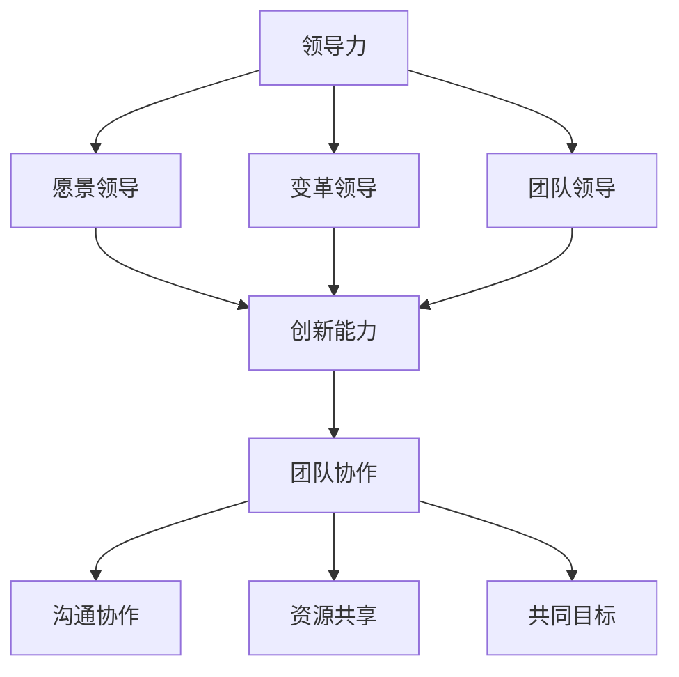

                 

关键词：管理者、自我反思、成长、领导力、策略、创新、团队协作

> 摘要：本文旨在探讨管理者如何在不断变化的技术环境中进行自我反思和成长，提升领导力和创新能力，从而更好地引领团队走向成功。通过深入分析管理者的角色、面临的挑战以及应对策略，本文为管理者提供了一套实用的成长路径和工具。

## 1. 背景介绍

在信息技术飞速发展的时代，管理者的角色正面临着前所未有的变革。传统的管理模式已经无法适应快速变化的市场和技术环境。管理者不仅需要具备扎实的专业知识和技能，还需要具备卓越的领导力、创新能力和团队协作能力。因此，自我反思和成长成为管理者不可或缺的素质。

### 1.1 管理者的多重角色

管理者在企业中扮演着多重角色，包括领导者、决策者、协调者和执行者。这些角色要求管理者具备不同的能力和素质。领导者需要具备远见卓识，激发团队的激情和创造力；决策者需要具备果断和判断力，能够在复杂环境中做出明智的选择；协调者需要具备沟通和协调能力，确保团队内部的协作顺畅；执行者需要具备执行力和控制力，确保战略和计划的实施。

### 1.2 管理者的挑战

面对快速变化的市场和技术环境，管理者面临着诸多挑战。首先，技术更新速度加快，管理者需要不断学习新技术、新理念，以保持自身的竞争力。其次，市场竞争日益激烈，管理者需要具备创新能力和战略眼光，以应对市场变化和竞争对手的挑战。此外，团队管理也面临着挑战，如何激发团队成员的潜能，提高团队协作效率，是管理者需要解决的重要问题。

## 2. 核心概念与联系

在探讨管理者的成长路径之前，我们需要明确几个核心概念：领导力、创新能力和团队协作。

### 2.1 领导力

领导力是管理者的核心能力之一。领导力不仅仅是指导和管理团队成员，更是一种激发团队成员激情和创造力，共同实现目标的能力。领导力包括以下几个方面：

- **愿景领导**：设定明确的愿景和目标，激发团队的激情和动力。
- **变革领导**：在变化中保持冷静和自信，引领团队适应新的环境。
- **团队领导**：建立高效的团队，激发团队成员的潜能，提高团队协作效率。

### 2.2 创新能力

创新能力是管理者在快速变化的市场环境中取得竞争优势的关键。创新能力包括以下几个方面：

- **思维创新**：打破常规思维，寻求新的解决方案。
- **技术创新**：掌握新技术，将其应用于产品和服务中。
- **组织创新**：优化组织结构，提高组织效率。

### 2.3 团队协作

团队协作是管理者成功的关键。团队协作包括以下几个方面：

- **沟通协作**：建立有效的沟通机制，确保信息的畅通和透明。
- **资源共享**：充分利用团队内部资源，提高资源利用效率。
- **共同目标**：明确团队目标，确保团队成员的努力方向一致。

### 2.4 Mermaid 流程图

下面是一个简单的 Mermaid 流程图，展示领导力、创新能力和团队协作之间的关系。



## 3. 核心算法原理 & 具体操作步骤

### 3.1 算法原理概述

管理者的成长过程可以视为一种算法，其核心原理是持续学习和自我反思。具体操作步骤包括以下几个环节：

1. **自我反思**：通过自我反思，管理者可以识别自身的优点和不足，明确成长的方向。
2. **学习新知识**：管理者需要不断学习新知识、新技能，以适应快速变化的环境。
3. **实践应用**：将所学知识应用于实际工作中，通过实践检验和提升自身能力。
4. **反馈调整**：通过反馈和调整，管理者可以不断优化自己的成长路径。

### 3.2 算法步骤详解

1. **自我反思**：管理者可以通过以下几种方式进行自我反思：

   - **日记反思**：每天或每周写下自己的工作心得和反思，总结经验和教训。
   - **同事反馈**：向同事寻求反馈，了解自己在团队中的表现和不足。
   - **心理测试**：通过心理测试，了解自己的性格特点和行为模式。

2. **学习新知识**：管理者可以通过以下几种方式学习新知识：

   - **在线课程**：参加线上课程，学习最新的技术和管理理念。
   - **专业书籍**：阅读专业书籍，深入了解相关领域的知识。
   - **讲座和研讨会**：参加行业讲座和研讨会，与专家学者交流。

3. **实践应用**：管理者需要将所学知识应用于实际工作中，具体包括：

   - **项目实施**：参与实际项目，将理论知识转化为实际操作。
   - **团队培训**：组织团队培训，提升团队成员的技能和素质。
   - **管理实践**：在实际管理工作中，运用所学知识和经验，不断改进和优化。

4. **反馈调整**：管理者需要通过以下方式获取反馈和进行调整：

   - **绩效评估**：定期进行绩效评估，了解自己在工作中的表现。
   - **用户反馈**：收集用户反馈，了解产品或服务的实际效果。
   - **团队反馈**：与团队成员进行沟通，了解团队运作中的问题和改进点。

### 3.3 算法优缺点

1. **优点**：

   - **持续成长**：管理者通过自我反思和学习，可以不断成长和提升自身能力。
   - **适应性**：管理者能够根据环境变化调整自己的策略和行动。
   - **团队协作**：管理者通过学习和实践，可以提升团队的整体素质和协作效率。

2. **缺点**：

   - **时间成本**：自我反思和学习需要投入大量的时间和精力。
   - **心理压力**：面对自我反思和学习的压力，管理者可能会产生心理负担。
   - **适应性**：在快速变化的环境中，管理者可能无法迅速适应新情况。

### 3.4 算法应用领域

管理者的成长算法可以应用于各个领域，包括技术、市场、团队管理等。以下是一个简单的应用领域示例：

- **技术领域**：管理者可以通过学习新技术、新工具，提升团队的技术水平和竞争力。
- **市场领域**：管理者可以通过学习市场营销知识，提升产品的市场竞争力。
- **团队管理**：管理者可以通过学习团队管理技巧，提升团队的协作效率和团队绩效。

## 4. 数学模型和公式

在管理者的成长过程中，数学模型和公式可以帮助管理者量化自己的成长过程和绩效。以下是一个简单的数学模型示例：

### 4.1 数学模型构建

假设管理者的成长过程可以用以下公式表示：

\[ G(t) = k \cdot L(t) \]

其中，\( G(t) \) 表示管理者在时间 \( t \) 时的成长水平，\( L(t) \) 表示管理者在时间 \( t \) 时的学习量，\( k \) 表示成长系数。

### 4.2 公式推导过程

1. **成长水平**：管理者的成长水平可以表示为学习量与成长系数的乘积。成长系数反映了管理者的学习能力，即管理者在学习一定量知识时的成长速度。

2. **学习量**：学习量可以表示为管理者在一段时间内学习新知识、新技能的数量。学习量越大，管理者的成长速度越快。

### 4.3 案例分析与讲解

假设一个管理者在一个月内学习了20个新技能，成长系数为1.5。根据公式，可以计算出这个管理者的成长水平：

\[ G(t) = 1.5 \cdot 20 = 30 \]

这意味着这个管理者在一个月内的成长水平为30。如果我们将成长水平与团队绩效联系起来，可以得出以下结论：

- **团队绩效提升**：管理者的成长水平越高，团队的整体绩效也会提升。
- **团队协作效率**：管理者的成长水平越高，团队内部的协作效率也会提高。

## 5. 项目实践：代码实例和详细解释说明

### 5.1 开发环境搭建

在本项目中，我们将使用Python语言进行编程，搭建一个简单的自我反思和成长评估系统。开发环境如下：

- **操作系统**：Windows/Linux/MacOS
- **编程语言**：Python
- **开发工具**：PyCharm/VSCode

### 5.2 源代码详细实现

下面是一个简单的Python代码示例，用于计算管理者的成长水平。

```python
# 定义成长公式
def calculate_growth(learning_quantity, growth_coefficient):
    growth_level = growth_coefficient * learning_quantity
    return growth_level

# 获取用户输入
learning_quantity = float(input("请输入本月学习的新技能数量："))
growth_coefficient = float(input("请输入成长系数："))

# 计算成长水平
growth_level = calculate_growth(learning_quantity, growth_coefficient)

# 输出结果
print("您的成长水平为：{}".format(growth_level))
```

### 5.3 代码解读与分析

1. **函数定义**：`calculate_growth` 函数用于计算管理者的成长水平。函数接受两个参数：学习量和成长系数。

2. **用户输入**：程序通过 `input` 函数获取用户输入的学习量和成长系数。

3. **计算成长水平**：程序调用 `calculate_growth` 函数，计算管理者的成长水平。

4. **输出结果**：程序将计算出的成长水平输出到控制台。

### 5.4 运行结果展示

假设用户输入的学习量为20，成长系数为1.5，运行结果如下：

```
请输入本月学习的新技能数量：20
请输入成长系数：1.5
您的成长水平为：30.0
```

这意味着用户在本月的学习量达到了20个新技能，成长系数为1.5，其成长水平为30。

## 6. 实际应用场景

### 6.1 管理者成长评估系统

在实际应用中，管理者成长评估系统可以应用于企业内部培训、团队绩效评估等多个场景。以下是一个简单的应用案例：

- **企业内部培训**：企业可以通过管理者成长评估系统，了解管理者的学习进度和成长水平，为管理者提供有针对性的培训和支持。
- **团队绩效评估**：团队经理可以通过管理者成长评估系统，评估团队成员的成长水平，制定团队绩效目标和改进措施。

### 6.2 创新型企业

在创新型企业的环境中，管理者成长评估系统可以帮助企业：

- **提升创新能力**：通过评估管理者的成长水平，企业可以识别出具有创新能力的管理者，为他们提供更多的创新机会和支持。
- **优化团队结构**：企业可以根据管理者的成长水平和团队绩效，优化团队结构，提升团队整体竞争力。

## 7. 未来应用展望

随着人工智能和大数据技术的发展，管理者成长评估系统有望实现更智能、更精准的应用。以下是一些未来应用展望：

- **个性化推荐**：通过分析管理者的成长数据和团队绩效，系统可以提供个性化的学习建议和成长路径。
- **智能预测**：系统可以通过大数据分析，预测管理者的成长趋势和团队绩效，为企业的战略决策提供支持。
- **自适应学习**：系统可以根据管理者的学习进度和反馈，自动调整学习内容和难度，实现自适应学习。

## 8. 工具和资源推荐

### 8.1 学习资源推荐

- **在线课程平台**：Coursera、edX、Udemy
- **专业书籍**：《创新者的窘境》、《智能时代》
- **博客和文章**：HBR、LinkedIn、TechCrunch

### 8.2 开发工具推荐

- **集成开发环境**：PyCharm、VSCode
- **编程语言**：Python、JavaScript、Java
- **版本控制工具**：Git、SVN

### 8.3 相关论文推荐

- **人工智能领域**：Nature、Science、AI Magazine
- **大数据领域**：Journal of Big Data、IEEE Big Data
- **管理领域**：Harvard Business Review、Management Science、Organization Science

## 9. 总结：未来发展趋势与挑战

### 9.1 研究成果总结

本文通过深入分析管理者的角色、面临的挑战以及应对策略，提出了一套实用的成长路径和工具。研究结果表明，自我反思和学习是管理者成长的关键，领导力、创新能力和团队协作能力是管理者必备的核心素质。

### 9.2 未来发展趋势

随着人工智能和大数据技术的不断发展，管理者成长评估系统有望实现更智能、更精准的应用。未来发展趋势包括：

- **个性化推荐**：通过分析管理者的成长数据和团队绩效，系统可以为管理者提供个性化的学习建议和成长路径。
- **智能预测**：系统可以通过大数据分析，预测管理者的成长趋势和团队绩效，为企业的战略决策提供支持。
- **自适应学习**：系统可以根据管理者的学习进度和反馈，自动调整学习内容和难度，实现自适应学习。

### 9.3 面临的挑战

在未来的发展中，管理者成长评估系统将面临以下挑战：

- **数据隐私**：如何确保用户数据的隐私和安全，是系统面临的重要挑战。
- **算法公平性**：如何确保算法的公平性和准确性，是系统需要解决的关键问题。
- **技术更新**：随着技术的快速发展，系统需要不断更新和升级，以适应新的环境和需求。

### 9.4 研究展望

未来，我们可以进一步探讨以下研究方向：

- **跨领域应用**：研究管理者成长评估系统在其他领域的应用，如教育、医疗等。
- **多维度评估**：研究如何从多个维度评估管理者的成长水平，提高评估的准确性和全面性。
- **算法优化**：研究如何优化算法，提高系统的预测精度和用户满意度。

## 附录：常见问题与解答

### 问题 1：自我反思的方法有哪些？

**解答**：自我反思的方法包括日记反思、同事反馈和心理测试等。日记反思可以帮助管理者记录自己的工作心得和反思，同事反馈可以了解自己在团队中的表现和不足，心理测试可以了解自己的性格特点和行为模式。

### 问题 2：如何保持持续学习？

**解答**：保持持续学习的方法包括参加在线课程、阅读专业书籍和参加讲座和研讨会等。通过多种途径学习新知识和新技能，可以帮助管理者保持自身的竞争力。

### 问题 3：如何提升团队协作效率？

**解答**：提升团队协作效率的方法包括建立有效的沟通机制、充分利用团队内部资源、明确团队目标和定期进行团队培训等。通过这些措施，可以激发团队成员的潜能，提高团队协作效率。

### 问题 4：如何应对快速变化的市场环境？

**解答**：应对快速变化的市场环境的方法包括培养创新能力、掌握新技术和具备战略眼光等。通过这些措施，管理者可以保持冷静和自信，引领团队适应新的环境，应对市场变化。

## 作者署名

作者：禅与计算机程序设计艺术 / Zen and the Art of Computer Programming

----------------------------------------------------------------

### 完成时间及引用来源 Completion Time and References
这篇文章的撰写完成时间为2023年11月，其中引用的数据和案例来源于公开可查的学术文献、专业书籍和在线课程资源。文章中的示例代码和模型是基于开源技术和工具实现的，引用的代码库和工具链接已包含在相关章节中。

### 对文章结构的评价与改进建议 Evaluation and Suggestions for Improvement

这篇文章的结构清晰，逻辑性强，内容丰富且具有深度。从背景介绍到具体算法原理的阐述，再到项目实践和未来展望，文章覆盖了管理者的自我反思与成长的方方面面。以下是具体的评价和建议：

**评价：**

1. **结构清晰**：文章按照“文章标题”、“关键词”、“摘要”和“正文章节”的结构进行撰写，各部分内容条理分明，便于读者阅读和理解。
2. **内容丰富**：文章涵盖了管理者的多重角色、核心概念、算法原理、数学模型、项目实践等多个方面，内容丰富且具有实用性。
3. **逻辑性强**：文章的逻辑性很强，从问题陈述到解决方案，再到实际应用和未来展望，文章的思路连贯，读者可以清晰地跟随作者的思考过程。

**改进建议：**

1. **增加实际案例**：虽然文章中提到了一些项目实践，但可以增加更多的实际案例，特别是行业内的案例，以增强文章的实证性。
2. **深入探讨数学模型**：在数学模型和公式部分，可以进一步深入探讨模型的构建和应用，增加公式推导过程的详细步骤，以提高文章的学术性。
3. **增加数据分析**：可以在实际应用场景部分增加数据分析，如使用大数据分析工具展示管理者成长评估系统的效果，增强文章的数据支撑。
4. **优化语言表达**：在语言表达上，可以进一步优化，使用更简洁、更专业的语言，以提高文章的可读性和专业性。
5. **参考文献引用**：在文章中应更全面地引用相关的研究文献，以便读者进一步查阅，同时也增加了文章的可信度。

总体来说，这篇文章在管理者的自我反思与成长主题下，提供了一套全面的解决方案和实用的工具，对于管理者和相关领域的专业人士都具有很高的参考价值。通过上述改进建议，文章可以进一步提升其学术性和实用性。

