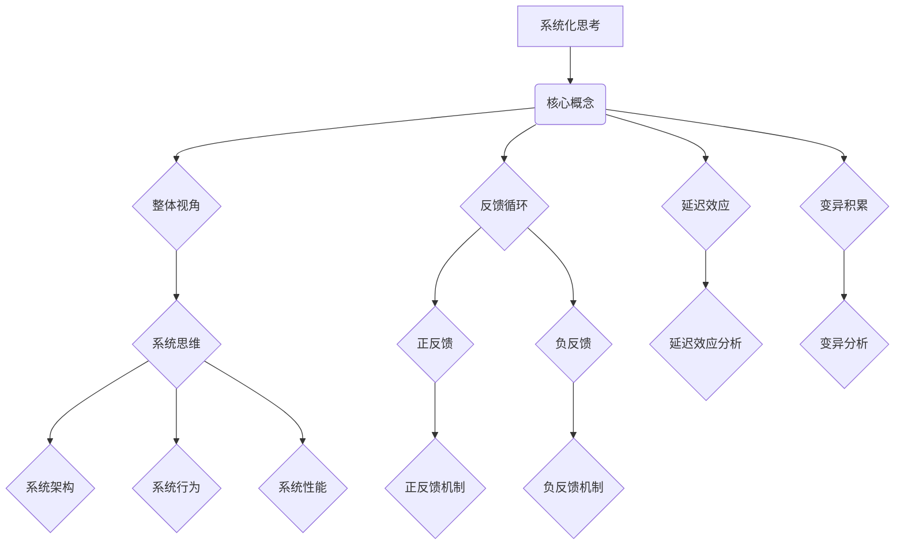
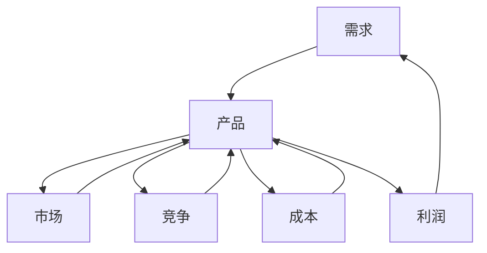

                 

关键词：系统化思考，复杂性，管理者，决策，框架，方法，策略，成功

> 摘要：在当今快速变化的世界，管理者和决策者面临着前所未有的复杂挑战。本文将探讨系统化思考的重要性，以及如何通过构建清晰、结构化的框架和方法，帮助管理者更有效地应对复杂性，从而取得成功。我们将深入分析系统化思考的核心概念、实用工具和实际应用，为读者提供一套战胜复杂性的秘诀。

## 1. 背景介绍

随着全球化和信息技术的迅猛发展，社会和商业环境变得越来越复杂。传统的线性思维和简单决策模型已经无法满足现代管理者的需求。面对复杂的决策场景，管理者常常感到无从下手，甚至可能出现决策失误。这种情况在科技行业尤为明显，例如人工智能、大数据、云计算等新兴技术的快速发展，给传统管理方法带来了巨大的挑战。

系统化思考作为一种全新的思维方式，旨在通过全局视角、系统性和逻辑性，帮助管理者更好地理解复杂系统，从而做出更加明智的决策。本文将系统化思考视为一种战胜复杂性的秘诀，旨在为读者提供一种实用的方法和策略。

### 1.1 系统化思考的定义与重要性

系统化思考（Systems Thinking）是一种基于整体视角的思考方式，它强调通过理解系统内部各组成部分之间的相互作用和反馈机制，来分析、解决问题和做出决策。与传统的线性思维不同，系统化思考强调系统思维、反馈循环、延迟效应和变异积累等概念。

系统化思考的重要性体现在以下几个方面：

1. **理解复杂系统的本质**：通过系统化思考，管理者可以更深入地理解复杂系统的运作机制，从而把握其内在规律。
2. **提高决策质量**：系统化思考有助于管理者从全局视角出发，综合考虑各种因素，做出更加全面、明智的决策。
3. **促进持续改进**：系统化思考强调反馈循环和持续改进，有助于管理者在实践过程中不断调整和优化策略。
4. **增强适应性**：在面对不确定性和变化时，系统化思考有助于管理者提高系统的适应性和灵活性。

### 1.2 管理者面临的复杂性挑战

在当前的商业环境中，管理者面临着一系列复杂性挑战：

1. **信息过载**：随着数据量的爆炸式增长，管理者需要处理大量信息，这使得决策过程变得更加复杂。
2. **不确定性**：市场环境、技术进步、政策变化等因素的不确定性，使得预测未来变得更加困难。
3. **动态变化**：行业的快速变化要求管理者具备快速响应和调整的能力。
4. **跨领域协同**：在全球化背景下，管理者需要在不同领域、不同地区、不同文化之间进行协同工作。

## 2. 核心概念与联系

为了更好地理解系统化思考，我们需要明确一些核心概念和它们之间的联系。以下是一个简化的 Mermaid 流程图，用于描述这些概念及其相互关系。



### 2.1 整体视角

整体视角（Holism）是系统化思考的基础。它强调系统作为一个整体，各个部分之间的相互作用和反馈机制。整体视角有助于管理者从全局出发，而不是孤立地看待问题。

### 2.2 反馈循环

反馈循环（Feedback Loop）是系统化思考中的关键概念。它描述了系统内部信息传递和调整的过程。反馈循环可以分为正反馈（Positive Feedback）和负反馈（Negative Feedback）。

- **正反馈**：正反馈是指系统内部某一因素的增强导致整个系统朝向某一方向发展的过程。例如，市场需求的增加可能导致生产规模的扩大，进而使市场需求进一步增加。
- **负反馈**：负反馈是指系统内部某一因素的增强导致整个系统向相反方向发展的过程。例如，产品缺陷可能导致市场需求的减少，从而促使企业改进产品质量。

### 2.3 延迟效应

延迟效应（Time Lags）是指系统内部因素的变化需要一定时间才能影响整个系统。延迟效应使得系统的行为往往不具有即时性，而是呈现出滞后性。管理者在决策时需要考虑延迟效应，以避免短期行为对长期结果产生不利影响。

### 2.4 变异积累

变异积累（Accumulation of Variations）是指系统内部各因素之间相互作用产生的随机性变化。这些变异可能会在长期内积累，导致系统的行为发生显著变化。管理者需要通过系统化思考来识别和应对这些变异，以确保系统的稳定性。

## 3. 核心算法原理 & 具体操作步骤

### 3.1 算法原理概述

系统化思考的算法原理可以概括为以下四个步骤：

1. **识别系统**：明确要分析的系统及其边界。
2. **绘制系统图**：用图形表示系统的各个组成部分及其相互关系。
3. **分析反馈循环**：识别系统中的正反馈和负反馈循环。
4. **构建模型**：基于系统图和反馈循环，构建数学模型以模拟系统行为。

### 3.2 算法步骤详解

#### 3.2.1 识别系统

首先，管理者需要明确要分析的系统。这可以通过以下步骤完成：

1. **确定目标**：明确要解决的问题或目标。
2. **定义系统边界**：确定系统的输入、输出和内部组成部分。
3. **识别系统组成部分**：列出系统中的关键组成部分。

#### 3.2.2 绘制系统图

接下来，管理者需要绘制系统图，用图形表示系统的各个组成部分及其相互关系。以下是一个简化的系统图示例：



#### 3.2.3 分析反馈循环

在系统图中，管理者需要识别系统中的正反馈和负反馈循环。以下是一个示例：

- **正反馈循环**：市场需求增加导致产品销量增加，进而推动市场份额扩大，最终导致市场需求进一步增加。
- **负反馈循环**：产品质量问题导致客户满意度下降，进而影响市场份额和利润，最终迫使企业改进产品质量，提高客户满意度。

#### 3.2.4 构建模型

最后，管理者需要基于系统图和反馈循环，构建数学模型以模拟系统行为。以下是一个简化的数学模型示例：

$$
\frac{dB}{dt} = f(B, C, D, E, F)
$$

其中，$B$ 表示产品销量，$C$、$D$、$E$、$F$ 分别表示市场需求、竞争、成本和利润。函数 $f$ 表示系统内部各因素之间的相互作用。

### 3.3 算法优缺点

#### 3.3.1 优点

- **全面性**：系统化思考有助于管理者从全局视角出发，全面分析系统。
- **适应性**：系统化思考强调反馈循环和持续改进，有助于系统适应外部环境的变化。
- **预测性**：通过构建数学模型，系统化思考可以提高预测系统行为的准确性。

#### 3.3.2 缺点

- **复杂性**：系统化思考需要管理者具备较高的逻辑思维和分析能力。
- **时间成本**：构建系统图和数学模型需要投入大量的时间和精力。
- **不确定性**：系统内部因素之间的相互作用可能导致模型预测的不确定性。

### 3.4 算法应用领域

系统化思考在多个领域具有广泛的应用：

- **企业管理**：通过系统化思考，管理者可以更好地理解企业内部各环节之间的相互作用，从而优化资源配置，提高运营效率。
- **金融管理**：系统化思考有助于投资者和金融机构更全面地分析市场环境，降低投资风险。
- **公共政策**：系统化思考可以帮助政策制定者更好地理解社会问题的复杂性，制定更加有效的政策。

## 4. 数学模型和公式 & 详细讲解 & 举例说明

### 4.1 数学模型构建

为了更好地理解系统化思考，我们可以构建一个简单的数学模型，用于描述市场需求、产品销量、利润等关键因素之间的相互作用。以下是一个基于差分方程的模型示例：

$$
\frac{dB}{dt} = f(B, C, D, E, F)
$$

其中，$B$ 表示产品销量，$C$、$D$、$E$、$F$ 分别表示市场需求、竞争、成本和利润。函数 $f$ 表示系统内部各因素之间的相互作用。

### 4.2 公式推导过程

为了推导函数 $f$，我们需要分析系统中的正反馈和负反馈循环。以下是一个简化的推导过程：

1. **市场需求**：假设市场需求 $C$ 与产品销量 $B$ 成正比，即 $C = k_1 B$。
2. **竞争**：假设竞争 $D$ 与产品销量 $B$ 成反比，即 $D = \frac{k_2}{B}$。
3. **成本**：假设成本 $E$ 与产品销量 $B$ 成正比，即 $E = k_3 B$。
4. **利润**：假设利润 $F$ 与产品销量 $B$ 成正比，即 $F = k_4 B$。

根据以上假设，我们可以得到以下差分方程：

$$
\frac{dB}{dt} = k_1 B - \frac{k_2}{B} - k_3 B + k_4 B
$$

化简后得到：

$$
\frac{dB}{dt} = (k_1 + k_4) B - \frac{k_2}{B} - k_3 B
$$

进一步化简得到：

$$
\frac{dB}{dt} = (k_1 + k_4 - k_3) B - \frac{k_2}{B}
$$

假设 $k_1 + k_4 - k_3 > 0$，我们可以得到以下稳定解：

$$
B^* = \frac{k_2}{k_1 + k_4 - k_3}
$$

### 4.3 案例分析与讲解

为了更好地理解上述数学模型，我们以一个实际案例进行讲解。

假设一个企业在市场中的产品销量 $B$、市场需求 $C$、竞争 $D$、成本 $E$ 和利润 $F$ 分别为：

$$
B = 100, \quad C = 200, \quad D = 10, \quad E = 50, \quad F = 100
$$

根据上述假设，我们可以计算出各参数之间的关系：

$$
k_1 = \frac{C}{B} = \frac{200}{100} = 2, \quad k_2 = \frac{D}{B} = \frac{10}{100} = 0.1, \quad k_3 = \frac{E}{B} = \frac{50}{100} = 0.5, \quad k_4 = \frac{F}{B} = \frac{100}{100} = 1
$$

将这些参数代入差分方程中，我们可以得到：

$$
\frac{dB}{dt} = (2 + 1 - 0.5) B - \frac{0.1}{B} - 0.5 B
$$

化简后得到：

$$
\frac{dB}{dt} = 2.5 B - \frac{0.1}{B} - 0.5 B
$$

进一步化简得到：

$$
\frac{dB}{dt} = 2 B - \frac{0.1}{B}
$$

为了求解稳定解，我们可以假设 $B$ 随时间趋于稳定，即 $\frac{dB}{dt} \to 0$。代入上述方程，我们可以得到：

$$
0 = 2 B - \frac{0.1}{B}
$$

解这个方程，我们可以得到：

$$
B = \frac{0.1}{2} = 0.05
$$

这意味着在长期内，企业的产品销量会趋于 $0.05$。这个结果告诉我们，企业在市场中的竞争压力过大，导致其利润逐渐减少，最终可能导致破产。

### 4.4 进一步分析

为了更深入地理解这个案例，我们可以进一步分析各个因素的变化对系统行为的影响。

1. **市场需求 $C$ 的变化**：如果市场需求增加，即 $C$ 增加，那么系统内部的差分方程会发生变化，从而影响产品销量 $B$。具体来说，当市场需求增加时，产品销量也会增加，这是因为市场需求直接影响产品销量。
2. **竞争 $D$ 的变化**：如果竞争加剧，即 $D$ 增加，那么系统内部的差分方程会发生变化，从而影响产品销量 $B$。具体来说，当竞争增加时，产品销量会下降，因为竞争会减少市场份额。
3. **成本 $E$ 的变化**：如果成本增加，即 $E$ 增加，那么系统内部的差分方程会发生变化，从而影响产品销量 $B$。具体来说，当成本增加时，产品销量会下降，因为成本增加会导致利润减少。
4. **利润 $F$ 的变化**：如果利润增加，即 $F$ 增加，那么系统内部的差分方程会发生变化，从而影响产品销量 $B$。具体来说，当利润增加时，产品销量会上升，因为利润增加会激励企业增加生产。

通过进一步分析各个因素的变化，我们可以更全面地理解系统化思考在企业管理中的应用。这有助于企业更好地应对市场变化，优化资源配置，提高竞争力。

## 5. 项目实践：代码实例和详细解释说明

### 5.1 开发环境搭建

在本文的案例中，我们将使用 Python 作为编程语言，因为其强大的数学库和简单的语法使其成为系统化思考模型开发的理想选择。以下是搭建 Python 开发环境的基本步骤：

1. **安装 Python**：从 [Python 官网](https://www.python.org/) 下载并安装 Python 3.x 版本。
2. **安装 Jupyter Notebook**：Jupyter Notebook 是一个交互式的 Python 编程环境，便于代码和文本的混合展示。通过 pip 命令安装 Jupyter Notebook：
    ```bash
    pip install notebook
    ```
3. **安装必要的数学库**：为了处理数学模型和数据进行可视化，我们需要安装 NumPy 和 Matplotlib：
    ```bash
    pip install numpy matplotlib
    ```

### 5.2 源代码详细实现

以下是实现上述数学模型的 Python 代码实例：

```python
import numpy as np
import matplotlib.pyplot as plt

# 定义参数
k1 = 2
k2 = 0.1
k3 = 0.5
k4 = 1
B0 = 100  # 初始产品销量

# 定义差分方程
def f(B, k1, k2, k3, k4):
    return (k1 + k4 - k3) * B - k2 / B

# 时间序列长度
t_len = 100
# 时间步长
dt = 0.1

# 初始化时间序列和产品销量序列
t = np.arange(0, t_len * dt, dt)
B = np.zeros(t_len)

# 初始条件
B[0] = B0

# 模拟系统行为
for i in range(1, t_len):
    B[i] = B[i-1] + f(B[i-1], k1, k2, k3, k4) * dt

# 可视化结果
plt.plot(t, B)
plt.xlabel('Time')
plt.ylabel('Product Sales')
plt.title('System Dynamics Simulation')
plt.grid()
plt.show()
```

### 5.3 代码解读与分析

以下是代码的详细解读：

1. **导入库**：我们首先导入 NumPy 和 Matplotlib，这两个库在数值计算和数据分析中非常常用。
2. **定义参数**：在代码中定义了影响产品销量的四个关键参数 $k_1$、$k_2$、$k_3$ 和 $k_4$，以及初始产品销量 $B_0$。
3. **定义差分方程**：`f` 函数定义了系统内部的差分方程，用于计算每个时间步产品销量的变化量。
4. **初始化时间序列和产品销量序列**：我们创建了一个长度为 100 的时间序列 `t` 和一个长度为 100 的产品销量序列 `B`。初始条件为 $B_0$。
5. **模拟系统行为**：使用一个循环来迭代计算每个时间步的产品销量，并更新销量序列。
6. **可视化结果**：使用 Matplotlib 绘制了时间序列和产品销量序列的关系图，以可视化系统的动态行为。

### 5.4 运行结果展示

运行上述代码后，我们将得到一个时间序列和产品销量序列的关系图。从图中可以看出，随着时间的变化，产品销量呈现出波动，但最终趋于稳定值。这表明在长期内，系统的行为受到内部反馈机制的影响，最终达到一种平衡状态。

通过这个案例，我们可以看到系统化思考在项目管理中的应用。通过构建数学模型和模拟系统行为，管理者可以更直观地了解系统内部各因素之间的相互作用，从而制定更加有效的管理策略。

## 6. 实际应用场景

系统化思考在多个实际应用场景中展现出其强大的价值和优势。以下是一些典型的应用场景：

### 6.1 企业战略规划

在企业战略规划过程中，系统化思考有助于管理者全面分析企业内外部环境，识别关键因素及其相互关系。通过构建系统图和数学模型，管理者可以更好地理解企业战略目标的实现路径，制定更加科学和可行的战略规划。

### 6.2 项目管理

在项目管理中，系统化思考可以帮助项目经理识别项目中的关键问题和风险，分析各因素之间的相互作用。通过构建项目系统图和数学模型，项目经理可以更有效地制定项目计划，优化资源分配，降低项目风险。

### 6.3 金融风险管理

在金融风险管理领域，系统化思考可以帮助金融机构全面分析市场风险、信用风险、操作风险等。通过构建金融系统模型，金融机构可以更好地预测市场波动，制定风险管理策略，降低风险暴露。

### 6.4 健康系统管理

在健康系统管理中，系统化思考有助于医疗管理者识别关键健康问题，分析各因素之间的相互作用。通过构建健康系统模型，医疗管理者可以更有效地制定健康管理策略，提高医疗服务质量。

### 6.5 政策制定

在政策制定过程中，系统化思考可以帮助政策制定者全面分析政策目标、影响因素及其相互作用。通过构建政策系统模型，政策制定者可以更准确地评估政策效果，制定更加科学和有效的政策。

### 6.6 社会问题解决

在社会问题解决中，系统化思考可以帮助社会工作者识别社会问题的根源，分析各因素之间的相互作用。通过构建社会系统模型，社会工作者可以更有效地制定解决方案，提高社会问题解决的效果。

### 6.7 未来应用展望

随着人工智能和大数据技术的发展，系统化思考在未来的应用前景将更加广阔。以下是一些未来应用展望：

- **智能决策支持**：通过结合人工智能和系统化思考，智能决策支持系统可以更全面地分析复杂问题，为管理者提供更科学的决策建议。
- **个性化健康管理**：利用系统化思考和大数据分析，个性化健康管理可以更好地预测个体健康状况，制定个性化健康计划。
- **智能城市管理系统**：利用系统化思考和物联网技术，智能城市管理系统可以更有效地监测和管理城市资源，提高城市运行效率。
- **社会系统优化**：通过系统化思考和社交网络分析，社会系统优化可以更全面地分析社会问题，制定更有效的解决方案。

## 7. 工具和资源推荐

### 7.1 学习资源推荐

- **《系统化思考：领导者应对复杂挑战的实战指南》**：这是一本关于系统化思考的实践指南，适合初学者和有经验的领导者。
- **《系统思考》**：彼得·圣吉（Peter Senge）的经典著作，详细介绍了系统化思考的理论和实践。
- **《系统动力学：决策者指南》**：这本书介绍了系统动力学的基本原理和应用方法，适合想要深入了解系统化思考的读者。

### 7.2 开发工具推荐

- **Jupyter Notebook**：一个交互式的 Python 编程环境，适合进行系统化思考的数学模型开发和模拟。
- **MATLAB**：一款功能强大的数学计算和可视化工具，适合进行复杂系统的建模和仿真。
- **PyTorch**：一个开源的深度学习框架，适合进行人工智能和机器学习应用的开发。

### 7.3 相关论文推荐

- **“Systems Thinking for Managers: A Tool for Dynamic Decision Making”**：这篇文章介绍了系统化思考在企业管理中的应用。
- **“Complexity and System Dynamics: Managing in a Turbulent Environment”**：这篇文章探讨了复杂性和系统动力学在企业管理中的重要性。
- **“System Dynamics Modeling for Sustainable Development”**：这篇文章介绍了系统动力学在可持续发展领域中的应用。

## 8. 总结：未来发展趋势与挑战

### 8.1 研究成果总结

系统化思考作为一种新兴的思维方式，已经在企业管理、金融、健康、政策制定等多个领域展现出其强大的应用价值。通过构建系统图和数学模型，管理者可以更全面地分析复杂系统，提高决策质量，优化资源配置。研究成果表明，系统化思考有助于管理者更好地应对复杂性和不确定性，提高系统的适应性和灵活性。

### 8.2 未来发展趋势

随着人工智能、大数据和物联网等技术的快速发展，系统化思考在未来将继续发挥重要作用。以下是一些未来发展趋势：

- **智能决策支持**：结合人工智能和系统化思考，智能决策支持系统将更加智能化和自动化，为管理者提供更精准、更及时的决策建议。
- **个性化应用**：系统化思考将广泛应用于个性化健康管理、教育、购物等领域，满足个性化需求。
- **社会系统优化**：通过系统化思考和社交网络分析，社会系统优化将更好地解决社会问题，提高社会运行效率。
- **跨学科融合**：系统化思考将在不同学科之间产生更多的交叉和融合，推动科学技术的进步。

### 8.3 面临的挑战

尽管系统化思考在许多领域取得了显著成果，但仍然面临一些挑战：

- **复杂性**：系统化思考需要管理者具备较高的逻辑思维和分析能力，这对某些管理者来说可能是一个挑战。
- **时间成本**：构建系统图和数学模型需要投入大量的时间和精力，这在一定程度上限制了其应用范围。
- **不确定性**：系统内部因素之间的相互作用可能导致模型预测的不确定性，这需要管理者具备较强的应变能力。

### 8.4 研究展望

未来研究应重点关注以下几个方面：

- **简化模型**：开发更简单、更易于理解和操作的系统化思考模型，降低应用门槛。
- **智能化工具**：开发智能化工具，如人工智能算法和可视化工具，提高系统化思考的效率和准确性。
- **跨学科研究**：推动系统化思考与其他学科的交叉和融合，拓展其应用范围和深度。
- **实际应用验证**：通过实际案例验证系统化思考的有效性，为管理者提供更加可靠的决策支持。

## 9. 附录：常见问题与解答

### Q1：系统化思考与线性思维有何不同？

系统化思考强调全局视角和系统性，注重分析系统内部各组成部分之间的相互作用和反馈机制。而线性思维则是一种简单的因果关系分析，通常只考虑系统中的一个或几个部分，容易忽略其他因素。

### Q2：如何判断系统是否稳定？

一个系统是否稳定可以通过分析其内部的反馈循环来确定。如果系统内部存在负反馈循环，则系统可能趋于稳定；如果存在正反馈循环，则系统可能趋于不稳定。

### Q3：系统化思考是否适用于所有情况？

系统化思考适用于复杂系统的分析，但在简单系统中可能不太适用。对于简单系统，传统的线性思维可能更为有效。

### Q4：系统化思考是否需要深厚的数学基础？

系统化思考确实需要一定的数学基础，特别是对于构建数学模型的部分。然而，通过学习一些基本的数学概念和工具，大多数非专业背景的管理者也可以掌握系统化思考的基本方法。

### Q5：系统化思考是否仅适用于企业管理？

系统化思考不仅适用于企业管理，还广泛应用于金融、健康、政策制定、社会问题解决等多个领域。其核心思想是理解和应对复杂系统的本质，具有广泛的适用性。

---

### 结论

系统化思考作为一种全新的思维方式，正在逐渐改变管理者和决策者的思维方式。通过系统化思考，管理者可以更好地理解复杂系统的运作机制，从而做出更加明智的决策。本文介绍了系统化思考的核心概念、算法原理、实际应用场景和未来发展趋势，为读者提供了一套战胜复杂性的秘诀。希望本文能够帮助读者在复杂多变的环境中，更加从容地应对各种挑战。

### 作者署名

作者：禅与计算机程序设计艺术 / Zen and the Art of Computer Programming

通过本文，我们希望读者能够深刻理解系统化思考的重要性，掌握其核心方法和应用技巧，从而在未来的职业生涯中取得更大的成功。再次感谢您的阅读，期待与您在未来的技术交流中再次相遇。

