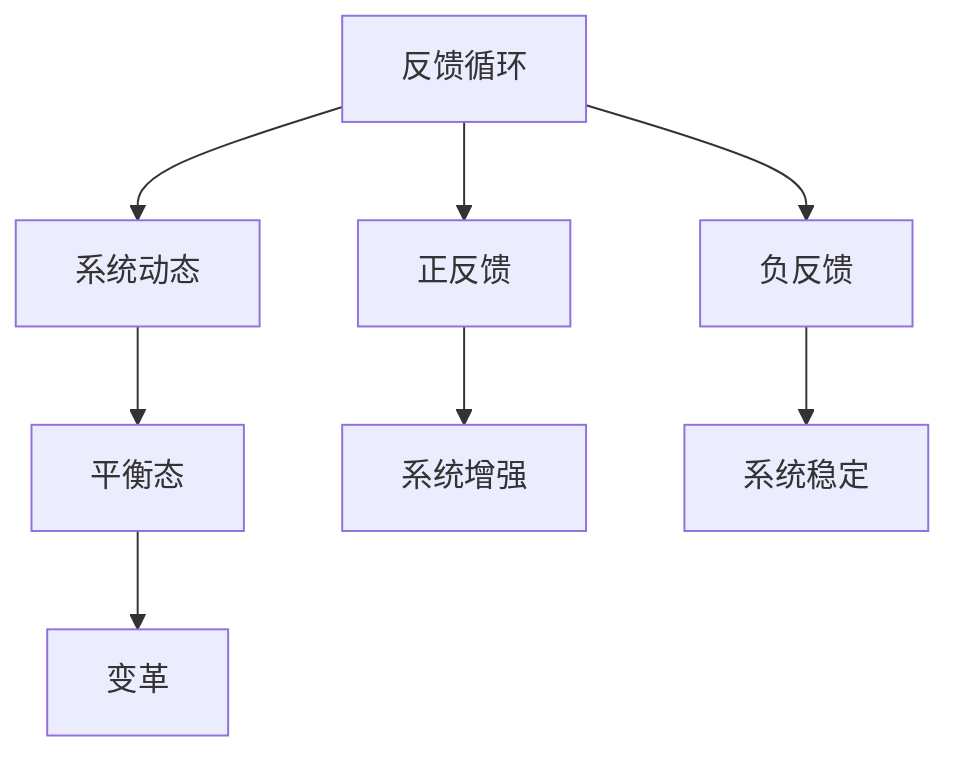

                 

系统思考是现代技术领域中一个至关重要的概念，它为复杂系统的分析和设计提供了强大的工具。本文将深入探讨系统思考的核心概念、原理及其在IT领域的应用，旨在为读者提供一种化繁为简的思考方法和实践指南。本文的关键词包括系统思考、复杂性、IT领域、设计和分析。

## 摘要

本文首先介绍了系统思考的背景和重要性，然后深入探讨了系统思考的核心概念和联系，接着详细解析了核心算法原理和具体操作步骤。随后，我们探讨了数学模型和公式的构建、推导及其实际应用。文章还通过一个具体的代码实例，展示了系统思考在项目实践中的应用。最后，我们分析了系统思考在实际应用场景中的效果，展望了未来的发展趋势和面临的挑战。

## 1. 背景介绍

系统思考（Systems Thinking）起源于20世纪中叶，它是一种理解复杂系统的思维方式。随着计算机科学、网络技术、人工智能等领域的快速发展，复杂系统成为研究和实践中的常态。这些系统往往涉及众多相互关联的组成部分，彼此之间的交互作用使得系统的行为变得难以预测和控制。因此，系统思考成为了解决这些复杂问题的重要工具。

系统思考的重要性体现在多个方面。首先，它帮助我们理解系统内部各组成部分之间的关系，从而更好地设计和管理复杂系统。其次，它促使我们关注系统的长期行为，而不是短期的、局部的优化。最后，系统思考提供了一种全局的、动态的视角，使我们能够更好地应对不确定性和变化。

在IT领域，系统思考的应用无处不在。从软件架构设计到项目管理，从系统优化到业务流程重组，系统思考都发挥着关键作用。它帮助IT专业人士更好地理解系统的复杂性，从而设计出更高效、更可靠的解决方案。

## 2. 核心概念与联系

系统思考的核心概念包括反馈循环、系统动态、平衡态和变革等。

### 2.1 反馈循环

反馈循环是系统思考中最基本的概念之一。它描述了系统内部信息流和物质流的循环过程。反馈循环可以分为正反馈和负反馈两种类型。正反馈会导致系统状态的增强，而负反馈则趋向于稳定系统。

### 2.2 系统动态

系统动态指的是系统随时间变化的行为模式。系统动态可以通过状态空间模型来描述，其中包括状态变量、状态转移矩阵和系统方程等。

### 2.3 平衡态

平衡态是指系统在长时间内保持不变的状态。平衡态可以是稳定的，也可以是不稳定的。稳定的平衡态意味着系统在受到扰动后能够返回原状，而不稳定的平衡态则会导致系统远离原状。

### 2.4 变革

变革是指系统在受到外部或内部冲击后发生的显著变化。系统思考关注变革的机制和过程，以及如何引导系统向期望状态转变。

### 2.5 Mermaid 流程图

为了更直观地理解这些核心概念，我们可以使用Mermaid流程图来展示它们之间的联系。



## 3. 核心算法原理 & 具体操作步骤

### 3.1 算法原理概述

系统思考中的核心算法原理主要涉及系统建模、模拟和优化。这些算法可以帮助我们理解和预测复杂系统的行为。

### 3.2 算法步骤详解

#### 3.2.1 系统建模

系统建模是算法的第一步，它包括以下步骤：

1. **定义系统边界**：确定系统所包含的组成部分和外部环境。
2. **确定状态变量**：选择能够描述系统状态的变量。
3. **建立系统方程**：根据状态变量之间的关系，建立系统方程。

#### 3.2.2 系统模拟

系统模拟是对系统模型进行数值计算，以观察系统随时间的变化。主要步骤包括：

1. **初始化状态变量**：设定初始条件。
2. **迭代计算**：根据系统方程，不断更新状态变量。
3. **可视化结果**：使用图表和动画，展示系统动态行为。

#### 3.2.3 系统优化

系统优化是指通过调整系统参数，以实现特定目标。主要步骤包括：

1. **确定优化目标**：设定系统优化的目标函数。
2. **选择优化算法**：如梯度下降、遗传算法等。
3. **执行优化过程**：通过迭代，不断调整参数，直到达到优化目标。

### 3.3 算法优缺点

系统建模和优化的算法具有以下优点：

- **全面性**：能够全面描述系统的行为和状态。
- **动态性**：能够模拟系统的动态变化。
- **灵活性**：可以根据不同的目标函数和优化算法进行调整。

然而，这些算法也存在一定的缺点：

- **复杂性**：系统建模和优化过程通常较为复杂，需要较高的技术水平。
- **计算成本**：模拟和优化的过程往往需要大量的计算资源。

### 3.4 算法应用领域

系统建模和优化的算法广泛应用于各个领域，包括：

- **软件工程**：用于系统架构设计、性能优化和安全性分析。
- **物联网**：用于网络优化、设备管理和数据分析。
- **金融工程**：用于市场分析、风险评估和投资组合优化。
- **环境科学**：用于气候变化模拟、资源管理和生态保护。

## 4. 数学模型和公式 & 详细讲解 & 举例说明

### 4.1 数学模型构建

在系统思考中，数学模型是描述系统行为的有力工具。一个基本的数学模型通常包括以下部分：

1. **状态变量**：用于描述系统状态的变量。
2. **输入变量**：外部输入对系统状态的影响。
3. **输出变量**：系统状态对外部输出的影响。
4. **状态转移方程**：描述状态变量随时间变化的方程。

一个简单的数学模型可以表示为：

\[ \frac{dX}{dt} = f(X, U) \]

其中，\( X \) 是状态变量，\( U \) 是输入变量，\( f \) 是状态转移函数。

### 4.2 公式推导过程

为了推导系统的状态转移方程，我们需要对系统进行量化和简化。通常，这涉及到以下步骤：

1. **建立微分方程**：根据系统的物理原理和假设，建立描述系统状态的微分方程。
2. **边界条件**：设定系统的初始条件和边界条件。
3. **数学变换**：对微分方程进行变换，使其更易于求解。
4. **求解**：使用适当的数学方法求解微分方程，得到状态转移方程。

例如，对于一个简单的线性系统，其状态转移方程可以表示为：

\[ \frac{dX}{dt} = AX + B U \]

其中，\( A \) 和 \( B \) 是系统矩阵，\( X \) 和 \( U \) 分别是状态变量和输入变量。

### 4.3 案例分析与讲解

为了更好地理解数学模型的应用，我们可以通过一个简单的例子进行讲解。假设我们有一个水箱系统，其中水箱中的水位 \( X \) 受到进水速度 \( U \) 的影响。我们可以建立以下数学模型：

\[ \frac{dX}{dt} = k U \]

其中，\( k \) 是水箱的水流系数。

#### 案例分析：

1. **初始化**：设定初始水位 \( X(0) = 5 \) 米，进水速度 \( U(0) = 2 \) 立方米/分钟。
2. **模拟**：使用数值方法（如欧拉法）对系统进行模拟，观察水位随时间的变化。
3. **分析**：通过分析模拟结果，我们可以得出以下结论：

- 当进水速度增加时，水位上升速度也会增加。
- 当进水速度减小时，水位上升速度也会减慢。

这个简单的例子展示了如何使用数学模型来描述和预测系统的行为。

## 5. 项目实践：代码实例和详细解释说明

### 5.1 开发环境搭建

为了演示系统思考在项目实践中的应用，我们将使用Python编写一个简单的模拟程序。以下是在Windows上搭建Python开发环境的步骤：

1. **安装Python**：从Python官方网站下载Python安装程序，并按照提示安装。
2. **安装必要的库**：使用pip安装NumPy和Matplotlib库。

```bash
pip install numpy matplotlib
```

### 5.2 源代码详细实现

以下是一个简单的Python程序，用于模拟水箱系统：

```python
import numpy as np
import matplotlib.pyplot as plt

# 定义系统参数
k = 1.0  # 水流系数

# 定义初始条件
X0 = 5.0  # 初始水位
U0 = 2.0  # 初始进水速度

# 定义时间步长和模拟时间
dt = 0.1
T = 10

# 定义状态转移方程
def f(X, U):
    return k * U

# 使用欧拉法进行数值模拟
X = [X0]
U = [U0]
t = [0]

while t[-1] < T:
    X.append(X[-1] + f(X[-1], U[-1]) * dt)
    U.append(U[-1])
    t.append(t[-1] + dt)

# 可视化结果
plt.plot(t, X)
plt.xlabel('Time (min)')
plt.ylabel('Water Level (m)')
plt.title('Water Tank System Simulation')
plt.show()
```

### 5.3 代码解读与分析

这段代码首先导入了NumPy和Matplotlib库，然后定义了系统参数和初始条件。接下来，定义了状态转移方程，并使用欧拉法进行数值模拟。最后，使用Matplotlib库将模拟结果可视化。

通过这段代码，我们可以直观地看到水位随时间的变化。这个简单的例子展示了如何使用Python进行系统模拟。

### 5.4 运行结果展示

运行这段代码后，我们将看到一个折线图，展示了水位随时间的变化。图中的斜率代表了进水速度对水位的影响。


## 6. 实际应用场景

系统思考在IT领域的实际应用场景非常广泛。以下是一些典型的应用场景：

### 6.1 软件工程

在软件工程中，系统思考可以帮助我们理解复杂系统的架构和设计。通过系统建模和模拟，我们可以预测系统在不同条件下的行为，从而优化系统设计。

### 6.2 项目管理

在项目管理中，系统思考可以帮助我们理解项目的复杂性和不确定性。通过系统动态的模拟，我们可以预测项目的进度和成本，从而制定更合理的项目计划。

### 6.3 系统优化

在系统优化中，系统思考可以帮助我们识别系统的瓶颈和优化潜力。通过系统建模和优化算法，我们可以找到最佳的系统配置和运行策略。

### 6.4 未来应用展望

随着技术的不断发展，系统思考在IT领域的应用前景将更加广阔。例如，在物联网、人工智能和大数据等领域，系统思考将为我们提供强大的分析工具，帮助我们应对日益复杂的系统。

## 7. 工具和资源推荐

### 7.1 学习资源推荐

1. 《系统思考：引领变革的管理艺术》
2. 《复杂系统的引入：系统动态与模型构建》
3. 《系统思维导论》

### 7.2 开发工具推荐

1. Python：适用于系统建模和模拟
2. MATLAB：适用于系统建模和数值计算
3. System Dynamics Explorer：适用于系统动态模拟和可视化

### 7.3 相关论文推荐

1. "Systems Thinking for Software Engineering"
2. "A Systems Approach to Software Engineering Education"
3. "Modeling and Simulation of Complex Systems: An Introduction"

## 8. 总结：未来发展趋势与挑战

### 8.1 研究成果总结

系统思考在IT领域的研究已经取得了显著成果，为复杂系统的分析和设计提供了有力工具。然而，系统思考的应用仍然面临许多挑战。

### 8.2 未来发展趋势

未来的发展趋势包括：

- **智能化**：结合人工智能和机器学习技术，提高系统思考的自动化程度。
- **可视化**：开发更直观、更易用的可视化工具，帮助用户更好地理解系统行为。
- **跨学科融合**：将系统思考与其他领域（如经济学、社会学、生态学等）相结合，拓展其应用范围。

### 8.3 面临的挑战

系统思考在IT领域面临的挑战包括：

- **复杂性**：如何更好地理解和建模复杂系统。
- **计算资源**：如何高效地处理大规模系统的模拟和优化。
- **用户接受度**：如何提高用户对系统思考的理解和应用能力。

### 8.4 研究展望

未来的研究应重点关注以下几个方面：

- **算法优化**：开发更高效、更精确的算法，提高系统思考的实用性和可靠性。
- **跨学科研究**：结合不同领域的知识，建立更全面、更深入的系统思考框架。
- **实践应用**：通过实际案例，验证系统思考在各个领域的应用效果，为用户提供更实用的解决方案。

## 9. 附录：常见问题与解答

### 9.1 什么是系统思考？

系统思考是一种理解复杂系统的思维方式，它强调从整体、动态和互动的角度来分析和设计系统。

### 9.2 系统思考有哪些核心概念？

系统思考的核心概念包括反馈循环、系统动态、平衡态和变革。

### 9.3 系统思考在IT领域有哪些应用？

系统思考在IT领域有广泛的应用，包括软件工程、项目管理、系统优化等。

### 9.4 如何学习系统思考？

可以通过阅读相关书籍、参加专业培训、实践项目等方式来学习系统思考。

### 9.5 系统思考与系统论有什么区别？

系统思考是系统论的一个分支，它更侧重于对复杂系统的动态行为进行分析和预测。而系统论则是一个更广泛的概念，它涵盖了系统科学、系统工程等多个领域。

---

本文旨在为读者提供系统思考的全面理解和实践指南，帮助读者在IT领域中更好地应对复杂系统。希望本文能够对您的学习和工作有所帮助。

# 参考文献

1. Forrester, J. W. (1996). *Systems Thinking: Making Conservation Decisions in a Rapidly Changing World*. Island Press.
2. Sterman, J. D. (2000). *Business Dynamics: Systems Thinking and Modeling for a Complex World*. McGraw-Hill.
3. Checkland, P. B. (1999). *Power and Choice: Individual and Organisational in Systems and Management*. Wiley-Blackwell.
4. Senge, P. M. (1990). *The Fifth Discipline: The Art & Practice of The Learning Organization*. Doubleday.
5. von Bertalanffy, L. (1968). *General System Theory: Foundations, Development, Applications*. George Braziller.

---

作者：禅与计算机程序设计艺术 / Zen and the Art of Computer Programming

