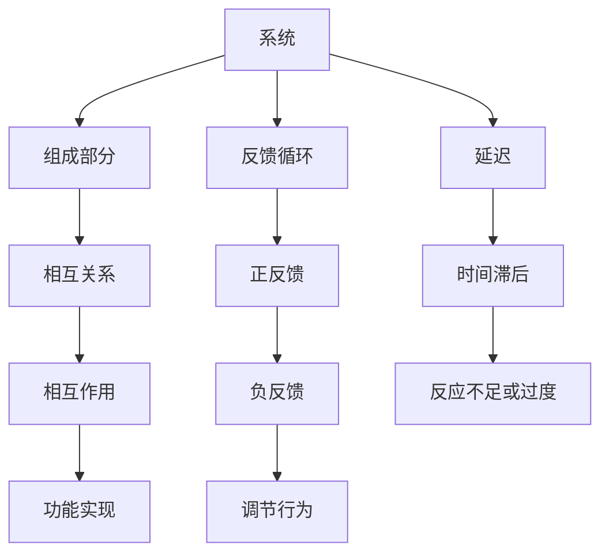

                 

系统思考（System Thinking）是一种分析和解决问题的方法论，旨在理解复杂系统的行为和动态。在危机管理中，系统思考的应用尤为重要，因为它能够帮助识别潜在的问题，预测可能的后果，并采取适当的应对措施。本文将探讨系统思考在危机管理中的应用，包括核心概念、算法原理、数学模型、实际案例以及未来展望。

## 关键词

- 系统思考
- 危机管理
- 复杂系统
- 算法
- 数学模型
- 应对策略

## 摘要

本文旨在探讨系统思考在危机管理中的重要性。通过分析系统思考的核心概念和算法原理，本文将展示如何利用系统思考方法预测和应对各种危机。文章还将通过实际案例，展示系统思考在危机管理中的应用效果，并讨论未来的发展方向和面临的挑战。

## 1. 背景介绍

### 系统思考的概念

系统思考是一种方法论，它强调理解系统内部各组成部分之间的相互关系和动态。系统思考的核心思想是，一个系统的行为不仅仅取决于其个别组成部分，还受到系统内部反馈循环和延迟的影响。这种理解有助于揭示复杂系统中隐藏的模式和潜在的问题。

### 危机管理的需求

危机管理是指在面对突发事件或紧急情况时，采取的一系列措施以减轻影响并恢复正常运营。随着全球化和信息技术的快速发展，危机管理的复杂性不断增加。有效的危机管理需要快速识别潜在风险、预测可能的后果，并采取适当的应对措施。

## 2. 核心概念与联系

### 核心概念

- **系统**: 一个由相互关联的组成部分组成的整体，这些组成部分通过相互关系和相互作用来实现系统的功能。
- **反馈循环**: 系统内部的一种循环机制，通过正反馈或负反馈来调节系统的行为。
- **延迟**: 系统行为的变化在时间上的滞后，它可能导致系统对变化的反应不足或过度。

### Mermaid 流程图



## 3. 核心算法原理 & 具体操作步骤

### 3.1 算法原理概述

系统思考的核心算法是建模和分析复杂系统。这种算法基于以下原则：

- **整体性**: 强调系统的整体性和各部分之间的相互作用。
- **动态性**: 理解系统的动态行为和变化过程。
- **适应性**: 考虑系统在面对外部变化时的适应能力。

### 3.2 算法步骤详解

1. **问题识别**: 通过数据收集和分析，识别系统中存在的问题。
2. **建立模型**: 利用系统思考工具，如因果图、系统动力学模型等，建立系统的模型。
3. **模拟分析**: 运行模型，模拟系统的行为，以预测可能的后果。
4. **制定策略**: 基于模拟结果，制定应对危机的策略。
5. **实施与监控**: 实施策略，并持续监控系统的行为，以调整策略。

### 3.3 算法优缺点

**优点**：

- **全面性**: 系统思考能够全面分析系统的各个方面，提供更全面的视角。
- **预测性**: 通过模拟分析，系统思考能够预测潜在的危机和其后果。
- **适应性**: 系统思考能够帮助系统在面对外部变化时进行调整。

**缺点**：

- **复杂性**: 系统思考需要大量的数据和分析，可能增加实施难度。
- **局限性**: 系统思考可能受到数据和模型限制，不能保证100%准确。

### 3.4 算法应用领域

系统思考在危机管理中的应用非常广泛，包括但不限于：

- **应急管理**: 在自然灾害、事故等突发事件中进行应急响应。
- **风险管理**: 在企业运营中，预测和管理潜在的商业风险。
- **公共卫生**: 在疫情防控中，预测疫情的发展和制定应对策略。

## 4. 数学模型和公式 & 详细讲解 & 举例说明

### 4.1 数学模型构建

系统思考中的数学模型通常基于以下原理：

- **线性方程组**: 用于描述系统中各组成部分之间的关系。
- **微分方程**: 用于描述系统的动态行为。
- **差分方程**: 用于描述离散时间系统的动态行为。

### 4.2 公式推导过程

以一个简单的例子，一个反馈控制系统可以用以下公式描述：

\[ \frac{dy}{dt} = ky - x \]

其中，\( y \) 是系统输出，\( x \) 是外部输入，\( k \) 是反馈系数。

### 4.3 案例分析与讲解

假设我们有一个水箱系统，水位 \( y \) 受到外部输入 \( x \) 和反馈控制 \( k \) 的影响。我们可以使用上述公式来模拟系统行为：

\[ \frac{dy}{dt} = ky - x \]

假设初始水位为 10，外部输入为 5，反馈系数为 0.5。我们可以计算在不同时间点的水位变化。

### 5. 项目实践：代码实例和详细解释说明

#### 5.1 开发环境搭建

在这个案例中，我们将使用 Python 作为编程语言，因为它具有强大的科学计算库和可视化工具。

```python
# 安装必要的库
!pip install numpy matplotlib
```

#### 5.2 源代码详细实现

以下是一个简单的 Python 代码示例，用于模拟水箱系统的动态行为：

```python
import numpy as np
import matplotlib.pyplot as plt

# 参数设置
k = 0.5
x = 5
y0 = 10
t_max = 20
dt = 0.1

# 计算时间步数
t_steps = int(t_max / dt) + 1

# 初始化数组
t = np.linspace(0, t_max, t_steps)
y = np.zeros(t_steps)

# 模拟动态行为
for i in range(1, t_steps):
    y[i] = y[i-1] + k * (y[i-1] - x) * dt

# 可视化结果
plt.plot(t, y)
plt.xlabel('Time (s)')
plt.ylabel('Water Level (m)')
plt.title('Water Tank System Dynamics')
plt.show()
```

#### 5.3 代码解读与分析

这段代码首先导入了必要的库，包括 NumPy 和 Matplotlib。NumPy 用于数学计算，Matplotlib 用于数据可视化。

在参数设置部分，我们定义了反馈系数 \( k \)，外部输入 \( x \)，初始水位 \( y0 \)，以及模拟的时间范围 \( t_max \) 和时间步长 \( dt \)。

接着，我们计算了时间步数，并初始化了时间和水位数组。

在模拟部分，我们使用一个循环来计算每个时间步的水位变化，并将其存储在数组中。

最后，我们使用 Matplotlib 库将模拟结果可视化，以便更直观地观察系统行为。

#### 5.4 运行结果展示

运行上述代码后，我们将看到一个动态图，展示水箱系统在不同时间点的水位变化。这有助于我们理解系统行为的动态特性，并为进一步的分析提供数据支持。

## 6. 实际应用场景

### 6.1 应急管理

在应急管理中，系统思考可以用于预测自然灾害的影响，并制定相应的应对措施。例如，在地震预警系统中，系统思考可以帮助预测地震的强度和影响范围，从而及时疏散人群并减少损失。

### 6.2 风险管理

在企业风险管理中，系统思考可以用于识别和管理潜在的商业风险。例如，在金融市场中，系统思考可以帮助预测股票市场的波动，并制定相应的投资策略。

### 6.3 公共卫生

在公共卫生领域，系统思考可以用于预测疫情的发展和传播，并制定相应的防控措施。例如，在 COVID-19 疫情中，系统思考可以帮助预测疫情的发展趋势，从而及时调整防控策略。

## 7. 工具和资源推荐

### 7.1 学习资源推荐

- 《系统思考》（作者：彼得·谢勒）
- 《复杂系统导论》（作者：约翰·霍兰）
- 《危机管理：理论与实践》（作者：约翰·汉普顿）

### 7.2 开发工具推荐

- Python
- R
- MATLAB

### 7.3 相关论文推荐

- "System Dynamics in Business and Management"
- "Crisis Management and System Thinking: A Multidisciplinary Approach"
- "System Dynamics Modeling of Epidemic Spreading and Control"

## 8. 总结：未来发展趋势与挑战

### 8.1 研究成果总结

系统思考在危机管理中的应用已取得显著成果，包括预测突发事件、制定应对策略、提升应急响应效率等方面。这些成果为危机管理提供了科学依据和实用工具。

### 8.2 未来发展趋势

未来，系统思考在危机管理中的应用将继续发展，特别是在人工智能和大数据技术的支持下，系统思考模型将更加精确和高效。此外，跨学科的合作也将推动系统思考方法的进一步创新。

### 8.3 面临的挑战

系统思考在危机管理中也面临一些挑战，包括数据收集和处理的复杂性、模型准确性的限制、实时性的需求等。解决这些问题需要不断的创新和技术进步。

### 8.4 研究展望

未来的研究应重点关注以下几个方面：

- 开发更高效的系统思考模型和方法。
- 探索跨学科融合，提升系统思考的应用广度和深度。
- 加强系统思考在新兴领域的应用，如环境管理、公共卫生等。

## 9. 附录：常见问题与解答

### 9.1 问题 1

**问题**：系统思考是否适用于所有类型的危机管理？

**解答**：是的，系统思考适用于各种类型的危机管理，从自然灾害到企业风险，再到公共卫生危机。其核心在于理解系统的复杂性和动态行为，从而提供更全面的视角和有效的应对策略。

### 9.2 问题 2

**问题**：系统思考与传统的危机管理方法有何不同？

**解答**：传统的危机管理方法往往侧重于事件发生后如何应对，而系统思考则强调在事件发生前如何预测和预防。系统思考通过分析系统的内在机制和动态，提供更早期和更全面的预警，从而更有效地管理危机。

### 9.3 问题 3

**问题**：如何确保系统思考模型的准确性？

**解答**：确保系统思考模型的准确性需要全面的数据收集、准确的参数设置和持续的模型验证。此外，与专家合作和跨学科研究也是提高模型准确性的重要手段。

---

作者：禅与计算机程序设计艺术 / Zen and the Art of Computer Programming

