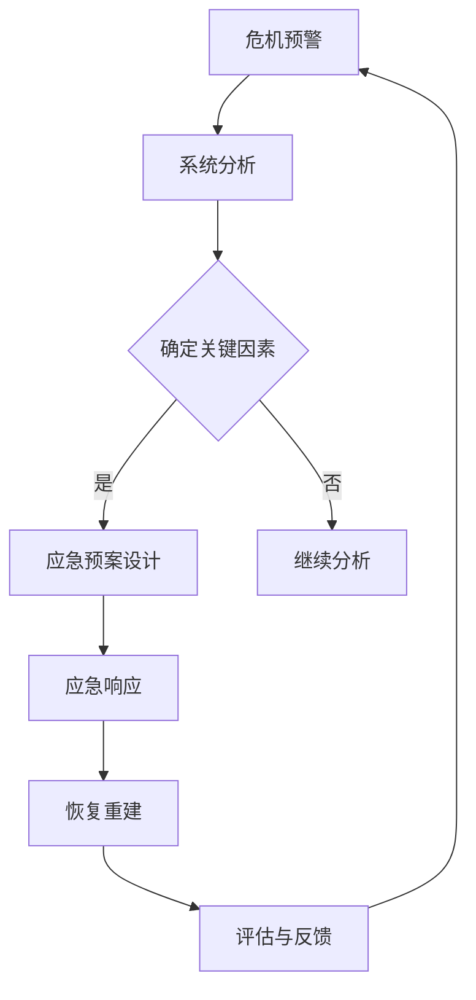

                 

关键词：危机管理、系统思考、复杂性科学、人工智能、应急预案

> 摘要：本文探讨了系统思考在危机管理中的应用，分析了危机管理的复杂性，介绍了系统思考的核心概念和方法，并阐述了其在危机预警、应急响应和恢复重建等方面的具体应用。通过案例分析，本文总结了系统思考在危机管理中的优势与挑战，为未来危机管理实践提供了有益的参考。

## 1. 背景介绍

在全球化和信息技术迅速发展的背景下，人类社会面临的危机类型日益多样化，危机管理的重要性日益凸显。危机管理是指在面对各种紧急情况时，通过系统的预警、应急响应和恢复重建等措施，以最大限度地减少危机对社会和经济的影响。然而，危机管理的复杂性使得传统的线性思维和单一方法难以应对复杂的危机情境。

系统思考是一种以整体视角分析问题的方法，它强调系统内部各要素之间的相互作用和反馈机制。在危机管理中，系统思考可以帮助我们理解危机的深层原因，发现潜在的风险因素，制定更加全面和有效的应急预案。

## 2. 核心概念与联系

### 2.1 复杂性科学

复杂性科学是研究复杂系统行为和性质的学科，它关注系统内部各要素之间的非线性关系和复杂的动态行为。在危机管理中，复杂性科学为我们提供了一种新的思维方式，使我们能够更好地理解危机的起源和发展。

### 2.2 系统思考的核心概念

系统思考的核心概念包括系统结构、动态行为、反馈机制和演化过程。这些概念帮助我们理解系统内部各要素之间的相互作用，以及系统如何随着时间的推移而发生变化。

### 2.3 系统思考方法

系统思考方法包括系统建模、系统分析、系统设计和系统评估。这些方法可以帮助我们识别危机管理中的关键问题，设计有效的应急预案，并评估应急预案的效果。

### 2.4 Mermaid 流程图

以下是一个简单的Mermaid流程图，展示了一个基于系统思考的危机管理流程：



## 3. 核心算法原理 & 具体操作步骤

### 3.1 算法原理概述

系统思考在危机管理中的应用主要通过以下步骤实现：

1. **数据收集与整理**：收集与危机相关的各种数据，包括历史数据、实时数据和专家意见。
2. **系统建模**：使用系统动力学模型或模拟模型对危机系统进行建模，以揭示系统内部各要素之间的关系和动态行为。
3. **危机预警**：根据系统模型，对危机发生的可能性进行预测，并发出预警。
4. **应急响应**：根据预警信息和应急预案，进行紧急响应，以减轻危机影响。
5. **恢复重建**：在危机过后，进行恢复和重建工作，以恢复正常社会秩序。
6. **评估与反馈**：对危机管理过程进行评估，收集反馈信息，以改进未来的危机管理。

### 3.2 算法步骤详解

1. **数据收集与整理**：首先，我们需要收集与危机相关的各种数据，如经济数据、社会数据、环境数据等。这些数据可以来自政府、企业、学术界等不同的来源。然后，对数据进行整理和分析，提取有用的信息。

2. **系统建模**：使用系统动力学模型或模拟模型对危机系统进行建模。系统动力学模型是一种基于差分方程的建模方法，它可以描述系统内部各要素之间的因果关系和动态行为。模拟模型则通过计算机模拟来模拟系统的行为。

3. **危机预警**：根据系统模型，对危机发生的可能性进行预测。这可以通过设定阈值来识别危机信号，例如，当某些关键指标的值超过预设的阈值时，系统就会发出预警。

4. **应急响应**：在危机预警发生后，根据应急预案进行紧急响应。应急预案应该包括紧急措施的步骤、责任人的分配、资源的调配等。

5. **恢复重建**：在危机过后，进行恢复和重建工作。这包括修复基础设施、恢复社会秩序、安抚民众等。

6. **评估与反馈**：对危机管理过程进行评估，收集反馈信息。这可以帮助我们了解危机管理的有效性，发现存在的问题，并改进未来的危机管理。

### 3.3 算法优缺点

**优点**：
- 全面性：系统思考方法可以从多个角度对危机进行分析，提供更全面的视角。
- 灵活性：系统思考方法可以根据实际情况进行调整和改进。
- 预测性：通过系统建模和模拟，可以预测危机的可能发展和后果。

**缺点**：
- 复杂性：系统思考方法需要较高的专业知识和技能。
- 成本：系统思考和建模可能需要大量的时间和资源。
- 数据依赖性：系统思考和建模的准确性很大程度上取决于数据的质量。

### 3.4 算法应用领域

系统思考在危机管理中的应用非常广泛，包括但不限于以下几个方面：

- 自然灾害：如地震、洪水、台风等。
- 公共卫生事件：如传染病疫情、食品安全事件等。
- 经济危机：如金融危机、股市崩盘等。
- 社会冲突：如恐怖袭击、种族冲突等。

## 4. 数学模型和公式 & 详细讲解 & 举例说明

### 4.1 数学模型构建

在危机管理中，我们可以使用系统动力学模型来描述危机系统的行为。系统动力学模型通常由差分方程组成，这些方程描述了系统内部各变量之间的因果关系和动态行为。

以下是一个简单的系统动力学模型示例：

$$
\frac{dX}{dt} = f(X, Y)
$$

$$
\frac{dY}{dt} = g(X, Y)
$$

其中，$X$ 和 $Y$ 是系统中的两个变量，$f$ 和 $g$ 是这两个变量之间的函数关系。

### 4.2 公式推导过程

以传染病模型为例，我们可以使用以下公式来描述感染人数和隔离人数的变化：

$$
\frac{dI}{dt} = -\beta I S - \gamma I
$$

$$
\frac{dS}{dt} = \beta I S - \gamma I - \mu S
$$

$$
\frac{dR}{dt} = \gamma I - \mu R
$$

其中，$I$ 是感染人数，$S$ 是易感人数，$R$ 是隔离人数，$\beta$ 是感染率，$\gamma$ 是康复率，$\mu$ 是出生率。

### 4.3 案例分析与讲解

以下是一个关于传染病疫情的案例分析：

假设某个城市有 1000 万人口，初始时感染人数为 100 人，易感人数为 999,900 人，康复人数为 0 人。感染率为 $\beta = 0.1$，康复率为 $\gamma = 0.05$。

使用上述公式，我们可以计算在不同时间点的感染人数、易感人数和康复人数。

初始时刻：

$$
I(0) = 100, \quad S(0) = 999,900, \quad R(0) = 0
$$

1小时后：

$$
I(1) = 100 - 0.1 \times 100 \times 999,900 - 0.05 \times 100 = 99
$$

$$
S(1) = 999,900 + 0.1 \times 100 \times 999,900 - 0.05 \times 100 - 0.05 \times 0 = 999,801
$$

$$
R(1) = 0 + 0.05 \times 100 = 5
$$

通过类似的方法，我们可以计算其他时间点的感染人数、易感人数和康复人数。

## 5. 项目实践：代码实例和详细解释说明

### 5.1 开发环境搭建

为了实现上述传染病模型的计算，我们需要搭建一个Python开发环境。具体步骤如下：

1. 安装Python：从 [Python官方网站](https://www.python.org/) 下载并安装Python。
2. 安装Python科学计算库：使用pip命令安装NumPy、SciPy和Matplotlib等库。

```bash
pip install numpy scipy matplotlib
```

### 5.2 源代码详细实现

以下是一个简单的Python代码示例，用于计算传染病模型：

```python
import numpy as np
import matplotlib.pyplot as plt

# 初始化参数
N = 1e6  # 总人口
I0 = 100  # 初始感染人数
S0 = N - I0  # 初始易感人数
R0 = 0  # 初始康复人数
beta = 0.1  # 感染率
gamma = 0.05  # 康复率
mu = 1/365  # 出生率
t_max = 30  # 最大时间步长（天）

# 计算时间步长
dt = 0.1

# 初始化变量
I = np.zeros(int(t_max/dt))
S = np.zeros(int(t_max/dt))
R = np.zeros(int(t_max/dt))

# 初始状态
I[0] = I0
S[0] = S0
R[0] = R0

# 计算过程
for i in range(1, int(t_max/dt)):
    dI = -beta * I[i-1] * S[i-1] - gamma * I[i-1]
    dS = beta * I[i-1] * S[i-1] - gamma * I[i-1] - mu * S[i-1]
    dR = gamma * I[i-1] - mu * R[i-1]
    
    I[i] = I[i-1] + dI * dt
    S[i] = S[i-1] + dS * dt
    R[i] = R[i-1] + dR * dt

# 绘制结果
plt.plot(I, label='Infections')
plt.plot(S, label='Susceptible')
plt.plot(R, label='Recovered')
plt.xlabel('Time (days)')
plt.ylabel('Population')
plt.legend()
plt.show()
```

### 5.3 代码解读与分析

上述代码实现了一个简单的传染病模型，具体解读如下：

1. 导入必要的库：numpy用于数值计算，matplotlib用于绘图。
2. 初始化参数：总人口N、初始感染人数I0、初始易感人数S0、初始康复人数R0、感染率beta、康复率gamma和出生率mu。
3. 计算时间步长：将最大时间步长t_max除以dt得到时间步数的整数部分。
4. 初始化变量：创建三个一维数组I、S和R，用于存储感染人数、易感人数和康复人数。
5. 初始状态：将初始感染人数I0赋值给I数组的第一项，初始易感人数S0赋值给S数组的第一项，初始康复人数R0赋值给R数组的第一项。
6. 计算过程：使用for循环计算每个时间步长的感染人数、易感人数和康复人数。
7. 绘制结果：使用matplotlib库绘制感染人数、易感人数和康复人数随时间的变化曲线。

### 5.4 运行结果展示

运行上述代码，将得到感染人数、易感人数和康复人数随时间的变化曲线。这些曲线可以帮助我们直观地了解传染病的发展趋势，为制定疫情防控策略提供依据。

## 6. 实际应用场景

### 6.1 自然灾害

在自然灾害如地震、洪水和台风等灾害中，系统思考可以用于评估灾害影响、制定应急预案和优化救援资源分配。例如，在地震发生后，系统思考可以帮助分析地震引发的次生灾害，如滑坡、泥石流等，从而制定更为全面的应急响应计划。

### 6.2 公共卫生事件

在公共卫生事件如传染病疫情、食品安全事件和环境污染事件中，系统思考可以用于预测疫情发展趋势、优化防疫措施和评估防控效果。例如，在新冠病毒疫情期间，系统思考可以帮助政府制定更加科学合理的防控策略，优化医疗资源的分配，提高疫情防控的效率。

### 6.3 经济危机

在经济危机如金融危机、股市崩盘和产业衰退中，系统思考可以用于分析危机的成因、预测危机的影响和制定应对策略。例如，在2008年金融危机期间，系统思考可以帮助政府和金融机构更好地理解危机的根源，制定有效的救助措施，减少危机对经济的影响。

### 6.4 社会冲突

在社会冲突如恐怖袭击、种族冲突和暴力事件中，系统思考可以用于分析冲突的原因、预测冲突的发展趋势和制定缓解冲突的策略。例如，在恐怖袭击事件后，系统思考可以帮助政府和安全机构更好地理解恐怖主义活动的动机和影响，制定有效的反恐措施。

## 7. 工具和资源推荐

### 7.1 学习资源推荐

- 《复杂性科学导论》
- 《系统思考实践指南》
- 《危机管理：理论与实践》
- 《传染病数学模型》

### 7.2 开发工具推荐

- Python：适用于数据分析和建模。
- R：适用于统计分析和图形展示。
- MATLAB：适用于数值计算和可视化。

### 7.3 相关论文推荐

- "System Dynamics in Crisis Management: A Review and Prospects" (2019)
- "Complexity Science in Public Health: A Framework for Modeling and Analysis" (2020)
- "An Agent-Based Model for Urban Flood Disaster Management" (2018)
- "System Dynamics Modeling of Financial Crises: A Literature Review" (2017)

## 8. 总结：未来发展趋势与挑战

### 8.1 研究成果总结

本文通过对系统思考在危机管理中的应用进行分析，总结了系统思考的核心概念、方法及应用领域。研究发现，系统思考在危机预警、应急响应和恢复重建等方面具有显著优势，但同时也面临一些挑战。

### 8.2 未来发展趋势

未来，系统思考在危机管理中的应用将继续深化，尤其是在人工智能和大数据技术的支持下，系统思考方法将更加成熟和精确。此外，跨学科合作也将成为趋势，结合社会学、心理学、经济学等多领域的研究成果，提高危机管理的整体效能。

### 8.3 面临的挑战

系统思考在危机管理中面临的挑战主要包括：

1. 数据质量和可靠性：系统思考依赖于高质量的数据，数据的真实性和完整性直接影响分析结果的准确性。
2. 复杂性：危机管理涉及多个因素和变量，如何简化复杂系统，使其易于理解和操作，仍需进一步研究。
3. 技术应用：如何将系统思考方法有效地应用于实际危机管理中，需要更多的实践探索和案例研究。

### 8.4 研究展望

未来研究应重点关注以下几个方面：

1. 系统建模与仿真：开发更加精确和高效的系统动力学模型，提高危机预测的准确性。
2. 跨学科合作：加强不同学科之间的合作，共同解决危机管理中的复杂问题。
3. 实践应用：结合具体案例，探讨系统思考在危机管理中的实际应用效果，为政策制定提供科学依据。

## 9. 附录：常见问题与解答

### 9.1 什么是系统思考？

系统思考是一种以整体视角分析问题的方法，它强调系统内部各要素之间的相互作用和反馈机制。

### 9.2 系统思考在危机管理中的应用有哪些？

系统思考在危机管理中的应用包括危机预警、应急响应、恢复重建和评估与反馈等方面。

### 9.3 如何使用系统思考进行危机预警？

使用系统思考进行危机预警的主要步骤包括：数据收集与整理、系统建模、危机预警和应急响应等。

### 9.4 系统思考在危机管理中的优势是什么？

系统思考在危机管理中的优势包括全面性、灵活性和预测性等。

### 9.5 系统思考在危机管理中面临的挑战是什么？

系统思考在危机管理中面临的挑战主要包括数据质量、复杂性和技术应用等方面。

### 9.6 如何提高系统思考在危机管理中的有效性？

提高系统思考在危机管理中的有效性可以通过加强数据质量、简化复杂系统和加强跨学科合作等方面实现。

### 9.7 系统思考在哪些领域有广泛应用？

系统思考在自然灾害、公共卫生事件、经济危机和社会冲突等领域有广泛应用。

