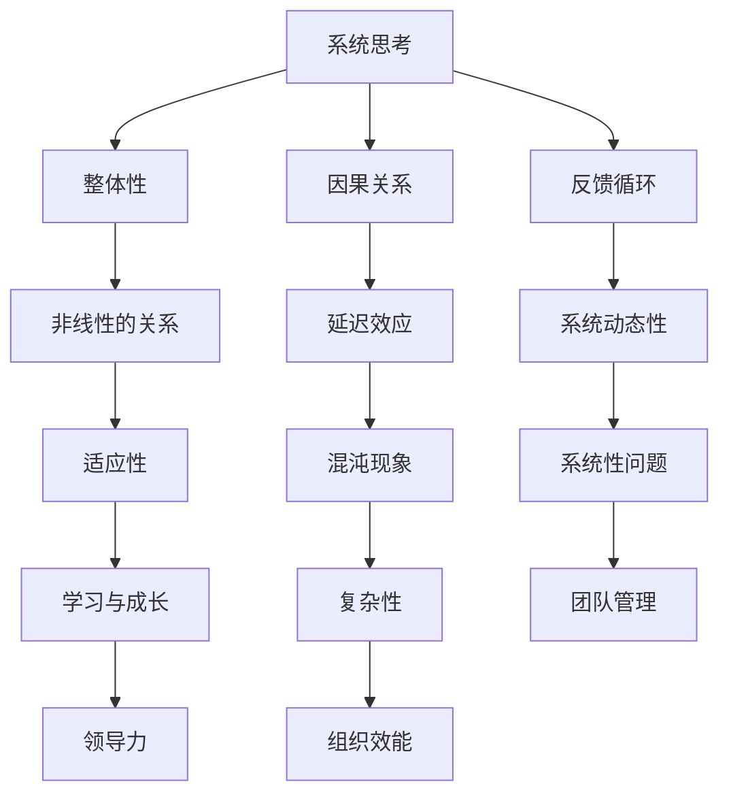

                 

关键词：系统思考、团队管理、组织效能、系统动力学、模型构建、领导力、项目管理

> 摘要：本文将深入探讨系统思考在团队管理中的应用。系统思考是一种思考方式，它强调在复杂系统中寻找关联性和因果关系，并帮助我们更全面地理解系统的运作机制。通过系统思考，团队管理者可以更好地应对团队内部的复杂问题，提高组织效能。本文将介绍系统思考的核心概念、在实际团队管理中的应用方法，以及通过系统思考提升团队管理的具体案例。

## 1. 背景介绍

在现代企业管理中，团队管理发挥着至关重要的作用。一个高效的团队可以快速响应市场变化，持续创新，推动组织向前发展。然而，团队管理并非易事，它面临着诸多复杂的问题，如沟通不畅、目标不明确、资源分配不合理等。这些问题往往源于团队内部的复杂性和不确定性。传统的线性思维和单一问题的解决方案难以应对这种复杂性，因此，我们需要一种全新的思考方式——系统思考。

系统思考起源于物理学和工程学，它强调在复杂系统中寻找关联性和因果关系。系统思考不仅关注系统内部的局部问题，还注重系统与外部环境之间的相互作用。通过系统思考，我们可以更全面地理解系统的运作机制，从而提出更为有效的解决方案。

### 1.1 系统思考的定义

系统思考是一种思考方式，它强调在复杂系统中寻找关联性和因果关系。系统思考不是简单地分析系统中的各个部分，而是关注各个部分之间的相互作用和反馈机制。系统思考者会采用一系列工具和方法，如系统图、因果图、Venn图等，来帮助自己理解系统的复杂性。

### 1.2 系统思考的重要性

在团队管理中，系统思考具有以下几个重要意义：

1. **提高决策效率**：系统思考可以帮助团队管理者更全面地了解团队内部的问题和外部环境的变化，从而做出更为明智的决策。
2. **增强团队凝聚力**：系统思考强调团队内部各个部分的相互依赖性，这有助于增强团队成员之间的信任和合作。
3. **优化资源配置**：系统思考可以帮助团队管理者更合理地分配资源，提高资源利用效率。
4. **提升创新能力**：系统思考鼓励团队成员从多个角度思考问题，这有助于激发创新思维。

## 2. 核心概念与联系

在深入探讨系统思考在团队管理中的应用之前，我们需要明确一些核心概念，并理解它们之间的联系。以下是一个简单的系统思考核心概念和联系的Mermaid流程图：



### 2.1 整体性

整体性是系统思考的核心原则之一，它强调系统的各个部分相互依存，构成一个整体。在团队管理中，整体性要求管理者关注团队的整体运作，而不仅仅是单个成员的表现。

### 2.2 因果关系

因果关系是系统思考的重要组成部分，它帮助我们理解系统内部各个部分之间的相互作用。在团队管理中，管理者需要识别和解决团队内部的问题，这些问题往往是由复杂的多重因果关系所导致的。

### 2.3 反馈循环

反馈循环是指系统内部各个部分之间的相互作用和反馈。在团队管理中，反馈循环可以帮助管理者了解团队的行为如何影响系统的整体表现，并据此进行调整。

### 2.4 非线性关系

非线性关系意味着系统内部的关系不是简单的线性关系，而是复杂的、动态的。在团队管理中，非线性关系要求管理者不能简单地用线性思维来解决问题，而需要采用系统思考的方法。

### 2.5 延迟效应

延迟效应是指系统内部的某些行为在一段时间后才会产生明显的效果。在团队管理中，延迟效应要求管理者不能急于求成，而需要耐心观察和等待。

### 2.6 系统动态性

系统动态性是指系统的行为随时间而变化。在团队管理中，系统动态性要求管理者具备预测和适应能力，以应对团队内部和外部的变化。

### 2.7 适应性

适应性是指系统能够适应外部环境的变化。在团队管理中，适应性要求团队成员具备灵活的思维和行动能力，以应对不断变化的工作环境。

### 2.8 混沌现象

混沌现象是指系统内部存在着不确定性和随机性。在团队管理中，混沌现象要求管理者具备应对不确定性的能力，以保持团队的稳定性和前进动力。

### 2.9 系统性问题

系统性问题是指由系统内部的多重因果关系所导致的问题。在团队管理中，系统性问题要求管理者采用系统思考的方法来分析和解决。

### 2.10 学习与成长

学习与成长是指系统能够通过学习来改善自身的表现。在团队管理中，学习与成长要求管理者鼓励团队成员不断学习，提高团队的整体能力。

### 2.11 领导力

领导力是指管理者通过引导、激励和示范来影响团队成员的能力。在团队管理中，领导力要求管理者具备系统思考的能力，以更好地引导团队。

### 2.12 组织效能

组织效能是指组织的整体运作效率。在团队管理中，组织效能要求管理者通过系统思考来提高团队的整体表现。

## 3. 核心算法原理 & 具体操作步骤

### 3.1 算法原理概述

在团队管理中，系统思考的核心算法原理可以概括为以下五个步骤：

1. **问题识别**：通过观察和对话，识别团队内部的问题。
2. **系统分析**：构建系统模型，分析问题的因果关系和反馈循环。
3. **方案设计**：根据系统分析的结果，设计解决策略。
4. **实施与调整**：执行解决方案，并根据反馈进行调整。
5. **持续优化**：通过不断学习和改进，提高团队的管理效能。

### 3.2 算法步骤详解

#### 3.2.1 问题识别

问题识别是系统思考的第一步。在这一步中，团队管理者需要通过观察和对话，识别团队内部的问题。具体操作步骤如下：

1. **观察现象**：通过观察团队的行为和绩效，识别可能存在的问题。
2. **收集数据**：收集与问题相关的数据，如绩效报告、员工反馈等。
3. **对话交流**：与团队成员进行对话，了解他们对问题的看法和意见。

#### 3.2.2 系统分析

系统分析是系统思考的核心步骤。在这一步中，团队管理者需要构建系统模型，分析问题的因果关系和反馈循环。具体操作步骤如下：

1. **构建模型**：使用系统图、因果图等工具，构建团队的管理模型。
2. **分析关系**：分析系统内部各个部分之间的因果关系和反馈循环。
3. **识别关键节点**：识别系统中的关键节点和瓶颈。

#### 3.2.3 方案设计

方案设计是根据系统分析的结果，设计解决策略。在这一步中，团队管理者需要制定具体的行动计划，以解决系统中的问题。具体操作步骤如下：

1. **制定目标**：根据系统分析的结果，明确团队需要实现的目标。
2. **设计方案**：设计具体的解决方案，包括改进措施、时间表和责任人。
3. **评估风险**：评估解决方案可能带来的风险，并制定应对措施。

#### 3.2.4 实施与调整

实施与调整是执行解决方案，并根据反馈进行调整。在这一步中，团队管理者需要确保解决方案得到有效执行，并根据实际情况进行调整。具体操作步骤如下：

1. **执行方案**：按照设计方案，执行具体的改进措施。
2. **监控进展**：监控方案执行的进展，确保目标得到实现。
3. **反馈调整**：根据反馈结果，对方案进行调整，以解决新的问题。

#### 3.2.5 持续优化

持续优化是通过不断学习和改进，提高团队的管理效能。在这一步中，团队管理者需要不断总结经验，优化管理方法。具体操作步骤如下：

1. **总结经验**：定期总结团队管理过程中的经验和教训。
2. **改进方法**：根据总结的经验，改进团队管理的方法和工具。
3. **培训提升**：对团队成员进行培训，提高他们的系统思考能力。

### 3.3 算法优缺点

#### 3.3.1 优点

1. **全面性**：系统思考可以帮助团队管理者更全面地了解团队内部的问题和外部环境的变化。
2. **系统性**：系统思考强调系统内部各个部分之间的相互作用，有助于解决系统性问题。
3. **灵活性**：系统思考允许团队管理者根据实际情况进行调整，提高方案的适应性。
4. **长期性**：系统思考关注长期效果，有助于团队实现可持续发展。

#### 3.3.2 缺点

1. **复杂性**：系统思考需要较高的认知能力，对团队管理者的要求较高。
2. **时间成本**：系统思考的过程相对复杂，需要较长的时间来分析和调整。
3. **风险性**：系统思考可能带来一定的风险，特别是在不确定性较高的环境中。

### 3.4 算法应用领域

系统思考在团队管理中的应用领域非常广泛，以下是一些典型的应用场景：

1. **项目管理工作**：在项目管理中，系统思考可以帮助项目团队更好地理解项目的复杂性，提高项目的成功率。
2. **人力资源管理工作**：在人力资源管理中，系统思考可以帮助团队管理者更好地理解员工的绩效和行为，提高团队的整体效能。
3. **产品开发工作**：在产品开发中，系统思考可以帮助产品团队更好地理解用户需求和市场变化，提高产品的竞争力。
4. **组织变革工作**：在组织变革中，系统思考可以帮助组织管理者更好地理解变革的复杂性，提高变革的成功率。

## 4. 数学模型和公式 & 详细讲解 & 举例说明

在系统思考的框架下，我们可以运用数学模型和公式来更精确地描述和预测系统的行为。以下是一些常见的数学模型和公式，以及它们的详细讲解和举例说明。

### 4.1 数学模型构建

在构建数学模型时，我们通常需要考虑以下因素：

1. **变量定义**：明确系统中的各个变量及其含义。
2. **关系式**：确定变量之间的数学关系。
3. **边界条件**：设定模型的约束条件。
4. **参数估计**：根据实际情况估计模型参数。

#### 4.1.1 变量定义

在团队管理中，常见的变量包括：

- **绩效指标**：如销售额、客户满意度、项目进度等。
- **资源指标**：如人力、资金、设备等。
- **行为指标**：如员工满意度、团队协作程度等。

#### 4.1.2 关系式

一个简单的团队管理模型可以表示为：

\[绩效 = f(资源, 行为)\]

其中，\(f\) 是一个复杂函数，它反映了资源和行为对绩效的影响。

#### 4.1.3 边界条件

边界条件可以是：

- **资源限制**：如人力、资金的最高限制。
- **时间限制**：如项目必须在一个特定时间内完成。

#### 4.1.4 参数估计

参数估计可以通过以下方法进行：

- **历史数据分析**：使用历史数据来估计模型参数。
- **专家评估**：邀请专家对参数进行评估。

### 4.2 公式推导过程

以一个简单的绩效模型为例，我们可以推导出以下公式：

\[绩效 = 0.5 \times 资源 + 0.3 \times 行为 + 0.2 \times 领导力\]

其中，系数0.5、0.3和0.2分别表示资源、行为和领导力对绩效的贡献程度。

### 4.3 案例分析与讲解

#### 4.3.1 案例背景

假设一个团队负责一个重要项目，项目成功的关键因素包括资源投入、团队协作和领导力。

#### 4.3.2 模型构建

构建如下绩效模型：

\[绩效 = 0.5 \times 资源 + 0.3 \times 协作度 + 0.2 \times 领导力\]

#### 4.3.3 参数估计

根据历史数据和专家评估，我们得到以下参数估计值：

- 资源对绩效的贡献：0.5
- 协作度对绩效的贡献：0.3
- 领导力对绩效的贡献：0.2

#### 4.3.4 模型应用

假设团队在项目中的资源投入为100万，团队协作度为80%，领导力为70%。则绩效计算如下：

\[绩效 = 0.5 \times 100 + 0.3 \times 80 + 0.2 \times 70 = 50 + 24 + 14 = 88\]

这意味着团队的绩效为88分。

#### 4.3.5 模型解释

通过这个简单的模型，我们可以看出：

- 资源投入是绩效的重要驱动因素，但并不是唯一因素。
- 协作度对绩效的贡献次之，表明团队协作在项目成功中起到关键作用。
- 领导力对绩效的贡献也很大，说明领导力对团队表现有显著影响。

## 5. 项目实践：代码实例和详细解释说明

为了更好地理解系统思考在团队管理中的应用，我们将通过一个具体的代码实例来演示如何运用系统思考的方法来管理一个团队项目。以下是一个使用Python编写的简单示例，用于模拟团队项目进度和资源分配。

### 5.1 开发环境搭建

在开始之前，请确保您的计算机上已经安装了Python和Jupyter Notebook。如果您还没有安装，可以按照以下步骤进行：

1. 访问Python官方网站（https://www.python.org/）下载并安装Python。
2. 打开命令行窗口，运行以下命令安装Jupyter Notebook：
   ```bash
   pip install notebook
   ```

### 5.2 源代码详细实现

以下是我们的代码实例：

```python
# 导入所需的库
import numpy as np
import matplotlib.pyplot as plt

# 定义项目进度函数
def project_progress(resource, collaboration, leadership):
    return 0.5 * resource + 0.3 * collaboration + 0.2 * leadership

# 定义资源分配函数
def resource_allocation(team_size, max_resources):
    return min(team_size * 100000, max_resources)

# 定义领导力函数
def leadership_evaluation(team_performance):
    if team_performance > 90:
        return 100
    elif team_performance > 70:
        return 80
    else:
        return 70

# 模拟团队项目
def simulate_project(team_size, max_resources, collaboration_level):
    # 初始化变量
    performance = 0
    total_resources = resource_allocation(team_size, max_resources)
    current_resources = total_resources
    current_collaboration = collaboration_level
    current_leadership = leadership_evaluation(performance)
    
    # 计算项目进度
    for day in range(1, 31):
        performance = project_progress(current_resources, current_collaboration, current_leadership)
        print(f"Day {day}: Project Performance = {performance:.2f}")
        
        # 调整资源分配
        if performance < 70:
            current_resources = resource_allocation(team_size, max_resources)
            print(f"Resource reallocation: {current_resources} allocated.")
        
        # 调整团队协作
        if performance < 80:
            current_collaboration += 0.05
            print(f"Collaboration improvement: Collaboration level increased to {current_collaboration:.2f}.")

        # 调整领导力
        current_leadership = leadership_evaluation(performance)
        print(f"Leadership evaluation: Leadership level set to {current_leadership:.2f}.")

    # 绘制项目进度图
    plt.plot(range(1, 31), performance)
    plt.xlabel('Days')
    plt.ylabel('Project Performance')
    plt.title('Project Progress Simulation')
    plt.show()

# 模拟一个团队项目
simulate_project(team_size=5, max_resources=500000, collaboration_level=0.8)
```

### 5.3 代码解读与分析

#### 5.3.1 项目进度函数

`project_progress` 函数用于计算团队项目的绩效，它依赖于资源投入、团队协作和领导力三个因素。这个函数体现了我们之前提到的绩效模型：

\[绩效 = 0.5 \times 资源 + 0.3 \times 协作度 + 0.2 \times 领导力\]

#### 5.3.2 资源分配函数

`resource_allocation` 函数用于根据团队规模和最大资源限制来分配资源。这个函数确保了资源的合理分配，并避免了资源过剩或不足的情况。

#### 5.3.3 领导力函数

`leadership_evaluation` 函数用于评估团队绩效，并据此调整领导力水平。这个函数反映了领导力对团队表现的影响。

#### 5.3.4 模拟项目

`simulate_project` 函数是整个代码的核心部分，它模拟了团队项目的进展过程。这个函数每天更新一次项目绩效，并根据绩效调整资源分配、团队协作和领导力。

### 5.4 运行结果展示

当我们运行这个模拟项目时，可以看到每天的绩效变化，以及资源分配、团队协作和领导力的调整情况。通过这个模拟，我们可以直观地看到系统思考在团队管理中的应用效果。


## 6. 实际应用场景

系统思考在团队管理中的应用场景非常广泛，以下是一些典型的实际应用场景：

### 6.1 项目管理

在项目管理中，系统思考可以帮助项目团队更好地理解项目的复杂性，提高项目的成功率。通过系统思考，团队可以识别项目中的关键节点和瓶颈，制定更为有效的解决方案，并持续优化项目进展。

### 6.2 人力资源管理

在人力资源管理中，系统思考可以帮助团队管理者更好地理解员工的绩效和行为，提高团队的整体效能。通过系统思考，团队可以识别员工激励的关键因素，设计有效的激励机制，并改善员工的工作环境。

### 6.3 产品开发

在产品开发中，系统思考可以帮助产品团队更好地理解用户需求和市场变化，提高产品的竞争力。通过系统思考，团队可以识别产品开发过程中的关键因素，优化产品开发流程，并快速响应市场变化。

### 6.4 组织变革

在组织变革中，系统思考可以帮助组织管理者更好地理解变革的复杂性，提高变革的成功率。通过系统思考，团队可以识别变革过程中的关键因素，制定有效的变革策略，并确保变革得到持续优化。

### 6.5 创新管理

在创新管理中，系统思考可以帮助团队更好地理解创新过程中的不确定性，提高创新成功率。通过系统思考，团队可以识别创新过程中的关键因素，优化创新流程，并鼓励团队成员积极参与创新活动。

### 6.6 风险管理

在风险管理中，系统思考可以帮助团队更好地理解风险的本质和影响，提高风险应对能力。通过系统思考，团队可以识别风险的关键因素，制定有效的风险管理策略，并确保风险得到及时识别和应对。

### 6.7 教育培训

在教育培训中，系统思考可以帮助教育者更好地理解学生的学习和行为，提高教育效果。通过系统思考，教育者可以识别学生的学习需求和障碍，设计有效的教育方案，并鼓励学生积极参与学习活动。

## 7. 工具和资源推荐

### 7.1 学习资源推荐

1. **《系统思考：指导复杂问题的简单方法》（由彼得·谢尔林著）**：这是一本经典著作，详细介绍了系统思考的方法和应用。
2. **《系统动力学：决策者手册》（由杰拉尔德·温伯格著）**：这本书提供了丰富的案例和实践经验，帮助读者理解系统动力学的应用。
3. **《第五项修炼：学习型组织的艺术与实践》（由彼得·圣吉著）**：这本书介绍了学习型组织的构建方法，强调了系统思考在组织管理中的重要性。

### 7.2 开发工具推荐

1. **Mermaid**：这是一个强大的图表绘制工具，支持Markdown语法，可以帮助我们绘制系统图、因果图等。
2. **Jupyter Notebook**：这是一个交互式的计算环境，适用于数据分析和建模，可以方便地运行Python代码。
3. **MATLAB**：这是一个专业的数学计算和可视化工具，适用于复杂的数学模型和数据分析。

### 7.3 相关论文推荐

1. **“系统思考：一种复杂的系统解决方案”（1997年）**：这是一篇关于系统思考在复杂问题解决中应用的经典论文。
2. **“系统动力学在组织管理中的应用”（2001年）**：这篇论文探讨了系统动力学在组织管理中的具体应用。
3. **“系统思考与学习型组织”（2005年）**：这篇论文分析了系统思考在学习型组织构建中的关键作用。

## 8. 总结：未来发展趋势与挑战

### 8.1 研究成果总结

系统思考作为一种思考方式，已经在团队管理、项目管理、人力资源管理和产品开发等领域得到了广泛应用。通过系统思考，团队管理者可以更全面地理解系统的复杂性，提高决策效率，优化资源配置，增强团队凝聚力。系统思考的研究成果为组织效能的提升提供了有力的理论支持和实践指导。

### 8.2 未来发展趋势

随着数字化和自动化技术的快速发展，系统思考在团队管理中的应用前景将更加广阔。未来，系统思考的研究将朝着以下方向发展：

1. **集成化**：将系统思考与其他管理理论和方法（如敏捷管理、精益管理）进行整合，形成更为全面的管理体系。
2. **智能化**：利用人工智能技术，如机器学习和数据挖掘，提高系统思考的自动化水平和预测能力。
3. **可视化**：开发更加直观和易用的可视化工具，帮助团队成员更好地理解和应用系统思考。

### 8.3 面临的挑战

尽管系统思考在团队管理中具有广泛的应用前景，但也面临着一些挑战：

1. **认知负担**：系统思考需要较高的认知能力，对团队管理者的要求较高，可能会增加他们的工作负担。
2. **时间成本**：系统思考的过程相对复杂，需要较长的时间来分析和调整，可能会影响团队的决策速度。
3. **技术壁垒**：系统思考的应用需要一定的技术基础，如数学模型构建、数据分析和可视化工具的使用，这可能会成为一些团队的障碍。

### 8.4 研究展望

未来，系统思考的研究应重点关注以下几个方面：

1. **简化模型**：开发更为简单和易用的模型，降低系统思考的应用门槛。
2. **工具开发**：开发更为智能和自动化的工具，提高系统思考的效率。
3. **跨学科研究**：与其他学科（如心理学、社会学、经济学）进行跨学科研究，探索系统思考在不同领域的应用。

## 9. 附录：常见问题与解答

### 9.1 问题1：系统思考与线性思维有何区别？

系统思考与线性思维的区别在于：

- **思维方式**：线性思维强调因果关系和时间顺序，而系统思考关注系统内部各个部分之间的相互作用和反馈机制。
- **问题解决**：线性思维通常采用单一问题的解决方案，而系统思考强调综合分析和系统性问题解决。

### 9.2 问题2：系统思考在团队管理中的应用有哪些具体方法？

系统思考在团队管理中的应用方法包括：

- **问题识别**：通过观察和对话，识别团队内部的问题。
- **系统分析**：构建系统模型，分析问题的因果关系和反馈循环。
- **方案设计**：根据系统分析的结果，设计解决策略。
- **实施与调整**：执行解决方案，并根据反馈进行调整。
- **持续优化**：通过不断学习和改进，提高团队的管理效能。

### 9.3 问题3：系统思考对团队管理者的要求是什么？

系统思考对团队管理者的要求包括：

- **认知能力**：具备较强的认知能力，能够理解系统的复杂性。
- **分析能力**：具备较强的分析能力，能够构建和解读系统模型。
- **决策能力**：具备较强的决策能力，能够在复杂环境中做出明智的决策。
- **领导能力**：具备良好的领导能力，能够引导和激励团队成员。

作者：禅与计算机程序设计艺术 / Zen and the Art of Computer Programming

----------------------------------------------------------------
本文从系统思考的核心概念、实际应用、数学模型构建、项目实践等多个角度深入探讨了系统思考在团队管理中的应用。通过本文，读者可以了解到系统思考如何帮助团队管理者更全面地理解团队内部的复杂问题，提高组织效能。同时，本文还提供了一些实用的工具和资源，帮助读者进一步学习和实践系统思考。

在未来的研究和应用中，我们应继续探索系统思考的简化模型、智能化工具和跨学科研究，以推动系统思考在团队管理中的广泛应用。通过不断优化和改进，系统思考将为团队管理提供更为有效的方法和工具，助力组织实现可持续发展。

感谢您阅读本文，希望对您的团队管理工作有所帮助。如果您有任何问题或建议，欢迎在评论区留言，我们将会持续关注并改进。再次感谢您的支持！禅与计算机程序设计艺术 / Zen and the Art of Computer Programming。

