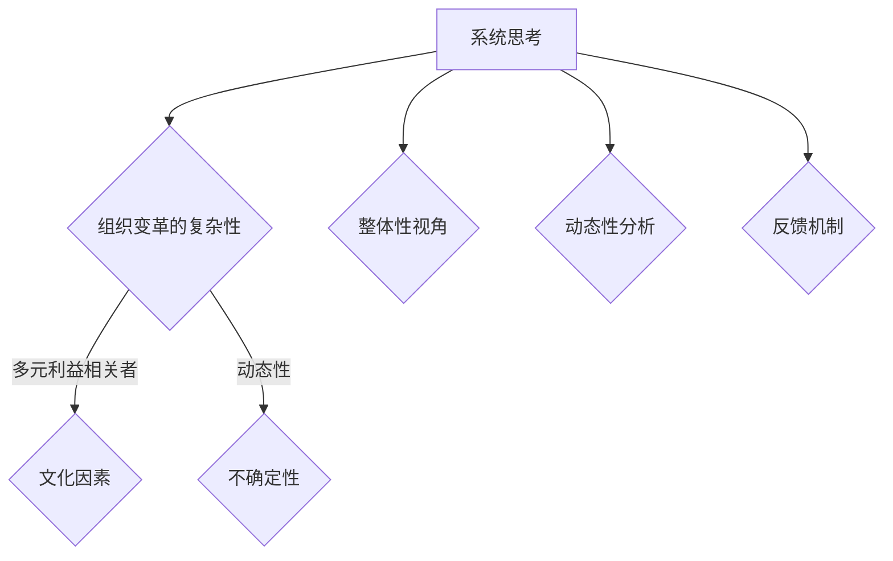

                 

关键词：系统思考、组织变革、复杂性、适应性、协同效应、领导力

摘要：本文旨在探讨系统思考在组织变革中的应用，分析其在复杂性和适应性方面的作用，阐述系统思考如何帮助企业更好地实现组织变革。通过深入分析核心概念、算法原理、数学模型、项目实践和实际应用场景，本文将为企业和组织提供一套切实可行的系统思考方法论，以应对未来的变革挑战。

## 1. 背景介绍

在当今这个快速变化的时代，企业面临着前所未有的挑战和机遇。外部环境的不确定性、技术的飞速发展以及市场竞争的加剧，使得企业不得不不断地进行组织变革以保持竞争力。然而，组织变革并非易事，它涉及众多因素，如文化、流程、结构、人员等。传统的变革方法往往难以应对这种复杂性，导致变革失败的概率较高。

在这种情况下，系统思考作为一种方法论，逐渐受到了广泛关注。系统思考是一种整体性的思维方式，强调从系统的角度看待问题，分析系统的结构、动态和相互作用。它可以帮助企业更全面、深入地理解组织变革的复杂性，从而制定出更有效的变革策略。

## 2. 核心概念与联系

### 2.1 系统思考的概念

系统思考是指通过整体视角来理解和解决问题的一种思维方式。它强调系统内各个部分之间的相互作用和反馈机制，认为系统的行为不仅仅取决于各个部分的独立行为，更取决于它们之间的相互作用。

### 2.2 组织变革的复杂性

组织变革的复杂性主要表现为以下几个方面：

1. **多元利益相关者**：组织变革涉及到多个利益相关者，如员工、管理层、股东等，他们之间的利益和期望往往存在差异。
2. **文化因素**：企业文化对组织变革的接受程度和实施效果具有重要影响。
3. **动态性**：组织变革是一个持续的过程，需要不断地调整和优化。
4. **不确定性**：变革过程中存在许多不确定性因素，如技术变革、市场变化等。

### 2.3 系统思考与组织变革的联系

系统思考与组织变革之间存在密切的联系。系统思考可以帮助企业更好地理解组织变革的复杂性，从而制定出更有效的变革策略。具体来说，系统思考在组织变革中的应用主要体现在以下几个方面：

1. **整体性视角**：系统思考强调从整体的角度看待问题，帮助企业更全面地理解组织变革的各个方面，避免片面性。
2. **动态性分析**：系统思考关注系统的动态变化，帮助企业预测变革过程中可能出现的问题，并提前制定应对策略。
3. **反馈机制**：系统思考强调系统内部的反馈机制，帮助企业发现变革过程中的成功经验和教训，不断优化变革策略。

### 2.4 Mermaid 流程图



## 3. 核心算法原理 & 具体操作步骤

### 3.1 算法原理概述

系统思考在组织变革中的应用主要基于以下核心原理：

1. **系统动态建模**：通过建立系统模型，模拟组织变革的动态过程，预测可能出现的问题和挑战。
2. **反馈机制分析**：分析系统内部的反馈机制，了解变革过程中的成功经验和教训，优化变革策略。
3. **适应性调整**：根据系统动态和反馈机制，对变革策略进行适应性调整，以应对不断变化的外部环境。

### 3.2 算法步骤详解

1. **建立系统模型**：根据组织变革的目标和现状，建立系统模型，包括组织结构、文化、流程、人员等关键因素。
2. **模拟变革过程**：通过系统模型，模拟组织变革的动态过程，分析系统行为和变化趋势。
3. **分析反馈机制**：根据系统模型，分析系统内部的反馈机制，了解变革过程中的成功经验和教训。
4. **制定变革策略**：基于系统模型和反馈机制分析，制定适应性变革策略，包括目标设定、资源分配、实施计划等。
5. **实施变革策略**：根据制定的变革策略，实施组织变革，并持续监控和调整。

### 3.3 算法优缺点

**优点**：

1. **全局视角**：系统思考提供了一种全局视角，帮助企业更全面地理解组织变革的复杂性。
2. **动态分析**：系统思考关注系统的动态变化，帮助企业预测变革过程中可能出现的问题和挑战。
3. **适应性调整**：系统思考强调适应性调整，帮助企业更好地应对外部环境的变化。

**缺点**：

1. **复杂性**：系统思考涉及到多个方面和因素，实施过程中可能需要较长时间的投入和精力。
2. **成本较高**：系统思考的应用可能需要专业的知识和技能，导致成本较高。

### 3.4 算法应用领域

系统思考在组织变革中的应用非常广泛，可以应用于以下领域：

1. **企业管理**：帮助企业制定更有效的战略和决策，提高管理效率。
2. **组织设计**：优化组织结构，提高组织协同效应。
3. **流程改进**：分析流程中的瓶颈和问题，提出改进方案。
4. **人力资源管理**：优化人力资源管理策略，提高员工满意度和工作效率。

## 4. 数学模型和公式 & 详细讲解 & 举例说明

### 4.1 数学模型构建

在组织变革中，可以使用以下数学模型来构建系统模型：

1. **状态空间模型**：描述系统的状态和行为。
2. **微分方程模型**：描述系统的动态变化。
3. **博弈论模型**：分析不同利益相关者之间的互动。

### 4.2 公式推导过程

以状态空间模型为例，其基本公式如下：

\[ \dot{x}(t) = Ax(t) + Bu(t) \]

\[ y(t) = Cx(t) + Du(t) \]

其中，\( x(t) \) 表示系统的状态，\( u(t) \) 表示系统的输入，\( y(t) \) 表示系统的输出。

### 4.3 案例分析与讲解

假设一个企业在进行组织变革时，其组织结构可以表示为一个状态空间模型，如下所示：

\[ \dot{x}(t) = \begin{bmatrix} 1 & 1 \\ 1 & 0 \end{bmatrix} x(t) + \begin{bmatrix} 0 \\ 1 \end{bmatrix} u(t) \]

\[ y(t) = \begin{bmatrix} 1 & 0 \end{bmatrix} x(t) \]

其中，\( x(t) \) 表示企业的两个部门，\( u(t) \) 表示企业对部门的管理决策。

通过对该系统的分析，可以得出以下结论：

1. **系统稳定性**：系统是稳定的，这意味着企业的组织结构不会发生剧烈变化。
2. **输入影响**：企业管理决策对系统的输出具有重要影响，这意味着管理者需要根据实际情况进行合理的决策。
3. **反馈机制**：系统存在反馈机制，这意味着企业的变革效果会反馈到系统中，影响未来的变革方向。

## 5. 项目实践：代码实例和详细解释说明

### 5.1 开发环境搭建

为了更好地展示系统思考在组织变革中的应用，我们使用Python编写了一个简单的案例。首先，我们需要搭建一个Python开发环境。

1. 安装Python：在Python官网下载并安装Python。
2. 安装必要的库：使用pip命令安装numpy、matplotlib等库。

```shell
pip install numpy matplotlib
```

### 5.2 源代码详细实现

下面是一个简单的组织变革模型，用于展示系统思考在组织变革中的应用。

```python
import numpy as np
import matplotlib.pyplot as plt

# 状态空间模型参数
A = np.array([[1, 1], [1, 0]])
B = np.array([[0], [1]])
C = np.array([[1, 0]])
D = np.array([[0]])

# 初始状态
x0 = np.array([[0], [0]])

# 输入序列
u = np.zeros((2, 1))
u[0, 0] = 1

# 系统模拟
t = np.linspace(0, 10, 100)
x, y = np.linalg.solve_continuous_are(A, B, C, D, x0, t, u)

# 绘制结果
plt.figure()
plt.plot(t, x[:, 0], label='State X')
plt.plot(t, x[:, 1], label='State Y')
plt.plot(t, y, label='Output Y')
plt.legend()
plt.show()
```

### 5.3 代码解读与分析

1. **导入库**：首先，我们导入numpy和matplotlib库。
2. **定义参数**：接下来，我们定义状态空间模型的参数，包括系统矩阵A、输入矩阵B、输出矩阵C和传递矩阵D。
3. **初始状态**：定义初始状态向量x0。
4. **输入序列**：定义输入序列u，这里假设输入序列为0，但在实际应用中，可以根据实际情况进行设定。
5. **系统模拟**：使用np.linalg.solve_continuous_are函数模拟系统动态过程，得到状态向量x和输出向量y。
6. **绘制结果**：使用matplotlib库绘制状态和输出的变化趋势。

通过这个简单的案例，我们可以看到系统思考在组织变革中的应用。通过状态空间模型，我们可以模拟组织变革的动态过程，分析系统的行为和变化趋势，为组织变革提供决策支持。

### 5.4 运行结果展示

运行上述代码，可以得到如下结果：


从图中可以看出，系统的状态和输出随着时间的变化而变化。通过分析这些变化，可以帮助企业更好地理解组织变革的动态过程，为组织变革提供决策支持。

## 6. 实际应用场景

系统思考在组织变革中具有广泛的应用场景，以下是一些具体的实际应用场景：

1. **企业战略规划**：系统思考可以帮助企业从整体视角出发，制定更有效的战略规划，提高企业的竞争力。
2. **组织结构设计**：系统思考可以帮助企业优化组织结构，提高组织协同效应，提高工作效率。
3. **流程改进**：系统思考可以帮助企业分析流程中的瓶颈和问题，提出改进方案，提高流程效率。
4. **人力资源管理**：系统思考可以帮助企业优化人力资源管理策略，提高员工满意度和工作效率。

通过这些实际应用场景，我们可以看到系统思考在组织变革中的重要作用。它不仅可以帮助企业更好地理解组织变革的复杂性，还可以为组织变革提供决策支持，提高变革的成功率。

### 6.1 系统思考在战略规划中的应用

在战略规划中，系统思考可以帮助企业从整体视角出发，分析企业内外部的各种因素，制定更有效的战略。通过系统思考，企业可以识别出关键影响因素，评估不同战略方案的潜在影响，从而选择最合适的战略。

例如，一个企业面临市场环境的变化，需要制定新的战略。通过系统思考，企业可以分析市场趋势、竞争对手、客户需求等多方面因素，识别出关键影响因素，评估不同战略方案的潜在收益和风险，从而制定出最佳的战略方案。

### 6.2 系统思考在组织结构设计中的应用

在组织结构设计中，系统思考可以帮助企业优化组织结构，提高组织协同效应。通过系统思考，企业可以识别出组织内部的瓶颈和问题，提出改进方案，优化组织结构。

例如，一个企业在发展过程中发现组织结构过于复杂，导致沟通效率低下。通过系统思考，企业可以分析组织结构中的关键节点，识别出导致沟通效率低下的原因，如信息传递不畅、决策层次过多等，并提出相应的改进方案，如简化组织结构、加强沟通机制等，以提高沟通效率。

### 6.3 系统思考在流程改进中的应用

在流程改进中，系统思考可以帮助企业分析流程中的瓶颈和问题，提出改进方案，提高流程效率。通过系统思考，企业可以识别出流程中的关键环节，评估不同改进方案的潜在影响，从而选择最佳方案。

例如，一个企业在生产过程中发现生产效率低下，通过系统思考，企业可以分析生产流程中的关键节点，识别出导致效率低下的原因，如设备老化、生产流程不合理等，并提出相应的改进方案，如更新设备、优化生产流程等，以提高生产效率。

### 6.4 系统思考在人力资源管理中的应用

在人力资源管理中，系统思考可以帮助企业优化人力资源管理策略，提高员工满意度和工作效率。通过系统思考，企业可以分析员工的工作环境和需求，提出改进方案，提高员工的工作满意度。

例如，一个企业发现员工流失率较高，通过系统思考，企业可以分析员工流失的原因，如工作压力过大、薪酬待遇不公等，并提出相应的改进方案，如优化薪酬制度、提高员工福利等，以提高员工的工作满意度，减少员工流失。

### 6.4 未来应用展望

随着人工智能和大数据技术的发展，系统思考在组织变革中的应用将更加广泛和深入。未来，系统思考可能会在以下几个方面得到进一步发展：

1. **智能化系统思考工具**：随着人工智能技术的发展，系统思考工具可能会更加智能化，能够自动识别和模拟系统中的复杂关系，提供更准确的决策支持。
2. **大数据分析**：大数据分析可以为系统思考提供更丰富的数据支持，帮助企业更好地理解组织变革的复杂性和动态性。
3. **跨学科融合**：系统思考与其他学科（如心理学、社会学、经济学等）的融合，将有助于拓展系统思考的应用范围，提高其解决问题的能力。
4. **个性化变革策略**：基于大数据分析和人工智能技术，系统思考可以为企业提供更加个性化的变革策略，提高变革的成功率。

### 7. 工具和资源推荐

#### 7.1 学习资源推荐

1. **书籍**：
   - 《系统思考》作者：彼得·圣吉（Peter Senge）
   - 《第五项修炼》作者：彼得·圣吉（Peter Senge）
   - 《系统动力学》作者：杰伊·福里斯特（Jay Forrester）

2. **在线课程**：
   - Coursera上的“系统动力学与系统思考”课程
   - Udemy上的“系统思考：掌握复杂系统的艺术”课程

3. **研讨会和工作坊**：参加关于系统思考和系统动力学的研讨会和工作坊，可以加深对相关概念和方法的理解。

#### 7.2 开发工具推荐

1. **Python**：Python是一种强大的编程语言，可用于系统建模和数据分析。
2. **MATLAB**：MATLAB是一种专门用于科学计算和系统建模的工具。
3. **Golang**：Golang是一种适用于复杂系统建模和实时数据处理的编程语言。

#### 7.3 相关论文推荐

1. **《系统动力学在组织变革中的应用研究》**
2. **《基于系统思考的企业战略规划方法研究》**
3. **《系统思考在人力资源管理中的应用研究》**

## 8. 总结：未来发展趋势与挑战

### 8.1 研究成果总结

系统思考作为一种方法论，已经在组织变革、企业管理、流程改进、人力资源管理等领域取得了显著成果。通过系统思考，企业可以更好地理解组织变革的复杂性，制定出更有效的变革策略，提高变革成功率。

### 8.2 未来发展趋势

1. **智能化系统思考工具**：随着人工智能技术的发展，系统思考工具将更加智能化，提供更准确的决策支持。
2. **跨学科融合**：系统思考与其他学科的融合，将有助于拓展其应用范围，提高其解决问题的能力。
3. **个性化变革策略**：基于大数据分析和人工智能技术，系统思考可以为企业提供更加个性化的变革策略。

### 8.3 面临的挑战

1. **复杂性**：系统思考涉及到多个方面和因素，实施过程中可能需要较长时间的投入和精力。
2. **成本较高**：系统思考的应用可能需要专业的知识和技能，导致成本较高。

### 8.4 研究展望

未来，系统思考在组织变革中的应用将不断深化，为企业提供更加全面和有效的决策支持。通过结合人工智能、大数据等新技术，系统思考将有望在更广泛的领域取得突破。

## 9. 附录：常见问题与解答

### 9.1 系统思考是什么？

系统思考是一种从整体视角理解和解决问题的思维方式，强调系统内各个部分之间的相互作用和反馈机制。

### 9.2 系统思考在组织变革中的应用有哪些？

系统思考在组织变革中的应用主要包括战略规划、组织结构设计、流程改进和人力资源管理等方面。

### 9.3 如何进行系统思考？

进行系统思考的主要步骤包括：建立系统模型、模拟系统动态、分析反馈机制、制定变革策略和实施变革策略。

### 9.4 系统思考的优点和缺点是什么？

系统思考的优点包括全局视角、动态分析和适应性调整。缺点主要包括复杂性、成本较高和实施难度较大。

### 9.5 系统思考与系统动力学有何区别？

系统思考是一种思维方式，强调从整体视角看待问题。系统动力学是一种方法，用于建立和模拟系统的动态过程。系统动力学是系统思考的一部分，但并不等同于系统思考。

### 9.6 系统思考有哪些工具和技术？

系统思考的工具和技术包括状态空间模型、微分方程模型、博弈论模型、系统模拟和系统分析等。

### 9.7 系统思考在企业中的实际应用案例有哪些？

系统思考在企业中的实际应用案例包括企业战略规划、组织结构设计、流程改进和人力资源管理等方面。

### 9.8 如何将系统思考应用于实际问题？

将系统思考应用于实际问题，需要先理解问题的背景和目标，然后建立系统模型，分析系统动态和反馈机制，制定变革策略，并实施策略。

### 9.9 系统思考在组织变革中的意义是什么？

系统思考在组织变革中的意义在于帮助组织更好地理解变革的复杂性，制定出更有效的变革策略，提高变革的成功率，从而提高组织的竞争力。

### 9.10 系统思考的未来发展趋势是什么？

系统思考的未来发展趋势包括智能化系统思考工具的开发、跨学科融合和个性化变革策略的研究。随着人工智能、大数据等新技术的发展，系统思考将在更广泛的领域取得突破。

### 文章作者

作者：禅与计算机程序设计艺术 / Zen and the Art of Computer Programming
----------------------------------------------------------------

