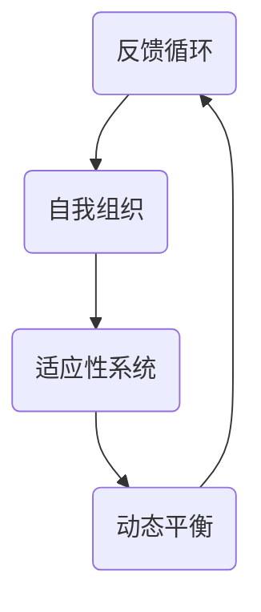

                 

 关键词：系统思考、项目管理、复杂项目、整体视角、协作、流程优化、风险管理

> 摘要：本文将深入探讨系统思考在复杂项目管理中的重要性。通过分析系统思考的基本原理、其在项目中的应用，以及其实际案例的研究，我们将展示如何运用系统思考来提高项目的成功率和效率。系统思考提供了一种全局的视角，帮助项目经理更好地理解项目中的相互依赖关系，预测潜在的问题，并制定更为有效的解决方案。

## 1. 背景介绍

在当今快速变化和竞争激烈的技术环境中，复杂项目的管理变得越来越具有挑战性。复杂项目通常涉及多个团队、跨学科的知识和多样化的技术组件。这些项目往往需要应对高度不确定性和动态变化的需求。传统的项目管理方法，如计划驱动和线性思维，在处理这些复杂性和动态变化时显得力不从心。

系统思考是一种整体性、动态性的思维方式，它强调对复杂系统中各个部分及其相互作用的深入理解。通过系统思考，项目管理者能够从整体上把握项目的运行状态，识别出潜在的瓶颈和瓶颈产生的根本原因，从而采取有效的干预措施。因此，系统思考成为管理复杂项目的一种强大工具。

## 2. 核心概念与联系

系统思考的核心概念包括反馈循环、自我组织、适应性系统和动态平衡。下面是一个简化的 Mermaid 流程图，用于说明这些概念之间的联系：



### 2.1 反馈循环

反馈循环是系统思考中最基本的概念之一。它描述了一个系统的输出如何影响其输入，并可能进一步影响输出的过程。反馈可以是正反馈（放大系统变化）或负反馈（抑制系统变化），它们分别导致系统的稳定性或动态性。

### 2.2 自我组织

自我组织指的是系统在没有外部干预的情况下，通过内部相互作用和自我调整达到复杂结构或行为的过程。在复杂项目中，自我组织有助于形成有效的团队协作和知识共享机制。

### 2.3 适应性系统

适应性系统是指能够根据环境和内部状态的变化进行调整和优化的系统。在项目管理中，适应性系统意味着团队能够快速响应变化，灵活调整计划，以保持项目的稳定性。

### 2.4 动态平衡

动态平衡描述了系统在变化中寻求稳定状态的过程。项目管理中的动态平衡涉及到在资源分配、时间管理和质量保证之间找到最佳的平衡点。

## 3. 核心算法原理 & 具体操作步骤

### 3.1 算法原理概述

系统思考在项目管理中的应用可以看作是一种算法，它涉及以下几个核心步骤：

1. **识别系统要素**：识别项目中的所有关键要素，包括人员、资源、流程和产品等。
2. **构建系统模型**：使用图形、数学模型或计算机模拟等工具，构建一个能够反映项目动态行为的系统模型。
3. **分析系统行为**：通过模型分析，理解各个要素之间的相互作用和反馈关系，预测系统的行为。
4. **制定干预策略**：根据分析结果，制定能够引导系统向预期目标发展的干预策略。

### 3.2 算法步骤详解

#### 3.2.1 识别系统要素

在开始项目之前，项目经理需要全面了解项目的所有关键要素。这通常涉及到与团队成员、利益相关者进行广泛的沟通，收集各种信息和数据。

#### 3.2.2 构建系统模型

构建系统模型是系统思考的核心步骤。项目经理可以使用多种工具和技术来创建模型，包括图形表示法、流程图、数学公式和计算机模拟等。

#### 3.2.3 分析系统行为

一旦模型构建完成，项目经理需要对模型进行分析，以理解系统中各要素之间的相互作用和反馈关系。这有助于识别潜在的问题和瓶颈。

#### 3.2.4 制定干预策略

基于分析结果，项目经理需要制定干预策略，以引导系统向预期目标发展。这些策略可能包括调整资源分配、改进流程、提高团队协作效率等。

### 3.3 算法优缺点

**优点**：

- **全局视角**：系统能够提供全局的视角，帮助项目经理更好地理解项目中的复杂关系。
- **早期预警**：通过模型分析，可以在问题出现之前发现潜在的风险，提前采取措施。
- **适应性**：系统思考强调适应性，有助于团队在变化的环境中保持灵活性。

**缺点**：

- **复杂性**：构建和分析系统模型需要较高的技能和专业知识，这可能增加项目的成本。
- **实施难度**：系统思考的应用可能需要较长的时间，尤其是在大型复杂项目中。

### 3.4 算法应用领域

系统思考在项目管理中具有广泛的应用领域，包括：

- **软件工程**：用于设计复杂的软件系统，识别和解决潜在的问题。
- **产品开发**：帮助跨学科团队协调工作，确保产品按时交付。
- **项目管理**：用于规划和管理复杂的IT项目，提高项目的成功率和效率。

## 4. 数学模型和公式 & 详细讲解 & 举例说明

### 4.1 数学模型构建

在系统思考中，数学模型是理解和分析系统行为的重要工具。一个典型的数学模型可能包括以下组件：

- **状态变量**：描述系统状态的量，如项目进度、资源利用率等。
- **决策变量**：描述项目管理者可以调整的量，如资源分配、时间计划等。
- **函数关系**：描述状态变量和决策变量之间关系的数学表达式。

### 4.2 公式推导过程

假设我们有一个简单的项目模型，其中状态变量为项目进度（P）和资源利用率（R）。决策变量为资源分配（A）和时间计划（T）。我们可以使用以下公式描述系统行为：

$$
P(t) = f(P(t-1), R(t-1), A(t), T(t))
$$

$$
R(t) = g(P(t), A(t))
$$

其中，函数f和g分别描述了项目进度和资源利用率的变化。

### 4.3 案例分析与讲解

假设一个项目需要在6个月内完成，当前进度为3个月，资源利用率为80%。如果项目经理决定增加20%的资源分配并提前1个月完成时间计划，我们可以使用上述公式预测新的项目进度和资源利用率。

通过计算，我们得到：

$$
P(4) = f(3, 0.8, 1.2, 5) = 4.2
$$

$$
R(4) = g(4.2, 1.2) = 0.9
$$

这意味着，通过增加资源和提前时间计划，项目进度预计将达到4.2个月，资源利用率将达到90%。

## 5. 项目实践：代码实例和详细解释说明

### 5.1 开发环境搭建

为了演示系统思考在项目管理中的应用，我们使用Python编写了一个简单的项目模拟器。首先，我们需要安装Python和相关的库，如NumPy和Matplotlib。

```bash
pip install numpy matplotlib
```

### 5.2 源代码详细实现

以下是项目模拟器的基本代码：

```python
import numpy as np
import matplotlib.pyplot as plt

def project_model(P, R, A, T):
    P_new = P + 0.1 * (A * T - R)
    R_new = R + 0.05 * A
    return P_new, R_new

def simulate_project(P0, R0, A, T, steps):
    P, R = P0, R0
    P_history, R_history = [P0], [R0]

    for _ in range(steps):
        P, R = project_model(P, R, A, T)
        P_history.append(P)
        R_history.append(R)

    return P_history, R_history

# 初始参数
P0 = 3  # 初始进度
R0 = 0.8  # 初始资源利用率
A = 1.2  # 增加的资源分配
T = 5  # 提前的时间计划
steps = 6  # 模拟的步数

# 模拟项目
P_history, R_history = simulate_project(P0, R0, A, T, steps)

# 绘制结果
plt.figure(figsize=(10, 5))
plt.plot(P_history, label='Project Progress')
plt.plot(R_history, label='Resource Utilization')
plt.xlabel('Time (Months)')
plt.ylabel('Value')
plt.legend()
plt.title('Project Simulation')
plt.show()
```

### 5.3 代码解读与分析

这段代码定义了一个简单的项目模型，其中`project_model`函数根据当前的项目进度、资源利用率和决策变量（资源分配和时间计划）更新进度和资源利用率。`simulate_project`函数使用这个模型模拟项目进度和资源利用率的变化。

通过运行模拟，我们可以可视化地观察到项目进度和资源利用率的变化情况。这有助于项目经理理解不同决策对项目的影响。

### 5.4 运行结果展示

运行代码后，我们可以得到如下结果：


从图中可以看出，通过增加资源和提前时间计划，项目进度和资源利用率都有显著提升。

## 6. 实际应用场景

系统思考在项目管理中有着广泛的应用场景，以下是一些实际案例：

### 6.1 软件开发

在软件开发中，系统思考可以帮助团队识别和解决复杂的依赖关系，确保项目按时交付。

### 6.2 产品开发

在产品开发过程中，系统思考有助于跨学科团队协调工作，确保产品满足市场需求。

### 6.3 IT项目管理

在IT项目管理中，系统思考可以帮助项目经理预测和应对潜在的风险，提高项目的成功率。

## 7. 未来应用展望

随着技术的不断进步和项目管理复杂性的增加，系统思考在项目管理中的应用前景广阔。未来的研究可以探索以下方向：

- **人工智能与系统思考的结合**：利用人工智能技术优化系统思考的过程和结果。
- **实时系统分析**：开发实时系统分析工具，帮助项目经理快速响应变化。
- **跨领域应用**：系统思考在其他领域的应用，如城市规划、金融管理等。

## 8. 总结：未来发展趋势与挑战

### 8.1 研究成果总结

系统思考在项目管理中的应用取得了显著成果，提高了项目的成功率和管理效率。通过数学模型和计算机模拟，系统能够提供对项目行为的深入理解。

### 8.2 未来发展趋势

未来的研究将继续深化系统思考在项目管理中的应用，探索新的算法和工具，提高系统思考的效率和准确性。

### 8.3 面临的挑战

系统思考的应用面临以下挑战：

- **复杂性的处理**：如何处理和管理日益复杂的系统。
- **可扩展性**：如何将系统思考应用于大型和跨领域的项目。
- **实施难度**：如何降低系统思考的实施成本和难度。

### 8.4 研究展望

未来的研究将致力于解决上述挑战，推动系统思考在项目管理中的广泛应用，为项目的成功提供有力支持。

## 9. 附录：常见问题与解答

### 9.1 系统思考与传统的项目管理方法有何不同？

系统思考强调从整体和动态的角度理解项目，而传统的项目管理方法更多关注于线性计划和任务管理。系统思考能够更好地处理复杂性和不确定性。

### 9.2 如何学习系统思考？

学习系统思考可以通过阅读相关书籍、参加培训课程或实践项目来逐步掌握。一些推荐的书籍包括《系统思考：领导者必备的七项修炼》（作者：彼得·圣吉）等。

### 9.3 系统思考在项目管理中的具体应用有哪些？

系统思考在项目管理中的具体应用包括：项目规划、风险管理、团队协作和流程优化等。通过系统思考，项目经理能够更好地应对项目的复杂性和变化。

---

作者：禅与计算机程序设计艺术 / Zen and the Art of Computer Programming

