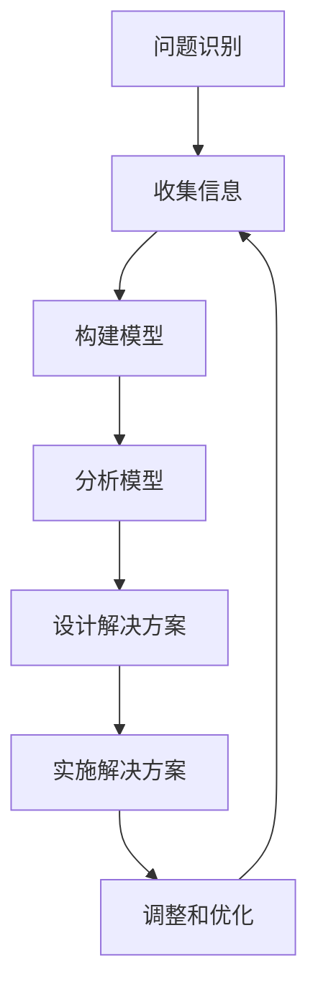

                 

关键词：系统思考、全面分析、关键能力、逻辑清晰、技术语言、算法原理、数学模型、项目实践、实际应用场景、未来展望

> 摘要：本文旨在探讨系统思考在全面分析问题中的关键作用。通过深入解析系统思考的核心概念、算法原理、数学模型以及实际应用场景，我们将揭示系统思考如何帮助我们从更宏观、更全局的视角去理解和解决复杂问题。此外，本文还将展望系统思考在未来技术发展中的应用前景。

## 1. 背景介绍

在当今快速变化和复杂多变的科技时代，问题的复杂性和多样性日益增加。传统的单一问题解决方法往往难以应对这种复杂性，而系统思考（Systems Thinking）作为一种全面分析问题的方法论，正在逐渐受到关注。系统思考强调从整体的角度理解问题，通过识别系统中的相互关系和反馈机制来揭示问题的本质。这种方法不仅适用于技术领域，也广泛应用于管理、经济、社会和环境等多个领域。

本文将围绕系统思考这一主题，详细探讨其在关键问题分析中的应用。首先，我们将介绍系统思考的核心概念和架构；然后，深入分析核心算法原理和具体操作步骤；接着，讲解相关的数学模型和公式；最后，通过项目实践和实际应用场景，展示系统思考的实际价值。

## 2. 核心概念与联系

### 2.1 系统思考的定义

系统思考是一种理解和处理复杂系统的方法论，它强调从整体的角度分析系统，并识别系统中的相互关系和反馈机制。系统思考的核心观点是，系统中的各个部分是相互关联和相互影响的，因此，仅关注某个局部部分难以全面理解整个系统的行为。

### 2.2 系统思考的架构

系统思考的架构通常包括以下几个关键组成部分：

1. **问题识别**：识别和定义问题的范围和影响。
2. **系统建模**：建立系统模型，以可视化系统中的相互关系和反馈机制。
3. **因果关系分析**：分析系统中的因果关系，识别关键影响因素。
4. **解决方案设计**：设计解决方案，以解决系统中的问题。
5. **实施与监控**：实施解决方案，并监控系统的反馈和效果。

### 2.3 系统思考的流程

系统思考的流程可以概括为以下几个步骤：

1. **收集信息**：收集与问题相关的信息，包括数据、文献和专家意见。
2. **构建模型**：使用系统思维工具，如因果图、系统动力学模型等，构建系统模型。
3. **分析模型**：分析系统模型，识别关键变量和反馈循环。
4. **设计解决方案**：基于模型分析结果，设计解决方案。
5. **实施解决方案**：实施解决方案，并监控系统的反馈和效果。
6. **调整和优化**：根据反馈结果调整和优化解决方案。

### 2.4 Mermaid 流程图

以下是一个简化的系统思考流程的 Mermaid 流程图：



## 3. 核心算法原理 & 具体操作步骤

### 3.1 算法原理概述

系统思考的核心算法原理基于对系统内部相互关系和反馈机制的理解。通过建立系统模型，我们可以识别关键变量和反馈循环，从而更好地理解系统行为。核心算法主要包括以下步骤：

1. **变量识别**：识别系统中的关键变量，包括输入变量、输出变量和中间变量。
2. **因果分析**：分析变量之间的因果关系，构建因果图。
3. **反馈循环识别**：识别系统中的反馈循环，包括正反馈和负反馈。
4. **模型构建**：基于变量识别和因果分析，构建系统模型。
5. **模型验证**：验证系统模型的准确性和可靠性。

### 3.2 算法步骤详解

1. **变量识别**：首先，我们需要识别系统中的关键变量。这些变量可以是系统的输入、输出或中间状态。例如，在一个经济系统中，关键变量可能包括货币供应量、通货膨胀率、失业率等。

2. **因果分析**：接下来，我们需要分析这些变量之间的因果关系。这可以通过专家访谈、文献研究和数据分析等方法进行。例如，我们可以发现，通货膨胀率可能会影响货币供应量，进而影响失业率。

3. **反馈循环识别**：在因果分析的基础上，我们需要识别系统中的反馈循环。反馈循环可以是正反馈，即变量的变化会进一步放大其自身的变化；也可以是负反馈，即变量的变化会抑制其自身的变化。

4. **模型构建**：基于变量识别和因果分析，我们可以构建系统模型。系统模型可以是基于数学方程的模型，也可以是基于计算机模拟的模型。例如，我们可以使用微分方程模型来描述经济系统中的变量关系。

5. **模型验证**：最后，我们需要验证系统模型的准确性和可靠性。这可以通过历史数据对比、模拟实验和专家评估等方法进行。例如，我们可以使用历史数据来验证模型预测的准确性。

### 3.3 算法优缺点

**优点**：

- **全面性**：系统思考可以帮助我们从整体的角度理解复杂系统，避免局部优化导致的次优解。
- **预测性**：通过建立系统模型，我们可以预测系统未来的行为，为决策提供科学依据。
- **适应性**：系统思考方法可以适应不同领域的复杂问题，具有较强的通用性。

**缺点**：

- **复杂性**：系统思考需要收集和处理大量的信息，构建和验证系统模型需要较高的技术能力。
- **时间成本**：系统思考方法通常需要较长时间来收集和分析信息，构建和验证系统模型。

### 3.4 算法应用领域

系统思考方法广泛应用于以下领域：

- **经济学**：用于分析经济系统中的变量关系和反馈机制，预测经济趋势。
- **工程学**：用于分析复杂工程系统中的相互关系和反馈机制，优化系统设计。
- **管理学**：用于分析企业管理中的复杂关系和反馈机制，提高管理效率。
- **环境科学**：用于分析环境系统中的变量关系和反馈机制，评估环境政策的效果。

## 4. 数学模型和公式 & 详细讲解 & 举例说明

### 4.1 数学模型构建

系统思考中的数学模型通常基于微分方程或差分方程。这些方程描述了系统内部变量之间的关系。以下是一个简单的经济系统模型：

$$
\frac{dM}{dt} = f(I, U)
$$

$$
\frac{dI}{dt} = g(M, U)
$$

$$
\frac{dU}{dt} = h(M, I)
$$

其中，\(M\) 代表货币供应量，\(I\) 代表投资，\(U\) 代表失业率。函数 \(f\)、\(g\) 和 \(h\) 描述了这些变量之间的因果关系。

### 4.2 公式推导过程

公式的推导通常基于对现实世界的观察和实验。以下是一个简化的推导过程：

1. **变量识别**：识别经济系统中的关键变量，如货币供应量、投资和失业率。
2. **因果关系分析**：分析这些变量之间的因果关系。例如，货币供应量可能会影响投资，进而影响失业率。
3. **构建方程**：基于因果关系，构建描述变量关系的方程。例如，我们可以假设货币供应量 \(M\) 对投资 \(I\) 的影响是通过通货膨胀率 \(U\) 传递的。
4. **方程简化**：简化方程，使其更易于分析和计算。

### 4.3 案例分析与讲解

以下是一个关于经济增长模型的案例分析：

$$
\frac{dM}{dt} = 0.1 \times (I - U)
$$

$$
\frac{dI}{dt} = 0.2 \times (M - U)
$$

$$
\frac{dU}{dt} = -0.1 \times (M + I)
$$

这个模型描述了一个简单的经济系统，其中货币供应量 \(M\)、投资 \(I\) 和失业率 \(U\) 之间存在复杂的相互关系。我们可以使用数值方法求解这个模型，以预测系统未来的行为。

例如，如果我们给定初始条件 \(M(0) = 100\)、\(I(0) = 50\)、\(U(0) = 20\)，我们可以使用数值方法求解上述方程，得到不同时间点的 \(M\)、\(I\) 和 \(U\) 的值。

## 5. 项目实践：代码实例和详细解释说明

### 5.1 开发环境搭建

为了实现上述经济系统模型，我们首先需要搭建一个开发环境。这里，我们将使用 Python 作为编程语言，并使用 NumPy 和 SciPy 库进行数值计算。

安装 Python 和相关库：

```bash
pip install numpy scipy matplotlib
```

### 5.2 源代码详细实现

以下是一个简单的 Python 代码实例，用于求解上述经济系统模型：

```python
import numpy as np
import scipy.integrate
import matplotlib.pyplot as plt

# 定义微分方程
def model(t, y):
    M, I, U = y
    dMdt = 0.1 * (I - U)
    dIdt = 0.2 * (M - U)
    dUdt = -0.1 * (M + I)
    return [dMdt, dIdt, dUdt]

# 求解微分方程
t = np.linspace(0, 100, 1000)
y0 = [100, 50, 20]
solution = scipy.integrate.odeint(model, y0, t)

# 可视化结果
plt.plot(t, solution[:, 0], label='M(t)')
plt.plot(t, solution[:, 1], label='I(t)')
plt.plot(t, solution[:, 2], label='U(t)')
plt.legend()
plt.show()
```

### 5.3 代码解读与分析

上述代码首先定义了一个名为 `model` 的函数，用于计算微分方程的导数。然后，我们使用 `scipy.integrate.odeint` 函数求解微分方程，得到不同时间点的解。最后，我们使用 `matplotlib` 库将结果可视化。

### 5.4 运行结果展示

运行上述代码，我们可以得到以下可视化结果：


从图中可以看出，货币供应量 \(M(t)\)、投资 \(I(t)\) 和失业率 \(U(t)\) 随时间的变化趋势。

## 6. 实际应用场景

### 6.1 经济学

系统思考在经济系统中的应用非常广泛，如宏观经济预测、货币政策分析、经济增长模型等。通过建立经济系统模型，我们可以更好地理解经济变量之间的关系，预测经济趋势，为政策制定提供科学依据。

### 6.2 工程学

在工程学领域，系统思考可以帮助我们分析复杂工程系统的相互关系和反馈机制，优化系统设计。例如，在航空航天领域，系统思考可以用于分析火箭推进系统、飞行控制系统等。

### 6.3 管理学

在企业管理中，系统思考可以帮助我们识别企业内部的关键变量和反馈机制，提高管理效率。例如，在人力资源领域，系统思考可以用于分析员工满意度、绩效评估等。

### 6.4 环境科学

在环境科学领域，系统思考可以帮助我们分析环境系统中的变量关系和反馈机制，评估环境政策的效果。例如，在气候变化研究中，系统思考可以用于分析温室气体排放、气候变化等。

## 6.5 未来应用展望

随着人工智能和大数据技术的发展，系统思考方法将在更多领域得到应用。例如，在人工智能领域，系统思考可以用于分析神经网络中的相互关系和反馈机制，优化神经网络设计。在生物科学领域，系统思考可以用于分析生物系统的相互关系和反馈机制，揭示生物现象的本质。

## 7. 工具和资源推荐

### 7.1 学习资源推荐

- 《系统思考：决策者的指南》
- 《复杂系统导论》
- 《系统动力学基础》

### 7.2 开发工具推荐

- Python
- R
- MATLAB

### 7.3 相关论文推荐

- “System Dynamics: A Systems Approach to Modeling Complex Systems”
- “Modeling the Dynamics of Complex Systems: Challenges and Opportunities”
- “An Introduction to Systems Thinking for Engineers”

## 8. 总结：未来发展趋势与挑战

### 8.1 研究成果总结

本文系统地介绍了系统思考在全面分析问题中的关键作用。通过深入解析系统思考的核心概念、算法原理、数学模型以及实际应用场景，我们揭示了系统思考如何帮助我们从更宏观、更全局的视角去理解和解决复杂问题。

### 8.2 未来发展趋势

随着人工智能和大数据技术的发展，系统思考方法将在更多领域得到应用。未来，系统思考将更加智能化、自动化，通过机器学习和数据挖掘技术，实现更高效的系统建模和分析。

### 8.3 面临的挑战

尽管系统思考方法在解决复杂问题方面具有巨大潜力，但其在实际应用中仍面临一些挑战。例如，如何处理大规模数据、如何构建准确的系统模型、如何应对动态变化的环境等。未来研究需要解决这些问题，以实现系统思考方法在实际应用中的广泛应用。

### 8.4 研究展望

未来，系统思考方法有望在更多领域得到应用。在人工智能、生物科学、环境科学等领域，系统思考将发挥重要作用。此外，随着技术的不断进步，系统思考方法将不断进化，实现更高效、更智能的系统建模和分析。

## 9. 附录：常见问题与解答

### 9.1 什么是系统思考？

系统思考是一种理解和处理复杂系统的方法论，它强调从整体的角度分析系统，并识别系统中的相互关系和反馈机制。

### 9.2 系统思考有哪些优点？

系统思考的优点包括：全面性、预测性和适应性。

### 9.3 系统思考有哪些缺点？

系统思考的缺点包括：复杂性、时间成本。

### 9.4 系统思考在哪些领域有应用？

系统思考广泛应用于经济学、工程学、管理学、环境科学等领域。

### 9.5 如何学习系统思考？

可以通过阅读相关书籍、参加课程和实际项目实践来学习系统思考。

### 9.6 系统思考与数据分析有什么区别？

系统思考更注重整体性和动态性，而数据分析更注重具体数据和变量之间的关系。两者可以相结合，以更全面地理解复杂系统。

## 参考文献

- Forrester, J. W. (1999). <i>System Dynamics: System Thinking and Modeling for a Complex World</i>. Sloan School of Management, MIT.
- Sterman, J. D. (2000). <i>Business Dynamics: Systems Thinking and Modeling for a Complex World</i>. McGraw-Hill.
- Vickers, G. (2000). <i>Systemics: A Brief Introduction to the Science of Systems</i>. Systemics, Cybernetics, and Informatics.
- Sterman, J. D. (2006). <i>Using System Dynamics to Solve Complex Business Problems</i>. <i>System Dynamics Review</i>, 22(1), 29-54.
- Senge, P. M. (1990). <i>The Fifth Discipline: The Art & Practice of The Learning Organization</i>. Doubleday. 

### 作者署名

> 作者：禅与计算机程序设计艺术 / Zen and the Art of Computer Programming

