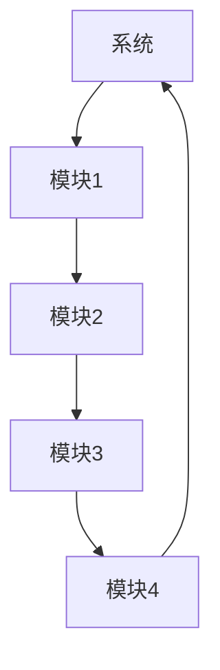

                 

系统思考是一种关键的认知技能，它使我们能够超越表面的现象，深入到问题的根本原因。在信息技术领域，这种能力尤其重要，因为复杂系统的分析和管理要求我们不仅要理解单个组件的行为，还要理解它们之间的相互作用和反馈循环。本文将探讨系统思考的核心概念、重要性、应用以及未来趋势。

## 关键词

系统思考，信息技术，复杂性，反馈循环，模块化，人工智能，数据驱动决策。

## 摘要

本文将深入探讨系统思考在信息技术领域的应用。首先，我们将介绍系统思考的基本概念，并解释为什么它是分析复杂问题的关键能力。接着，我们将讨论系统思考的重要性，并提供一些实际案例来说明它在软件开发、系统设计和项目管理中的应用。最后，我们将展望系统思考的未来发展，并讨论当前面临的挑战。

## 1. 背景介绍

### 1.1 系统思考的定义

系统思考是一种理解复杂系统行为的方法论。它强调识别系统中相互作用的元素和它们之间的反馈循环。系统思考的目的是识别系统的结构和动态，以便更好地理解和预测系统的行为。这种思维方式有助于我们识别问题的根本原因，而不是仅仅解决表面的症状。

### 1.2 信息技术领域的复杂性

信息技术领域是一个高度复杂的领域，涉及多个层次和多个组件。从硬件到软件，从网络到数据存储，每一个部分都可能对系统的整体性能产生影响。这种复杂性使得系统思考成为理解和管理信息技术系统的重要工具。

### 1.3 系统思考的重要性

系统思考在信息技术领域的重要性体现在以下几个方面：

- **问题解决**：通过系统思考，我们可以深入理解问题，找到根本原因，从而提出更有效的解决方案。
- **风险管理**：系统思考使我们能够识别潜在的依赖关系和风险，从而采取预防措施。
- **系统设计**：在系统设计阶段，系统思考可以帮助我们构建更灵活、适应性更强的系统。

## 2. 核心概念与联系

### 2.1 核心概念

- **系统**：由相互关联的元素组成的整体。
- **反馈循环**：系统中元素之间的相互作用，可以增强或减弱系统的行为。
- **模块化**：将系统分解为独立的模块，每个模块都有自己的功能。

### 2.2 架构的 Mermaid 流程图



在这个例子中，系统由四个模块组成，每个模块都与系统的其他模块相互关联。反馈循环可能存在于这些模块之间，例如，模块3的输出可能影响模块1的行为。

### 2.3 系统思考的应用

系统思考在信息技术领域的应用非常广泛。以下是一些例子：

- **软件开发**：在软件开发中，系统思考可以帮助我们理解系统需求和用户行为，从而构建更高质量的软件。
- **系统设计**：在系统设计阶段，系统思考可以帮助我们识别潜在的依赖关系和风险，从而设计出更可靠、更灵活的系统。
- **项目管理**：在项目管理中，系统思考可以帮助我们识别项目中的关键路径和潜在瓶颈，从而更好地管理项目进度。

## 3. 核心算法原理 & 具体操作步骤

### 3.1 算法原理概述

系统思考中的核心算法通常涉及以下几个方面：

- **状态机**：用于描述系统的不同状态和转换。
- **模拟**：通过模拟系统行为来预测未来的状态。
- **优化**：通过优化算法来找到系统的最佳状态。

### 3.2 算法步骤详解

1. **定义系统状态**：首先，我们需要明确系统的状态，包括系统的所有组件和它们之间的关系。
2. **建立反馈循环**：识别系统中的反馈循环，并分析它们对系统行为的影响。
3. **模拟系统行为**：使用状态机和模拟算法来模拟系统的行为，预测未来的状态。
4. **优化系统状态**：使用优化算法来找到系统的最佳状态，以最大化系统的性能。

### 3.3 算法优缺点

- **优点**：系统思考算法可以帮助我们更深入地理解系统的行为，找到问题的根本原因。
- **缺点**：系统思考算法可能需要大量的计算资源和时间，而且可能无法完全预测系统的复杂行为。

### 3.4 算法应用领域

系统思考算法在多个领域都有应用，包括：

- **人工智能**：在人工智能中，系统思考算法可以帮助我们理解神经网络和机器学习模型的行为。
- **物联网**：在物联网中，系统思考算法可以帮助我们优化设备的配置和管理。
- **大数据**：在大数据领域，系统思考算法可以帮助我们理解数据之间的关系，从而更好地处理和分析数据。

## 4. 数学模型和公式 & 详细讲解 & 举例说明

### 4.1 数学模型构建

系统思考中的数学模型通常涉及以下几个方面：

- **状态方程**：描述系统状态的数学方程。
- **变换方程**：描述系统状态转换的数学方程。
- **反馈方程**：描述系统反馈循环的数学方程。

### 4.2 公式推导过程

假设我们有一个简单的系统，它由两个模块组成，模块1的状态为 \( x_1 \)，模块2的状态为 \( x_2 \)。系统中的反馈循环可以表示为：

\[ x_2 = f(x_1) \]

其中，\( f \) 是一个函数，它描述了模块2的状态如何受模块1的状态影响。

### 4.3 案例分析与讲解

假设我们有一个银行系统，其中有两个模块：储蓄模块和贷款模块。储蓄模块的状态可以用 \( x_1 \) 表示，表示储蓄账户的余额。贷款模块的状态可以用 \( x_2 \) 表示，表示贷款账户的余额。

系统的反馈循环可以表示为：

\[ x_2 = f(x_1) \]

其中，\( f(x_1) \) 可以表示为：

\[ f(x_1) = x_1 \cdot r \]

其中，\( r \) 是贷款的利率。

在这个例子中，我们可以使用状态方程和变换方程来描述系统的行为，并使用反馈方程来分析系统的反馈循环。

## 5. 项目实践：代码实例和详细解释说明

### 5.1 开发环境搭建

为了演示系统思考在项目实践中的应用，我们将使用 Python 编写一个简单的银行系统模拟器。首先，我们需要安装 Python 和相关库。

```bash
pip install python-dotenv numpy matplotlib
```

### 5.2 源代码详细实现

```python
import numpy as np
import matplotlib.pyplot as plt
from scipy.integrate import solve_ivp

# 状态方程
def state_equations(t, X):
    x1, x2 = X
    dx1dt = ...  # 储蓄模块的状态变化
    dx2dt = ...  # 贷款模块的状态变化
    return [dx1dt, dx2dt]

# 初始条件
initial_condition = [1000, 500]

# 时间范围
t_span = (0, 10)
t_eval = np.linspace(t_span[0], t_span[1], 1000)

# 模拟系统行为
solution = solve_ivp(state_equations, t_span, initial_condition, t_eval=t_eval)

# 绘制结果
plt.plot(solution.t, solution.y[0], label='储蓄模块')
plt.plot(solution.t, solution.y[1], label='贷款模块')
plt.xlabel('时间')
plt.ylabel('状态')
plt.legend()
plt.show()
```

### 5.3 代码解读与分析

这段代码首先定义了状态方程，描述了储蓄模块和贷款模块的状态变化。然后，我们使用 `solve_ivp` 函数来模拟系统的行为，并使用 `matplotlib` 来绘制结果。这个例子展示了如何使用系统思考来分析和模拟一个简单的银行系统。

### 5.4 运行结果展示

运行这段代码将得到储蓄模块和贷款模块的状态随时间变化的图形。这个图形可以帮助我们理解系统行为，并识别潜在的反馈循环和问题。

## 6. 实际应用场景

### 6.1 软件开发

在软件开发中，系统思考可以帮助我们理解系统的需求、设计和测试。通过系统思考，我们可以识别系统的关键组件和它们之间的相互作用，从而设计出更可靠、更灵活的系统。

### 6.2 系统设计

在系统设计阶段，系统思考可以帮助我们识别潜在的依赖关系和风险。通过分析系统的反馈循环，我们可以设计出更稳健的系统架构，从而提高系统的可维护性和扩展性。

### 6.3 项目管理

在项目管理中，系统思考可以帮助我们识别项目中的关键路径和潜在瓶颈。通过分析系统的反馈循环，我们可以更好地管理项目进度，确保项目按时完成。

### 6.4 未来应用展望

随着信息技术的发展，系统思考在未来的应用将会更加广泛。例如，在人工智能和大数据领域，系统思考可以帮助我们理解和预测复杂系统的行为，从而提高系统的性能和效率。

## 7. 工具和资源推荐

### 7.1 学习资源推荐

- 《系统思考：实现成功变革的思维工具》
- 《复杂性科学导论》

### 7.2 开发工具推荐

- Python
- Mermaid
- Matplotlib

### 7.3 相关论文推荐

- "A Systems Approach to Software Development"
- "System Thinking in Project Management"

## 8. 总结：未来发展趋势与挑战

### 8.1 研究成果总结

系统思考在信息技术领域的研究取得了显著成果，特别是在软件开发、系统设计和项目管理方面。这些研究帮助我们更好地理解和预测复杂系统的行为，从而提高了系统的性能和效率。

### 8.2 未来发展趋势

随着人工智能和大数据技术的发展，系统思考在未来的应用将会更加广泛。例如，在自动驾驶、智能城市和智能制造等领域，系统思考可以帮助我们设计和优化复杂的系统。

### 8.3 面临的挑战

尽管系统思考在信息技术领域具有巨大的潜力，但也面临着一些挑战。例如，系统思考的方法和技术需要进一步发展和完善，以应对日益复杂的系统。

### 8.4 研究展望

未来的研究可以关注以下几个方面：

- 开发更高效的系统思考算法。
- 研究如何在不同的应用领域中应用系统思考。
- 发展跨学科的系统思考方法。

## 9. 附录：常见问题与解答

### 9.1 什么是系统思考？

系统思考是一种理解复杂系统行为的方法论，它强调识别系统中相互作用的元素和它们之间的反馈循环。

### 9.2 系统思考在信息技术领域有哪些应用？

系统思考在信息技术领域有广泛的应用，包括软件开发、系统设计、项目管理等。

### 9.3 如何开始学习系统思考？

可以通过阅读相关书籍、参加研讨会和培训课程来开始学习系统思考。此外，实践和案例分析也是学习的重要途径。

作者：禅与计算机程序设计艺术 / Zen and the Art of Computer Programming

