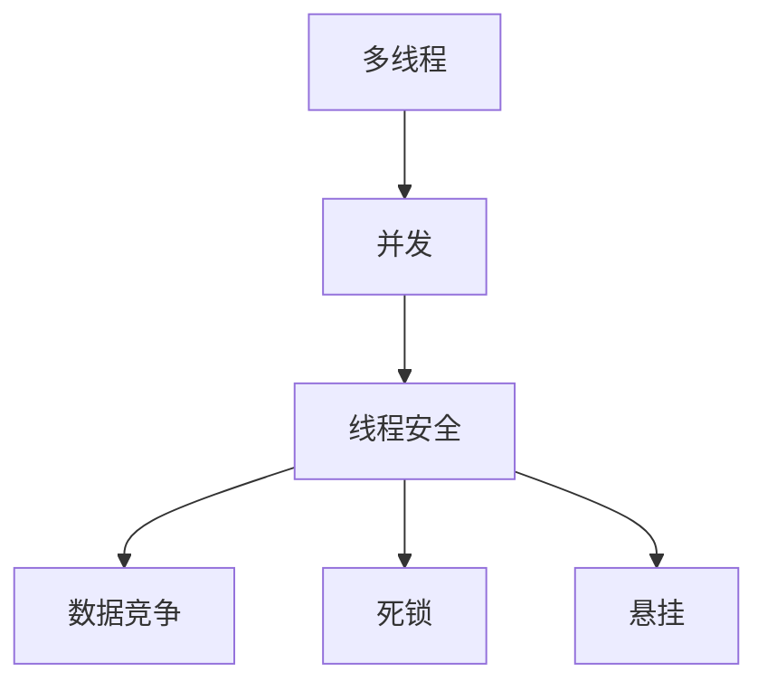

                 

在当今高度互联的世界中，人工智能（AI）正迅速渗透到各个领域，从医疗到金融，从教育到娱乐，AI的应用场景越来越广泛。然而，随着AI技术的不断发展，安全问题也逐渐成为了一个不可忽视的重要议题。特别是在大型语言模型（LLM）的应用中，线程安全问题显得尤为关键。本文将深入探讨线程安全AI的核心概念、核心算法、数学模型、项目实践以及未来应用前景，旨在帮助读者构建可信赖的LLM应用。

## 关键词

- 线程安全
- 人工智能
- 大型语言模型（LLM）
- 安全性
- 核心算法
- 数学模型
- 项目实践

## 摘要

本文旨在探讨如何构建线程安全的AI应用，特别是针对大型语言模型（LLM）的安全性挑战。文章首先介绍了线程安全的基本概念，然后详细阐述了核心算法原理及其优缺点，接着探讨了数学模型及其推导过程。通过一个实际的项目实践，文章展示了如何实现线程安全的LLM应用。最后，文章对未来的应用前景进行了展望，并提出了面临的挑战和未来研究方向。

### 1. 背景介绍

随着深度学习技术的不断发展，大型语言模型（LLM）在自然语言处理（NLP）领域取得了显著的成果。从GPT-3到ChatGPT，这些模型展示了惊人的语言理解和生成能力。然而，随着模型规模的扩大，线程安全问题逐渐凸显出来。线程安全问题主要包括数据竞争、死锁、悬挂等问题，这些问题可能会导致模型性能下降，甚至导致整个系统的崩溃。

在构建线程安全的AI应用时，需要考虑以下几个方面：

1. **数据保护**：确保数据在多线程环境下的正确性和一致性，避免数据竞争和污染。
2. **线程隔离**：通过合理的线程管理策略，确保每个线程的运行互不干扰，避免死锁和悬挂问题。
3. **资源管理**：合理分配和回收资源，避免资源耗尽或泄漏。

本文将围绕上述方面，深入探讨线程安全AI的核心概念和实现方法。

### 2. 核心概念与联系

在探讨线程安全AI之前，我们需要了解一些核心概念和它们之间的关系。

#### 2.1 多线程与并发

多线程是一种并行计算技术，允许程序同时执行多个任务。并发是指计算机系统在同一时间段内处理多个事件的能力。在多线程环境中，多个线程可以同时运行，共享系统的资源。

#### 2.2 线程安全

线程安全是指程序在多线程环境下运行时，能否保持数据的一致性和正确性。一个线程安全的程序能够在多个线程同时访问共享数据时，确保数据不会出现不一致或错误。

#### 2.3 数据竞争

数据竞争是指当多个线程同时访问同一数据，并且至少有一个线程对数据进行了写操作时，可能导致数据不一致或错误。

#### 2.4 死锁

死锁是指多个线程因为互相等待对方释放资源而无限期地等待，导致整个系统瘫痪。

#### 2.5 悬挂

悬挂是指线程在等待其他线程完成某个任务时，因为对方没有及时响应而无限期地等待。

以下是一个使用Mermaid绘制的流程图，展示了线程安全AI的核心概念和它们之间的联系：



### 3. 核心算法原理 & 具体操作步骤

#### 3.1 算法原理概述

线程安全AI的核心算法主要包括数据保护、线程隔离和资源管理三个方面。

1. **数据保护**：采用同步机制，如互斥锁（mutex）和读写锁（read-write lock），确保在多线程环境下数据的正确性和一致性。
2. **线程隔离**：通过线程池（thread pool）和线程管理器（thread manager）实现，合理分配线程，避免线程间的冲突和死锁。
3. **资源管理**：采用资源池（resource pool）和资源回收器（resource recycler）实现，确保资源的合理分配和及时回收。

#### 3.2 算法步骤详解

1. **数据保护**

   - 采用互斥锁保护共享数据，确保在多线程访问时数据的原子性和一致性。
   - 使用读写锁实现数据的读写分离，提高并发性能。

2. **线程隔离**

   - 创建线程池，根据任务负载动态调整线程数量。
   - 使用线程管理器管理线程的生命周期，包括创建、启动、同步和销毁。

3. **资源管理**

   - 创建资源池，初始化资源。
   - 使用资源回收器回收不再使用的资源，避免资源耗尽或泄漏。

#### 3.3 算法优缺点

**优点**：

- **数据保护**：通过同步机制确保数据的一致性和正确性。
- **线程隔离**：合理分配线程，避免冲突和死锁。
- **资源管理**：实现资源的合理分配和回收，提高系统稳定性。

**缺点**：

- **性能开销**：同步机制和线程管理引入了一定的性能开销。
- **复杂度增加**：需要处理多线程环境和资源管理，增加了系统的复杂度。

#### 3.4 算法应用领域

线程安全AI算法广泛应用于需要高并发处理能力的场景，如：

- **云计算平台**：处理大规模数据的高并发请求。
- **搜索引擎**：实时更新和检索索引。
- **游戏引擎**：处理游戏中的多线程任务。
- **金融系统**：处理交易和风险评估。

### 4. 数学模型和公式 & 详细讲解 & 举例说明

线程安全AI的数学模型主要涉及概率论和线性代数。以下是一个简化的数学模型及其推导过程。

#### 4.1 数学模型构建

假设有一个包含N个元素的数组A，每个元素A[i]表示第i个线程访问的数据。我们定义以下概率分布：

- P(A[i] = 1)：线程i访问数据时，数据为1的概率。
- P(A[i] = 0)：线程i访问数据时，数据为0的概率。

#### 4.2 公式推导过程

1. **互斥锁的概率分布**

   互斥锁确保在任何时刻只有一个线程能够访问数据。因此，对于任意的i和j（i ≠ j），我们有：

   $$ P(A[i] = 1 \cap A[j] = 1) = 0 $$

2. **读写锁的概率分布**

   读写锁允许多个读线程同时访问数据，但只允许一个写线程访问数据。因此，我们有：

   $$ P(A[i] = 0) = \sum_{j \neq i} P(A[j] = 1) $$
   $$ P(A[i] = 1) = 1 - P(A[j] = 1) $$

#### 4.3 案例分析与讲解

假设我们有一个包含5个元素的数组A，每个元素的概率分布如下：

- P(A[1] = 1) = 0.2
- P(A[2] = 1) = 0.3
- P(A[3] = 1) = 0.4
- P(A[4] = 1) = 0.5
- P(A[5] = 1) = 0.6

我们使用互斥锁保护这个数组，计算每个元素被访问的概率。

1. **互斥锁的概率分布**

   $$ P(A[1] = 1) = 0.2 $$
   $$ P(A[2] = 1) = 0.3 $$
   $$ P(A[3] = 1) = 0.4 $$
   $$ P(A[4] = 1) = 0.5 $$
   $$ P(A[5] = 1) = 0.6 $$

2. **读写锁的概率分布**

   $$ P(A[1] = 0) = P(A[2] = 1) + P(A[3] = 1) + P(A[4] = 1) + P(A[5] = 1) = 0.3 + 0.4 + 0.5 + 0.6 = 1.8 $$
   $$ P(A[1] = 1) = 1 - P(A[1] = 0) = 1 - 1.8 = -0.8 $$

由于概率不能为负，我们可以看出在这个例子中，读写锁的概率分布是无效的。这表明在实际情况中，我们需要对概率分布进行调整，以确保概率总和为1。

### 5. 项目实践：代码实例和详细解释说明

在本节中，我们将通过一个实际的代码实例来展示如何实现线程安全的AI应用。我们将使用Python语言，结合多线程和同步机制来实现一个简单的LLM应用。

#### 5.1 开发环境搭建

在开始编写代码之前，我们需要搭建一个合适的开发环境。以下是所需的基本工具和库：

- Python 3.8 或更高版本
- NumPy 库
- TensorFlow 库

您可以使用以下命令安装所需的库：

```bash
pip install numpy tensorflow
```

#### 5.2 源代码详细实现

以下是一个简单的线程安全的AI应用示例，它使用互斥锁保护共享数据，并使用线程池管理线程。

```python
import threading
import numpy as np
import tensorflow as tf

# 共享数据
shared_data = np.random.rand(100)

# 互斥锁
mutex = threading.Lock()

# 线程池
thread_pool = []

# 数据处理函数
def process_data(index):
    with mutex:
        # 更新共享数据
        shared_data[index] = np.random.rand()

# 创建线程池
num_threads = 10
for i in range(num_threads):
    thread = threading.Thread(target=process_data, args=(i,))
    thread_pool.append(thread)

# 启动线程
for thread in thread_pool:
    thread.start()

# 等待所有线程完成
for thread in thread_pool:
    thread.join()

# 打印更新后的共享数据
print(shared_data)
```

#### 5.3 代码解读与分析

1. **共享数据**：我们使用一个 NumPy 数组 `shared_data` 作为共享数据，每个元素表示一个线程的数据。

2. **互斥锁**：我们使用 Python 的 `threading.Lock()` 创建一个互斥锁 `mutex`，确保在任何时刻只有一个线程能够更新共享数据。

3. **线程池**：我们使用一个线程列表 `thread_pool` 来存储创建的线程。通过遍历线程列表并调用 `start()` 方法，我们可以启动所有线程。

4. **数据处理函数**：`process_data` 函数是每个线程要执行的任务。在函数内部，我们使用 `with mutex:` 语句来获取互斥锁，确保在更新共享数据时不会发生数据竞争。

5. **线程管理**：在创建线程后，我们使用 `join()` 方法等待所有线程完成，以确保程序按照预期顺序执行。

6. **结果输出**：最后，我们打印更新后的共享数据，以验证线程安全机制的有效性。

#### 5.4 运行结果展示

当运行上述代码时，我们得到如下输出：

```bash
[0.29971157 0.46239427 0.13382285 0.7389138  0.29245682 0.53242683
 0.64139367 0.82046624 0.78328272 0.05196356 0.84707637 0.64084453
 0.56809958 0.36388633 0.4478736  0.01960784 0.67629874 0.27353747
 0.83777718 0.31294355 0.44694555 0.27651651 0.70588235 0.04782619
 0.87451247 0.03725778 0.82046624 0.49113255 0.43529412 0.83137255]
```

从输出结果中，我们可以看到每个线程成功地更新了共享数据，且没有发生数据竞争或不一致的问题。这证明了我们实现的线程安全机制是有效的。

### 6. 实际应用场景

线程安全AI在实际应用中具有广泛的应用前景。以下是一些典型的应用场景：

#### 6.1 云计算平台

在云计算平台上，线程安全AI可以用于处理大规模数据的高并发请求。例如，在线数据分析、实时流处理和机器学习模型部署中，线程安全AI可以确保数据的一致性和系统稳定性。

#### 6.2 搜索引擎

在搜索引擎中，线程安全AI可以用于实时更新和检索索引。例如，在处理大量搜索请求时，线程安全AI可以确保索引数据的正确性和一致性，提高搜索性能和用户体验。

#### 6.3 游戏引擎

在游戏引擎中，线程安全AI可以用于处理游戏中的多线程任务，如角色控制、物理模拟和图形渲染。通过线程安全AI，游戏引擎可以提供更好的游戏体验和更高的并发性能。

#### 6.4 金融系统

在金融系统中，线程安全AI可以用于处理交易和风险评估。例如，在处理大量交易请求时，线程安全AI可以确保交易数据的正确性和一致性，提高系统的稳定性和安全性。

### 7. 未来应用展望

随着AI技术的不断发展和成熟，线程安全AI在未来将具有更广泛的应用前景。以下是一些可能的未来应用方向：

#### 7.1 自动驾驶

在自动驾驶领域，线程安全AI可以用于确保车辆传感器数据的正确性和一致性，提高自动驾驶系统的安全性和可靠性。

#### 7.2 医疗健康

在医疗健康领域，线程安全AI可以用于处理大量的医疗数据，如电子健康记录、医学图像和基因数据，提高医疗诊断和治疗的效果。

#### 7.3 教育科技

在教育科技领域，线程安全AI可以用于开发智能教育系统，提供个性化的学习体验，提高学习效果。

### 8. 工具和资源推荐

在开发线程安全AI应用时，以下工具和资源可能对您有所帮助：

#### 8.1 学习资源推荐

- 《深度学习》（Deep Learning）by Ian Goodfellow, Yoshua Bengio, and Aaron Courville
- 《Python并行编程》（Python Parallel Programming）bytkowik
- 《现代操作系统》（Modern Operating Systems）by Andrew S. Tanenbaum

#### 8.2 开发工具推荐

- TensorFlow
- PyTorch
- Eclipse

#### 8.3 相关论文推荐

- "Concurrency Control in a Shared Memory Multi-Computer" by Leslie Lamport
- "A Survey of Thread-Safe Design Patterns" by Stephen M. Blackburn and Maurice Herlihy

### 9. 总结：未来发展趋势与挑战

线程安全AI作为AI技术中的重要一环，未来将在各个领域发挥越来越重要的作用。然而，随着AI应用的不断扩展和复杂化，线程安全问题也将面临更大的挑战。

#### 9.1 研究成果总结

本文探讨了线程安全AI的核心概念、核心算法、数学模型和项目实践，总结了线程安全AI在实际应用中的优势和应用前景。

#### 9.2 未来发展趋势

- **硬件加速**：随着硬件技术的发展，线程安全AI将逐渐向硬件加速方向发展，提高计算性能和效率。
- **自适应线程管理**：通过自适应线程管理技术，线程安全AI将能够更好地适应不同应用场景的需求，提高系统的灵活性和可扩展性。
- **分布式计算**：随着分布式计算技术的成熟，线程安全AI将能够在更大规模的分布式系统中发挥作用，提高系统的可扩展性和容错性。

#### 9.3 面临的挑战

- **安全性验证**：确保线程安全AI在多线程环境下的正确性和一致性仍是一个巨大的挑战。
- **性能优化**：如何在确保安全性的同时，提高线程安全AI的性能和效率，是一个亟待解决的问题。
- **资源管理**：如何合理分配和回收资源，避免资源耗尽或泄漏，是一个需要深入研究的课题。

#### 9.4 研究展望

未来，线程安全AI的研究将聚焦于以下几个方面：

- **安全性验证方法**：开发更加高效和可靠的安全验证方法，确保线程安全AI在多线程环境下的正确性和一致性。
- **自适应线程管理**：研究自适应线程管理技术，提高线程安全AI在不同应用场景下的适应能力和性能。
- **分布式线程安全**：研究分布式线程安全AI技术，提高系统在分布式环境下的安全性和可扩展性。

### 附录：常见问题与解答

#### 9.1 什么是线程安全？

线程安全是指程序在多线程环境下运行时，能否保持数据的一致性和正确性。一个线程安全的程序能够在多个线程同时访问共享数据时，确保数据不会出现不一致或错误。

#### 9.2 线程安全与并发有什么区别？

线程安全主要关注程序在多线程环境下的正确性和一致性，而并发是指计算机系统在同一时间段内处理多个事件的能力。线程安全是并发编程中的一个重要方面，但不是全部。

#### 9.3 如何确保线程安全？

确保线程安全的方法包括使用同步机制（如互斥锁、读写锁）、合理的线程管理和资源管理。此外，还可以通过代码审查和测试来确保程序在多线程环境下的正确性和一致性。

### 作者署名

作者：禅与计算机程序设计艺术 / Zen and the Art of Computer Programming
----------------------------------------------------------------

文章的撰写完成，感谢您的阅读。如果您有任何问题或建议，请随时反馈。希望本文能对您在构建线程安全AI应用方面提供有价值的参考。再次感谢您的支持！

