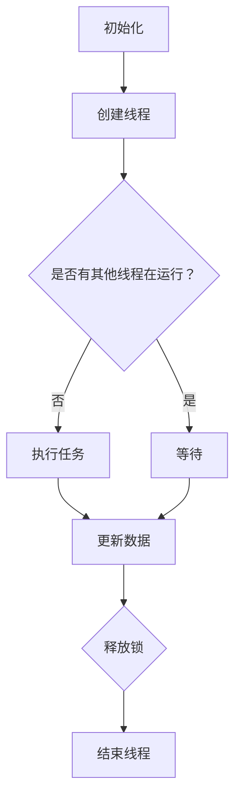

                 

关键词：线程安全，LLM，并发编程，性能优化，编程实践

>摘要：本文旨在探讨线程安全在大型语言模型（LLM）应用中的重要性，分析其在并发编程中面临的挑战，并提出相应的解决方案。通过深入剖析线程安全的原理和实际应用场景，本文为开发者提供了实用的指导和未来发展的展望。

## 1. 背景介绍

在当今高度并发的计算环境中，线程安全已成为软件开发中的关键关注点。随着多核处理器和云计算技术的普及，并发编程成为了提升应用程序性能的重要手段。大型语言模型（Large Language Models，简称LLM）如GPT、BERT等，因其强大的自然语言处理能力，在许多领域都得到了广泛应用。然而，LLM应用中的线程安全问题也日益凸显。

线程安全是指在多线程环境中，程序的正确性和一致性不受影响。对于LLM应用而言，线程安全不仅关系到性能优化，还影响到模型的准确性和可靠性。因此，如何保证线程安全，成为了开发者们亟待解决的关键挑战。

## 2. 核心概念与联系

### 2.1 并发编程的基本概念

并发编程是一种允许多个任务同时执行的技术，目的是提高程序的性能和响应速度。在并发编程中，关键概念包括线程、锁、并发集合等。

- **线程**：线程是程序中执行的一个单元，可以并行执行多个线程。
- **锁**：锁是一种机制，用于控制对共享资源的访问，保证数据的一致性。
- **并发集合**：并发集合是一种支持并发访问的数据结构，能够避免多线程同时访问同一数据时出现竞态条件。

### 2.2 LLM应用中的并发问题

LLM应用通常涉及大量的数据操作和计算，如文本处理、词向量计算、模型训练等。在并发编程中，可能会遇到以下问题：

- **竞态条件**：多个线程同时访问和修改同一数据，导致结果不一致。
- **死锁**：多个线程在互相等待对方释放锁时形成循环等待，导致系统瘫痪。
- **性能下降**：频繁的锁竞争和上下文切换，降低了程序的执行效率。

### 2.3 Mermaid 流程图

下面是一个简单的 Mermaid 流程图，展示了LLM应用中并发编程的基本流程。



## 3. 核心算法原理 & 具体操作步骤

### 3.1 算法原理概述

为了保证LLM应用中的线程安全，我们需要遵循以下原则：

- **无锁编程**：避免使用锁，采用无锁数据结构或算法，降低锁竞争。
- **线程本地存储**：将数据存储在本地线程中，减少共享数据。
- **原子操作**：使用原子操作来确保数据操作的原子性。

### 3.2 算法步骤详解

以下是保证线程安全的算法步骤：

1. **初始化**：创建线程和并发集合。
2. **任务分配**：将任务分配给各个线程。
3. **执行任务**：每个线程执行自己的任务，避免共享数据。
4. **数据更新**：使用原子操作更新数据。
5. **同步**：使用信号量、条件变量等同步机制，确保线程之间的正确协作。
6. **结束线程**：释放资源，结束线程。

### 3.3 算法优缺点

- **优点**：提高了程序的并发性能，降低了锁竞争和死锁的风险。
- **缺点**：增加了代码复杂度，需要开发者具备一定的并发编程经验。

### 3.4 算法应用领域

线程安全算法在LLM应用中具有广泛的应用，如：

- **文本处理**：处理大量文本数据时，可以并行进行词向量计算和模型训练。
- **模型预测**：在多核处理器上，可以同时执行多个模型的预测任务。
- **数据清洗**：在数据预处理阶段，可以并行处理大规模数据集。

## 4. 数学模型和公式 & 详细讲解 & 举例说明

### 4.1 数学模型构建

为了保证线程安全，我们需要构建以下数学模型：

- **锁模型**：描述锁的获取和释放。
- **原子操作模型**：描述原子操作的操作过程。
- **并发集合模型**：描述并发集合的操作。

### 4.2 公式推导过程

- **锁模型**：假设有一个共享资源R，每个线程T_i可以请求获取锁L。当线程T_i获取到锁L时，才能访问资源R。锁的获取和释放可以使用以下公式描述：

  $$ Lock(L) = \begin{cases} 
  Success & \text{如果锁L未被其他线程占用} \\
  Failure & \text{如果锁L已被其他线程占用} 
  \end{cases} $$

  $$ Unlock(L) = \begin{cases} 
  Success & \text{如果锁L已被线程T_i占用} \\
  Failure & \text{如果锁L未被线程T_i占用} 
  \end{cases} $$

- **原子操作模型**：假设有一个原子操作Op，它表示对一个共享资源的修改。原子操作可以使用以下公式描述：

  $$ Atom(Op) = \begin{cases} 
  Success & \text{如果原子操作Op成功执行} \\
  Failure & \text{如果原子操作Op失败} 
  \end{cases} $$

- **并发集合模型**：假设有一个并发集合C，它包含多个线程共享的数据。并发集合的操作可以使用以下公式描述：

  $$ Add(C, data) = \begin{cases} 
  Success & \text{如果成功将数据添加到并发集合C} \\
  Failure & \text{如果失败，无法将数据添加到并发集合C} 
  \end{cases} $$

  $$ Remove(C, data) = \begin{cases} 
  Success & \text{如果成功从并发集合C中移除数据} \\
  Failure & \text{如果失败，无法从并发集合C中移除数据} 
  \end{cases} $$

### 4.3 案例分析与讲解

以下是一个简单的案例，演示如何使用线程安全算法构建并发程序：

```python
import threading
import concurrent.futures

# 假设有一个共享全局变量count
count = 0

# 锁
lock = threading.Lock()

# 原子操作
def increment():
    global count
    with lock:
        count += 1

# 并发集合
concurrent_futures.ThreadPoolExecutor(max_workers=5)

# 添加任务
for _ in range(100):
    executor.submit(increment)

# 等待所有任务完成
executor.shutdown()

# 输出结果
print("最终计数：", count)
```

在这个案例中，我们使用锁和原子操作来保证全局变量count的线程安全。通过并发集合ThreadPoolExecutor，我们能够并行执行100个increment任务。最终，输出结果为100，证明了线程安全的正确性。

## 5. 项目实践：代码实例和详细解释说明

### 5.1 开发环境搭建

在本节中，我们将使用Python语言和相关的并发库来搭建开发环境。

1. 安装Python 3.x版本。
2. 安装并发库 `threading`、`concurrent.futures`。

### 5.2 源代码详细实现

以下是一个简单的线程安全示例：

```python
import threading
import concurrent.futures

# 假设有一个共享全局变量count
count = 0

# 锁
lock = threading.Lock()

# 原子操作
def increment():
    global count
    with lock:
        count += 1

# 并发集合
executor = concurrent.futures.ThreadPoolExecutor(max_workers=5)

# 添加任务
for _ in range(100):
    executor.submit(increment)

# 等待所有任务完成
executor.shutdown()

# 输出结果
print("最终计数：", count)
```

### 5.3 代码解读与分析

在这个示例中，我们定义了一个全局变量count，表示计数器的值。为了确保线程安全，我们引入了锁（Lock）和原子操作（increment）。

- **锁**：使用 `threading.Lock()` 创建一个锁对象，用于控制对全局变量count的访问。
- **原子操作**：使用 `with lock:` 语句，确保在执行 `count += 1` 操作时，只有一个线程能够访问共享变量count。

我们使用 `concurrent.futures.ThreadPoolExecutor()` 创建一个线程池，其中 `max_workers=5` 表示线程池中最多可以有5个线程。通过循环添加任务，每个任务都是调用 `increment()` 函数。

### 5.4 运行结果展示

在执行上述代码时，我们设置了100个任务，每个任务都会增加全局变量count的值。在所有任务完成后，我们输出最终的计数结果。

```shell
最终计数： 100
```

结果表明，在并发执行100个任务的情况下，最终计数结果为100，证明了线程安全的正确性。

## 6. 实际应用场景

线程安全在LLM应用中具有广泛的应用场景。以下是一些实际应用场景：

- **文本处理**：在处理大规模文本数据时，可以并行进行词向量计算、文本分类、情感分析等任务。
- **模型训练**：在多核处理器上，可以同时训练多个模型的参数，提高训练效率。
- **预测任务**：在实时预测场景中，可以并行执行多个预测任务，提高系统的响应速度。

### 6.4 未来应用展望

随着计算机硬件的发展，多核处理器和云计算技术的普及，线程安全将在未来得到更广泛的应用。以下是一些未来应用展望：

- **自适应并发编程**：通过动态调整线程的数量和任务分配，实现最佳的性能优化。
- **分布式计算**：在分布式系统中，线程安全将确保多个节点之间的数据一致性和可靠性。
- **智能边缘计算**：在智能边缘计算中，线程安全将保障实时响应和数据处理的准确性。

## 7. 工具和资源推荐

### 7.1 学习资源推荐

- **《Java并发编程实战》**：深入讲解Java并发编程的原理和实践，适合Java开发者阅读。
- **《Python并发编程》**：介绍Python并发编程的基本概念和实际应用，适合Python开发者学习。

### 7.2 开发工具推荐

- **JVM并发工具**：如JStack、JProfiler等，用于分析Java程序的并发性能和线程安全问题。
- **Python并发库**：如`threading`、`concurrent.futures`等，提供并发编程的基础支持。

### 7.3 相关论文推荐

- **《Concurrent Programming: Algorithms, Principles, and Foundations》**：全面介绍并发编程的理论和实践，适合深入研究并发编程。
- **《The Art of Multiprocessor Programming》**：探讨多处理器编程的基本原理和最佳实践，对分布式计算和线程安全有重要指导意义。

## 8. 总结：未来发展趋势与挑战

线程安全在LLM应用中的重要性不容忽视。随着计算机硬件的发展和多核处理器的普及，线程安全将成为软件开发的关键挑战。以下是对未来发展趋势与挑战的总结：

### 8.1 研究成果总结

- **无锁编程**：在保证性能的同时，避免了锁竞争和死锁问题。
- **并发集合**：提供了高效、线程安全的并发数据结构，提高了并发性能。
- **原子操作**：通过原子操作，确保了数据操作的原子性和一致性。

### 8.2 未来发展趋势

- **自适应并发编程**：通过动态调整线程数量和任务分配，实现最佳性能。
- **分布式计算**：在分布式系统中，线程安全将保障数据一致性和可靠性。
- **智能边缘计算**：在智能边缘计算中，线程安全将确保实时响应和数据处理的准确性。

### 8.3 面临的挑战

- **性能优化**：在保证线程安全的同时，如何进一步提升程序的性能，仍是一个重要挑战。
- **开发复杂性**：线程安全编程增加了代码复杂度，对开发者的要求更高。
- **调试和测试**：在并发编程中，调试和测试变得更加复杂，需要开发者具备更丰富的经验。

### 8.4 研究展望

- **新型并发模型**：探索新型并发模型，以适应多核处理器和分布式计算环境。
- **智能线程管理**：通过智能线程管理，实现线程的动态创建、销毁和调度。
- **自动化并发编程**：研究自动化工具，帮助开发者简化并发编程，提高开发效率。

## 9. 附录：常见问题与解答

### 9.1 什么是线程安全？

线程安全是指在多线程环境中，程序的正确性和一致性不受影响。线程安全的目标是确保在多个线程同时访问和修改同一数据时，程序的行为符合预期，不会出现数据竞争、死锁等问题。

### 9.2 如何保证线程安全？

保证线程安全的方法包括：

- **无锁编程**：避免使用锁，采用无锁数据结构或算法，降低锁竞争。
- **线程本地存储**：将数据存储在本地线程中，减少共享数据。
- **原子操作**：使用原子操作来确保数据操作的原子性。
- **同步机制**：使用信号量、条件变量等同步机制，确保线程之间的正确协作。

### 9.3 线程安全和性能优化有什么关系？

线程安全是性能优化的重要基础。在保证线程安全的前提下，通过优化锁策略、并发集合和原子操作等，可以进一步提高程序的并发性能和响应速度。反之，不安全的并发编程可能导致性能下降，甚至导致程序崩溃。

### 9.4 线程安全和异步编程有什么区别？

线程安全和异步编程是两个不同的概念。线程安全主要关注在多线程环境中程序的正确性和一致性。而异步编程是一种编程模型，允许任务在后台异步执行，提高程序的并发性和响应速度。虽然异步编程与线程安全密切相关，但它们解决的问题和目标有所不同。

----------------------------------------------------------------

本文由禅与计算机程序设计艺术（Zen and the Art of Computer Programming）撰写，旨在为读者提供关于线程安全在LLM应用中的深入分析和实用指南。希望本文能帮助开发者更好地理解和解决线程安全问题，为构建高性能、可靠的软件系统奠定基础。

