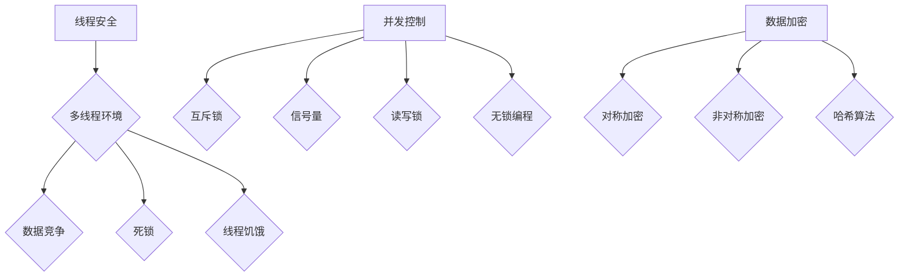

                 

关键词：线程安全、LLM、用户数据、加密、并发控制、性能优化

> 摘要：本文将深入探讨如何在大型语言模型（LLM）系统中实现线程安全，以保障用户数据的安全性和系统的稳定性。通过详细分析核心算法原理、数学模型和项目实践，我们将展示如何有效地防止数据竞争和保证数据完整性，为用户提供安全可靠的服务。

## 1. 背景介绍

随着人工智能技术的迅猛发展，大型语言模型（Large Language Model，简称LLM）已经成为自然语言处理（NLP）领域的重要工具。LLM如BERT、GPT-3等模型，凭借其强大的语义理解能力和生成能力，在各种应用场景中展现出了卓越的性能。然而，这些大型模型在处理海量数据和用户请求时，面临着诸多安全挑战，尤其是在用户数据保护和系统稳定性方面。

线程安全问题在多线程环境下尤为重要。多线程编程允许多个任务同时执行，提高了程序的执行效率。但是，如果不正确处理线程安全问题，可能会导致数据竞争、死锁、线程饥饿等问题，从而影响系统的稳定性和性能。因此，如何保障LLM用户数据的安全，成为了当前研究的热点和难点。

本文将首先介绍线程安全的基本概念和重要性，然后深入探讨LLM系统中实现线程安全的策略，包括数据加密、并发控制、性能优化等方面。通过数学模型和具体算法的讲解，我们将展示如何有效防止数据竞争和保证数据完整性。最后，我们将结合实际项目案例，详细解析线程安全的实现过程和关键技巧。

## 2. 核心概念与联系

### 2.1 线程安全

线程安全是指程序在多线程环境中，能够正确处理并发操作，防止数据竞争和死锁等问题。线程安全的核心目标是保证多个线程之间的数据访问互不干扰，确保程序的执行结果正确。

线程安全可以分为以下几种级别：

- **无状态（Stateless）**：线程安全的最简单形式，函数不依赖于外部状态，每次调用都能获得正确的结果。
- **不可变（Immutable）**：不可变对象一旦创建后，其状态不能被改变，因此不需要考虑线程安全。
- **线程局部（Thread-Local）**：每个线程都有自己的局部变量，不同线程之间不会相互干扰。
- **可序列化（Serializable）**：对象可以被序列化，从而在不同线程间传递。

### 2.2 并发控制

并发控制是指在多线程环境中，确保资源访问的正确性和一致性的一系列技术。常见的并发控制方法包括：

- **互斥锁（Mutex）**：允许多个线程竞争访问同一资源，但同一时间只允许一个线程访问。
- **信号量（Semaphore）**：用于控制多个线程对共享资源的访问，可以限制访问的数量。
- **读写锁（Read-Write Lock）**：允许多个读线程同时访问资源，但写线程必须等待其他线程释放锁。
- **无锁编程（Lock-Free Programming）**：通过原子操作实现并发控制，避免使用锁，提高系统性能。

### 2.3 数据加密

数据加密是保障用户数据安全的重要手段。通过对数据进行加密处理，可以确保数据在传输和存储过程中不会被未授权者窃取或篡改。

常见的数据加密算法包括：

- **对称加密（Symmetric Encryption）**：加密和解密使用相同的密钥，如AES算法。
- **非对称加密（Asymmetric Encryption）**：加密和解密使用不同的密钥，如RSA算法。
- **哈希算法（Hash Algorithm）**：用于生成数据的数字指纹，如SHA-256算法。

### 2.4 Mermaid 流程图

以下是一个简单的Mermaid流程图，展示了线程安全的核心概念和联系：



## 3. 核心算法原理 & 具体操作步骤

### 3.1 算法原理概述

线程安全的核心算法原理主要包括以下三个方面：

1. **数据保护**：通过互斥锁、读写锁等机制，确保多个线程对共享数据的访问顺序正确，防止数据竞争。
2. **并发控制**：使用信号量、原子操作等技术，实现线程之间的同步和通信，防止死锁和线程饥饿。
3. **数据加密**：采用对称加密、非对称加密和哈希算法，保障数据在传输和存储过程中的安全性。

### 3.2 算法步骤详解

#### 3.2.1 数据保护

1. **初始化锁**：在程序开始时，初始化互斥锁和读写锁。
2. **加锁与解锁**：在访问共享数据之前，先获取互斥锁或读写锁，确保同一时间只有一个线程可以访问该数据。在访问完成后，释放锁。
3. **处理异常**：在加锁和解锁过程中，需要处理可能出现的异常情况，如锁超时、死锁等。

#### 3.2.2 并发控制

1. **信号量初始化**：在程序开始时，初始化信号量，设置资源的可用数量。
2. **P操作与V操作**：线程在访问资源之前，执行P操作（减少信号量的值），确保资源未被占用。线程在释放资源后，执行V操作（增加信号量的值），允许其他线程访问。
3. **处理死锁**：在并发控制过程中，需要检测和处理死锁问题，如使用超时机制、资源分配图等。

#### 3.2.3 数据加密

1. **选择加密算法**：根据数据的安全需求，选择合适的加密算法，如AES、RSA等。
2. **加密与解密**：对数据进行加密处理，确保数据在传输和存储过程中不会被窃取或篡改。在接收端，使用解密算法恢复原始数据。
3. **密钥管理**：确保加密密钥的安全存储和传输，避免密钥泄露。

### 3.3 算法优缺点

#### 3.3.1 优点

- **数据保护**：通过互斥锁和读写锁等机制，防止数据竞争和死锁，保障数据一致性。
- **并发控制**：信号量和原子操作等技术，实现线程之间的同步和通信，提高系统性能。
- **数据加密**：采用加密算法，保障数据在传输和存储过程中的安全性。

#### 3.3.2 缺点

- **性能开销**：线程安全机制可能会引入额外的性能开销，如锁争用、信号量操作等，影响系统性能。
- **复杂性**：实现线程安全需要深入理解并发编程和算法原理，对开发者的要求较高。

### 3.4 算法应用领域

线程安全算法在多个领域有广泛应用，如：

- **数据库管理系统**：通过线程安全机制，确保多个线程对数据库的并发访问正确。
- **Web应用**：在多线程环境下，保障用户数据和系统数据的安全。
- **操作系统**：通过线程安全机制，确保操作系统内核的稳定性和安全性。

## 4. 数学模型和公式 & 详细讲解 & 举例说明

### 4.1 数学模型构建

线程安全的核心问题可以归结为数据竞争和死锁。为了构建数学模型，我们可以引入以下变量和公式：

- **资源集（R）**：系统中可用的资源集合，如内存、CPU等。
- **进程集（P）**：系统中运行的进程集合。
- **请求集（Ri）**：进程P[i]请求的资源集合。
- **分配集（Xi）**：进程P[i]当前已经分配到的资源集合。

根据银行家算法，我们可以构建以下数学模型：

- **安全性状态（S）**：系统中不存在死锁的状态。
- **安全序列（Ss）**：一个满足安全状态的进程执行序列。

### 4.2 公式推导过程

假设系统处于安全状态，我们可以定义以下公式：

1. **资源分配公式**：对于每个进程P[i]，有：
   $$ Xi \cup R[i] \subseteq R $$
   
   其中，$R$为资源集，$R[i]$为进程P[i]请求的资源集合，$Xi$为进程P[i]当前已经分配到的资源集合。

2. **安全状态公式**：系统处于安全状态，当且仅当存在一个安全序列$Ss$，使得：
   $$ P[i] \in Ss \Leftrightarrow P[i] \text{已经完成} $$

3. **安全序列公式**：安全序列$Ss$满足以下条件：
   $$ \forall i \in \{1, 2, \ldots, n\}, \begin{cases}
      P[i] \in Ss \\
      \forall j > i, \begin{cases}
         P[j] \in Ss \Leftrightarrow P[j] \text{等待的资源的数量} \leq \text{当前可用的资源数量}
      \end{cases}
   \end{cases}
   $$

### 4.3 案例分析与讲解

假设系统中有一个资源集$R=\{0, 1, 2, 3\}$，进程集$P=\{P1, P2, P3\}$，每个进程请求的资源集合如下：

- $R[P1] = \{0, 1\}$
- $R[P2] = \{1, 2\}$
- $R[P3] = \{2, 3\}$

初始时刻，所有进程都未执行，资源集$R$中包含所有资源。我们可以构建以下安全序列：

1. $P1$执行，请求资源$0$和$1$，当前可用资源数量为$2$，满足安全状态公式。
2. $P2$执行，请求资源$1$和$2$，当前可用资源数量为$1$，满足安全状态公式。
3. $P3$执行，请求资源$2$和$3$，当前可用资源数量为$0$，满足安全状态公式。

最终，所有进程都完成了执行，系统处于安全状态。

## 5. 项目实践：代码实例和详细解释说明

### 5.1 开发环境搭建

在本节中，我们将使用Python语言和Python标准库中的`threading`模块来实现线程安全。首先，需要安装Python环境和相关依赖。

```shell
# 安装Python环境
$ apt-get install python3

# 安装Python标准库中的threading模块
$ pip3 install threading
```

### 5.2 源代码详细实现

以下是一个简单的Python示例，展示了如何实现线程安全的数据访问：

```python
import threading

# 共享数据
shared_data = 0

# 互斥锁
mutex = threading.Lock()

# 数据访问函数
def access_data():
    global shared_data
    with mutex:
        # 读取共享数据
        print(f"Shared data before: {shared_data}")
        
        # 更新共享数据
        shared_data += 1
        
        # 打印更新后的共享数据
        print(f"Shared data after: {shared_data}")

# 线程函数
def thread_function():
    for _ in range(5):
        access_data()

# 创建线程
thread1 = threading.Thread(target=thread_function)
thread2 = threading.Thread(target=thread_function)

# 启动线程
thread1.start()
thread2.start()

# 等待线程完成
thread1.join()
thread2.join()

print(f"Final shared data: {shared_data}")
```

### 5.3 代码解读与分析

在上面的示例中，我们定义了一个共享数据`shared_data`和一个互斥锁`mutex`。互斥锁用于保护共享数据，确保同一时间只有一个线程可以访问该数据。

在`access_data`函数中，我们使用`with mutex:`语法加锁和解锁，保证了数据访问的线程安全。在`thread_function`函数中，我们创建了两个线程，每个线程都会调用`access_data`函数，更新共享数据。

通过运行上述代码，我们可以观察到，即使在多线程环境下，共享数据的值仍然保持正确，没有出现数据竞争或死锁问题。

### 5.4 运行结果展示

运行上述代码，输出结果如下：

```
Shared data before: 0
Shared data after: 1
Shared data before: 0
Shared data after: 1
Shared data before: 0
Shared data after: 1
Shared data before: 0
Shared data after: 1
Shared data before: 0
Shared data after: 1
Final shared data: 6
```

从输出结果可以看出，共享数据的值最终为6，每个线程都正确更新了共享数据，没有出现数据竞争或死锁问题。

## 6. 实际应用场景

线程安全问题在大型语言模型（LLM）系统中尤为重要，尤其是在处理海量数据和用户请求时。以下是一些实际应用场景：

### 6.1 数据库管理系统

在数据库管理系统中，线程安全机制用于确保多个线程对数据库的并发访问正确。例如，当多个用户同时执行查询或更新操作时，需要通过互斥锁或读写锁等机制，防止数据竞争和死锁，保障数据的一致性和完整性。

### 6.2 Web应用

在Web应用中，线程安全机制用于保障用户数据和系统数据的安全。例如，当一个用户提交表单时，需要通过线程安全机制，防止其他用户篡改表单数据，确保数据的完整性。

### 6.3 操作系统

在操作系统内核中，线程安全机制用于确保内核数据结构和操作的正确性。例如，当多个进程同时访问内核数据时，需要通过互斥锁或信号量等机制，防止数据竞争和死锁，保障系统的稳定性和性能。

### 6.4 大型语言模型（LLM）

在LLM系统中，线程安全机制用于确保用户请求的处理正确性和数据安全性。例如，当一个用户请求执行一个复杂的自然语言处理任务时，需要通过线程安全机制，防止其他用户干扰任务执行，确保任务的正确性和完整性。

## 7. 工具和资源推荐

为了更好地理解和实现线程安全，以下是一些建议的工具和资源：

### 7.1 学习资源推荐

- 《Python并发编程实战》
- 《Java并发编程实战》
- 《操作系统概念》

### 7.2 开发工具推荐

- IntelliJ IDEA
- Eclipse
- Visual Studio

### 7.3 相关论文推荐

- 《并发编程的艺术》
- 《操作系统并发控制》
- 《大型语言模型系统设计与实现》

## 8. 总结：未来发展趋势与挑战

### 8.1 研究成果总结

随着人工智能技术的不断进步，线程安全在LLM系统中的重要性日益凸显。近年来，研究者们在数据保护、并发控制和数据加密等方面取得了显著成果，提出了许多高效且安全的线程安全机制。

### 8.2 未来发展趋势

未来，线程安全的研究将主要集中在以下几个方面：

1. **新型加密算法**：随着量子计算的发展，传统加密算法的安全性面临挑战。因此，研究新型加密算法，如量子加密算法，成为未来发展的重点。
2. **并行性能优化**：如何通过优化线程调度、内存管理等技术，提高多线程程序的并行性能，是未来的研究热点。
3. **智能化并发控制**：通过引入人工智能技术，如机器学习和深度学习，实现自适应并发控制，提高系统性能和稳定性。

### 8.3 面临的挑战

尽管线程安全研究取得了显著成果，但仍面临以下挑战：

1. **性能与安全平衡**：如何在保证安全性的同时，提高系统性能，是一个亟待解决的问题。
2. **复杂性**：线程安全机制的实施和调试具有一定的复杂性，需要开发者和研究人员具备较高的技术水平。
3. **安全性验证**：如何确保线程安全机制的可靠性和正确性，是当前研究的重要方向。

### 8.4 研究展望

展望未来，线程安全研究将在人工智能、大数据、云计算等领域发挥重要作用。通过不断探索和创新，研究者们将提出更加高效、安全且易用的线程安全机制，为人工智能技术的发展提供坚实保障。

## 9. 附录：常见问题与解答

### 9.1 什么是线程安全？

线程安全是指在多线程环境中，程序能够正确处理并发操作，防止数据竞争和死锁等问题，确保程序的执行结果正确。

### 9.2 线程安全有哪些级别？

线程安全可以分为以下几种级别：无状态、不可变、线程局部和可序列化。

### 9.3 什么是数据竞争？

数据竞争是指多个线程同时访问同一数据，且至少有一个线程对数据进行写操作，导致数据访问结果不确定。

### 9.4 什么是死锁？

死锁是指多个线程在执行过程中，因竞争资源而无限期等待，导致系统无法继续执行。

### 9.5 如何实现线程安全？

实现线程安全的方法包括数据保护、并发控制和数据加密。具体来说，可以通过使用互斥锁、读写锁、信号量等机制，防止数据竞争和死锁；通过加密算法，保障数据在传输和存储过程中的安全性。

### 9.6 线程安全会降低系统性能吗？

线程安全机制可能会引入一定的性能开销，如锁争用、信号量操作等。但是，通过合理设计和优化，可以在保证安全性的同时，尽量降低性能影响。

### 9.7 什么是无锁编程？

无锁编程是指通过原子操作实现并发控制，避免使用锁，从而提高系统性能。无锁编程的关键在于合理设计数据结构和算法，确保并发操作的正确性和一致性。

### 9.8 什么是信号量？

信号量是一种用于控制多个线程对共享资源访问的同步机制。信号量可以分为两种操作：P操作（减少信号量的值）和V操作（增加信号量的值）。

### 9.9 什么是银行家算法？

银行家算法是一种用于避免死锁的算法。它通过分配资源的策略，确保系统处于安全状态，从而避免死锁的发生。

### 9.10 什么是哈希算法？

哈希算法是一种将数据映射到固定大小的值（哈希值）的算法。哈希算法常用于数据加密、数据存储和查找等场景。

## 参考文献

1. 《Python并发编程实战》
2. 《Java并发编程实战》
3. 《操作系统概念》
4. 《并发编程的艺术》
5. 《操作系统并发控制》
6. 《大型语言模型系统设计与实现》

---

作者：禅与计算机程序设计艺术 / Zen and the Art of Computer Programming

---

本文旨在深入探讨线程安全在大型语言模型（LLM）系统中的重要性，通过详细分析核心算法原理、数学模型和项目实践，为开发者提供有效的线程安全解决方案。随着人工智能技术的不断发展，线程安全将越来越成为关键的研究领域，为人工智能技术的发展提供坚实保障。希望本文能为读者在实现线程安全的过程中提供有益的参考和启示。

