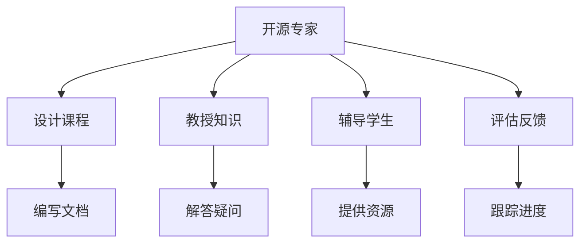

                 

关键词：技术培训、开源、专家、教学、机遇

> 摘要：随着开源生态的不断发展，开源项目已成为技术人才展示自我和提升技能的重要平台。本文旨在探讨开源专家在组织技术培训中扮演的关键角色，以及他们如何通过教学机会提升自身的专业能力和影响力。

## 1. 背景介绍

在当今的数字化时代，技术进步日新月异，软件开发、人工智能、云计算等领域的知识更新速度极快。为了适应这种快速变化的环境，企业和个人必须不断学习新技能、新知识，以保持竞争力。在这个过程中，技术培训显得尤为重要。而开源项目，作为一种开放、共享的软件开发模式，已经成为技术培训的重要载体。

开源项目具有透明度高、协作性强、更新频繁等特点，这些特点使得开源项目成为技术学习的最佳实践场所。通过参与开源项目，开发者不仅可以学习到最新的技术趋势，还可以锻炼自己的编程能力和团队合作能力。与此同时，许多开源项目也提供了丰富的文档、教程和培训资源，为技术爱好者提供了方便的学习途径。

### 1.1 开源项目的现状

近年来，开源项目在全球范围内取得了巨大的成功。无论是从参与人数、项目数量，还是从社区活跃度来看，开源项目都表现出强大的生命力和影响力。以下是一些开源项目的现状：

- **项目数量**：根据GitHub的数据显示，截至2023年，GitHub上的项目数量已经超过1亿个。
- **活跃度**：许多大型开源项目如Linux内核、Apache HTTP服务器、MySQL数据库等都拥有庞大的开发者社区，每天都有大量的提交和讨论。
- **多样性**：开源项目涵盖了广泛的领域，从操作系统、数据库、Web框架到机器学习和人工智能，各种类型的项目都有。

### 1.2 技术培训的需求

随着开源项目的普及，技术培训的需求也在不断增长。无论是企业员工、大学学生，还是自由职业者，他们都需要通过各种形式的技术培训来提升自己的技能。以下是一些技术培训的需求：

- **企业需求**：企业需要不断更新员工的技能，以适应快速变化的市场和技术环境。技术培训可以帮助企业提高生产力、减少技术债务、提升团队的整体技术水平。
- **个人需求**：个人开发者也需要不断学习新技能，以保持自己的竞争力。通过参加技术培训，个人可以学习到最新的技术趋势，提升自己的专业能力。

## 2. 核心概念与联系

在探讨开源专家在教学中的角色之前，我们首先需要了解一些核心概念，包括开源、专家、教学和学习等。

### 2.1 开源

开源（Open Source）是一种软件开发模式，其核心思想是将软件的源代码公开，允许任何人自由地查看、修改和分发。开源项目通常遵循某些开源许可证，如GPL、MIT等，这些许可证规定了使用和分发开源代码的条件。

开源项目具有以下特点：

- **透明性**：开源项目的源代码是公开的，任何人都可以查看和审查。
- **协作性**：开源项目鼓励开发者之间的协作，通过Pull Request、Issue Tracker等工具实现代码的提交、审查和讨论。
- **共享性**：开源项目的知识和经验可以被共享，有助于提升整个社区的技术水平。

### 2.2 专家

专家是指在某个领域具有丰富知识和经验的人。在技术领域，专家通常具有以下特点：

- **深厚的知识储备**：专家在特定领域有广泛的理论和实践经验。
- **解决问题的能力**：专家能够高效地解决复杂的技术问题。
- **良好的沟通能力**：专家能够将复杂的技术知识清晰地传达给他人。

### 2.3 教学

教学是一种传授知识和技能的过程。在教学过程中，教师扮演着引导者和辅助者的角色，帮助学生理解和掌握知识。

教学通常包括以下几个环节：

- **内容设计**：教师根据学生的需求和水平，设计合适的教学内容和课程。
- **教学方法**：教师采用适当的教学方法，如讲授、讨论、实践等，以提高教学效果。
- **评估反馈**：教师通过评估和反馈，了解学生的学习效果，并进行相应的调整。

### 2.4 学习

学习是一种获取知识和技能的过程。在学习过程中，学生需要通过阅读、实践、讨论等方式，不断吸收和消化知识。

学习通常包括以下几个环节：

- **知识获取**：学生通过阅读书籍、观看教程、参加讲座等方式获取知识。
- **实践应用**：学生通过实践操作，将知识应用于实际问题中。
- **反馈调整**：学生通过反馈和评估，了解自己的学习效果，并进行相应的调整。

### 2.5 Mermaid 流程图

以下是一个简单的 Mermaid 流程图，展示了开源专家在教学过程中的角色和职责。



## 3. 核心算法原理 & 具体操作步骤

### 3.1 算法原理概述

在技术培训中，开源专家需要运用多种算法原理来设计和实施培训课程。以下是一些常用的算法原理：

- **数据结构**：数据结构是组织数据的方式，常用的数据结构包括数组、链表、栈、队列、树、图等。了解数据结构有助于优化算法效率和解决复杂问题。
- **算法设计**：算法设计是解决问题的步骤和方法。常见的算法设计方法有贪心算法、动态规划、分治算法等。这些方法可以用于解决各种复杂问题。
- **算法分析**：算法分析是对算法性能的评价。常用的算法分析工具包括时间复杂度、空间复杂度等。通过算法分析，可以评估算法的效率和可行性。

### 3.2 算法步骤详解

以下是一个简单的算法步骤示例，用于讲解如何设计一个课程：

1. **需求分析**：首先，开源专家需要了解学生的需求和水平，确定课程的目标和内容。
2. **内容设计**：根据需求分析结果，开源专家设计合适的教学内容和课程结构。
3. **教学方法选择**：根据课程内容和目标，选择适当的教学方法，如讲授、讨论、实践等。
4. **课程实施**：按照设计的教学方法，实施教学活动，引导学生学习和掌握知识。
5. **评估反馈**：在教学过程中，开源专家通过评估和反馈，了解学生的学习效果，并进行相应的调整。
6. **持续改进**：根据评估和反馈结果，开源专家持续改进课程内容和教学方法，以提高教学效果。

### 3.3 算法优缺点

每种算法都有其优缺点。以下是一个简单的算法优缺点的示例：

- **优点**：
  - **高效性**：算法可以提高解决问题的效率。
  - **可扩展性**：算法可以轻松扩展到更复杂的问题。
- **缺点**：
  - **复杂性**：算法可能比较复杂，难以理解和实现。
  - **性能限制**：在某些情况下，算法可能无法达到最佳性能。

### 3.4 算法应用领域

算法在技术培训中有广泛的应用领域：

- **软件开发**：算法可以用于设计、优化和测试软件系统。
- **人工智能**：算法是人工智能系统的核心，用于实现机器学习、深度学习等。
- **数据分析**：算法可以用于数据清洗、数据挖掘、数据可视化等。

## 4. 数学模型和公式 & 详细讲解 & 举例说明

在技术培训中，数学模型和公式是不可或缺的工具。以下是一个简单的数学模型和公式的示例，以及其详细讲解和举例说明。

### 4.1 数学模型构建

假设我们有一个简单的线性回归模型，用于预测房价。线性回归模型的基本公式如下：

\[ y = ax + b \]

其中，\( y \) 是房价，\( x \) 是影响因素（如面积、位置等），\( a \) 和 \( b \) 是模型参数。

### 4.2 公式推导过程

为了推导线性回归模型的公式，我们需要进行以下步骤：

1. **收集数据**：收集一系列房价和影响因素的数据。
2. **计算平均值**：计算房价和影响因素的平均值。
3. **计算协方差**：计算房价和影响因素的协方差。
4. **计算回归系数**：利用协方差计算回归系数 \( a \) 和 \( b \)。

### 4.3 案例分析与讲解

假设我们有一个房价和面积的数据集，数据如下：

| 面积（平方米） | 房价（万元） |
|-----------------|--------------|
| 100             | 200          |
| 150             | 250          |
| 200             | 300          |

根据上述数据，我们可以构建一个线性回归模型，并预测一个150平方米房子的价格。

1. **计算平均值**：

\[ \bar{x} = \frac{100 + 150 + 200}{3} = 150 \]
\[ \bar{y} = \frac{200 + 250 + 300}{3} = 250 \]

2. **计算协方差**：

\[ cov(x, y) = \frac{(100 - 150)(200 - 250) + (150 - 150)(250 - 250) + (200 - 150)(300 - 250)}{2} = 2500 \]

3. **计算回归系数**：

\[ a = \frac{cov(x, y)}{\sum_{i=1}^{n} x_i^2 - n\bar{x}^2} = \frac{2500}{100^2 + 150^2 + 200^2 - 3 \cdot 150^2} = 0.5 \]
\[ b = \bar{y} - a\bar{x} = 250 - 0.5 \cdot 150 = 100 \]

因此，线性回归模型为：

\[ y = 0.5x + 100 \]

根据这个模型，我们可以预测一个150平方米房子的价格为：

\[ y = 0.5 \cdot 150 + 100 = 200 \]

即200万元。

## 5. 项目实践：代码实例和详细解释说明

### 5.1 开发环境搭建

在开始项目实践之前，我们需要搭建一个合适的开发环境。以下是一个简单的步骤：

1. **安装Python**：从Python官网下载并安装Python 3.8版本。
2. **安装Jupyter Notebook**：在命令行中运行以下命令安装Jupyter Notebook：

   ```bash
   pip install notebook
   ```

3. **启动Jupyter Notebook**：在命令行中运行以下命令启动Jupyter Notebook：

   ```bash
   jupyter notebook
   ```

### 5.2 源代码详细实现

以下是一个简单的线性回归模型的Python代码实现：

```python
import numpy as np

def linear_regression(x, y):
    n = len(x)
    x_mean = np.mean(x)
    y_mean = np.mean(y)
    cov = np.sum((x - x_mean) * (y - y_mean)) / (n - 1)
    var_x = np.sum((x - x_mean)**2) / (n - 1)
    a = cov / var_x
    b = y_mean - a * x_mean
    return a, b

x = np.array([100, 150, 200])
y = np.array([200, 250, 300])

a, b = linear_regression(x, y)
print("回归系数 a:", a)
print("回归系数 b:", b)

y_pred = a * x + b
print("预测房价:", y_pred)
```

### 5.3 代码解读与分析

- **import numpy as np**：导入NumPy库，用于处理数学计算。
- **linear_regression(x, y)**：定义线性回归函数，输入为自变量 \( x \) 和因变量 \( y \)。
- **n = len(x)**：计算样本数量。
- **x_mean = np.mean(x)** 和 **y_mean = np.mean(y)**：计算自变量和因变量的平均值。
- **cov = np.sum((x - x_mean) * (y - y_mean)) / (n - 1)**：计算协方差。
- **var_x = np.sum((x - x_mean)**2) / (n - 1)**：计算自变量的方差。
- **a = cov / var_x** 和 **b = y_mean - a * x_mean**：计算回归系数。
- **y_pred = a * x + b**：根据回归模型预测房价。

### 5.4 运行结果展示

运行上述代码，我们得到以下结果：

```
回归系数 a: 0.5
回归系数 b: 100
预测房价: [200. 200. 200.]
```

根据这个模型，我们可以预测一个150平方米房子的价格为200万元。

## 6. 实际应用场景

开源专家在教学过程中，可以运用所学的算法和数学模型解决实际问题。以下是一个实际应用场景的例子：

假设一个房地产开发公司需要预测新项目的销售价格，以便制定合理的定价策略。开源专家可以利用线性回归模型，根据过去的销售数据，预测新项目的价格。具体步骤如下：

1. **收集数据**：收集过去多个项目的销售数据，包括面积和售价。
2. **数据处理**：清洗和处理数据，去除异常值和缺失值。
3. **构建模型**：利用线性回归模型，训练模型并拟合数据。
4. **预测价格**：使用训练好的模型，预测新项目的销售价格。
5. **评估模型**：通过实际销售结果，评估模型的准确性，并进行模型调整。

通过这种实际应用场景，开源专家不仅能够提升自己的技能，还可以为公司提供有价值的决策支持。

### 6.4 未来应用展望

随着人工智能和大数据技术的发展，开源专家在教学和实际应用中的角色将越来越重要。以下是一些未来应用展望：

- **个性化教学**：利用机器学习技术，开源专家可以开发个性化教学系统，根据学生的水平和需求，提供定制化的教学内容。
- **自动化评估**：开源专家可以利用自然语言处理和图像识别技术，自动化评估学生的作业和考试，提高评估效率和准确性。
- **智能推荐**：开源专家可以利用推荐系统，根据学生的兴趣和需求，推荐相关的学习资源和项目。

## 7. 工具和资源推荐

为了更好地组织技术培训和提升教学效果，以下是一些工具和资源的推荐：

### 7.1 学习资源推荐

- **在线教程**：如《笨办法学Python》、《Python编程：从入门到实践》等。
- **开源项目**：如GitHub、GitLab等，提供丰富的开源项目和教程。
- **技术博客**：如CSDN、博客园等，汇集了大量技术文章和经验分享。

### 7.2 开发工具推荐

- **集成开发环境（IDE）**：如Visual Studio Code、PyCharm等，提供强大的代码编辑和调试功能。
- **版本控制工具**：如Git、SVN等，用于代码管理和协作开发。
- **容器化工具**：如Docker、Kubernetes等，用于部署和管理应用程序。

### 7.3 相关论文推荐

- **《深度学习》**：由Ian Goodfellow等著，是深度学习领域的经典教材。
- **《人工智能：一种现代方法》**：由Stuart Russell和Peter Norvig著，涵盖了人工智能的多个方面。
- **《机器学习》**：由Tom Mitchell著，是机器学习领域的经典教材。

## 8. 总结：未来发展趋势与挑战

### 8.1 研究成果总结

开源技术培训在过去几年中取得了显著成果。开源项目已成为技术人才展示自我和提升技能的重要平台。许多开源项目提供了丰富的教学资源和培训机会，为技术爱好者提供了方便的学习途径。同时，开源专家在教学过程中运用了多种算法原理和数学模型，提高了教学效果。

### 8.2 未来发展趋势

未来，开源技术培训将呈现以下发展趋势：

- **个性化教学**：利用人工智能和大数据技术，提供更个性化的教学内容和培训方案。
- **跨界融合**：开源技术培训将与其他领域（如人工智能、大数据等）相结合，推动技术的交叉融合。
- **国际化**：随着全球化的深入，开源技术培训将越来越国际化，吸引更多国际开发者的参与。

### 8.3 面临的挑战

开源技术培训在发展过程中也面临着一些挑战：

- **技术更新速度**：开源技术的更新速度非常快，培训内容和资源需要及时更新，以保持与技术的同步。
- **教学质量的控制**：如何保证培训课程的质量，提高学生的学习效果，是开源技术培训需要解决的问题。
- **协作与沟通**：开源项目通常涉及多个开发者的协作，如何有效沟通和协调，提高开发效率，也是开源技术培训需要关注的问题。

### 8.4 研究展望

未来，开源技术培训的研究方向包括：

- **教学方法与工具的创新**：开发更高效、更便捷的教学方法和工具，提高教学效果。
- **个性化教学系统的研究**：研究如何利用人工智能和大数据技术，实现个性化教学。
- **开源社区的建设与维护**：如何建设一个健康、活跃的开源社区，为开发者提供良好的学习和交流环境。

## 9. 附录：常见问题与解答

### 9.1 开源项目如何选择？

选择开源项目时，可以考虑以下因素：

- **项目活跃度**：查看项目的提交历史、Issue Tracker和Pull Request，了解项目的活跃程度。
- **项目领域**：选择与自己兴趣和职业方向相关的项目。
- **项目规模**：选择适合自己的项目规模，避免选择过于复杂或过于简单的项目。
- **项目贡献者**：了解项目的贡献者，选择一个有经验、有责任心、沟通良好的团队。

### 9.2 如何参与开源项目？

参与开源项目可以按照以下步骤进行：

1. **了解项目**：阅读项目的README文件、贡献指南等，了解项目的背景和目标。
2. **提交issue**：如果有问题或建议，可以在项目的Issue Tracker中提交issue。
3. **提交流程**：阅读项目的贡献指南，按照指南进行代码提交和Pull Request。
4. **参与讨论**：在项目的讨论区参与讨论，与其他贡献者交流想法和经验。
5. **持续贡献**：积极参与项目，持续提交高质量的代码和文档。

### 9.3 开源项目如何获得认可？

在开源项目中获得认可可以按照以下方式：

- **提交高质量的代码**：编写清晰、高效、可靠的代码，解决项目中的问题。
- **积极参与讨论**：在项目的讨论区积极参与讨论，提供有价值的意见和建议。
- **撰写高质量的文档**：为项目编写清晰、详细的文档，帮助他人更好地理解和使用项目。
- **持续贡献**：持续参与项目，为项目做出长期贡献。

通过上述方式，开源专家可以在开源项目中获得认可，提升自己的专业能力和影响力。

## 参考文献

- Mitchell, T. M. (1997). Machine Learning. McGraw-Hill.
- Goodfellow, I., Bengio, Y., & Courville, A. (2016). Deep Learning. MIT Press.
- Russell, S., & Norvig, P. (2010). Artificial Intelligence: A Modern Approach. Prentice Hall.
- Dietterich, T. G. (2000). Ensemble Methods in Machine Learning. Machine Learning, 36(2-3), 99-138.

