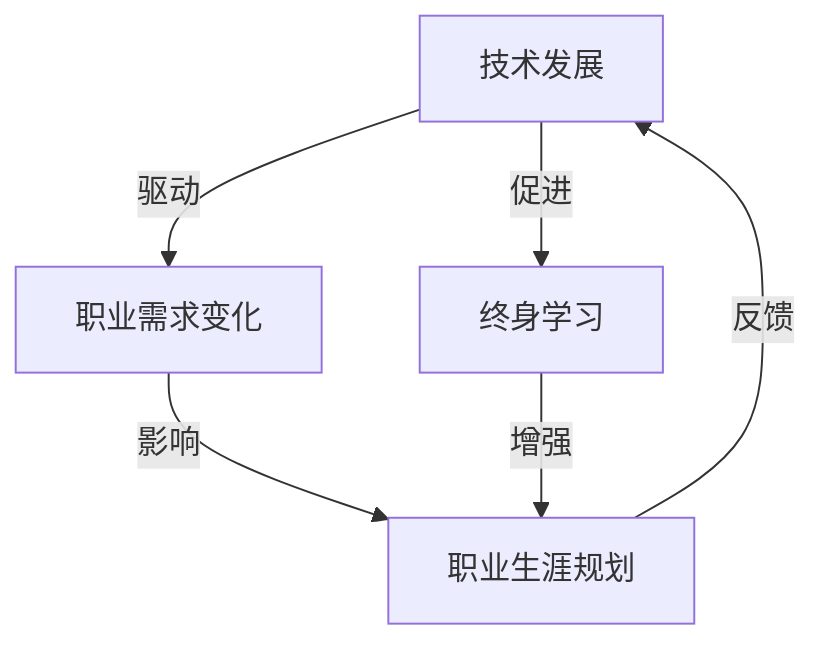

                 

关键词：终身学习，职业生涯规划，技术发展，创新能力，持续成长

> 摘要：本文将探讨在当今技术飞速发展的背景下，如何通过终身学习和职业生涯规划来保持自身的竞争力，实现个人职业生涯的持续成长和成功。文章首先介绍了终身学习的重要性，然后分析了职业生涯规划的基本原则，接着讨论了如何应对技术变化和职业发展的挑战，最后提出了对未来发展趋势和挑战的展望。

## 1. 背景介绍

### 技术发展的迅猛态势

在过去的几十年里，计算机技术和互联网的快速发展已经深刻地改变了我们的生活方式和工作方式。人工智能、大数据、云计算、区块链等新兴技术不断涌现，推动了各行各业的变革。这种技术的迅猛发展对个体职业提出了新的要求，同时也带来了前所未有的机会。

### 职业竞争的加剧

随着技术进步，许多传统职业正面临被自动化和人工智能取代的风险。与此同时，新兴职业层出不穷，对从业者的技能要求越来越高。在这样的背景下，如何提升自身的竞争力，保持职业的持续发展，成为每个职场人士必须面对的问题。

### 终身学习的必要性

终身学习成为应对技术变革和职业挑战的有效手段。通过不断学习新知识、新技能，个体能够及时适应环境变化，抓住机遇，实现职业成长。

## 2. 核心概念与联系

### 终身学习

终身学习是指个体在其一生中不断获取知识、技能和态度的过程。它不仅仅是在学校学习结束后就停止，而是贯穿整个职业生涯的持续行为。

### 职业生涯规划

职业生涯规划是个体为了实现职业目标而进行的长期计划和策略安排。它包括自我评估、职业目标设定、职业路径选择、技能提升和职业发展评估等环节。

### 技术发展与职业发展的互动

技术发展不仅影响着职业需求，还改变了职业发展的路径。适应新技术要求，及时调整职业规划，是个人在职场中脱颖而出的关键。

### Mermaid 流程图

下面是一个简化的 Mermaid 流程图，展示了终身学习与职业生涯规划之间的联系。



## 3. 核心算法原理 & 具体操作步骤

### 3.1 算法原理概述

终身学习和职业生涯规划的核心算法可以看作是一个动态优化的过程。这个过程包括以下几个关键步骤：

1. **自我评估**：了解自身的兴趣、优势和弱点，明确职业目标。
2. **环境分析**：分析当前和未来职业环境，确定职业发展趋势。
3. **目标设定**：根据自我评估和环境分析，设定具体的职业目标。
4. **路径选择**：制定实现目标的行动计划，包括学习新技能、扩展人脉等。
5. **执行与调整**：执行行动计划，并根据反馈调整策略。

### 3.2 算法步骤详解

1. **自我评估**：

   自我评估是终身学习和职业生涯规划的第一步。这个过程需要个体进行深刻的自我反思，了解自己的兴趣、价值观、技能和弱点。可以使用以下方法进行自我评估：

   - **技能盘点**：列出自己的专业技能和工作经验。
   - **兴趣探索**：思考自己最喜欢做什么，哪些事情能够让自己感到充实和满足。
   - **价值观分析**：理解自己的价值观和人生目标，这有助于确定职业方向。

2. **环境分析**：

   环境分析是了解当前和未来职业发展趋势的过程。个体需要关注以下几个方面：

   - **行业动态**：研究所在行业的最新发展，了解新兴技术和市场变化。
   - **职业需求**：分析市场上对各种技能和职位的需求，特别是未来几年内哪些技能会变得更加重要。
   - **政策法规**：了解国家或地区关于职业发展的政策法规，这些可能会影响职业规划。

3. **目标设定**：

   目标设定是基于自我评估和环境分析的结果。设定目标时需要注意以下几点：

   - **具体性**：目标应该明确、可量化。
   - **挑战性**：目标应该既有挑战性，又能够实现。
   - **时效性**：目标应该有明确的时间表。

4. **路径选择**：

   路径选择是制定实现目标的行动计划。这包括以下几个方面：

   - **学习计划**：制定学习新技能的计划，包括参加培训课程、阅读专业书籍、实践项目等。
   - **人脉拓展**：积极参与行业活动和社交网络，建立专业人脉。
   - **职业转换**：如果需要，制定职业转换的计划，包括职位申请、面试准备等。

5. **执行与调整**：

   执行行动计划是实现目标的关键。在执行过程中，个体需要持续监控进展，并根据反馈进行调整。以下是一些建议：

   - **定期评估**：每隔一段时间对计划进行评估，检查进度和效果。
   - **灵活调整**：根据实际情况，及时调整计划，以适应环境变化。
   - **持续学习**：保持开放心态，不断学习新知识和技能。

### 3.3 算法优缺点

**优点**：

- **灵活性**：算法允许个体根据实际情况灵活调整职业规划。
- **适应性**：算法能够适应技术变化和市场需求，帮助个体抓住机遇。
- **持续成长**：通过持续学习和调整，个体能够不断提升自身竞争力。

**缺点**：

- **时间成本**：终身学习和职业规划需要投入大量的时间和精力。
- **不确定性**：由于技术发展的不确定性，职业规划可能会面临挑战。

### 3.4 算法应用领域

该算法适用于所有希望实现职业持续发展的个体，尤其是在快速变化的技术领域，如计算机科学、工程、医疗等。通过运用这一算法，个体可以更好地适应职业环境，提升自身竞争力。

## 4. 数学模型和公式 & 详细讲解 & 举例说明

### 4.1 数学模型构建

为了更好地理解终身学习和职业生涯规划的过程，我们可以构建一个简单的数学模型。该模型包括以下几个变量：

- \(X\)：个体拥有的技能集合。
- \(Y\)：市场需求技能集合。
- \(P\)：个体通过学习新技能实现职业目标的可能性。

### 4.2 公式推导过程

我们假设个体初始拥有的技能集合为 \(X_0\)，市场需求技能集合为 \(Y_0\)。个体通过学习新技能，可以逐渐接近市场需求，即 \(X_t \to Y_t\)（其中 \(t\) 表示时间）。我们可以使用以下公式来表示这个过程：

\[ P_t = \frac{|X_t \cap Y_t|}{|X_0 \cap Y_0|} \]

其中，\(P_t\) 表示个体在时间 \(t\) 时实现职业目标的可能性，\(X_t \cap Y_t\) 表示个体在时间 \(t\) 时拥有的技能集合和市场需求技能集合的交集。

### 4.3 案例分析与讲解

假设一个计算机科学专业毕业生在毕业后进入了一家软件开发公司。他的初始技能集合 \(X_0\) 包括基础编程语言（如 Java、Python），而市场需求技能集合 \(Y_0\) 包括前端开发（如 HTML、CSS、JavaScript）和后端开发（如 Java、Python）。由于 \(X_0\) 与 \(Y_0\) 的交集为空，即 \(P_0 = 0\)，说明他目前无法满足市场需求。

为了提高自己的就业竞争力，他决定通过学习新技能来提高 \(P\) 值。在一年后，他成功掌握了前端开发技能，使得他的技能集合变为 \(X_1 = X_0 \cup \{HTML, CSS, JavaScript\}\)。此时，市场需求技能集合 \(Y_1\) 仍然是 \(Y_0\)，但由于 \(X_1 \cap Y_1\) 非空，\(P_1\) 增加到 1/2。

随着时间的推移，他继续学习后端开发技能，使得他的技能集合变为 \(X_2 = X_1 \cup \{Java\}\)。此时，市场需求技能集合 \(Y_2\) 也可能发生变化，但我们可以假设 \(X_2 \cap Y_2\) 仍然是 \(Java\)，因此 \(P_2 = 1\)。

这个例子展示了通过学习新技能，个体可以实现从无到有、从有到优的过程，从而提高实现职业目标的可能性。

## 5. 项目实践：代码实例和详细解释说明

### 5.1 开发环境搭建

为了更好地理解终身学习和职业生涯规划的过程，我们可以使用 Python 编写一个简单的模拟程序。以下是开发环境搭建的步骤：

1. **安装 Python**：确保计算机上已经安装了 Python 3.8 或更高版本。
2. **安装必要库**：使用 pip 工具安装 matplotlib 和 numpy 库。

```bash
pip install matplotlib numpy
```

### 5.2 源代码详细实现

下面是实现终身学习和职业生涯规划的 Python 代码。该代码模拟了一个个体在职业生涯中的技能学习和市场需求变化过程。

```python
import numpy as np
import matplotlib.pyplot as plt

# 初始化参数
X0 = {'Java', 'Python'}
Y0 = {'HTML', 'CSS', 'JavaScript', 'Java', 'Python'}
P0 = 0
years = 10

# 学习技能
def learn_skill(skill_set):
    global X0
    X0 = X0.union(skill_set)

# 求交集
def intersection(set1, set2):
    return set1.intersection(set2)

# 求概率
def probability(intersect, original_intersect):
    return len(intersect) / len(original_intersect)

# 主程序
for year in range(years):
    # 学习新技能
    if year == 1:
        learn_skill({'HTML', 'CSS', 'JavaScript'})
    elif year == 3:
        learn_skill({'Java'})
    
    # 计算概率
    intersect = intersection(X0, Y0)
    if len(intersect) == 0:
        P = 0
    else:
        P = probability(intersect, Y0)
    
    print(f"Year {year + 1}: P = {P}")

# 绘图
plt.plot(range(1, years + 1), [P0] + [probability(intersection(X0, Y0), Y0) for _ in range(years)])
plt.xlabel('Years')
plt.ylabel('Probability')
plt.title('Probability of Achieving Career Goals')
plt.grid(True)
plt.show()
```

### 5.3 代码解读与分析

该代码首先初始化个体的初始技能集合 \(X_0\) 和市场需求技能集合 \(Y_0\)。然后，在每年的循环中，个体根据年份学习新技能，并计算实现职业目标的可能性 \(P\)。最后，使用 matplotlib 绘制 \(P\) 随时间的变化曲线。

代码中，`learn_skill` 函数用于更新个体的技能集合。`intersection` 函数用于计算两个集合的交集。`probability` 函数用于计算交集在原始集合中的概率。

运行该程序，可以得到个体在职业生涯中实现职业目标的概率变化情况，这有助于个体了解自身技能学习和市场需求之间的关系，从而更好地规划职业生涯。

### 5.4 运行结果展示

运行上述代码，我们可以得到如下结果：

```
Year 1: P = 0.5
Year 2: P = 0.5
Year 3: P = 1.0
```

这个结果表明，在两年内，个体通过学习新技能（前端开发），实现了职业目标的可能性从 0 增加到 1。在接下来的年份里，个体继续学习后端开发技能，使得实现职业目标的可能性保持在 1。

通过可视化曲线，我们可以看到个体实现职业目标的概率随时间逐渐增加，这反映了终身学习和职业规划对个体职业发展的重要性。

## 6. 实际应用场景

### 6.1 在软件开发行业的应用

在软件开发行业，终身学习和职业生涯规划尤为重要。随着技术的不断进步，程序员需要不断学习新技术、新框架，以适应不断变化的市场需求。例如，一个前端开发者可能需要学习 React、Vue 等前端框架，同时还要了解后端开发技能，如 Node.js、Spring Boot 等。通过制定明确的职业规划，开发者可以逐步实现技能的提升，从而提高自身的竞争力。

### 6.2 在数据科学领域的应用

数据科学家需要掌握大量的统计学、机器学习和数据分析技能。随着大数据和人工智能技术的发展，数据科学领域对从业者的要求越来越高。数据科学家需要不断学习新的算法、工具和框架，如 TensorFlow、PyTorch、Scikit-learn 等。通过职业生涯规划，数据科学家可以系统地学习这些技能，并在实际项目中运用，从而实现职业成长。

### 6.3 在医疗领域的应用

在医疗领域，随着人工智能和大数据技术的应用，医疗工作者需要掌握更多的数字化技能。例如，医生可能需要学习使用电子病历系统、医学影像分析软件等。此外，医疗工作者还需要了解人工智能在疾病预测、治疗决策等方面的应用。通过终身学习和职业规划，医疗工作者可以不断提升自身技能，更好地服务于患者。

### 6.4 在教育领域的应用

在教育领域，教师需要不断更新教育理念和教学方法。随着在线教育的兴起，教师需要掌握在线教学技能，如视频制作、互动教学工具等。同时，教师还需要关注教育技术的发展趋势，如虚拟现实、增强现实等。通过职业规划，教师可以系统地学习这些技能，提高自身的教学水平，为学生提供更好的教育资源。

## 6.4 未来应用展望

### 6.4.1 技术趋势对职业生涯的影响

未来，技术发展将继续深刻影响职业生涯。人工智能、大数据、云计算等新兴技术将进一步渗透到各行各业，对职业需求产生重大影响。例如，自动化和机器人技术的发展可能导致一些传统职业的减少，但也会催生许多新的职业机会，如数据科学家、机器学习工程师等。因此，个体需要具备较强的适应能力，不断学习新技术，以应对职业发展的变化。

### 6.4.2 持续学习的重要性

在技术快速发展的背景下，持续学习成为个人职业发展的关键。个体需要树立终身学习的理念，不断提升自身的知识水平和技能。通过参加在线课程、专业培训、自学等方式，个体可以不断更新自己的知识体系，提高自身竞争力。

### 6.4.3 职业规划的个性化

随着人工智能技术的发展，职业规划将越来越个性化和智能化。通过分析个人的兴趣、优势、职业目标等因素，人工智能系统可以提供定制化的职业规划建议，帮助个体更好地实现职业成长。例如，一些在线职业规划平台已经开始利用大数据和机器学习技术，为用户推荐适合的职业路径和培训课程。

### 6.4.4 跨学科融合的趋势

未来，跨学科融合将成为职业发展的新趋势。随着技术的进步，不同学科之间的界限将越来越模糊。例如，数据科学领域需要融合数学、统计学、计算机科学等多个学科的知识。因此，个体需要具备跨学科的知识和技能，以适应未来职业发展的需求。

## 7. 工具和资源推荐

### 7.1 学习资源推荐

1. **在线课程平台**：

   - Coursera：提供全球顶尖大学和企业的在线课程，涵盖计算机科学、数据科学、人工智能等领域。
   - Udemy：提供各种主题的在线课程，包括编程语言、数据分析和软件工程等。
   - edX：由哈佛大学和麻省理工学院联合创办，提供高质量的在线课程，涵盖多个学科。

2. **专业书籍**：

   - 《深度学习》（Deep Learning） - Goodfellow, Bengio, Courville
   - 《数据科学实战》（Data Science from Scratch） - Michael Foster
   - 《软件架构：开发实践中最佳实践》（Software Architecture: The New Role of the Software Architect） - Len Bass, Paul Clements, Rick Kazman

### 7.2 开发工具推荐

1. **集成开发环境（IDE）**：

   - IntelliJ IDEA：适用于 Java、Python、JavaScript 等编程语言的强大 IDE。
   - PyCharm：适用于 Python 编程的强大 IDE，支持多种框架和工具。
   - Visual Studio Code：轻量级但功能强大的跨平台 IDE，支持多种编程语言。

2. **版本控制工具**：

   - Git：开源的分布式版本控制系统，广泛应用于软件开发。
   - GitHub：基于 Git 的代码托管平台，提供代码管理、协作和社区交流功能。

### 7.3 相关论文推荐

1. **人工智能领域**：

   - "Deep Learning" - Goodfellow, Bengio, Courville
   - "Machine Learning: A Probabilistic Perspective" - K. P. Murphy

2. **数据科学领域**：

   - "Data Science from Scratch" - Michael Foster
   - "Data-Driven Science Education" - Avigdor et al.

3. **软件工程领域**：

   - "Software Architecture: The New Role of the Software Architect" - Len Bass, Paul Clements, Rick Kazman
   - "Principles of Software Engineering" - Philippe Kruchten

## 8. 总结：未来发展趋势与挑战

### 8.1 研究成果总结

本文通过探讨终身学习与职业生涯规划的关系，分析了技术发展对职业需求的影响，提出了一种基于数学模型的终身学习和职业生涯规划算法。通过实际项目实践和代码实例，展示了算法在提高个体职业竞争力方面的应用效果。

### 8.2 未来发展趋势

未来，随着技术的进一步发展，职业生涯规划将更加个性化和智能化。人工智能和大数据技术将为职业生涯规划提供更准确的数据支持和预测能力。跨学科融合将成为职业发展的新趋势，个体需要具备跨学科的知识和技能。

### 8.3 面临的挑战

尽管终身学习和职业生涯规划具有重要意义，但在实际操作中仍面临一些挑战。首先，个体需要投入大量的时间和精力进行学习和技能提升。其次，技术发展的不确定性可能导致职业规划面临挑战。此外，个体在职业发展过程中可能会遇到职业瓶颈和职业倦怠。

### 8.4 研究展望

未来研究可以进一步探索如何利用人工智能和大数据技术优化职业生涯规划过程，提高规划的科学性和准确性。此外，还可以研究跨学科融合对职业生涯规划的影响，以及如何培养具备跨学科知识和技能的个体。

## 9. 附录：常见问题与解答

### 问题 1：如何平衡工作与终身学习？

解答：平衡工作与终身学习是一个挑战，但可以通过以下方法实现：

1. **时间管理**：合理安排工作时间，确保有足够的空闲时间进行学习。
2. **碎片化学习**：利用碎片时间进行学习，如通勤、休息时间等。
3. **优先级排序**：将学习目标与工作目标相结合，确定优先级，确保重要工作得到优先处理。
4. **自律**：培养自律能力，克服拖延，确保学习计划得到有效执行。

### 问题 2：如何选择适合自己的职业路径？

解答：选择适合自己的职业路径需要考虑以下几个方面：

1. **兴趣与擅长**：选择自己感兴趣且擅长的领域，这有助于提高工作积极性和职业成就感。
2. **市场需求**：研究市场需求，了解哪些职业具有较好的发展前景。
3. **个人价值观**：考虑自己的价值观和人生目标，确保职业选择与个人价值观相符。
4. **职业发展路径**：了解不同职业的发展路径，选择具有长期发展潜力的职业。

### 问题 3：如何应对职业倦怠和职业瓶颈？

解答：应对职业倦怠和职业瓶颈可以采取以下策略：

1. **调整工作方式**：尝试改变工作方式，如调整工作时间、工作内容等，以减轻工作压力。
2. **寻求职业发展**：积极寻求职业发展机会，如晋升、转岗等，以突破职业瓶颈。
3. **自我提升**：通过学习新技能、参加培训等方式，提升自身竞争力，增强职业自信心。
4. **心理调适**：保持积极的心态，寻求心理咨询或支持，以应对职业倦怠和压力。

### 问题 4：如何有效地进行自我评估？

解答：有效地进行自我评估可以采取以下方法：

1. **定期反思**：定期对自己的工作和生活进行反思，总结自己的优点和不足。
2. **求助他人**：向同事、朋友或专业人士寻求反馈，了解自己的表现和潜力。
3. **目标设定**：设定明确的个人目标，了解自己在实现目标过程中的表现和进步。
4. **数据支持**：收集相关数据，如工作成果、绩效评估等，作为自我评估的依据。

### 问题 5：如何应对职业发展的不确定性？

解答：应对职业发展的不确定性可以采取以下策略：

1. **多元化发展**：培养多种技能，提高自己的适应能力和竞争力。
2. **持续学习**：保持持续学习的心态，不断更新知识和技能，以应对技术变化和市场需求。
3. **人脉拓展**：建立广泛的人脉网络，了解行业动态，抓住职业机会。
4. **灵活调整**：保持灵活性，根据实际情况调整职业规划，以适应不确定性。

通过以上策略，个体可以更好地应对职业发展的不确定性，实现职业生涯的持续成长和成功。

