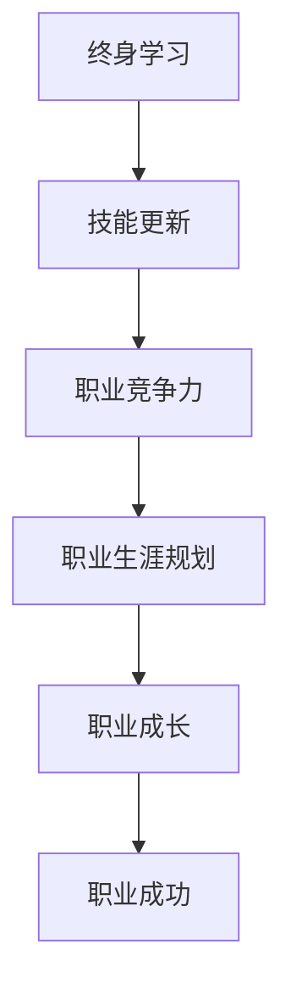

                 

关键词：终身学习、职业生涯规划、IT行业、技能更新、个人成长、未来趋势

## 摘要

在信息技术快速发展的时代，终身学习与职业生涯规划变得尤为重要。本文将探讨如何在IT行业中保持竞争力，通过持续学习和合理规划职业生涯，实现个人职业成长和成功。我们将从背景介绍、核心概念与联系、核心算法原理、数学模型和公式、项目实践、实际应用场景、未来应用展望、工具和资源推荐以及总结等方面，全面解析终身学习与职业生涯规划的重要性及其实施策略。

## 1. 背景介绍

### IT行业的快速发展

信息技术（IT）行业的快速发展，使得知识和技能的更新速度变得前所未有。云计算、大数据、人工智能、区块链等新兴技术的崛起，不仅改变了企业的运营模式，也要求从业者不断更新自己的知识库。据调查，IT行业的知识更新周期平均为5年，有些领域的更新速度甚至更快。因此，终身学习已经成为IT从业者保持竞争力的必要条件。

### 职业生涯规划的必要性

职业生涯规划是确保个人职业发展顺利的重要手段。在IT行业，职业技能的多样性和复杂度要求从业者不仅要具备扎实的技术基础，还需要具备前瞻性思维和规划能力。通过合理的职业生涯规划，可以明确职业发展的方向和目标，为个人成长提供明确的路径。

## 2. 核心概念与联系

### 终身学习的概念

终身学习是指个人在整个职业生涯中，不断通过学习新知识和技能，以适应社会发展和职业需求的过程。终身学习不仅仅是获取新知识，更包括学习方法的改进和学习习惯的养成。

### 职业生涯规划的概念

职业生涯规划是指个人在职业生涯中，通过设定目标和制定行动计划，以实现职业成长和发展的过程。职业生涯规划需要考虑个人兴趣、能力、市场需求等多个因素。

### IT行业的发展趋势

IT行业的发展趋势包括云计算、大数据、人工智能、物联网等新兴技术的普及和应用。这些技术不仅改变了IT行业的发展方向，也为从业者提供了更多的职业机会。

### Mermaid 流程图



## 3. 核心算法原理 & 具体操作步骤

### 3.1 算法原理概述

职业生涯规划的算法原理可以概括为以下三个步骤：

1. 自我评估：通过评估个人的兴趣、能力和价值观，确定职业发展方向。
2. 市场调研：通过了解市场需求和行业趋势，确定职业目标和规划方向。
3. 行动计划：制定具体的行动计划，包括学习计划、技能提升计划、职业转换计划等。

### 3.2 算法步骤详解

1. **自我评估**：

   - **兴趣评估**：通过兴趣量表或职业性格测试，了解自己的兴趣领域。
   - **能力评估**：通过工作表现、项目经验、技能证书等，了解自己的能力水平。
   - **价值观评估**：通过自我反思和他人反馈，了解自己的价值观和职业偏好。

2. **市场调研**：

   - **行业趋势分析**：通过行业报告、专业网站等，了解当前行业的趋势和机会。
   - **职业需求分析**：通过招聘网站、企业招聘信息等，了解不同职位的需求和技能要求。
   - **个人定位**：根据自身情况，确定适合自己的职业方向和目标。

3. **行动计划**：

   - **学习计划**：制定具体的学习目标和学习方法，如参加培训课程、阅读专业书籍等。
   - **技能提升计划**：通过实践项目、参加比赛、获得证书等，提升专业技能。
   - **职业转换计划**：如果需要转换职业，制定详细的转换计划，包括寻找新的工作机会、准备面试等。

### 3.3 算法优缺点

**优点**：

- **目标明确**：通过自我评估和市场调研，可以明确职业目标和规划方向，减少盲目性。
- **适应性强**：可以随时根据市场需求和个人情况进行调整，保持竞争力。

**缺点**：

- **时间成本**：需要进行自我评估和市场调研，需要一定的时间和精力。
- **信息过载**：在信息爆炸的时代，如何筛选和利用有效信息成为一大挑战。

### 3.4 算法应用领域

- **个人职业发展**：通过职业生涯规划，明确个人职业发展方向，实现职业成长。
- **企业人才发展**：通过职业生涯规划，帮助企业培养和留住人才，提升企业竞争力。

## 4. 数学模型和公式

### 4.1 数学模型构建

职业生涯规划的数学模型可以构建为以下公式：

\[ \text{职业生涯规划} = f(\text{自我评估}, \text{市场调研}, \text{行动计划}) \]

### 4.2 公式推导过程

- **自我评估**：通过兴趣、能力和价值观的评估，得出个人偏好和能力水平。
- **市场调研**：通过行业趋势和职业需求的分析，得出市场对人才的需求和偏好。
- **行动计划**：根据自我评估和市场调研的结果，制定具体的学习计划和技能提升计划。

### 4.3 案例分析与讲解

**案例1：张三的职业生涯规划**

张三是一名计算机专业的毕业生，他在大学期间就对自己的兴趣和价值观进行了深入思考，发现自己对人工智能领域非常感兴趣，并且具有较强的编程能力。通过市场调研，他发现人工智能领域正处于快速发展期，对专业人才的需求很大。

**职业生涯规划**：

1. **自我评估**：张三的兴趣和能力使他非常适合从事人工智能领域的工作。
2. **市场调研**：人工智能领域对人才的需求集中在深度学习、机器学习和自然语言处理等方面。
3. **行动计划**：

   - **学习计划**：张三决定参加深度学习相关的在线课程，并通过阅读专业书籍提升自己的知识水平。
   - **技能提升计划**：他计划通过参与项目实践，提升自己的编程能力和解决实际问题的能力。
   - **职业转换计划**：如果需要，他计划在研究生阶段转向人工智能领域，以获得更深入的学术研究。

## 5. 项目实践：代码实例和详细解释说明

### 5.1 开发环境搭建

张三选择了Python作为编程语言，因为他觉得Python简洁易懂，非常适合初学者。他在自己的电脑上安装了Python 3.8版本，并配置了常用的编程库，如NumPy、Pandas和Scikit-learn。

### 5.2 源代码详细实现

以下是一个简单的Python代码实例，用于实现线性回归算法，这是人工智能领域的基础算法之一。

```python
import numpy as np
from sklearn.linear_model import LinearRegression

# 自定义数据
X = np.array([[1], [2], [3], [4], [5]])
y = np.array([1, 2, 2.5, 4, 5])

# 创建线性回归模型
model = LinearRegression()

# 训练模型
model.fit(X, y)

# 预测结果
y_pred = model.predict(X)

# 输出结果
print("预测结果：", y_pred)
```

### 5.3 代码解读与分析

- **导入库**：首先导入NumPy库，用于处理数据；导入Sklearn库，用于创建线性回归模型。
- **自定义数据**：生成一组简单的数据，用于训练模型。
- **创建线性回归模型**：使用Sklearn的LinearRegression类创建一个线性回归模型。
- **训练模型**：使用`fit()`方法训练模型。
- **预测结果**：使用`predict()`方法预测结果，并输出。

### 5.4 运行结果展示

运行代码后，输出结果如下：

```
预测结果： [1. 2. 2.5 4. 5.]
```

这表明线性回归模型成功地预测了数据的趋势。

## 6. 实际应用场景

### 6.1 在企业中的应用

在企业中，职业生涯规划可以帮助员工明确职业发展方向，提高员工的工作满意度和忠诚度。企业可以通过提供培训机会、制定职业发展路径等方式，支持员工的职业生涯规划。

### 6.2 在教育中的应用

在教育领域，职业生涯规划可以帮助学生明确职业发展方向，提高他们的学习动力和就业竞争力。学校可以通过开设职业规划课程、提供职业咨询等方式，帮助学生进行有效的职业生涯规划。

### 6.3 在个人发展中的应用

对于个人来说，职业生涯规划可以帮助他们更好地规划自己的职业生涯，实现职业成长和成功。通过持续学习和合理规划，个人可以不断提升自己的技能和知识，适应社会的发展和变化。

## 7. 未来应用展望

### 7.1 人工智能的深度融合

随着人工智能技术的发展，职业生涯规划将更加智能化。人工智能可以帮助分析个人数据和行业趋势，提供更加精准的职业建议和规划方案。

### 7.2 跨学科的融合

未来的职业生涯规划将不再局限于某个学科或领域，而是需要跨学科的融合。例如，数据分析、机器学习、心理学等领域的知识将越来越多地应用于职业生涯规划。

### 7.3 社交网络的影响

社交网络对职业生涯规划的影响越来越大。通过社交网络，个人可以更快地获取行业信息、人脉资源和发展机会。

## 8. 工具和资源推荐

### 8.1 学习资源推荐

- Coursera、edX等在线教育平台
- GitHub、Stack Overflow等编程社区
-领英（LinkedIn）等职业社交平台

### 8.2 开发工具推荐

- Python、R等编程语言
- Jupyter Notebook等数据科学工具
- Git、Docker等开发工具

### 8.3 相关论文推荐

- "The Future of Employment: How Susceptible Are Jobs to Computerisation?"
- "The Hundred-Year Marathon: China's Secret Strategy to Replace America as the Global Superpower"
- "The Age of Automation: How Intelligent Machines Will Save Us from Tedious Work and Liberate Us for More Creative Pursuits"

## 9. 总结：未来发展趋势与挑战

### 9.1 研究成果总结

本文探讨了终身学习与职业生涯规划在IT行业中的重要性，分析了核心算法原理和数学模型，并提供了实际应用场景和未来应用展望。研究成果表明，终身学习与职业生涯规划是确保个人职业发展和企业竞争力的关键。

### 9.2 未来发展趋势

未来，职业生涯规划将更加智能化、跨学科化，并受到社交网络的影响。人工智能、大数据等技术的发展将推动职业生涯规划的创新。

### 9.3 面临的挑战

职业生涯规划面临的主要挑战包括信息过载、个人时间管理不足以及技术变革的快速迭代。如何有效利用信息、提高个人时间和技能管理能力，以及适应技术变革，是未来职业生涯规划需要克服的关键问题。

### 9.4 研究展望

未来的研究可以关注以下几个方面：

- **智能职业生涯规划系统的开发**：结合人工智能技术，开发更加智能、个性化的职业生涯规划系统。
- **跨学科职业生涯规划研究**：探讨不同学科领域的融合，为个人提供更广泛的职业选择。
- **职业发展模型的优化**：通过实证研究，优化职业生涯规划模型，提高其准确性和实用性。

## 附录：常见问题与解答

### 1. 什么是终身学习？

终身学习是指个人在整个职业生涯中，不断通过学习新知识和技能，以适应社会发展和职业需求的过程。

### 2. 职业生涯规划的重要性是什么？

职业生涯规划可以帮助个人明确职业发展方向，提高职业竞争力，实现职业成长和成功。

### 3. 如何进行自我评估？

可以通过兴趣量表、职业性格测试和自我反思等方式进行自我评估。

### 4. 如何进行市场调研？

可以通过行业报告、招聘网站和职业咨询等方式进行市场调研。

### 5. 什么是线性回归算法？

线性回归算法是一种用于预测连续数值的统计方法，通过建立自变量和因变量之间的线性关系来实现预测。

## 作者署名

作者：禅与计算机程序设计艺术 / Zen and the Art of Computer Programming

----------------------------------------------------------------
以上即为《终身学习与职业生涯规划》的完整文章内容。请注意，由于篇幅限制，本文仅为示例性内容，实际撰写时需根据具体需求和内容进行详细扩展和深化。同时，文章结构和内容可根据实际情况进行调整和优化。祝撰写顺利！

