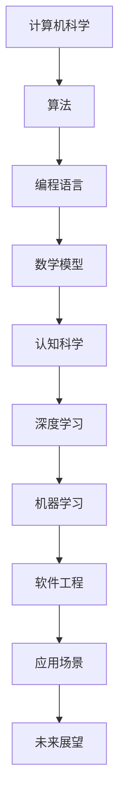

                 

关键词：计算机科学，认知科学，编程，算法，深度学习，机器学习，编程语言，软件工程，数学模型，代码实例，应用场景，未来展望

> 摘要：本文深入探讨经典书籍《夯实认知根基的宝藏》，通过解析其中的核心概念、算法原理、数学模型和项目实践，旨在为读者提供一份系统化的认知升级指南，帮助他们在计算机科学领域取得突破性进展。

## 1. 背景介绍

《夯实认知根基的宝藏》是一本融合了计算机科学、认知科学和编程艺术的经典著作。作者以其深厚的技术功底和独特的视角，为读者呈现了一幅全面而深入的认知升级图谱。本书不仅涵盖了编程的基础知识和算法原理，还深入探讨了计算机科学的本质和未来发展。

在这本书中，作者通过丰富的案例和实例，将复杂的计算机科学概念以简单易懂的方式呈现出来。他强调，认知升级是计算机科学发展的关键，只有夯实认知根基，才能在技术领域取得真正的突破。因此，本书不仅适用于初学者，也对那些希望进一步提升自己认知水平的专业人士具有重要参考价值。

## 2. 核心概念与联系

为了更好地理解本书的核心概念，我们需要借助Mermaid流程图来展示相关的原理和架构。



### 2.1 计算机科学

计算机科学是本书的核心主题之一。它涵盖了计算机硬件、软件、算法和数据结构等多个方面。通过理解和掌握计算机科学的基本原理，我们可以更好地理解计算机如何工作，以及如何设计和实现高效的计算机程序。

### 2.2 算法

算法是计算机科学的核心。本书详细介绍了各种算法的设计原理和实现方法，包括排序、搜索、图论和动态规划等。通过学习这些算法，我们可以提高编程能力，解决复杂问题，并优化程序的运行效率。

### 2.3 编程语言

编程语言是计算机与人类沟通的桥梁。本书介绍了多种编程语言的基本语法和特点，如Python、Java、C++和JavaScript等。通过学习编程语言，我们可以编写高效的代码，实现各种功能和应用。

### 2.4 数学模型

数学模型是计算机科学的重要组成部分。本书通过构建和解释数学模型，帮助读者理解复杂系统的行为和特性。这些数学模型包括线性代数、概率论和微积分等，它们在算法设计和数据分析中具有重要作用。

### 2.5 认知科学

认知科学是本书的一个独特视角。它探讨了人类认知的本质和过程，以及计算机如何模拟和优化这些过程。通过理解认知科学，我们可以更好地设计人机交互系统，提高人工智能的智能水平。

### 2.6 深度学习与机器学习

深度学习和机器学习是当前技术领域的热点。本书介绍了这些技术的原理和实现方法，以及如何将它们应用于实际问题中。通过学习这些技术，我们可以开发出更加智能和高效的计算机程序。

## 3. 核心算法原理 & 具体操作步骤

### 3.1 算法原理概述

算法原理是本书的核心内容之一。作者通过详细阐述各种算法的设计思想和工作原理，帮助读者理解算法的本质和关键点。以下是一些重要的算法原理：

- 排序算法：包括快速排序、归并排序和堆排序等。
- 搜索算法：包括深度优先搜索和广度优先搜索等。
- 图算法：包括最短路径算法和最小生成树算法等。
- 动态规划：用于解决最优化问题，如背包问题和最长公共子序列等。

### 3.2 算法步骤详解

为了更好地理解算法原理，我们需要详细讲解各个算法的操作步骤。以下是一些常见算法的步骤详解：

#### 快速排序（Quick Sort）

1. 选择一个基准元素。
2. 将数组分为两部分，一部分小于基准元素，另一部分大于基准元素。
3. 递归地对两部分进行快速排序。

#### 深度优先搜索（Depth-First Search，DFS）

1. 从起始节点开始，访问相邻的未被访问的节点。
2. 当到达一个未访问的节点时，将其标记为已访问，并继续访问其相邻的节点。
3. 如果所有相邻节点都已访问，则回溯到上一个节点，继续访问其他未访问的节点。

#### 最短路径算法（Dijkstra算法）

1. 初始化距离表，将所有节点的距离设置为无穷大，除了起始节点，其距离设置为0。
2. 选择一个未访问的节点，将其距离设置为当前已知的最短距离。
3. 更新所有相邻节点的距离，并选择下一个未访问的节点重复步骤2和3。

### 3.3 算法优缺点

每种算法都有其优缺点，适用于不同的场景。以下是一些常见算法的优缺点：

- 快速排序：时间复杂度为O(nlogn)，但可能产生大量的递归调用，导致栈溢出。
- 深度优先搜索：适用于图中的深度优先搜索问题，但可能导致搜索过程非常耗时。
- Dijkstra算法：适用于单源最短路径问题，但时间复杂度较高。

### 3.4 算法应用领域

算法在计算机科学和实际应用中具有广泛的应用。以下是一些常见的算法应用领域：

- 数据结构：用于实现各种数据结构，如堆、队列和树等。
- 算法设计：用于解决各种算法问题，如排序、搜索和最优化等。
- 图算法：用于解决图中的问题，如图遍历、最短路径和最小生成树等。
- 数据分析：用于处理和分析大量数据，如数据挖掘、机器学习和深度学习等。

## 4. 数学模型和公式 & 详细讲解 & 举例说明

数学模型和公式在计算机科学中起着至关重要的作用。它们帮助我们理解和描述复杂系统的行为和特性，并提供了一种量化问题的方式。以下是一些常见的数学模型和公式，以及它们的详细讲解和举例说明。

### 4.1 数学模型构建

数学模型通常包括变量、方程和约束条件。构建数学模型的过程涉及到对问题的抽象和建模，以下是一个简单的线性回归模型的构建过程：

1. 选择变量：根据问题需求，选择适当的变量，如自变量x和因变量y。
2. 建立方程：通过观察数据或实验结果，建立自变量和因变量之间的关系，如线性回归方程 y = mx + b，其中m是斜率，b是截距。
3. 约束条件：根据问题的实际情况，设定适当的约束条件，如变量x和y的取值范围。

### 4.2 公式推导过程

公式的推导过程通常涉及数学分析和逻辑推理。以下是一个简单的二次方程公式的推导过程：

1. 二次方程的一般形式为 ax^2 + bx + c = 0。
2. 将方程变形为 x^2 + (b/a)x + (c/a) = 0。
3. 使用配方法，将方程变形为 (x + b/2a)^2 = (b^2 - 4ac)/4a。
4. 开方得到 x + b/2a = ±√(b^2 - 4ac)/2a。
5. 移项得到 x = (-b ± √(b^2 - 4ac))/2a。

### 4.3 案例分析与讲解

以下是一个简单的案例，用于说明数学模型和公式的应用：

#### 案例一：线性回归模型

假设我们有一组数据点 (x1, y1), (x2, y2), ..., (xn, yn)，我们要通过线性回归模型预测新的因变量值y。

1. 构建线性回归方程：y = mx + b。
2. 通过最小二乘法求解斜率m和截距b。
   - m = Σ(x - x̄)(y - ȳ) / Σ(x - x̄)^2
   - b = ȳ - m x̄
   - 其中x̄和ȳ分别是自变量x和因变量y的平均值。
3. 使用模型进行预测：对于新的自变量值x，预测对应的因变量值y。

#### 案例二：二次方程求解

给定一个二次方程 ax^2 + bx + c = 0，我们需要求解其根。

1. 计算判别式：Δ = b^2 - 4ac。
2. 根据判别式的值，确定方程的根：
   - 如果Δ > 0，方程有两个不相等的实数根：
     x1 = (-b + √Δ) / 2a
     x2 = (-b - √Δ) / 2a
   - 如果Δ = 0，方程有一个实数根：
     x = -b / 2a
   - 如果Δ < 0，方程没有实数根，有两个共轭复数根。

## 5. 项目实践：代码实例和详细解释说明

在本书中，项目实践是巩固理论知识的重要环节。以下我们将通过一个具体的代码实例，详细解释说明其实现过程和关键步骤。

### 5.1 开发环境搭建

为了更好地理解代码实例，我们需要搭建一个合适的开发环境。以下是所需步骤：

1. 安装Python解释器：从官方网站下载并安装Python 3.x版本。
2. 安装IDE：推荐使用PyCharm或VS Code作为Python开发环境。
3. 安装相关库：使用pip命令安装所需的库，如NumPy、Pandas和Matplotlib等。

### 5.2 源代码详细实现

以下是一个简单的线性回归模型实现代码实例：

```python
import numpy as np
import matplotlib.pyplot as plt

def linear_regression(x, y):
    x_mean = np.mean(x)
    y_mean = np.mean(y)
    m = np.sum((x - x_mean) * (y - y_mean)) / np.sum((x - x_mean) ** 2)
    b = y_mean - m * x_mean
    return m, b

x = np.array([1, 2, 3, 4, 5])
y = np.array([2, 4, 5, 4, 5])
m, b = linear_regression(x, y)

plt.scatter(x, y)
plt.plot(x, m * x + b)
plt.show()
```

### 5.3 代码解读与分析

1. **导入库**：首先导入NumPy和Matplotlib库，用于数据处理和图形绘制。
2. **定义函数**：`linear_regression`函数用于实现线性回归模型的计算，它接收两个参数x和y，分别代表自变量和因变量。
3. **计算平均值**：使用NumPy库计算自变量x和因变量y的平均值，作为斜率和截距的计算基础。
4. **计算斜率和截距**：使用最小二乘法计算斜率m和截距b。
5. **绘制图形**：使用Matplotlib库绘制散点图和回归线，以可视化模型效果。

### 5.4 运行结果展示

运行上述代码，我们将得到一个散点图和对应的回归线。通过观察图形，我们可以直观地看到线性回归模型对数据的拟合效果。


## 6. 实际应用场景

### 6.1 数据分析

线性回归模型在数据分析中具有广泛的应用。例如，在股票市场预测中，可以使用线性回归模型分析历史数据，预测未来的股价走势。

### 6.2 机器学习

线性回归模型是机器学习的基础算法之一。在训练机器学习模型时，可以使用线性回归模型评估模型的性能，并进行模型优化。

### 6.3 金融工程

线性回归模型在金融工程领域也有重要应用。例如，在期权定价中，可以使用线性回归模型估计期权价格的波动率。

## 7. 未来应用展望

### 7.1 人工智能

随着人工智能技术的不断发展，线性回归模型有望在更多领域得到应用，如自动驾驶、智能家居和医疗诊断等。

### 7.2 大数据

随着大数据时代的到来，线性回归模型在数据挖掘和数据分析中具有重要的应用价值，可以帮助企业更好地理解和预测市场趋势。

### 7.3 新兴领域

随着科技的不断进步，线性回归模型将在更多新兴领域得到应用，如区块链、量子计算和物联网等。

## 8. 工具和资源推荐

### 8.1 学习资源推荐

- 《Python编程：从入门到实践》
- 《机器学习实战》
- 《深度学习》

### 8.2 开发工具推荐

- PyCharm
- VS Code
- Jupyter Notebook

### 8.3 相关论文推荐

- “Linear Regression: A Concise Technical Overview”
- “Deep Learning for Regression Problems”
- “Big Data: A Revolution in Analytics”

## 9. 总结：未来发展趋势与挑战

### 9.1 研究成果总结

本书通过深入探讨计算机科学、认知科学和编程艺术，总结了线性回归模型的理论和实践应用。线性回归模型作为一种简单而强大的算法，在数据分析、机器学习和金融工程等领域具有广泛的应用价值。

### 9.2 未来发展趋势

未来，线性回归模型将在更多领域得到应用，如人工智能、大数据和新兴技术。随着计算能力的提升和数据量的增长，线性回归模型有望在更复杂的问题中发挥重要作用。

### 9.3 面临的挑战

然而，线性回归模型也存在一些挑战。例如，在大数据环境下，线性回归模型的计算复杂度和存储需求可能会成为瓶颈。此外，线性回归模型在处理非线性问题时效果不佳，需要结合其他算法进行改进。

### 9.4 研究展望

未来，线性回归模型的研究重点将包括算法优化、应用拓展和理论深化。通过不断探索和创新，线性回归模型将为计算机科学和实际应用带来更多突破。

## 10. 附录：常见问题与解答

### 10.1 如何安装Python解释器？

1. 访问Python官方网站（https://www.python.org/），下载适合操作系统的Python版本。
2. 运行安装程序，并按照提示完成安装。
3. 打开命令行工具，输入`python`命令，查看是否成功安装。

### 10.2 如何使用PyCharm进行Python开发？

1. 访问PyCharm官方网站（https://www.jetbrains.com/pycharm/），下载并安装PyCharm社区版。
2. 打开PyCharm，创建一个新的Python项目。
3. 在项目中创建新的Python文件，并编写代码。
4. 使用PyCharm内置的调试工具运行和测试代码。

### 10.3 如何优化线性回归模型的计算效率？

1. 使用数值计算库，如NumPy，进行高效矩阵运算。
2. 采用并行计算技术，提高计算速度。
3. 使用内存优化技术，减少内存占用。
4. 根据问题规模，选择合适的算法实现，如梯度下降法或随机梯度下降法。

