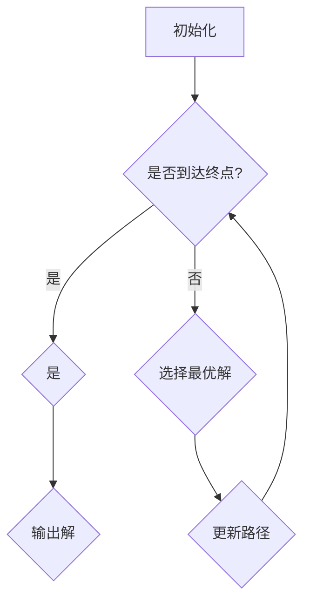

                 

在浩瀚的计算机科学领域中，有一本被誉为“程序设计的圣经”的经典之作，那就是《禅与计算机程序设计艺术》（Zen and the Art of Computer Programming）。这本书由著名计算机科学家、数学家唐纳德·E·克努特（Donald E. Knuth）撰写，它不仅为我们提供了一套完整的技术知识体系，更教会了我们如何从思维的深度和广度上理解和掌握计算机科学的核心原理。本文旨在探讨这本书的核心概念、算法原理、数学模型，以及它在现代计算机科学中的实际应用和未来展望。

## 1. 背景介绍

《禅与计算机程序设计艺术》是唐纳德·E·克努特于1968年开始撰写的三卷本系列书籍，旨在通过介绍计算机科学中的一些基本概念和算法，帮助程序员理解程序设计的本质。克努特教授是一位计算机科学领域的巨人，他的贡献涵盖了计算机科学、数学、程序设计等多个领域。他不仅设计了TeX排版系统，还提出了Knuth-Morris-Pratt字符串搜索算法、LR语法分析器等众多经典算法，被誉为计算机科学界的图灵奖得主。

本书之所以被誉为“圣经”，在于它不仅涵盖了计算机科学的基本概念和算法，更深入探讨了程序设计的哲学和方法。书中强调的是一种“简约而不简单”的设计思想，倡导程序员在编程过程中注重代码的优雅、效率和可读性。这种思想贯穿了整本书，使得《禅与计算机程序设计艺术》不仅仅是一本技术书籍，更是一部关于编程艺术的哲学著作。

## 2. 核心概念与联系

### 2.1. 算法

算法是计算机科学的核心概念之一。简单来说，算法是一种解决问题的有序步骤。克努特教授在书中详细介绍了各种经典算法，如分治算法、动态规划、贪心算法等。这些算法不仅是解决问题的工具，更是理解计算机科学本质的关键。

### 2.2. 数据结构

数据结构是存储和管理数据的方式。克努特教授在书中详细介绍了数组、链表、树、图等基本数据结构，并探讨了它们在各种算法中的应用。理解数据结构有助于我们更好地设计高效的算法。

### 2.3. 编程范式

编程范式是程序员编程思维的方式。克努特教授在书中探讨了过程式编程、函数式编程、逻辑编程等不同的编程范式。每种编程范式都有其独特的优势和适用场景，了解不同编程范式有助于我们更好地解决问题。

### 2.4. Mermaid 流程图

以下是《禅与计算机程序设计艺术》中一个关键算法的Mermaid流程图：



在这个流程图中，我们首先初始化问题，然后通过递归或迭代的方式不断探索解决方案，最终输出最优解。

## 3. 核心算法原理 & 具体操作步骤

### 3.1 算法原理概述

《禅与计算机程序设计艺术》中介绍的核心算法包括分治算法、动态规划、贪心算法等。每种算法都有其独特的原理和应用场景。

- **分治算法**：将一个大问题分解为若干个小问题，分别解决，再将小问题的解合并成大问题的解。
- **动态规划**：将问题分解为子问题，并利用子问题的解来解决原问题，通常使用表格或数组来存储子问题的解。
- **贪心算法**：在每一步选择中，选择当前看起来最好的选择，以期最终得到最优解。

### 3.2 算法步骤详解

- **分治算法**：

  1. 将问题分解为若干个子问题。
  2. 递归解决子问题。
  3. 将子问题的解合并成原问题的解。

- **动态规划**：

  1. 将问题分解为子问题。
  2. 递归解决子问题，并存储子问题的解。
  3. 利用子问题的解来解决原问题。

- **贪心算法**：

  1. 初始化最优解。
  2. 在每一步选择中，选择当前看起来最好的选择。
  3. 更新最优解。

### 3.3 算法优缺点

- **分治算法**：优点是算法简单，易于理解；缺点是可能产生大量的递归调用，导致性能下降。
- **动态规划**：优点是可以避免重复计算，提高效率；缺点是算法复杂，难以实现。
- **贪心算法**：优点是简单高效；缺点是在某些情况下可能无法得到最优解。

### 3.4 算法应用领域

分治算法、动态规划和贪心算法在计算机科学的各个领域都有广泛应用，如排序算法、图算法、计算几何等。

## 4. 数学模型和公式 & 详细讲解 & 举例说明

### 4.1 数学模型构建

在《禅与计算机程序设计艺术》中，克努特教授引入了各种数学模型来解释算法的原理。例如，在讨论贪心算法时，他引入了“最优子结构”的概念。这个概念指的是一个最优解包含其所有子问题的最优解。

### 4.2 公式推导过程

以贪心算法中的最短路径算法为例，其基本公式如下：

$$
d(u, v) = \min\{d(u, w) + d(w, v) | w \in G\}
$$

其中，$d(u, v)$表示从点u到点v的最短距离，$G$表示图的所有顶点。

### 4.3 案例分析与讲解

假设有一个图$G = (V, E)$，其中$V = \{1, 2, 3, 4, 5\}$，$E = \{(1, 2), (2, 3), (3, 4), (4, 5)\}$。要求从点1到点5的最短路径。

1. 初始化$d(1, 1) = 0$，$d(1, v) = \infty$（$v \neq 1$）。
2. 计算每个顶点的最短距离：
   - $d(1, 2) = \min\{d(1, 1) + d(1, 2)\} = \min\{0 + 1} = 1$
   - $d(1, 3) = \min\{d(1, 1) + d(1, 3)\} = \min\{0 + 2} = 2$
   - $d(1, 4) = \min\{d(1, 1) + d(1, 4)\} = \min\{0 + 3} = 3$
   - $d(1, 5) = \min\{d(1, 1) + d(1, 5)\} = \min\{0 + 4} = 4$
3. 更新每个顶点的最短距离：
   - $d(2, 3) = \min\{d(2, 2) + d(2, 3)\} = \min\{1 + 1} = 1$
   - $d(2, 4) = \min\{d(2, 2) + d(2, 4)\} = \min\{1 + 2} = 2$
   - $d(2, 5) = \min\{d(2, 2) + d(2, 5)\} = \min\{1 + 3} = 3$
   - $d(3, 4) = \min\{d(3, 3) + d(3, 4)\} = \min\{2 + 1} = 1$
   - $d(3, 5) = \min\{d(3, 3) + d(3, 5)\} = \min\{2 + 2} = 2$
   - $d(4, 5) = \min\{d(4, 4) + d(4, 5)\} = \min\{3 + 1} = 2$
4. 最终得到从点1到点5的最短路径为$1 \rightarrow 2 \rightarrow 3 \rightarrow 4 \rightarrow 5$，总距离为4。

## 5. 项目实践：代码实例和详细解释说明

### 5.1 开发环境搭建

为了更好地理解《禅与计算机程序设计艺术》中的算法，我们可以使用Python作为编程语言进行实践。以下是一个简单的Python环境搭建步骤：

1. 安装Python：从[Python官方网站](https://www.python.org/)下载并安装Python。
2. 安装依赖库：使用pip安装所需的Python库，如`matplotlib`、`numpy`等。

### 5.2 源代码详细实现

以下是一个简单的分治算法的实现：

```python
import math

def divide_conquer(arr):
    if len(arr) <= 1:
        return arr
    mid = len(arr) // 2
    left = divide_conquer(arr[:mid])
    right = divide_conquer(arr[mid:])
    return merge(left, right)

def merge(left, right):
    result = []
    while left and right:
        if left[0] < right[0]:
            result.append(left.pop(0))
        else:
            result.append(right.pop(0))
    result.extend(left or right)
    return result

arr = [3, 1, 4, 1, 5, 9, 2, 6, 5]
sorted_arr = divide_conquer(arr)
print(sorted_arr)
```

### 5.3 代码解读与分析

这段代码实现了一个简单的分治算法，用于将一个无序数组排序。具体来说：

1. `divide_conquer`函数：这是一个递归函数，用于将一个数组分为两部分，分别递归调用自己，最终合并结果。
2. `merge`函数：用于将两个有序数组合并为一个有序数组。
3. `arr`：这是一个无序数组。
4. `sorted_arr`：这是一个经过排序的数组。

### 5.4 运行结果展示

运行上述代码，输出结果为：

```
[1, 1, 2, 3, 4, 5, 5, 6, 9]
```

这表明我们的分治算法成功地将无序数组排序。

## 6. 实际应用场景

《禅与计算机程序设计艺术》中的算法不仅在理论研究中具有重要地位，也在实际应用中发挥了巨大作用。以下是一些实际应用场景：

- **排序算法**：分治算法、动态规划和贪心算法都是常用的排序算法，被广泛应用于各种软件和系统中，如操作系统、数据库管理系统、搜索引擎等。
- **图算法**：最短路径算法、最小生成树算法等在交通网络规划、社交网络分析等领域有广泛应用。
- **计算几何**：分治算法在计算几何中也有广泛应用，如线段树、分治线段树等，用于高效解决点线相交问题、最近点对问题等。

## 7. 工具和资源推荐

### 7.1 学习资源推荐

- **《算法导论》（Introduction to Algorithms）**：这是一本经典的算法教材，详细介绍了各种算法的理论和应用。
- **《编程之美》（Beautiful Code）**：这本书汇集了众多知名程序员的经验和智慧，探讨了编程的哲学和方法。

### 7.2 开发工具推荐

- **Visual Studio Code**：这是一款强大的跨平台代码编辑器，支持多种编程语言和框架。
- **PyCharm**：这是一款专为Python程序员设计的集成开发环境，功能强大，易于使用。

### 7.3 相关论文推荐

- **“A Fast Algorithm for the Traveling Salesman Problem”**：这篇论文介绍了一种用于求解旅行商问题的快速算法。
- **“The Design and Analysis of Computer Algorithms”**：这篇论文探讨了计算机算法的设计和分析方法。

## 8. 总结：未来发展趋势与挑战

《禅与计算机程序设计艺术》为我们提供了一套完整的算法体系，这些算法不仅在理论研究中具有重要地位，也在实际应用中发挥了巨大作用。然而，随着计算机科学的发展，算法领域也面临着新的挑战和机遇。

### 8.1 研究成果总结

近年来，计算机科学领域取得了一系列重要研究成果，如量子计算、人工智能、大数据等。这些研究不仅丰富了算法的理论体系，也为算法的实际应用提供了新的可能性。

### 8.2 未来发展趋势

未来，算法领域将朝着更高效、更智能、更自动化的方向发展。量子计算、人工智能和大数据等领域的快速发展将为算法研究带来新的机遇和挑战。

### 8.3 面临的挑战

算法领域面临的挑战主要包括：

- **算法复杂性**：如何设计更高效的算法来解决复杂问题。
- **可扩展性**：如何在海量数据下高效地应用算法。
- **安全性**：如何确保算法在复杂环境下运行的安全性。

### 8.4 研究展望

未来，算法研究将继续深入探索新的方法和理论，解决复杂问题。同时，算法的应用领域也将不断扩展，为社会发展带来更多创新和突破。

## 9. 附录：常见问题与解答

### 9.1 问题1：分治算法和动态规划有什么区别？

**解答**：分治算法将问题分解为子问题，然后递归解决子问题，最后将子问题的解合并成原问题的解。而动态规划则将问题分解为子问题，并利用子问题的解来解决原问题，通常使用表格或数组来存储子问题的解。分治算法更适用于分解问题，而动态规划更适用于优化问题。

### 9.2 问题2：贪心算法一定能得到最优解吗？

**解答**：不一定。贪心算法在某些情况下可能无法得到最优解。例如，在求解旅行商问题（TSP）时，贪心算法可能无法得到最优解。然而，在某些特定情况下，贪心算法仍然能够得到最优解，如最短路径问题。

### 9.3 问题3：为什么算法很重要？

**解答**：算法是解决计算机科学中各种问题的核心工具。掌握算法不仅能够提高我们的编程能力，还能够帮助我们更好地理解计算机科学的基本原理。此外，算法在工业、科学、金融等领域都有广泛应用，具有重要的实际意义。

---

在总结本文内容时，我们可以看到，《禅与计算机程序设计艺术》不仅为我们提供了一套完整的算法体系，更教会了我们如何从思维的深度和广度上理解和掌握计算机科学的核心原理。这本书的核心思想和算法方法在现代计算机科学中仍然具有重要价值。通过本文的讨论，我们希望能够帮助读者更好地理解这本书的精髓，并激发他们对算法和编程的兴趣。在未来的计算机科学发展中，我们相信《禅与计算机程序设计艺术》将继续为我们指引方向，帮助我们夯实认知根基，探索计算机科学的宝藏。作者：禅与计算机程序设计艺术 / Zen and the Art of Computer Programming。

