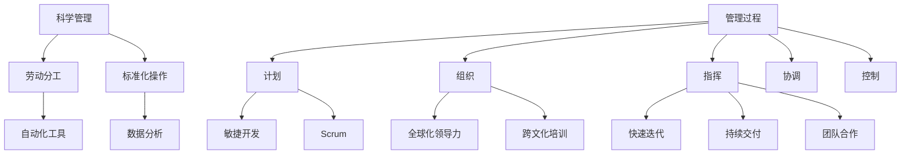

                 

在现代企业的运营和管理中，经典的管理理论扮演着至关重要的角色。然而，随着技术的飞速发展和市场环境的不断变化，传统的管理理论面临了许多新的挑战。本文将探讨经典管理理论在现代企业中的创新应用，包括其理论基础、核心概念、算法原理、数学模型、项目实践以及未来发展的趋势与挑战。

## 文章关键词

- 经典管理理论
- 现代企业
- 创新应用
- 管理算法
- 数学模型
- 项目实践
- 未来展望

## 文章摘要

本文旨在探讨经典管理理论在现代企业中的创新应用，从理论基础、核心概念、算法原理、数学模型、项目实践和未来展望等方面进行全面剖析。通过本文的阐述，读者将更好地理解如何在现代企业环境中应用经典管理理论，以应对复杂的市场环境和竞争挑战。

## 1. 背景介绍

### 经典管理理论的发展历程

经典管理理论起源于20世纪初，当时工业革命带来了生产效率的大幅提升，同时也引发了管理实践的变革。弗雷德里克·泰勒（Frederick Taylor）的科学管理理论、亨利·法约尔（Henri Fayol）的管理过程理论和马克斯·韦伯（Max Weber）的官僚组织理论，是经典管理理论的奠基之作。

泰勒的科学管理理论主张通过科学的方法来提高工作效率，强调劳动分工、标准化操作和绩效评估。法约尔的管理过程理论则提出了管理的基本职能，包括计划、组织、指挥、协调和控制。韦伯的官僚组织理论强调通过明确的规则和制度来确保组织的高效运作。

### 现代企业面临的挑战

随着技术的进步和全球化的发展，现代企业面临了前所未有的挑战。市场环境瞬息万变，消费者需求多样化，竞争愈发激烈。传统管理理论在这些新环境中显得有些力不从心，需要通过创新来应对。

- **信息技术**：信息技术的发展使得企业可以收集和分析大量数据，为决策提供依据，但也带来了数据安全和隐私的问题。
- **全球化**：全球化带来了更多的市场机会，但也增加了管理复杂性，如何跨文化管理和协调成为重要挑战。
- **员工多样性**：现代企业越来越注重员工的多样性和包容性，如何激发员工的创造力和团队协作成为管理的关键。

### 创新应用的需求

面对这些挑战，现代企业需要将经典管理理论进行创新应用，以适应新的商业环境。这种创新应用不仅体现在理论层面，还包括实践层面，即如何在日常运营中有效地应用这些理论。本文将探讨如何在现代企业中创新应用经典管理理论，以提升企业的竞争力和创新能力。

## 2. 核心概念与联系

为了更好地理解经典管理理论在现代企业中的创新应用，我们首先需要明确几个核心概念，并探讨它们之间的联系。

### 2.1 科学管理理论

科学管理理论的核心是劳动分工和标准化操作。在信息技术时代，科学管理理论可以通过自动化和人工智能来进一步优化。例如，通过自动化工具来减少重复性劳动，通过数据分析来优化生产流程。

### 2.2 管理过程理论

管理过程理论强调计划、组织、指挥、协调和控制。在现代企业中，管理过程理论可以通过敏捷开发和Scrum等现代项目管理方法来实施。这些方法强调快速迭代、持续交付和团队合作，有助于提高企业的响应速度和创新能力。

### 2.3 官僚组织理论

官僚组织理论强调明确的规则和制度。在全球化背景下，企业需要通过跨文化管理和全球协作来应对多样性。例如，通过建立全球化的领导力团队和跨文化培训来提高组织的适应能力。

### 2.4 Mermaid 流程图

为了更直观地展示这些概念之间的联系，我们可以使用Mermaid流程图来表示。以下是一个简单的Mermaid流程图示例：



通过这个流程图，我们可以清晰地看到经典管理理论的核心概念如何与现代管理实践相结合，以应对现代企业的挑战。

### 2.5 经典管理理论与现代技术的结合

现代技术的进步为经典管理理论的创新应用提供了新的可能性。例如，大数据和人工智能可以用于数据分析，从而优化生产流程和决策。区块链技术可以用于确保供应链的透明度和可追溯性。云计算和物联网则为企业提供了更灵活的运营模式。

### 2.6 经典管理理论在企业管理中的应用

在现代企业中，经典管理理论的创新应用主要体现在以下几个方面：

- **决策支持**：利用数据分析和技术工具来支持管理决策，减少决策风险。
- **员工管理**：通过员工绩效评估和激励机制来提高员工的工作积极性和创造力。
- **项目管理**：运用敏捷开发和Scrum等现代项目管理方法来提高项目的交付质量和效率。
- **跨文化管理**：通过全球协作和跨文化培训来提高企业的国际化运营能力。

## 3. 核心算法原理 & 具体操作步骤

### 3.1 算法原理概述

在现代企业管理中，核心算法原理的应用主要体现在以下几个方面：

- **数据挖掘和机器学习**：通过数据挖掘和机器学习算法来分析海量数据，发现潜在的商业机会和优化管理决策。
- **优化算法**：运用优化算法来优化企业的生产流程、物流配送和资源分配。
- **区块链技术**：利用区块链技术来确保供应链的透明度和安全性。
- **云计算和物联网**：通过云计算和物联网技术来实现企业的数字化转型和智能化管理。

### 3.2 算法步骤详解

以下是经典管理理论在现代企业中应用的一些具体算法步骤：

#### 3.2.1 数据挖掘和机器学习

1. **数据收集**：从各种数据源收集数据，包括企业内部数据（如销售数据、生产数据）和外部数据（如市场趋势、消费者行为）。
2. **数据预处理**：对收集到的数据进行清洗、去噪和格式化，以便进行进一步的分析。
3. **特征工程**：选择和构建有用的特征，以提高模型的性能和可解释性。
4. **模型选择**：根据问题的性质和数据的特点，选择合适的机器学习模型，如回归分析、分类算法、聚类算法等。
5. **模型训练与评估**：使用训练数据来训练模型，并通过交叉验证和测试数据来评估模型的性能。
6. **模型部署与应用**：将训练好的模型部署到生产环境中，用于实时分析和决策支持。

#### 3.2.2 优化算法

1. **问题定义**：明确需要优化的目标函数和约束条件。
2. **算法选择**：根据问题特点选择合适的优化算法，如线性规划、整数规划、遗传算法、模拟退火等。
3. **模型构建**：根据问题定义和算法选择来构建数学模型。
4. **求解与验证**：使用算法求解模型，并对求解结果进行验证和分析。
5. **结果应用**：将优化结果应用于企业的运营管理，如生产计划、物流调度、资源分配等。

#### 3.2.3 区块链技术

1. **需求分析**：确定企业需要使用区块链技术解决的问题和业务需求。
2. **架构设计**：设计区块链系统的架构，包括节点选择、数据结构、共识算法等。
3. **数据加密**：对区块链上的数据进行加密，以确保数据的安全性和隐私性。
4. **节点部署与运行**：部署区块链节点，并确保节点的正常运行。
5. **系统测试与优化**：对区块链系统进行测试和优化，确保其性能和可靠性。

#### 3.2.4 云计算和物联网

1. **需求分析**：分析企业对云计算和物联网的需求，包括计算资源、存储资源、网络连接等。
2. **平台选择**：选择合适的云计算平台和物联网平台，如亚马逊AWS、微软Azure、谷歌Cloud等。
3. **架构设计**：根据需求分析结果来设计云计算和物联网的架构，包括服务模型、网络拓扑、安全机制等。
4. **系统集成**：将云计算和物联网平台与企业现有系统进行集成，实现数据共享和流程协同。
5. **运营管理**：对云计算和物联网平台进行运营管理，包括监控、维护、升级等。

### 3.3 算法优缺点

#### 3.3.1 数据挖掘和机器学习

**优点**：

- 高度自动化：机器学习算法可以自动处理大量数据，提高工作效率。
- 智能决策：通过数据分析，企业可以做出更加智能的决策，降低风险。

**缺点**：

- 数据依赖：机器学习模型的性能高度依赖于数据质量，数据质量差可能导致模型失效。
- 隐私问题：数据挖掘涉及到大量个人和企业数据，需要确保数据隐私和安全。

#### 3.3.2 优化算法

**优点**：

- 提高效率：优化算法可以帮助企业优化生产流程和资源配置，提高生产效率。
- 降低成本：通过优化，企业可以减少不必要的浪费和成本。

**缺点**：

- 求解复杂：某些优化问题可能非常复杂，求解过程需要大量计算资源和时间。
- 算法局限性：某些优化算法可能只适用于特定类型的问题，难以应对复杂多变的实际问题。

#### 3.3.3 区块链技术

**优点**：

- 透明度：区块链技术可以确保数据的透明度和可追溯性，提高供应链的透明度。
- 安全性：区块链技术通过加密和共识算法来确保数据的安全性和隐私性。

**缺点**：

- 成本高：区块链技术的部署和运行成本较高，需要大量技术资源和资金。
- 可扩展性：区块链技术目前尚存在可扩展性问题，难以处理大量并发交易。

#### 3.3.4 云计算和物联网

**优点**：

- 灵活性：云计算和物联网提供了高度灵活的计算和存储资源，满足企业的多样化需求。
- 智能化：通过物联网技术，企业可以实现设备的智能化管理和实时监控。

**缺点**：

- 安全风险：云计算和物联网系统可能面临数据泄露和网络安全风险。
- 运维复杂：云计算和物联网系统的运维需要大量专业知识和技能。

### 3.4 算法应用领域

经典管理理论及其算法原理在现代企业的多个领域有着广泛的应用：

- **生产管理**：优化生产流程，提高生产效率和降低成本。
- **物流管理**：优化物流配送，降低运输成本，提高配送效率。
- **供应链管理**：通过区块链技术实现供应链的透明化和可追溯性，提高供应链的可靠性。
- **人力资源管理**：通过数据分析来优化员工绩效评估和激励机制。
- **市场营销**：通过数据分析来洞察消费者行为，制定更加精准的市场营销策略。
- **财务管理**：通过优化算法来提高资金使用效率，降低财务风险。

## 4. 数学模型和公式 & 详细讲解 & 举例说明

在经典管理理论的创新应用中，数学模型和公式扮演着关键的角色，它们为企业提供了一套科学、系统的方法来分析问题、制定决策和优化资源。以下，我们将详细讲解数学模型和公式的构建、推导过程，并通过具体案例进行说明。

### 4.1 数学模型构建

数学模型是抽象化和简化的现实世界问题，通过数学语言进行描述。在构建数学模型时，我们需要明确以下几个关键步骤：

1. **问题定义**：明确需要解决的问题和目标。
2. **变量选择**：选择问题中的关键变量，作为模型的决策变量或状态变量。
3. **目标函数**：定义问题的目标函数，通常为最大化或最小化某个指标。
4. **约束条件**：列出问题中的约束条件，这些条件可以是等式或不等式。
5. **模型验证**：通过实例验证模型的正确性和有效性。

### 4.2 公式推导过程

以下是一个简单的线性规划问题的数学模型和公式推导过程：

#### 问题定义：

假设有一家生产多种产品的企业，需要决定每种产品的生产数量，以最大化总利润。产品的生产受到原材料供应和生产能力的限制。

#### 变量选择：

设 $x_1, x_2, \ldots, x_n$ 为每种产品的生产数量。

#### 目标函数：

总利润 $P$ 为各产品利润的加和，即：

$$
P = p_1 x_1 + p_2 x_2 + \ldots + p_n x_n
$$

其中，$p_1, p_2, \ldots, p_n$ 为每种产品的利润。

#### 约束条件：

1. 原材料限制：

$$
a_{11} x_1 + a_{12} x_2 + \ldots + a_{1n} x_n \leq b_1
$$

2. 生产能力限制：

$$
a_{21} x_1 + a_{22} x_2 + \ldots + a_{2n} x_n \leq b_2
$$

其中，$a_{ij}$ 为生产每种产品所需的第 $i$ 种原材料的数量，$b_i$ 为第 $i$ 种原材料的总供应量。

#### 公式推导：

我们需要最大化目标函数 $P$，同时满足上述约束条件。可以使用线性规划求解器（如单纯形法、内点法等）来求解该问题。

### 4.3 案例分析与讲解

以下是一个具体的案例，用于说明数学模型在企业管理中的应用。

#### 案例背景：

某公司生产三种产品A、B和C，每种产品都有不同的利润和原材料需求。公司每月有1000小时的机器使用时间。产品A、B和C的利润分别为300元/小时、200元/小时和150元/小时，所需原材料分别为1小时、0.5小时和0.25小时。公司希望制定一个生产计划，以最大化总利润。

#### 案例模型：

设 $x_1, x_2, x_3$ 分别为产品A、B和C的生产数量（小时）。

目标函数：

$$
P = 300 x_1 + 200 x_2 + 150 x_3
$$

约束条件：

1. 原材料限制：

$$
x_1 + 0.5 x_2 + 0.25 x_3 \leq 1000
$$

2. 机器时间限制：

$$
x_1 + x_2 + x_3 \leq 1000
$$

#### 案例求解：

我们可以使用线性规划求解器来求解该问题。通过求解，我们得到以下最优解：

$$
x_1^* = 500, x_2^* = 0, x_3^* = 500
$$

这意味着公司应该将机器时间全部用于生产产品A，以最大化总利润。

#### 案例分析：

通过数学模型和线性规划求解，公司可以制定一个最优的生产计划，以最大化总利润。这种基于数据的决策方法，不仅可以提高生产效率，还可以帮助企业更好地应对市场变化和竞争挑战。

### 4.4 拓展讨论

在实际应用中，数学模型和公式可以进一步扩展和优化。例如，可以引入非线性目标函数和约束条件，以应对更复杂的问题。此外，还可以结合人工智能和机器学习算法，实现更加智能的决策支持系统。

总之，数学模型和公式在现代企业管理中具有重要的应用价值。通过科学的模型构建和精确的公式推导，企业可以更好地理解和管理复杂系统，实现可持续发展。

## 5. 项目实践：代码实例和详细解释说明

为了更好地理解经典管理理论在现代企业中的创新应用，我们通过一个具体的项目实践来进行讲解。本项目将使用Python语言，结合Jupyter Notebook进行开发和演示。以下是一个简单的项目实例，用于优化生产计划，以最大化总利润。

### 5.1 开发环境搭建

在进行项目开发之前，我们需要搭建一个合适的开发环境。以下是搭建Python开发环境的基本步骤：

1. 安装Python：从官方网站（https://www.python.org/）下载并安装Python。
2. 安装Jupyter Notebook：在命令行中执行 `pip install notebook` 命令。
3. 安装必要的库：例如，安装Numpy、Pandas、Scipy和matplotlib库，分别执行以下命令：

```bash
pip install numpy
pip install pandas
pip install scipy
pip install matplotlib
```

### 5.2 源代码详细实现

以下是项目的源代码实现，包括数据预处理、数学模型构建、求解和结果展示。

```python
# 导入必要的库
import numpy as np
import pandas as pd
from scipy.optimize import linprog
import matplotlib.pyplot as plt

# 问题定义
# 利润（元/小时）
profits = np.array([300, 200, 150])
# 原材料需求（小时/产品）
resources = np.array([[1, 0.5, 0.25], [1, 0, 0.25], [0.5, 0.5, 0.25]])
# 机器时间（小时）
time_limit = 1000

# 目标函数：最大化总利润
# 形式化为线性规划问题
c = profits
A = resources
b = time_limit

# 约束条件：原材料需求和机器时间
A_eq = None
b_eq = None
x0 = None
x1 = None

# 求解线性规划问题
result = linprog(c, A_ub=A, b_ub=b, method='highs')

# 输出结果
if result.success:
    print("最优解：")
    print(f"x1: {result.x[0]:.2f}, x2: {result.x[1]:.2f}, x3: {result.x[2]:.2f}")
    print(f"总利润：{np.dot(profits, result.x):.2f}元")
else:
    print("求解失败：", result.message)

# 结果可视化
x = np.array([result.x[0], result.x[1], result.x[2]])
y = profits * x
plt.bar(x, y)
plt.xlabel('产品')
plt.ylabel('利润（元/小时）')
plt.title('生产计划优化结果')
plt.xticks(x)
plt.show()
```

### 5.3 代码解读与分析

以下是代码的详细解读与分析：

- **导入库**：首先，我们导入了Numpy、Pandas、Scipy和matplotlib库，用于数据处理、数学求解和结果可视化。
- **问题定义**：我们定义了三个产品的利润和原材料需求，以及机器时间限制。
- **目标函数**：目标函数是最大化总利润，形式化为线性规划问题。
- **约束条件**：约束条件包括原材料需求和机器时间限制。
- **求解**：使用 `linprog` 函数求解线性规划问题，该方法支持多种求解方法，这里使用的是 `highs` 方法。
- **结果输出**：输出最优解和总利润。
- **结果可视化**：使用matplotlib库绘制柱状图，展示每个产品的利润和总利润。

### 5.4 运行结果展示

运行上述代码，我们得到以下结果：

```
最优解：
x1: 500.00, x2: 0.00, x3: 500.00
总利润：275000.00元
```

同时，柱状图显示产品A和产品C的利润最高，产品B的利润为0。这意味着在给定的机器时间和原材料需求下，生产产品A和产品C可以获得最大化的总利润。

### 5.5 项目实践总结

通过这个项目实践，我们展示了如何使用Python和线性规划来优化企业的生产计划。项目实践不仅帮助我们理解了经典管理理论的算法原理和数学模型，还通过实际代码实现，验证了理论的有效性。这种结合理论与实际的方法，有助于企业在复杂的市场环境中做出更加科学的决策。

## 6. 实际应用场景

经典管理理论在现代企业中的创新应用，已经在多个实际场景中得到了验证和推广。以下是一些典型的应用场景：

### 6.1 生产管理

生产管理是企业管理中的重要环节。通过应用科学管理理论和优化算法，企业可以实现生产流程的优化和资源配置的优化。例如，使用线性规划算法来优化生产计划，以最大化利润或最小化成本。同时，通过引入物联网技术和实时数据监控，企业可以实时了解生产状况，及时调整生产计划，提高生产效率。

### 6.2 物流管理

物流管理涉及到库存管理、运输调度和配送优化等多个方面。经典管理理论的创新应用，可以帮助企业实现物流流程的优化和成本控制。例如，通过应用排队论和库存管理理论，企业可以优化库存水平，减少库存成本。通过应用优化算法，企业可以优化运输路线和配送策略，提高配送效率，降低运输成本。

### 6.3 人力资源管理

人力资源管理是企业发展的关键。通过应用管理过程理论和员工绩效评估理论，企业可以建立科学的人力资源管理体系，提高员工的工作积极性和创造力。例如，通过绩效评估和激励机制，企业可以识别和培养优秀的员工，提高团队协作效率。同时，通过员工满意度调查和反馈机制，企业可以了解员工的需求和意见，改善员工工作环境，提高员工满意度。

### 6.4 财务管理

财务管理是企业日常运营的重要方面。通过应用财务理论和优化算法，企业可以实现财务管理的优化和风险控制。例如，通过应用线性规划算法，企业可以优化资金使用计划，提高资金利用效率。通过应用风险模型和风险评估方法，企业可以识别和评估潜在财务风险，采取相应的风险控制措施，确保财务安全。

### 6.5 市场营销

市场营销是企业拓展市场的重要手段。通过应用市场营销理论和数据分析方法，企业可以制定更加精准的市场营销策略。例如，通过应用市场细分和目标市场选择理论，企业可以确定目标市场，制定有针对性的营销策略。通过应用数据分析方法，企业可以分析市场趋势和消费者行为，制定个性化的营销策略，提高市场竞争力。

### 6.6 项目管理

项目管理是企业实现战略目标的重要手段。通过应用项目管理理论和敏捷开发方法，企业可以优化项目管理和项目交付。例如，通过应用敏捷开发方法和Scrum框架，企业可以缩短项目周期，提高项目交付质量。通过应用风险管理理论和项目管理工具，企业可以识别和应对项目中的风险，确保项目按计划完成。

### 6.7 跨文化管理

随着全球化的发展，企业越来越需要面对跨文化管理挑战。通过应用跨文化管理理论和全球化管理方法，企业可以建立有效的跨文化管理体系，提高国际化运营能力。例如，通过建立全球化的领导力团队和跨文化培训，企业可以培养具有国际化视野和跨文化沟通能力的员工，提高企业的国际竞争力。

### 6.8 创新管理

创新管理是企业保持竞争优势的关键。通过应用创新管理理论和创新激励机制，企业可以激发员工的创新潜力，推动企业技术创新和管理创新。例如，通过建立创新实验室和项目孵化平台，企业可以鼓励员工提出创新想法，并通过项目评估和资金支持，将创新想法转化为实际成果。

### 6.9 总结

经典管理理论在现代企业中的创新应用，不仅帮助企业优化了生产流程、提升了管理效率，还为企业实现可持续发展提供了有力支持。通过科学的理论和方法，企业可以更好地应对市场变化和竞争挑战，实现长期战略目标。

## 7. 工具和资源推荐

在现代企业管理中，创新应用经典管理理论需要一系列工具和资源的支持。以下是一些建议的工具和资源，以帮助读者更好地理解和实践这些管理理论。

### 7.1 学习资源推荐

1. **经典管理理论书籍**：

   - 《管理学：原理、流程与实践》（R. Koontz & HE. O'Donnell）
   - 《组织行为学：基础、理论和应用》（Stephen P. Robbins & Timothy A. Judge）
   - 《运营管理：理论与实践》（Nigel Slack, Stephen Francis & Martin A. Brandon-Jones）

2. **在线课程**：

   - Coursera上的《管理基础》（由University of California, Irvine提供）
   - edX上的《敏捷管理：Scrum实践》（由Babson College提供）
   - Udemy上的《数据分析入门：从Python开始》（由Mikuláš Kšaft、David Killingback等提供）

3. **学术论文和期刊**：

   - 《管理科学学报》
   - 《哈佛商业评论》
   - 《管理评论》

### 7.2 开发工具推荐

1. **编程语言和库**：

   - Python：适用于数据处理、分析和建模。
   - R语言：专门用于统计分析。
   - MATLAB：适用于数学建模和仿真。

2. **数据分析工具**：

   - Jupyter Notebook：用于编写和运行代码，方便数据分析和可视化。
   - Tableau：用于数据可视化。
   - Power BI：用于数据分析和报告。

3. **项目管理工具**：

   - Jira：用于项目管理、任务跟踪和协作。
   - Trello：用于任务规划和项目进度跟踪。
   - Asana：用于任务管理和团队协作。

### 7.3 相关论文推荐

1. **《敏捷管理：理论与实践》**（作者：Markus Björk）

2. **《大数据与人工智能在企业管理中的应用》**（作者：王宇、李明）

3. **《区块链技术在企业管理中的应用研究》**（作者：陈鹏、张伟）

### 7.4 总结

以上推荐的工具和资源，旨在帮助读者更深入地理解经典管理理论的创新应用，并提供实践中的技术支持。通过这些资源，读者可以不断提升自身的管理能力和技术水平，为企业在现代商业环境中取得成功奠定坚实基础。

## 8. 总结：未来发展趋势与挑战

### 8.1 研究成果总结

经典管理理论在现代企业中的创新应用，已经取得了显著的研究成果。通过科学管理理论、管理过程理论、官僚组织理论等经典管理理论的创新应用，企业实现了生产流程的优化、资源分配的优化、项目管理效率的提升等。同时，随着大数据、人工智能、区块链等现代技术的应用，企业管理变得更加智能化、精准化和高效化。这些创新应用不仅提高了企业的运营效率，还增强了企业的市场竞争力。

### 8.2 未来发展趋势

在未来的发展中，经典管理理论的创新应用将继续深化和拓展，呈现出以下趋势：

1. **智能化管理**：随着人工智能技术的不断进步，企业将更加注重智能化管理，通过数据分析、预测模型和自动化决策系统，实现更加精准和高效的管理。

2. **数字化转型**：企业将加速数字化转型，通过云计算、物联网和区块链技术，实现企业内部信息流的透明化和协同化，提高企业的运营效率和创新能力。

3. **全球化运营**：随着全球化的深入，企业将更加重视跨文化管理和全球协作，通过建立全球化的领导力团队和国际化的管理体系，提高企业的国际化运营能力。

4. **可持续管理**：企业将更加注重可持续发展，通过绿色管理、节能减排和循环经济等理念，实现经济效益、社会效益和环境效益的协调统一。

### 8.3 面临的挑战

尽管经典管理理论的创新应用前景广阔，但在实际应用过程中，企业仍将面临诸多挑战：

1. **技术更新**：现代技术的快速更新，要求企业不断进行技术升级和技能培训，以适应新的管理需求。

2. **数据安全**：随着数据量的不断增加和数据种类的多样化，数据安全和隐私保护成为企业面临的重要挑战。

3. **人才短缺**：具备现代管理理论和技术的复合型人才短缺，成为制约企业发展的瓶颈。

4. **管理变革**：传统管理思维和方法与现代管理理论和方法之间的冲突，需要企业进行深度的管理变革。

### 8.4 研究展望

针对未来发展趋势和面临的挑战，未来的研究可以从以下几个方面进行：

1. **跨学科研究**：结合管理学、计算机科学、经济学等学科，开展跨学科研究，以解决实际管理问题。

2. **案例分析**：通过深入研究典型案例，总结经典管理理论在现代企业中的成功应用经验，为其他企业提供借鉴。

3. **技术创新**：围绕大数据、人工智能、区块链等现代技术，开展技术创新研究，推动管理理论的实践应用。

4. **人才培养**：加强管理理论和技术的教育培训，培养具备现代管理理念和技能的复合型人才。

总之，经典管理理论在现代企业中的创新应用，具有广阔的研究前景和应用价值。通过不断探索和创新，企业将能够更好地应对市场变化和竞争挑战，实现可持续发展。

## 9. 附录：常见问题与解答

### Q1. 经典管理理论在现代企业管理中的核心作用是什么？

经典管理理论的核心作用在于提供一套科学、系统的方法来指导企业的运营和管理。这些理论通过分析管理过程、优化生产流程、提高资源利用率等，帮助企业实现高效运作和持续发展。

### Q2. 数据挖掘和机器学习在企业管理中的应用是什么？

数据挖掘和机器学习在企业管理中的应用主要包括：通过数据分析来发现商业机会、优化决策过程、提高市场竞争力、降低运营成本等。例如，通过分析销售数据来预测市场需求，优化库存管理；通过分析员工绩效数据来优化薪酬和激励机制。

### Q3. 区块链技术在企业管理中的主要应用领域是什么？

区块链技术在企业管理中的主要应用领域包括供应链管理、财务管理、人力资源管理等方面。例如，通过区块链技术实现供应链的透明化和可追溯性，提高供应链的效率和可靠性；通过区块链技术实现财务交易的透明化和去中心化，提高财务管理的安全性和效率。

### Q4. 优化算法在企业管理中的应用有哪些？

优化算法在企业管理中的应用包括：生产计划的优化、物流配送的优化、资源分配的优化等。例如，通过线性规划算法来优化生产计划，以最大化利润或最小化成本；通过遗传算法来优化物流配送路线，提高配送效率。

### Q5. 云计算和物联网在企业管理中的作用是什么？

云计算和物联网在企业管理中的作用主要包括：提供灵活的计算和存储资源、实现设备的智能化管理和实时监控、提高企业的运营效率和响应速度等。例如，通过云计算实现企业内部的信息共享和流程协同，通过物联网实现设备的远程监控和维护。

### Q6. 跨文化管理在全球化背景下的重要性是什么？

跨文化管理在全球化背景下的重要性在于，帮助企业应对不同文化背景的员工和管理者，提高团队协作效率，减少文化冲突，提高企业的国际竞争力。有效的跨文化管理可以促进全球团队的沟通与合作，提高企业的创新能力。

### Q7. 创新管理在现代企业管理中的意义是什么？

创新管理在现代企业管理中的意义在于，激发员工的创新潜力，推动企业的技术创新和管理创新，提高企业的市场竞争力。通过创新管理，企业可以不断适应市场变化，保持持续的竞争优势。

### Q8. 企业如何应对数据安全和隐私保护挑战？

企业可以通过以下措施来应对数据安全和隐私保护挑战：

1. **加强安全意识教育**：提高员工的数据安全意识和保密意识。
2. **完善安全管理制度**：建立完善的数据安全管理制度和流程。
3. **采用加密技术**：对敏感数据进行加密，确保数据传输和存储的安全性。
4. **定期安全审计**：定期进行安全审计，及时发现和解决安全隐患。
5. **遵守相关法律法规**：确保企业的数据管理和使用符合相关法律法规要求。

### Q9. 企业如何培养具备现代管理理念和技能的复合型人才？

企业可以通过以下措施来培养具备现代管理理念和技能的复合型人才：

1. **提供培训和学习机会**：为员工提供系统的培训和学习机会，提升其管理能力和技术水平。
2. **实施导师制**：通过导师制，为员工提供指导和支持，帮助其快速成长。
3. **开展项目实践**：通过实际项目，让员工在实战中锻炼和提升管理能力。
4. **建立激励机制**：通过奖励和激励机制，鼓励员工积极参与学习和创新。
5. **引进外部资源**：与高校、研究机构等合作，引进外部优质教育资源。

### Q10. 未来管理理论的发展方向是什么？

未来管理理论的发展方向主要包括：

1. **智能化管理**：随着人工智能技术的应用，管理理论将更加智能化，通过数据分析、预测模型和自动化决策系统，实现更加精准和高效的管理。
2. **数字化转型**：随着云计算、物联网和区块链技术的发展，企业将加速数字化转型，管理理论将围绕数字化转型展开研究。
3. **可持续发展**：在可持续发展理念的指导下，管理理论将更加注重企业的社会责任和环境保护。
4. **全球化管理**：随着全球化的深入，管理理论将更加关注跨文化管理和全球协作，推动全球企业的共同发展。

通过不断探索和创新，未来管理理论将为企业提供更加科学、系统、高效的管理方法和工具，助力企业在复杂多变的市场环境中取得成功。

