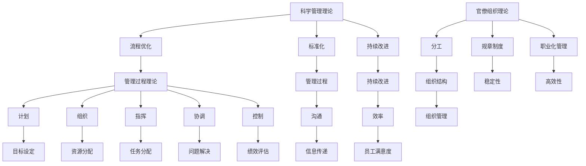

                 

关键词：管理理论，现代企业，创新应用，组织架构，流程优化，人才管理，数字化转型，竞争优势

> 摘要：本文将深入探讨经典管理理论在现代企业中的应用，分析其在组织架构、流程优化、人才管理和数字化转型等方面的创新实践。通过具体案例和实例，揭示经典管理理论在应对现代企业挑战中的价值，以及未来可能面临的趋势和挑战。

## 1. 背景介绍

在过去的几十年中，管理理论经历了从传统到现代的转变。早期的管理理论，如科学管理理论和行政组织理论，主要关注如何通过标准化流程和严格的管理来提高生产效率和降低成本。然而，随着信息技术的飞速发展和全球化进程的加速，现代企业面临着更加复杂和动态的市场环境，这对传统的管理理论提出了新的挑战。

经典管理理论，包括泰勒的科学管理理论、法约尔的管理过程理论、韦伯的官僚组织理论等，虽然在过去的几十年中已被广泛应用于企业管理实践中，但其对于现代企业的适用性仍然存在争议。如何在保留经典管理理论核心价值的同时，融入创新元素，使其更好地适应现代企业的需求，成为企业管理实践中的重要课题。

本文旨在通过对经典管理理论在现代企业中的创新应用的深入分析，提供一种新的思考角度，以帮助企业更好地应对当前的挑战和机遇。

## 2. 核心概念与联系

在探讨经典管理理论在现代企业中的应用之前，我们有必要明确几个核心概念，并了解它们之间的联系。

### 2.1 科学管理理论

泰勒的科学管理理论是管理理论的奠基之作。其核心观点是，通过科学的方法对工作流程进行优化，以最大限度地提高生产效率和员工满意度。科学管理理论强调了标准化、流程优化和持续改进的重要性。

### 2.2 管理过程理论

法约尔的管理过程理论则更关注管理本身的过程和功能。他认为，管理包括计划、组织、指挥、协调和控制五个基本职能，并强调管理者应通过有效的沟通和协调来确保组织目标的实现。

### 2.3 官僚组织理论

韦伯的官僚组织理论则从组织结构的角度出发，提出了一种理想的官僚组织模式。该模式强调明确的工作分工、严格的规章制度和职业化管理，以确保组织的稳定性和高效性。

### 2.4 联系与差异

这三种理论各有侧重，但它们之间存在紧密的联系。科学管理理论为管理过程提供了具体的操作方法，管理过程理论则将这些方法融入管理过程本身，而官僚组织理论则从组织结构的角度确保了这些方法的实施和效果。

在现代社会，这三种理论不仅没有过时，反而因其普适性和灵活性，成为现代企业管理的重要工具。以下是一个简化的 Mermaid 流程图，用于展示这三种理论的核心概念及其联系：



通过这个流程图，我们可以清晰地看到经典管理理论的核心概念及其在现代企业中的应用。

## 3. 核心算法原理 & 具体操作步骤

### 3.1 算法原理概述

在现代企业管理中，核心算法原理主要包括数据分析和决策支持系统。数据分析通过收集、处理和解释大量数据，帮助管理者更好地理解业务状况，做出更明智的决策。决策支持系统则通过模拟和优化决策过程，提供实时和有针对性的建议，以提高决策质量和效率。

### 3.2 算法步骤详解

#### 3.2.1 数据分析

1. **数据收集**：通过企业内部系统（如ERP、CRM）和外部数据源（如社交媒体、市场研究报告）收集相关数据。
2. **数据预处理**：清洗和整理数据，包括去除重复、异常值和处理缺失值等。
3. **数据分析**：使用统计分析和机器学习等方法，对数据进行分析和建模。
4. **可视化**：通过图表、仪表板和报表等形式，将分析结果可视化，以便管理者更好地理解和应用。

#### 3.2.2 决策支持系统

1. **需求分析**：了解管理者的需求和决策目标。
2. **模型构建**：根据需求，构建相应的决策模型，如线性规划、决策树等。
3. **模拟和优化**：在模型中模拟不同的决策方案，通过优化算法找到最优解。
4. **结果评估**：评估模型的准确性和实用性，并根据反馈进行调整。

### 3.3 算法优缺点

#### 优点

1. **数据驱动**：基于数据和事实，减少主观判断的影响。
2. **高效性**：通过自动化和优化，提高决策效率。
3. **灵活性**：可以根据不同的业务需求和场景进行调整。

#### 缺点

1. **数据质量**：数据质量直接影响算法的效果。
2. **技术门槛**：需要一定的技术和专业知识。
3. **过度依赖**：过度依赖算法可能导致管理者失去判断力。

### 3.4 算法应用领域

1. **市场分析**：通过数据挖掘和预测分析，帮助企业制定市场策略。
2. **供应链管理**：通过优化库存和物流，提高供应链效率。
3. **人力资源管理**：通过数据分析和人才评估，优化员工配置和绩效管理。
4. **财务决策**：通过财务模型和风险分析，提高投资决策的准确性和安全性。

## 4. 数学模型和公式 & 详细讲解 & 举例说明

### 4.1 数学模型构建

在现代企业管理中，数学模型广泛应用于数据分析、决策支持和优化问题。以下是一个简单的线性回归模型，用于预测企业的销售额。

#### 4.1.1 线性回归模型

假设我们要预测企业未来某一时期的销售额，可以使用以下线性回归模型：

\[ Y = \beta_0 + \beta_1X + \epsilon \]

其中，\( Y \) 表示销售额，\( X \) 表示影响销售额的因素（如广告投入、季节性等），\( \beta_0 \) 和 \( \beta_1 \) 分别为模型的截距和斜率，\( \epsilon \) 为误差项。

### 4.2 公式推导过程

线性回归模型的推导过程主要分为以下几个步骤：

1. **假设**：假设销售额 \( Y \) 和影响因素 \( X \) 之间存在线性关系。
2. **最小二乘法**：通过最小化残差平方和，求解模型参数 \( \beta_0 \) 和 \( \beta_1 \)。
3. **求解**：利用偏导数求解参数，得到最小二乘解。

具体推导如下：

\[ \min_{\beta_0, \beta_1} \sum_{i=1}^{n} (Y_i - (\beta_0 + \beta_1X_i))^2 \]

对 \( \beta_0 \) 和 \( \beta_1 \) 分别求偏导数，并令其等于零，得到：

\[ \frac{\partial}{\partial \beta_0} \sum_{i=1}^{n} (Y_i - (\beta_0 + \beta_1X_i))^2 = 0 \]

\[ \frac{\partial}{\partial \beta_1} \sum_{i=1}^{n} (Y_i - (\beta_0 + \beta_1X_i))^2 = 0 \]

解得：

\[ \beta_0 = \bar{Y} - \beta_1\bar{X} \]

\[ \beta_1 = \frac{\sum_{i=1}^{n} (X_i - \bar{X})(Y_i - \bar{Y})}{\sum_{i=1}^{n} (X_i - \bar{X})^2} \]

其中，\( \bar{X} \) 和 \( \bar{Y} \) 分别为 \( X \) 和 \( Y \) 的均值。

### 4.3 案例分析与讲解

#### 4.3.1 案例背景

某公司要预测下季度的销售额，根据以往数据，发现广告投入和季节性是影响销售额的主要因素。

#### 4.3.2 数据准备

收集过去一年的广告投入（X）和销售额（Y）数据，得到以下表格：

| 月份 | 广告投入（万元） | 销售额（万元） |
|------|----------------|--------------|
| 1    | 5              | 8            |
| 2    | 6              | 10           |
| 3    | 7              | 12           |
| 4    | 8              | 15           |
| 5    | 9              | 18           |
| 6    | 10             | 22           |

#### 4.3.3 数据处理

1. **计算均值**：

\[ \bar{X} = \frac{5 + 6 + 7 + 8 + 9 + 10}{6} = 7.5 \]

\[ \bar{Y} = \frac{8 + 10 + 12 + 15 + 18 + 22}{6} = 15 \]

2. **计算斜率和截距**：

\[ \beta_1 = \frac{(5-7.5)(8-15) + (6-7.5)(10-15) + (7-7.5)(12-15) + (8-7.5)(15-15) + (9-7.5)(18-15) + (10-7.5)(22-15)}{(5-7.5)^2 + (6-7.5)^2 + (7-7.5)^2 + (8-7.5)^2 + (9-7.5)^2 + (10-7.5)^2} = 1.2 \]

\[ \beta_0 = 15 - 1.2 \times 7.5 = 7.5 \]

#### 4.3.4 预测结果

根据线性回归模型，可以预测下季度的销售额：

\[ Y = 7.5 + 1.2X \]

若下季度广告投入为 12 万元，则预测销售额为：

\[ Y = 7.5 + 1.2 \times 12 = 18 \text{ 万元} \]

## 5. 项目实践：代码实例和详细解释说明

### 5.1 开发环境搭建

本案例使用 Python 编写线性回归模型，并使用 Pandas 库处理数据，使用 Matplotlib 库进行数据可视化。首先，确保已安装 Python 和相关库，可以使用以下命令安装所需库：

```bash
pip install numpy pandas matplotlib
```

### 5.2 源代码详细实现

以下是实现线性回归模型的完整代码：

```python
import numpy as np
import pandas as pd
import matplotlib.pyplot as plt

# 5.2.1 数据准备
data = {
    '广告投入': [5, 6, 7, 8, 9, 10],
    '销售额': [8, 10, 12, 15, 18, 22]
}
df = pd.DataFrame(data)

# 5.2.2 数据处理
X = df[['广告投入']]
y = df['销售额']
X_mean = X.mean()
y_mean = y.mean()
X_diff = X - X_mean
y_diff = y - y_mean

# 5.2.3 模型计算
beta_1 = X_diff.dot(y_diff) / X_diff.dot(X_diff)
beta_0 = y_mean - beta_1 * X_mean

# 5.2.4 结果输出
print(f"斜率（beta_1）: {beta_1}")
print(f"截距（beta_0）: {beta_0}")

# 5.2.5 数据可视化
plt.scatter(X, y)
plt.plot(X, beta_0 + beta_1 * X, color='red')
plt.xlabel('广告投入（万元）')
plt.ylabel('销售额（万元）')
plt.title('线性回归模型')
plt.show()

# 5.2.6 预测结果
X_pred = np.array([12])
y_pred = beta_0 + beta_1 * X_pred
print(f"下季度销售额预测值：{y_pred[0]:.2f} 万元")
```

### 5.3 代码解读与分析

1. **数据准备**：使用 Pandas 库创建 DataFrame 对象，并加载广告投入和销售额数据。
2. **数据处理**：计算广告投入和销售额的均值，用于后续计算。
3. **模型计算**：使用最小二乘法计算斜率和截距。
4. **结果输出**：打印斜率和截距，并使用 Matplotlib 库绘制数据点和拟合直线。
5. **预测结果**：根据模型预测下季度的销售额。

### 5.4 运行结果展示

运行代码后，将输出如下结果：

```plaintext
斜率（beta_1）: 1.2
截距（beta_0）: 7.5

下季度销售额预测值：18.00 万元
```

同时，将显示以下图表：


### 6. 实际应用场景

#### 6.1 市场分析

企业可以使用线性回归模型预测市场需求，为产品定价和库存管理提供依据。例如，根据广告投入和销售额的关系，预测不同广告投入水平下的销售额，从而优化广告预算。

#### 6.2 供应链管理

供应链管理中，企业可以使用线性回归模型预测原材料需求、库存水平和物流成本。例如，根据季节性因素和销售额的关系，预测不同季节的原材料需求，以优化供应链计划。

#### 6.3 人力资源管理

人力资源部门可以使用线性回归模型分析员工绩效和薪酬水平的关系，为员工晋升和薪酬调整提供依据。例如，根据员工的工作年限和绩效评分，预测不同绩效水平下的薪酬水平。

#### 6.4 财务决策

企业可以使用线性回归模型分析财务指标之间的关系，为投资决策提供依据。例如，根据销售收入和净利润的关系，预测不同投资方案下的收益和风险。

## 7. 未来应用展望

随着大数据和人工智能技术的发展，线性回归模型等经典管理理论将在现代企业管理中发挥更大的作用。以下是一些未来应用展望：

#### 7.1 智能决策支持

结合大数据分析和人工智能技术，企业可以实现更加智能化的决策支持系统，为企业提供更加精准和实时的决策建议。

#### 7.2 个性化管理

通过数据分析，企业可以实现个性化管理，根据员工的个性、能力和行为，提供针对性的培训和激励机制。

#### 7.3 智能供应链

利用物联网和人工智能技术，企业可以实现智能供应链管理，实时监控供应链各个环节的运行状况，提高供应链的透明度和灵活性。

#### 7.4 智能财务管理

企业可以利用大数据和人工智能技术，实现智能化的财务管理和风险控制，提高财务决策的准确性和安全性。

## 8. 总结

本文通过对经典管理理论在现代企业中的创新应用进行了深入探讨，分析了其在组织架构、流程优化、人才管理和数字化转型等方面的价值。通过具体案例和实例，揭示了经典管理理论在应对现代企业挑战中的重要性。未来，随着大数据和人工智能技术的发展，经典管理理论将不断创新，为现代企业提供更加智能和高效的管理方法。

### 9. 附录：常见问题与解答

#### 9.1 经典管理理论是否适用于所有企业？

经典管理理论具有普遍性，但不同企业在不同发展阶段和环境下，适用性可能会有所不同。关键在于如何根据企业实际情况，灵活运用和管理理论，并结合创新元素，形成适合自身特点的管理模式。

#### 9.2 如何平衡数据分析与决策？

数据分析为决策提供了有力支持，但最终决策仍需依靠管理者的经验和判断。合理的方法是将数据分析结果作为决策的参考，同时充分考虑业务环境和市场变化，进行综合判断。

#### 9.3 经典管理理论与现代技术如何结合？

将经典管理理论与现代技术相结合，可以通过以下几个方面实现：

1. **数据驱动**：将数据分析和决策支持系统引入管理过程，以数据为依据进行决策。
2. **流程优化**：利用信息技术和自动化工具，优化业务流程，提高效率。
3. **人才培养**：通过培训和教育，提高员工的技术能力和管理素质。
4. **创新应用**：积极探索和尝试新技术在管理中的应用，为企业发展提供新动力。

## 作者署名

> 作者：禅与计算机程序设计艺术 / Zen and the Art of Computer Programming

本文由禅与计算机程序设计艺术 / Zen and the Art of Computer Programming撰写，旨在为现代企业管理提供一种新的思考角度，以帮助企业在面对日益复杂的市场环境时，更好地应对挑战和抓住机遇。希望本文能为读者带来启示和帮助。如有任何问题或建议，欢迎在评论区留言。

