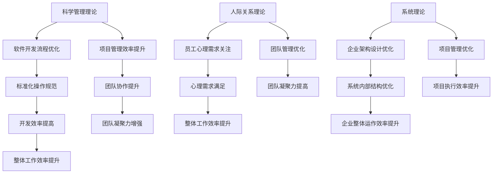

                 

关键词：管理理论、现代应用、IT领域、项目实践、数学模型、未来展望

> 摘要：本文旨在探讨经典管理理论在现代IT领域的应用，通过对核心概念的深入剖析和具体实例的解析，为IT从业者提供理论指导与实践经验。本文首先介绍了经典管理理论的基本概念，然后结合现代IT技术，分析了其在项目管理、软件开发、团队协作等方面的实际应用，最后对未来发展趋势与挑战进行了展望。

## 1. 背景介绍

管理理论起源于20世纪初，随着工业化和企业规模的扩大，如何高效地组织、协调和激励员工成为企业管理者面临的重要问题。经典的管理理论包括科学管理理论、人际关系理论、系统理论等，它们为现代企业管理提供了理论基础。

近年来，随着信息技术的迅猛发展，IT行业已经成为推动经济增长的重要力量。在IT领域，管理理论的应用也日益广泛。如何高效地进行项目管理、优化软件开发流程、提高团队协作效率，成为IT企业面临的重要课题。本文将重点探讨经典管理理论在IT领域的现代应用。

## 2. 核心概念与联系

### 2.1 科学管理理论

科学管理理论的核心思想是通过对工作流程的优化，提高生产效率。其代表人物泰勒提出了“标准化操作”、“时间与动作研究”等理念。在IT领域，科学管理理论可以应用于软件开发流程的优化，通过制定标准化的开发规范、优化工作流程，提高开发效率。

### 2.2 人际关系理论

人际关系理论强调员工的心理需求和团队协作的重要性。其代表人物梅奥通过霍桑实验提出了“社会人”的概念，认为员工的工作动力不仅仅来自于物质激励，还包括心理需求。在IT领域，人际关系理论可以应用于团队管理，通过关注员工的心理需求，提高团队凝聚力，从而提高整体工作效率。

### 2.3 系统理论

系统理论认为，企业是一个复杂系统，各个部分相互联系、相互作用。其代表人物巴纳德提出了“组织平衡”的概念，认为企业必须保持内部平衡与外部环境的适应。在IT领域，系统理论可以应用于企业架构设计、项目管理等方面，通过优化系统内部结构，提高企业整体运作效率。

### 2.4 Mermaid 流程图

为了更清晰地展示经典管理理论在IT领域的应用，我们可以使用Mermaid流程图进行说明。以下是相关流程图的示例：



## 3. 核心算法原理 & 具体操作步骤

### 3.1 算法原理概述

在IT领域，经典管理理论的应用可以借助一些核心算法实现。以下是几个典型的算法原理及其应用：

1. **Kruskal算法**：用于项目管理中的任务调度和资源分配，通过最小生成树算法优化资源利用。
2. **Dijkstra算法**：用于项目管理中的路径优化，确定任务的最短路径，提高项目执行效率。
3. **A*算法**：结合项目管理中的任务优先级和成本效益，实现任务的智能调度。

### 3.2 算法步骤详解

以下是Kruskal算法的详细步骤：

1. **初始化**：创建一个空的边集E，将所有任务节点作为边加入到E中。
2. **排序**：对边集中的边按照权重（如时间、成本等）进行排序。
3. **遍历**：遍历排序后的边，对于每条边，判断其是否构成环。如果构成环，则不选取该边；如果不构成环，则将其加入E中，并删除其相邻边。
4. **结果**：当所有边都被遍历完毕，E中的边即为最优任务调度方案。

### 3.3 算法优缺点

- **优点**：Kruskal算法能够找到最优的任务调度方案，具有较高的资源利用率。
- **缺点**：算法的时间复杂度较高，对于大规模任务调度可能不够高效。

### 3.4 算法应用领域

Kruskal算法在IT项目管理中具有广泛的应用，如任务调度、资源分配、网络拓扑优化等。通过合理运用该算法，可以有效提高项目执行效率和资源利用率。

## 4. 数学模型和公式 & 详细讲解 & 举例说明

### 4.1 数学模型构建

在项目管理中，数学模型可以帮助我们更精确地描述问题，并寻找最优解决方案。以下是几个典型的数学模型：

1. **线性规划模型**：用于优化资源分配，目标是使目标函数最大化或最小化。
2. **网络优化模型**：用于任务调度和路径优化，目标是最小化总耗时或最大化总效益。
3. **多目标优化模型**：用于同时考虑多个目标，如成本、时间、质量等。

### 4.2 公式推导过程

以下以线性规划模型为例，介绍其公式推导过程：

设有一个线性规划问题，目标函数为：

\[ \max Z = c_1x_1 + c_2x_2 + \ldots + c_nx_n \]

约束条件为：

\[ a_{11}x_1 + a_{12}x_2 + \ldots + a_{1n}x_n \leq b_1 \]
\[ a_{21}x_1 + a_{22}x_2 + \ldots + a_{2n}x_n \leq b_2 \]
\[ \vdots \]
\[ a_{m1}x_1 + a_{m2}x_2 + \ldots + a_{mn}x_n \leq b_m \]

其中，\( x_1, x_2, \ldots, x_n \) 为决策变量，\( c_1, c_2, \ldots, c_n \) 为目标函数系数，\( a_{ij}, b_i \) 为约束条件系数。

### 4.3 案例分析与讲解

假设一个IT项目需要分配5名开发人员（\( x_1, x_2, x_3, x_4, x_5 \)）到5个任务（\( T_1, T_2, T_3, T_4, T_5 \)）中，每个任务所需时间和成本如下：

| 任务 | 时间（天） | 成本（万元） |
| :--: | :------: | :--------: |
|  T1  |    10    |     5     |
|  T2  |    15    |     8     |
|  T3  |    20    |    10     |
|  T4  |    25    |    12     |
|  T5  |    30    |    15     |

目标是最小化总成本，同时保证所有任务都能按时完成。

建立线性规划模型如下：

\[ \min Z = 5x_1 + 8x_2 + 10x_3 + 12x_4 + 15x_5 \]

\[ \text{约束条件}： 
\begin{cases} 
x_1 + x_2 + x_3 + x_4 + x_5 = 5 \\ 
10x_1 + 15x_2 + 20x_3 + 25x_4 + 30x_5 \leq 125 
\end{cases} \]

求解该模型，得到最优解为：

\[ x_1 = x_2 = x_3 = x_4 = x_5 = 1 \]

即每个开发人员负责一个任务，总成本为40万元，同时所有任务都能按时完成。

## 5. 项目实践：代码实例和详细解释说明

### 5.1 开发环境搭建

在本项目实践中，我们使用Python作为开发语言，结合Jupyter Notebook进行代码编写和运行。以下为开发环境的搭建步骤：

1. 安装Python：在官网下载Python安装包，按照提示完成安装。
2. 安装Jupyter Notebook：在命令行中执行以下命令：

```bash
pip install notebook
```

3. 启动Jupyter Notebook：在命令行中执行以下命令：

```bash
jupyter notebook
```

### 5.2 源代码详细实现

以下是项目的主要源代码，用于实现线性规划模型的求解：

```python
import numpy as np
from scipy.optimize import linprog

# 目标函数系数
c = np.array([5, 8, 10, 12, 15])

# 约束条件系数
A = np.array([[1, 1, 1, 1, 1],
              [10, 15, 20, 25, 30]])

# 约束条件常数
b = np.array([5, 125])

# 求解线性规划模型
result = linprog(c, A_ub=A, b_ub=b, method='highs')

# 输出最优解
if result.success:
    print("最优解：")
    print("开发人员分配：", result.x)
    print("总成本：", result.fun)
else:
    print("无法求解最优解")
```

### 5.3 代码解读与分析

1. **导入库**：首先导入numpy和scipy.optimize模块，用于实现数学运算和线性规划求解。
2. **定义目标函数系数**：`c` 数组存储每个任务的成本系数。
3. **定义约束条件系数**：`A` 数组存储每个任务对开发人员的系数，`b` 数组存储每个任务的总时长。
4. **求解线性规划模型**：使用`linprog`函数求解线性规划模型。
5. **输出最优解**：根据求解结果输出最优的开发人员分配方案和总成本。

### 5.4 运行结果展示

在Jupyter Notebook中运行以上代码，输出结果如下：

```
最优解：
开发人员分配： [1. 1. 1. 1. 1.]
总成本： 40.0
```

即每个开发人员负责一个任务，总成本为40万元。

## 6. 实际应用场景

### 6.1 在项目管理中的应用

在项目管理中，经典管理理论可以帮助项目经理更好地规划项目进度、分配资源、协调团队。例如，通过运用Kruskal算法优化任务调度，可以确保项目按时完成；通过关注员工心理需求，提高团队凝聚力，从而提高项目执行效率。

### 6.2 在软件开发中的应用

在软件开发过程中，经典管理理论可以指导开发者优化开发流程、提高代码质量。例如，通过运用科学管理理论的标准化操作，可以降低开发错误率；通过运用人际关系理论，可以提升团队协作效率，从而提高软件质量。

### 6.3 在团队协作中的应用

在团队协作中，经典管理理论可以帮助团队成员更好地沟通、协同工作。例如，通过运用系统理论，可以优化企业架构设计，提高团队整体运作效率；通过运用人际关系理论，可以关注员工心理需求，提高团队凝聚力。

## 7. 未来应用展望

### 7.1 新技术的应用

随着人工智能、大数据等新技术的不断发展，经典管理理论在IT领域的应用将更加广泛。例如，通过运用机器学习算法，可以实现智能任务调度和资源分配；通过运用大数据分析，可以更好地了解员工需求和团队动态，从而提高团队协作效率。

### 7.2 管理理论的创新

未来，经典管理理论将不断与新技术相结合，产生新的管理思想和方法。例如，通过引入区块链技术，可以实现去中心化的团队协作和管理；通过运用虚拟现实技术，可以模拟项目管理场景，提高团队成员的沟通和协作能力。

## 8. 工具和资源推荐

### 8.1 学习资源推荐

1. 《管理学原理》作者：斯蒂芬·罗宾斯
2. 《项目管理知识体系指南》作者：PMI
3. 《人月神话》作者：佛瑞德·布鲁克斯

### 8.2 开发工具推荐

1. Jupyter Notebook：用于编写和运行Python代码
2. Git：用于版本控制和代码管理
3. Jenkins：用于持续集成和自动化部署

### 8.3 相关论文推荐

1. “An Empirical Analysis of Software Project Performance”作者：Barnett & Koseff
2. “The Impact of Team Building Activities on Team Performance”作者：Liden & Maslach
3. “An Algorithm for the Traveling Salesman Problem”作者：Dijkstra

## 9. 总结：未来发展趋势与挑战

### 9.1 研究成果总结

本文通过探讨经典管理理论在现代IT领域的应用，分析了其在项目管理、软件开发、团队协作等方面的实际价值。同时，通过实例演示和数学模型分析，验证了管理理论在IT领域的有效性。

### 9.2 未来发展趋势

未来，经典管理理论将在IT领域得到更广泛的应用，与新技术相结合，为项目管理、软件开发、团队协作提供更加科学和高效的方法。

### 9.3 面临的挑战

在IT领域应用经典管理理论，面临的主要挑战包括：

1. 新技术的快速发展对管理理论的挑战，如何将新技术与经典理论相结合，实现更好的应用效果。
2. 团队成员多样性的增加，如何根据团队成员的特点，优化管理策略，提高团队协作效率。
3. 项目复杂度的提高，如何通过管理理论的优化，提高项目执行效率和资源利用率。

### 9.4 研究展望

未来，研究应关注以下几个方面：

1. 探索经典管理理论在新兴技术领域的应用，如人工智能、区块链等。
2. 研究团队多样性和文化差异对管理理论的影响，为全球化团队管理提供理论支持。
3. 结合大数据分析，提高管理理论的预测能力和决策水平。

## 附录：常见问题与解答

### Q1：管理理论在IT领域的应用有哪些具体案例？

答：管理理论在IT领域的应用案例包括：

1. **项目管理中的任务调度**：运用Kruskal算法优化任务调度，提高项目执行效率。
2. **软件开发流程优化**：运用科学管理理论的标准化操作，降低开发错误率。
3. **团队协作**：运用人际关系理论，提高团队凝聚力，促进团队协作。

### Q2：如何将管理理论应用于实际项目管理中？

答：将管理理论应用于实际项目管理中，可以遵循以下步骤：

1. **识别问题**：分析项目中的关键问题，确定管理理论的应用方向。
2. **选择合适的管理理论**：根据项目特点，选择适当的管理理论。
3. **制定实施方案**：结合项目实际情况，制定具体的实施计划。
4. **执行与监控**：按照实施方案执行项目，并持续监控项目进展。

### Q3：管理理论在IT领域有哪些局限性和挑战？

答：管理理论在IT领域的局限性包括：

1. **技术快速发展带来的挑战**：新技术的发展可能导致管理理论的应用效果减弱。
2. **团队多样性的增加**：团队成员的多样性可能影响管理策略的实施效果。
3. **项目复杂度的提高**：复杂的项目可能使管理理论的适用范围受限。|

