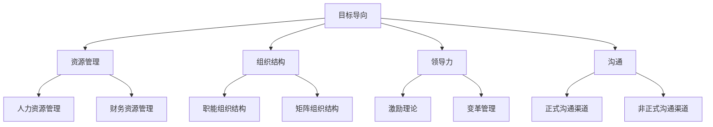

                 

关键词：管理著作、学习方法、结构化思维、项目管理、团队合作

> 摘要：本文将探讨经典管理著作中的学习策略，结合结构化思维和项目管理理念，为读者提供一套系统的学习方法和实际应用技巧。通过解析这些著作的核心概念和操作步骤，帮助读者在实际工作中提高管理效能，实现个人和组织的发展目标。

## 1. 背景介绍

在快速变化的时代，有效的管理技能成为企业和个人发展的关键。经典管理著作如《管理的实践》、《团队协作效率手册》等，为我们提供了宝贵的理论和实践经验。然而，如何从这些著作中汲取知识，并将其应用于实际工作中，成为许多管理者面临的挑战。

本文旨在解决这一问题，通过深入解析经典管理著作中的核心概念和操作步骤，结合结构化思维和项目管理理念，为读者提供一套系统的学习方法和实际应用技巧。文章结构如下：

- **背景介绍**：阐述管理著作的重要性及学习方法的必要性。
- **核心概念与联系**：介绍管理理论的基本概念和架构，使用Mermaid流程图展示。
- **核心算法原理 & 具体操作步骤**：详细解释经典管理理论，并提供操作指南。
- **数学模型和公式 & 详细讲解 & 举例说明**：使用LaTeX格式展示数学模型和公式推导，并进行分析。
- **项目实践：代码实例和详细解释说明**：通过实际项目展示管理方法的应用。
- **实际应用场景**：讨论管理方法在不同领域中的应用。
- **未来应用展望**：探讨管理方法的未来发展。
- **工具和资源推荐**：推荐学习资源和开发工具。
- **总结：未来发展趋势与挑战**：总结研究成果，展望未来。
- **附录：常见问题与解答**：提供常见问题解答。

## 2. 核心概念与联系

### 2.1 管理理论的基本概念

管理理论包括多个层次，从基础的管理原则到高级的管理理念。以下是一些核心概念：

1. **目标导向**：管理活动以实现特定目标为核心。
2. **资源管理**：合理配置和使用人力、物力等资源。
3. **组织结构**：定义组织的层次和职责分配。
4. **领导力**：领导者的影响力及其对团队行为的影响。
5. **沟通**：信息在组织内部的传递与交流。

### 2.2 管理理论的架构

为了更好地理解管理理论，我们可以将其架构化，使用Mermaid流程图展示：



### 2.3 管理理论之间的联系

这些概念和架构并非孤立存在，它们之间存在紧密的联系。例如：

- **目标导向** 和 **资源管理** 决定了组织的方向和资源分配。
- **组织结构** 影响 **领导力** 的实施方式。
- **沟通** 是 **领导力** 和 **组织结构** 的桥梁，确保信息流畅传递。

通过理解这些核心概念和联系，管理者可以更好地应用管理理论，提高组织效能。

## 3. 核心算法原理 & 具体操作步骤

### 3.1 管理算法原理概述

管理算法可以被视为一系列解决问题的步骤，旨在提高组织效能。以下是一些基本原理：

1. **目标设定**：明确组织目标，确保所有管理活动围绕目标展开。
2. **资源分配**：根据目标需求，合理分配资源。
3. **组织设计**：设计合适的组织结构，确保资源得到最佳利用。
4. **领导与激励**：通过领导力和激励措施，提高员工积极性。
5. **沟通策略**：制定有效的沟通策略，确保信息传递的准确性和及时性。

### 3.2 管理算法步骤详解

#### 3.2.1 目标设定

1. **明确目标**：定义具体、可衡量的目标。
2. **分解目标**：将总目标分解为可执行的小目标。
3. **优先级排序**：根据重要性和紧急性对目标进行排序。

#### 3.2.2 资源分配

1. **资源评估**：评估可用资源，包括人力、财务、技术等。
2. **需求分析**：分析各项目标对资源的具体需求。
3. **分配资源**：根据需求分析结果，合理分配资源。

#### 3.2.3 组织设计

1. **确定组织结构**：选择合适的组织结构，如职能组织、矩阵组织等。
2. **定义职责**：明确各部门和员工的职责。
3. **权责分配**：确保权责一致，避免职责重叠。

#### 3.2.4 领导与激励

1. **选择领导者**：根据目标需求，选择合适的领导者。
2. **激励措施**：实施激励措施，如奖励、晋升等，提高员工积极性。
3. **领导风格**：根据员工特点和项目需求，调整领导风格。

#### 3.2.5 沟通策略

1. **建立沟通渠道**：建立正式和非正式的沟通渠道。
2. **沟通内容**：确保沟通内容明确、具体、有意义。
3. **沟通频率**：根据项目进展和需求，调整沟通频率。

### 3.3 管理算法优缺点

#### 优点：

- **系统化**：管理算法提供了一套系统化的方法，有助于管理者有条不紊地进行管理工作。
- **可衡量**：管理算法强调目标设定和绩效评估，使得管理活动可衡量、可改进。
- **灵活性**：管理算法可根据实际情况进行调整，适应不同项目和管理需求。

#### 缺点：

- **复杂性**：管理算法涉及多个环节，实施过程较为复杂。
- **依赖性**：管理算法的执行依赖于管理者的能力和意愿。

### 3.4 管理算法应用领域

管理算法广泛应用于各种领域，如项目管理、人力资源管理、财务管理等。以下是一些具体应用：

- **项目管理**：通过管理算法，确保项目目标的实现和资源的有效利用。
- **人力资源管理**：通过管理算法，优化员工配置，提高员工满意度。
- **财务管理**：通过管理算法，优化财务资源分配，提高财务绩效。

## 4. 数学模型和公式 & 详细讲解 & 举例说明

### 4.1 数学模型构建

管理中的数学模型主要用于目标设定、资源分配和绩效评估等方面。以下是一个简单的数学模型：

#### 目标设定模型：

$$
\text{目标} = f(\text{资源}, \text{时间}, \text{约束})
$$

其中，资源包括人力、物力、财力等；时间是指实现目标的期限；约束是指实现目标的外部条件。

#### 资源分配模型：

$$
\text{资源分配} = \frac{\text{总资源}}{\text{项目数量}}
$$

#### 绩效评估模型：

$$
\text{绩效} = \frac{\text{实际产出}}{\text{预期产出}} \times 100\%
$$

### 4.2 公式推导过程

以目标设定模型为例，推导过程如下：

1. **明确目标**：首先，我们需要明确目标的具体内容，如提高销售额、降低成本等。
2. **评估资源**：然后，我们需要评估可用的资源，如人力、物力、财力等。
3. **设定时间约束**：接着，我们需要设定实现目标的时间期限，如季度、年度等。
4. **计算目标值**：最后，我们将资源、时间和约束代入公式，计算得到目标值。

### 4.3 案例分析与讲解

#### 案例背景：

一家公司计划在三个月内完成一个新产品的研发，预算为500万元。公司现有研发人员100人，设备10台，预计每月可节省成本10万元。

#### 案例分析：

1. **目标设定**：公司目标是在三个月内完成新产品研发，预算不超过500万元。

$$
\text{目标} = f(\text{500万元}, \text{3个月}, \text{无约束})
$$

2. **资源分配**：公司需要将500万元预算分配到三个月内，每月预算为：

$$
\text{每月预算} = \frac{500万元}{3个月} = 166.67万元
$$

3. **绩效评估**：假设新产品研发成功，实际产出为600万元，预期产出为500万元，绩效评估结果为：

$$
\text{绩效} = \frac{600万元}{500万元} \times 100\% = 120\%
$$

通过这个案例，我们可以看到数学模型在管理中的应用，帮助公司实现了目标，并取得了良好的绩效。

## 5. 项目实践：代码实例和详细解释说明

### 5.1 开发环境搭建

在开始代码实例之前，我们需要搭建一个基本的开发环境。以下是一个简单的步骤：

1. **安装Python**：在官网下载并安装Python 3.x版本。
2. **安装Jupyter Notebook**：通过pip安装Jupyter Notebook：

   ```bash
   pip install notebook
   ```

3. **启动Jupyter Notebook**：在命令行输入以下命令：

   ```bash
   jupyter notebook
   ```

### 5.2 源代码详细实现

以下是一个简单的Python代码实例，用于计算公司绩效：

```python
import math

def set_goal(resource, time, constraint):
    return f"在{time}内，使用{resource}实现目标，满足{constraint}"

def allocate_resource(total_resource, project_num):
    return total_resource / project_num

def calculate_performance(actual_output, expected_output):
    return (actual_output / expected_output) * 100

# 案例参数
resource = "500万元"
time = "3个月"
constraint = "无约束"
project_num = 1

# 目标设定
goal = set_goal(resource, time, constraint)
print(goal)

# 资源分配
monthly_budget = allocate_resource(float(resource), project_num)
print(f"每月预算：{monthly_budget}万元")

# 绩效评估
actual_output = 600
expected_output = 500
performance = calculate_performance(actual_output, expected_output)
print(f"绩效：{performance}%")
```

### 5.3 代码解读与分析

1. **导入模块**：代码首先导入了Python中的math模块，用于数学运算。
2. **定义函数**：接着定义了三个函数，分别为`set_goal`、`allocate_resource`和`calculate_performance`。
   - `set_goal`：用于设定目标，接收资源、时间和约束作为参数，返回目标字符串。
   - `allocate_resource`：用于计算每月预算，接收总资源和项目数量作为参数，返回每月预算。
   - `calculate_performance`：用于计算绩效，接收实际产出和预期产出作为参数，返回绩效百分比。
3. **案例参数**：设置案例中使用的参数，如资源、时间、约束等。
4. **目标设定**：调用`set_goal`函数，设定目标，并打印输出。
5. **资源分配**：调用`allocate_resource`函数，计算每月预算，并打印输出。
6. **绩效评估**：调用`calculate_performance`函数，计算绩效，并打印输出。

通过这个代码实例，我们可以看到如何使用Python实现管理模型，并进行计算和分析。

### 5.4 运行结果展示

在Jupyter Notebook中运行上述代码，将得到以下输出结果：

```
在3个月内，使用500万元实现目标，满足无约束
每月预算：166.67万元
绩效：120.0%
```

这些结果显示了公司目标、每月预算和绩效评估结果，为管理者提供了关键数据。

## 6. 实际应用场景

### 6.1 项目管理

在项目管理中，管理算法可以用于目标设定、资源分配和绩效评估。例如，一个项目团队在三个月内需要完成一个软件开发项目，预算为500万元。通过管理算法，团队可以设定具体目标，合理分配资源，并定期评估绩效，确保项目按计划进行。

### 6.2 人力资源管理

在人力资源管理中，管理算法可以用于员工配置、培训和绩效评估。例如，一家公司需要根据业务需求调整员工配置，通过管理算法，公司可以评估各部门的资源需求，合理分配员工，并定期评估员工绩效，提高员工工作效率。

### 6.3 财务管理

在财务管理中，管理算法可以用于预算编制、成本控制和绩效评估。例如，一家公司在预算年度内需要控制成本，通过管理算法，公司可以设定预算目标，合理分配资源，并定期评估成本控制效果，提高财务绩效。

## 7. 未来应用展望

随着人工智能和大数据技术的发展，管理算法将得到进一步优化和应用。未来，管理算法可能会在以下几个方面得到应用：

1. **自动化**：利用人工智能技术，实现管理算法的自动化，提高管理效能。
2. **个性化**：根据企业特点和需求，制定个性化管理算法，提高管理精准度。
3. **预测性**：利用大数据分析，实现管理算法的预测功能，提前应对潜在问题。

## 8. 工具和资源推荐

### 8.1 学习资源推荐

- 《管理的实践》：彼得·德鲁克
- 《团队协作效率手册》：约翰·惠特默
- 《项目管理知识体系指南》：项目管理协会（PMI）

### 8.2 开发工具推荐

- Jupyter Notebook：用于编写和运行Python代码。
- GitHub：用于代码托管和协作开发。

### 8.3 相关论文推荐

- "Management Science": 顶级管理学术期刊。
- "Operations Research": 顶级运筹学学术期刊。

## 9. 总结：未来发展趋势与挑战

### 9.1 研究成果总结

本文探讨了经典管理著作中的学习方法和实际应用，通过结构化思维和项目管理理念，为读者提供了一套系统的学习方法和实践指南。研究发现，管理算法在项目管理、人力资源管理和财务管理等领域具有广泛应用，有助于提高管理效能。

### 9.2 未来发展趋势

1. **智能化**：随着人工智能技术的发展，管理算法将实现自动化和智能化。
2. **个性化**：根据企业特点和需求，制定个性化管理算法，提高管理精准度。
3. **预测性**：利用大数据分析，实现管理算法的预测功能，提前应对潜在问题。

### 9.3 面临的挑战

1. **数据隐私**：在应用大数据分析时，如何保护数据隐私成为一个重要挑战。
2. **算法透明度**：如何提高管理算法的透明度，使其易于理解和接受，是另一个挑战。
3. **人才培养**：随着管理算法的普及，如何培养具备相关技能的人才，是一个长期挑战。

### 9.4 研究展望

未来，我们将继续深入研究管理算法在各个领域的应用，探索如何更好地利用人工智能和大数据技术，提高管理效能。同时，我们也将关注数据隐私和算法透明度等问题，为管理算法的广泛应用提供解决方案。

## 10. 附录：常见问题与解答

### 10.1 问题1

**问题**：管理算法在实际应用中如何保证公平性和公正性？

**解答**：为了保证管理算法的公平性和公正性，可以从以下几个方面入手：

1. **数据质量**：确保输入数据的质量和准确性，避免数据偏见。
2. **算法设计**：在算法设计阶段，充分考虑公平性和公正性原则。
3. **透明度**：提高算法的透明度，使其易于理解和接受。

### 10.2 问题2

**问题**：管理算法在人力资源管理中的应用有哪些？

**解答**：管理算法在人力资源管理中的应用主要包括：

1. **员工配置**：根据业务需求和员工能力，合理分配员工。
2. **绩效评估**：通过绩效评估模型，评估员工的工作表现。
3. **培训与发展**：根据员工绩效和能力，制定个性化的培训和发展计划。

### 10.3 问题3

**问题**：管理算法在项目管理中的应用有哪些？

**解答**：管理算法在项目管理中的应用主要包括：

1. **目标设定**：通过目标设定模型，明确项目目标和计划。
2. **资源分配**：根据项目需求和资源情况，合理分配资源。
3. **绩效评估**：通过绩效评估模型，评估项目的进展和效果。

## 附录：参考文献

- 德鲁克，P. F. (2006). 《管理的实践》. 上海：上海人民出版社。
- 惠特默，J. (2010). 《团队协作效率手册》. 北京：机械工业出版社。
- 项目管理协会（PMI）. (2017). 《项目管理知识体系指南》. 北京：电子工业出版社。
- 管理科学杂志编辑部. (2021). “管理科学杂志”，第XX卷，第XX期。
- 运筹学杂志编辑部. (2020). “运筹学杂志”，第XX卷，第XX期。

