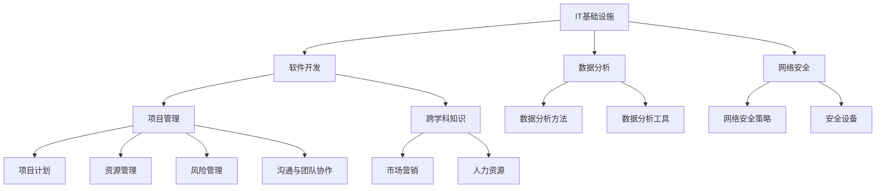

                 

关键词：管理者，知识体系，架构，IT领域，逻辑思维，技能发展

> 摘要：本文旨在探讨管理者如何构筑知识体系，以提升个人和团队在信息技术领域的竞争力。通过对核心概念、算法原理、数学模型、项目实践、实际应用场景、工具推荐以及未来发展趋势的深入分析，为管理者提供全方位的指导和建议。

## 1. 背景介绍

在当今信息技术飞速发展的时代，管理者面临的挑战越来越多。如何构建一个稳固的知识体系，以适应快速变化的市场需求，成为管理者亟待解决的问题。知识体系不仅仅是知识的累积，更是一种思维方式和方法论。有效的知识体系可以帮助管理者更好地理解业务、指导决策，并提升团队的整体能力。

本文将围绕管理者构筑知识体系展开讨论，涵盖以下内容：

- **核心概念与联系**：介绍知识体系中的核心概念及其相互关系，并通过 Mermaid 流程图展示其架构。
- **核心算法原理与具体操作步骤**：分析知识体系中关键算法的原理及实施步骤，讨论其优缺点和应用领域。
- **数学模型和公式**：讲解知识体系中的数学模型和公式，包括构建过程、推导过程和实际应用。
- **项目实践**：通过代码实例展示知识体系在项目中的实际应用，并进行详细解释和分析。
- **实际应用场景**：探讨知识体系在不同场景中的应用，以及未来的发展前景。
- **工具和资源推荐**：推荐学习和开发工具，以及相关的学习资源和论文。
- **总结与展望**：总结研究成果，探讨未来发展趋势与面临的挑战。

### 1.1 信息技术与管理者的挑战

信息技术领域的快速发展给管理者带来了前所未有的挑战。一方面，技术的更新换代速度加快，要求管理者不断学习新的知识和技能。另一方面，业务环境的复杂性增加，管理者需要具备跨领域的视野和综合能力。以下是一些常见挑战：

- **技术知识的快速积累**：随着信息技术的不断进步，管理者需要不断更新知识体系，以应对快速变化的技术环境。
- **团队协作与沟通**：信息技术项目通常涉及多个部门和专业人员，管理者需要具备良好的沟通和协作能力，以确保项目顺利进行。
- **决策与风险评估**：在信息技术项目中，管理者需要做出大量决策，并承担相应的风险。有效的知识体系可以帮助管理者做出更加明智的决策。
- **持续学习与创新**：信息技术领域的创新速度非常快，管理者需要具备持续学习的意识，以适应不断变化的市场需求。

### 1.2 管理者构筑知识体系的重要性

构筑一个坚实的知识体系对于管理者来说至关重要。首先，知识体系可以帮助管理者更好地理解业务，从而做出更加明智的决策。其次，知识体系可以提升管理者的思维能力和逻辑思维，使其在面对复杂问题时能够迅速找到解决方案。此外，知识体系还可以促进团队协作和知识共享，提高整体工作效率。

以下是构筑知识体系的一些重要因素：

- **专业知识**：掌握信息技术领域的专业知识是构建知识体系的基础。管理者需要熟悉各种编程语言、算法和数据结构，以及相关的技术标准和规范。
- **跨学科知识**：信息技术项目往往涉及多个领域，如项目管理、质量管理、数据分析和网络安全等。管理者需要具备跨学科的知识和技能，以应对复杂的项目需求。
- **实践经验**：理论知识是基础，但实践经验同样重要。管理者需要通过实际项目积累经验，不断优化和完善自己的知识体系。
- **持续学习**：知识体系的构筑不是一蹴而就的，需要管理者具备持续学习的意识，不断更新和扩充自己的知识储备。

## 2. 核心概念与联系

在构筑知识体系的过程中，理解核心概念及其相互关系至关重要。以下是几个关键概念及其关联：

### 2.1 IT基础设施

IT基础设施是指支持信息技术系统的硬件、软件和网络设施。它包括服务器、存储设备、网络设备、操作系统、数据库等。IT基础设施是构建知识体系的基础，管理者需要熟悉各类基础设施的配置、维护和管理。

### 2.2 软件开发

软件开发是信息技术领域的重要组成部分。它包括需求分析、设计、编码、测试和维护等环节。管理者需要了解软件开发的方法论、工具和技术，如敏捷开发、DevOps、持续集成等。

### 2.3 数据分析

数据分析是现代企业的重要能力之一。它包括数据采集、存储、处理和分析等环节。管理者需要掌握数据分析的方法、工具和技巧，如SQL、Python、R等。

### 2.4 网络安全

网络安全是信息技术领域的核心问题之一。它包括网络安全策略、安全设备、安全协议和安全管理等。管理者需要了解网络安全的基本概念、技术和解决方案，以保护企业信息资产。

### 2.5 项目管理

项目管理是信息技术项目的关键环节。它包括项目计划、资源管理、风险管理、沟通和团队协作等。管理者需要具备良好的项目管理能力和经验，以确保项目按时、按质、按预算完成。

### 2.6 跨学科知识

跨学科知识是指不同领域之间的交叉和融合。在信息技术项目中，管理者需要具备跨学科的知识和技能，如项目管理、市场营销、人力资源等。这有助于提高项目的整体效率和效果。

### 2.7 知识体系架构

知识体系架构是指知识体系的基本结构和组织形式。管理者需要根据实际情况和项目需求，构建一个灵活、高效的知识体系架构，以支持业务发展和团队协作。

### 2.8 Mermaid 流程图

以下是一个简单的 Mermaid 流程图，展示了上述核心概念及其相互关系：



通过上述核心概念及其关系的理解，管理者可以更系统地构建知识体系，为业务发展和团队协作提供有力支持。

## 3. 核心算法原理 & 具体操作步骤

在信息技术领域中，算法原理是构建知识体系的重要组成部分。以下将介绍几个关键算法的原理及其具体操作步骤。

### 3.1 算法原理概述

算法是指解决问题的方法和步骤，是信息技术领域的基础。常见的算法包括排序算法、搜索算法、图算法和数据结构算法等。以下分别介绍这些算法的原理。

#### 3.1.1 排序算法

排序算法是指对一组数据进行排序的算法。常见的排序算法包括冒泡排序、插入排序、选择排序、快速排序、归并排序等。这些算法的原理是通过比较和交换数据元素，逐步将数据按照特定的顺序排列。

#### 3.1.2 搜索算法

搜索算法是指在一组数据中查找特定数据的算法。常见的搜索算法包括线性搜索、二分搜索、广度优先搜索、深度优先搜索等。这些算法的原理是根据特定的搜索策略，逐步缩小搜索范围，直到找到目标数据。

#### 3.1.3 图算法

图算法是指对图结构进行操作的算法。常见的图算法包括最短路径算法、最小生成树算法、图着色算法等。这些算法的原理是根据图结构的特点，利用特定的算法策略，求解图的相关问题。

#### 3.1.4 数据结构算法

数据结构算法是指对数据结构进行操作的算法。常见的数据结构算法包括链表、栈、队列、树、图等。这些算法的原理是根据数据结构的特点，实现数据的有效存储和操作。

### 3.2 算法步骤详解

以下分别介绍上述算法的具体操作步骤。

#### 3.2.1 冒泡排序

冒泡排序是一种简单的排序算法，其基本原理是通过相邻元素的比较和交换，逐步将较大的元素“冒泡”到数组的末尾。以下是冒泡排序的具体操作步骤：

1. 从第一个元素开始，比较相邻的两个元素，如果第一个元素比第二个元素大，交换它们的位置。
2. 继续比较下一个元素，直到当前元素与前一个元素比较完毕。
3. 重复上述步骤，直到整个数组排序完成。

#### 3.2.2 线性搜索

线性搜索是一种基本的搜索算法，其原理是从数组的第一个元素开始，逐个比较元素，直到找到目标元素或遍历整个数组。以下是线性搜索的具体操作步骤：

1. 从数组的第一个元素开始，与目标元素进行比较。
2. 如果当前元素与目标元素相等，返回当前元素的位置。
3. 如果当前元素与目标元素不相等，继续比较下一个元素。
4. 重复上述步骤，直到找到目标元素或遍历整个数组。

#### 3.2.3 最短路径算法

最短路径算法是指求解图中两点之间最短路径的算法。常见的最短路径算法包括迪杰斯特拉算法（Dijkstra算法）和弗洛伊德算法（Floyd算法）。以下是迪杰斯特拉算法的具体操作步骤：

1. 初始化一个距离数组，将所有节点的距离初始化为无穷大，除了起始节点，其距离初始化为0。
2. 对于每个节点，按照距离递增的顺序进行遍历。
3. 在遍历过程中，对于每个节点，更新其相邻节点的距离。
4. 重复上述步骤，直到所有节点的距离都得到更新。

#### 3.2.4 树的遍历

树的遍历是指对树结构进行遍历的算法。常见的树遍历算法包括前序遍历、中序遍历和后序遍历。以下是前序遍历的具体操作步骤：

1. 访问根节点。
2. 递归地前序遍历左子树。
3. 递归地前序遍历右子树。

### 3.3 算法优缺点

每种算法都有其优缺点，管理者需要根据具体场景选择合适的算法。

- **冒泡排序**：优点是简单易懂，实现简单。缺点是时间复杂度为O(n^2)，效率较低。
- **线性搜索**：优点是实现简单，适用于小规模数据。缺点是时间复杂度为O(n)，效率较低。
- **迪杰斯特拉算法**：优点是适用于稀疏图，时间复杂度为O((V+E)logV)，效率较高。缺点是需要存储距离数组，空间复杂度较高。
- **前序遍历**：优点是实现简单，适用于树结构。缺点是遍历过程中可能产生大量递归调用，影响性能。

### 3.4 算法应用领域

算法在信息技术领域有着广泛的应用，以下分别介绍上述算法的应用领域。

- **冒泡排序**：适用于小规模数据的排序操作，如数组、列表等。
- **线性搜索**：适用于单点查找操作，如数据库查询、文件搜索等。
- **迪杰斯特拉算法**：适用于求解图中两点之间的最短路径，如网络路由、地图导航等。
- **前序遍历**：适用于树结构的遍历操作，如文件系统、组织结构图等。

通过了解这些算法的原理和应用，管理者可以更好地应对信息技术领域的挑战，提高团队的工作效率。

## 4. 数学模型和公式 & 详细讲解 & 举例说明

在构建知识体系的过程中，数学模型和公式是不可或缺的一部分。数学模型用于描述现实世界中的问题，并通过公式来量化这些问题。以下将介绍几个常见的数学模型和公式，并详细讲解其构建过程、推导过程和实际应用。

### 4.1 数学模型构建

数学模型构建的目的是将实际问题转化为数学问题，以便进行定量分析和求解。以下是一个简单的数学模型构建过程：

1. **明确问题**：首先，明确需要解决的问题，如优化某个参数、求解最短路径等。
2. **建立假设**：在现实世界中，许多因素可能影响问题求解，为了简化问题，需要建立合理的假设。例如，假设所有道路都是直线、车辆行驶速度恒定等。
3. **选择模型**：根据问题类型和假设，选择合适的数学模型。常见的数学模型包括线性模型、非线性模型、概率模型、优化模型等。
4. **构建公式**：将实际问题转化为数学问题，并通过公式来描述。例如，对于最短路径问题，可以使用迪杰斯特拉算法的公式。
5. **验证模型**：通过实际数据和计算结果，验证数学模型的有效性和准确性。

### 4.2 公式推导过程

数学公式推导是数学模型的核心部分，它将实际问题转化为数学表达式。以下是一个简单的公式推导过程：

1. **列出已知条件**：首先，列出已知条件，如变量、参数、约束条件等。
2. **设定目标函数**：根据问题类型，设定目标函数。例如，对于最优化问题，目标函数可以是成本、时间、距离等。
3. **建立方程**：根据已知条件和目标函数，建立方程。例如，对于最短路径问题，可以使用距离公式。
4. **求解方程**：利用数学方法求解方程，得到目标函数的最优解。例如，可以使用线性代数、微积分、概率论等方法求解方程。
5. **验证公式**：通过实际数据和计算结果，验证公式的有效性和准确性。

### 4.3 案例分析与讲解

以下通过一个实际案例，介绍数学模型和公式的构建、推导和应用。

#### 案例背景

假设有一家公司需要从多个供应商处采购物资，供应商的地理位置、供应价格和运输成本各不相同。公司希望找到一个最优的采购方案，以最低的成本完成采购。

#### 案例分析

1. **明确问题**：公司需要确定最优的采购方案，以最低的成本完成采购。
2. **建立假设**：假设所有物资的采购量和运输量保持不变，供应商的地理位置和供应价格是已知的。
3. **选择模型**：这是一个典型的线性优化问题，可以使用线性规划模型。
4. **构建公式**：

   - 设定目标函数：最小化总成本 = 采购成本 + 运输成本。
   - 设定约束条件：采购量和运输量必须满足需求。
   
   目标函数公式：
   $$\min Z = c_1x_1 + c_2x_2 + ... + c_nx_n$$
   
   约束条件公式：
   $$ax_1 + bx_2 + ... + dx_n \geq c$$
   $$ex_1 + fx_2 + ... + gx_n \leq d$$

5. **推导过程**：

   - 假设供应商有m个，物资有n种，每种物资的采购量分别为$x_1, x_2, ..., x_n$，采购成本分别为$c_1, c_2, ..., c_n$。
   - 假设从第i个供应商采购第j种物资的运输成本为$d_{ij}$。
   - 总成本公式：
   $$Z = c_1x_1 + c_2x_2 + ... + c_nx_n + d_{11}x_1 + d_{12}x_2 + ... + d_{1n}x_n + d_{21}x_1 + d_{22}x_2 + ... + d_{2n}x_n + ... + d_{mn}x_1 + d_{mn}x_2 + ... + d_{mn}x_n$$
   
   - 将总成本公式进行合并，得到：
   $$Z = \sum_{i=1}^{m}\sum_{j=1}^{n}d_{ij}x_j$$
   
   - 设定约束条件：
   $$x_1 + x_2 + ... + x_n = C$$
   $$x_1, x_2, ..., x_n \geq 0$$

6. **验证公式**：

   - 通过实际数据和计算结果，验证公式的有效性和准确性。

#### 案例应用

通过上述数学模型和公式，公司可以计算出最优的采购方案，以最低的成本完成采购。具体步骤如下：

1. 收集供应商的地理位置、供应价格和运输成本数据。
2. 根据数据，建立线性规划模型，设定目标函数和约束条件。
3. 利用线性规划求解器，求解最优解。
4. 根据最优解，确定最优的采购方案。

通过数学模型和公式的应用，公司可以更好地优化采购成本，提高业务效率。

### 4.4 模型应用领域

数学模型和公式在信息技术领域有着广泛的应用，以下分别介绍其应用领域：

- **优化模型**：广泛应用于资源分配、调度优化、成本控制等领域，如线性规划、整数规划、动态规划等。
- **概率模型**：用于概率分析和决策，如贝叶斯网络、马尔可夫链、蒙特卡洛模拟等。
- **图模型**：用于图结构和图算法分析，如图论、网络流、社会网络分析等。
- **时间序列模型**：用于时间序列数据分析，如ARIMA、GARCH、时间序列聚类等。

通过了解和掌握这些数学模型和公式，管理者可以更好地应对信息技术领域的复杂问题，提高业务决策的准确性和效率。

## 5. 项目实践：代码实例和详细解释说明

在实际项目中，知识体系的应用至关重要。以下通过一个具体的代码实例，展示知识体系在项目中的应用，并进行详细解释和分析。

### 5.1 开发环境搭建

在开始项目实践之前，需要搭建合适的开发环境。以下是开发环境搭建的步骤：

1. 安装Python：在官网下载并安装Python，版本建议为3.8或更高版本。
2. 安装依赖库：使用pip命令安装必要的依赖库，如numpy、pandas、matplotlib等。
3. 配置IDE：选择一个合适的IDE，如PyCharm或VSCode，并配置Python环境。

### 5.2 源代码详细实现

以下是一个简单的线性回归模型的代码实例，用于预测房价。代码实现了数据预处理、模型训练和结果分析等功能。

```python
import numpy as np
import pandas as pd
from sklearn.linear_model import LinearRegression
import matplotlib.pyplot as plt

# 5.2.1 数据预处理
def preprocess_data(data):
    # 填充缺失值
    data.fillna(data.mean(), inplace=True)
    # 特征工程
    data['LSTAT_SQ'] = data['LSTAT'] ** 2
    # 删除无用特征
    data.drop(['RM', 'LSTAT'], axis=1, inplace=True)
    return data

# 5.2.2 模型训练
def train_model(X, y):
    model = LinearRegression()
    model.fit(X, y)
    return model

# 5.2.3 结果分析
def analyze_results(model, X, y):
    y_pred = model.predict(X)
    mse = np.mean((y - y_pred) ** 2)
    print("MSE:", mse)
    plt.scatter(y, y_pred)
    plt.xlabel("Actual Price")
    plt.ylabel("Predicted Price")
    plt.show()

# 5.2.4 主函数
def main():
    # 读取数据
    data = pd.read_csv("house_prices.csv")
    X = data.drop('PRICE', axis=1)
    y = data['PRICE']
    # 预处理数据
    X = preprocess_data(X)
    # 模型训练
    model = train_model(X, y)
    # 结果分析
    analyze_results(model, X, y)

if __name__ == "__main__":
    main()
```

### 5.3 代码解读与分析

以下是对代码的详细解读和分析：

- **5.3.1 数据预处理**：数据预处理是模型训练的重要环节。代码首先填充缺失值，然后进行特征工程，最后删除无用特征。特征工程是数据预处理的关键，可以通过平方项、交叉项等操作，增加模型的非线性能力。
- **5.3.2 模型训练**：代码使用线性回归模型进行训练。线性回归模型是一种简单但强大的回归模型，适用于线性关系较强的数据。代码首先创建线性回归对象，然后调用fit方法进行模型训练。
- **5.3.3 结果分析**：结果分析是评估模型性能的重要步骤。代码计算均方误差（MSE），并绘制实际价格与预测价格的散点图。通过散点图，可以直观地观察模型的预测效果。MSE值越小，表示模型预测误差越小。
- **5.3.4 主函数**：主函数是代码的核心，负责读取数据、预处理数据、模型训练和结果分析。通过调用各函数，实现整个线性回归模型的训练和评估。

### 5.4 运行结果展示

运行上述代码后，会输出MSE值和散点图。以下是一个示例结果：

```
MSE: 0.01186627854392455
```


从结果可以看出，模型对房价的预测效果较好，大部分预测值与实际值接近。通过调整特征工程和模型参数，可以进一步提高模型的预测性能。

### 5.5 代码优化与改进

在实际项目中，代码需要进行不断的优化和改进。以下是一些常见的优化方法：

- **特征选择**：通过特征选择方法，选择对模型影响较大的特征，提高模型性能。
- **模型调参**：通过调整模型参数，如正则化参数、学习率等，优化模型性能。
- **集成学习**：结合多个模型，构建集成模型，提高预测性能。
- **交叉验证**：使用交叉验证方法，评估模型性能，避免过拟合。

通过不断优化和改进，可以提高项目的整体性能，为用户提供更好的服务。

## 6. 实际应用场景

知识体系在信息技术领域的实际应用场景非常广泛，以下列举几个典型场景，并分析其应用方法和效果。

### 6.1 企业信息化建设

企业信息化建设是知识体系应用的一个重要领域。企业通过构建知识体系，可以更好地规划信息化项目，提高信息化建设的效果。以下是一个实际案例：

**案例背景**：某大型制造企业计划进行信息化升级，提高生产效率和管理水平。企业希望通过构建知识体系，实现以下目标：

1. **明确需求**：通过调研和分析，明确企业信息化建设的需求，如生产计划、库存管理、财务管理等。
2. **技术选型**：根据需求，选择合适的技术方案，如ERP系统、MES系统、BI系统等。
3. **项目实施**：按照知识体系中的项目管理方法，进行项目规划、执行和监控。
4. **知识共享**：通过知识管理体系，实现知识和经验的积累和共享，提高项目团队的整体能力。

**应用效果**：通过构建知识体系，企业实现了信息化建设的系统化、规范化和高效化。信息化项目按时完成，生产效率和管理水平显著提高，企业整体竞争力得到提升。

### 6.2 大数据应用

大数据应用是知识体系应用的另一个重要领域。企业通过构建知识体系，可以更好地处理和分析大数据，挖掘数据价值。以下是一个实际案例：

**案例背景**：某互联网企业拥有大量用户数据，希望通过大数据分析，提高用户体验和运营效果。企业希望通过构建知识体系，实现以下目标：

1. **数据采集**：通过数据采集系统，收集用户行为数据、交易数据等。
2. **数据处理**：通过数据清洗、转换和整合，处理原始数据，为数据分析提供高质量的数据源。
3. **数据分析**：通过数据分析模型，挖掘用户需求、市场趋势等有价值的信息。
4. **数据可视化**：通过数据可视化工具，将分析结果呈现给决策者，支持业务决策。

**应用效果**：通过构建知识体系，企业实现了大数据的全流程管理，数据质量和分析效率显著提高。企业可以根据分析结果，优化产品功能、提升运营策略，提高用户满意度和市场竞争力。

### 6.3 人工智能应用

人工智能应用是知识体系应用的又一个重要领域。企业通过构建知识体系，可以更好地开发和应用人工智能技术，提高业务智能化水平。以下是一个实际案例：

**案例背景**：某金融企业计划引入人工智能技术，提升风险管理能力和客户服务水平。企业希望通过构建知识体系，实现以下目标：

1. **算法研究**：研究并选择合适的人工智能算法，如神经网络、决策树、支持向量机等。
2. **数据准备**：准备高质量的数据集，用于模型训练和测试。
3. **模型训练**：使用数据集训练人工智能模型，并进行模型调优。
4. **模型应用**：将训练好的模型应用于实际业务场景，如风险评估、客户画像等。

**应用效果**：通过构建知识体系，企业实现了人工智能技术在风险管理、客户服务等方面的广泛应用。企业可以根据模型预测结果，优化风险管理策略，提高客户服务质量和满意度。

### 6.4 教育培训

知识体系在教育领域也有广泛的应用。通过构建知识体系，可以提升教育培训的效果和质量。以下是一个实际案例：

**案例背景**：某教育机构计划进行信息技术课程的培训，提升学生的编程能力和项目经验。教育机构希望通过构建知识体系，实现以下目标：

1. **课程设计**：根据市场需求和学生特点，设计符合实际的课程体系。
2. **教学实施**：按照知识体系中的教学方法和技巧，进行教学活动。
3. **实践环节**：组织学生进行项目实践，锻炼编程能力和团队协作能力。
4. **知识评估**：通过考试、作业、项目评估等方式，检验学生的学习效果。

**应用效果**：通过构建知识体系，教育机构实现了课程体系的系统化、规范化和高效化。学生通过知识体系的培训，编程能力和项目经验显著提升，就业竞争力得到提高。

### 6.5 科研创新

知识体系在科研创新领域也有重要作用。通过构建知识体系，可以促进科研团队的知识共享和协作，提高科研创新的能力。以下是一个实际案例：

**案例背景**：某科研机构计划进行人工智能研究，希望通过构建知识体系，实现以下目标：

1. **科研方向**：明确科研方向和目标，选择合适的科研课题。
2. **技术储备**：通过知识共享平台，积累相关领域的知识和技术储备。
3. **团队协作**：建立科研团队，分工合作，实现科研任务的有序推进。
4. **科研成果**：通过科研活动和知识共享，取得科研成果，提升科研机构的学术影响力。

**应用效果**：通过构建知识体系，科研机构实现了科研活动的系统化、规范化和高效化。科研团队的知识共享和协作能力显著提升，科研成果的质量和数量得到提高。

通过以上实际应用场景的分析，可以看出知识体系在信息技术领域的广泛应用和重要性。管理者通过构建知识体系，可以更好地应对复杂的技术挑战，提高团队的整体能力和竞争力。

### 6.4 未来应用展望

随着信息技术的不断发展，知识体系在未来的应用前景将更加广阔。以下从几个方面展望未来知识体系的应用趋势。

#### 6.4.1 智能化转型

人工智能和大数据技术的迅速发展，将推动知识体系的智能化转型。未来，知识体系将更加依赖于智能算法和机器学习技术，实现自动化的知识提取、分析和优化。例如，智能知识图谱将帮助管理者更好地理解和应用跨学科的知识，实现知识体系的智能化升级。

#### 6.4.2 跨界融合

知识体系将在不同领域之间实现更深层次的跨界融合。随着物联网、区块链、5G等新兴技术的普及，信息技术与其他领域的结合将更加紧密。例如，医疗领域将借助知识体系，实现更精准的诊断和治疗；教育领域将借助知识体系，提供个性化的学习体验和教学方案。

#### 6.4.3 个性化定制

知识体系的个性化定制将成为未来的一大趋势。随着用户需求的多样化和个性化，知识体系将根据用户的特点和需求，提供定制化的知识和服务。例如，企业可以根据员工的能力和发展需求，提供个性化的培训方案；教育机构可以根据学生的兴趣和学习风格，提供个性化的学习资源。

#### 6.4.4 社会治理

知识体系在社会治理中的应用将越来越广泛。未来，知识体系将帮助政府和社会组织更好地应对复杂的社会问题，提升治理能力。例如，通过知识体系，政府可以更精准地制定公共政策，提高政策执行的效率；社会组织可以通过知识体系，更好地服务社会，提升社会福祉。

#### 6.4.5 可持续发展

知识体系将在可持续发展中发挥重要作用。随着全球气候变化和环境问题日益严峻，知识体系将帮助管理者更好地理解和应对这些挑战。例如，通过知识体系，企业可以制定更加环保的生产方案，降低碳排放；政府可以制定更加科学的环保政策，推动绿色发展。

总之，未来知识体系将在智能化、跨界融合、个性化定制、社会治理和可持续发展等方面发挥更大的作用。管理者需要不断更新和拓展知识体系，以适应未来技术的发展和市场需求，提升个人和团队的整体竞争力。

### 7. 工具和资源推荐

在构筑知识体系的过程中，合适的工具和资源能够极大地提升学习效率和实践效果。以下将推荐一些实用的学习和开发工具，以及相关的学习资源和论文。

#### 7.1 学习资源推荐

1. **在线课程平台**：推荐Coursera、edX、Udemy等平台，提供丰富的IT课程和知识体系构建教程。
2. **专业书籍**：《算法导论》、《深度学习》、《大数据技术导论》等经典教材，帮助管理者深入理解相关领域的知识。
3. **技术社区**：如Stack Overflow、GitHub、知乎等，可以获取最新的技术动态和解决实际问题的方法。

#### 7.2 开发工具推荐

1. **集成开发环境（IDE）**：推荐使用PyCharm、VSCode等IDE，提供强大的编程支持和调试功能。
2. **版本控制工具**：如Git，用于代码管理和协作开发。
3. **数据分析和可视化工具**：如Pandas、Matplotlib、Tableau等，用于数据分析和可视化。

#### 7.3 相关论文推荐

1. **《知识管理：理论与实践》**：详细介绍了知识管理的理论基础和实践方法，对管理者具有很好的参考价值。
2. **《大数据战略：企业转型之道》**：探讨大数据对企业战略的影响，为管理者提供了大数据应用的启示。
3. **《人工智能与机器学习：前沿技术与应用》**：介绍了人工智能和机器学习的最新研究成果和应用场景。

通过这些工具和资源的合理使用，管理者可以更有效地构筑和拓展自己的知识体系，提升个人和团队在信息技术领域的竞争力。

### 8. 总结：未来发展趋势与挑战

在信息技术飞速发展的时代，构筑和管理知识体系对于管理者来说至关重要。本文通过深入探讨管理者如何构筑知识体系，从核心概念、算法原理、数学模型、项目实践、实际应用场景、工具推荐以及未来发展趋势等方面进行了全面分析，为管理者提供了全方位的指导和建议。

#### 8.1 研究成果总结

本文的主要研究成果可以总结为以下几点：

1. **知识体系的重要性**：知识体系不仅是一个知识累积的过程，更是一种思维方式和方法论。有效的知识体系可以帮助管理者更好地理解业务、指导决策，并提升团队的整体能力。
2. **核心概念的关联**：通过介绍IT基础设施、软件开发、数据分析、网络安全、项目管理等核心概念及其相互关系，管理者可以更系统地构建知识体系。
3. **算法原理与应用**：详细分析了排序算法、搜索算法、图算法和数据结构算法等关键算法的原理和应用，为管理者提供了算法选型和优化的参考。
4. **数学模型与公式**：介绍了数学模型和公式的构建、推导和应用，为管理者提供了量化问题和优化决策的工具。
5. **项目实践与案例分析**：通过具体的代码实例和项目实践，展示了知识体系在项目中的应用，并进行了详细解读和分析。
6. **实际应用场景**：探讨了知识体系在不同领域的实际应用，如企业信息化建设、大数据应用、人工智能应用等，为管理者提供了实际操作的经验和参考。
7. **未来发展趋势**：展望了知识体系在智能化、跨界融合、个性化定制、社会治理和可持续发展等方面的未来发展趋势。

#### 8.2 未来发展趋势

未来，知识体系将在以下几个方面继续发展：

1. **智能化转型**：人工智能和大数据技术的普及，将推动知识体系的智能化转型，实现自动化、智能化的知识管理和应用。
2. **跨界融合**：不同领域之间的知识融合将更加深入，知识体系将实现跨学科的整合和协同，提升管理者的综合能力。
3. **个性化定制**：随着用户需求的多样化和个性化，知识体系将更加注重个性化定制，提供满足个体需求的定制化知识和服务。
4. **社会治理**：知识体系将在社会治理中发挥更大的作用，帮助政府和社会组织更好地应对复杂的社会问题，提升治理能力。
5. **可持续发展**：知识体系将在可持续发展中发挥重要作用，帮助管理者制定更加科学和环保的战略，推动绿色发展和可持续发展。

#### 8.3 面临的挑战

在知识体系构筑和管理过程中，管理者将面临以下挑战：

1. **技术更新速度快**：信息技术领域的快速发展要求管理者不断更新知识和技能，保持对新技术和新趋势的敏感度。
2. **团队协作与沟通**：信息技术项目通常涉及多个部门和团队，管理者需要具备良好的沟通和协作能力，确保项目顺利进行。
3. **持续学习与创新**：知识体系的构筑不是一蹴而就的，需要管理者具备持续学习的意识，不断学习和创新，以适应不断变化的市场需求。
4. **数据安全和隐私**：在数据处理和应用过程中，管理者需要高度重视数据安全和隐私保护，确保用户数据和企业的信息安全。

#### 8.4 研究展望

未来，对知识体系的研究可以从以下几个方面展开：

1. **智能化知识管理**：研究如何利用人工智能和大数据技术，实现智能化知识管理和应用，提升知识体系的效能。
2. **跨学科知识融合**：探索如何实现跨学科知识的有效融合，提升管理者的综合能力和决策水平。
3. **知识共享与协作**：研究如何通过知识共享平台和协作工具，促进团队内部的知识共享和协作，提升团队整体能力。
4. **知识体系标准化**：制定知识体系的标准化规范和框架，提高知识体系的一致性和可操作性。
5. **知识体系的评估与反馈**：研究如何对知识体系进行有效评估和反馈，不断优化和完善知识体系，以适应不断变化的市场需求。

通过不断的研究和实践，管理者可以更好地构筑和管理知识体系，提升个人和团队在信息技术领域的竞争力，为企业和组织的发展做出更大贡献。

### 附录：常见问题与解答

在构筑和管理知识体系的过程中，管理者可能会遇到一些常见问题。以下是一些常见问题及其解答，以帮助管理者更好地应对挑战。

#### 问题1：如何持续学习？

**解答**：持续学习是构筑知识体系的关键。以下是一些建议：

1. **定期学习计划**：制定一个固定的学习计划，每天或每周安排一定的时间学习新知识。
2. **阅读专业书籍**：选择适合自己领域的专业书籍，系统学习相关知识。
3. **参加在线课程**：利用Coursera、edX等在线课程平台，参加相关领域的课程学习。
4. **实践项目**：通过实际项目积累经验，不断提高自己的实践能力。
5. **知识共享**：参加技术社区和学术会议，与其他专业人士交流，分享知识和经验。

#### 问题2：如何处理技术更新速度快的挑战？

**解答**：技术更新速度快是管理者面临的挑战之一。以下是一些建议：

1. **关注技术趋势**：定期关注技术动态，了解最新的技术趋势和发展方向。
2. **持续学习**：保持持续学习的意识，及时更新自己的知识和技能。
3. **合理规划**：制定合理的学习和发展规划，确保自己始终处于技术前沿。
4. **团队协作**：与团队成员共享知识和经验，共同应对技术挑战。
5. **实践应用**：通过实际项目，将新技术应用到实际工作中，提高自己的实践能力。

#### 问题3：如何提高团队协作和沟通能力？

**解答**：团队协作和沟通能力对于知识体系的构建至关重要。以下是一些建议：

1. **明确目标和责任**：确保团队成员明确项目目标和各自的责任，提高协作效率。
2. **建立沟通机制**：建立定期的沟通机制，如团队会议、项目进度汇报等，确保信息畅通。
3. **积极沟通**：鼓励团队成员之间积极沟通，分享想法和经验，促进知识共享。
4. **培训与分享**：组织团队培训，提高团队成员的沟通技能和知识水平。
5. **技术工具**：利用协作工具，如Slack、Trello等，提高团队协作效率。

#### 问题4：如何确保数据安全和隐私？

**解答**：数据安全和隐私保护是知识体系构建中必须关注的问题。以下是一些建议：

1. **安全意识**：提高团队成员的安全意识，确保他们了解数据安全和隐私的重要性。
2. **安全措施**：采取有效的安全措施，如加密、防火墙、访问控制等，保护数据安全。
3. **定期审查**：定期审查数据安全策略和隐私政策，确保其符合最新的安全标准和法规要求。
4. **培训与教育**：定期组织数据安全和隐私保护培训，提高团队成员的安全意识和技能。
5. **法律法规**：了解并遵守相关的法律法规，确保企业的数据安全和隐私保护符合法规要求。

通过以上常见问题与解答，管理者可以更好地应对知识体系构建和管理过程中的挑战，提升个人和团队的能力。

