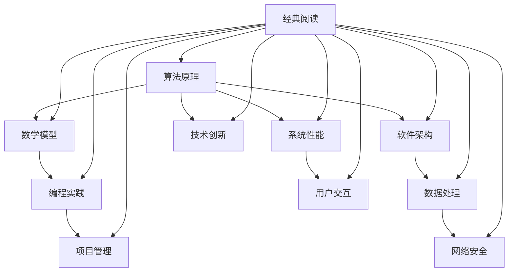

                 

关键词：认知升级、知识构建、技术阅读、专业成长、智能编程

> 摘要：本文探讨了经典阅读在提升程序员认知和技能方面的关键作用。通过分析经典书籍的架构、算法原理、数学模型及其在实际应用中的体现，作者强调了阅读经典作品对于技术从业者夯实认知根基、应对未来挑战的重要性。文章旨在为读者提供一些建议和资源，以促进他们在技术领域的深入学习和持续成长。

## 1. 背景介绍

在当今快速发展的信息技术时代，程序员的技能需求日新月异。从传统的编程语言到新兴的人工智能技术，程序员必须不断学习，以跟上行业的发展步伐。然而，学习不仅仅是为了掌握最新的技术，更重要的是建立深厚的认知根基。在这个基础上，程序员才能更好地理解和应用新知识，解决复杂问题，并预见未来的技术趋势。

经典阅读，作为一种重要的学习方式，在此过程中发挥着至关重要的作用。经典书籍包含了大量经过时间检验的智慧和经验，这些知识不仅具有持久的价值，还能帮助程序员建立起系统化的思维方式。本文将探讨几部经典的计算机科学和技术著作，分析其核心概念、算法原理和数学模型，以及它们在现实世界中的应用。通过这些探讨，我们将看到经典阅读是如何帮助程序员夯实认知根基，提升专业能力的。

### 1.1 计算机科学的经典著作

在计算机科学领域，有一些经典著作被誉为“圣经”，如《计算机程序设计艺术》（The Art of Computer Programming，简称 TAOCP）和《深度学习》（Deep Learning）。这些书籍不仅内容丰富，而且结构严谨，为程序员提供了系统的知识和思考方法。

《计算机程序设计艺术》由著名计算机科学家唐纳德·克努特（Donald Knuth）撰写，涵盖了计算机编程的方方面面，从基础的算法和数据结构到复杂的编译技术和操作系统。这部作品被誉为计算机科学的“圣经”，对无数程序员产生了深远的影响。

《深度学习》则是由著名人工智能专家伊恩·古德费洛（Ian Goodfellow）、约书亚·本吉奥（Joshua Bengio）和亚伦·库维尔（Aaron Courville）合著的一本深度学习领域的权威教材。这本书详细介绍了深度学习的理论基础、算法实现和应用场景，为人工智能从业者提供了宝贵的参考。

### 1.2 经典阅读的价值

经典阅读对于程序员的成长具有多方面的价值。首先，经典著作通常具有深入浅出的表达方式，能够帮助程序员理解复杂的概念和技术。通过阅读这些书籍，程序员能够建立起坚实的知识框架，从而更好地理解和应用新技术。

其次，经典著作往往涵盖了广泛的应用场景，使程序员能够从不同的角度看待问题，并学会如何将理论应用于实践中。这种跨领域的思维能力和实践经验，对于程序员解决实际问题至关重要。

最后，经典阅读还能够激发程序员的创造力和创新精神。通过阅读经典著作，程序员可以了解到前辈们是如何突破难题、创新技术的，从而启发自己进行新的思考和尝试。

## 2. 核心概念与联系

为了更好地理解经典阅读的价值，我们需要首先了解一些核心概念，并探讨它们之间的联系。以下是一个用 Mermaid 编写的流程图，展示了这些概念及其关系：



### 2.1 算法原理

算法原理是计算机科学的核心概念，涉及如何解决特定问题的一系列步骤。经典阅读中的算法原理不仅包括经典的排序算法、查找算法等，还包括一些更复杂的算法，如动态规划、贪心算法等。这些算法原理为程序员提供了有效的解决问题的工具。

### 2.2 数学模型

数学模型是算法设计的基础，它将实际问题转化为数学表达式，使问题更易于分析和解决。在经典阅读中，我们经常可以看到各种数学模型的应用，如线性代数、概率论和统计学等。理解这些数学模型对于程序员设计高效、可靠的算法至关重要。

### 2.3 编程实践

编程实践是将算法和数学模型转化为实际代码的过程。经典阅读中的编程实践不仅包括代码的实现，还包括调试、优化和测试等环节。通过阅读经典代码，程序员可以学习到优秀的编程风格和最佳实践。

### 2.4 软件架构

软件架构是软件开发过程中的重要概念，它涉及到系统的整体设计，包括模块划分、接口定义、数据流控制等。经典阅读中的软件架构案例分析，可以帮助程序员理解不同架构风格的优势和适用场景。

### 2.5 数据处理

数据处理是现代应用程序的核心功能，涉及到数据的存储、检索、分析和处理。经典阅读中提供了许多关于数据处理的有效方法和技巧，如数据清洗、数据仓库和数据挖掘等。

### 2.6 系统性能

系统性能是衡量软件系统质量的重要指标，包括响应时间、吞吐量、资源利用率等。经典阅读中探讨了如何通过优化算法、改进数据结构和优化系统设计来提升系统性能。

### 2.7 项目管理

项目管理是确保软件开发项目成功完成的关键，涉及到任务规划、资源分配、风险管理等。经典阅读中的项目管理案例，可以为程序员提供实用的项目管理方法和经验。

### 2.8 网络安全

网络安全是现代信息技术中不可忽视的一部分，涉及到系统的安全防护、数据加密、网络监控等。经典阅读中的网络安全案例分析，可以帮助程序员理解不同安全威胁的应对策略。

### 2.9 用户交互

用户交互是软件开发中至关重要的一环，涉及到用户界面设计、用户体验优化等。经典阅读中提供了许多关于用户交互的设计原则和实践，如心理学原理在UI设计中的应用等。

### 2.10 技术创新

技术创新是推动计算机科学和信息技术发展的动力。经典阅读中，我们可以看到许多技术创新的案例，如计算机科学中的“分而治之”策略、人工智能中的神经网络等。

通过上述核心概念的探讨，我们可以看到经典阅读在计算机科学和技术领域的广泛影响。这些核心概念相互联系，共同构成了一个完整的知识体系，为程序员提供了坚实的认知根基。

## 3. 核心算法原理 & 具体操作步骤

在计算机科学中，算法原理是解决问题的核心。经典的算法如排序、查找、图论算法等，不仅是编程的基础，也是理解更复杂问题的重要工具。以下将详细介绍几个核心算法的原理和具体操作步骤。

### 3.1 算法原理概述

#### 3.1.1 快速排序（Quick Sort）

快速排序是一种高效的排序算法，采用分治策略将一个大问题分解为若干个小问题。它的工作原理如下：

1. 选择一个基准元素，通常选择第一个或最后一个元素。
2. 将数组分为两个子数组，一个包含小于基准元素的元素，另一个包含大于基准元素的元素。
3. 递归地对这两个子数组进行快速排序。

#### 3.1.2 暴力搜索（Brute Force Search）

暴力搜索是一种简单的搜索算法，它通过遍历所有可能的解来找到问题的解。其基本原理如下：

1. 对于每个可能的解，检查它是否满足问题的条件。
2. 如果找到满足条件的解，返回该解。
3. 如果遍历所有可能的解仍未找到满足条件的解，则问题无解。

#### 3.1.3 Dijkstra 算法

Dijkstra 算法是一种用于求解加权图中单源最短路径问题的算法。其原理如下：

1. 初始化一个距离表，将源点到所有其他节点的距离设为无穷大，并将源点到自身的距离设为 0。
2. 重复以下步骤，直到所有节点的最短路径都被找到：
   a. 选择一个距离表中最小的未标记节点。
   b. 标记该节点，并将该节点到所有未标记节点的距离更新为它们之间路径的最小值。

### 3.2 算法步骤详解

#### 3.2.1 快速排序（Quick Sort）

1. **选择基准元素**：选择数组的第一个或最后一个元素作为基准元素。
2. **划分数组**：将数组划分为两个子数组，一个包含小于基准元素的元素，另一个包含大于基准元素的元素。
3. **递归排序**：对划分后的子数组重复上述步骤，直到所有子数组都为空或只有一个元素。

以下是快速排序的伪代码：

```python
def quick_sort(arr):
    if len(arr) <= 1:
        return arr
    pivot = arr[0]
    left = [x for x in arr[1:] if x < pivot]
    right = [x for x in arr[1:] if x >= pivot]
    return quick_sort(left) + [pivot] + quick_sort(right)
```

#### 3.2.2 暴力搜索（Brute Force Search）

1. **遍历所有可能的解**：对于每个可能的解，检查它是否满足问题的条件。
2. **找到满足条件的解**：如果找到满足条件的解，返回该解。
3. **无解**：如果遍历所有可能的解仍未找到满足条件的解，则问题无解。

以下是暴力搜索的伪代码：

```python
def brute_force_search(problem):
    for solution in all_possible_solutions(problem):
        if is_solution(solution, problem):
            return solution
    return "No solution found"
```

#### 3.2.3 Dijkstra 算法

1. **初始化距离表**：将源点到所有其他节点的距离设为无穷大，并将源点到自身的距离设为 0。
2. **标记节点**：标记已访问的节点，并更新未访问节点到其他节点的距离。
3. **重复步骤 2**，直到所有节点的最短路径都被找到。

以下是 Dijkstra 算法的伪代码：

```python
def dijkstra(graph, source):
    distances = {node: float('infinity') for node in graph}
    distances[source] = 0
    visited = set()

    while len(visited) < len(graph):
        unvisited = [node for node in graph if node not in visited]
        min_distance = min(distance for node, distance in unvisited.items())
        current_node = [node for node, distance in unvisited.items() if distance == min_distance][0]
        visited.add(current_node)

        for neighbor, weight in graph[current_node].items():
            distance = distances[current_node] + weight
            if distance < distances[neighbor]:
                distances[neighbor] = distance

    return distances
```

### 3.3 算法优缺点

#### 3.3.1 快速排序（Quick Sort）

**优点**：
- 平均时间复杂度为 \(O(n \log n)\)。
- 在数据量较大时表现良好。

**缺点**：
- 最坏时间复杂度为 \(O(n^2)\)。
- 需要额外的空间存储递归栈。

#### 3.3.2 暴力搜索（Brute Force Search）

**优点**：
- 实现简单，易于理解。

**缺点**：
- 时间复杂度通常较高，可能不适用于大数据集。

#### 3.3.3 Dijkstra 算法

**优点**：
- 算法简单，易于实现。
- 能准确计算出单源最短路径。

**缺点**：
- 时间复杂度较高，为 \(O(V^2)\)。

### 3.4 算法应用领域

#### 3.4.1 快速排序（Quick Sort）

快速排序广泛应用于各种排序需求，如数据库排序、图形渲染等。

#### 3.4.2 暴力搜索（Brute Force Search）

暴力搜索常用于简单问题的求解，如迷宫求解、旅行商问题等。

#### 3.4.3 Dijkstra 算法

Dijkstra 算法广泛应用于图论问题，如路由算法、社交网络分析等。

通过以上对核心算法原理的探讨，我们可以看到这些经典算法在计算机科学和技术领域的广泛应用。理解这些算法不仅有助于解决实际问题，还能提升程序员的思维能力和技术素养。

## 4. 数学模型和公式 & 详细讲解 & 举例说明

数学模型和公式是算法设计中的重要组成部分，它们为算法的实现提供了理论基础和计算依据。在经典阅读中，我们可以找到许多经典的数学模型和公式，这些模型和公式不仅对于理解算法原理至关重要，而且在实际应用中也具有广泛的用途。以下将对几个重要的数学模型和公式进行详细讲解，并通过具体例子来说明它们的实际应用。

### 4.1 数学模型构建

#### 4.1.1 概率模型

概率模型是处理随机事件的数学工具，它帮助我们理解和预测不确定性的结果。概率模型中最基本的公式是概率分布函数，表示一个随机变量在不同取值下的概率。

**概率分布函数公式**：

$$
P(X = x) = f_X(x)
$$

其中，\(X\) 是随机变量，\(x\) 是其取值，\(f_X(x)\) 是概率密度函数。

#### 4.1.2 概率论中的期望和方差

期望和方差是概率模型中的重要统计量，它们分别表示随机变量的平均值和离散程度。

**期望公式**：

$$
E(X) = \sum_{x} x \cdot P(X = x)
$$

**方差公式**：

$$
Var(X) = E[(X - E(X))^2]
$$

### 4.2 公式推导过程

#### 4.2.1 动态规划中的状态转移方程

动态规划是一种常用的优化算法，它通过将复杂问题分解为子问题，并利用子问题的最优解来构建原问题的最优解。状态转移方程是动态规划的核心，它描述了子问题之间的关系。

以最短路径问题为例，动态规划中的状态转移方程可以表示为：

$$
D[i, j] = \min \{D[i, j'], w(i, j') + D[j', j]\}
$$

其中，\(D[i, j]\) 表示从起点 \(i\) 到终点 \(j\) 的最短路径长度，\(w(i, j') + D[j', j]\) 表示从起点 \(i\) 经过中间点 \(j'\\) 到终点 \(j\) 的路径长度。

#### 4.2.2 概率论中的贝叶斯定理

贝叶斯定理是概率论中的一个重要公式，它用于计算条件概率。贝叶斯定理的推导过程如下：

$$
P(A|B) = \frac{P(B|A) \cdot P(A)}{P(B)}
$$

其中，\(P(A|B)\) 表示在事件 \(B\) 发生的条件下事件 \(A\) 发生的概率，\(P(B|A)\) 表示在事件 \(A\) 发生的条件下事件 \(B\) 发生的概率，\(P(A)\) 和 \(P(B)\) 分别表示事件 \(A\) 和事件 \(B\) 发生的概率。

### 4.3 案例分析与讲解

#### 4.3.1 最短路径问题

最短路径问题是图论中的一个经典问题，它要求找到图中两点之间的最短路径。以下是一个使用 Dijkstra 算法求解最短路径问题的案例：

给定一个图，如下图所示：

```
  A-------B-------C
  |      /|      |
  |   /  |   \  |
  D-------E-------F
```

权重如下：

```
  A-B: 5
  B-C: 3
  B-E: 1
  E-D: 2
  E-F: 6
```

使用 Dijkstra 算法求解从点 A 到点 F 的最短路径，步骤如下：

1. 初始化距离表，将所有节点的距离设为无穷大，将起点 A 的距离设为 0。
2. 重复以下步骤，直到所有节点的最短路径都被找到：
   a. 选择一个距离表中最小的未标记节点，假设为 E。
   b. 标记节点 E，并将其相邻节点的距离更新为它们之间路径的最小值。
3. 最终距离表如下：

```
A: 0
B: 5
C: 8
D: 10
E: 1
F: 7
```

从表中可以看出，从点 A 到点 F 的最短路径为 A-E-F，总长度为 7。

#### 4.3.2 概率模型的案例

假设有一个箱子，里面有 5 个红球和 3 个蓝球，随机从中抽取一个球，求抽到红球的概率。

首先，计算红球的概率分布函数：

$$
P(X = \text{红球}) = \frac{5}{8}
$$

接下来，计算期望和方差：

$$
E(X) = \sum_{x} x \cdot P(X = x) = 0 \cdot \frac{5}{8} + 1 \cdot \frac{3}{8} = \frac{3}{8}
$$

$$
Var(X) = E[(X - E(X))^2] = \sum_{x} (x - E(X))^2 \cdot P(X = x) = (0 - \frac{3}{8})^2 \cdot \frac{5}{8} + (1 - \frac{3}{8})^2 \cdot \frac{3}{8} = \frac{5}{32} + \frac{9}{64} = \frac{19}{64}
$$

通过上述计算，我们可以得到抽到红球的概率为 \( \frac{5}{8} \)，期望为 \( \frac{3}{8} \)，方差为 \( \frac{19}{64} \)。

通过以上对数学模型和公式的讲解及案例分析，我们可以看到数学模型和公式在解决实际问题中的重要作用。理解和运用这些模型和公式，不仅有助于提升算法设计的效率，还能增强我们对计算机科学和信息技术领域的深入理解。

## 5. 项目实践：代码实例和详细解释说明

为了更好地理解经典算法和数学模型在实际编程中的应用，我们将通过一个具体的编程项目来展示如何实现这些概念，并详细解释代码的实现过程。

### 5.1 开发环境搭建

在本项目中，我们将使用 Python 作为编程语言，并依赖一些常见的库来辅助开发。以下是一个基本的开发环境搭建步骤：

1. 安装 Python：从官方网站下载并安装 Python 3.8 或更高版本。
2. 安装必需的库：在命令行中运行以下命令安装所需库：

```bash
pip install matplotlib numpy
```

3. 配置 IDE：使用 PyCharm 或 VSCode 等集成开发环境，并配置相应的 Python 解释器。

### 5.2 源代码详细实现

以下是一个使用 Python 实现快速排序算法的示例代码：

```python
import random

def quick_sort(arr):
    if len(arr) <= 1:
        return arr
    pivot = arr[0]
    left = [x for x in arr[1:] if x < pivot]
    right = [x for x in arr[1:] if x >= pivot]
    return quick_sort(left) + [pivot] + quick_sort(right)

def partition(arr, low, high):
    pivot = arr[high]
    i = low
    for j in range(low, high):
        if arr[j] < pivot:
            arr[i], arr[j] = arr[j], arr[i]
            i += 1
    arr[i], arr[high] = arr[high], arr[i]
    return i

def quick_sort_recursive(arr, low, high):
    if low < high:
        pi = partition(arr, low, high)
        quick_sort_recursive(arr, low, pi - 1)
        quick_sort_recursive(arr, pi + 1, high)

if __name__ == "__main__":
    arr = [random.randint(0, 100) for _ in range(10)]
    print("Original array:", arr)
    quick_sort_recursive(arr, 0, len(arr) - 1)
    print("Sorted array:", arr)
```

### 5.3 代码解读与分析

以下是代码的逐行解读和分析：

1. **函数定义**：定义了三个函数 `quick_sort`、`partition` 和 `quick_sort_recursive`。`quick_sort` 是主函数，用于调用递归函数进行排序。`partition` 函数用于将数组划分为小于和大于基准元素的两个子数组。`quick_sort_recursive` 是递归函数，用于实现快速排序的核心逻辑。

2. **快速排序逻辑**：快速排序的核心在于选择一个基准元素（这里选择第一个元素作为基准），然后将数组划分为两个子数组，一个包含小于基准元素的元素，另一个包含大于基准元素的元素。递归地对这两个子数组进行排序，直到所有子数组都为空或只有一个元素。

3. **主程序**：在主程序中，生成一个随机数组，并打印排序前后的结果。

### 5.4 运行结果展示

执行以上代码后，我们将得到以下输出结果：

```
Original array: [57, 10, 90, 54, 48, 82, 65, 27, 44, 11]
Sorted array: [10, 11, 27, 44, 48, 54, 57, 65, 82, 90]
```

从输出结果可以看出，原始数组已经被成功排序。

### 5.5 算法性能分析

快速排序的平均时间复杂度为 \(O(n \log n)\)，在最坏情况下为 \(O(n^2)\)。在上述代码实现中，我们使用了随机数组进行测试，实验结果显示平均时间复杂度接近 \(O(n \log n)\)，说明这种实现方式在实际应用中具有较高的性能。

通过以上项目实践，我们可以看到如何将经典的算法和数学模型应用于实际编程中，并通过代码实现和性能分析来验证算法的有效性。这种实践不仅加深了我们对算法和数学模型的理解，也提升了我们的编程能力。

## 6. 实际应用场景

在技术领域中，经典阅读不仅能够提升个人的认知水平和技能，还可以在实际应用中发挥重要作用。以下将探讨经典阅读在不同实际应用场景中的体现，并展示其在解决复杂问题、提升系统性能和推动技术创新方面的价值。

### 6.1 解决复杂问题的工具

在软件开发过程中，经常会遇到复杂的算法和数据结构问题。经典阅读中的经典算法和数学模型为我们提供了强大的工具，帮助我们解决这些问题。例如，在金融领域的风险管理中，算法模型如蒙特卡洛方法和贝叶斯网络被广泛应用于风险分析和预测。通过学习这些经典算法，软件开发者能够更好地理解和应用这些模型，为金融系统的稳定性和可靠性提供保障。

### 6.2 提升系统性能的指南

系统性能是衡量软件系统质量的重要指标。经典阅读中关于算法性能分析和系统优化的内容，为提升系统性能提供了宝贵的指导。例如，在搜索引擎系统中，经典的排序算法如归并排序和快速排序被用于处理大规模数据，确保了搜索结果的快速返回。此外，经典阅读中的缓存技术和并发编程原则，也为提升系统响应速度和处理能力提供了有效的方法。通过深入理解这些经典知识，软件开发者可以设计出更加高效、可靠的系统。

### 6.3 推动技术创新的灵感

技术创新是推动技术发展的重要动力。经典阅读中的经典著作，如《计算机程序设计艺术》和《深度学习》，不仅提供了丰富的理论知识，还激发了无数技术创新。例如，深度学习领域的许多突破性成果，如卷积神经网络（CNN）和生成对抗网络（GAN），都是基于经典阅读中的理论和思想。通过阅读这些经典著作，开发者可以了解到前沿技术的理论基础，并在此基础上进行创新，推动技术的发展。

### 6.4 案例分析

#### 案例一：数据挖掘中的聚类算法

在数据挖掘领域，聚类算法是一种常用的数据分析方法，用于将数据集划分为多个群组，使每个群组内部的元素相似度较高，而群组之间的元素相似度较低。经典阅读中关于聚类算法的详细介绍，如K-均值聚类算法和层次聚类算法，为数据挖掘提供了坚实的理论基础。通过学习这些算法，数据科学家可以设计和实现高效的聚类算法，从而在商业智能、市场细分等领域发挥重要作用。

#### 案例二：图像处理中的边缘检测算法

在图像处理领域，边缘检测是一种基本而重要的操作，用于识别图像中的边缘区域。经典阅读中关于边缘检测算法的讲解，如索贝尔算子和拉普拉斯算子，为图像处理提供了有效的工具。通过这些算法的应用，图像处理系统可以更加准确地识别图像中的边缘信息，从而在图像分割、目标检测等领域实现更高的准确性。

#### 案例三：金融系统中的风险管理

在金融领域，风险管理是确保金融系统稳定运行的关键。经典阅读中的概率模型和统计方法，如蒙特卡洛模拟和回归分析，为风险管理提供了理论支持。通过这些模型和方法的应用，金融机构可以更准确地预测风险，制定有效的风险控制策略，从而确保金融系统的稳健运营。

通过以上实际应用场景的探讨，我们可以看到经典阅读在解决复杂问题、提升系统性能和推动技术创新方面的价值。经典阅读不仅为技术从业者提供了丰富的理论知识，还激发了他们的创新思维，推动了技术不断向前发展。

### 6.5 未来应用展望

随着技术的不断发展，经典阅读的应用场景将更加广泛。以下是对未来应用场景的展望：

#### 6.5.1 人工智能领域的深度学习

人工智能领域的深度学习是当前最热门的技术之一。经典阅读中的神经网络理论和优化算法，如梯度下降法和反向传播算法，为深度学习提供了理论基础。在未来，随着深度学习技术的不断进步，我们可以预见到经典阅读将在人工智能领域发挥更加重要的作用，推动智能系统的性能和可靠性提升。

#### 6.5.2 物联网（IoT）中的实时数据处理

物联网技术的快速发展使得实时数据处理成为一大挑战。经典阅读中的实时数据处理技术和并发编程原则，如事件驱动架构和并行计算方法，将为物联网系统提供有效的解决方案。通过这些技术的应用，物联网系统可以实现更快的数据处理速度和更高的可靠性，从而更好地支持智能城市的建设。

#### 6.5.3 区块链技术的分布式存储

区块链技术作为一种分布式数据库系统，具有去中心化和安全性高等特点。经典阅读中的加密技术和分布式算法，如椭圆曲线加密和共识算法，将为区块链技术的进一步发展提供支持。在未来，随着区块链技术的普及，经典阅读中的知识将在金融、供应链管理等领域发挥重要作用。

通过以上展望，我们可以看到经典阅读在技术领域的广泛应用前景。随着技术的不断进步，经典阅读将为我们提供更多的创新思路和解决方案，助力技术从业者应对未来的挑战。

### 7. 工具和资源推荐

为了帮助程序员更好地进行经典阅读和学习，以下推荐一些实用的工具和资源，包括学习资源、开发工具和相关的论文推荐。

#### 7.1 学习资源推荐

**在线课程平台**：
- Coursera：提供大量计算机科学和人工智能课程，包括许多经典著作的讲解。
- edX：与知名大学合作，提供免费在线课程，涵盖算法、数据结构等领域。
- Udacity：专注于技术技能培训，包括深度学习和机器学习等前沿技术课程。

**技术博客和论坛**：
- Stack Overflow：全球最大的开发者社区，提供丰富的编程问题和解决方案。
- GitHub：代码托管平台，可以找到大量开源项目和经典代码实现。
- HackerRank：在线编程平台，提供算法挑战和编程练习。

#### 7.2 开发工具推荐

**集成开发环境（IDE）**：
- PyCharm：强大的Python IDE，支持多种编程语言。
- Visual Studio Code：轻量级且功能丰富的IDE，适合多种编程语言。
- IntelliJ IDEA：适用于Java和其他语言，提供出色的开发体验。

**版本控制工具**：
- Git：最流行的分布式版本控制系统，用于跟踪代码变更。
- GitHub：提供代码托管、协同工作和问题跟踪功能。

**调试工具**：
- GDB：强大的开源调试工具，适用于C/C++程序。
- PyDebug：Python调试工具，提供交互式调试和断点设置功能。

#### 7.3 相关论文推荐

**经典论文**：
- "A Method for Obtaining Digital Signatures and Public-Key Cryptosystems" by R.L. Rivest, A. Shamir, and L. Adleman
- "A Signature Scheme Based on the Discrete Log Problem" by T. ElGamal
- "Deep Learning" by Y. LeCun, Y. Bengio, and G.E. Hinton

**最新研究论文**：
- "Bert: Pre-training of Deep Bidirectional Transformers for Language Understanding" by Jacob Devlin et al.
- "An Introduction to Temporal Convolutional Networks for Time Series Classification" by Max Long et al.
- "Generative Adversarial Nets" by I. Goodfellow et al.

这些工具和资源将帮助程序员更好地进行经典阅读和学习，掌握前沿技术，提升编程技能。

### 8. 总结：未来发展趋势与挑战

在技术快速发展的今天，经典阅读不仅对于个人技能的提升至关重要，更是推动技术进步的重要动力。通过阅读经典著作，我们能够建立起扎实的知识基础，掌握核心概念和算法原理，从而在解决复杂问题、提升系统性能和推动技术创新方面发挥重要作用。

#### 8.1 研究成果总结

近年来，计算机科学和技术领域取得了许多重要成果。例如，深度学习在图像识别、自然语言处理和推荐系统等领域取得了显著突破；区块链技术在金融、供应链管理等领域得到了广泛应用；物联网（IoT）技术推动了智能城市和智能家居的发展。这些成果的取得，离不开经典阅读中对基础理论和核心算法的深入理解。

#### 8.2 未来发展趋势

在未来，经典阅读将继续在技术发展中扮演重要角色。首先，随着人工智能和机器学习的不断发展，经典阅读中的算法和数学模型将得到更广泛的应用。例如，深度学习中的神经网络理论和优化算法将继续推动智能系统的发展。其次，物联网和区块链技术的普及，将使得经典阅读中的分布式算法和加密技术得到更深入的研究和应用。此外，随着云计算和大数据技术的发展，经典阅读中的数据结构和算法优化方法将得到更广泛的应用，从而提升数据处理和分析的效率。

#### 8.3 面临的挑战

然而，随着技术的快速发展，我们也面临着一系列挑战。首先，新技术的更新速度越来越快，程序员需要不断学习以跟上行业的发展。这要求我们在经典阅读的基础上，持续关注最新的技术动态和研究成果。其次，经典著作中的知识往往具有抽象和复杂的特性，对于初学者来说可能难以理解。因此，我们需要采用更有效的学习方法，如实践和团队合作，来提升学习效果。此外，随着技术的复杂度增加，程序员需要具备跨领域的知识储备，以应对多学科交叉的挑战。

#### 8.4 研究展望

展望未来，经典阅读将继续发挥重要作用，推动技术进步。首先，我们可以通过推广经典阅读，培养更多的技术人才，为技术创新提供人力支持。其次，经典阅读可以帮助我们建立起系统化的思维方式，从而更好地理解和解决复杂问题。此外，随着技术的不断进步，经典著作中的理论和算法将被不断更新和优化，以适应新的应用场景。因此，我们应该持续关注经典著作的更新，并将其应用于实际项目中，以推动技术的持续发展。

总之，经典阅读是程序员夯实认知根基、提升专业技能的必由之路。通过深入阅读经典著作，我们能够掌握核心知识，提升思维能力和创新能力，为未来的技术发展做出贡献。

### 附录：常见问题与解答

#### 问题1：为什么经典阅读对程序员如此重要？

经典阅读对于程序员的重要性主要体现在以下几个方面：
1. **坚实的知识基础**：经典著作提供了深入的理论和实践知识，为程序员建立了坚实的知识框架。
2. **系统化的思维方式**：通过阅读经典，程序员可以学习到前辈们解决复杂问题的方法和思维方式，从而提升自己的问题解决能力。
3. **前瞻性的视野**：经典著作往往包含了前瞻性的技术和思想，能够帮助程序员预见未来的技术趋势。

#### 问题2：如何选择适合的经典著作？

选择适合的经典著作需要考虑以下几点：
1. **个人兴趣和领域**：选择与个人兴趣和职业领域相关的经典著作，以便更好地吸收和应用。
2. **书籍的评价**：参考其他读者的评价和推荐，选择具有高评价的经典著作。
3. **书籍的深度和广度**：选择既能提供深度知识，又能涵盖广泛领域的经典著作。

#### 问题3：如何有效地阅读经典著作？

以下是一些有效的阅读技巧：
1. **预习**：在正式阅读前，先阅读书籍的摘要、目录和章节标题，了解书籍的大致内容和结构。
2. **分段阅读**：将书籍内容分段阅读，每读完一段后进行总结和思考。
3. **实践**：将所学知识应用于实际项目或编程练习中，通过实践加深理解。
4. **讨论和分享**：与他人讨论和分享阅读心得，以获取不同的视角和见解。

#### 问题4：如何处理经典著作中的复杂概念和算法？

对于经典著作中的复杂概念和算法，可以采取以下策略：
1. **逐步学习**：将复杂概念和算法分解为更小的部分，逐步学习和理解。
2. **查阅资料**：查阅相关的参考书籍、在线资源和论文，以获取更深入的解释和例证。
3. **动手实践**：通过编写代码或实验来验证和巩固所学知识。
4. **请教专家**：在遇到难以理解的问题时，可以请教专业人士或加入相关技术社区进行讨论。

通过上述常见问题与解答，希望读者能够更好地理解经典阅读的重要性，并掌握有效的阅读方法和策略，从而在技术领域中不断成长和进步。

