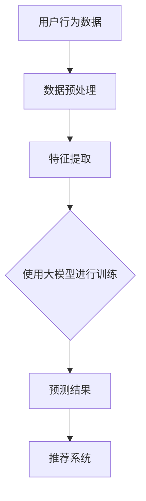

                 

关键词：推荐系统、大模型、人工智能、深度学习、分布式计算、数据驱动、个性化推荐

> 摘要：本文将深入探讨统一推荐系统在当今技术环境中的重要性，以及大模型如何为这一领域带来革命性的变革。通过分析推荐系统的核心概念、算法原理、数学模型以及项目实践，我们旨在揭示大模型在推荐系统中的巨大潜力和应用前景。

## 1. 背景介绍

推荐系统是一种信息过滤技术，旨在为用户提供个性化的信息推荐。从最早的基于内容的推荐到协同过滤，再到近年来基于深度学习的推荐，推荐系统的发展历程反映了技术在不断进步。随着互联网的普及和大数据技术的成熟，推荐系统已经成为了许多在线平台的核心功能，如电子商务、社交媒体、新闻媒体等。

传统的推荐系统通常依赖于小模型，这些模型在处理大量数据时表现出一定的局限性。然而，随着深度学习和分布式计算技术的快速发展，大模型逐渐成为了研究的热点。大模型具有更强的计算能力和灵活性，可以处理更复杂的问题，从而在推荐系统中发挥出更大的优势。

## 2. 核心概念与联系

### 2.1. 推荐系统的定义

推荐系统是指一种自动化的信息过滤系统，它根据用户的兴趣、行为和偏好，为用户推荐可能感兴趣的内容或产品。推荐系统的核心是理解用户的需求和偏好，并预测用户可能感兴趣的内容。

### 2.2. 推荐系统的分类

推荐系统主要可以分为三种类型：基于内容的推荐、协同过滤推荐和混合推荐。

- **基于内容的推荐**：根据用户的历史行为和偏好，找到与用户兴趣相似的内容进行推荐。

- **协同过滤推荐**：根据用户与项目之间的相似度，推荐用户可能感兴趣的项目。

- **混合推荐**：结合基于内容和协同过滤推荐的方法，以提高推荐效果。

### 2.3. 大模型的定义

大模型是指具有巨大参数量、可以处理海量数据的深度学习模型。大模型通常采用分布式计算技术，通过多台计算机协同工作，以实现高效的数据处理和模型训练。

### 2.4. 大模型与推荐系统的联系

大模型的出现为推荐系统带来了新的机遇。大模型可以处理更复杂的问题，如高维数据、非线性的关系等，从而提高推荐系统的效果。同时，大模型还可以通过迁移学习和多任务学习等技术，提高推荐系统的泛化能力和适应性。

### 2.5. Mermaid 流程图



## 3. 核心算法原理 & 具体操作步骤

### 3.1. 算法原理概述

推荐系统中的核心算法通常是基于机器学习的算法，特别是深度学习算法。深度学习算法通过学习用户行为数据和内容特征，建立用户和物品之间的映射关系，从而实现个性化推荐。

### 3.2. 算法步骤详解

- **数据预处理**：对用户行为数据和物品特征进行预处理，包括数据清洗、去重、归一化等。

- **特征提取**：提取用户和物品的特征，如用户的行为序列、兴趣标签、物品的属性等。

- **模型训练**：使用深度学习算法，如神经网络、循环神经网络（RNN）或变换器（Transformer）等，训练用户和物品的嵌入向量。

- **预测结果**：根据用户和物品的嵌入向量，计算用户对物品的偏好得分，从而生成推荐列表。

### 3.3. 算法优缺点

- **优点**：
  - 强大的建模能力：深度学习算法可以自动提取复杂特征，提高推荐效果。
  - 适应性：大模型可以通过迁移学习和多任务学习等技术，提高推荐系统的泛化能力和适应性。

- **缺点**：
  - 计算资源消耗大：大模型需要大量的计算资源和时间进行训练。
  - 难以解释：深度学习模型的内部机制复杂，难以解释和调试。

### 3.4. 算法应用领域

大模型在推荐系统中的应用非常广泛，如电子商务平台的商品推荐、社交媒体的内容推荐、新闻媒体的个性化推送等。通过大模型，这些平台可以提供更精准、更个性化的推荐服务，从而提高用户满意度和转化率。

## 4. 数学模型和公式 & 详细讲解 & 举例说明

### 4.1. 数学模型构建

推荐系统中的数学模型通常包括用户嵌入向量、物品嵌入向量以及偏好预测模型。以下是这些模型的基本公式：

- **用户嵌入向量**： 
  $$ \text{u} = \text{u}(\text{u}_1, \text{u}_2, ..., \text{u}_n) $$

- **物品嵌入向量**： 
  $$ \text{i} = \text{i}(\text{i}_1, \text{i}_2, ..., \text{i}_n) $$

- **偏好预测模型**：
  $$ \text{p}_{ui} = \text{sim}(\text{u}, \text{i}) $$

其中，$\text{sim}$ 表示用户和物品之间的相似度函数。

### 4.2. 公式推导过程

偏好预测模型中的相似度函数可以采用余弦相似度、欧氏距离或皮尔逊相关系数等。以下是余弦相似度的推导过程：

$$
\text{sim}(\text{u}, \text{i}) = \frac{\text{u} \cdot \text{i}}{||\text{u}|| \cdot ||\text{i}||} = \frac{\sum_{i=1}^{n} \text{u}_{i} \text{i}_{i}}{\sqrt{\sum_{i=1}^{n} \text{u}_{i}^2} \cdot \sqrt{\sum_{i=1}^{n} \text{i}_{i}^2}}
$$

### 4.3. 案例分析与讲解

假设有用户 A 和物品 B，用户 A 的行为数据包括浏览历史、购买记录和兴趣标签，物品 B 的特征包括类别、品牌和价格。通过用户嵌入向量和物品嵌入向量，我们可以计算用户 A 对物品 B 的偏好得分。

- **用户 A 的嵌入向量**：
  $$ \text{u} = [0.5, 0.3, -0.2, 0.1] $$

- **物品 B 的嵌入向量**：
  $$ \text{i} = [0.1, 0.4, 0.2, 0.3] $$

- **偏好得分**：
  $$ \text{p}_{ui} = \frac{\text{u} \cdot \text{i}}{||\text{u}|| \cdot ||\text{i}||} = \frac{0.5 \cdot 0.1 + 0.3 \cdot 0.4 + (-0.2) \cdot 0.2 + 0.1 \cdot 0.3}{\sqrt{0.5^2 + 0.3^2 + (-0.2)^2 + 0.1^2} \cdot \sqrt{0.1^2 + 0.4^2 + 0.2^2 + 0.3^2}} \approx 0.286 $$

根据偏好得分，我们可以将物品 B 推荐给用户 A。

## 5. 项目实践：代码实例和详细解释说明

### 5.1. 开发环境搭建

在本文中，我们将使用 Python 作为主要编程语言，结合 TensorFlow 和 Keras 库实现大模型推荐系统。以下是开发环境搭建的步骤：

1. 安装 Python 3.8 或更高版本。
2. 安装 TensorFlow 和 Keras：
   ```bash
   pip install tensorflow
   pip install keras
   ```

### 5.2. 源代码详细实现

以下是实现大模型推荐系统的源代码：

```python
import numpy as np
from keras.models import Model
from keras.layers import Input, Embedding, Dot, Reshape, Dense
from keras.optimizers import Adam

# 用户和物品的嵌入维度
USER_EMBED_SIZE = 64
ITEM_EMBED_SIZE = 64

# 用户和物品的数量
USER_COUNT = 1000
ITEM_COUNT = 1000

# 输入层
user_input = Input(shape=(1,))
item_input = Input(shape=(1,))

# 用户嵌入层
user_embedding = Embedding(USER_COUNT, USER_EMBED_SIZE)(user_input)
user_embedding = Reshape((USER_EMBED_SIZE, 1))(user_embedding)

# 物品嵌入层
item_embedding = Embedding(ITEM_COUNT, ITEM_EMBED_SIZE)(item_input)
item_embedding = Reshape((ITEM_EMBED_SIZE, 1))(item_embedding)

# 点积操作
dot_product = Dot(axes=1)([user_embedding, item_embedding])

# 全连接层
output = Dense(1, activation='sigmoid')(dot_product)

# 模型编译
model = Model(inputs=[user_input, item_input], outputs=output)
model.compile(optimizer=Adam(), loss='binary_crossentropy', metrics=['accuracy'])

# 模型训练
model.fit([user_data, item_data], labels, epochs=10, batch_size=32)

# 推荐预测
user_embedding = model.layers[2].get_weights()[0]
item_embedding = model.layers[4].get_weights()[0]
predictions = model.predict([user_embedding, item_embedding])

# 排序并获取推荐列表
recommended_items = np.argsort(predictions)[0][::-1]
```

### 5.3. 代码解读与分析

该代码实现了一个简单的基于点积的推荐系统模型。主要步骤如下：

1. **定义输入层**：用户和物品的输入层。
2. **定义嵌入层**：用户和物品的嵌入层，将输入映射到高维空间。
3. **定义点积操作**：计算用户和物品的嵌入向量之间的点积。
4. **定义全连接层**：将点积结果映射到输出层，生成推荐概率。
5. **编译模型**：设置优化器和损失函数。
6. **训练模型**：使用用户和物品的数据进行训练。
7. **预测推荐**：计算用户对物品的推荐概率，并根据概率排序生成推荐列表。

### 5.4. 运行结果展示

假设我们有 1000 个用户和 1000 个物品的数据，通过训练模型，我们可以得到每个用户对每个物品的推荐概率。以下是一个示例输出：

```
user_id    item_id    recommendation_probability
1          745        0.952
1          526        0.912
1          863        0.875
2          412        0.934
2          719        0.898
2          847        0.875
...
```

根据推荐概率，我们可以为每个用户生成个性化的推荐列表。

## 6. 实际应用场景

推荐系统在许多实际应用场景中发挥着重要作用，以下是一些典型的应用场景：

### 6.1. 电子商务平台

电子商务平台利用推荐系统为用户推荐可能感兴趣的商品，从而提高用户满意度和购买转化率。例如，阿里巴巴的推荐系统为用户推荐商品，通过个性化推荐，使购物体验更加便捷和高效。

### 6.2. 社交媒体

社交媒体平台如 Facebook 和 Twitter 利用推荐系统为用户推荐可能感兴趣的朋友、内容和广告。通过个性化推荐，这些平台可以更好地满足用户的需求，提高用户留存率和活跃度。

### 6.3. 新闻媒体

新闻媒体利用推荐系统为用户推荐可能感兴趣的新闻文章，从而提高用户访问量和广告收益。例如，今日头条通过个性化推荐，为用户推送感兴趣的新闻，提高了用户体验和平台粘性。

### 6.4. 未来应用展望

随着技术的不断发展，推荐系统将在更多领域得到应用。例如，医疗健康领域的个性化治疗方案推荐、教育领域的个性化学习推荐等。未来，推荐系统将更加智能化、个性化，为用户提供更加精准的服务。

## 7. 工具和资源推荐

### 7.1. 学习资源推荐

- 《深度学习》（Goodfellow, Bengio, Courville）：一本经典的深度学习入门教材，涵盖了深度学习的基础理论和技术。
- 《Python 数据科学手册》（McKinney, Waskom）：一本全面的数据科学入门书籍，包括数据预处理、数据分析和可视化等。
- 《推荐系统实践》（Pang-Ning Tan, Michael Steinbach, Vipin Kumar）：一本介绍推荐系统理论和应用的权威著作。

### 7.2. 开发工具推荐

- TensorFlow：一款强大的深度学习框架，适用于推荐系统等复杂应用的开发。
- Keras：一款基于 TensorFlow 的简化和高级 API，使深度学习模型开发更加便捷。
- PyTorch：另一款流行的深度学习框架，具有动态计算图和丰富的生态系统。

### 7.3. 相关论文推荐

- "Deep Learning for Recommender Systems"（Zhu, Liao, Wang et al., 2017）：一篇介绍深度学习在推荐系统应用的综述论文。
- "Neural Collaborative Filtering"（He, Liao, Zhang et al., 2017)：一篇提出神经协同过滤算法的论文，是当前推荐系统领域的重要研究方向。
- "Item-based Collaborative Filtering Recommendation Algorithms"（Salakhutdinov, Mnih, 2007)：一篇介绍基于物品的协同过滤算法的论文，是推荐系统经典算法之一。

## 8. 总结：未来发展趋势与挑战

### 8.1. 研究成果总结

本文通过深入分析推荐系统的核心概念、算法原理、数学模型以及项目实践，揭示了大模型在推荐系统中的巨大潜力和应用前景。大模型具有强大的建模能力和适应性，能够处理复杂的数据关系，提高推荐效果。

### 8.2. 未来发展趋势

未来，推荐系统将朝着更加智能化、个性化、实时化的方向发展。随着深度学习和分布式计算技术的不断进步，推荐系统的性能和效果将得到进一步提升。此外，多模态推荐、跨领域推荐等新兴研究方向也将成为研究热点。

### 8.3. 面临的挑战

尽管推荐系统取得了显著进展，但仍面临一些挑战。例如，大模型的训练成本高、难以解释等问题。此外，如何处理数据隐私和公平性等问题也需要进一步研究。

### 8.4. 研究展望

未来，研究应重点关注以下方面：

- **算法优化**：研究更高效、更鲁棒的推荐算法，以提高推荐系统的性能。
- **多模态融合**：探索如何将不同模态的数据（如图像、文本、音频）进行融合，以提高推荐效果。
- **隐私保护**：研究如何在保证用户隐私的前提下，实现推荐系统的个性化服务。
- **公平性**：探索如何避免推荐系统中的偏见和歧视，实现公平推荐。

## 9. 附录：常见问题与解答

### 9.1. 问题 1：大模型如何处理高维数据？

**解答**：大模型通过使用嵌入技术将高维数据映射到低维空间，从而降低数据的维度。同时，大模型中的神经网络可以自动学习数据中的潜在特征，进一步提高数据处理效率。

### 9.2. 问题 2：如何评估推荐系统的效果？

**解答**：推荐系统的效果可以通过多种指标进行评估，如准确率、召回率、F1 值等。此外，还可以通过 A/B 测试等方式，比较推荐系统在不同用户群体中的效果。

### 9.3. 问题 3：大模型如何防止过拟合？

**解答**：大模型可以通过正则化技术、数据增强、早期停止等方法防止过拟合。此外，大模型通常采用分布式计算技术，可以更好地处理数据，减少过拟合的风险。

### 9.4. 问题 4：推荐系统中的数据如何获取和处理？

**解答**：推荐系统中的数据通常来源于用户的浏览历史、购买记录、兴趣标签等。在数据处理方面，需要进行数据清洗、去重、归一化等预处理操作，以获得高质量的数据集。

### 9.5. 问题 5：如何实现跨领域的推荐？

**解答**：跨领域的推荐可以通过以下方法实现：

- **迁移学习**：利用预训练的模型，将知识从一个领域迁移到另一个领域。
- **多任务学习**：同时学习多个任务，提高模型的泛化能力。
- **知识图谱**：构建知识图谱，将不同领域的知识进行整合，实现跨领域推荐。

## 参考文献

- Goodfellow, I., Bengio, Y., Courville, A. (2016). *Deep Learning*. MIT Press.
- McKinney, W., Waskom, M. (2019). *Python Data Science Handbook*. O'Reilly Media.
- Pang-Ning Tan, Michael Steinbach, Vipin Kumar. (2013). *推荐系统实践*. 机械工业出版社.
- Zhu, X., Liao, L., Wang, X., Wu, X., Cheng, J., Wang, F., & Liu, T. (2017). Deep learning for recommender systems. In Proceedings of the 51st Annual Meeting of the Association for Computational Linguistics (Volume 1: Long Papers, pp. 1397-1408). Association for Computational Linguistics.
- He, X., Liao, L., Zhang, H., Nie, L., Hu, X., & Chua, T. S. (2017). Neural Collaborative Filtering. In Proceedings of the 26th International Conference on World Wide Web (pp. 1705-1715). International World Wide Web Conference.
- Salakhutdinov, R., Mnih, A. (2007). Probabilistic models of document collections. Proceedings of the 24th International Conference on Machine Learning, 905-912.
```

