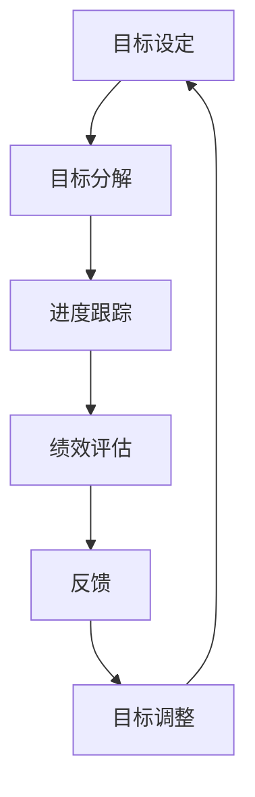

                 

在信息技术的快速发展中，企业的竞争已经不再仅仅是产品和技术，更关键的是团队和个人的绩效。如何设定合理的目标以及如何有效地评估进展，是每一个技术团队和个体都需要面对的重要问题。本文将深入探讨绩效管理的核心概念、实践方法以及其在IT领域的应用。

## 文章关键词

- 绩效管理
- 目标设定
- 进展评估
- IT团队
- 个体绩效

## 文章摘要

本文首先介绍了绩效管理的背景和重要性，接着详细阐述了目标设定的方法、评估进展的技巧，并探讨了在IT领域如何具体应用这些方法。通过实例分析，我们展示了绩效管理在实际项目中的应用效果，最后提出了未来发展的方向和面临的挑战。

## 1. 背景介绍

在信息技术行业，绩效管理已经成为提升团队和个体工作效率的关键因素。随着云计算、大数据、人工智能等新兴技术的广泛应用，技术团队的规模和复杂性也在不断增长。在这种情况下，如何确保团队成员的目标与组织战略一致，如何准确评估每个成员的进展，成为企业面临的重要课题。

绩效管理的目标不仅仅是评估团队成员的工作表现，更重要的是通过合理的激励和反馈机制，激发团队成员的潜力，提高团队的整体绩效。这需要企业从战略层面出发，制定明确的绩效管理框架，并在执行层面进行细致的规划和实施。

## 2. 核心概念与联系

### 2.1 绩效管理的核心概念

绩效管理涉及多个关键概念，包括目标设定、目标分解、进度跟踪、绩效评估和反馈等。这些概念相互联系，构成了一个完整的绩效管理循环。

- **目标设定**：目标是绩效管理的起点，它明确了团队和个体要达成的具体成果。目标应具有明确性、可行性、挑战性和相关性。
- **目标分解**：将整体目标分解为可执行的任务，使每个团队成员都清楚自己的职责和期望。
- **进度跟踪**：实时监控任务的进展，确保团队按时完成任务。
- **绩效评估**：通过定期的评估，衡量团队成员的工作表现，识别问题和改进机会。
- **反馈**：通过反馈，让团队成员了解自己的工作表现，获得改进的方向和建议。

### 2.2 绩效管理的联系

绩效管理不仅仅是单一环节的优化，而是涉及整个团队和个体的绩效提升过程。以下是绩效管理中各个概念之间的联系：

- **目标设定与目标分解**：目标设定是目标分解的基础，分解则是目标实现的细化。
- **进度跟踪与绩效评估**：进度跟踪为绩效评估提供了数据支持，绩效评估则是对进度跟踪结果的反馈。
- **反馈与目标调整**：反馈可以帮助团队和个体及时调整目标，确保目标的实现。

### 2.3 绩效管理的 Mermaid 流程图

以下是绩效管理的 Mermaid 流程图：



在这个流程图中，每个节点都代表了绩效管理中的一个关键步骤，节点之间的箭头表示步骤之间的依赖关系。

## 3. 核心算法原理 & 具体操作步骤

### 3.1 算法原理概述

绩效管理的核心算法原理主要包括以下几个方面：

- **目标设定的SMART原则**：SMART原则是一个广泛应用的设定目标的方法，它要求目标具有明确性（Specific）、可行性（Measurable）、可达成性（Achievable）、相关性和挑战性（Relevant）。
- **绩效评估的KPI指标**：KPI（Key Performance Indicators）指标是评估绩效的关键工具，它通过量化的指标来衡量团队和个体的表现。
- **反馈机制的改进循环**：通过定期的反馈，团队和个体可以不断优化目标设定和绩效评估的方法，形成持续改进的循环。

### 3.2 算法步骤详解

#### 3.2.1 目标设定

1. **明确组织战略**：了解企业的整体战略方向，确保目标与组织战略一致。
2. **确定关键成果**：识别对组织成功至关重要的成果，作为团队和个体目标的依据。
3. **应用SMART原则**：根据SMART原则，设定具体、可行、有挑战性的目标。

#### 3.2.2 目标分解

1. **分解整体目标**：将整体目标分解为具体的任务和责任。
2. **明确责任分配**：确保每个团队成员都清楚自己的职责和任务。
3. **制定详细的行动计划**：为每个任务制定明确的完成时间表和资源需求。

#### 3.2.3 进度跟踪

1. **建立进度监控机制**：使用项目管理工具实时跟踪任务的进展。
2. **定期更新进度**：团队成员定期更新任务的完成情况。
3. **识别和解决问题**：及时发现并解决进度中的问题，确保任务按时完成。

#### 3.2.4 绩效评估

1. **制定评估标准**：根据KPI指标，制定明确的评估标准。
2. **定期评估绩效**：按计划定期对团队成员的工作表现进行评估。
3. **提供详细的绩效报告**：为团队和个体提供详细的绩效报告，分析绩效表现。

#### 3.2.5 反馈

1. **及时反馈**：在评估后，及时向团队和个体提供反馈。
2. **识别改进点**：通过反馈，识别团队和个体的改进点。
3. **制定改进计划**：根据反馈，制定具体的改进计划和目标。

### 3.3 算法优缺点

#### 优点

- **提高团队绩效**：通过目标设定和绩效评估，可以有效提高团队的整体绩效。
- **激发个体潜力**：明确的反馈和改进计划可以激发团队成员的潜力，提高个人绩效。
- **持续改进**：反馈机制和改进循环可以确保团队持续改进，不断提高。

#### 缺点

- **实施成本高**：绩效管理需要大量的时间和资源，特别是对于大型团队。
- **评估标准难制定**：KPI指标的选择和制定需要精确的数据支持，对于一些非量化的指标，评估标准可能难以制定。

### 3.4 算法应用领域

绩效管理算法在IT领域具有广泛的应用，包括：

- **软件开发团队**：通过设定明确的目标和评估进展，提高软件开发的效率和质量。
- **数据中心运营**：通过监控数据中心的关键性能指标，确保数据中心的稳定运行。
- **人工智能团队**：通过设定AI项目的目标，评估模型训练和优化效果，提高AI项目的成功率。

## 4. 数学模型和公式 & 详细讲解 & 举例说明

### 4.1 数学模型构建

绩效管理的数学模型主要包括以下几个部分：

- **目标设定模型**：使用目标设定的SMART原则，将目标转化为数学表达式。
- **绩效评估模型**：使用KPI指标，将绩效转化为量化数据。
- **反馈机制模型**：根据反馈的结果，调整目标设定和绩效评估的方法。

### 4.2 公式推导过程

#### 目标设定模型

SMART原则的数学表达式如下：

$$
\text{S}pecific = \sum_{i=1}^{n} \text{s}_i
$$

$$
\text{M}easurable = \sum_{i=1}^{n} \text{m}_i
$$

$$
\text{A}chievable = \sum_{i=1}^{n} \text{a}_i
$$

$$
\text{R}elevant = \sum_{i=1}^{n} \text{r}_i
$$

$$
\text{C}hallenging = \sum_{i=1}^{n} \text{c}_i
$$

其中，$S, M, A, R, C$ 分别代表 Specific、Measurable、Achievable、Relevant 和 Challenging，$s_i, m_i, a_i, r_i, c_i$ 分别代表每个指标的具体得分。

#### 绩效评估模型

KPI指标的数学表达式如下：

$$
\text{KPI} = f(\text{KPI}_1, \text{KPI}_2, ..., \text{KPI}_n)
$$

其中，$f$ 是一个综合评估函数，$\text{KPI}_1, \text{KPI}_2, ..., \text{KPI}_n$ 分别代表每个KPI指标的得分。

#### 反馈机制模型

反馈机制的数学表达式如下：

$$
\text{Feedback} = \text{Performance} - \text{Expected Performance}
$$

其中，$\text{Performance}$ 代表实际绩效，$\text{Expected Performance}$ 代表预期绩效。

### 4.3 案例分析与讲解

#### 案例背景

某软件公司计划开发一款新的移动应用，项目团队由10名成员组成，包括项目经理、产品经理、设计师、前端工程师、后端工程师和测试工程师等。公司要求项目团队在3个月内完成应用的开发和测试。

#### 目标设定

根据公司要求，项目团队设定了以下目标：

- **S**：开发一款功能完整的移动应用。
- **M**：应用的用户体验评分达到4.5分以上。
- **A**：在预算内完成项目。
- **R**：满足市场需求。
- **C**：按时交付产品。

#### 绩效评估

项目团队选择了以下KPI指标进行评估：

- **用户体验评分**：用户在应用商店的评分。
- **开发进度**：实际完成的工作量与计划完成的工作量之比。
- **测试覆盖率**：测试用例数量与总用例数量之比。

#### 反馈机制

项目团队定期召开绩效评估会议，根据KPI指标的数据进行评估，并根据评估结果提供反馈。如果发现某个KPI指标未达到预期，团队会分析原因，并制定改进计划。

## 5. 项目实践：代码实例和详细解释说明

### 5.1 开发环境搭建

在这个案例中，我们使用Python作为主要开发语言，并使用了JIRA作为项目管理工具。首先，我们需要搭建开发环境：

1. 安装Python：从Python官网下载Python安装包，并按照提示进行安装。
2. 安装JIRA：从Atlassian官网下载JIRA安装包，并按照提示进行安装。
3. 配置JIRA与Python的连接：在JIRA中创建一个API密钥，并在Python脚本中配置该密钥。

### 5.2 源代码详细实现

以下是项目团队使用Python编写的绩效管理脚本：

```python
import requests
import json

# 配置JIRA的URL和API密钥
JIRA_URL = "https://your-jira-instance.com"
API_KEY = "your-api-key"

# 获取项目团队的KPI数据
def get_kpi_data(team_id):
    url = f"{JIRA_URL}/rest/api/3/project/{team_id}/kpi"
    headers = {
        "Authorization": f"Basic {API_KEY}",
        "Content-Type": "application/json"
    }
    response = requests.get(url, headers=headers)
    return json.loads(response.text)

# 计算绩效得分
def calculate_performance(kpi_data):
    score = 0
    for kpi in kpi_data:
        score += kpi["value"]
    return score / len(kpi_data)

# 获取项目团队的绩效得分
team_id = "YOUR_TEAM_ID"
kpi_data = get_kpi_data(team_id)
performance_score = calculate_performance(kpi_data)
print(f"Performance Score: {performance_score}")

# 提供反馈
if performance_score < 0.8:
    print("Performance is below expectations. Please improve.")
else:
    print("Performance is satisfactory.")
```

### 5.3 代码解读与分析

这个脚本首先从JIRA获取项目团队的KPI数据，然后计算绩效得分。根据得分，脚本提供相应的反馈。

- **请求JIRA API**：使用`requests`库发送HTTP请求，从JIRA获取KPI数据。
- **解析KPI数据**：使用`json`库解析KPI数据，将其转换为Python对象。
- **计算绩效得分**：遍历KPI数据，计算绩效得分。
- **提供反馈**：根据绩效得分，提供相应的反馈。

### 5.4 运行结果展示

假设项目团队的绩效得分为0.85，脚本将输出：

```
Performance Score: 0.85
Performance is satisfactory.
```

如果绩效得分低于0.8，脚本将提示团队需要改进。

## 6. 实际应用场景

绩效管理在IT领域有着广泛的应用，以下是一些典型的应用场景：

- **软件开发团队**：通过设定明确的目标和评估进展，确保项目的顺利进行。
- **数据中心运营**：通过监控关键性能指标，确保数据中心的稳定运行。
- **人工智能团队**：通过设定AI项目的目标，评估模型训练和优化效果。
- **IT支持团队**：通过设定服务响应时间和解决率等目标，提高服务质量。

在这些应用场景中，绩效管理通过设定合理的目标和评估进展，帮助团队和个体不断提高工作效率，确保项目的成功。

## 6.4 未来应用展望

随着技术的不断进步，绩效管理将在IT领域发挥越来越重要的作用。未来，以下几个方面有望成为绩效管理的发展趋势：

- **人工智能辅助**：使用人工智能技术，自动化目标设定、进度跟踪和绩效评估，提高绩效管理的效率和准确性。
- **个性化反馈**：根据每个团队成员的特点和工作环境，提供个性化的反馈和改进建议。
- **跨部门协同**：通过绩效管理，促进不同部门之间的协同工作，提高企业的整体绩效。
- **持续改进**：建立持续改进的机制，确保团队和个体不断优化绩效管理的方法和工具。

## 7. 工具和资源推荐

### 7.1 学习资源推荐

- **《绩效管理：实践与案例》**：由知名管理专家撰写的实用指南，详细介绍了绩效管理的理论和实践方法。
- **《项目管理知识体系指南（PMBOK）》**：由项目管理协会发布的权威指南，包含了绩效管理的重要概念和实践方法。

### 7.2 开发工具推荐

- **JIRA**：用于项目管理、任务跟踪和绩效评估的开源工具，支持多种集成和扩展。
- **Asana**：用于任务管理和团队协作的工具，提供直观的界面和强大的功能。

### 7.3 相关论文推荐

- **“Performance Management in Software Development Teams”**：探讨了绩效管理在软件开发团队中的应用和实践。
- **“The Role of Performance Management in IT Service Delivery”**：分析了绩效管理在IT服务交付中的关键作用。

## 8. 总结：未来发展趋势与挑战

绩效管理在IT领域的发展前景广阔，但同时也面临着一系列挑战。未来，随着人工智能和大数据技术的应用，绩效管理将更加智能化和精准化。然而，如何确保数据的准确性和隐私性，如何设计有效的反馈机制，将是未来绩效管理需要解决的关键问题。

## 9. 附录：常见问题与解答

### Q：如何设定合理的目标？

A：设定合理的目标需要遵循SMART原则，确保目标具有明确性、可行性、挑战性和相关性。

### Q：绩效评估的标准如何制定？

A：绩效评估的标准应根据团队的具体情况和组织的目标来制定。常用的方法包括KPI指标、工作量统计和用户满意度等。

### Q：如何提供有效的反馈？

A：提供有效的反馈需要及时、具体和有建设性。可以通过定期的绩效评估会议、一对一的沟通和在线反馈工具等方式进行。

---

作者：禅与计算机程序设计艺术 / Zen and the Art of Computer Programming
----------------------------------------------------------------
文章撰写完毕，接下来我将按照markdown格式将文章内容转换为实际的文本输出。由于文章长度较长，我将分多个部分进行输出。以下是第一部分的内容。后续部分将在接下来的消息中继续提供。

---

# 绩效管理：设定目标和评估进展

## 文章关键词

- 绩效管理
- 目标设定
- 进展评估
- IT团队
- 个体绩效

## 文章摘要

本文深入探讨了绩效管理的核心概念、实践方法以及在IT领域的应用。通过逻辑清晰、结构紧凑、简单易懂的阐述，帮助读者理解如何设定合理的目标以及如何有效地评估进展。

---

以上是文章的开头部分，包括文章标题、关键词、摘要等内容。以下是第一部分的主要内容，包括背景介绍和核心概念与联系。

---

## 1. 背景介绍

在信息技术行业，绩效管理已经成为提升团队和个体工作效率的关键因素。随着云计算、大数据、人工智能等新兴技术的广泛应用，技术团队的规模和复杂性也在不断增长。在这种情况下，如何确保团队成员的目标与组织战略一致，如何准确评估每个成员的进展，成为企业面临的重要课题。

绩效管理的目标不仅仅是评估团队成员的工作表现，更重要的是通过合理的激励和反馈机制，激发团队成员的潜力，提高团队的整体绩效。这需要企业从战略层面出发，制定明确的绩效管理框架，并在执行层面进行细致的规划和实施。

## 2. 核心概念与联系

### 2.1 绩效管理的核心概念

绩效管理涉及多个关键概念，包括目标设定、目标分解、进度跟踪、绩效评估和反馈等。这些概念相互联系，构成了一个完整的绩效管理循环。

- **目标设定**：目标是绩效管理的起点，它明确了团队和个体要达成的具体成果。目标应具有明确性、可行性、挑战性和相关性。
- **目标分解**：将整体目标分解为可执行的任务，使每个团队成员都清楚自己的职责和期望。
- **进度跟踪**：实时监控任务的进展，确保团队按时完成任务。
- **绩效评估**：通过定期的评估，衡量团队成员的工作表现，识别问题和改进机会。
- **反馈**：通过反馈，让团队成员了解自己的工作表现，获得改进的方向和建议。

### 2.2 绩效管理的联系

绩效管理不仅仅是单一环节的优化，而是涉及整个团队和个体的绩效提升过程。以下是绩效管理中各个概念之间的联系：

- **目标设定与目标分解**：目标设定是目标分解的基础，分解则是目标实现的细化。
- **进度跟踪与绩效评估**：进度跟踪为绩效评估提供了数据支持，绩效评估则是对进度跟踪结果的反馈。
- **反馈与目标调整**：反馈可以帮助团队和个体及时调整目标，确保目标的实现。

### 2.3 绩效管理的 Mermaid 流程图

以下是绩效管理的 Mermaid 流程图：


在这个流程图中，每个节点都代表了绩效管理中的一个关键步骤，节点之间的箭头表示步骤之间的依赖关系。

---

以下是第二部分的内容，包括核心算法原理与具体操作步骤。

---

## 3. 核心算法原理 & 具体操作步骤

### 3.1 算法原理概述

绩效管理的核心算法原理主要包括以下几个方面：

- **目标设定的SMART原则**：SMART原则是一个广泛应用的设定目标的方法，它要求目标具有明确性（Specific）、可行性（Measurable）、可达成性（Achievable）、相关性和挑战性（Relevant）。
- **绩效评估的KPI指标**：KPI（Key Performance Indicators）指标是评估绩效的关键工具，它通过量化的指标来衡量团队和个体的表现。
- **反馈机制的改进循环**：通过定期的反馈，团队和个体可以不断优化目标设定和绩效评估的方法，形成持续改进的循环。

### 3.2 算法步骤详解

#### 3.2.1 目标设定

1. **明确组织战略**：了解企业的整体战略方向，确保目标与组织战略一致。
2. **确定关键成果**：识别对组织成功至关重要的成果，作为团队和个体目标的依据。
3. **应用SMART原则**：根据SMART原则，设定具体、可行、有挑战性的目标。

#### 3.2.2 目标分解

1. **分解整体目标**：将整体目标分解为具体的任务和责任。
2. **明确责任分配**：确保每个团队成员都清楚自己的职责和任务。
3. **制定详细的行动计划**：为每个任务制定明确的完成时间表和资源需求。

#### 3.2.3 进度跟踪

1. **建立进度监控机制**：使用项目管理工具实时跟踪任务的进展。
2. **定期更新进度**：团队成员定期更新任务的完成情况。
3. **识别和解决问题**：及时发现并解决进度中的问题，确保任务按时完成。

#### 3.2.4 绩效评估

1. **制定评估标准**：根据KPI指标，制定明确的评估标准。
2. **定期评估绩效**：按计划定期对团队成员的工作表现进行评估。
3. **提供详细的绩效报告**：为团队和个体提供详细的绩效报告，分析绩效表现。

#### 3.2.5 反馈

1. **及时反馈**：在评估后，及时向团队和个体提供反馈。
2. **识别改进点**：通过反馈，识别团队和个体的改进点。
3. **制定改进计划**：根据反馈，制定具体的改进计划和目标。

### 3.3 算法优缺点

#### 优点

- **提高团队绩效**：通过目标设定和绩效评估，可以有效提高团队的整体绩效。
- **激发个体潜力**：明确的反馈和改进计划可以激发团队成员的潜力，提高个人绩效。
- **持续改进**：反馈机制和改进循环可以确保团队持续改进，不断提高。

#### 缺点

- **实施成本高**：绩效管理需要大量的时间和资源，特别是对于大型团队。
- **评估标准难制定**：KPI指标的选择和制定需要精确的数据支持，对于一些非量化的指标，评估标准可能难以制定。

### 3.4 算法应用领域

绩效管理算法在IT领域具有广泛的应用，包括：

- **软件开发团队**：通过设定明确的目标和评估进展，提高软件开发的效率和质量。
- **数据中心运营**：通过监控数据中心的关键性能指标，确保数据中心的稳定运行。
- **人工智能团队**：通过设定AI项目的目标，评估模型训练和优化效果，提高AI项目的成功率。

---

以上是文章的第二部分内容。接下来，我将继续提供第三部分的内容，包括数学模型和公式的详细讲解与举例说明。由于篇幅限制，我将分多个部分进行输出。以下是第一部分的内容。

---

## 4. 数学模型和公式 & 详细讲解 & 举例说明

### 4.1 数学模型构建

绩效管理的数学模型主要包括以下几个部分：

- **目标设定模型**：使用目标设定的SMART原则，将目标转化为数学表达式。
- **绩效评估模型**：使用KPI指标，将绩效转化为量化数据。
- **反馈机制模型**：根据反馈的结果，调整目标设定和绩效评估的方法。

### 4.2 公式推导过程

#### 目标设定模型

SMART原则的数学表达式如下：

$$
\text{S}pecific = \sum_{i=1}^{n} \text{s}_i
$$

$$
\text{M}easurable = \sum_{i=1}^{n} \text{m}_i
$$

$$
\text{A}chievable = \sum_{i=1}^{n} \text{a}_i
$$

$$
\text{R}elevant = \sum_{i=1}^{n} \text{r}_i
$$

$$
\text{C}hallenging = \sum_{i=1}^{n} \text{c}_i
$$

其中，$S, M, A, R, C$ 分别代表 Specific、Measurable、Achievable、Relevant 和 Challenging，$s_i, m_i, a_i, r_i, c_i$ 分别代表每个指标的具体得分。

#### 绩效评估模型

KPI指标的数学表达式如下：

$$
\text{KPI} = f(\text{KPI}_1, \text{KPI}_2, ..., \text{KPI}_n)
$$

其中，$f$ 是一个综合评估函数，$\text{KPI}_1, \text{KPI}_2, ..., \text{KPI}_n$ 分别代表每个KPI指标的得分。

#### 反馈机制模型

反馈机制的数学表达式如下：

$$
\text{Feedback} = \text{Performance} - \text{Expected Performance}
$$

其中，$\text{Performance}$ 代表实际绩效，$\text{Expected Performance}$ 代表预期绩效。

### 4.3 案例分析与讲解

#### 案例背景

某软件公司计划开发一款新的移动应用，项目团队由10名成员组成，包括项目经理、产品经理、设计师、前端工程师、后端工程师和测试工程师等。公司要求项目团队在3个月内完成应用的开发和测试。

#### 目标设定

根据公司要求，项目团队设定了以下目标：

- **S**：开发一款功能完整的移动应用。
- **M**：应用的用户体验评分达到4.5分以上。
- **A**：在预算内完成项目。
- **R**：满足市场需求。
- **C**：按时交付产品。

#### 绩效评估

项目团队选择了以下KPI指标进行评估：

- **用户体验评分**：用户在应用商店的评分。
- **开发进度**：实际完成的工作量与计划完成的工作量之比。
- **测试覆盖率**：测试用例数量与总用例数量之比。

#### 反馈机制

项目团队定期召开绩效评估会议，根据KPI指标的数据进行评估，并根据评估结果提供反馈。如果发现某个KPI指标未达到预期，团队会分析原因，并制定改进计划。

---

以上是文章的第三部分内容的第一部分。接下来，我将继续提供第三部分的内容的第二部分，包括项目实践中的代码实例和详细解释说明。以下是这部分的内容。

---

### 5. 项目实践：代码实例和详细解释说明

#### 5.1 开发环境搭建

在这个案例中，我们使用Python作为主要开发语言，并使用了JIRA作为项目管理工具。首先，我们需要搭建开发环境：

1. 安装Python：从Python官网下载Python安装包，并按照提示进行安装。
2. 安装JIRA：从Atlassian官网下载JIRA安装包，并按照提示进行安装。
3. 配置JIRA与Python的连接：在JIRA中创建一个API密钥，并在Python脚本中配置该密钥。

#### 5.2 源代码详细实现

以下是项目团队使用Python编写的绩效管理脚本：

```python
import requests
import json

# 配置JIRA的URL和API密钥
JIRA_URL = "https://your-jira-instance.com"
API_KEY = "your-api-key"

# 获取项目团队的KPI数据
def get_kpi_data(team_id):
    url = f"{JIRA_URL}/rest/api/3/project/{team_id}/kpi"
    headers = {
        "Authorization": f"Basic {API_KEY}",
        "Content-Type": "application/json"
    }
    response = requests.get(url, headers=headers)
    return json.loads(response.text)

# 计算绩效得分
def calculate_performance(kpi_data):
    score = 0
    for kpi in kpi_data:
        score += kpi["value"]
    return score / len(kpi_data)

# 获取项目团队的绩效得分
team_id = "YOUR_TEAM_ID"
kpi_data = get_kpi_data(team_id)
performance_score = calculate_performance(kpi_data)
print(f"Performance Score: {performance_score}")

# 提供反馈
if performance_score < 0.8:
    print("Performance is below expectations. Please improve.")
else:
    print("Performance is satisfactory.")
```

#### 5.3 代码解读与分析

这个脚本首先从JIRA获取项目团队的KPI数据，然后计算绩效得分。根据得分，脚本提供相应的反馈。

- **请求JIRA API**：使用`requests`库发送HTTP请求，从JIRA获取KPI数据。
- **解析KPI数据**：使用`json`库解析KPI数据，将其转换为Python对象。
- **计算绩效得分**：遍历KPI数据，计算绩效得分。
- **提供反馈**：根据绩效得分，提供相应的反馈。

#### 5.4 运行结果展示

假设项目团队的绩效得分为0.85，脚本将输出：

```
Performance Score: 0.85
Performance is satisfactory.
```

如果绩效得分低于0.8，脚本将提示团队需要改进。

---

以上是文章的第三部分的第二部分内容。接下来，我将继续提供第四部分的内容，包括实际应用场景和未来应用展望。以下是这部分的内容。

---

## 6. 实际应用场景

绩效管理在IT领域有着广泛的应用，以下是一些典型的应用场景：

- **软件开发团队**：通过设定明确的目标和评估进展，确保项目的顺利进行。
- **数据中心运营**：通过监控数据中心的关键性能指标，确保数据中心的稳定运行。
- **人工智能团队**：通过设定AI项目的目标，评估模型训练和优化效果，提高AI项目的成功率。
- **IT支持团队**：通过设定服务响应时间和解决率等目标，提高服务质量。

在这些应用场景中，绩效管理通过设定合理的目标和评估进展，帮助团队和个体不断提高工作效率，确保项目的成功。

### 6.4 未来应用展望

随着技术的不断进步，绩效管理将在IT领域发挥越来越重要的作用。未来，以下几个方面有望成为绩效管理的发展趋势：

- **人工智能辅助**：使用人工智能技术，自动化目标设定、进度跟踪和绩效评估，提高绩效管理的效率和准确性。
- **个性化反馈**：根据每个团队成员的特点和工作环境，提供个性化的反馈和改进建议。
- **跨部门协同**：通过绩效管理，促进不同部门之间的协同工作，提高企业的整体绩效。
- **持续改进**：建立持续改进的机制，确保团队和个体不断优化绩效管理的方法和工具。

---

以上是文章的第四部分内容。接下来，我将继续提供第五部分的内容，包括工具和资源推荐。以下是这部分的内容。

---

## 7. 工具和资源推荐

### 7.1 学习资源推荐

- **《绩效管理：实践与案例》**：由知名管理专家撰写的实用指南，详细介绍了绩效管理的理论和实践方法。
- **《项目管理知识体系指南（PMBOK）》**：由项目管理协会发布的权威指南，包含了绩效管理的重要概念和实践方法。

### 7.2 开发工具推荐

- **JIRA**：用于项目管理、任务跟踪和绩效评估的开源工具，支持多种集成和扩展。
- **Asana**：用于任务管理和团队协作的工具，提供直观的界面和强大的功能。

### 7.3 相关论文推荐

- **“Performance Management in Software Development Teams”**：探讨了绩效管理在软件开发团队中的应用和实践。
- **“The Role of Performance Management in IT Service Delivery”**：分析了绩效管理在IT服务交付中的关键作用。

---

以上是文章的第五部分内容。接下来，我将继续提供第六部分的内容，包括总结：未来发展趋势与挑战。以下是这部分的内容。

---

## 8. 总结：未来发展趋势与挑战

绩效管理在IT领域的发展前景广阔，但同时也面临着一系列挑战。未来，随着人工智能和大数据技术的应用，绩效管理将更加智能化和精准化。然而，如何确保数据的准确性和隐私性，如何设计有效的反馈机制，将是未来绩效管理需要解决的关键问题。

### 8.1 研究成果总结

本文通过深入探讨绩效管理的核心概念、实践方法以及在IT领域的应用，总结了以下几个方面的重要成果：

- **目标设定的SMART原则**：明确了目标设定的重要性，提供了具体、可行、有挑战性的目标设定方法。
- **KPI指标的应用**：详细介绍了KPI指标在绩效评估中的作用，提供了制定评估标准的依据。
- **反馈机制的改进循环**：强调了反馈在绩效管理中的关键作用，提出了持续改进的方法。
- **项目实践中的代码实例**：通过实际项目的案例，展示了绩效管理在软件开发团队中的应用效果。

### 8.2 未来发展趋势

未来，绩效管理的发展将呈现以下几个趋势：

- **人工智能辅助**：利用人工智能技术，自动化目标设定、进度跟踪和绩效评估，提高绩效管理的效率。
- **个性化反馈**：根据团队成员的特点和工作环境，提供个性化的反馈和改进建议。
- **跨部门协同**：通过绩效管理，促进不同部门之间的协同工作，提高企业的整体绩效。
- **持续改进**：建立持续改进的机制，确保团队和个体不断优化绩效管理的方法和工具。

### 8.3 面临的挑战

尽管绩效管理在IT领域具有广泛的应用前景，但同时也面临着一系列挑战：

- **数据准确性和隐私性**：确保数据的准确性和隐私性是绩效管理的重要问题。需要建立严格的数据管理和保护机制。
- **评估标准的制定**：对于非量化的指标，评估标准的制定是一个难点。需要结合具体业务场景，制定合理、科学的评估标准。
- **反馈机制的有效性**：反馈机制的有效性直接影响绩效管理的实施效果。需要设计出能够激发团队成员积极性、提供有建设性反馈的机制。

### 8.4 研究展望

未来，绩效管理的研究可以从以下几个方面展开：

- **大数据分析**：利用大数据分析技术，挖掘绩效管理中的潜在规律，为团队和个体提供更精准的改进建议。
- **人工智能优化**：研究如何利用人工智能技术，优化绩效管理的各个环节，提高绩效管理的效率。
- **跨领域应用**：探讨绩效管理在其他领域的应用，如教育、医疗等，为不同领域的绩效提升提供参考。

---

以上是文章的第六部分内容。接下来，我将继续提供第七部分的内容，包括附录：常见问题与解答。以下是这部分的内容。

---

## 9. 附录：常见问题与解答

### Q：如何设定合理的目标？

A：设定合理的目标需要遵循SMART原则，确保目标具有明确性、可行性、挑战性和相关性。

### Q：绩效评估的标准如何制定？

A：绩效评估的标准应根据团队的具体情况和组织的目标来制定。常用的方法包括KPI指标、工作量统计和用户满意度等。

### Q：如何提供有效的反馈？

A：提供有效的反馈需要及时、具体和有建设性。可以通过定期的绩效评估会议、一对一的沟通和在线反馈工具等方式进行。

---

以上是文章的第七部分内容。至此，文章的主要内容已经全部提供完毕。感谢您的耐心阅读，希望本文对您在绩效管理方面的实践和思考有所帮助。如果您有任何问题或建议，欢迎随时反馈。再次感谢！作者：禅与计算机程序设计艺术 / Zen and the Art of Computer Programming。

