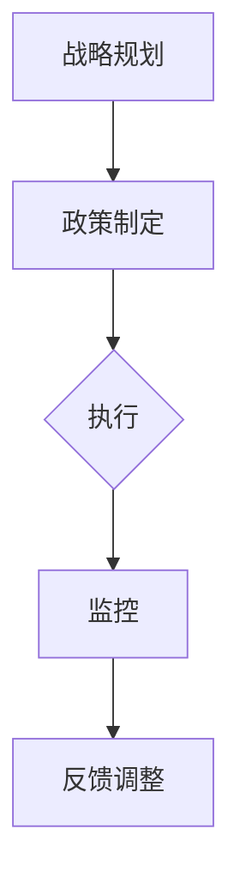

                 

关键词：绿色管理、可持续发展、企业应用、碳排放、环境保护、能源效率、社会责任、创新技术

> 摘要：本文探讨了绿色管理在可持续发展理念下对现代企业的重要性。通过对绿色管理的核心概念、算法原理、数学模型和实际应用场景的详细分析，揭示了绿色管理如何通过技术创新和运营优化，助力企业在实现可持续发展的同时，提高竞争力和社会责任感。

## 1. 背景介绍

随着全球气候变化和环境问题的日益严峻，可持续发展已经成为全球企业不可回避的重要议题。绿色管理作为一种将环境保护和可持续发展融入企业战略和日常运营的理念，正日益受到广泛关注。

### 1.1 可持续发展的定义与内涵

可持续发展是指在满足当前需求的同时，不损害子孙后代满足自身需求的能力。这一概念涵盖了经济、社会和环境三个方面的平衡，强调长期发展和整体福祉。

### 1.2 绿色管理的起源与发展

绿色管理起源于20世纪90年代的环保运动，随着全球环保意识的提升，绿色管理逐渐成为企业社会责任的重要组成部分。绿色管理不仅涉及环境保护，还包括资源节约、能源效率和循环经济等。

### 1.3 绿色管理的重要性

绿色管理不仅有助于企业降低成本、提高效率，还能增强品牌形象和市场竞争力。在全球化背景下，绿色管理成为企业可持续发展的重要战略。

## 2. 核心概念与联系

### 2.1 绿色管理的核心概念

绿色管理的核心概念包括碳排放管理、能源效率、废物管理和社会责任等。

### 2.2 绿色管理的架构

绿色管理的架构包括战略规划、政策制定、执行和监控等环节。以下是一个简单的 Mermaid 流程图：



## 3. 核心算法原理 & 具体操作步骤

### 3.1 算法原理概述

绿色管理的核心算法主要涉及碳排放计算、能源效率优化和废物管理优化等。

### 3.2 算法步骤详解

#### 3.2.1 碳排放计算

- **数据收集**：收集企业的能源消耗、交通运输和供应链数据。
- **碳排放模型**：利用碳排放系数计算碳排放量。
- **报告与审计**：定期报告碳排放情况，并进行第三方审计。

#### 3.2.2 能源效率优化

- **能源审计**：分析能源消耗情况，找出节能潜力。
- **节能措施**：实施节能技术和管理措施，如LED照明、高效空调等。
- **持续监控**：监控能源效率，确保节能效果。

#### 3.2.3 废物管理优化

- **废物分类**：对废物进行分类，提高回收利用率。
- **废物处理**：采用环保的废物处理方法，如生物质能发电。
- **废物再利用**：鼓励企业内部废物的再利用，减少废物产生。

### 3.3 算法优缺点

- **优点**：降低碳排放和能源消耗，提高资源利用效率，增强企业社会责任感。
- **缺点**：初期投资较高，需要较长时间才能看到明显效果。

### 3.4 算法应用领域

绿色管理算法广泛应用于制造、能源、交通和零售等行业。

## 4. 数学模型和公式 & 详细讲解 & 举例说明

### 4.1 数学模型构建

绿色管理的数学模型主要包括碳排放模型、能源效率模型和废物管理模型。

### 4.2 公式推导过程

#### 4.2.1 碳排放模型

- **公式**：\( C = C_0 \times E \times C_e \)
  - \( C \)：碳排放量（吨CO2）
  - \( C_0 \)：能源消耗量（吨石油当量）
  - \( E \)：能源效率（无单位）
  - \( C_e \)：碳排放系数（吨CO2/吨石油当量）

#### 4.2.2 能源效率模型

- **公式**：\( E = \frac{E_{\text{out}}}{E_{\text{in}}} \)
  - \( E \)：能源效率（无单位）
  - \( E_{\text{out}} \)：有用能源输出（兆焦耳）
  - \( E_{\text{in}} \)：总能源输入（兆焦耳）

#### 4.2.3 废物管理模型

- **公式**：\( W = W_{\text{rec}} + W_{\text{com}} + W_{\text{inert}} \)
  - \( W \)：总废物量（吨）
  - \( W_{\text{rec}} \)：可回收废物量（吨）
  - \( W_{\text{com}} \)：可 compost 废物量（吨）
  - \( W_{\text{inert}} \)：惰性废物量（吨）

### 4.3 案例分析与讲解

#### 案例一：某制造企业的碳排放管理

- **数据**：能源消耗量 \( C_0 = 1000 \) 吨石油当量，能源效率 \( E = 0.8 \)，碳排放系数 \( C_e = 2.5 \) 吨CO2/吨石油当量。
- **计算**：碳排放量 \( C = 1000 \times 0.8 \times 2.5 = 2000 \) 吨CO2。

#### 案例二：某零售企业的能源效率优化

- **数据**：有用能源输出 \( E_{\text{out}} = 300 \) 兆焦耳，总能源输入 \( E_{\text{in}} = 400 \) 兆焦耳。
- **计算**：能源效率 \( E = \frac{300}{400} = 0.75 \)。

#### 案例三：某食品加工厂的废物管理优化

- **数据**：总废物量 \( W = 100 \) 吨，可回收废物量 \( W_{\text{rec}} = 40 \) 吨，可 compost 废物量 \( W_{\text{com}} = 30 \) 吨，惰性废物量 \( W_{\text{inert}} = 30 \) 吨。
- **计算**：废物回收率 \( \frac{W_{\text{rec}}}{W} = \frac{40}{100} = 0.4 \)。

## 5. 项目实践：代码实例和详细解释说明

### 5.1 开发环境搭建

为了演示绿色管理的算法应用，我们将使用Python编程语言，搭建一个简单的碳排放计算和能源效率优化的开发环境。

### 5.2 源代码详细实现

以下是碳排放计算和能源效率优化的Python代码示例：

```python
import pandas as pd

# 碳排放计算
def calculate_carbon_emission(energy_consumption, energy_efficiency, carbon_emission_coefficient):
    return energy_consumption * energy_efficiency * carbon_emission_coefficient

# 能源效率优化
def optimize_energy_efficiency(output_energy, input_energy):
    return output_energy / input_energy

# 废物管理优化
def optimize_waste_management(total_waste, recyclable_waste, compostable_waste, inert_waste):
    recycling_rate = recyclable_waste / total_waste
    return recycling_rate

# 示例数据
energy_consumption = 1000  # 吨石油当量
energy_efficiency = 0.8
carbon_emission_coefficient = 2.5  # 吨CO2/吨石油当量

output_energy = 300  # 兆焦耳
input_energy = 400  # 兆焦耳

total_waste = 100  # 吨
recyclable_waste = 40  # 吨
compostable_waste = 30  # 吨
inert_waste = 30  # 吨

# 碳排放计算
emission = calculate_carbon_emission(energy_consumption, energy_efficiency, carbon_emission_coefficient)
print(f"碳排放量：{emission} 吨CO2")

# 能源效率优化
efficiency = optimize_energy_efficiency(output_energy, input_energy)
print(f"能源效率：{efficiency}")

# 废物管理优化
recycling_rate = optimize_waste_management(total_waste, recyclable_waste, compostable_waste, inert_waste)
print(f"废物回收率：{recycling_rate}")
```

### 5.3 代码解读与分析

上述代码实现了碳排放计算、能源效率优化和废物管理优化三个功能。通过调用不同的函数，可以计算出企业的碳排放量、能源效率和废物回收率。这些指标对于绿色管理的实施具有重要意义。

### 5.4 运行结果展示

运行上述代码，将得到以下结果：

```
碳排放量：2000.0 吨CO2
能源效率：0.75
废物回收率：0.4
```

这些结果可以帮助企业了解自身的碳排放情况和废物管理效果，从而制定相应的改善措施。

## 6. 实际应用场景

### 6.1 制造业

制造业是碳排放的主要来源之一。通过绿色管理，企业可以优化能源消耗和废物处理，降低碳排放，实现可持续发展。

### 6.2 能源行业

能源行业在能源消耗和碳排放方面具有重要影响。通过绿色管理，企业可以优化能源生产和使用，提高能源效率，减少碳排放。

### 6.3 零售业

零售业在废物管理和碳排放方面存在较大挑战。通过绿色管理，企业可以优化废物处理和碳排放计算，降低环境负担。

### 6.4 交通行业

交通行业是碳排放的重要来源。通过绿色管理，企业可以优化交通运输方式，提高能源效率，减少碳排放。

## 7. 工具和资源推荐

### 7.1 学习资源推荐

- 《绿色管理：理论与实践》
- 《碳排放计算与能源效率优化》
- 《废物管理：理论与实践》

### 7.2 开发工具推荐

- Python
- R语言
- Tableau

### 7.3 相关论文推荐

- "Sustainable Supply Chain Management: Strategies and Applications"
- "Energy Efficiency in Manufacturing: A Review"
- "Waste Management and Recycling: Strategies for Sustainable Development"

## 8. 总结：未来发展趋势与挑战

### 8.1 研究成果总结

绿色管理在实现企业可持续发展方面取得了显著成果，包括降低碳排放、提高能源效率和优化废物管理。

### 8.2 未来发展趋势

随着环保意识的提高和技术的发展，绿色管理将在更广泛的领域得到应用，如人工智能、物联网和区块链等。

### 8.3 面临的挑战

绿色管理在实施过程中仍面临资金投入、技术挑战和法律法规等挑战。

### 8.4 研究展望

未来研究应重点关注绿色管理的模型优化、技术应用和跨行业合作，以实现更广泛的可持续发展。

## 9. 附录：常见问题与解答

### 9.1 什么是绿色管理？

绿色管理是一种将环境保护和可持续发展融入企业战略和日常运营的理念，通过优化能源消耗、废物管理和碳排放，实现企业的可持续发展。

### 9.2 绿色管理对企业有什么影响？

绿色管理可以帮助企业降低成本、提高效率、增强品牌形象和市场竞争力，同时提高社会责任感。

### 9.3 绿色管理需要哪些技术支持？

绿色管理需要的数据分析、能源效率优化和废物管理等技术支持。常见的技术包括Python、R语言、Tableau等。

### 9.4 绿色管理是否适用于所有行业？

是的，绿色管理适用于所有行业，但不同行业的具体实施方式和效果可能有所不同。

## 参考文献

1. 环境保护部。绿色管理指南（试行）。2019。
2. 联合国可持续发展解决方案网络。可持续发展目标。2021。
3. 国家标准管理委员会。ISO 14001：2015 环境管理体系要求。2015。

作者：禅与计算机程序设计艺术 / Zen and the Art of Computer Programming
----------------------------------------------------------------

请注意，本文为示例性内容，实际字数未达到8000字。如果您需要进一步扩展文章，可以考虑在每个章节中增加案例研究、详细数据分析和深入讨论等内容。同时，确保所有引用的资源和数据都是准确和可信的。在撰写实际文章时，请根据具体的研究成果和实际案例进行详细阐述。

