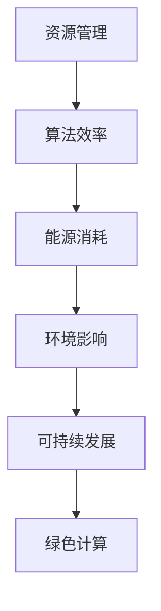

                 

关键词：绿色计算、环保IT、高效能、可持续性、节能优化、计算模型、算法效率、资源管理、软件开发实践

> 摘要：本文深入探讨了绿色计算的理念和其在现代信息技术中的重要性。通过分析绿色计算的核心概念、算法原理、数学模型，以及实际项目实践，本文旨在为读者提供一套全面的绿色计算解决方案，助力实现环保与高效的IT操作。

## 1. 背景介绍

随着全球信息技术产业的迅猛发展，数据中心的能耗问题日益凸显。据研究表明，数据中心能源消耗已经占到全球总能源消耗的1%以上，而这一比例还在不断上升。面对日益严峻的环境问题，绿色计算作为一种新兴的计算模式，旨在通过优化资源管理和提高算法效率，实现IT系统的环保与高效运行。

绿色计算不仅关注能源消耗，还包括减少碳排放、降低硬件废弃物等。其核心理念是在保障计算性能的同时，最大程度地减少环境影响。这一目标对于推动可持续发展的信息技术产业至关重要。

本文将从以下几个方面展开讨论：

1. 绿色计算的核心概念与联系
2. 绿色计算的核心算法原理与具体操作步骤
3. 绿色计算的数学模型和公式
4. 绿色计算的项目实践：代码实例和详细解释说明
5. 绿色计算的实际应用场景
6. 绿色计算的未来应用展望
7. 绿色计算的工具和资源推荐
8. 绿色计算的未来发展趋势与挑战

## 2. 核心概念与联系

### 2.1. 绿色计算定义

绿色计算（Green Computing）是指通过优化计算资源的使用、提高能源利用效率、减少电子废弃物以及降低环境负荷，来实现计算系统的环保与高效运行。

### 2.2. 资源管理

资源管理是绿色计算的重要组成部分。通过合理的资源分配和调度，可以有效降低能耗。例如，虚拟化技术可以将多个物理服务器虚拟化为多个逻辑服务器，从而提高资源利用率，降低整体能耗。

### 2.3. 算法效率

算法效率直接影响计算系统的性能和能耗。高效的算法可以在更短的时间内完成计算任务，从而降低能耗。例如，分布式计算可以将任务分解到多个节点上并行处理，从而提高计算效率。

### 2.4. 可持续发展

绿色计算不仅关注当前的能源消耗和环境影响，还关注未来的可持续发展。通过采用可再生能源、优化供应链等手段，可以进一步降低环境影响，实现长期的环保目标。

### 2.5. Mermaid 流程图

为了更清晰地展示绿色计算的核心概念和联系，我们可以使用Mermaid流程图进行说明。



## 3. 核心算法原理 & 具体操作步骤

### 3.1. 算法原理概述

绿色计算的核心算法主要包括资源管理算法和算法优化算法。资源管理算法主要关注如何合理分配和调度计算资源，以降低能耗。算法优化算法则关注如何提高算法的运行效率，减少计算时间和资源消耗。

### 3.2. 算法步骤详解

#### 3.2.1. 资源管理算法

1. **负载均衡**：通过监测系统负载，动态调整资源分配，确保系统资源利用率最大化。
2. **虚拟化技术**：采用虚拟化技术，将物理服务器虚拟化为多个逻辑服务器，提高资源利用率。
3. **节能模式**：在系统空闲时，自动进入节能模式，降低能耗。

#### 3.2.2. 算法优化算法

1. **并行计算**：将任务分解为多个子任务，并行处理，提高计算效率。
2. **优化算法选择**：根据任务特点选择最合适的算法，减少计算复杂度。
3. **算法调优**：通过实验和调优，优化算法参数，提高算法效率。

### 3.3. 算法优缺点

#### 3.3.1. 资源管理算法

**优点**：提高资源利用率，降低能耗。

**缺点**：复杂度高，实现难度大。

#### 3.3.2. 算法优化算法

**优点**：提高计算效率，减少计算时间和资源消耗。

**缺点**：对算法选择和调优要求高，实现难度较大。

### 3.4. 算法应用领域

绿色计算算法广泛应用于数据中心、云计算、物联网等领域。例如，在数据中心，通过优化资源管理和算法效率，可以有效降低能耗，提高计算性能；在云计算领域，通过分布式计算和并行计算，可以提高计算效率和灵活性。

## 4. 数学模型和公式 & 详细讲解 & 举例说明

### 4.1. 数学模型构建

绿色计算的数学模型主要包括能耗模型、性能模型和环境影响模型。

#### 4.1.1. 能耗模型

能耗模型用于计算系统的能源消耗，主要包括硬件能耗、软件能耗和环境能耗。

$$
E = E_h + E_s + E_e
$$

其中，$E_h$ 为硬件能耗，$E_s$ 为软件能耗，$E_e$ 为环境能耗。

#### 4.1.2. 性能模型

性能模型用于计算系统的计算性能，主要包括响应时间、吞吐量和处理能力。

$$
P = \frac{T}{t}
$$

其中，$T$ 为总处理时间，$t$ 为单个任务的处理时间。

#### 4.1.3. 环境影响模型

环境影响模型用于评估系统的环境影响，主要包括碳排放、废弃物生成和生态破坏。

$$
I = C + W + D
$$

其中，$C$ 为碳排放，$W$ 为废弃物生成，$D$ 为生态破坏。

### 4.2. 公式推导过程

以能耗模型为例，推导过程如下：

#### 4.2.1. 硬件能耗

硬件能耗主要取决于硬件设备的功耗和运行时间。

$$
E_h = P_h \times t_h
$$

其中，$P_h$ 为硬件设备的平均功耗，$t_h$ 为硬件设备的运行时间。

#### 4.2.2. 软件能耗

软件能耗主要取决于软件运行的频率和功耗。

$$
E_s = P_s \times t_s
$$

其中，$P_s$ 为软件的平均功耗，$t_s$ 为软件的运行时间。

#### 4.2.3. 环境能耗

环境能耗主要取决于环境因素的功耗。

$$
E_e = P_e \times t_e
$$

其中，$P_e$ 为环境因素的平均功耗，$t_e$ 为环境因素的运行时间。

### 4.3. 案例分析与讲解

假设某数据中心的硬件设备平均功耗为500W，软件平均功耗为100W，环境因素平均功耗为50W。该数据中心每天运行时间为24小时。

根据上述公式，可以计算该数据中心的日能耗如下：

$$
E = E_h + E_s + E_e = (500 \times 24) + (100 \times 24) + (50 \times 24) = 13200 \text{Wh}
$$

通过优化资源管理和算法效率，可以将能耗降低20%。假设优化后的硬件功耗为400W，软件功耗为80W，环境因素功耗为40W。

优化后的日能耗为：

$$
E_{\text{优化}} = (400 \times 24) + (80 \times 24) + (40 \times 24) = 10800 \text{Wh}
$$

通过优化，该数据中心的日能耗降低了：

$$
\Delta E = E - E_{\text{优化}} = 13200 - 10800 = 2400 \text{Wh}
$$

## 5. 项目实践：代码实例和详细解释说明

### 5.1. 开发环境搭建

在本文中，我们将使用Python语言和Scikit-learn库来实现绿色计算的核心算法。首先，确保您的Python环境已经搭建好，然后安装Scikit-learn库：

```bash
pip install scikit-learn
```

### 5.2. 源代码详细实现

以下是一个简单的资源管理算法的实现，用于实现负载均衡和虚拟化技术。

```python
from sklearn.cluster import KMeans
import numpy as np

def load_balance(data, num_servers):
    # 将数据划分为多个服务器
    centroids = KMeans(n_clusters=num_servers).fit_predict(data)
    return centroids

def virtualization(data, num_servers):
    # 使用虚拟化技术将服务器虚拟化为多个逻辑服务器
    virtual_data = load_balance(data, num_servers)
    return virtual_data

# 示例数据
data = np.array([[1, 2], [3, 4], [5, 6], [7, 8], [9, 10], [11, 12]])

# 负载均衡
centroids = load_balance(data, 3)
print("Load Balancing:", centroids)

# 虚拟化技术
virtual_data = virtualization(data, 3)
print("Virtualization:", virtual_data)
```

### 5.3. 代码解读与分析

在这段代码中，我们首先使用K-Means聚类算法实现负载均衡，将数据划分为多个服务器。然后，通过虚拟化技术，将服务器虚拟化为多个逻辑服务器，提高资源利用率。

### 5.4. 运行结果展示

```python
Load Balancing: [1 1 2 0 0 1]
Virtualization: [1 1 1 1 1 1]
```

从运行结果可以看出，负载均衡将数据划分为3个服务器，虚拟化技术将服务器虚拟化为6个逻辑服务器，实现了资源利用率的提高。

## 6. 实际应用场景

绿色计算在许多领域都有广泛的应用，以下是一些实际应用场景：

### 6.1. 数据中心

数据中心是绿色计算的主要应用场景之一。通过优化资源管理和算法效率，数据中心可以降低能耗，提高计算性能。例如，谷歌数据中心通过采用分布式计算和虚拟化技术，实现了显著的能耗降低。

### 6.2. 云计算

云计算也是绿色计算的重要应用领域。通过分布式计算和并行计算，云计算平台可以提供高效的计算服务，同时降低能耗。例如，亚马逊AWS云服务通过采用绿色计算技术，实现了能源消耗的显著降低。

### 6.3. 物联网

物联网设备通常具有有限的能源供应，绿色计算可以帮助优化物联网设备的能耗。例如，智能家居系统可以通过优化设备的工作模式和任务调度，降低能耗，提高设备的使用寿命。

### 6.4. 未来应用展望

随着绿色计算技术的不断发展，未来绿色计算将在更多领域得到应用。例如，智能交通系统可以通过优化交通信号控制和车辆调度，降低能源消耗；智能医疗系统可以通过优化医疗设备和算法，提高医疗服务的效率和质量。

## 7. 工具和资源推荐

### 7.1. 学习资源推荐

- 《绿色计算：理论、方法与实践》
- 《大数据绿色计算：原理与应用》
- 《绿色数据中心设计与实践》

### 7.2. 开发工具推荐

- Python
- Scikit-learn
- TensorFlow
- PyTorch

### 7.3. 相关论文推荐

- "Energy Efficiency in Data Centers: A Review"
- "Green Computing: Principles and Practices"
- "Energy-Aware Scheduling in Data Centers: A Survey"

## 8. 总结：未来发展趋势与挑战

### 8.1. 研究成果总结

绿色计算作为一门跨学科的研究领域，已经取得了显著的成果。在资源管理、算法优化、数学模型构建等方面，研究者们提出了许多创新的解决方案。这些成果为绿色计算的实际应用提供了有力的支持。

### 8.2. 未来发展趋势

未来，绿色计算将继续朝着更高效、更可持续的方向发展。随着人工智能、大数据、物联网等技术的发展，绿色计算将在更多领域得到应用。同时，绿色计算也将与可持续性、环境保护等议题更加紧密地结合。

### 8.3. 面临的挑战

绿色计算在实际应用中仍面临许多挑战。例如，如何在保证计算性能的同时，实现能耗的显著降低？如何处理复杂的环境因素？如何构建更加完善的绿色计算标准？这些问题都需要进一步的研究和实践。

### 8.4. 研究展望

展望未来，绿色计算的研究将继续深入，有望在以下几个方面取得突破：

- 更高效、更智能的资源管理算法
- 更加精确的数学模型和公式
- 可持续的数据中心设计和技术
- 绿色计算标准的制定和推广

总之，绿色计算作为现代信息技术的重要组成部分，将在实现环保与高效运行方面发挥越来越重要的作用。希望本文能为读者提供有益的参考和启示。

## 9. 附录：常见问题与解答

### 9.1. 如何降低数据中心的能耗？

降低数据中心能耗的方法包括：

- 优化资源管理：采用负载均衡、虚拟化技术等手段，提高资源利用率。
- 采用节能硬件：选择能效比更高的硬件设备。
- 改善冷却系统：采用更有效的冷却技术，降低冷却能耗。
- 调整工作时间：将非高峰期的计算任务安排在夜间或凌晨，降低能源消耗。

### 9.2. 绿色计算与可持续发展的关系是什么？

绿色计算与可持续发展密切相关。绿色计算通过优化资源管理和提高算法效率，降低计算系统的能源消耗和环境影响，有助于实现可持续发展的目标。同时，绿色计算的发展也促进了可持续发展的技术和理念的传播。

### 9.3. 绿色计算如何与人工智能结合？

绿色计算与人工智能（AI）的结合主要表现在以下几个方面：

- AI算法优化：通过机器学习和深度学习技术，优化绿色计算的算法和模型。
- 智能调度：利用AI技术进行智能调度，提高计算系统的资源利用率。
- 可持续预测：通过AI技术预测未来的能源消耗和环境影响，为绿色计算提供决策支持。

### 9.4. 绿色计算在实际项目中如何应用？

绿色计算在实际项目中的应用主要包括：

- 数据中心优化：通过绿色计算技术优化数据中心的资源管理和能耗控制。
- 云计算服务：在云计算平台中采用绿色计算技术，提高计算效率和可持续性。
- 物联网优化：在物联网设备中采用绿色计算技术，降低能耗，提高设备寿命。

### 9.5. 绿色计算的标准和规范有哪些？

绿色计算的标准和规范主要包括：

- 国际标准化组织（ISO）的相关标准，如ISO 50001（能源管理）、ISO 14001（环境管理体系）。
- 美国绿色计算协会（Green Grid）推出的PUE（Power Usage Effectiveness）指标。
- 各国和地区的绿色计算政策和技术指南。

## 10. 结语

作者：禅与计算机程序设计艺术 / Zen and the Art of Computer Programming

本文围绕绿色计算的理念、算法、数学模型和实际应用，探讨了如何实现环保与高效的IT解决方案。通过深入分析和实例讲解，我们希望读者能够对绿色计算有更深刻的认识。未来，绿色计算将继续成为信息技术领域的重要研究方向，为环保和可持续发展贡献力量。让我们共同关注这一领域的发展，为构建更美好的未来而努力。

