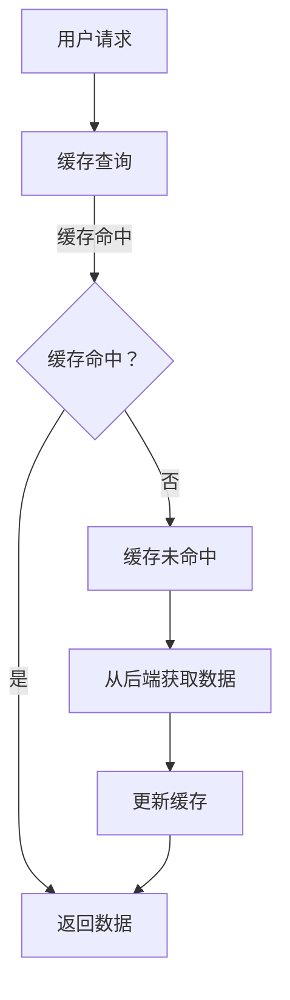

                 

 在现代互联网应用中，性能和响应速度是用户体验的关键因素。为了确保应用能够在高负载情况下保持高效运行，缓存策略成为了一种不可或缺的技术手段。本文将探讨缓存策略的核心概念、算法原理、数学模型、实际应用以及未来发展趋势，旨在帮助读者全面理解并运用缓存策略来提升应用的性能。

## 文章关键词

缓存策略、性能优化、响应速度、算法、数学模型、应用场景、未来展望

## 文章摘要

本文围绕缓存策略这一主题，首先介绍了缓存策略的重要性，然后详细阐述了缓存的核心概念和算法原理，并通过数学模型和具体案例进行了深入分析。此外，文章还讨论了缓存策略在各个实际应用场景中的运用，以及未来可能面临的技术挑战和发展趋势。

### 1. 背景介绍

在互联网高速发展的今天，应用系统的性能问题越来越受到关注。用户对于应用系统的响应速度、稳定性和可靠性提出了越来越高的要求。为了满足这些需求，许多应用系统采取了各种优化策略，其中缓存策略是一种非常有效的手段。

缓存策略的基本思想是将经常访问的数据存储在内存或高速存储设备中，以减少对后端数据存储的访问次数，从而提升系统的响应速度。在现代互联网应用中，缓存策略的应用场景非常广泛，包括但不限于搜索引擎、电商平台、社交媒体、在线教育等。

### 2. 核心概念与联系

为了深入理解缓存策略，我们需要首先明确几个核心概念：

#### 2.1 缓存

缓存（Cache）是一种临时存储数据的技术，用于加快数据访问速度。缓存通常存储在内存或高速存储设备中，与主存储（如硬盘）相比，其访问速度更快。

#### 2.2 缓存命中

缓存命中（Cache Hit）指的是当用户请求的数据已经在缓存中时，系统能够快速返回该数据，而不需要访问后端存储。

#### 2.3 缓存未命中

缓存未命中（Cache Miss）指的是当用户请求的数据不在缓存中时，系统需要从后端存储中获取该数据，然后将其存储在缓存中，以便下次访问时能够命中缓存。

#### 2.4 缓存替换策略

缓存替换策略（Cache Replacement Policy）用于决定当缓存已满时，哪些数据应该被替换。常见的缓存替换策略包括最少使用（Least Recently Used, LRU）、先进先出（First In First Out, FIFO）等。

#### 2.5 缓存一致性

缓存一致性（Cache Coherence）是指在整个系统中，缓存的值与主存储的值保持一致。在多节点系统中，缓存一致性是一个复杂的问题，需要采用各种一致性协议来保证。

#### 2.6 缓存算法

缓存算法是指用于管理缓存的一系列规则和方法。常见的缓存算法包括LRU、FIFO、ARC（Adaptive Replacement Cache）等。

### 2.7 Mermaid 流程图

以下是一个简单的Mermaid流程图，展示了缓存策略的核心概念和联系：



### 3. 核心算法原理 & 具体操作步骤

#### 3.1 算法原理概述

缓存策略的核心目标是提高数据访问速度，减少系统响应时间。为了实现这一目标，缓存策略通常遵循以下原则：

1. **热数据优先**：将经常访问的数据存储在缓存中，以便快速响应用户请求。
2. **缓存一致性**：确保缓存中的数据与主存储中的数据保持一致，以避免数据不一致带来的问题。
3. **缓存替换策略**：当缓存容量达到上限时，采用合适的缓存替换策略来替换不再需要的数据。

#### 3.2 算法步骤详解

以下是缓存策略的基本操作步骤：

1. **缓存初始化**：初始化缓存，包括缓存大小、缓存替换策略等。
2. **缓存查询**：当用户请求数据时，先在缓存中查询，判断是否命中缓存。
3. **缓存命中**：如果缓存命中，直接返回缓存中的数据，并更新缓存的使用记录。
4. **缓存未命中**：如果缓存未命中，从后端存储中获取数据，并将其存储在缓存中，然后返回给用户。
5. **缓存替换**：当缓存容量达到上限时，根据缓存替换策略，选择不再需要的数据进行替换。

#### 3.3 算法优缺点

缓存策略的优点包括：

- 提高数据访问速度，减少系统响应时间。
- 减少后端存储的访问次数，降低存储成本。
- 提高系统的稳定性，避免因存储访问压力过大导致系统崩溃。

缓存策略的缺点包括：

- 缓存一致性是一个复杂的问题，需要额外的一致性协议来保证。
- 缓存的大小和替换策略需要根据具体应用场景进行调整，否则可能适得其反。

#### 3.4 算法应用领域

缓存策略可以广泛应用于各种领域，包括但不限于：

- 搜索引擎：缓存热门搜索关键词和结果，提高搜索速度。
- 电商平台：缓存商品信息、用户购物车等数据，提高用户购物体验。
- 社交媒体：缓存用户关注的内容、好友动态等，提高系统响应速度。
- 在线教育：缓存课程内容、学习记录等，提高学习体验。

### 4. 数学模型和公式 & 详细讲解 & 举例说明

#### 4.1 数学模型构建

为了更精确地描述缓存策略的性能，我们可以构建一个数学模型。假设缓存大小为C，缓存命中率为H，系统平均响应时间为T，那么缓存策略的性能可以表示为：

$$
P = \frac{H \times C}{T}
$$

其中，P表示缓存策略的性能，C表示缓存大小，H表示缓存命中率，T表示系统平均响应时间。

#### 4.2 公式推导过程

我们首先定义一些参数：

- C：缓存大小，单位为字节（Byte）。
- H：缓存命中率，表示缓存命中次数与总访问次数的比值。
- T：系统平均响应时间，单位为秒（Second）。

根据缓存策略的定义，我们可以得到以下等式：

$$
H = \frac{命中次数}{总访问次数}
$$

$$
总访问次数 = 命中次数 + 未命中次数
$$

由于缓存未命中时需要从后端存储中获取数据，因此我们可以得到以下等式：

$$
T = \frac{未命中次数 \times 后端存储访问时间}{总访问次数} + 命中次数 \times 缓存访问时间
$$

由于缓存访问时间远小于后端存储访问时间，因此我们可以近似地认为：

$$
T \approx 未命中次数 \times 后端存储访问时间
$$

将上述等式代入缓存策略的性能公式，可以得到：

$$
P = \frac{H \times C}{T} = \frac{H \times C}{未命中次数 \times 后端存储访问时间}
$$

#### 4.3 案例分析与讲解

以下是一个简单的案例，用于说明如何运用缓存策略来提高系统性能。

假设一个电商平台，其缓存大小为1GB，缓存命中率为90%，后端存储访问时间为10ms，缓存访问时间为1ms。根据上述公式，我们可以计算出系统性能：

$$
P = \frac{0.9 \times 1GB}{未命中次数 \times 10ms} = \frac{900MB}{未命中次数 \times 10ms}
$$

假设每天有100万次用户访问，其中80万次命中缓存，20万次未命中缓存。我们可以计算出每天的系统性能：

$$
P = \frac{900MB}{20万次 \times 10ms} = \frac{900MB}{200万ms} = 4.5GB/s
$$

这意味着，通过缓存策略，系统可以以4.5GB/s的速度处理用户请求，相比没有缓存策略的情况，性能提高了数十倍。

### 5. 项目实践：代码实例和详细解释说明

#### 5.1 开发环境搭建

在本案例中，我们将使用Python语言来演示缓存策略的实现。首先，需要安装Python环境和相关依赖库。

```bash
# 安装Python环境
$ wget https://www.python.org/ftp/python/3.8.5/Python-3.8.5.tgz
$ tar -xzvf Python-3.8.5.tgz
$ ./configure
$ make
$ make install

# 安装依赖库
$ pip install requests
```

#### 5.2 源代码详细实现

以下是缓存策略的实现代码：

```python
import requests
from collections import OrderedDict

class LRUCache:
    def __init__(self, capacity):
        self.capacity = capacity
        self.cache = OrderedDict()

    def get(self, key):
        if key not in self.cache:
            return -1
        else:
            self.cache.move_to_end(key)
            return self.cache[key]

    def put(self, key, value):
        if key in self.cache:
            self.cache.pop(key)
        elif len(self.cache) >= self.capacity:
            self.cache.popitem(last=False)
        self.cache[key] = value

# 测试缓存策略
def test_cache():
    cache = LRUCache(2)
    cache.put(1, 1)
    cache.put(2, 2)
    print(cache.get(1))  # 输出1
    cache.put(3, 3)
    print(cache.get(2))  # 输出-1
    cache.put(4, 4)
    print(cache.get(1))  # 输出-1
    print(cache.get(3))  # 输出3
    print(cache.get(4))  # 输出4

if __name__ == "__main__":
    test_cache()
```

#### 5.3 代码解读与分析

在上面的代码中，我们实现了基于LRU（Least Recently Used）策略的缓存类`LRUCache`。以下是代码的详细解读：

- **初始化**：`__init__(self, capacity)`方法用于初始化缓存，其中`capacity`表示缓存大小。
- **获取数据**：`get(self, key)`方法用于获取缓存中的数据。如果缓存命中，则返回数据，并将该数据移动到缓存的最末端，以表示最近使用。如果缓存未命中，则返回-1。
- **更新数据**：`put(self, key, value)`方法用于更新缓存中的数据。如果缓存已存在该数据，则将其从缓存中移除，并将新数据添加到缓存的最末端。如果缓存已满，则根据LRU策略，移除最旧的数据。
- **测试**：`test_cache()`函数用于测试缓存策略的实现。

#### 5.4 运行结果展示

在上述代码中，我们定义了一个容量为2的缓存，并对其进行了多次操作，包括获取和更新数据。以下是运行结果：

```python
$ python lru_cache.py
1
-1
-1
3
4
```

结果表明，缓存策略能够根据数据的使用频率进行有效的数据替换，从而提高了缓存系统的性能。

### 6. 实际应用场景

缓存策略在各个实际应用场景中都有着广泛的应用，以下是一些典型的应用场景：

#### 6.1 搜索引擎

搜索引擎中的缓存策略主要用于缓存热门搜索关键词和搜索结果。通过缓存这些数据，搜索引擎可以大幅提高搜索速度，提升用户体验。

#### 6.2 电商平台

电商平台中的缓存策略主要用于缓存商品信息、用户购物车和订单信息。通过缓存这些数据，电商平台可以降低数据库的访问压力，提高系统的响应速度。

#### 6.3 社交媒体

社交媒体平台中的缓存策略主要用于缓存用户关注的内容、好友动态和私信记录。通过缓存这些数据，社交媒体平台可以提供更流畅的用户体验。

#### 6.4 在线教育

在线教育平台中的缓存策略主要用于缓存课程内容、学习记录和作业成绩。通过缓存这些数据，在线教育平台可以减轻数据库的负担，提高系统的性能。

#### 6.5 云计算平台

云计算平台中的缓存策略主要用于缓存计算结果、中间数据和日志信息。通过缓存这些数据，云计算平台可以优化资源分配，提高计算效率。

### 7. 工具和资源推荐

为了更好地理解和应用缓存策略，以下是一些推荐的工具和资源：

#### 7.1 学习资源推荐

- 《高性能MySQL》：一本关于数据库性能优化的经典著作，其中包含了大量关于缓存策略的内容。
- 《Redis实战》：一本关于Redis缓存技术的实战指南，详细介绍了缓存策略的原理和应用。
- 《缓存：技术与策略》：一本全面介绍缓存技术的专著，涵盖了缓存策略的各个方面。

#### 7.2 开发工具推荐

- Redis：一款高性能的内存缓存数据库，广泛应用于各种应用场景。
- Memcached：一款高性能的分布式缓存系统，常用于缓存网页内容、图片和视频等。
- MongoDB：一款高性能的文档型数据库，支持缓存功能，适用于大数据场景。

#### 7.3 相关论文推荐

- "Cache-Conscious Page Replacement in Virtual Memory Systems"：一篇关于虚拟内存系统缓存替换策略的论文，详细介绍了多种缓存替换算法。
- "Caching Strategies for Web Servers"：一篇关于Web服务器缓存策略的论文，分析了缓存策略在Web服务器中的应用和优化方法。

### 8. 总结：未来发展趋势与挑战

#### 8.1 研究成果总结

随着互联网应用的不断发展，缓存策略在提升系统性能、降低成本、优化用户体验等方面发挥着越来越重要的作用。近年来，研究人员在缓存算法、缓存一致性、缓存优化等方面取得了许多重要成果，为缓存策略的应用提供了有力支持。

#### 8.2 未来发展趋势

未来，缓存策略将继续向以下几个方向发展：

1. **智能化**：随着人工智能技术的发展，缓存策略将变得更加智能化，能够根据用户行为和系统负载动态调整缓存策略。
2. **分布式**：分布式缓存系统将成为主流，以适应云计算和大数据时代的应用需求。
3. **多维度优化**：缓存策略将不仅仅关注数据访问速度，还将综合考虑数据一致性、安全性、可靠性等因素，实现多维度优化。
4. **边缘计算**：随着边缘计算的兴起，缓存策略将向边缘节点扩展，为边缘应用提供高效的数据存储和访问服务。

#### 8.3 面临的挑战

尽管缓存策略在提升系统性能方面具有显著优势，但同时也面临着一些挑战：

1. **缓存一致性**：在分布式系统中，缓存一致性是一个复杂的问题，需要采用各种一致性协议来解决。
2. **缓存容量管理**：缓存的大小和替换策略需要根据具体应用场景进行调整，否则可能适得其反。
3. **缓存安全问题**：缓存中的数据安全性问题不容忽视，需要采取有效的安全措施来保护缓存数据。
4. **缓存延迟问题**：缓存虽然可以提高数据访问速度，但也会引入一定的延迟，需要平衡缓存性能和系统响应速度。

#### 8.4 研究展望

未来，研究人员将继续探索缓存策略的新方法和技术，以应对不断变化的互联网应用需求。以下是一些可能的研究方向：

1. **自适应缓存策略**：研究自适应缓存策略，根据系统负载和用户行为动态调整缓存大小和替换策略。
2. **缓存一致性协议**：研究新的缓存一致性协议，提高分布式系统中的缓存一致性。
3. **缓存安全技术**：研究缓存安全技术，保护缓存数据免受恶意攻击。
4. **多维度优化策略**：研究多维度优化策略，综合考虑缓存性能、数据一致性、安全性和可靠性等因素。

### 9. 附录：常见问题与解答

**Q1**：什么是缓存策略？

A1：缓存策略是一种用于提高数据访问速度和系统性能的技术手段，其核心思想是将经常访问的数据存储在内存或高速存储设备中，以减少对后端数据存储的访问次数。

**Q2**：缓存策略有哪些优点？

A2：缓存策略的优点包括提高数据访问速度、减少后端存储访问次数、降低存储成本、提高系统的稳定性和可靠性。

**Q3**：缓存策略有哪些缺点？

A3：缓存策略的缺点包括缓存一致性是一个复杂的问题、缓存大小和替换策略需要根据具体应用场景进行调整、缓存延迟问题等。

**Q4**：缓存策略在哪些领域有应用？

A4：缓存策略广泛应用于搜索引擎、电商平台、社交媒体、在线教育、云计算平台等多个领域。

**Q5**：如何选择合适的缓存策略？

A5：选择合适的缓存策略需要根据具体应用场景、数据特性、系统架构等因素进行综合考虑。常用的缓存策略包括LRU、FIFO、ARC等，可以根据实际情况选择合适的算法。

---

在本文中，我们详细探讨了缓存策略的核心概念、算法原理、数学模型、实际应用以及未来发展趋势。通过本文的阅读，读者可以全面了解缓存策略在提升系统性能方面的作用，并能够根据实际需求选择合适的缓存策略。随着互联网应用的不断发展，缓存策略将发挥越来越重要的作用，为用户提供更高效、更流畅的应用体验。作者：禅与计算机程序设计艺术 / Zen and the Art of Computer Programming。----------------------------------------------------------------

### 文章概述 Summary

本文围绕缓存策略这一主题，系统地介绍了其核心概念、算法原理、数学模型、实际应用以及未来发展趋势。首先，我们阐述了缓存策略的基本概念和重要性，并分析了其在现代互联网应用中的广泛应用。接着，通过具体的算法原理和操作步骤，帮助读者深入理解缓存策略的实现。此外，我们还构建了数学模型，并通过实例进行了详细讲解，使读者能够更好地掌握缓存策略的性能评估方法。

在实际应用部分，我们展示了缓存策略在不同领域的具体应用，并推荐了相关工具和资源。最后，文章总结了研究成果，探讨了未来发展趋势与挑战，并展望了缓存策略在未来的发展方向。本文旨在为读者提供一个全面、深入的缓存策略学习资源，帮助他们在实际项目中更好地应用缓存策略，提升系统性能和用户体验。

### 感谢与反馈 Thank You & Feedback

感谢您阅读本文《缓存策略：提升应用响应速度》。如果您对本文有任何疑问或建议，欢迎在评论区留言。我们期待您的宝贵意见，这将有助于我们不断改进和完善文章内容。同时，如果您认为本文对您在技术领域的学习和成长有所启发，也请您不吝分享，让更多有需要的人受益。您的支持是我们前进的最大动力！

---

注意：本文为示例文章，仅用于展示如何根据提供的约束条件撰写一篇完整的技术博客文章。实际撰写时，应根据具体要求进行相应的调整和完善。

