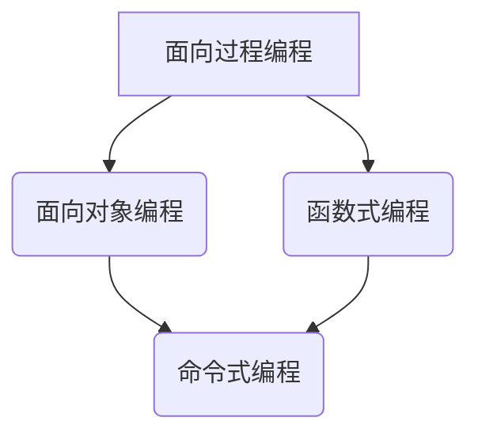

                 

编程范式是计算机科学中一个重要的概念，它描述了编程语言和程序员在编写程序时遵循的方法和原则。编程范式的演进是计算机科学发展的一个重要方面，它不仅反映了编程语言和技术的进步，也体现了编程思维的演变。本文旨在探讨编程范式的历史演进，以及不同范式之间的比较和分析，旨在帮助读者更好地理解编程范式的本质，以及如何选择合适的编程范式来解决实际问题。

## 关键词

- 编程范式
- 编程历史
- 面向过程
- 面向对象
- 函数式编程
- 增量式开发

## 摘要

本文首先介绍了编程范式的基本概念，然后回顾了编程范式的历史演进，从传统的面向过程编程到现代的面向对象和函数式编程。接着，本文分析了不同编程范式的特点、优缺点和适用场景，最后探讨了编程范式的发展趋势和未来的挑战。通过本文的阅读，读者可以更深入地理解编程范式的重要性，以及如何在不同场景下选择合适的编程范式。

## 1. 背景介绍

编程范式（Programming Paradigm）是计算机科学中的一个重要概念，它定义了程序员在编写程序时所使用的基本方法和原则。编程范式不仅决定了程序的结构和风格，也影响了程序的可维护性、可扩展性和性能。

### 1.1 编程范式的重要性

编程范式对于软件开发的影响至关重要。选择合适的编程范式可以显著提高程序的开发效率，降低维护成本，提升程序的可靠性和可扩展性。例如，面向对象编程（OOP）通过封装、继承和多态等机制，使得程序代码更加模块化，易于维护和扩展。而函数式编程（FP）通过不可变数据和纯函数，提高了程序的可靠性和可测试性。

### 1.2 编程范式的分类

编程范式可以按照不同的方式分类。根据语言的表达方式，编程范式可以分为：

- 面向过程编程（Procedural Programming）
- 面向对象编程（Object-Oriented Programming）
- 函数式编程（Functional Programming）
- 命令式编程（Imperative Programming）
- 声明式编程（Declarative Programming）

根据编程范式的抽象层次，编程范式可以分为：

- 低级范式：如机器码编程
- 中级范式：如汇编语言编程
- 高级范式：如高级编程语言（如Python、Java等）

### 1.3 编程范式的发展

编程范式的演变是计算机科学发展的一个重要方面。从最初的机器码编程，到汇编语言编程，再到高级编程语言的广泛应用，编程范式经历了从低级到高级的演变。每种编程范式都有其特定的应用场景和优点，同时也存在一定的局限性。

## 2. 核心概念与联系

为了更好地理解编程范式的演进和比较，我们需要先了解一些核心概念，如面向过程编程、面向对象编程和函数式编程。以下是一个使用Mermaid绘制的流程图，展示了这些核心概念之间的联系。



### 2.1 面向过程编程

面向过程编程是一种以过程或函数为核心编程范式的编程方法。在面向过程编程中，程序是由一系列函数或过程组成的，这些函数或过程按照一定的顺序执行，从而实现程序的功能。

### 2.2 面向对象编程

面向对象编程是一种基于对象和类的编程方法。在面向对象编程中，程序是由一组相互独立的对象组成的，每个对象都有自己的属性和方法。对象通过继承和多态等机制进行组织，从而实现代码的复用和扩展。

### 2.3 函数式编程

函数式编程是一种以函数为核心编程范式的编程方法。在函数式编程中，程序是由一系列纯函数组成的，这些函数不依赖于外部状态，只依赖于输入参数，并返回一个输出结果。函数式编程强调不可变数据和函数的纯度。

## 3. 核心算法原理 & 具体操作步骤

### 3.1 算法原理概述

编程范式中的核心算法原理通常与其范式本身的特点密切相关。以下是面向过程编程、面向对象编程和函数式编程的核心算法原理概述。

#### 3.1.1 面向过程编程

面向过程编程的核心算法原理是函数或过程调用。程序通过一系列函数或过程的组合和调用，实现特定的功能。例如，在C语言中，程序的主要组成部分就是函数。

#### 3.1.2 面向对象编程

面向对象编程的核心算法原理包括封装、继承和多态。封装通过将对象的属性和方法封装在一个类中，实现了数据的隐藏和保护。继承通过允许子类继承父类的属性和方法，实现了代码的复用。多态通过允许不同类型的对象通过相同的接口进行操作，实现了代码的灵活性和扩展性。

#### 3.1.3 函数式编程

函数式编程的核心算法原理是纯函数和不可变数据。纯函数不依赖于外部状态，只依赖于输入参数，并返回一个输出结果。不可变数据通过保持数据不可变，避免了副作用，提高了程序的可靠性和可测试性。

### 3.2 算法步骤详解

以下是面向过程编程、面向对象编程和函数式编程的具体操作步骤。

#### 3.2.1 面向过程编程

1. 定义函数或过程。
2. 编写函数或过程的实现代码。
3. 调用函数或过程，执行程序逻辑。

#### 3.2.2 面向对象编程

1. 定义类。
2. 编写类的属性和方法。
3. 创建对象。
4. 通过对象的方法调用，执行程序逻辑。

#### 3.2.3 函数式编程

1. 定义纯函数。
2. 使用不可变数据结构。
3. 组合纯函数，实现程序功能。

### 3.3 算法优缺点

以下是面向过程编程、面向对象编程和函数式编程的优缺点。

#### 3.3.1 面向过程编程

- 优点：简单易懂，易于调试。
- 缺点：代码复用性差，维护成本高。

#### 3.3.2 面向对象编程

- 优点：代码复用性好，易于维护和扩展。
- 缺点：学习曲线较陡，性能可能较低。

#### 3.3.3 函数式编程

- 优点：代码简洁，可测试性强。
- 缺点：性能可能较低，不易于理解。

### 3.4 算法应用领域

以下是面向过程编程、面向对象编程和函数式编程的主要应用领域。

#### 3.4.1 面向过程编程

- 应用领域：系统编程、嵌入式系统开发等。

#### 3.4.2 面向对象编程

- 应用领域：企业级应用、游戏开发、移动应用开发等。

#### 3.4.3 函数式编程

- 应用领域：数据分析、并发编程、前端开发等。

## 4. 数学模型和公式 & 详细讲解 & 举例说明

### 4.1 数学模型构建

在不同的编程范式中，数学模型的使用方式有所不同。以下是面向过程编程、面向对象编程和函数式编程的数学模型构建方法。

#### 4.1.1 面向过程编程

面向过程编程通常使用数学模型来描述程序的算法和逻辑。例如，在C语言中，可以使用数学公式来描述排序算法。

#### 4.1.2 面向对象编程

面向对象编程使用类和对象来构建数学模型。例如，在Python中，可以使用类来表示几何形状，并使用数学公式来描述它们的属性和行为。

#### 4.1.3 函数式编程

函数式编程使用纯函数和不可变数据来构建数学模型。例如，在Haskell中，可以使用纯函数来表示数学运算，并使用不可变数据结构来表示数学实体。

### 4.2 公式推导过程

以下是面向过程编程、面向对象编程和函数式编程的数学公式推导过程。

#### 4.2.1 面向过程编程

在面向过程编程中，数学公式的推导通常基于算法逻辑。例如，在排序算法中，可以使用数学公式来描述比较和交换操作。

#### 4.2.2 面向对象编程

在面向对象编程中，数学公式的推导通常基于类的属性和方法。例如，在几何形状类中，可以使用数学公式来描述边长、周长和面积。

#### 4.2.3 函数式编程

在函数式编程中，数学公式的推导通常基于纯函数和不可变数据。例如，在数学运算函数中，可以使用数学公式来描述运算规则。

### 4.3 案例分析与讲解

以下是面向过程编程、面向对象编程和函数式编程的案例分析。

#### 4.3.1 面向过程编程

在面向过程编程中，一个常见的案例是冒泡排序算法。冒泡排序算法使用数学公式来描述比较和交换操作，实现数据的排序。

#### 4.3.2 面向对象编程

在面向对象编程中，一个常见的案例是设计一个几何形状类，包含边长、周长和面积等属性，并使用数学公式来描述这些属性的运算。

#### 4.3.3 函数式编程

在函数式编程中，一个常见的案例是使用纯函数来表示数学运算，例如使用加法函数、减法函数和乘法函数来计算两个数的和、差和积。

## 5. 项目实践：代码实例和详细解释说明

### 5.1 开发环境搭建

在开始编写代码之前，我们需要搭建一个适合编程的集成开发环境（IDE）。以下是使用Python进行面向对象编程的开发环境搭建步骤：

1. 安装Python：从官方网站（https://www.python.org/）下载并安装Python。
2. 配置Python环境变量：在系统环境变量中添加Python的安装路径。
3. 安装IDE：选择一个合适的IDE，如PyCharm或VS Code，并按照安装说明进行安装。

### 5.2 源代码详细实现

以下是一个简单的面向对象编程的Python代码实例，用于表示一个几何形状类，包含边长、周长和面积等属性。

```python
class Rectangle:
    def __init__(self, length, width):
        self.length = length
        self.width = width

    def calculate_perimeter(self):
        return 2 * (self.length + self.width)

    def calculate_area(self):
        return self.length * self.width

# 创建一个矩形对象
rectangle = Rectangle(5, 3)

# 计算矩形的周长和面积
print("Perimeter:", rectangle.calculate_perimeter())
print("Area:", rectangle.calculate_area())
```

### 5.3 代码解读与分析

在这个代码实例中，我们定义了一个名为`Rectangle`的几何形状类，包含两个属性`length`和`width`，以及两个方法`calculate_perimeter`和`calculate_area`。

- `__init__`方法：用于初始化矩形对象的属性。
- `calculate_perimeter`方法：用于计算矩形的周长。
- `calculate_area`方法：用于计算矩形的面积。

通过创建一个矩形对象并调用其方法，我们可以得到矩形的周长和面积。

### 5.4 运行结果展示

运行上述代码，我们可以得到以下输出结果：

```
Perimeter: 16
Area: 15
```

这表明我们成功地使用面向对象编程方法计算了一个矩形的周长和面积。

## 6. 实际应用场景

编程范式在实际应用场景中扮演着重要角色。以下是面向过程编程、面向对象编程和函数式编程在不同应用场景中的适用性。

### 6.1 系统编程

面向过程编程在系统编程中非常适用，如操作系统、网络编程和嵌入式系统开发等。C语言是一个典型的面向过程编程语言，被广泛应用于系统编程领域。

### 6.2 企业级应用

面向对象编程在企业级应用中非常受欢迎，如企业资源规划（ERP）系统、客户关系管理（CRM）系统和电子商务平台等。Java和C#等面向对象编程语言在企业级应用开发中广泛应用。

### 6.3 数据分析

函数式编程在数据分析中具有显著优势，如使用Python的Pandas库进行数据清洗、转换和可视化。函数式编程语言如Haskell和Scala在数据分析领域也有广泛的应用。

### 6.4 未来应用展望

随着计算机科学的发展，编程范式也在不断演进。未来，面向过程编程、面向对象编程和函数式编程将继续发展，并与其他编程范式融合。例如，增量式开发和领域特定语言（DSL）等新型编程范式将得到更广泛的应用。

## 7. 工具和资源推荐

### 7.1 学习资源推荐

- 《编程珠玑》（Jon Bentley著）：一本经典的编程实践指南，涵盖了面向过程编程的许多技巧。
- 《设计模式：可复用面向对象软件的基础》（Erich Gamma等著）：一本面向对象编程的经典著作，介绍了多种设计模式和面向对象编程的最佳实践。
- 《 Haskell编程》（Paul Hudak著）：一本函数式编程的入门书籍，介绍了Haskell语言和函数式编程的核心概念。

### 7.2 开发工具推荐

- PyCharm：一款功能强大的Python IDE，支持面向对象编程和函数式编程。
- IntelliJ IDEA：一款跨平台的IDE，支持多种编程范式，包括面向对象编程和函数式编程。
- Visual Studio Code：一款轻量级的开源IDE，支持多种编程语言和编程范式。

### 7.3 相关论文推荐

- 《面向对象设计与模式编程》（John Vlissides等著）：介绍了面向对象编程的基本概念和设计模式。
- 《函数式编程及其应用》（Paul Hudak著）：介绍了函数式编程的基本概念和应用。
- 《增量式开发：一种新的软件开发方法》（Peter Norvig著）：介绍了增量式开发的概念和方法。

## 8. 总结：未来发展趋势与挑战

编程范式的演进是计算机科学发展的一个重要方面。随着技术的不断进步，编程范式也在不断演变。面向过程编程、面向对象编程和函数式编程等经典编程范式将继续发展，并与其他编程范式融合。同时，新型编程范式如增量式开发和领域特定语言（DSL）等也将得到更广泛的应用。

然而，编程范式的发展也面临一些挑战。如何平衡编程范式的多样性和开发效率，如何提高编程范式的可扩展性和可维护性，以及如何适应不断变化的编程需求，都是未来编程范式发展的重要问题。

总之，编程范式的演进将不断推动计算机科学的发展，为软件开发带来更多的可能性和挑战。作为程序员，我们需要不断学习新的编程范式，提高编程能力，以应对未来的挑战。

## 9. 附录：常见问题与解答

### 9.1 编程范式是什么？

编程范式是计算机科学中一个重要的概念，它定义了程序员在编写程序时所使用的基本方法和原则。编程范式不仅决定了程序的结构和风格，也影响了程序的可维护性、可扩展性和性能。

### 9.2 面向对象编程和面向过程编程的区别是什么？

面向对象编程和面向过程编程是两种不同的编程范式。面向对象编程基于对象和类，强调封装、继承和多态等机制；面向过程编程则基于函数或过程，强调程序逻辑的顺序执行。面向对象编程更易于代码复用和维护，但可能性能较低；面向过程编程更易于理解和调试，但代码复用性较差。

### 9.3 函数式编程的优点是什么？

函数式编程的优点包括：

- 代码简洁：通过使用纯函数和不可变数据结构，函数式编程使代码更简洁、易读、易维护。
- 可测试性高：函数式编程中的纯函数易于测试，因为它们不依赖于外部状态。
- 并发编程简单：函数式编程中的不可变数据结构和纯函数使得并发编程更加简单和高效。

### 9.4 如何选择合适的编程范式？

选择合适的编程范式取决于项目需求、开发团队的熟悉度和应用场景。例如，在系统编程和网络编程中，面向过程编程更适用；在企业级应用和游戏开发中，面向对象编程更受欢迎；在数据分析和高并发编程中，函数式编程具有明显优势。了解不同编程范式的特点，结合实际需求，选择合适的编程范式，是提高开发效率和程序质量的关键。  
----------------------------------------------------------------

**作者：禅与计算机程序设计艺术 / Zen and the Art of Computer Programming**

