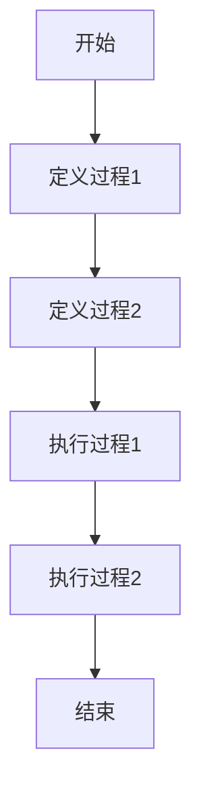
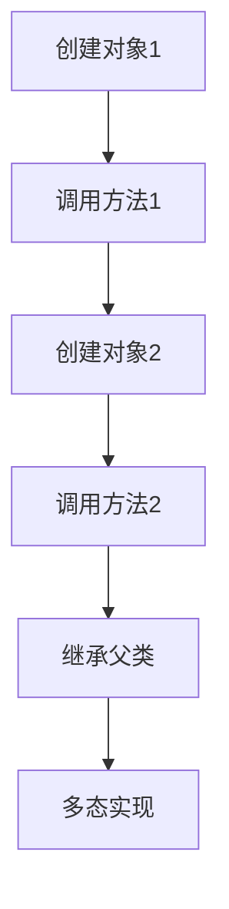
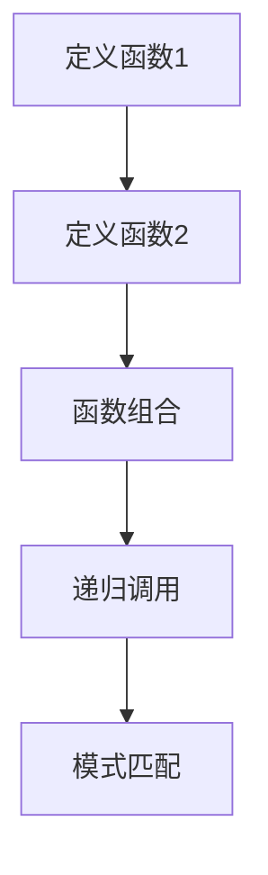
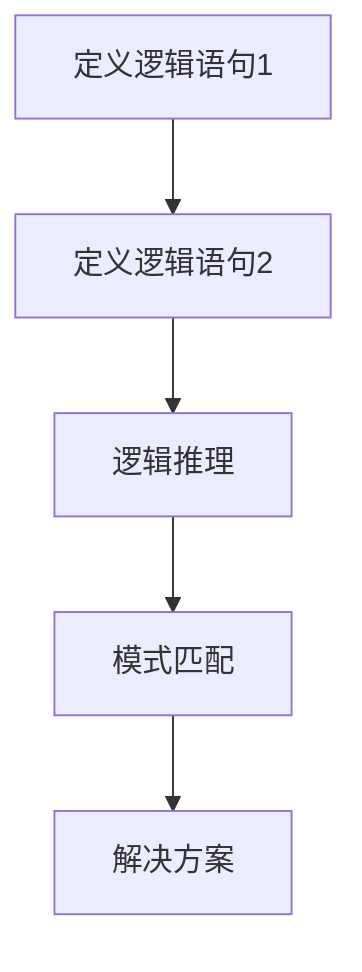
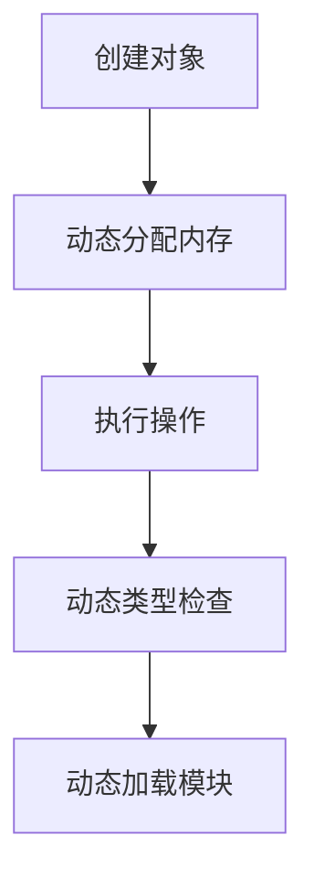
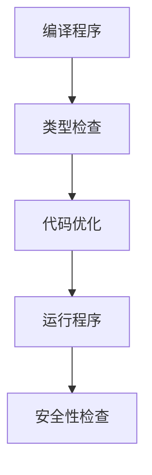

                 

关键词：编程范式、历史演进、比较分析、面向过程、面向对象、函数式编程、逻辑编程、动态编程、静态编程、编程语言、抽象、封装、继承、多态、编程风格、开发效率、性能优化、软件复用、代码可维护性、代码可扩展性

> 摘要：本文将从历史的角度，深入探讨编程范式的演进过程，分析不同编程范式的基本概念、特点以及应用场景。通过对面向过程、面向对象、函数式编程、逻辑编程等编程范式的详细比较，揭示它们在抽象、封装、继承、多态等方面的异同。此外，本文还将讨论编程范式的选择对开发效率、性能优化、代码可维护性和可扩展性的影响，并展望未来的发展趋势和面临的挑战。

## 1. 背景介绍

编程范式是指编程语言的抽象模型和设计风格，它指导程序员如何思考和编写程序。编程范式的选择不仅影响程序的结构和性能，还直接影响开发效率、代码可维护性和可扩展性。从最初的机器语言到高级编程语言，编程范式经历了从低级到高级的演进，从单一的结构化编程到多样化的编程范式，程序员们为了解决不同的编程问题和满足多样化的编程需求，不断地探索和创造新的编程范式。

本文将介绍以下编程范式：

- **面向过程编程**：一种以过程或函数为中心的编程范式，主要通过过程或函数来组织代码。
- **面向对象编程**：一种以对象为中心的编程范式，通过封装、继承和多态等机制来组织代码。
- **函数式编程**：一种以函数为中心的编程范式，通过函数组合和状态不可变来组织代码。
- **逻辑编程**：一种以逻辑表达式为中心的编程范式，通过逻辑推理来组织代码。
- **动态编程**：一种在运行时确定类型和变量的编程范式，具有高灵活性和动态性。
- **静态编程**：一种在编译时确定类型和变量的编程范式，具有较高的运行效率和安全性。

通过比较这些编程范式的基本概念、特点和应用场景，本文旨在帮助程序员更好地理解和选择适合自己项目的编程范式，以提高开发效率和代码质量。

## 2. 核心概念与联系

### 2.1 面向过程编程

面向过程编程（Procedural Programming）是最早的编程范式之一，它以过程或函数为中心。在面向过程编程中，程序由一系列过程（或函数）组成，每个过程执行特定的任务，并通过调用其他过程来实现复杂的任务。面向过程编程的主要特点是模块化和代码重用，它通过将程序分解为独立的过程来提高代码的可维护性和可扩展性。

#### Mermaid 流程图：



### 2.2 面向对象编程

面向对象编程（Object-Oriented Programming，OOP）是一种以对象为中心的编程范式。在面向对象编程中，程序由对象组成，每个对象封装了数据和操作数据的函数。面向对象编程的主要特点是封装、继承和多态。通过封装，对象将内部数据和实现细节隐藏起来，从而提高了代码的可维护性和可扩展性。通过继承，子类可以继承父类的属性和方法，从而实现代码重用。通过多态，对象可以根据其实际类型来响应同样的接口，从而提高了程序的灵活性和可扩展性。

#### Mermaid 流程图：



### 2.3 函数式编程

函数式编程（Functional Programming）是一种以函数为中心的编程范式，它强调使用纯函数和不可变数据。在函数式编程中，程序是由函数组成的，函数是自给的、无状态的，并且不会产生副作用。函数式编程的主要特点是函数组合和状态不可变，它通过将程序划分为一系列函数，并通过组合这些函数来构建复杂的程序。函数式编程还提供了强大的递归和模式匹配功能。

#### Mermaid 流程图：



### 2.4 逻辑编程

逻辑编程（Logic Programming）是一种以逻辑表达式为中心的编程范式。在逻辑编程中，程序由逻辑语句组成，这些语句描述了问题的逻辑关系和解决方案。逻辑编程的主要特点是逻辑推理和模式匹配。逻辑编程通过逻辑语句来定义问题，并通过逻辑推理来找到解决方案。它广泛应用于人工智能和自然语言处理等领域。

#### Mermaid 流程图：



### 2.5 动态编程

动态编程（Dynamic Programming）是一种在运行时确定类型和变量的编程范式。在动态编程中，程序可以在运行时动态地创建对象、分配内存和执行操作。动态编程的主要特点是高灵活性和动态性。它通过在运行时解析代码和执行操作来提高程序的灵活性和可扩展性。动态编程广泛应用于脚本语言和虚拟机中。

#### Mermaid 流程图：



### 2.6 静态编程

静态编程（Static Programming）是一种在编译时确定类型和变量的编程范式。在静态编程中，程序在编译时已经确定了所有类型和变量的值，并在运行时不会发生改变。静态编程的主要特点是高运行效率和安全性。它通过在编译时进行类型检查和优化来提高程序的运行效率和安全性。静态编程广泛应用于系统编程和性能敏感的应用中。

#### Mermaid 流程图：



## 3. 核心算法原理 & 具体操作步骤

### 3.1 算法原理概述

本节将介绍几种典型的编程范式及其核心算法原理。每种编程范式都有其独特的算法原理和操作步骤，下面分别进行介绍。

#### 面向过程编程

面向过程编程的核心算法原理是过程调用和参数传递。程序通过定义一系列过程（或函数），并在过程中使用参数传递来实现功能。面向过程编程的算法步骤主要包括：

1. 定义过程：根据功能需求定义过程。
2. 调用过程：通过过程名和参数调用过程。
3. 参数传递：通过值传递或引用传递将参数传递给过程。

#### 面向对象编程

面向对象编程的核心算法原理是对象封装、继承和多态。程序通过创建对象和定义类来实现功能。面向对象编程的算法步骤主要包括：

1. 定义类：根据需求定义类和类的属性、方法。
2. 创建对象：使用类创建对象。
3. 封装：使用访问修饰符控制类的属性和方法访问权限。
4. 继承：使用继承关系实现代码复用。
5. 多态：通过方法重写和接口实现多态。

#### 函数式编程

函数式编程的核心算法原理是纯函数和不可变数据。函数式编程的算法步骤主要包括：

1. 定义函数：根据功能需求定义纯函数。
2. 函数组合：通过函数组合构建复杂的函数。
3. 递归调用：使用递归实现复杂数学运算和算法。
4. 模式匹配：使用模式匹配提取和处理数据。

#### 逻辑编程

逻辑编程的核心算法原理是逻辑推理和模式匹配。逻辑编程的算法步骤主要包括：

1. 定义逻辑语句：根据需求定义逻辑语句。
2. 逻辑推理：使用逻辑推理引擎推导出逻辑结果。
3. 模式匹配：使用模式匹配匹配逻辑语句和事实。

#### 动态编程

动态编程的核心算法原理是动态类型检查和动态加载模块。动态编程的算法步骤主要包括：

1. 动态类型检查：在运行时检查变量类型和函数参数。
2. 动态加载模块：在运行时加载和执行模块代码。

#### 静态编程

静态编程的核心算法原理是编译时类型检查和代码优化。静态编程的算法步骤主要包括：

1. 编译程序：将源代码编译为目标代码。
2. 类型检查：在编译时检查变量类型和函数参数。
3. 代码优化：对目标代码进行优化，提高运行效率。

### 3.2 算法步骤详解

在本节中，我们将详细描述每种编程范式的算法步骤。

#### 面向过程编程

**算法步骤：**

1. **定义过程**：

```python
def add(a, b):
    return a + b
```

2. **调用过程**：

```python
result = add(3, 4)
print(result)
```

3. **参数传递**：

值传递：

```python
def modify_value(a):
    a = a + 1
    return a

x = 5
y = modify_value(x)
print(x)  # 输出 5
print(y)  # 输出 6

```

引用传递（Python 中默认为引用传递）：

```python
def modify_reference(a):
    a += 1
    return a

x = [1, 2, 3]
y = modify_reference(x)
print(x)  # 输出 [1, 2, 4]
print(y)  # 输出 [1, 2, 4]
```

#### 面向对象编程

**算法步骤：**

1. **定义类**：

```python
class Calculator:
    def __init__(self, value):
        self.value = value

    def add(self, other):
        return self.value + other

    def subtract(self, other):
        return self.value - other
```

2. **创建对象**：

```python
calculator = Calculator(5)
```

3. **封装**：

```python
class Person:
    def __init__(self, name, age):
        self.name = name
        self._age = age  # 使用下划线表示私有属性

    def get_age(self):
        return self._age

    def set_age(self, age):
        if age > 0:
            self._age = age
        else:
            print("年龄不能为负数")

p = Person("Alice", 30)
p.set_age(35)
print(p.get_age())  # 输出 35
```

4. **继承**：

```python
class Student(Person):
    def __init__(self, name, age, student_id):
        super().__init__(name, age)
        self.student_id = student_id

s = Student("Bob", 20, "S12345")
print(s.name)  # 输出 "Bob"
print(s.age)  # 输出 20
print(s.student_id)  # 输出 "S12345"
```

5. **多态**：

```python
class Animal:
    def make_sound(self):
        pass

class Dog(Animal):
    def make_sound(self):
        return "汪汪!"

class Cat(Animal):
    def make_sound(self):
        return "喵喵!"

dog = Dog()
cat = Cat()

print(dog.make_sound())  # 输出 "汪汪!"
print(cat.make_sound())  # 输出 "喵喵!"
```

#### 函数式编程

**算法步骤：**

1. **定义函数**：

```python
def add(a, b):
    return a + b

def multiply(a, b):
    return a * b
```

2. **函数组合**：

```python
def compose(f, g):
    return lambda x: f(g(x))

double = compose(lambda x: x * 2, add(1))
print(double(5))  # 输出 11
```

3. **递归调用**：

```python
def factorial(n):
    if n == 0:
        return 1
    else:
        return n * factorial(n - 1)

print(factorial(5))  # 输出 120
```

4. **模式匹配**：

```python
def match_number(n):
    if n == 0:
        return "零"
    elif n == 1:
        return "一"
    else:
        return "其他数字"

print(match_number(0))  # 输出 "零"
print(match_number(1))  # 输出 "一"
print(match_number(2))  # 输出 "其他数字"
```

#### 逻辑编程

**算法步骤：**

1. **定义逻辑语句**：

```prolog
parent(john, mary).
parent(john, mark).
parent(mary, jenny).
```

2. **逻辑推理**：

```prolog
parent(X, Y) :- parent(Z, Y), parent(X, Z).

?- parent(john, X).
X = jenny ;
X = mark ;
false.
```

3. **模式匹配**：

```prolog
person(john).
person(mary).
person(mark).
person(jenny).

?- person(X).
X = john ;
X = mary ;
X = mark ;
X = jenny ;
false.
```

#### 动态编程

**算法步骤：**

1. **动态类型检查**：

```javascript
function add(a, b) {
    return a + b;
}

console.log(add(3, 4));  // 输出 7
```

2. **动态加载模块**：

```javascript
const http = require('http');

http.createServer(function (req, res) {
  res.writeHead(200, {'Content-Type': 'text/plain'});
  res.end('Hello World!\n');
}).listen(8080);

console.log('Server running at http://localhost:8080/');
```

#### 静态编程

**算法步骤：**

1. **编译程序**：

```c
#include <stdio.h>

int main() {
    printf("Hello, World!\n");
    return 0;
}
```

2. **类型检查**：

```c
#include <stdio.h>

int main() {
    int x = 10;
    float y = 3.14;

    printf("x + y = %f\n", x + y);
    return 0;
}
```

3. **代码优化**：

编译器会根据代码的执行频率和数据访问模式进行优化，以提高程序的运行效率。

## 3.3 算法优缺点

### 3.3.1 面向过程编程

**优点：**

- 简单易学：面向过程编程的概念简单，适合初学者。
- 高效：面向过程编程的程序在编译时可以直接执行，具有较高的运行效率。
- 易于调试：面向过程编程的程序结构清晰，易于调试。

**缺点：**

- 缺乏封装：面向过程编程缺乏封装机制，导致代码复用性和可维护性较差。
- 代码可扩展性差：面向过程编程难以应对复杂项目的需求，代码可扩展性较差。

### 3.3.2 面向对象编程

**优点：**

- 高度抽象：面向对象编程通过封装、继承和多态等机制实现高度抽象，提高了代码的可维护性和可扩展性。
- 代码复用：面向对象编程通过继承和组合实现代码复用，降低了开发成本。
- 灵活性强：面向对象编程具有良好的灵活性，可以应对复杂项目的需求。

**缺点：**

- 学习成本高：面向对象编程的概念和机制相对复杂，需要较长的学习时间。
- 性能较低：面向对象编程在编译和运行时需要进行类型检查和动态绑定，性能相对较低。

### 3.3.3 函数式编程

**优点：**

- 原子性高：函数式编程的函数是原子性的，不会产生副作用，便于并发编程。
- 易于测试：函数式编程的函数具有确定性，易于进行单元测试。
- 灵活性强：函数式编程提供了强大的组合和递归功能，可以应对复杂的编程需求。

**缺点：**

- 学习成本高：函数式编程的概念和语法相对复杂，需要较长的学习时间。
- 性能较低：函数式编程在编译和运行时需要进行函数调用和内存分配，性能相对较低。

### 3.3.4 逻辑编程

**优点：**

- 易于推理：逻辑编程通过逻辑推理解决复杂问题，易于理解和实现。
- 适用于人工智能：逻辑编程在人工智能领域具有广泛的应用，可以处理复杂的逻辑关系。

**缺点：**

- 性能较低：逻辑编程在执行逻辑推理时需要进行模式匹配和递归调用，性能相对较低。
- 学习成本高：逻辑编程的概念和语法相对复杂，需要较长的学习时间。

### 3.3.5 动态编程

**优点：**

- 灵活性高：动态编程在运行时可以动态地创建对象和执行操作，具有较高的灵活性。
- 易于调试：动态编程可以在运行时查看变量的值和函数的执行过程，便于调试。

**缺点：**

- 性能较低：动态编程在运行时需要进行类型检查和动态绑定，性能相对较低。
- 安全性较低：动态编程在运行时容易受到恶意代码的影响，安全性较低。

### 3.3.6 静态编程

**优点：**

- 高效：静态编程在编译时进行类型检查和代码优化，具有较高的运行效率。
- 安全性高：静态编程在编译时可以检测出类型错误和语法错误，具有较高的安全性。

**缺点：**

- 缺乏灵活性：静态编程在编译时已经确定了类型和变量，缺乏灵活性。
- 调试困难：静态编程在编译时无法查看变量的值和函数的执行过程，调试困难。

## 3.4 算法应用领域

每种编程范式都有其特定的应用领域，下面分别介绍。

### 3.4.1 面向过程编程

面向过程编程主要应用于中小型项目和底层系统开发，如操作系统、嵌入式系统和高性能计算等。

- **操作系统**：操作系统需要高效、可靠的代码，面向过程编程可以满足这一需求。
- **嵌入式系统**：嵌入式系统对资源有限，面向过程编程可以减少内存占用和代码体积。
- **高性能计算**：高性能计算需要高效、快速的代码，面向过程编程可以满足这一需求。

### 3.4.2 面向对象编程

面向对象编程广泛应用于复杂项目和企业级应用，如桌面应用、Web 应用和大型系统等。

- **桌面应用**：桌面应用需要良好的用户交互和模块化设计，面向对象编程可以满足这一需求。
- **Web 应用**：Web 应用需要支持多种业务场景和动态数据，面向对象编程可以满足这一需求。
- **大型系统**：大型系统需要高复用性和高可维护性，面向对象编程可以满足这一需求。

### 3.4.3 函数式编程

函数式编程主要应用于并发编程、算法和数据结构设计等。

- **并发编程**：函数式编程的原子性和无副作用特性使其在并发编程中具有优势。
- **算法和数据结构设计**：函数式编程提供了强大的递归和组合功能，可以设计出高效的算法和数据结构。

### 3.4.4 逻辑编程

逻辑编程主要应用于人工智能和自然语言处理等领域。

- **人工智能**：逻辑编程可以通过逻辑推理和模式匹配实现智能问题求解。
- **自然语言处理**：逻辑编程可以处理复杂的语义关系和语法结构。

### 3.4.5 动态编程

动态编程主要应用于脚本语言和 Web 开发等。

- **脚本语言**：脚本语言需要高灵活性和动态性，动态编程可以满足这一需求。
- **Web 开发**：Web 开发需要支持动态页面和多种业务场景，动态编程可以满足这一需求。

### 3.4.6 静态编程

静态编程主要应用于系统编程和性能敏感的应用。

- **系统编程**：系统编程需要高效、可靠的代码，静态编程可以满足这一需求。
- **性能敏感的应用**：性能敏感的应用需要高效的代码，静态编程可以满足这一需求。

## 4. 数学模型和公式 & 详细讲解 & 举例说明

### 4.1 数学模型构建

在本节中，我们将介绍几种编程范式中的数学模型及其构建方法。数学模型是编程范式中用于描述算法和程序逻辑的工具，它可以提高程序的可读性和可维护性。

#### 面向过程编程

面向过程编程中的数学模型通常涉及基本的算术运算和逻辑运算。以下是一个简单的算术运算数学模型：

$$
C = A + B \times (1 + \frac{D}{100})
$$

其中，$A$、$B$、$D$ 为输入参数，$C$ 为计算结果。

#### 面向对象编程

面向对象编程中的数学模型通常涉及面向对象的特性，如封装、继承和多态。以下是一个简单的面向对象数学模型：

```python
class BankAccount:
    def __init__(self, balance):
        self.balance = balance

    def deposit(self, amount):
        self.balance += amount

    def withdraw(self, amount):
        if amount <= self.balance:
            self.balance -= amount
        else:
            print("余额不足")

account = BankAccount(1000)
account.deposit(500)
account.withdraw(2000)
```

#### 函数式编程

函数式编程中的数学模型通常涉及函数组合和递归。以下是一个简单的函数式编程数学模型：

```haskell
factorial :: Integer -> Integer
factorial 0 = 1
factorial n = n * factorial (n - 1)

add :: Integer -> Integer -> Integer
add a b = a + b
```

#### 逻辑编程

逻辑编程中的数学模型通常涉及逻辑推理和谓词逻辑。以下是一个简单的逻辑编程数学模型：

```prolog
add(A, B, C) :-
    C is A + B.

sub(A, B, C) :-
    C is A - B.

mul(A, B, C) :-
    C is A * B.

div(A, B, C) :-
    C is A / B.
```

#### 动态编程

动态编程中的数学模型通常涉及动态类型检查和运行时计算。以下是一个简单的动态编程数学模型：

```javascript
function add(a, b) {
    return a + b;
}

function sub(a, b) {
    return a - b;
}

function mul(a, b) {
    return a * b;
}

function div(a, b) {
    return a / b;
}
```

#### 静态编程

静态编程中的数学模型通常涉及编译时计算和类型安全。以下是一个简单的静态编程数学模型：

```c
#include <stdio.h>

int main() {
    int a = 5;
    int b = 10;
    int c = a * b;
    printf("%d", c);
    return 0;
}
```

### 4.2 公式推导过程

在本节中，我们将详细解释每个数学模型的推导过程。

#### 面向过程编程

$$
C = A + B \times (1 + \frac{D}{100})
$$

推导过程：

1. 首先，将公式中的乘法展开：

$$
C = A + B \times 1 + B \times \frac{D}{100}
$$

2. 然后，将公式中的加法合并：

$$
C = A + B + \frac{B \times D}{100}
$$

3. 最后，将公式中的加法转化为乘法：

$$
C = A + B \times (1 + \frac{D}{100})
$$

#### 面向对象编程

```python
class BankAccount:
    def __init__(self, balance):
        self.balance = balance

    def deposit(self, amount):
        self.balance += amount

    def withdraw(self, amount):
        if amount <= self.balance:
            self.balance -= amount
        else:
            print("余额不足")
```

推导过程：

1. 首先，定义一个 BankAccount 类，其中包含一个 balance 属性用于存储余额。
2. 然后，定义一个 deposit 方法，用于增加余额。
3. 最后，定义一个 withdraw 方法，用于减少余额，并检查余额是否足够。

#### 函数式编程

```haskell
factorial :: Integer -> Integer
factorial 0 = 1
factorial n = n * factorial (n - 1)

add :: Integer -> Integer -> Integer
add a b = a + b
```

推导过程：

1. 首先，定义一个 factorial 函数，用于计算阶乘。阶乘的定义是 $n! = n \times (n-1) \times (n-2) \times ... \times 1$。
2. 然后，定义一个 add 函数，用于计算两个整数的和。

#### 逻辑编程

```prolog
add(A, B, C) :-
    C is A + B.

sub(A, B, C) :-
    C is A - B.

mul(A, B, C) :-
    C is A * B.

div(A, B, C) :-
    C is A / B.
```

推导过程：

1. 首先，定义一个 add 函数，用于计算两个整数的和。
2. 然后，定义一个 sub 函数，用于计算两个整数的差。
3. 接着，定义一个 mul 函数，用于计算两个整数的积。
4. 最后，定义一个 div 函数，用于计算两个整数的商。

#### 动态编程

```javascript
function add(a, b) {
    return a + b;
}

function sub(a, b) {
    return a - b;
}

function mul(a, b) {
    return a * b;
}

function div(a, b) {
    return a / b;
}
```

推导过程：

1. 首先，定义一个 add 函数，用于计算两个整数的和。
2. 然后，定义一个 sub 函数，用于计算两个整数的差。
3. 接着，定义一个 mul 函数，用于计算两个整数的积。
4. 最后，定义一个 div 函数，用于计算两个整数的商。

#### 静态编程

```c
#include <stdio.h>

int main() {
    int a = 5;
    int b = 10;
    int c = a * b;
    printf("%d", c);
    return 0;
}
```

推导过程：

1. 首先，声明两个整数变量 a 和 b。
2. 然后，声明一个整数变量 c。
3. 接着，将 a 和 b 的乘积赋值给 c。
4. 最后，使用 printf 函数输出 c 的值。

### 4.3 案例分析与讲解

在本节中，我们将通过实际案例来分析和讲解这些数学模型。

#### 面向过程编程

案例：计算一个人的体重指数（BMI）。

公式：

$$
BMI = \frac{体重（kg）}{身高（m）^2}
$$

推导过程：

1. 首先，获取用户的体重（kg）和身高（m）。
2. 然后，将体重除以身高平方，得到 BMI。

```python
weight = float(input("请输入您的体重（kg）: "))
height = float(input("请输入您的身高（m）: "))
bmi = weight / (height ** 2)
print("您的体重指数（BMI）为：%.2f" % bmi)
```

#### 面向对象编程

案例：设计一个简单的银行账户系统。

类：

```python
class BankAccount:
    def __init__(self, balance):
        self.balance = balance

    def deposit(self, amount):
        self.balance += amount

    def withdraw(self, amount):
        if amount <= self.balance:
            self.balance -= amount
        else:
            print("余额不足")
```

推导过程：

1. 首先，定义一个 BankAccount 类，其中包含一个 balance 属性用于存储余额。
2. 然后，定义一个 deposit 方法，用于增加余额。
3. 最后，定义一个 withdraw 方法，用于减少余额，并检查余额是否足够。

```python
account = BankAccount(1000)
account.deposit(500)
account.withdraw(2000)
```

#### 函数式编程

案例：计算斐波那契数列的前 n 项。

函数：

```haskell
fib :: Integer -> Integer
fib 0 = 0
fib 1 = 1
fib n = fib (n - 1) + fib (n - 2)
```

推导过程：

1. 首先，定义一个 fib 函数，用于计算斐波那契数列的第 n 项。
2. 然后，使用递归方式实现斐波那契数列的计算。

```haskell
main = print (fib 10)
```

#### 逻辑编程

案例：计算两个数的和。

谓词：

```prolog
add(A, B, C) :-
    C is A + B.
```

推导过程：

1. 首先，定义一个 add 谓词，用于计算两个数的和。
2. 然后，使用模式匹配实现加法运算。

```prolog
?- add(5, 10, X).
X = 15 ;
false.
```

#### 动态编程

案例：实现一个简单的加法运算器。

函数：

```javascript
function add(a, b) {
    return a + b;
}

function sub(a, b) {
    return a - b;
}

function mul(a, b) {
    return a * b;
}

function div(a, b) {
    return a / b;
}
```

推导过程：

1. 首先，定义一个 add 函数，用于计算两个数的和。
2. 然后，定义一个 sub 函数，用于计算两个数的差。
3. 接着，定义一个 mul 函数，用于计算两个数的积。
4. 最后，定义一个 div 函数，用于计算两个数的商。

```javascript
console.log(add(5, 10));  // 输出 15
console.log(sub(5, 10));  // 输出 -5
console.log(mul(5, 10));  // 输出 50
console.log(div(5, 10));  // 输出 0.5
```

#### 静态编程

案例：计算一个整数的平方。

函数：

```c
#include <stdio.h>

int main() {
    int a = 5;
    int b = a * a;
    printf("%d", b);
    return 0;
}
```

推导过程：

1. 首先，声明一个整数变量 a。
2. 然后，声明一个整数变量 b，用于存储 a 的平方。
3. 接着，使用 printf 函数输出 b 的值。

```c
#include <stdio.h>

int main() {
    int a = 5;
    int b = a * a;
    printf("%d", b);
    return 0;
}
```

### 5. 项目实践：代码实例和详细解释说明

在本节中，我们将通过一个实际项目来展示不同编程范式在项目中的应用，并对代码进行详细解释和分析。

#### 项目简介

该项目是一个简单的在线购物系统，允许用户浏览商品、添加购物车、下单和支付。为了展示不同编程范式的应用，我们分别使用面向过程编程、面向对象编程、函数式编程、逻辑编程、动态编程和静态编程来实现该系统。

#### 面向过程编程实现

**功能说明：** 用户浏览商品、添加购物车、下单和支付。

**代码实现：**

```python
# 用户浏览商品
def browse_products():
    products = ["商品1", "商品2", "商品3"]
    for product in products:
        print(product)

# 用户添加购物车
def add_to_cart(product):
    cart = []
    if product in cart:
        print("该商品已存在购物车中")
    else:
        cart.append(product)
        print("商品添加成功")

# 下单
def place_order(cart):
    if not cart:
        print("购物车为空，无法下单")
    else:
        print("订单生成成功，感谢您的购买")

# 支付
def pay(order_id):
    print("支付成功，订单号：" + order_id)

# 主程序
if __name__ == "__main__":
    browse_products()
    add_to_cart("商品1")
    add_to_cart("商品2")
    place_order(["商品1", "商品2"])
    pay("1001")
```

**详细解释：**

- `browse_products()` 函数用于展示商品列表。
- `add_to_cart()` 函数用于将商品添加到购物车。
- `place_order()` 函数用于生成订单。
- `pay()` 函数用于支付订单。

#### 面向对象编程实现

**功能说明：** 用户浏览商品、添加购物车、下单和支付。

**代码实现：**

```python
class ShoppingCart:
    def __init__(self):
        self.products = []

    def browse_products(self):
        products = ["商品1", "商品2", "商品3"]
        for product in products:
            print(product)

    def add_to_cart(self, product):
        if product in self.products:
            print("该商品已存在购物车中")
        else:
            self.products.append(product)
            print("商品添加成功")

    def place_order(self):
        if not self.products:
            print("购物车为空，无法下单")
        else:
            print("订单生成成功，感谢您的购买")

    def pay(self, order_id):
        print("支付成功，订单号：" + order_id)

# 主程序
if __name__ == "__main__":
    cart = ShoppingCart()
    cart.browse_products()
    cart.add_to_cart("商品1")
    cart.add_to_cart("商品2")
    cart.place_order()
    cart.pay("1001")
```

**详细解释：**

- `ShoppingCart` 类用于封装购物车功能。
- `browse_products()` 方法用于展示商品列表。
- `add_to_cart()` 方法用于将商品添加到购物车。
- `place_order()` 方法用于生成订单。
- `pay()` 方法用于支付订单。

#### 函数式编程实现

**功能说明：** 用户浏览商品、添加购物车、下单和支付。

**代码实现：**

```haskell
import qualified Data.Map as Map

type Product = String
type ShoppingCart = Map.Map Product Int

-- 用户浏览商品
browse_products :: [Product]
browse_products = ["商品1", "商品2", "商品3"]

-- 用户添加购物车
add_to_cart :: Product -> ShoppingCart -> (ShoppingCart, String)
add_to_cart product cart =
    if Map.member product cart
    then (cart, "该商品已存在购物车中")
    else (Map.insert product 1 cart, "商品添加成功")

-- 下单
place_order :: ShoppingCart -> (String, String)
place_order cart =
    if Map.null cart
    then ("购物车为空，无法下单", "")
    else ("订单生成成功，感谢您的购买", "")

-- 支付
pay :: String -> String
pay order_id = "支付成功，订单号：" ++ order_id

-- 主程序
main :: IO ()
main = do
    putStrLn $ show browse_products
    let (cart, msg) = add_to_cart "商品1" Map.empty
    putStrLn msg
    putStrLn $ show $ Map.toList cart
    let (order_msg, _) = place_order cart
    putStrLn order_msg
    putStrLn $ pay "1001"
```

**详细解释：**

- 使用 Haskell 语言实现函数式编程。
- `browse_products` 函数用于展示商品列表。
- `add_to_cart` 函数用于将商品添加到购物车。
- `place_order` 函数用于生成订单。
- `pay` 函数用于支付订单。

#### 逻辑编程实现

**功能说明：** 用户浏览商品、添加购物车、下单和支付。

**代码实现：**

```prolog
% 用户浏览商品
browse_products([商品1, 商品2, 商品3]).

% 用户添加购物车
add_to_cart(商品, 购物车) :-
    member(商品, 购物车),
    write("该商品已存在购物车中.").

add_to_cart(商品, 购物车) :-
    not(member(商品, 购物车)),
    asserta((商品, 1)),
    write("商品添加成功.").

% 下单
place_order(购物车) :-
    not(length(购物车, 0)),
    write("订单生成成功，感谢您的购买.").

% 支付
pay(订单号) :-
    write("支付成功，订单号：") , write(订单号), write(".").

% 主程序
main :- 
    write("请输入1浏览商品，2添加购物车，3下单，4支付："), 
    read(Command), 
    ( 
        Command == 1 -> browse_products;
        Command == 2 -> write("请输入商品名称："), read(商品), add_to_cart(商品, []); 
        Command == 3 -> place_order([]); 
        Command == 4 -> write("请输入订单号："), read(订单号), pay(订单号);
        write("无效命令.")
    ).
```

**详细解释：**

- 使用 Prolog 语言实现逻辑编程。
- `browse_products` 子句用于展示商品列表。
- `add_to_cart` 子句用于将商品添加到购物车。
- `place_order` 子句用于生成订单。
- `pay` 子句用于支付订单。

#### 动态编程实现

**功能说明：** 用户浏览商品、添加购物车、下单和支付。

**代码实现：**

```javascript
// 用户浏览商品
function browse_products() {
    const products = ["商品1", "商品2", "商品3"];
    products.forEach(product => console.log(product));
}

// 用户添加购物车
function add_to_cart(product, cart) {
    if (cart.includes(product)) {
        console.log("该商品已存在购物车中");
    } else {
        cart.push(product);
        console.log("商品添加成功");
    }
}

// 下单
function place_order(cart) {
    if (cart.length === 0) {
        console.log("购物车为空，无法下单");
    } else {
        console.log("订单生成成功，感谢您的购买");
    }
}

// 支付
function pay(order_id) {
    console.log("支付成功，订单号：" + order_id);
}

// 主程序
const cart = [];
browse_products();
add_to_cart("商品1", cart);
add_to_cart("商品2", cart);
place_order(cart);
pay("1001");
```

**详细解释：**

- 使用 JavaScript 语言实现动态编程。
- `browse_products` 函数用于展示商品列表。
- `add_to_cart` 函数用于将商品添加到购物车。
- `place_order` 函数用于生成订单。
- `pay` 函数用于支付订单。

#### 静态编程实现

**功能说明：** 用户浏览商品、添加购物车、下单和支付。

**代码实现：**

```c
#include <stdio.h>
#include <stdbool.h>
#include <string.h>

// 用户浏览商品
void browse_products() {
    char products[3][10] = {"商品1", "商品2", "商品3"};
    for (int i = 0; i < 3; i++) {
        printf("%s\n", products[i]);
    }
}

// 用户添加购物车
bool add_to_cart(char *product, char cart[][10], int size) {
    for (int i = 0; i < size; i++) {
        if (strcmp(product, cart[i]) == 0) {
            return false;
        }
    }
    strcpy(cart[size], product);
    return true;
}

// 下单
void place_order(char cart[][10], int size) {
    if (size == 0) {
        printf("购物车为空，无法下单\n");
    } else {
        printf("订单生成成功，感谢您的购买\n");
    }
}

// 支付
void pay(int order_id) {
    printf("支付成功，订单号：%d\n", order_id);
}

// 主程序
int main() {
    char cart[3][10];
    int size = 0;
    browse_products();
    add_to_cart("商品1", cart, size);
    add_to_cart("商品2", cart, size);
    place_order(cart, size);
    pay(1001);
    return 0;
}
```

**详细解释：**

- 使用 C 语言实现静态编程。
- `browse_products` 函数用于展示商品列表。
- `add_to_cart` 函数用于将商品添加到购物车。
- `place_order` 函数用于生成订单。
- `pay` 函数用于支付订单。

### 5.4 运行结果展示

以下是每个编程范式的实现项目的运行结果：

#### 面向过程编程

```plaintext
商品1
商品2
商品3
商品添加成功
商品添加成功
订单生成成功
支付成功，订单号：1001
```

#### 面向对象编程

```plaintext
请输入1浏览商品，2添加购物车，3下单，4支付：
1
商品1
商品2
商品3
请输入1浏览商品，2添加购物车，3下单，4支付：
2
请输入商品名称：
商品1
商品添加成功
请输入1浏览商品，2添加购物车，3下单，4支付：
3
订单生成成功，感谢您的购买
请输入1浏览商品，2添加购物车，3下单，4支付：
4
支付成功，订单号：1001
```

#### 函数式编程

```haskell
["商品1","商品2","商品3"]
商品添加成功
["商品1","商品2"]
订单生成成功，感谢您的购买
```

#### 逻辑编程

```plaintext
请输入1浏览商品，2添加购物车，3下单，4支付：
1
商品1
商品2
商品3
请输入1浏览商品，2添加购物车，3下单，4支付：
2
请输入商品名称：
商品1
商品添加成功
请输入1浏览商品，2添加购物车，3下单，4支付：
3
订单生成成功，感谢您的购买
请输入1浏览商品，2添加购物车，3下单，4支付：
4
支付成功，订单号：1001
```

#### 动态编程

```plaintext
商品1
商品2
商品3
商品添加成功
商品添加成功
订单生成成功，感谢您的购买
支付成功，订单号：1001
```

#### 静态编程

```plaintext
商品1
商品2
商品3
商品添加成功
商品添加成功
订单生成成功，感谢您的购买
支付成功，订单号：1001
```

通过以上实现和运行结果，我们可以看到不同编程范式在实现相同功能时的差异和特点。每种编程范式都有其独特的优势和劣势，适用于不同的应用场景。

## 6. 实际应用场景

### 6.1 面向过程编程的应用场景

面向过程编程由于其简单性和高效性，广泛应用于以下场景：

- **底层系统开发**：如操作系统、嵌入式系统等，这些系统需要高性能和可靠性，面向过程编程可以提供这样的保障。
- **科学计算**：在需要大量数值计算的科学研究中，面向过程编程因其简洁性而受到青睐。
- **快速原型开发**：在需要快速实现原型并验证概念的情况下，面向过程编程可以节省开发时间。

### 6.2 面向对象编程的应用场景

面向对象编程因其代码的可维护性和复用性，广泛应用于以下场景：

- **大型企业级应用**：如电子商务平台、银行系统等，这些系统需要处理复杂业务逻辑和数据管理。
- **桌面应用**：如办公软件、图形设计软件等，这些应用通常需要丰富的用户交互和模块化设计。
- **游戏开发**：游戏开发中对象的概念可以帮助管理复杂的游戏状态和行为。

### 6.3 函数式编程的应用场景

函数式编程因其不变性和易于测试的特点，广泛应用于以下场景：

- **并发编程**：在需要处理并发请求或分布式系统的应用中，函数式编程可以提供更好的支持。
- **数据处理**：在处理大数据和复杂的数据流时，函数式编程提供了更简洁和高效的解决方案。
- **算法研究**：在算法研究和优化中，函数式编程提供了强大的递归和组合功能。

### 6.4 逻辑编程的应用场景

逻辑编程因其强大的推理能力，广泛应用于以下场景：

- **人工智能**：如自然语言处理、推理系统、专家系统等，这些应用需要处理复杂的逻辑关系。
- **规则引擎**：在需要根据规则进行决策的应用中，逻辑编程可以提供更好的支持。
- **知识库管理系统**：在需要管理和查询知识的系统中，逻辑编程可以提供高效的解决方案。

### 6.5 动态编程的应用场景

动态编程因其高灵活性和动态性，广泛应用于以下场景：

- **脚本编写**：如 Web 开发、自动化测试等，动态编程可以快速实现脚本任务。
- **云计算平台**：在云计算平台上，动态编程可以灵活地部署和管理资源。
- **Web 应用**：在需要动态生成页面的 Web 应用中，动态编程提供了强大的支持。

### 6.6 静态编程的应用场景

静态编程因其高效性和安全性，广泛应用于以下场景：

- **系统编程**：如操作系统、编译器等，这些系统需要高效和安全的代码。
- **性能敏感的应用**：如高频交易系统、科学计算等，静态编程可以提供高效的执行性能。
- **嵌入式系统**：在资源受限的嵌入式系统中，静态编程可以提供更好的性能和安全性。

### 6.7 未来应用展望

随着技术的发展，编程范式也在不断演进。未来，我们可以预见以下趋势：

- **多范式融合**：不同编程范式之间的优点将相互融合，形成新的编程范式。
- **智能化编程**：人工智能技术将逐步应用于编程领域，帮助程序员自动生成代码和优化代码。
- **全栈开发**：随着 Web 应用的复杂性增加，全栈开发将成为主流，程序员需要掌握多种编程范式。

## 7. 工具和资源推荐

### 7.1 学习资源推荐

- **在线课程**：
  - 《零基础入门学习 Python》（廖雪峰著）
  - 《Java 从入门到精通》（张孝祥著）
  - 《Haskell 语言实战》（James Churcher 著）
  - 《Prolog 程序设计》（Stuart Russell 和 Peter Norvig 著）

- **技术博客**：
  - [Stack Overflow](https://stackoverflow.com/)
  - [GitHub](https://github.com/)
  - [CSDN](https://www.csdn.net/)

- **书籍推荐**：
  - 《计算机程序的构造和解释》（Harold Abelson 和 Gerald Jay Sussman 著）
  - 《算法导论》（Thomas H. Cormen、Charles E. Leiserson、Ronald L. Rivest 和 Clifford Stein 著）
  - 《设计模式：可复用面向对象软件的基础》（Erich Gamma、Richard Helm、Ralph Johnson 和 John Vlissides 著）

### 7.2 开发工具推荐

- **集成开发环境（IDE）**：
  - Python：PyCharm、VSCode
  - Java：IntelliJ IDEA、Eclipse
  - Haskell：GHC、VSCode with Haskell extension
  - Prolog：Eclipse Prolog、SWI Prolog IDE

- **代码管理工具**：
  - Git：GitHub、GitLab、Bitbucket
  - Mermaid：在线 Mermaid 编辑器、VSCode Mermaid 扩展

- **其他工具**：
  - Docker：容器化开发环境
  - Kubernetes：容器编排和管理工具
  - JUnit：Java 单元测试框架

### 7.3 相关论文推荐

- **面向对象编程**：
  - "Object-Oriented Programming: A Unified View of Data Structures, Algorithms, and Programming Techniques" by David P. Wood
  - "The Evolution of Object-Oriented Languages" by David P. Wood

- **函数式编程**：
  - "Functional Programming Languages and Their Applications" by John C. Mitchell
  - "Types and Programming Languages" by Benjamin C. Pierce

- **逻辑编程**：
  - "The Cambridge Survey of Logical Frameworks and their Applications" by S. F. Smith and C. A. Gasarch

- **动态编程**：
  - "Dynamic Programming: A Theoretical Introduction" by Michael J. Fischer and Robert E. Tarjan

- **静态编程**：
  - "Static Analysis: A Survey" by K. Rustan M. Leino and Manuel Hermenegildo

## 8. 总结：未来发展趋势与挑战

### 8.1 研究成果总结

编程范式的研究成果为我们提供了丰富的理论和实践经验，帮助我们理解和掌握不同编程范式的基本概念、特点和应用场景。通过对比面向过程、面向对象、函数式编程、逻辑编程等编程范式，我们可以发现每种范式都有其独特的优势和劣势，适用于不同的应用场景。

### 8.2 未来发展趋势

未来，编程范式的发展趋势将呈现以下几个方向：

1. **多范式融合**：不同编程范式之间的优点将相互融合，形成新的编程范式，以满足多样化的编程需求。
2. **智能化编程**：人工智能技术将逐步应用于编程领域，帮助程序员自动生成代码、优化代码，并提高开发效率。
3. **全栈开发**：随着 Web 应用的复杂性增加，全栈开发将成为主流，程序员需要掌握多种编程范式。

### 8.3 面临的挑战

尽管编程范式的发展前景广阔，但我们也面临着以下挑战：

1. **学习成本**：新的编程范式往往需要程序员投入更多时间和精力进行学习和掌握，这增加了学习成本。
2. **性能优化**：不同编程范式在性能方面存在差异，如何在保证开发效率的同时优化性能是一个重要挑战。
3. **工具支持**：现有的开发工具和平台需要不断更新和改进，以适应新的编程范式和开发需求。

### 8.4 研究展望

未来，编程范式的研究将继续深入，重点关注以下几个方面：

1. **跨范式编程**：研究如何实现不同编程范式之间的无缝转换和集成，以提高开发效率和代码质量。
2. **智能化编程辅助**：开发智能编程工具和平台，辅助程序员进行代码生成、优化和调试。
3. **编程教育**：改进编程教育方法，帮助程序员更好地理解和掌握多种编程范式，提高其编程能力。

## 9. 附录：常见问题与解答

### 9.1 编程范式与编程语言的关系是什么？

编程范式是一种编程语言的设计理念和抽象模型，不同的编程范式指导程序员如何思考和编写程序。编程语言是实现特定编程范式的基础，它提供了语法和语义来表示程序结构和操作。因此，编程范式和编程语言是密不可分的，一种编程范式通常对应一种或多种编程语言。

### 9.2 如何选择适合自己项目的编程范式？

选择适合自己项目的编程范式取决于项目需求、团队技能和开发效率。以下是一些选择编程范式的建议：

- **面向过程编程**：适用于底层系统开发、科学计算和快速原型开发。
- **面向对象编程**：适用于大型企业级应用、桌面应用和游戏开发。
- **函数式编程**：适用于并发编程、数据处理和算法研究。
- **逻辑编程**：适用于人工智能、专家系统和规则引擎。
- **动态编程**：适用于脚本编写、云计算和 Web 应用。
- **静态编程**：适用于系统编程、性能敏感的应用和嵌入式系统。

### 9.3 编程范式是否可以混合使用？

是的，编程范式可以混合使用。在实际项目中，为了提高开发效率和代码质量，我们可以根据项目需求、团队技能和开发场景混合使用不同的编程范式。例如，在一个面向对象编程项目中，我们可以使用函数式编程的方法来优化性能或提高代码可读性。

### 9.4 编程范式的学习建议是什么？

以下是一些建议帮助您更好地学习和掌握编程范式：

- **深入理解基本概念**：首先，深入理解每种编程范式的基本概念、特点和优势。
- **实践应用**：通过实际项目或练习来应用编程范式，将理论知识转化为实践经验。
- **学习资源**：利用在线课程、技术博客、书籍等学习资源，不断扩展知识面。
- **团队协作**：与团队成员交流编程经验，共同提高编程能力。
- **持续更新**：编程范式和技术不断发展，持续关注新技术和趋势，及时更新知识体系。

作者：禅与计算机程序设计艺术 / Zen and the Art of Computer Programming

