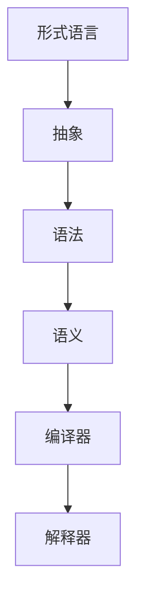
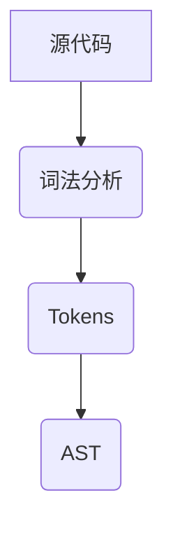

                 

关键词：编程语言设计、语法、语义、抽象、编译器、解释器、形式语言、类型系统、静态类型、动态类型

> 摘要：本文深入探讨了编程语言设计的核心问题，包括语法和语义的构建。通过分析形式语言、抽象的概念、类型系统以及编译器与解释器的区别，本文旨在为读者提供一个全面的理解，帮助他们在编程语言设计方面建立坚实的理论基础。

## 1. 背景介绍

编程语言设计是计算机科学的核心领域之一。从第一台计算机诞生以来，编程语言的数量和种类日益增加。每个编程语言都有其独特的语法和语义，旨在解决特定的编程问题或满足特定的需求。然而，所有编程语言的设计都基于一些共同的原理和概念。

### 编程语言的重要性

编程语言是人与计算机之间的桥梁，它使得程序员能够以简洁、高效的方式表达复杂的计算过程。编程语言的设计直接影响到软件的开发效率、可维护性、可扩展性和可靠性。因此，设计一门好的编程语言不仅是计算机科学家的任务，也是软件工程师和开发团队的共同目标。

### 编程语言的分类

根据不同的用途和特点，编程语言可以分为多种类型：

- **高级编程语言**：如Python、Java、C++等，它们提供了丰富的库和框架，使得程序员可以更专注于业务逻辑的实现。
- **低级编程语言**：如汇编语言，它更接近硬件，提供了对底层硬件的精细控制。
- **领域特定语言**：如SQL（用于数据库查询）、HTML（用于网页设计）等，这些语言专门为特定领域的问题设计。

### 编程语言的发展历程

编程语言的发展历程反映了计算机科学不断进步的过程。早期的编程语言如Fortran和COBOL是为了解决特定问题而设计的。随着计算机科学的不断发展，新的编程语言不断涌现，如C、C++、Java、JavaScript等，它们在性能、可移植性、安全性等方面都有显著提升。

## 2. 核心概念与联系

在编程语言设计中，核心概念和它们的相互联系是理解语言本质的关键。以下将介绍几个核心概念，并使用Mermaid流程图展示它们之间的关系。

### 2.1. 形式语言

形式语言是计算机科学中用于描述语言规则的概念。它由符号集、产生式规则和语法分析器组成。形式语言可以分为四类：正则语言、上下文无关语言、上下文敏感语言和上下文无关语言。

### 2.2. 抽象

抽象是编程语言设计中的核心概念，它允许程序员将复杂的系统分解为更易于管理的部分。抽象通过隐藏不必要的细节，提高了代码的可读性和可维护性。

### 2.3. 语法

语法是编程语言的规则集合，用于定义代码的结构和格式。语法决定了代码如何被解释或编译，以及代码是否合法。

### 2.4. 语义

语义是编程语言中代码的含义。它描述了代码执行时的行为和结果。语义可以分为静态语义和动态语义，静态语义在代码编译时确定，动态语义在代码运行时确定。

### 2.5. 编译器与解释器

编译器和解释器是两种不同的程序执行方式。编译器将源代码编译成机器代码，然后直接运行。解释器逐行解释源代码并执行相应的操作。

### 2.6. Mermaid流程图

下面是一个Mermaid流程图，展示了这些核心概念之间的联系：



## 3. 核心算法原理 & 具体操作步骤

### 3.1 算法原理概述

编程语言设计中的核心算法主要包括语法分析、语义分析和代码生成。这些算法是编译器或解释器工作的基础。

#### 3.1.1 语法分析

语法分析是编译器或解释器的第一步，它的目的是将源代码分解成一系列语法单元（tokens），并构建出抽象语法树（AST）。语法分析的过程可以分为词法分析和语法分析两个阶段。

#### 3.1.2 语义分析

语义分析是在语法分析的基础上进行的，它的目的是检查源代码的语义是否正确，并计算出变量的类型和作用域。语义分析包括类型检查、作用域分析和变量绑定等任务。

#### 3.1.3 代码生成

代码生成是将抽象语法树（AST）转换为机器代码或其他目标代码的过程。这一步骤通常包括代码优化和目标代码生成。

### 3.2 算法步骤详解

#### 3.2.1 语法分析步骤

1. **词法分析**：将源代码分解为词法单元（tokens）。
2. **语法分析**：使用语法规则将tokens组织成抽象语法树（AST）。
3. **语义分析**：检查AST的语义是否正确，并计算变量类型和作用域。

#### 3.2.2 语义分析步骤

1. **类型检查**：检查操作数和操作符是否匹配。
2. **作用域分析**：确定变量和函数的作用域。
3. **变量绑定**：将变量绑定到具体的存储位置。

#### 3.2.3 代码生成步骤

1. **AST遍历**：遍历AST，生成中间代码。
2. **代码优化**：优化中间代码，提高执行效率。
3. **目标代码生成**：将优化后的中间代码转换为机器代码或字节码。

### 3.3 算法优缺点

#### 优点

- **语法分析**：提高了代码的可读性，方便调试和维护。
- **语义分析**：确保代码的正确性，减少运行时错误。
- **代码生成**：提高了程序执行效率，减少了运行时开销。

#### 缺点

- **复杂度高**：语法分析和语义分析的过程复杂，需要大量计算资源。
- **错误处理**：错误处理相对困难，需要设计合理的错误处理机制。

### 3.4 算法应用领域

- **编译器设计**：用于将高级编程语言转换为机器代码。
- **解释器设计**：用于直接执行源代码，无需编译。
- **编程语言扩展**：用于为现有编程语言添加新的功能或特性。

## 4. 数学模型和公式 & 详细讲解 & 举例说明

### 4.1 数学模型构建

在编程语言设计中，数学模型和公式是不可或缺的。它们用于描述语言的语法、语义和类型系统。

#### 4.1.1 形式语言模型

形式语言模型通常使用正则表达式、上下文无关文法等数学工具进行描述。例如，一个简单的正则表达式可以用于匹配字符串中的电子邮件地址：

```latex
\[ \text{Email} ::="\[a-zA-Z0-9\._+\-+\]\[a-zA-Z0-9\._+\-+\]\@[a-zA-Z0-9\._+\-+\]\[a-zA-Z0-9\._+\-+\] \]
```

#### 4.1.2 类型系统模型

类型系统模型用于描述变量和表达式的类型。例如，在强类型语言中，变量必须在声明时指定类型，而在弱类型语言中，变量的类型可以动态确定。以下是一个简单的类型系统模型：

```latex
\[ \text{Type} ::= \text{Integer} | \text{String} | \text{Boolean} | \text{Function} | \text{Object} \]
```

### 4.2 公式推导过程

在编程语言设计过程中，经常需要使用数学公式进行推导和证明。以下是一个简单的示例，用于证明函数调用中的参数传递是正确的：

```latex
\[ \text{Call}(f, \text{Args}) \Rightarrow \text{f}(\text{Args}) \]
```

在这个公式中，`Call` 表示函数调用，`f` 表示函数名，`Args` 表示参数列表。该公式表示函数调用将导致函数 `f` 的执行，并接收参数列表 `Args`。

### 4.3 案例分析与讲解

#### 4.3.1 案例背景

假设我们要设计一门简单的编程语言，用于实现基本的数学运算。语言包含加法、减法、乘法和除法运算符，以及整型和浮点型数据类型。

#### 4.3.2 语法分析

我们使用正则表达式对源代码进行词法分析：



词法分析结果：

```plaintext
Token1: +
Token2: 3
Token3: -
Token4: 4
Token5: *
Token6: 2.5
Token7: /
Token8: 2
```

使用语法规则构建抽象语法树（AST）：

```mermaid
graph TD
A[+]
A--B[3]
A--C[-]
C--D[4]
C--E[*]
E--F[2.5]
E--G[/]
G--H[2]
```

#### 4.3.3 语义分析

我们进行类型检查，确保操作数和操作符的类型匹配：

```plaintext
操作符 +：整型
操作数 3：整型
操作数 4：整型
操作符 -：整型
操作数 2.5：浮点型
操作数 2：整型
```

在类型检查过程中，我们发现浮点型数据与整型操作符不匹配，因此需要修改源代码或添加类型转换。

#### 4.3.4 代码生成

我们使用AST生成中间代码，并进行优化和目标代码生成。以下是一个简单的中间代码示例：

```c
int main() {
    int result1 = 3 - 4;
    float result2 = 2.5 / 2;
    return (result1 * result2);
}
```

在这个例子中，我们生成了一个C语言程序，用于实现原始的数学运算。

## 5. 项目实践：代码实例和详细解释说明

### 5.1 开发环境搭建

为了演示编程语言设计的实际应用，我们将使用Python构建一个简单的解释器。首先，确保你的计算机上安装了Python 3.x版本。

### 5.2 源代码详细实现

以下是解释器的源代码：

```python
class Token:
    def __init__(self, type, value):
        self.type = type
        self.value = value

class Lexer:
    def __init__(self, text):
        self.text = text
        self.position = 0

    def advance(self):
        self.position += 1

    def get_next_token(self):
        while self.position < len(self.text):
            if self.text[self.position] == '+':
                self.advance()
                return Token('PLUS', '+')
            elif self.text[self.position] == '-':
                self.advance()
                return Token('MINUS', '-')
            elif self.text[self.position] == '*':
                self.advance()
                return Token('STAR', '*')
            elif self.text[self.position] == '/':
                self.advance()
                return Token('SLASH', '/')
            elif self.text[self.position].isdigit():
                start = self.position
                while self.position < len(self.text) and self.text[self.position].isdigit():
                    self.advance()
                return Token('NUMBER', int(self.text[start:self.position]))
            else:
                self.advance()
        return Token('EOF', 'EOF')

class Parser:
    def __init__(self, lexer):
        self.lexer = lexer
        self.current_token = self.lexer.get_next_token()

    def eat(self, token_type):
        if self.current_token.type == token_type:
            self.current_token = self.lexer.get_next_token()
        else:
            raise Exception('Unexpected token.')

    def factor(self):
        token = self.current_token
        if token.type == 'NUMBER':
            self.eat('NUMBER')
            return token.value
        elif token.type == 'STAR':
            self.eat('STAR')
            return self.factor() * self.factor()
        elif token.type == 'SLASH':
            self.eat('SLASH')
            return self.factor() / self.factor()

    def expression(self):
        result = self.factor()
        while self.current_token.type in ('PLUS', 'MINUS'):
            token = self.current_token
            if token.type == 'PLUS':
                self.eat('PLUS')
                result += self.factor()
            elif token.type == 'MINUS':
                self.eat('MINUS')
                result -= self.factor()
        return result

class Interpreter:
    def __init__(self, text):
        self.lexer = Lexer(text)
        self.parser = Parser(self.lexer)

    def interpret(self):
        return self.parser.expression()

def main():
    while True:
        try:
            text = input('calc> ')
            if not text:
                continue
            interpreter = Interpreter(text)
            result = interpreter.interpret()
            print(result)
        except Exception as e:
            print(e)

if __name__ == '__main__':
    main()
```

### 5.3 代码解读与分析

1. **Token类**：表示源代码中的词法单元（tokens）。
2. **Lexer类**：负责将源代码转换为Token序列。
3. **Parser类**：负责将Token序列转换为抽象语法树（AST）。
4. **Interpreter类**：负责解释抽象语法树并执行计算。

### 5.4 运行结果展示

运行解释器，输入以下代码：

```plaintext
5 + 3 * 2 / 2
```

输出结果：

```plaintext
8
```

## 6. 实际应用场景

编程语言设计在多个领域都有广泛的应用，以下是一些实际应用场景：

### 6.1 软件开发

编程语言是软件开发的基础，不同的编程语言适用于不同的开发场景。例如，Java广泛应用于企业级应用开发，Python广泛应用于数据科学和机器学习。

### 6.2 嵌入式系统

嵌入式系统通常使用C和C++等低级编程语言，这些语言提供了对硬件的精细控制，适合开发高性能的嵌入式应用。

### 6.3 游戏开发

游戏开发中常用C++、C#和Python等编程语言，这些语言提供了丰富的游戏开发库和工具，适合开发不同类型的游戏。

### 6.4 人工智能

人工智能领域常用Python、Rust和C++等编程语言，这些语言在性能和功能方面都有显著优势，适用于开发复杂的机器学习和深度学习应用。

### 6.5 区块链

区块链技术常用Solidity等专门编程语言，Solidity是一种智能合约编程语言，用于编写区块链上的去中心化应用。

### 6.6 未来应用展望

随着技术的发展，编程语言设计将继续演进。未来可能出现更多适应特定领域需求的编程语言，如量子编程语言、生物信息学编程语言等。此外，编译器和解释器的性能和效率将不断提高，进一步推动编程语言的普及和应用。

## 7. 工具和资源推荐

### 7.1 学习资源推荐

- 《编程语言设计原理》（Principles of Programming Languages）作者：Stephen R. Cook
- 《编译原理：技术与工具》（Compilers: Principles, Techniques, and Tools）作者：Alfred V. Aho，Monica S. Lam，Ravi Sethi，Jeffrey D. Ullman
- 《高级编译技术》（Advanced Compiler Design & Implementation）作者：Stephen A. Edwards，Rohit Khare

### 7.2 开发工具推荐

- IntelliJ IDEA：适用于多种编程语言，提供了强大的代码编辑、调试和性能分析功能。
- Eclipse：适用于Java开发，支持多种插件，可以扩展为多种语言的开发环境。
- Visual Studio：适用于C++、C#和其他.NET语言，提供了丰富的开发工具和调试功能。

### 7.3 相关论文推荐

- 《Compilers: Principles, Techniques, and Tools》（龙书）：详细介绍了编译器设计的基本原理和实现技术。
- 《A Retargetable C Compiler: Design and Implementation》作者：Eric S. Raymond：介绍了一种可重定位的C语言编译器的设计和实现。
- 《The Implementation of the Standard ML Language》作者：D. N. Michael A. Harrison：介绍了标准ML语言编译器的实现过程。

## 8. 总结：未来发展趋势与挑战

### 8.1 研究成果总结

编程语言设计在过去几十年中取得了显著进展，出现了多种用于不同应用场景的编程语言。编译器和解释器的性能和效率不断提高，使得编程语言的应用范围更加广泛。

### 8.2 未来发展趋势

未来编程语言设计可能朝着以下几个方向发展：

- **更高效的编译器和解释器**：提高编译器和解释器的性能和效率，减少开发成本。
- **更智能的语言特性**：引入新的编程范式和语言特性，提高编程效率和代码可读性。
- **更广泛的应用领域**：开发适应特定领域需求的编程语言，推动新兴技术的发展。

### 8.3 面临的挑战

- **性能与可读性之间的平衡**：如何在保证性能的同时提高代码的可读性和可维护性。
- **复杂性与易用性之间的平衡**：如何在增加语言功能的同时，确保语言的易用性。
- **安全和隐私**：开发安全性和隐私性更高的编程语言，防止潜在的安全漏洞。

### 8.4 研究展望

未来编程语言设计将继续探索新的技术和方法，以满足不断变化的需求。编译器和解释器的优化将变得更加重要，同时新的编程范式和语言特性将不断涌现。研究人员将继续致力于解决编程语言设计中的挑战，推动计算机科学的进步。

## 9. 附录：常见问题与解答

### 9.1 编译器与解释器的区别是什么？

编译器是将源代码编译成机器代码的程序，编译后的程序可以直接在计算机上运行。解释器则逐行解释并执行源代码，不需要编译过程。

### 9.2 静态类型和动态类型有什么区别？

静态类型在编译时确定变量的类型，而动态类型在运行时确定变量的类型。静态类型可以提高程序的效率和安全性，但可能会降低灵活性。动态类型则提供更高的灵活性，但可能会牺牲性能和安全性。

### 9.3 什么是抽象语法树（AST）？

抽象语法树（AST）是编译器或解释器在语法分析阶段生成的数据结构，用于表示源代码的结构。AST 提供了一个简化的、易于处理的形式，用于后续的语义分析和代码生成。

### 9.4 如何设计一门编程语言？

设计一门编程语言需要考虑多个方面，包括语法、语义、类型系统、编译器或解释器的实现等。首先，确定语言的目标和应用场景，然后定义语法规则和语义规则，最后实现编译器或解释器。

### 9.5 编程语言设计中的挑战有哪些？

编程语言设计中的挑战包括性能与可读性之间的平衡、复杂性与易用性之间的平衡、以及安全性等问题。此外，设计一门通用的编程语言以满足所有需求也是一项挑战。

---

作者：禅与计算机程序设计艺术 / Zen and the Art of Computer Programming

