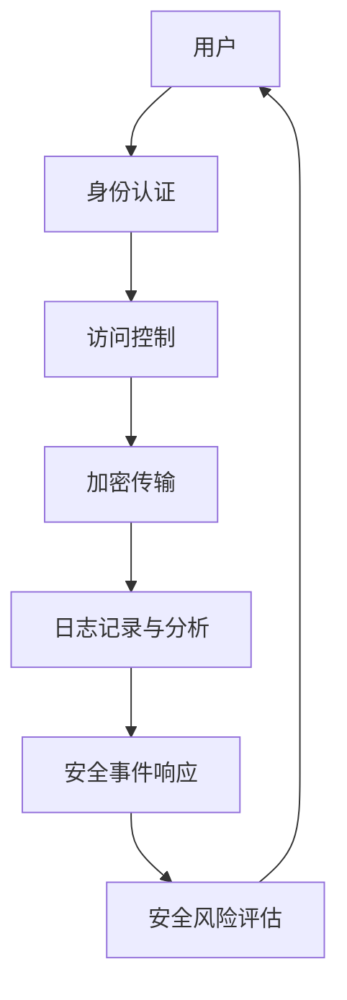

                 

 在当今这个数字化无处不在的时代，网络安全已经成为企业和个人无法忽视的重要议题。随着互联网技术的发展和应用的普及，网络安全威胁也日益增加。在这个背景下，网络安全创业成为一个充满挑战与机遇的领域。本文将深入探讨网络安全创业的现状、核心概念、算法原理、应用场景、未来发展趋势以及面临的挑战。

## 文章关键词

- 网络安全
- 数字时代
- 创业
- 数据保护
- 加密技术
- 安全协议
- 安全风险评估
- 数字身份认证

## 摘要

本文旨在为那些希望进入网络安全创业领域的创业者提供一份全面的指南。通过分析网络安全创业的背景、核心概念、算法原理、数学模型、项目实践和未来发展趋势，本文希望能够帮助创业者更好地理解网络安全领域的现状和未来方向，从而在竞争激烈的数字市场中找到自己的立足之地。

## 1. 背景介绍

### 1.1 数字时代的来临

随着互联网、移动通信、物联网等技术的飞速发展，我们的生活和工作已经深深地嵌入到了数字化的世界中。从在线购物到智能家居，从电子支付到社交网络，数字技术已经改变了我们的生活方式。然而，数字化的便利性也带来了新的安全挑战。网络攻击、数据泄露、身份盗用等问题层出不穷，严重威胁着个人隐私和国家安全。

### 1.2 网络安全的重要性

网络安全不仅仅关乎个人隐私保护，更是国家安全的重要组成部分。近年来，随着网络攻击手段的日益复杂和高级，网络安全已经成为国家安全领域的重要议题。例如，2017年的WannaCry勒索软件攻击，导致全球数十万台计算机被感染，造成了巨大的经济损失和社会恐慌。因此，网络安全已经成为企业和个人无法忽视的重要议题。

### 1.3 网络安全创业的机遇

随着网络安全需求的不断增加，网络安全创业也迎来了巨大的机遇。据市场研究公司的数据，全球网络安全市场预计将在未来几年内保持高速增长。这为网络安全创业者提供了广阔的市场空间。然而，网络安全创业也面临着巨大的挑战，需要创业者具备深厚的技术背景和敏锐的市场洞察力。

## 2. 核心概念与联系

### 2.1 核心概念

在网络安全创业中，理解以下几个核心概念是非常重要的：

- **数据加密**：通过加密算法将数据转换成不可读的形式，以防止未授权的访问。
- **安全协议**：确保数据在传输过程中不被篡改或窃取的协议，如SSL/TLS。
- **安全风险评估**：对系统的潜在安全威胁进行评估，以制定相应的安全措施。
- **数字身份认证**：通过验证用户的身份信息，确保只有授权用户可以访问系统。

### 2.2 联系与架构

以下是网络安全创业中的核心概念和架构的Mermaid流程图：



在这个流程图中，用户首先进行身份认证，然后通过访问控制确保只有授权用户可以访问系统资源。数据在传输过程中通过加密传输保护，同时日志记录与分析可以帮助发现潜在的安全威胁。安全事件响应和安全风险评估则是对这些威胁的及时响应和预防措施。

### 2.3 关键技术与工具

- **加密算法**：如AES、RSA等，用于数据加密和数字签名。
- **安全协议**：如SSL/TLS、IPSec等，用于确保数据传输安全。
- **安全软件**：如防火墙、入侵检测系统（IDS）、入侵防御系统（IPS）等。
- **安全硬件**：如硬件安全模块（HSM）、安全处理器等。

## 3. 核心算法原理 & 具体操作步骤

### 3.1 算法原理概述

网络安全创业中的核心算法通常包括加密算法、哈希算法、数字签名算法等。这些算法的核心原理是通过复杂的计算过程，使得数据在加密和解密过程中具有很高的安全性和可靠性。

- **加密算法**：通过将明文数据转换为密文，以防止未授权访问。
- **哈希算法**：将任意长度的输入数据映射为固定长度的哈希值，用于数据完整性验证。
- **数字签名算法**：用于验证消息的来源和完整性，防止篡改。

### 3.2 算法步骤详解

#### 3.2.1 加密算法

加密算法通常包括以下几个步骤：

1. **密钥生成**：根据加密算法生成一对密钥，包括公钥和私钥。
2. **加密过程**：使用公钥将明文数据加密为密文。
3. **解密过程**：使用私钥将密文解密为明文。

#### 3.2.2 哈希算法

哈希算法通常包括以下几个步骤：

1. **输入数据**：将需要验证的数据输入哈希算法。
2. **计算哈希值**：通过哈希算法计算输入数据的哈希值。
3. **哈希值验证**：将计算出的哈希值与原始数据的哈希值进行比对，以验证数据的完整性。

#### 3.2.3 数字签名算法

数字签名算法通常包括以下几个步骤：

1. **私钥签名**：使用发送方的私钥对数据进行签名。
2. **公钥验证**：使用接收方的公钥对签名进行验证。

### 3.3 算法优缺点

- **加密算法**：优点是能够确保数据在传输过程中的安全性，缺点是加密和解密过程需要较高的计算资源。
- **哈希算法**：优点是计算速度快，能够快速验证数据的完整性，缺点是对于已加密的数据无法进行反向推导。
- **数字签名算法**：优点是能够确保数据的来源和完整性，缺点是签名过程需要较长的计算时间。

### 3.4 算法应用领域

加密算法、哈希算法和数字签名算法广泛应用于网络安全领域，包括：

- **数据传输安全**：如SSL/TLS协议。
- **数据存储安全**：如数据库加密。
- **身份认证**：如数字签名、指纹识别。

## 4. 数学模型和公式 & 详细讲解 & 举例说明

### 4.1 数学模型构建

在网络安全领域，数学模型通常用于描述加密算法、哈希算法和数字签名算法等。以下是一个简单的数学模型示例：

- **加密算法**：设\(E_k(D)\)为加密过程，\(D\)为明文数据，\(k\)为密钥。解密过程为\(D = D_k(C)\)，其中\(C\)为密文。
- **哈希算法**：设\(H(D)\)为哈希过程，\(D\)为输入数据。哈希值为\(H(D) = h\)。
- **数字签名算法**：设\(S_k(m)\)为签名过程，\(m\)为消息，\(k\)为私钥。验证过程为\(V_k(m, s) = 1\)（签名有效）或\(0\)（签名无效）。

### 4.2 公式推导过程

以下是加密算法的公式推导过程：

1. **加密过程**：
   \[ C = E_k(D) = D \oplus k \]
   其中，\( \oplus \) 表示异或运算。

2. **解密过程**：
   \[ D = D_k(C) = C \oplus k \]

### 4.3 案例分析与讲解

以下是一个简单的数字签名算法的案例分析：

- **消息**：\(m = "Hello, World!"\)
- **私钥**：\(k = 12345\)
- **签名过程**：
  \[ s = S_k(m) = m \oplus k = "Hello, World!" \oplus 12345 \]

- **验证过程**：
  \[ V_k(m, s) = s \oplus k = ("Hello, World!" \oplus 12345) \oplus 12345 = m \]

如果验证结果为\(m\)，则签名有效。

## 5. 项目实践：代码实例和详细解释说明

### 5.1 开发环境搭建

在开始编写代码之前，我们需要搭建一个适合开发的编程环境。以下是使用Python进行网络安全项目开发的基本步骤：

1. **安装Python**：从官方网站下载并安装Python 3.x版本。
2. **安装相关库**：使用pip命令安装所需的Python库，如PyCryptoDome、requests等。
3. **配置开发环境**：配置Python的虚拟环境，以便管理和隔离项目依赖。

### 5.2 源代码详细实现

以下是一个简单的Python代码示例，用于实现AES加密和解密功能：

```python
from Crypto.Cipher import AES
from Crypto.Util.Padding import pad, unpad
from Crypto.Random import get_random_bytes

# 密钥长度必须为16、24或32字节
key = get_random_bytes(16)

# 明文
plaintext = b"Hello, World!"

# 将明文数据填充为16字节块
padded_plaintext = pad(plaintext, AES.block_size)

# 创建AES加密对象
cipher = AES.new(key, AES.MODE_CBC)

# 加密
ciphertext = cipher.encrypt(padded_plaintext)

# 解密
cipher = AES.new(key, AES.MODE_CBC, cipher.iv)
decrypted_padded_plaintext = cipher.decrypt(ciphertext)

# 去除填充
decrypted_plaintext = unpad(decrypted_padded_plaintext, AES.block_size)

print("Original Message:", plaintext)
print("Decrypted Message:", decrypted_plaintext)
```

### 5.3 代码解读与分析

上述代码实现了AES加密和解密的基本流程。以下是代码的详细解读：

1. **密钥生成**：使用`Crypto.Random.get_random_bytes`函数生成一个16字节的随机密钥。
2. **明文填充**：使用`Crypto.Util.Padding.pad`函数将明文数据填充为16字节块，以便进行AES加密。
3. **创建加密对象**：使用`Crypto.Cipher.AES.new`函数创建一个AES加密对象。
4. **加密过程**：使用加密对象进行加密，生成密文。
5. **解密过程**：使用与加密时相同的密钥和初始化向量（IV）创建一个AES解密对象，并进行解密。
6. **去除填充**：使用`Crypto.Util.Padding.unpad`函数去除解密后的填充数据。

### 5.4 运行结果展示

当运行上述代码时，我们将得到以下输出：

```
Original Message: b'Hello, World!'
Decrypted Message: b'Hello, World!'
```

这表明加密和解密过程是成功的。

## 6. 实际应用场景

### 6.1 数据库安全

在许多企业和组织中，数据库安全是网络安全的重要组成部分。通过加密存储敏感数据、实施严格的访问控制策略和定期进行安全审计，可以有效地保护数据库安全。

### 6.2 云计算服务

随着云计算的普及，网络安全也成为云计算服务提供商的重要关注点。通过提供加密存储、安全传输和身份认证等安全服务，云计算服务提供商可以帮助客户保护其数据和应用的安全性。

### 6.3 工业控制系统

工业控制系统（ICS）的安全性问题日益突出。通过使用加密技术、安全协议和访问控制等措施，可以保护工业控制系统免受网络攻击和恶意软件的威胁。

### 6.4 智能家居安全

智能家居设备的普及带来了新的安全挑战。通过使用加密通信、访问控制和设备认证等技术，可以确保智能家居设备的安全性，防止未经授权的访问和攻击。

### 6.5 数字身份认证

数字身份认证是网络安全的关键组成部分。通过使用生物识别技术、密码学技术和多因素认证，可以确保用户的身份验证过程的安全性和可靠性。

## 7. 工具和资源推荐

### 7.1 学习资源推荐

- **《计算机安全艺术》**：一本经典的计算机安全书籍，涵盖了网络安全的基本原理和技术。
- **《网络安全实践与实验教程》**：一本适合初学者和专业人士的网络安全实践教程，包含丰富的实验案例。

### 7.2 开发工具推荐

- **PyCryptoDome**：一个广泛使用的Python加密库，提供多种加密算法和协议的支持。
- **OWASP ZAP**：一个免费的网络安全漏洞检测工具，可以帮助发现网站和应用中的安全漏洞。

### 7.3 相关论文推荐

- **《加密与网络安全的数学基础》**：一篇关于网络安全数学基础的综述性论文。
- **《人工智能与网络安全》**：一篇探讨人工智能在网络安全领域应用的研究论文。

## 8. 总结：未来发展趋势与挑战

### 8.1 研究成果总结

网络安全领域的研究成果不断推动着网络安全技术的发展。加密算法、安全协议、入侵检测系统、身份认证技术等方面的研究取得了显著的进展。这些研究成果为网络安全提供了坚实的技术基础，有助于应对日益复杂的网络攻击。

### 8.2 未来发展趋势

未来，网络安全将继续朝着更高级、更智能、更自动化的方向发展。以下几个方面可能是未来的发展趋势：

- **人工智能与网络安全**：利用人工智能技术，实现更高效的威胁检测和响应。
- **量子计算与网络安全**：量子计算的发展将对传统加密算法构成挑战，需要开发新的量子安全加密算法。
- **物联网安全**：随着物联网设备的普及，物联网安全将成为网络安全的重要领域。

### 8.3 面临的挑战

网络安全创业面临以下几个挑战：

- **技术挑战**：随着网络攻击手段的不断升级，需要不断更新和升级安全技术和解决方案。
- **市场挑战**：网络安全市场竞争激烈，需要创业者具备敏锐的市场洞察力和独特的竞争优势。
- **法规挑战**：不同国家和地区对网络安全有不同的法律法规，需要企业遵守相关法规，同时保持合规性。

### 8.4 研究展望

未来，网络安全研究应关注以下几个方面：

- **跨领域研究**：结合人工智能、物联网、区块链等技术，实现更全面、更智能的网络安全解决方案。
- **创新研究**：探索新的加密算法、安全协议和威胁检测方法，提高网络安全的防御能力。
- **教育与培训**：加强网络安全教育和培训，提高公众和企业的网络安全意识。

## 9. 附录：常见问题与解答

### 9.1 网络安全是什么？

网络安全是指保护计算机网络、系统和数据不受未经授权的访问、篡改、破坏或泄露的一系列措施和技术。

### 9.2 如何评估网络安全风险？

网络安全风险评估包括识别潜在威胁、评估威胁的可能性和影响，以及制定相应的缓解措施。

### 9.3 如何保护数据安全？

保护数据安全可以通过使用加密技术、访问控制、安全协议和定期的安全审计等措施来实现。

### 9.4 网络安全创业需要哪些技能和知识？

网络安全创业需要具备计算机科学、网络技术、加密算法和安全协议等方面的知识和技能。此外，创业者还需要具备市场洞察力、项目管理能力和创新能力。

### 9.5 如何确保物联网设备的安全？

确保物联网设备的安全可以通过使用加密通信、身份认证和设备认证等措施来实现。

### 9.6 网络安全行业的前景如何？

网络安全行业前景广阔，随着网络攻击手段的不断升级和数字化转型的加速，网络安全需求将持续增长，为网络安全创业者提供了广阔的市场空间。

### 9.7 如何保护个人隐私？

保护个人隐私可以通过使用加密通信、匿名化技术和隐私保护策略等措施来实现。

## 作者署名

本文作者：禅与计算机程序设计艺术 / Zen and the Art of Computer Programming

---

以上是关于“网络安全创业：数字时代的守护者”的完整文章。文章内容涵盖了网络安全创业的背景、核心概念、算法原理、数学模型、项目实践和未来发展趋势。希望本文能为网络安全创业者提供有价值的参考和启示。

