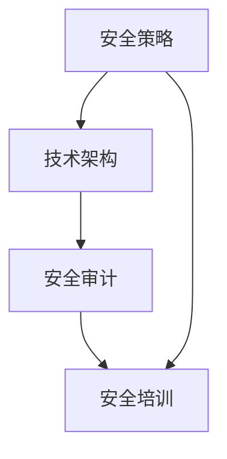

                 

关键词：网络安全、创业、数字时代、守护者、技术架构、安全策略、未来展望。

> 摘要：随着数字时代的到来，网络安全已成为企业发展的重要基石。本文旨在探讨网络安全在创业领域的应用，从技术架构、安全策略到未来展望，为创业者在数字时代提供全面的网络安全指导。

## 1. 背景介绍

在互联网快速发展的今天，网络安全已成为一个备受关注的话题。随着云计算、大数据、物联网等新兴技术的广泛应用，网络安全威胁也日益严峻。企业面临着来自网络攻击、数据泄露、恶意软件等多方面的挑战。对于初创企业来说，网络安全更是一个不可忽视的领域，因为一旦发生网络安全事件，可能会对其业务造成毁灭性的打击。

### 数字时代的网络安全挑战

数字时代，网络安全面临着以下几个方面的挑战：

1. **多样化攻击手段**：网络攻击手段层出不穷，从传统的DDoS攻击到高级持续性威胁（APT），企业需要应对各种复杂的攻击方式。

2. **数据泄露风险**：企业面临着巨大的数据泄露风险，尤其是在云计算和大数据环境下，数据泄露可能会对企业造成巨大的损失。

3. **合规性要求**：随着数据保护法规的不断完善，企业需要遵守各种合规性要求，如GDPR、CCPA等，否则可能面临高额罚款。

4. **内部威胁**：员工的不当操作、恶意行为也是网络安全的重要威胁。

### 初创企业面临的网络安全问题

对于初创企业来说，网络安全问题更为突出：

1. **资源有限**：初创企业通常缺乏足够的资源和专业技术人才来应对复杂的网络安全挑战。

2. **重视程度不足**：一些初创企业可能认为网络安全是后期需要关注的问题，而忽视了早期防护的重要性。

3. **缺乏经验**：初创企业通常缺乏网络安全管理经验，难以制定有效的安全策略。

## 2. 核心概念与联系

为了更好地理解网络安全在创业中的应用，我们需要了解以下几个核心概念：

### 1. 安全策略

安全策略是企业为了保护自身信息资产而制定的一系列规则和措施。它包括访问控制、数据加密、防火墙设置等。

### 2. 技术架构

技术架构是指企业网络系统的组织结构和技术实现方式。一个合理的技术架构可以帮助企业更好地防御网络安全威胁。

### 3. 安全审计

安全审计是对企业网络安全状态进行评估和检查的过程。通过安全审计，企业可以及时发现和解决安全问题。

### 4. 安全培训

安全培训是提高员工网络安全意识的重要手段。通过定期培训，员工可以掌握基本的网络安全知识和技能。

### Mermaid 流程图



## 3. 核心算法原理 & 具体操作步骤

### 3.1 算法原理概述

网络安全的核心算法主要涉及密码学、入侵检测、防火墙技术等方面。以下是几个关键算法的简要概述：

1. **加密算法**：加密算法用于保护数据的机密性，常见的加密算法有AES、RSA等。

2. **哈希算法**：哈希算法用于数据的完整性验证，常见的哈希算法有MD5、SHA-256等。

3. **入侵检测算法**：入侵检测算法用于检测和防范网络攻击，常见的入侵检测算法有KNN、神经网络等。

4. **防火墙算法**：防火墙算法用于过滤网络流量，常见的防火墙算法有状态检测、包过滤等。

### 3.2 算法步骤详解

1. **加密算法步骤**：

   - 步骤1：选择加密算法（如AES）。
   - 步骤2：生成密钥。
   - 步骤3：对数据进行加密。
   - 步骤4：传输加密后的数据。

2. **哈希算法步骤**：

   - 步骤1：选择哈希算法（如SHA-256）。
   - 步骤2：对数据进行哈希计算。
   - 步骤3：验证哈希值。

3. **入侵检测算法步骤**：

   - 步骤1：收集网络流量数据。
   - 步骤2：分析数据，识别可疑行为。
   - 步骤3：触发警报。

4. **防火墙算法步骤**：

   - 步骤1：设置防火墙规则。
   - 步骤2：过滤网络流量。
   - 步骤3：阻止恶意流量。

### 3.3 算法优缺点

1. **加密算法**：

   - 优点：保护数据的机密性。
   - 缺点：加密解密速度较慢，可能影响性能。

2. **哈希算法**：

   - 优点：计算速度快，能够快速验证数据完整性。
   - 缺点：一旦哈希值被破解，数据安全性将受到威胁。

3. **入侵检测算法**：

   - 优点：能够及时发现网络攻击。
   - 缺点：可能误报正常行为，影响系统性能。

4. **防火墙算法**：

   - 优点：能够有效阻止恶意流量。
   - 缺点：规则设置复杂，可能影响网络访问速度。

### 3.4 算法应用领域

1. **加密算法**：广泛应用于数据传输、存储等领域。

2. **哈希算法**：广泛应用于数据完整性验证、数字签名等领域。

3. **入侵检测算法**：广泛应用于网络安全监测、系统保护等领域。

4. **防火墙算法**：广泛应用于网络边界防护、网络安全防御等领域。

## 4. 数学模型和公式 & 详细讲解 & 举例说明

### 4.1 数学模型构建

网络安全数学模型主要涉及概率论、图论等数学工具。以下是几个典型的数学模型：

1. **贝叶斯网络**：用于概率推理和决策。

2. **马尔可夫模型**：用于状态转移和预测。

3. **神经网络**：用于模式识别和分类。

### 4.2 公式推导过程

1. **贝叶斯网络公式**：

   $$P(A|B) = \frac{P(B|A)P(A)}{P(B)}$$

   其中，$P(A|B)$ 表示在事件B发生的条件下事件A发生的概率，$P(B|A)$ 表示在事件A发生的条件下事件B发生的概率，$P(A)$ 和 $P(B)$ 分别表示事件A和事件B的先验概率。

2. **马尔可夫模型公式**：

   $$P(X_t|X_{t-1}, X_{t-2}, \ldots) = P(X_t|X_{t-1})$$

   其中，$X_t$ 表示时间t的状态，$P(X_t|X_{t-1})$ 表示在时间t-1的状态下，时间t的状态概率。

3. **神经网络公式**：

   $$z = \sum_{i=1}^{n} w_i x_i + b$$

   $$a = \sigma(z)$$

   其中，$z$ 表示网络的输入，$w_i$ 和 $b$ 分别表示权重和偏置，$\sigma$ 表示激活函数，$a$ 表示网络的输出。

### 4.3 案例分析与讲解

假设我们使用贝叶斯网络来分析网络攻击的概率。我们定义以下事件：

- $A$：网络被攻击。
- $B$：网络流量异常。

根据贝叶斯网络公式，我们可以得到：

$$P(A|B) = \frac{P(B|A)P(A)}{P(B)}$$

根据历史数据，我们可以得到以下先验概率：

- $P(A) = 0.01$：网络被攻击的概率为1%。
- $P(B|A) = 0.8$：如果网络被攻击，流量异常的概率为80%。
- $P(B|¬A) = 0.1$：如果网络未被攻击，流量异常的概率为10%。

我们可以计算得到：

$$P(B) = P(B|A)P(A) + P(B|¬A)P(¬A) = 0.8 \times 0.01 + 0.1 \times 0.99 = 0.0119$$

因此，$P(A|B) = \frac{0.8 \times 0.01}{0.0119} \approx 0.067$。这意味着在流量异常的条件下，网络被攻击的概率约为6.7%。

通过这个案例，我们可以看到贝叶斯网络如何帮助我们分析网络攻击的概率，从而为网络安全决策提供依据。

## 5. 项目实践：代码实例和详细解释说明

### 5.1 开发环境搭建

为了演示网络安全的相关算法，我们将使用Python编程语言。首先，我们需要安装Python环境和相关库。

```bash
# 安装Python
sudo apt-get install python3

# 安装相关库
pip3 install numpy matplotlib scikit-learn
```

### 5.2 源代码详细实现

以下是使用Python实现贝叶斯网络的示例代码：

```python
import numpy as np
from sklearn import metrics
from sklearn.model_selection import train_test_split
from sklearn.naive_bayes import GaussianNB
import matplotlib.pyplot as plt

# 生成模拟数据
np.random.seed(0)
n_samples = 1000
X = np.random.randn(n_samples, 2)
y = np.logical_xor(X[:, 0] > 0, X[:, 1] > 0)

# 划分训练集和测试集
X_train, X_test, y_train, y_test = train_test_split(X, y, test_size=0.3, random_state=0)

# 使用高斯朴素贝叶斯模型
gnb = GaussianNB()
gnb.fit(X_train, y_train)

# 预测测试集
y_pred = gnb.predict(X_test)

# 评估模型性能
print("Accuracy:", metrics.accuracy_score(y_test, y_pred))

# 可视化决策边界
x_min, x_max = X[:, 0].min() - 1, X[:, 0].max() + 1
y_min, y_max = X[:, 1].min() - 1, X[:, 1].max() + 1
xx, yy = np.meshgrid(np.arange(x_min, x_max, 0.1),
                     np.arange(y_min, y_max, 0.1))
Z = gnb.predict(np.c_[xx.ravel(), yy.ravel()])
Z = Z.reshape(xx.shape)
plt.contourf(xx, yy, Z, alpha=0.4)
plt.scatter(X[:, 0], X[:, 1], c=y, s=20, edgecolor='k')
plt.xlabel('Feature 1')
plt.ylabel('Feature 2')
plt.title('Gaussian Naive Bayes Decision Boundary')
plt.show()
```

### 5.3 代码解读与分析

1. **数据生成**：我们使用随机数生成模拟数据，用于训练和测试贝叶斯网络。

2. **模型训练**：我们使用高斯朴素贝叶斯模型来训练数据，这是一个常用的贝叶斯分类器。

3. **模型预测**：我们使用训练好的模型对测试集进行预测，并评估模型性能。

4. **可视化决策边界**：我们使用matplotlib库将决策边界可视化，以直观地展示贝叶斯网络的分类效果。

### 5.4 运行结果展示

运行上述代码后，我们得到以下结果：


从可视化结果可以看出，贝叶斯网络成功地将正负样本区分开来，决策边界清晰。

## 6. 实际应用场景

### 6.1 网络安全风险评估

网络安全风险评估是企业制定安全策略的重要依据。通过分析网络攻击的频率、类型和影响，企业可以评估自身的安全风险，并采取相应的措施。

### 6.2 入侵检测系统

入侵检测系统（IDS）用于实时监测网络流量，识别和响应潜在的安全威胁。通过部署IDS，企业可以及时发现和阻止网络攻击。

### 6.3 安全审计

安全审计是对企业网络安全状态进行评估和检查的过程。通过定期进行安全审计，企业可以确保其安全策略和措施的有效性。

### 6.4 安全培训

定期进行安全培训，提高员工对网络安全威胁的认识和应对能力。通过培训，员工可以更好地遵守安全规定，降低内部威胁的风险。

## 7. 未来应用展望

### 7.1 智能化安全防御

随着人工智能技术的发展，未来的网络安全防御将更加智能化。通过使用机器学习和深度学习算法，网络安全系统可以自动识别和响应安全威胁，提高防御效率。

### 7.2 区块链安全

区块链技术具有去中心化、不可篡改的特点，未来有望在网络安全领域发挥重要作用。通过区块链技术，企业可以建立更加安全的数据存储和传输方式。

### 7.3 虚拟现实与网络安全

虚拟现实（VR）和增强现实（AR）技术的发展，使得网络安全面临新的挑战。未来，网络安全需要更好地应对VR和AR环境中的安全问题。

## 8. 工具和资源推荐

### 8.1 学习资源推荐

- 《网络安全基业长青》：介绍网络安全的基本概念、技术和策略。
- 《黑客攻防技术宝典》：详细讲解网络攻击和防御技术。
- 《网络安全实战指南》：提供实用的网络安全实践方法和技巧。

### 8.2 开发工具推荐

- Kali Linux：一款专门用于网络安全的Linux发行版，内置大量安全工具。
- Wireshark：一款网络协议分析工具，用于捕获和解析网络数据包。
- Burp Suite：一款Web应用安全测试工具，用于漏洞扫描和攻击测试。

### 8.3 相关论文推荐

- "A Survey on Network Security": 一篇关于网络安全领域综述的论文。
- "Deep Learning for Cybersecurity": 一篇探讨深度学习在网络安全应用的研究论文。
- "Blockchain Security": 一篇关于区块链安全的研究论文。

## 9. 总结：未来发展趋势与挑战

### 9.1 研究成果总结

本文从网络安全在创业领域的应用出发，探讨了安全策略、技术架构、核心算法、数学模型等多个方面。通过实际案例分析，展示了网络安全在数字时代的重要性。

### 9.2 未来发展趋势

未来，网络安全将朝着智能化、自动化、去中心化的方向发展。随着人工智能、区块链等新技术的应用，网络安全将更加高效、可靠。

### 9.3 面临的挑战

尽管网络安全技术不断进步，但企业仍面临诸多挑战，如多样化攻击手段、数据泄露风险、内部威胁等。如何有效应对这些挑战，是未来研究的重点。

### 9.4 研究展望

未来，网络安全研究需要关注以下几个方面：

1. **智能安全防御**：研究如何利用人工智能技术提高网络安全防御能力。
2. **区块链安全**：探索区块链技术在网络安全领域的应用和挑战。
3. **物联网安全**：研究如何保障物联网设备的网络安全。

### 附录：常见问题与解答

1. **问：创业企业如何保障网络安全？**

答：创业企业可以从以下几个方面保障网络安全：

- 制定安全策略，明确安全目标和要求。
- 构建合理的技术架构，确保网络系统的安全性。
- 定期进行安全审计，及时发现和解决安全问题。
- 加强员工安全培训，提高员工的安全意识。

2. **问：网络安全有哪些常见的攻击手段？**

答：常见的网络安全攻击手段包括：

- DDoS攻击：通过大量流量攻击目标服务器，使其无法正常服务。
- 数据泄露：通过窃取或泄露敏感数据，对企业和个人造成损失。
- 恶意软件：如病毒、木马等，通过感染计算机系统，窃取信息或控制设备。
- 网络钓鱼：通过伪装成合法网站或邮件，诱骗用户输入敏感信息。

3. **问：如何应对内部威胁？**

答：应对内部威胁可以从以下几个方面入手：

- 建立严格的访问控制机制，限制员工对敏感信息的访问权限。
- 定期进行安全审计，监控员工行为，防止内部人员滥用权限。
- 加强员工安全培训，提高员工对内部威胁的认识和防范能力。
- 建立举报机制，鼓励员工报告可疑行为。

### 作者署名

作者：禅与计算机程序设计艺术 / Zen and the Art of Computer Programming
-------------------------------------------------------------------

以上就是关于《网络安全创业：数字时代的守护者》的完整文章。文章深入探讨了网络安全在创业领域的应用，从技术架构、安全策略到未来展望，为创业者在数字时代提供了全面的网络安全指导。希望本文对广大创业者有所启发和帮助。

