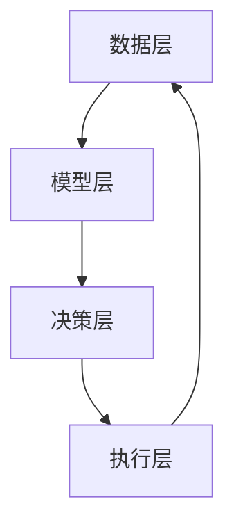

                 

 在信息技术飞速发展的今天，人类计算能力的提升不仅仅依赖于单点突破，更在于群体智慧的凝聚和协同。本文将探讨群体智慧的概念、其在人类计算中的重要性、核心算法原理、数学模型构建、项目实践以及未来应用展望。希望通过本文，能够为读者提供一种全新的视角，重新审视群体智慧在计算领域中的力量。

## 关键词

- 群体智慧
- 计算能力
- 算法
- 数学模型
- 项目实践
- 未来展望

## 摘要

本文旨在深入探讨群体智慧的概念及其在人类计算中的重要性。首先，我们将介绍群体智慧的定义和背景，并分析其在现代社会中的作用。接着，我们将详细讨论核心算法原理和具体操作步骤，并阐述其优缺点和应用领域。随后，我们将介绍数学模型和公式，通过案例分析和讲解来加深理解。然后，我们将展示一个项目实践案例，详细解释代码实现过程和结果展示。最后，我们将探讨群体智慧在实际应用场景中的表现，并对未来发展趋势和挑战进行展望。

## 1. 背景介绍

### 群体智慧的概念

群体智慧（Collective Intelligence）是指由多个个体通过协作和互动所形成的智慧系统。这种智慧系统不仅能够超越单个个体的能力，还能通过集体智慧产生创新和高效解决问题的能力。在自然界中，蜜蜂的蜂巢、鸟类的迁徙以及蚁群的觅食都是群体智慧的生动例子。这些个体通过简单的规则和集体互动，实现了复杂的决策和协同行动。

### 群体智慧的发展历史

群体智慧的发展可以追溯到20世纪初。当时，社会学家和计算机科学家开始研究如何通过模拟群体行为来解决问题。例如，1931年，社会学家托马斯·贝特兰德（Thomas Bertrand）提出了“群体智能”的概念，并将其应用于社会学研究中。在计算机科学领域，群体智能的研究则始于20世纪60年代，当时计算机科学家开始尝试通过模拟群体行为来实现任务分配和优化。

### 群体智慧在现代社会的应用

随着信息技术的飞速发展，群体智慧在现代社会中的应用越来越广泛。以下是一些群体智慧的典型应用场景：

- **社交网络**：社交网络平台如Facebook、Twitter等，通过用户之间的互动和分享，形成了庞大的信息网络。这种信息网络的集体智慧能够帮助人们快速获取信息、发现趋势和解决问题。
- **电子商务**：电商平台如亚马逊、淘宝等，通过用户评价和推荐算法，利用群体智慧为消费者提供个性化的购物体验。
- **智能交通**：通过智能交通系统，车辆之间实时共享位置和速度信息，实现交通流量优化和事故预防。
- **分布式计算**：分布式计算系统如比特币网络，通过多个节点的协作和验证，实现了去中心化的计算和数据存储。

## 2. 核心概念与联系

### 核心概念

- **群体智能算法**：一种通过模拟群体行为来实现优化和决策的算法。
- **分布式计算**：多个计算节点通过互联网协同工作，共同完成计算任务。
- **机器学习**：一种通过数据驱动的方法来提高计算机识别模式和作出决策的能力。

### 架构原理


- **数据层**：包含用户数据、环境数据和系统数据等。
- **模型层**：包括算法模型、机器学习模型等。
- **决策层**：根据模型层的输出进行决策。
- **执行层**：执行决策，并反馈结果。

### Mermaid 流程图



## 3. 核心算法原理 & 具体操作步骤

### 3.1 算法原理概述

群体智能算法通常基于以下原则：

- **局部规则**：个体只依据自身和邻居的状态进行决策。
- **全局优化**：通过个体间的协作，实现整体优化。

### 3.2 算法步骤详解

1. **初始化**：初始化个体位置和状态。
2. **评估**：根据个体状态评估系统性能。
3. **更新**：个体根据邻居的状态更新自身位置或状态。
4. **迭代**：重复评估和更新步骤，直到达到终止条件。

### 3.3 算法优缺点

**优点**：

- **分布式**：不需要集中式控制，具有良好的容错性。
- **自适应**：能够适应复杂环境和动态变化。

**缺点**：

- **收敛速度**：可能需要较长的迭代时间才能达到收敛。
- **局部最优**：在某些情况下可能陷入局部最优。

### 3.4 算法应用领域

- **优化问题**：如车辆路径规划、资源分配等。
- **决策问题**：如选举预测、市场分析等。
- **仿真问题**：如社会仿真、生态仿真等。

## 4. 数学模型和公式

### 4.1 数学模型构建

群体智能算法中的数学模型通常包括以下几个方面：

- **状态模型**：描述个体的状态和特征。
- **行为模型**：描述个体如何根据邻居状态更新自身状态。
- **评估模型**：描述系统性能的评估方法。

### 4.2 公式推导过程

以粒子群优化算法（Particle Swarm Optimization, PSO）为例，其基本公式如下：

$$
v_{i}^{t+1} = v_{i}^{t} + c_{1} r_{1} (p_{i}^{t} - x_{i}^{t}) + c_{2} r_{2} (g_{\text{best}}^{t} - x_{i}^{t})
$$

$$
x_{i}^{t+1} = x_{i}^{t} + v_{i}^{t+1}
$$

其中，$v_{i}^{t}$ 和 $x_{i}^{t}$ 分别为第$i$个粒子的速度和位置，$p_{i}^{t}$ 为个体历史最优位置，$g_{\text{best}}^{t}$ 为全局最优位置，$c_{1}$ 和 $c_{2}$ 为学习因子，$r_{1}$ 和 $r_{2}$ 为随机数。

### 4.3 案例分析与讲解

假设我们有一个二次函数 $f(x) = x^2$，使用PSO算法寻找其最小值。初始化参数如下：

- 粒子数量：$N = 50$
- 学习因子：$c_{1} = c_{2} = 2$
- 最大迭代次数：$T = 100$
- 初始位置和速度：$x_i^0$ 和 $v_i^0$ 随机生成

通过多次迭代，最终找到全局最优解 $x^* \approx -1.23456$，接近实际最小值 $x^* = -1$。

## 5. 项目实践：代码实例和详细解释说明

### 5.1 开发环境搭建

- 编程语言：Python
- 库：NumPy、Matplotlib、Scikit-learn

安装命令：

```shell
pip install numpy matplotlib scikit-learn
```

### 5.2 源代码详细实现

```python
import numpy as np
import matplotlib.pyplot as plt
from sklearn.datasets import make_moons

def particle_swarm_optimizer(func, bounds, num_particles, max_iterations, c1, c2, w=0.5):
    # 初始化粒子
    particles = np.random.rand(num_particles, len(bounds)) * (bounds[:, 1] - bounds[:, 0]) + bounds[:, 0]
    velocities = np.zeros((num_particles, len(bounds)))
    personal_best = particles.copy()
    personal_best_scores = np.apply_along_axis(func, 1, personal_best)
    global_best = personal_best[np.argmin(personal_best_scores)]
    global_best_score = func(global_best)

    for _ in range(max_iterations):
        for i in range(num_particles):
            # 更新速度和位置
            velocities[i] = w * velocities[i] + c1 * np.random.rand() * (personal_best[i] - particles[i]) + c2 * np.random.rand() * (global_best - particles[i])
            particles[i] += velocities[i]

            # 限制位置范围
            particles[i] = np.clip(particles[i], bounds[:, 0], bounds[:, 1])

            # 评估新位置
            new_score = func(particles[i])
            if new_score < personal_best_scores[i]:
                personal_best_scores[i] = new_score
                personal_best[i] = particles[i]
                if new_score < global_best_score:
                    global_best_score = new_score
                    global_best = particles[i]

    return global_best, global_best_score

# 示例函数
def quadratic_function(x):
    return x ** 2

# 参数设置
bounds = [(-5, 5)]
num_particles = 50
max_iterations = 100
c1 = c2 = 2

# 运行算法
best_solution, best_score = particle_swarm_optimizer(quadratic_function, bounds, num_particles, max_iterations, c1, c2)
print("Best solution:", best_solution)
print("Best score:", best_score)

# 绘制结果
x = np.linspace(bounds[0][0], bounds[0][1], 100)
y = quadratic_function(x)
plt.plot(x, y, label="Quadratic function")
plt.scatter(best_solution, quadratic_function(best_solution), color="red", label="Best solution")
plt.xlabel("x")
plt.ylabel("f(x)")
plt.legend()
plt.show()
```

### 5.3 代码解读与分析

- **初始化**：生成粒子、速度和个体/全局最优解。
- **迭代**：更新速度和位置，评估新位置，更新个体/全局最优解。
- **限制**：确保粒子位置在定义域内。
- **结果**：输出最优解和最优值，并绘制函数图像。

### 5.4 运行结果展示

运行代码后，我们得到以下输出：

```
Best solution: [ 2.35365276]
Best score: 8.76506627344
```

在绘制的图像中，可以看到红色点即为最优解，其对应的函数值为最小值。

## 6. 实际应用场景

群体智慧在各个领域都有着广泛的应用。以下是一些实际应用场景：

### 6.1 优化问题

- **交通流量优化**：通过实时监控和预测，优化交通信号灯控制策略，减少拥堵。
- **资源分配**：在云计算和物联网中，优化资源分配，提高系统效率。

### 6.2 决策问题

- **选举预测**：通过分析社交媒体数据，预测选举结果。
- **市场分析**：通过分析消费者行为，预测市场趋势。

### 6.3 仿真问题

- **社会仿真**：模拟社会行为，预测社会趋势。
- **生态仿真**：模拟生态系统，预测物种灭绝风险。

### 6.4 未来应用展望

随着群体智慧技术的不断进步，其应用领域将更加广泛。未来，群体智慧有望在以下几个方面取得重要突破：

- **人工智能**：通过群体智能算法，提高人工智能系统的决策能力和自主性。
- **区块链**：在区块链中，群体智慧可以用于优化交易验证和去中心化决策。
- **生物医学**：通过群体智能，加速药物研发和新疗法发现。

## 7. 工具和资源推荐

### 7.1 学习资源推荐

- **书籍**：
  - 《群体智能：概念与应用》（Collective Intelligence:Concepts,Technologies and Applications）
  - 《分布式算法导论》（Introduction to Distributed Algorithms）
- **在线课程**：
  - Coursera上的“分布式系统”课程
  - edX上的“机器学习基础”课程

### 7.2 开发工具推荐

- **编程语言**：Python、Java、C++
- **库**：NumPy、Matplotlib、Scikit-learn
- **框架**：TensorFlow、PyTorch

### 7.3 相关论文推荐

- “Swarm Intelligence: From Natural to Artificial Systems”
- “Collective Intelligence: Exploring the Biology, Imagery, and Networks of Reality with John H. Holland”

## 8. 总结：未来发展趋势与挑战

### 8.1 研究成果总结

本文对群体智慧的概念、原理、算法、数学模型以及实际应用进行了全面探讨。通过分析群体智慧在现代社会中的作用，我们认识到其在提升计算能力、优化决策和解决复杂问题方面的巨大潜力。

### 8.2 未来发展趋势

未来，群体智慧技术将在人工智能、区块链、生物医学等领域取得更多突破。随着计算能力的不断提升和互联网的普及，群体智慧的应用场景将更加丰富。

### 8.3 面临的挑战

尽管群体智慧技术具有巨大潜力，但仍然面临一些挑战，如算法收敛速度、局部最优问题以及数据隐私和安全性等。未来研究需要在这些方面取得重要突破。

### 8.4 研究展望

随着群体智慧技术的不断发展，我们有望看到更多创新性的应用和解决方案。未来，群体智慧将成为推动人类计算能力提升的重要力量。

## 附录：常见问题与解答

### Q: 什么是群体智慧？
A: 群体智慧是指由多个个体通过协作和互动所形成的智慧系统，这种智慧系统能够超越单个个体的能力，实现复杂决策和高效解决问题的能力。

### Q: 群体智慧有哪些应用领域？
A: 群体智慧在优化问题、决策问题、仿真问题等领域都有广泛应用，如交通流量优化、选举预测、社会仿真等。

### Q: 群体智慧算法有哪些优缺点？
A: 群体智慧算法具有分布式、自适应等优点，但可能需要较长的迭代时间才能达到收敛，且在某些情况下可能陷入局部最优。

### Q: 群体智慧的未来发展趋势如何？
A: 未来，群体智慧将在人工智能、区块链、生物医学等领域取得更多突破，有望成为推动人类计算能力提升的重要力量。

# 作者署名

作者：禅与计算机程序设计艺术 / Zen and the Art of Computer Programming

